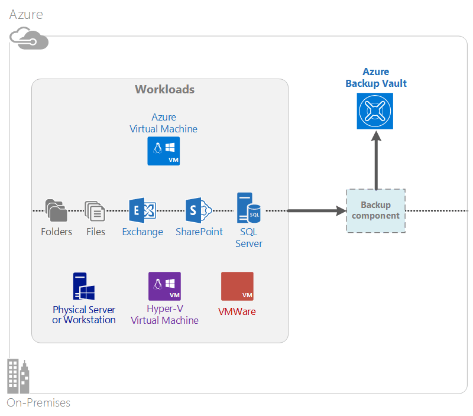

<properties
    pageTitle="Was ist eine Sicherung Azure? | Microsoft Azure"
    description="Mithilfe von Azure Sicherung und Wiederherstellung Services können Sie sichern und Wiederherstellen von Daten und Anwendungen von Windows-Servern, Windows-Clientcomputern, System Center DPM-Servern und Azure-virtuellen Computern."
    services="backup"
    documentationCenter=""
    authors="markgalioto"
    manager="cfreeman"
    editor="tysonn"
    keywords="Sicherung und Wiederherstellung; Wiederherstellung Dienste; zusätzliche Lösungen"/>

<tags
    ms.service="backup"
    ms.workload="storage-backup-recovery"
    ms.tgt_pltfrm="na"
    ms.devlang="na"
    ms.topic="get-started-article"
    ms.date="10/19/2016"
    ms.author="jimpark; trinadhk"/>

# Was ist eine Sicherung Azure?
Azure Sicherung ist der Dienst, den Sie sichern und Wiederherstellen von Daten in der Microsoft-Cloud verwenden. Ihre vorhandene lokalen oder externen Sicherung Lösung ersetzt durch eine Cloud-basierte Lösung, die zuverlässig, sichere und Kosten Mitbewerber ist. Darüber hinaus werden Posten schützen, die in der Cloud ausgeführt werden. Azure Sicherung bietet Wiederherstellung Services basieren auf eine hervorragende Infrastruktur, die skalierbare, robuste und hochgradig verfügbar ist.

[Schauen Sie sich einen Überblick über Azure Sicherung video](https://azure.microsoft.com/documentation/videos/what-is-azure-backup/)

## Gründe für die Verwendung von Azure Sicherung
Traditionelle Sicherung Lösungen haben entwickeltes damit die Cloud als Endpunkt auf einem Datenträger oder Band behandelt werden. Obwohl dieser Ansatz einfach ist, ist es auch begrenzt. Es ist nicht vollständig nutzen einer zugrunde liegenden Cloudplattform und in eine Lösung nicht effizient, wodurch teurer übersetzt.
Im Gegensatz dazu bietet Azure Sicherung alle die Vorteile einer Sicherung leistungsfähige und kostengünstiger Cloud-Lösung. Hier sind einige der wichtigsten Vorteile, die Sicherung Azure bereitstellt.

| Feature | Vorteile |
| ------- | ------- |
| Automatische Speicher-management | Keine Investitionen ist für lokale Speichergeräte erforderlich. Azure Sicherung automatisch reserviert und verwaltet die Sicherung Speicherung und ein Modells Bezahlung-als-Nutzung Verbrauch verwendet. |
| Unbegrenzte Skalierung | Nutzen Sie die Vorteile der hohen Verfügbarkeit Garantien ohne Aufwand Wartung und Überwachung. Azure Sicherung werden die zugrunde liegenden Leistungsfähigkeit und Azure-Cloud-Skala mit seinen Funktionen nicht zudringliche automatische Skalierung verwendet. |
| Mehrere Speicheroptionen | Wählen Sie aus der Sicherungsdatei Speicher je nach Bedarf:<li>Ein lokales redundante Speicherung blockieren Blob eignet sich optimal für Kunden Preis-Lösung und weiterhin hilft, Daten vor lokalen Hardware-Fehlern zu schützen. <li>Geo-Replikation blockieren Blob-Speicher bietet drei mehr Kopien in einem gepaarten Datencenter. Diese zusätzlichen Kopien können Sie sicherstellen, dass die Sicherung Daten hoch verfügbar ist, auch wenn eine Azure Websiteebene Datenverluste auftreten. |
| Unbegrenzte Datenübertragung | Während einer Wiederherstellung aus dem Tresor Sicherung ist kostenlos für Ausgang (ausgehend) Daten zu übertragen. Daten für bestimmte Azure ist zudem kostenlos. Funktioniert mit dem Import-Dienst, wo es verfügbar ist. |
| Daten-Verschlüsselung | Daten-Verschlüsselung ermöglicht sichere Übertragung und Speicherung Kundendaten in der öffentlichen Cloud. Das Kennwort für die Verschlüsselung gespeichert ist, an der Quelle, und er nie übertragen oder in Azure gespeichert. Der Schlüssel ist erforderlich, um die Daten wiederherstellen, und nur der Kunden hat Vollzugriff auf die Daten im Dienst. |  
| Anwendung konsistente Sicherung | Anwendung konsistent Sicherungskopien auf Windows können Sie sicherstellen, dass die Updates zum Zeitpunkt der wiederherstellen, die das Ziel der Wiederherstellung Zeit reduziert, nicht erforderlich sind. Dadurch wird die Kunden schneller in einer laufenden Zustand zurück. |
| Langfristig | Statt Bändern Sicherung Lösungen, Kunden können nach Azure, eine überzeugende Band-ähnliche Lösung zu niedrigen Kosten bietet bezahlen. |

## Azure Sicherung Komponenten
Da die Sicherung einer Sicherung Hybrid-Lösung ist, besteht es mehrere Komponenten, die zusammenarbeiten, aktivieren End-to-End-sichern und Wiederherstellen von Workflows aus.

### Szenarien für die Bereitstellung

| Komponente | Kann in Azure werden bereitgestellt? | Werden lokale bereitgestellten können verwendet? | Zielspeicher unterstützt|
| --- | --- | --- | --- |
| Azure Sicherung agent | 
**Ja**
 
Der Sicherung Azure-Agent kann auf einem beliebigen Windows Server virtuellen Computer bereitgestellt werden, die in Azure ausgeführt wird.
 | 
**Ja**
 
Der Sicherung Agent kann auf jedem Windows Server virtueller Computer oder physischen Computer bereitgestellt werden.
 | 
Azure Sicherung Tresor
 |
| System Center Data Protection Manager (DPM) | 
**Ja**

Weitere Informationen [zum Auslastung in Azure mithilfe von System Center DPM schützen](http://blogs.technet.com/b/dpm/archive/2014/09/02/azure-iaas-workload-protection-using-data-protection-manager.aspx).
 | 
**Ja**
 
Weitere Informationen [zum Schutz von Auslastung und virtuellen Computern in Ihrem Datencenter](https://technet.microsoft.com/library/hh758173.aspx).
 | 
Lokale Festplatte
 
Azure Sicherung Tresor,
 
Band (lokale nur)
 |
| Azure Sicherung Server | 
**Ja**

Weitere Informationen [zum Auslastung in Azure mithilfe von Azure Sicherungsserver zu schützen](backup-azure-microsoft-azure-backup.md).
 | 
**Ja**
 
Weitere Informationen [zum Auslastung in Azure mithilfe von Azure Sicherungsserver zu schützen](backup-azure-microsoft-azure-backup.md).
 | 
Lokale Festplatte
 
Azure Sicherung Tresor
 |
| Azure Sicherung (virtueller Computer mit der Erweiterung) | 
**Ja**

Teil der Azure-Struktur

Speziell für die [Sicherungskopie der Azure-Infrastruktur als eine Service (IaaS) virtuellen Computern](backup-azure-vms-introduction.md).
 | 
**Nein**
 
Verwenden Sie System Center DPM virtuellen Computern im Datencenter sichern.
 | 
Azure Sicherung Tresor
 |

### Komponente Ebene vor- und Nachteile

| Komponente | Vorteile | Einschränkungen | Genauigkeit der Wiederherstellung |
| --- | --- | --- | --- |
| Azure Sicherung (MARS) agent | <li>Können sichern Dateien und Ordner auf einem Computer mit Windows-Betriebssystem gleich, ob es physische oder virtuelle (virtuellen Computern kann an einer beliebigen Stelle auf lokale oder Azure)<li>Keine separaten Sicherung Server erforderlich<li>Azure Sicherung Tresor verwendet | <li>Wiederherstellen von drei Mal eine Tag Sicherungsdatei/Ebene<li>Datei/Ordner/Lautstärke Ebene Wiederherstellen nur, nicht bekannt<li>Keine Unterstützung für Linux | Dateien/Ordner/Datenträger |
| System Center Data Protection Manager | <li>App bewusst Momentaufnahmen (VSS)<li>Vollständige Flexibilität für den Zeitpunkt Sicherungskopien ausführen<li>Wiederherstellung Genauigkeit (alle)<li>Azure Sicherung Tresor können verwendet werden.<li>Linux Support (falls auf Hyper-V gehostet wird) | <li>Fehlende heterogene Unterstützung (VMware virtueller Computer sichern, Oracle Arbeitsbelastung sichern).  | Dateien/Ordner/Datenträger / Virtuellen Computern/applications |
| Zusätzliche Microsoft Azure-Server | <li>App bewusst Momentaufnahmen (VSS)<li>Vollständige Flexibilität für den Zeitpunkt Sicherungskopien ausführen<li>Wiederherstellung Genauigkeit (alle)<li>Azure Sicherung Tresor können verwendet werden.<li>Linux Support (falls auf Hyper-V gehostet wird)<li>Eine Lizenz System Center sind nicht erforderlich. | <li>Fehlende heterogene Unterstützung (VMware virtueller Computer sichern, Oracle Arbeitsbelastung sichern).<li>Immer erfordert live Azure-Abonnements<li>Keine Unterstützung für Band Sicherung | Dateien/Ordner/Datenträger / Virtuellen Computern/applications |
| Azure Neuerung Sicherung | <li>Systemeigene Sicherungskopien für Windows/Linux<li>Keine bestimmten Agenteninstallation erforderlich<li>Fabric Ebene Sicherung mit keine zusätzliche Infrastruktur erforderlich | <li>Einmal pro Tag wieder nach oben/Datenträger Ebene wiederherstellen<li>Kann nicht auf eine lokale sichern. | Virtuellen Computern Alle Datenträger (mit PowerShell) |

## Welche Anwendungen und Auslastung gesichert werden können?

| Arbeitsbelastung | Quellcomputer | Azure Sicherung Lösung |
| --- | --- |---|
| Dateien und Ordner | WindowsServer | 
[Azure Sicherung Agent](backup-configure-vault.md),
 
[System Center DPM](backup-azure-dpm-introduction.md) (+ der Sicherung von Azure-Agent)
 
[Azure Sicherung Server](backup-azure-microsoft-azure-backup.md) (einschließlich den Sicherung von Azure-Agent)
  |
| Dateien und Ordner | Windows-client | 
[Azure Sicherung Agent](backup-configure-vault.md),
 
[System Center DPM](backup-azure-dpm-introduction.md) (+ der Sicherung von Azure-Agent)
 
[Azure Sicherung Server](backup-azure-microsoft-azure-backup.md) (einschließlich den Sicherung von Azure-Agent)
  |
| Hyper-V virtuellen Computern (Windows) | WindowsServer | 
[System Center DPM](backup-azure-backup-sql.md) (+ der Sicherung von Azure-Agent)
 
[Azure Sicherung Server](backup-azure-microsoft-azure-backup.md) (einschließlich den Sicherung von Azure-Agent)
 |
| Hyper-V virtuellen Computern (Linux) | WindowsServer | 
[System Center DPM](backup-azure-backup-sql.md) (+ der Sicherung von Azure-Agent)
 
[Azure Sicherung Server](backup-azure-microsoft-azure-backup.md) (einschließlich den Sicherung von Azure-Agent)
  |
| Microsoft SQL Server | WindowsServer | 
[System Center DPM](backup-azure-backup-sql.md) (+ der Sicherung von Azure-Agent)
 
[Azure Sicherung Server](backup-azure-microsoft-azure-backup.md) (einschließlich den Sicherung von Azure-Agent)
  |
| Microsoft SharePoint | WindowsServer | 
[System Center DPM](backup-azure-backup-sql.md) (+ der Sicherung von Azure-Agent)
 
[Azure Sicherung Server](backup-azure-microsoft-azure-backup.md) (einschließlich den Sicherung von Azure-Agent)
   |
| Microsoft Exchange |  WindowsServer | 
[System Center DPM](backup-azure-backup-sql.md) (+ der Sicherung von Azure-Agent)
 
[Azure Sicherung Server](backup-azure-microsoft-azure-backup.md) (einschließlich den Sicherung von Azure-Agent)
   |
| IaaS Azure-virtuellen Computern (Windows) | - | [Azure Sicherung (virtueller Computer mit der Erweiterung)](backup-azure-vms-introduction.md) |
| IaaS Azure-virtuellen Computern (Linux) | - | [Azure Sicherung (virtueller Computer mit der Erweiterung)](backup-azure-vms-introduction.md) |

## Cloud und Linux-support

| Komponente | Cloud-Support | Linux (Azure unterstützt) Support |
| --- | --- | --- |
| Azure Sicherung (MARS) agent | Ja | Keine (nur Windows-basierten Agent) |
| System Center Data Protection Manager | Ja (Agent in Gast) | Nur die Datei nur konsistente Sicherung Hyper-V (nicht Azure virtueller Computer) ist möglich |
| Azure Sicherung Server (MABS) | Ja (Agent in Gast) | Nur Hyper-V (nicht Azure virtueller Computer) Datei nur konsistente Sicherung möglich ist (identisch mit DPM) |
| Azure Neuerung Sicherung | Ja | Ja |

[AZURE.INCLUDE [learn-about-deployment-models](../../includes/learn-about-deployment-models-include.md)]

## Sichern und Wiederherstellen von Premium Speicher virtuellen Computern

Der Dienst Azure Sicherung Loss jetzt Premium Speicher virtuellen Computern.

### Sichern von Premium Speicher virtuellen Computern

Beim Sichern Premium Speicher virtuellen Computern, erstellt der Dienst Sicherung staging temporär im Speicher Premium Konto an. Staging Standort, mit dem Namen "AzureBackup-" ist gleich der Größe der gesamten Daten Premium Datenträger, die den virtuellen Computer angefügt.

>[AZURE.NOTE] Ändern oder Bearbeiten von Verzeichnis "staging" nicht.

Nachdem die Sicherung beendet wurde, wird der staging Speicherort gelöscht. Der Preis von Speicherplatz für das staging Speicherort verwendet ist mit allen [Premium Speicher Preise](../storage/storage-premium-storage.md#pricing-and-billing)konsistent.

### Wiederherstellen von Premium Speicher virtuellen Computern

Premium Speicher virtueller Computer können entweder Speicher Premium oder normalen Speicher wiederhergestellt werden. Wiederherstellen eines Premium Speicher virtueller Computer Wiederherstellungspunkts auf Premium Speicher versteht typische der Wiederherstellung. Es kann jedoch kostengünstiger zum Wiederherstellen eines Premium Speicher virtueller Computer Wiederherstellungspunkts standardmäßigen Speicher sein. Diese Art der Wiederherstellung kann verwendet werden, wenn Sie eine Teilmenge der Dateien aus dem virtuellen Computer benötigen.

## Funktionalität
Diese fünf Tabellen zusammenfassen wie zusätzliche Funktionen in den verschiedenen Komponenten verarbeitet wird.

### Speicher

| Feature | Azure Sicherung agent | System Center DPM | Azure Sicherung Server | Azure Sicherung (virtueller Computer mit der Erweiterung) |
| ------- | --- | --- | --- | ---- |
| Azure Sicherung Tresor | ![Ja][green] | ![Ja][green] | ![Ja][green] | ![Ja][green] |
| Festplattenspeicher | | ![Ja][green] | ![Ja][green] |  |
| Bandspeicher | | ![Ja][green] |  | |
| Komprimierung (in Sicherung Tresor) | ![Ja][green] | ![Ja][green]| ![Ja][green] | |
| Inkrementell Sicherung | ![Ja][green] | ![Ja][green] | ![Ja][green] | ![Ja][green] |
| Datenträger deduplication | | ![Teilweise][yellow] | ![Teilweise][yellow]| | |

Der Sicherung Tresor ist das Speicherziel bevorzugte über alle Komponenten. System Center DPM und Sicherungsserver bieten auch die Möglichkeit, eine Kopie der lokalen Festplatte verfügen. Nur System Center DPM bietet jedoch die Option zum Schreiben von Daten zu einem Band-Speichergerät.

#### Inkrementell Sicherung
Jeder Komponente unterstützt inkrementell Sicherung unabhängig von der Zielspeicher (Datenträger, Band, Sicherung Tresor). Inkrementell Sicherung wird sichergestellt, dass Sicherungskopien Speicherplatz und effizient, indem Sie nur diesen seit der letzten Sicherung vorgenommenen Änderungen übertragen.

#### Komprimierung
Sicherungskopien werden komprimiert, um die erforderlichen Speicherplatz zu verringern. Die einzige Komponente, die keine Komprimierung verwendet wird, die Erweiterung virtueller Computer. Mit der Erweiterung virtueller Computer alle Sicherung Daten kopiert aus der Kundenkontos Speicher zum Sicherung Tresor in derselben Region ohne Komprimierung. Während der vertraut ohne Komprimierung etwas vergrößert die Speicherung verwendet haben, Speichern der Daten ohne Komprimierung kürzere ermöglicht.

#### Deduplication
Deduplication wird für System Center DPM und Sicherungsserver unterstützt, wenn es [in einem Hyper-V virtuellen Computern bereitgestellt](http://blogs.technet.com/b/dpm/archive/2015/01/06/deduplication-of-dpm-storage-reduce-dpm-storage-consumption.aspx)wird. Deduplication erfolgt Ebene der Host mithilfe von Windows Server Deduplication auf virtuellen Festplatten (virtuelle Festplatten), der die den virtuellen Computern Speichern von Sicherungskopien zugeordnet sind.

>[AZURE.WARNING] Deduplication ist nicht verfügbar in Azure für eine Sicherung Komponenten. Wenn System Center DPM und Sicherungsserver in Azure bereitgestellt werden, können nicht die mit dem virtuellen Computer verbundenen Speicherdatenträger deduplicated.

### Sicherheit

| Feature | Azure Sicherung agent | System Center DPM | Azure Sicherung Server | Azure Sicherung (virtueller Computer mit der Erweiterung) |
| ------- | --- | --- | --- | ---- |
| Netzwerk Sicherheit (Azure) | ![Ja][green] |![Ja][green] | ![Ja][green] | ![Teilweise][yellow]|
| Datenschutz (in Azure) | ![Ja][green] |![Ja][green] | ![Ja][green] | ![Teilweise][yellow]|

Zusätzliche Datenverkehr von Ihren Servern zum Sichern Tresor wird mithilfe von erweiterte Verschlüsselung Standard 256 verschlüsselt. Die Daten werden über einen sicheren HTTPS-Link gesendet. Die gesicherten Daten werden auch in die Sicherung Tresor in verschlüsselter Form gespeichert. Nur der Kunden enthält das Kennwort zum Aufheben der Sperre diese Daten. Microsoft kann die gesicherten Daten zu einem beliebigen Zeitpunkt nicht entschlüsseln.

>[AZURE.WARNING] Der Schlüssel zum Verschlüsseln der Sicherungsdatei Daten ist nur in Verbindung mit dem Kunden präsentieren. Microsoft behält keine Kopie in Azure und hat keinen Zugriff auf die-Taste. Wenn Sie die Taste falsch eingefügte ist, kann nicht Microsoft die gesicherten Daten wiederherstellen.

Einrichten von Verschlüsselung *innerhalb* des virtuellen Computers sichern Azure-virtuellen Computern benötigt werden. Verwenden von BitLocker auf Windows-virtuellen Computern und **dm-Crypt** auf Linux virtuellen Computern. Azure Sicherung wird nicht automatisch zusätzliche Daten verschlüsselt, die über diesen Pfad stammen.

### Unterstützte Auslastung

| Feature | Azure Sicherung agent | System Center DPM | Azure Sicherung Server | Azure Sicherung (virtueller Computer mit der Erweiterung) |
| ------- | --- | --- | --- | ---- |
| Computer mit Windows Server – Dateien und Ordner | ![Ja][green] | ![Ja][green] | ![Ja][green] | |
| Windows-Clientcomputer – Dateien und Ordner | ![Ja][green] | ![Ja][green] | ![Ja][green] | |
| Hyper-V virtuellen Computern (Windows) | | ![Ja][green] | ![Ja][green] | |
| Hyper-V virtuellen Computern (Linux) | | ![Ja][green] | ![Ja][green] | |
| Microsoft SQL Server | | ![Ja][green] | ![Ja][green] | |
| Microsoft SharePoint | | ![Ja][green] | ![Ja][green] | |
| Microsoft Exchange  | | ![Ja][green] | ![Ja][green] | |
| Azure-virtuellen Computern (Windows) | | | | ![Ja][green] |
| Azure-virtuellen Computern (Linux) | | | | ![Ja][green] |

### Netzwerk

| Feature | Azure Sicherung agent | System Center DPM | Azure Sicherung Server | Azure Sicherung (virtueller Computer mit der Erweiterung) |
| ------- | --- | --- | --- | ---- |
| Netzwerk-Komprimierung (mit dem Sicherung Server) | | ![Ja][green] | ![Ja][green] | |
| Netzwerk-Komprimierung (zum Sicherung Tresor) | ![Ja][green] | ![Ja][green] | ![Ja][green] | |
| Netzwerkprotokoll (mit dem Sicherung Server) | | TCP | TCP | |
| Netzwerkprotokoll (zum Sicherung Tresor) | HTTPS | HTTPS | HTTPS | HTTPS |

Daran, dass die Erweiterung virtueller Computer die Daten direkt aus dem Azure-Speicher-Konto über das Speichernetzwerk liest, ist es nicht erforderlich, diesen Datenverkehr zu optimieren. Der Datenverkehr wird über das Speichernetzwerk lokale im Azure Datencenter, Problem gibt es nicht unbedingt erforderlich, damit die Komprimierung aus Gründen der Bandbreite.

Wenn Sie Ihre Daten auf einem Sicherung-Server (DPM oder zusätzliche Server) sichern, kann Datenverkehr vom primären Server auf dem Server zusätzliche komprimiert werden, um Bandbreite zu speichern.

#### Netzwerk Begrenzungsebene
Der Sicherung von Azure-Agent bietet Drosselung Funktionalität: können Sie steuern, wie die Bandbreite während der Datenübertragung verwendet wird. Begrenzungsebene kann hilfreich sein, wenn Sie zum Sichern von Daten während der Arbeitszeiten jedoch möchten nicht, dass die Sicherung beeinträchtigen andere Datenverkehr im Internet. Begrenzungsebene für Daten gilt durchstellen zum Sichern und Wiederherstellen von Aktivitäten.

### Sichern und Aufbewahrungsrichtlinien

|  | Azure Sicherung agent | System Center DPM | Azure Sicherung Server | Azure Sicherung (virtueller Computer mit der Erweiterung) |
| --- | --- | --- | --- | --- |
| Zusätzliche Häufigkeit (zum Sicherung Tresor) | Drei Sicherungskopien pro Tag | Zwei Sicherungskopien pro Tag |Zwei Sicherungskopien pro Tag | Eine Sicherung pro Tag |
| Zusätzliche Häufigkeit (auf einem Datenträger) | Nicht verfügbar | 
Alle 15 Minuten für SQL Server
 
Jede Stunde für aufgrund der Ergebnisse
 | 
Alle 15 Minuten für SQL Server
 
Jede Stunde für aufgrund der Ergebnisse
 |Nicht verfügbar |
| Aufbewahrungsoptionen | Täglich, wöchentlich, monatlich, jährlich | Täglich, wöchentlich, monatlich, jährlich | Täglich, wöchentlich, monatlich, jährlich |Täglich, wöchentlich, monatlich, jährlich |
| Aufbewahrungszeitraum | Bis zu 99 Jahren | Bis zu 99 Jahren | Bis zu 99 Jahren | Bis zu 99 Jahren |
| Wiederherstellungspunkte in Tresor Sicherung | Unbegrenzte | Unbegrenzte | Unbegrenzte | Unbegrenzte |
| Wiederherstellungspunkte auf lokale Festplatte | Nicht verfügbar | 64 für Dateiserver,  448 für Anwendungsserver | 64 für Dateiserver,  448 für Anwendungsserver |Nicht verfügbar |
| Wiederherstellungspunkte auf Band | Nicht verfügbar | Unbegrenzte | Nicht verfügbar | Nicht verfügbar |

## Was ist die Tresor Anmeldeinformationen-Datei?

Die Tresor Anmeldeinformationen Datei ist ein Zertifikat vom Portal für jede zusätzliche Tresor generiert. Im Portal uploads öffentlichen Schlüssel klicken Sie dann auf die Service (ACS). Der private Schlüssel ist für den Benutzer bereitgestellt werden, wenn die Anmeldeinformationen herunterladen und dann während der Registrierung Computer eingegeben. Der private Schlüssel authentifiziert den Computer, um zusätzliche Daten zu einer identifizierten Tresor in die Sicherung Azure Service senden.

Die Anmeldeinformationen Tresor wird nur während der Registrierung Workflow verwendet. Es ist sicherstellen, dass Sie sicherstellen, dass die Datei Tresor Anmeldeinformationen nicht beeinträchtigt wird. Fällt in die Hände von einem beliebigen für nicht autorisierte Benutzer, kann die Datei Tresor Anmeldeinformationen auf anderen Computern mit der gleichen Tresor registrieren verwendet werden. Da die Sicherung Daten verschlüsselt sind, verwenden ein Kennwort, die nur an den Kunden gehören, können nicht jedoch vorhandene Sicherung Daten beeinträchtigt. Um dieses Problem zu verringern, sind Tresor Anmeldeinformationen in 48 Stunden Gültigkeitsdauer festgelegt. Während Sie herunterladen können die Anmeldeinformationen Tresor einer Sicherung Vaulting beliebig häufig, während des Registrierung Workflows gilt nur für die aktuelle Datei.

## Wie unterscheidet sich Azure Sicherung von Azure Website Wiederherstellung?
Viele Kunden Wiederherstellung Sicherung und Wiederherstellung verwechselt werden. Beide Daten erfassen und Wiederherstellen Semantik bereitstellen, allerdings werden deren Core nutzen.

Azure Sicherung Sicherungskopie von Daten lokal und in der Cloud. Azure Website Wiederherstellung koordiniert virtuellen Computers und physischen Replikation, Failover und Failback. Beide Dienste sind wichtig, da Ihre Disaster Wiederherstellung Lösung Ihre Daten zu schützen muss und entfernt (Sicherung) *und* beibehalten der Auslastung verfügbar (Website Wiederherstellung) auf, wenn Ausfall ausgeführt werden.

Die folgenden Konzepte Hilfe um Sicherung und Disaster Wiederherstellung wichtige Informationen zu erleichtern.

| Konzept | Details | Sicherung | Wiederherstellung (DR) |
| ------- | ------- | ------ | ----------------- |
| Wiederherstellung Punkt Ziel (RPO) | Der Umfang der akzeptabler Datenverlust, wenn eine Wiederherstellung ausgeführt werden soll. | Zusätzliche Lösungen enthält breit Streuung deren zulässigen RPO. Virtuellen Computern Sicherungskopien besitzen in der Regel eine RPO von einem Tag, Datenbanksicherungskopien RPOs so niedrig wie 15 Minuten. | Disaster Wiederherstellung Lösungen haben niedrig RPOs. Die DR-Kopie kann hinter nach ein paar Sekunden oder ein paar Minuten sein. |
| Ziel der Wiederherstellung Zeit (RTO) | Der Umfang der Zeit, die zum Abschließen einer Wiederherstellung oder wiederherstellen. | Aufgrund der größeren RPO-ist die Menge der Daten, die eine Sicherung Lösung verarbeiten muss in der Regel sehr viel höher, wodurch mehr RTOs. Beispielsweise kann dies zum Wiederherstellen von Daten von Bändern, abhängig von der Zeit, um das Band aus einem externen Standort transportieren dauert, Tage dauern. | Disaster Wiederherstellung Lösungen haben kleinere RTOs, da sie mehr synchron mit der Quelle sind. Weniger Änderungen verarbeitet werden müssen. |
| Aufbewahrungsrichtlinien | Wie lange die Daten gespeichert werden müssen | Für Szenarien, die Wiederherstellung (Beschädigung der Daten, unbeabsichtigtes Datei löschen, OS Fehler) erfordern, werden zusätzliche Daten in der Regel 30 Tage lang oder weniger lang aufbewahrt. Daten müssen aus Compliance-Sicht Monate oder sogar Jahre für gespeichert werden sollen. Zusätzliche Daten ist ideal für Archivierung in diesen Fällen. | Wiederherstellung benötigt nur Betrieb Wiederherstellungsdaten, die in der Regel ein paar Stunden oder bis zu einem Tag annimmt. Aufgrund der abgestimmte Datensammlung in DR Lösungen verwendet werden wird die Verwendung von DR-Daten für langfristig nicht empfohlen. |

## Nächste Schritte

Testen Sie eine einfache Azure Sicherung aus. Anweisungen finden Sie in diesem Lernprogramm:

- [Führen Sie Azure Sicherung](backup-try-azure-backup-in-10-mins.md)
- [Führen Sie Azure-virtuellen Computer Sicherung](backup-azure-vms-first-look.md)

Da diese Lernprogramme sichern Sie schnell, zeigen sie Sie nur den am häufigsten direkten Pfad für Ihre Daten sichern. Weitere Informationen zu den Typ des sichern Sie sehen möchten Sie:

- [Sichern von Windows-Computer](backup-configure-vault.md)
- [Sichern von Auslastung](backup-azure-microsoft-azure-backup.md)
- [Zusätzliche Azure IaaS virtuellen Computern](backup-azure-vms-prepare.md)

[green]: ./media/backup-introduction-to-azure-backup/green.png
[yellow]: ./media/backup-introduction-to-azure-backup/yellow.png
[red]: ./media/backup-introduction-to-azure-backup/red.png
