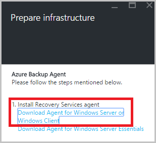
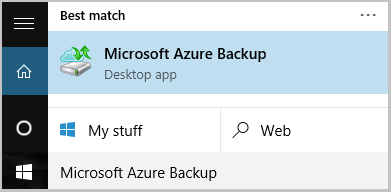

<properties
   pageTitle="Erfahren, wie Sie Dateien und Ordner aus Windows Azure mit Azure Sicherung mit dem Modell zur Bereitstellung von Ressourcenmanager sichern | Microsoft Azure"
   description="Informationen Sie zum Windows Server-Daten zu sichern, indem Sie eine Tresor erstellen, den Wiederherstellung Services-Agent installieren und Sichern von Dateien und Ordnern in Azure."
   services="backup"
   documentationCenter=""
   authors="markgalioto"
   manager="cfreeman"
   editor=""
   keywords="So sichern; So sichern"/>

<tags
   ms.service="backup"
   ms.workload="storage-backup-recovery"
   ms.tgt_pltfrm="na"
   ms.devlang="na"
   ms.topic="hero-article"
   ms.date="09/27/2016"
   ms.author="markgal;"/>

# Suchen Sie zuerst: Sichern von Dateien und Ordnern mit Azure Sicherung mit dem Modell zur Bereitstellung von Ressourcenmanager

In diesem Artikel wird erläutert, wie Sichern Sie Ihre Windows Server (oder Windows-Client) Dateien und Ordnern zum Azure mit Azure Sicherung Ressourcenmanager verwenden. Es ist ein Lernprogramm soll Sie die Grundlagen durchzuführen. Wenn Sie die ersten Schritte mit Azure sichern möchten, können Sie in den richtigen Ort ein.

Wenn Sie weitere Informationen zu Azure Sicherung erhalten möchten, lesen Sie diese [Übersicht](backup-introduction-to-azure-backup.md).

Sichern von Dateien und Ordnern in Azure müssen diese Aktivitäten:

 erhalten Sie ein Abonnement Azure (falls Sie noch keine haben). 
 Erstellen einer Wiederherstellungsdatei Services Tresor. 
 die erforderlichen Dateien herunterladen. 
 installieren und Registrieren der Wiederherstellung Services-Agent. 
 sichern Sie Ihre Dateien und Ordner.

## Schritt 1: Abrufen eines Azure-Abonnements

Wenn Sie ein Azure-Abonnement besitzen, erstellen Sie ein [kostenloses Konto](https://azure.microsoft.com/free/) , das Sie Azure Dienste zugreifen können.

## Schritt 2: Erstellen einer Wiederherstellungsdatei Services Tresor

Um Ihre Dateien und Ordner zu sichern, müssen Sie eine Wiederherstellung Services Tresor in der Region erstellen, in dem die Daten gespeichert werden sollen. Sie müssen ermitteln, wie Ihre Speicher repliziert werden sollen.

### Zum Erstellen einer Wiederherstellungsdatei Services Tresor

1. Wenn Sie bereits, melden Sie sich mit Ihrem Abonnement Azure [Azure-Portal](https://portal.azure.com/) nicht getan.

2. Im Menü Hub klicken Sie auf **Durchsuchen** , und geben Sie in der Liste der Ressourcen **Wiederherstellung Services** und **Wiederherstellung Services Depots**klicken Sie auf.

      

3. Klicken Sie im Menü **Depots Wiederherstellung Dienste** auf **Hinzufügen**.

    

    Das Wiederherstellung Services Tresor Blade geöffnet wird, werden Sie aufgefordert, einen **Namen**, **Abonnement**, **Ressourcengruppe**und **Position**angeben.

    

4. Geben Sie für den **Namen**einen Anzeigenamen ein, um den Tresor zu identifizieren.

5. Klicken Sie auf **Abonnement** zum finden in der Liste Verfügbare des Abonnements.

6. Klicken Sie auf **Ressourcengruppe** finden in der Liste Verfügbare Ressource Gruppen, oder klicken Sie auf **neu** , um eine neue Ressourcengruppe erstellen.

7. Klicken Sie auf **Speicherort** , um die geografische Region für den Tresor auswählen. Ihre Auswahl legt die geografische Region, in dem die Sicherung Daten gesendet wird.

8. Klicken Sie auf **Erstellen**.

    Wenn Sie Ihrem Tresor aufgeführt, nachdem es bereits abgelaufen ist angezeigt werden, klicken Sie auf **Aktualisieren**. Wenn die Liste aktualisiert wird, klicken Sie auf den Namen der Tresor.

### Um Speicherredundanz zu bestimmen.
Beim Erstellen einer Wiederherstellungsdatei Services Tresor legen Sie fest, wie Speicher repliziert wird.

1. Klicken Sie auf der neuen Tresor auf das Dashboard zu öffnen.

2. Klicken Sie in den **Einstellungen** Blade, die automatisch mit Ihrem Tresor Dashboard geöffnet wird auf **Sichern Infrastruktur**.

3. Klicken Sie in das Blade Sicherung Infrastruktur auf **Sicherungskonfiguration** , um den **Typ von Speicher Replikation**anzeigen.

    

4. Wählen Sie die entsprechenden Speicher Replikationsoption für den Tresor aus.

    

    Standardmäßig weist Ihrem Tresor Geo redundante Speicherung. Wenn Sie als einen Endpunkt primären Sicherung Speicher Azure verwenden, weiterhin Geo redundante Speicherung verwenden. Wenn Sie als einen Endpunkt nicht als Primärschlüssel Sicherung Speicher Azure verwenden, wählen Sie dann lokal redundante Speicherung, wodurch die Kosten des Speicherns von Daten in Azure reduziert werden. Weitere Informationen hierzu [Geo redundante](../storage/storage-redundancy.md#geo-redundant-storage) und [lokal redundante](../storage/storage-redundancy.md#locally-redundant-storage) Speicheroptionen in dieser [Übersicht](../storage/storage-redundancy.md).

Jetzt, da Sie eine Tresor erstellt haben, bereiten Sie Ihre Infrastruktur Sichern von Dateien und Ordnern durch die Microsoft Azure Wiederherstellung Services-Agents und Tresor Anmeldeinformationen herunterladen vor.

## Schritt 3 – Download-Dateien

1. Klicken Sie auf der Wiederherstellung Services Tresor Dashboard auf **Einstellungen** .

    

2. Klicken Sie auf **Erste Schritte > Sicherung** auf das Blade Einstellungen.

    

3. Klicken Sie auf die Sicherung Blade **Sicherung Zielsetzung** .

    

4. SELECT **lokalen** aus der Where ist Ihre Arbeitsbelastung ausgeführt? im Menü.

5. Wählen Sie **Dateien und Ordner** aus, die Sie vorgehen möchten Sicherung? Menü, und klicken Sie auf **OK**.

### Herunterladen des Wiederherstellung Services-Agents

1. Klicken Sie in das Blade **Infrastruktur vorbereiten** auf **Agent für Windows Server herunterladen oder Windows-Client** .

    

2. Klicken Sie im Popupfenster herunterladen auf **Speichern** . Standardmäßig ist die **MARSagentinstaller.exe** -Datei in den Ordner Downloads gespeichert.

### Tresor Anmeldeinformationen zum Herunterladen

1. Klicken Sie auf **herunterladen > Speichern** auf das Vorbereiten Infrastruktur Blade.

    

## Schritt 4 – installieren und Agent registrieren

>[AZURE.NOTE] Aktivieren von Sicherung über das Portal Azure wird in Kürze zur Verfügung. Zu diesem Zeitpunkt verwenden Sie die Microsoft Azure Wiederherstellung Services Agent lokal, um Ihre Dateien und Ordner zu sichern.

1. Suchen nach ein, und doppelklicken, klicken Sie auf die **MARSagentinstaller.exe** von im Ordner Downloads (oder einem anderen Speicherort).

2. Schließen Sie den Microsoft Azure Wiederherstellung Services-Agent-Setup-Assistenten. Um den Assistenten zu beenden, müssen Sie:

    - Wählen Sie einen Speicherort für die Installation und den Cache für Dokumente.
    - Geben Sie Ihre Proxy Serverinformationen, wenn Sie einen Proxyserver verwenden, um mit dem Internet verbinden.
    - Geben Sie Ihre Benutzer Namen und das Kennwort Details, wenn Sie einen authentifizierten Proxy verwenden.
    - Geben Sie die heruntergeladene Tresor Anmeldeinformationen
    - Speichern Sie das Kennwort für die Verschlüsselung an einem sicheren Ort.

    >[AZURE.NOTE] Wenn Sie das Kennwort vergessen oder verlieren, nicht Microsoft bei der die gesicherten Daten wiederherstellen. Speichern Sie die Datei an einem sicheren Ort. Es ist erforderlich, um eine Sicherung wiederherzustellen.

Der Agent ist jetzt installiert und Ihrem Computer zum Tresor registriert ist. Sie sind bereit sind, konfigurieren und planen die Sicherung.

## Schritt 5: Sichern von Dateien und Ordnern

Die ursprüngliche Sicherung umfasst zwei wichtige Aufgaben:

- Planen Sie die Sicherung
- Sichern von Dateien und Ordnern zum ersten Mal

Um die ursprüngliche Sicherung abgeschlossen haben, verwenden Sie den Microsoft Azure Wiederherstellung Services-Agent aus.

### Planen Sie die Sicherung

1. Öffnen des Microsoft Azure Wiederherstellung Services-Agents an. Sie können sie durch Suchen von Ihrem Computer für **Microsoft Azure Sicherung**suchen.

    

2. Klicken Sie in der Wiederherstellung Services-Agent auf **Sicherung planen**.

    

3. Klicken Sie auf der Seite Erste Schritte des Assistenten Sicherung Terminplan auf **Weiter**.

4. Wählen Sie Elemente auf der Seite Sicherung klicken Sie auf **Elemente hinzufügen**.

5. Wählen Sie die Dateien und Ordner, die Sie sichern möchten, und klicken Sie dann auf **OK**.

6. Klicken Sie auf **Weiter**.

7. Klicken Sie auf der Seite **Sicherung Terminplan angeben** Geben Sie den **Zeitplan Sicherungskopie** , und klicken Sie auf **Weiter**.

    Sie können (bei einer maximalen Satz dreimal pro Tag) täglich oder wöchentlich Sicherungen planen.

    

    >[AZURE.NOTE] Weitere Informationen dazu, wie Sie den Sicherung Zeitplan festlegen, finden Sie im Artikel [Verwenden Azure Sicherung Ihrer Band-Infrastruktur ersetzen](backup-azure-backup-cloud-as-tape.md).

8. Wählen Sie auf der Seite **Aufbewahrungsrichtlinie wählen Sie** die **Aufbewahrungsrichtlinie** für die Sicherungskopie an.

    Die Aufbewahrungsrichtlinie gibt die Dauer an, der die Sicherung gespeichert werden. Anstatt nur eine "flache"Richtlinie für alle zusätzliche Punkte, können Sie angeben, unterschiedliche Aufbewahrungsrichtlinien basierend auf, wenn die Sicherung durchgeführt wird. Sie können die täglich, wöchentlich, Monats- und Jahreskalender mit Aufbewahrungsrichtlinien Ihren Anforderungen ändern.

9. Wählen Sie auf der Seite Wählen Sie ursprüngliche Sicherungstyp des ursprünglichen Sicherung Typs aus. Lassen Sie die Option **automatisch über das Netzwerk** aktiviert, und klicken Sie dann auf **Weiter**.

    Sie können eine Sicherungskopie von automatisch über das Netzwerk, oder Sie können offline sichern. Der Rest der in diesem Artikel beschreibt die für automatisch sichern. Wenn Sie es vorziehen, eine offline-Sicherung ausführen, lesen Sie den Artikel- [Offline Sicherung Workflow in Azure Sicherungsdatei](backup-azure-backup-import-export.md) für Weitere Informationen.

10. Klicken Sie auf der Seite Bestätigung überprüfen Sie die Informationen, und klicken Sie dann auf **Fertig stellen**.

11. Nach Beendigung des Assistenten den Sicherung Zeitplan erstellen, klicken Sie auf **Schließen**.

### Dateien und Ordner zum ersten Mal sichern

1. Klicken Sie in der Wiederherstellung Services-Agent auf **Jetzt sichern** um Seedrouting über das Netzwerk abzuschließen.

    

2. Überprüfen Sie auf der Seite Bestätigung Einstellungen, die die jetzt Assistent zum Sichern von verwendet wird, um den Computer zu sichern. Klicken Sie auf **Sichern**.

3. Klicken Sie auf **Schließen** , um den Assistenten zu schließen. Wenn Sie dies tun, bevor die Sicherung abgeschlossen wurde, wird der Assistent weiterhin im Hintergrund ausgeführt.

Nachdem die anfängliche Sicherung abgeschlossen ist, wird der Status **Job abgeschlossen** in der Verwaltungskonsole Sicherung angezeigt.

## Fragen?
Wenn Sie Fragen haben, oder es ist eine Features, die Sie enthalten, finden Sie unter möchten [uns Feedback zu senden](http://aka.ms/azurebackup_feedback).

## Nächste Schritte
- Erhalten Sie weitere Details zu den [Windows-Computer sichern](backup-configure-vault.md).
- Jetzt, dass Sie Ihre Dateien und Ordner gesichert haben, können Sie [Ihre Depots und Server verwalten](backup-azure-manage-windows-server.md).
- Wenn Sie eine Sicherungskopie wiederherstellen müssen, verwenden Sie diesen Artikel, um [Dateien zu einem Windows-Computer wiederherstellen](backup-azure-restore-windows-server.md).
