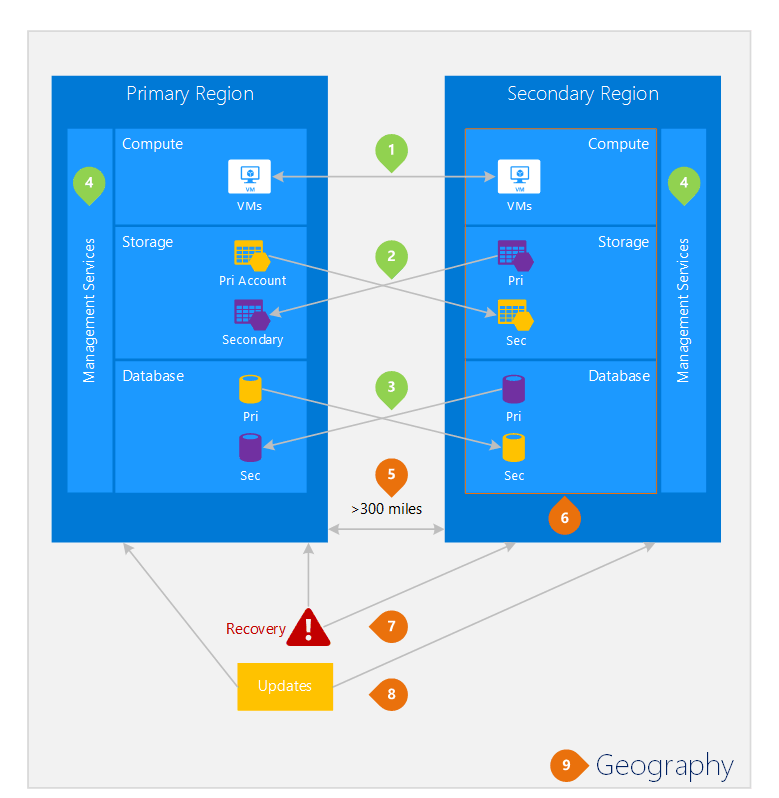

<properties
    pageTitle="Business Continuity und Disaster Wiederherstellung (BCDR): Azure gepaart Regionen | Microsoft Azure"
    description="Azure regionalen Paare sicherstellen, dass Applikationen robuste während Data Center Fehlern."
    services="site-recovery"
    documentationCenter=""
    authors="rayne-wiselman"
    manager="jwhit"
    editor=""/>

<tags
    ms.service="site-recovery"
    ms.workload="storage-backup-recovery"
    ms.tgt_pltfrm="na"
    ms.devlang="na"
    ms.topic="article"
    ms.date="08/23/2016"
    ms.author="raynew"/>

# Business Continuity und Disaster Wiederherstellung (BCDR): Azure gepaart Regionen

## Was sind gepaart Regionen?

Azure arbeitet in mehreren Regionen auf der ganzen Welt. Ein Azure Geography wird eines definierten Bereichs der Welt, die mindestens eine Azure Region enthält. Eine Azure Region ist der Bereich in einer Geography, die eine oder mehrere Rechenzentren enthält.

Jede Azure Region ist mit einer anderen Region innerhalb der gleichen Geography, zusammen ausführenden ein paar regionalen kombiniert. Eine Ausnahme ist die Brasilien Süd, die mit einem Bereich außerhalb der Geography gepaart ist.

Abbildung 1 – Azure regionalen Paar Diagramm

| "Geography"     |  Für Bereiche  |                     |
| :-------------| :-------------   | :-------------      |
| Nordamerika | Nord-zentralen US | Süd zentralen US    |
| Nordamerika | Ostasiatische US          | Westen US             |
| Nordamerika | US-OST 2        | US-Central          |
| Nordamerika | Westen USA 2        | USA – zentral "Westen"     |
| Europa        | North Europa     | Westen Europa         |
| Asien          | Süd Ostasien  | Ostasien           |
| China         | Ostasiatische China       | North China         |
| Japan         | Japan OST       | Japan "Westen"          |
| Brazilien        | Brasilien Süd (1) | Süd zentralen US    |
| Australien     | Australien OST   | Australien oder |
| US-Regierung | US Gov Iowa      | US Gov Virginia     |
| Indien         | Zentrale Indien    | Süd Indien         |
| Kanada        | Kanada Central   | Kanada OST         |
| GROßBRITANNIEN            | UK "Westen"          | UK-Süd            |

Tabelle 1: Zuordnung von Azure regionalen Paare

> (1) die Brasilien Süd ist eindeutig, da es mit einem Bereich außerhalb der eigenen Geography gepaart ist. Brasilien des sekundären Süd ist Süd zentralen uns aber Süd zentralen uns des sekundären Region nicht Brasilien Süd.

Es empfiehlt sich, dass Sie über die regionalen Paare von Richtlinien für den Azure Isolation und Verfügbarkeit profitieren Auslastung repliziert. Beispielsweise geplanten Azure System-Updates sequenziell bereitgestellt werden (nicht gleichzeitig) über gepaarten Regionen. Dies bedeutet, dass auch in seltene-Ereignis einer fehlerhaften Update nicht gleichzeitig beide Regionen beeinträchtigt werden. Darüber hinaus ist in wahrscheinlich nicht-Ereignis einer allgemeinen einem Dienstausfall Wiederherstellung von mindestens eine Region aus jeder Paar Priorität.

## Beispiel für Bereiche
Abbildung 2 unten zeigt eine hypothetische Anwendung, die die regionalen Paar für die Wiederherstellung verwendet. Die grünen Zahlen hervorheben die Cross-Region Aktivitäten von drei Azure Services (Azure zu berechnen, Speicher und Datenbank) und wie sie zur über Regionen repliziert konfiguriert sind. Die Vorteile von Bereitstellen von über gepaarten Regionen werden durch die Zahlen "Orange" hervorgehoben.

Abbildung 2 – hypothetische Azure regionalen Paar

## Cross-Region Aktivitäten
Wie in der Abbildung 2 bezeichnet.

 **Azure berechnen (PaaS)** – Sie müssen zusätzliche berechnen Ressourcen im voraus, um sicherzustellen, Ressourcen stehen in einem anderen Region bei einem Datenverlust bereitstellen. Weitere Informationen finden Sie unter [Azure Stabilität technische Anleitung](./resiliency/resiliency-technical-guidance.md).

 **Azure-Speicher** - Geo redundante Speicher (GRS) ist standardmäßig so konfiguriert, wenn ein Konto Azure-Speicher erstellt wird. Mit GRS werden Ihre Daten innerhalb der primären Region und drei Mal in der Region gepaarten automatisch dreimal repliziert. Weitere Informationen finden Sie unter [Speicheroptionen für Redundanz Azure](storage/storage-redundancy.md).

 **Azure SQL-Datenbanken** – mit Azure SQL Standard Geo-Replikation können Sie asynchronen Replikation von Transaktionen für Region konfigurieren. Mit Premium Geo-Replikation können Sie die Replikation zu einem beliebigen Bereich in der Welt konfigurieren. Wir empfehlen jedoch, Sie diese Ressourcen in einem gepaarten Bereich für die meisten Wiederherstellungssituationen bereitstellen. Weitere Informationen finden Sie unter [Geo-Replikation in Azure SQL-Datenbank](./sql-database/sql-database-geo-replication-overview.md).

 **Azure Ressource Manager (Cloud)** – Cloud bietet logische Isolation der Dienst Verwaltungskomponenten grundsätzlich über Regionen. Dies bedeutet, dass die logische Fehlern in einem Region höchstwahrscheinlich auf ein anderes auswirken werden.

## Vorteile für Regionen
Wie in der Abbildung 2 bezeichnet.  

**physische Isolation** – falls möglich, Azure lieber mindestens 300 Meilen Trennung zwischen Rechenzentren in einem regionalen Paar, auch wenn dies in alle Regionen nicht praktisch oder möglich ist. Physische Datacenter Trennung reduziert die Wahrscheinlichkeit Naturkatastrophen, der Aufstand, Stromausfällen oder beide Regionen gleichzeitig Auswirkungen physische Netzwerkausfälle. Grad der Isolation unterliegt Einschränkungen innerhalb der Geography (Geography Größe, Power/Netzwerk Infrastruktur Verfügbarkeit Verbraucher zu verstoßen, usw.).  

**Plattform bereitgestellten Replikations** - einige Dienste, wie z. B. Geo redundante Speicherung bieten in den Bereich für die automatische Replikation.

**Region Wiederherstellung Reihenfolge** – bei einer allgemeinen Ausfall, Wiederherstellung, der eine Region ist Priorität bei jeder Paar ab. Über Regionen für Bereitstellung befinden sich unbedingt eine der Regionen mit Priorität wiederhergestellt haben. Wenn eine Anwendung über Regionen bereitgestellt wird, die nicht verbunden sind, kann Wiederherstellung – im ungünstigsten Fall verzögert werden, die die ausgewählten Regionen den letzten beiden wiederhergestellt werden könnten.

**sequenzieller aktualisiert** – geplanter Azure System Updates bereitgestellt, die für Regionen sequenziell Variationswebsites werden (nicht gleichzeitig) zu minimieren Ausfallzeiten, der Effekt von Fehlern und logischen Fehlern in das seltene-Ereignis einer fehlerhafte Aktualisierung.

**Daten Ort** – einer Region befindet sich innerhalb der gleichen Geography als dessen Paar (mit Ausnahme von Brasilien Süd) akzeptieren, um Daten vor-Ort-Steuer und Recht Zuständigkeit der Durchsetzung von erfüllen.

