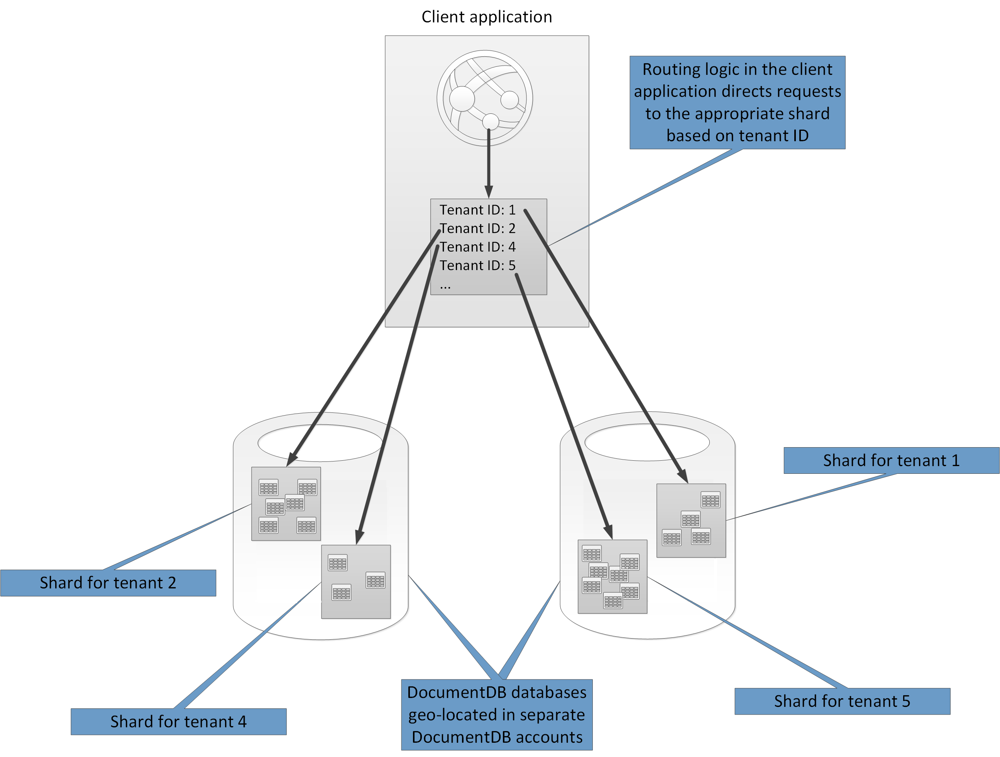

<properties
   pageTitle="Anleitungen Aufteilen von Daten | Microsoft Azure"
   description="Leitfaden zur Vorgehensweise zum Trennen von Partitionen zum verwaltet und separat zugegriffen werden."
   services=""
   documentationCenter="na"
   authors="dragon119"
   manager="christb"
   editor=""
   tags=""/>

<tags
   ms.service="best-practice"
   ms.devlang="na"
   ms.topic="article"
   ms.tgt_pltfrm="na"
   ms.workload="na"
   ms.date="07/14/2016"
   ms.author="masashin"/>

# Vorherigen Anleitungen Daten

[AZURE.INCLUDE [pnp-header](../includes/guidance-pnp-header-include.md)]

## (Übersicht)

In vielen umfangreichen Lösungen werden Daten in separaten Partitionen verteilt, die verwaltete und separat zugegriffen werden kann. Die Partitionierungsstrategie muss sorgfältig ausgewählt werden, die Vorteile maximieren und minimiert die negative Folgen. Partitionierung kann besser Skalierbarkeit verbessern, Konflikte zu minimieren und Leistung zu optimieren. Ein weiterer Vorteil Aufteilung ist, dass es ein Verfahren für die Division von Daten durch das Muster Bedienung bereitgestellt werden. Beispielsweise können Sie ältere, weniger aktive (kalte) Daten im kostengünstiger Datenspeicher archivieren.

## Warum partitionieren Daten?

Die meisten Cloudanwendungen und Dienste speichern und Abrufen von Daten als Teil ihrer Vorgänge. Das Design der Datenspeicher, die eine Anwendung verwendet wird, kann einen erheblichen Einfluss auf die Leistung, Durchsatz und Skalierbarkeit eines Systems haben. Eine Methode, die im Allgemeinen in große Systeme angewendet wird, besteht darin, die Daten in separate Partitionen unterteilen.

> Der Begriff _Partitionierung_ , die in diesem Handbuch verwendet wird ist an den Prozess der Division von Daten physisch in separaten Datenspeicher. Dies ist nicht identisch mit SQL Server Tabellenpartitionierung, welche ist ein anderes Konzept.

Partitionierung von Daten bieten eine Reihe von Vorteilen. Sie können beispielsweise um angewendet werden:

- **Skalierbarkeit verbessern**. Wenn Sie eine einzelne Datenbank Regelung skalieren, gelangen sie schließlich maximal physischen Hardware. Wenn Sie Daten über mehrere Partitionen aufteilen, von die jede auf einem separaten Server gehostet wird, können Sie sich das System fast endlos skalieren.
- **Verbessern der Leistung**. Access Datenoperationen auf jede Partition stattfinden über eine kleinere Datenmengen vorhanden sind. Vorausgesetzt, dass die Daten geeignet so konfiguriert ist, kann Partitionierung Ihrem System effizienter zu gestalten. Vorgänge, die mehr als eine Partition beeinflussen können parallel ausgeführt werden. Jede Partition kann in der Nähe der Anwendung befinden, die sie zum Netzwerkwartezeit minimieren verwendet.
- **Verfügbarkeit verbessern**. Extrahieren von Daten auf mehreren Servern wird vermieden, einen einzelnen Punkt des Fehlers. Wenn ein Server fehlschlägt, oder wird gewartet geplanten, nur die Daten dieses Partition nicht verfügbar ist. Vorgänge auf anderen Partitionen fortsetzen können. Erhöhen der Anzahl von Partitionen wird reduziert wird den relativen Einfluss von einem einzelnen Serverfehler den Prozentsatz der Daten, die nicht verfügbar sind. Jede Partition repliziert kann die Wahrscheinlichkeit, dass eine einzelne Vorgänge Auswirkungen Fehlers weiter reduzieren. Es können sie zudem, wichtige Daten zu trennen, die fortlaufend sein muss und Low-Wertdaten hochgradig stellt die untere Verfügbarkeit Anforderungen (beispielsweise Protokolldateien).
- **Sicherheit verbessern**. Je nach Art der Daten, und wie sie konfiguriert ist, ist es eventuell möglich, sensible und nicht sensible Daten in anderen trennen teilt den und daher in verschiedenen Servern oder Daten speichert. Sicherheit kann dann speziell für vertraulichen Daten optimiert werden.
- **Flexibilität bereitstellen**. Partitionierung bietet viele Verkaufschancen für fein Vorgänge optimieren, administrative Effizienz maximieren und minimieren Kosten. Beispielsweise können Sie unterschiedliche Strategien für die Verwaltung, Überwachung, Sichern und Wiederherstellen und andere Verwaltungsaufgaben basierend auf der Wichtigkeit der Daten in jeder Partition definieren.
- **Der Daten mit dem Muster Bedienung speichern Übereinstimmung**. Partitionierung ermöglicht jede Partition bereitgestellt werden soll, klicken Sie auf eine andere Art von Datenspeicher, basierend auf Kosten und den integrierten Features, dass Daten Angebote speichern. Beispielsweise können große binäre Daten in einem Blob-Datenspeicher gespeichert werden, während Sie weitere strukturierte Daten in einer Datenbank Dokument aufbewahrt werden können. Weitere Informationen finden Sie unter [Erstellen einer Lösung polyglot] Muster & Methoden-Leitfaden und [Zugriff auf Daten für hochgradig skalierbare Lösungen: Using SQL, NoSQL und polyglot Beibehaltung] auf der Microsoft-Website.

Einige Systeme implementieren Partitionierung, da es Kosten statt ein Vorteil gilt nicht. Häufige Gründe für dieser Aspekte umfassen:

- Viele Daten Speicher Betriebssysteme unterstützen keine Verknüpfungen partitionsübergreifend, und es kann schwierig sein, in einem partitionierten System referenzielle Integrität zu erhalten. Es ist häufig erforderlich sind, um die Verknüpfungen zu implementieren und Integrität überprüft Anwendung Code (in den vorherigen Layer), das zusätzliche e/a und Anwendungskomplexität führen kann.
- Verwalten von Partitionen ist nicht immer eine einfache Aufgabe. In einem System, in dem die Daten veränderliche ist, müssen Sie regelmäßig, um Konflikte und Hotspot verringern Partitionen neu zu verteilen.
- Einige allgemeine Tools funktionieren nicht natürlich mit partitionierten Daten.

## Entwerfen von Partitionen

Daten können auf unterschiedliche Weise aufgeteilt werden: horizontal, vertikal oder funktional. Die von Ihnen gewählte Strategie hängt von den Grund für die Partitionierung der Daten und den Anforderungen der Anwendungen und Dienste, die die Daten verwendet werden.

> [AZURE.NOTE] In diesem Handbuch beschriebenen Partitionierungsschemas werden auf eine Weise erläutert, die von der zugrunde liegenden Daten Speicher Technologie unabhängig ist. Sie können für unterschiedliche Arten von Datenspeicher, einschließlich relationale und nachgeforscht angewendet werden.

### Partitionierungsstrategien

Die drei standardmäßige Strategien für Datenpartitionierung sind:

- **Horizontale Partitionierung** (häufig als _Sharding_bezeichnet). Bei dieser Strategie jede Partition ist ein Datenspeicher in einem eigenen rechts, aber alle Partitionen das gleiche Schema aufweisen. Jede Partition wird als eine _Shard_ bezeichnet und enthält eine bestimmte Teilmenge der Daten, wie z. B. aller Aufträge für eine bestimmte Gruppe von Kunden in einer e-Commerce-Anwendung.
- **Vertikale Partitionierung**. Bei dieser Strategie enthält jede Partition eine Teilmenge der Felder für Elemente in der Datenquelle. Die Felder werden gemäß ihren Muster Bedienung unterteilt. Beispielsweise möglicherweise häufig verwendeter Felder in eine vertikale Partition und weniger häufig verwendeter Felder in einer anderen platziert werden.
- **Funktionellen Partitionierung**. Bei dieser Strategie aggregiert Daten nach, wie sie von jedem begrenzte Kontext im System verwendet wird. Beispielsweise ein e-Commerce-System implementiert trennen Geschäftsfunktionen fakturiert und Verwalten von Produktbestands möglicherweise speichern Rechnungsdaten in eine Partition und Produkts Lagerbestandsdaten in ein anderes.

Es ist wichtig, beachten Sie, dass die hier beschriebenen drei Strategien kombiniert werden können. Sie sind nicht gegenseitig, und es wird empfohlen, dass Sie sie alle beim Entwerfen einer Partitionierungsschema berücksichtigen. Angenommen, Sie möglicherweise unterteilen von Daten in mehrere Shards hinweg und verwenden Sie dann vertikale Partitionierung, um die Daten in jeder Shard unterteilen. Auf ähnliche Weise können die Daten in ein funktionsübergreifendes Partition mehrere Shards hinweg aufgeteilt werden soll (das auch vertikal aufgeteilt werden kann).

Die unterschiedlichen Anforderungen der einzelnen Strategien können jedoch eine Reihe von Problemen in Konflikt auslösen. Sie müssen ausgewertet werden und alle diese zu verteilen, wenn ein Partitionierungsschema entwerfen, die der allgemeine Datenverarbeitung Leistungsziele für Ihr System entspricht. In den folgenden Abschnitten untersuchen einzelnen Strategien ausführlicher.

### Horizontale Partitionierung (Sharding)

Abbildung 1 zeigt einen Überblick über die horizontale Partitionierung oder Sharding. In diesem Beispiel ist Produkts Lagerbestandsdaten in mehrere Shards hinweg basierend auf den Product Key unterteilt. Jede Shard enthält, die Daten für einen zusammenhängenden Bereich von Shard Tasten (A-G und H-Z) alphabetisch angeordnet wird.

_Abbildung 1. Horizontal vorherigen (Sharding) Daten basierend auf einer Partitionsschlüssel_

Sharding hilft Ihnen, die Last auf mehr Computern, die Reduzierung von Konflikten und verbessert die Leistung verteilt. Sie können das System heraus skalieren, durch Hinzufügen weiterer mehrere Shards hinweg, die auf weiteren Servern ausgeführt werden.

Das wichtigste beim Implementieren dieses Partitionierungsstrategie ist die Wahl der Sharding-Taste. Es kann schwierig sein, die Taste zu ändern, nachdem das System in Betrieb ist. Die Taste muss stellen Sie sicher, dass die Daten verteilt ist, dass Sie über die mehrere Shards hinweg als auch die Arbeitsbelastung wie möglich ist.

Beachten Sie, dass andere mehrere Shards hinweg nicht unbedingt ähnliche Datenmengen enthalten. Lieber, ist das weitere wichtige Aspekte, die Anzahl der Anfragen abzuwägen. Einige mehrere Shards hinweg möglicherweise sehr groß, aber jedes Element wird der Betreff der Access-Operationen eine niedrige Zahl. Andere mehrere Shards hinweg möglicherweise kleiner, sondern jedes Element wesentlich häufiger zugegriffen wird. Es ist es wichtig, um sicherzustellen, dass eine einzelne Shard nicht verwendet wird, um die Shard hosten die Skalierung (Kapazität und begrenzt Verarbeitungsressourcen) von der Datenspeicher überschreiten.

Wenn Sie ein Sharding Schema verwenden, vermeiden Sie Hotspots (oder ein wichtiges Partitionen) erstellen, die Leistung und Verfügbarkeit beeinflussen können. Wenn Sie anstelle von den ersten Buchstaben des Namens des Kunden einen Hash einer Kunden-ID verwenden, verhindern Sie nicht angeglichene Verteilung an, die aus den häufige und weniger häufige Anfangsbuchstaben ergibt. Dies ist ein übliches Verfahren, mit die Daten partitionsübergreifend gleichmäßiger verteilen.

Wählen Sie ein Sharding Schlüssel, der alle zukünftigen Anforderungen großen mehrere Shards hinweg in kleinere Einheiten, Teilen minimiert zusammengefügten kleine mehrere Shards hinweg in größere Partitionen, oder ändern das Schema, das die Daten in einem Satz Partitionen gespeichert werden. Diese Vorgänge können sehr viel Zeit und möglicherweise eine oder mehrere mehrere Shards hinweg offline aufzeichnen, während sie ausgeführt werden.

Wenn mehrere Shards hinweg repliziert werden, kann es möglich, einige der Replikate online beibehalten, während andere aufteilen, eingefügt oder neu konfiguriert werden. Das System müssen jedoch die Vorgänge zu beschränken, die auf der Registerkarte Daten in diese mehrere Shards hinweg ausgeführt werden können, während die Neukonfiguration stattfindet. Beispielsweise können die Daten in den Replikaten gekennzeichnet werden, um den Bereich Inkonsistenzen zu beschränken, die auftreten können, während Sie mehrere Shards hinweg neu strukturiert werden, sind schreibgeschützt.

> Ausführlichere Informationen und Hinweise zu viele dieser Aspekte und empfiehlt sich das Verfahren für das Entwerfen Datenspeicher, die horizontale Partitionierung implementieren, finden Sie unter [Sharding Muster].

### Vertikale Partitionierung

Die am häufigsten verwendete Verwendung für vertikale Partitionierung besteht darin, die ein-/Ausgabe reduzieren und Leistung Kosten im Zusammenhang mit Abrufen von den Elementen, die am häufigsten zugegriffen werden. Abbildung 2 zeigt ein Beispiel vertikale Aufteilung. In diesem Beispiel werden verschiedene Eigenschaften für jedes Datenelement in verschiedenen Partitionen aufrechterhalten. Eine enthält Daten, die einschließlich Name, Beschreibung und Preisinformationen für Produkte häufiger zugegriffen wird. Ein anderes enthält die Lautstärke in Stock und das Datum der letzten Ziffern oder Buchstaben sortierte.

_Abbildung 2. Vertikal vorherigen Daten nach deren Muster Bedienung_

In diesem Beispiel fragt die Anwendung regelmäßig der Produktname, Beschreibung und Preis für Kunden die Produktdetails angezeigt werden. Den vorhandenen Ebene und das Datum, wenn das Produkt zuletzt vom Hersteller bestellten, werden in einer separaten Partition aufrechterhalten, da diese beiden Elemente zusammen häufig verwendet werden.

Dieses Partitionierungsschema bietet den zusätzlichen Vorteil, dass die relativ langsam-verschieben Daten (Produktname, Beschreibung und Preis) aus den dynamischeren Daten (vorhandenen Ebene und Datum der letzten Ziffern oder Buchstaben sortierte) getrennt werden. Eine Anwendung unter Umständen positiv auf die langsame verschieben Daten im Arbeitsspeicher zwischenspeichern, wenn sie häufig zugegriffen wird.

Ein weiteres typisches Szenario für diese Partitionierungsstrategie besteht darin, die Sicherheit vertrauliche Daten maximieren. Beispielsweise können Sie hierzu Kreditkartennummern und die entsprechenden Karte Sicherheit Überprüfung Zahlen in separate Partitionen speichern.

Vertikale Partitionierung kann auch den gleichzeitigen Zugriff verringern, der mit den Daten erforderlich ist.

> Vertikale Partitionierung arbeitet Ebene der Entität innerhalb einer Datenspeicher, die teilweise normalisieren eine Entität, um sie aus einer _breiten_ Element in einem Satz von Elementen _einschränken_ aufgehoben werden nach unten. Es ist ideal für spaltenorientiert Datenspeicher wie HBase und Cassandra. Wenn die Daten in eine Auflistung von Spalten wahrscheinlich nicht ändern, können Sie auch erwägen Spalte Stores in SQL Server.

### Funktionsübergreifendes Partitionierung

Für Systeme, wo es möglich, einen begrenzten Kontext für jede unterschiedlichen geschäftlichen Bereich oder einen bestimmten Dienst in der Anwendung zu identifizieren ist, bietet funktionsübergreifendes Partitionierung ein Verfahren zum Verbessern der Leistung von Access Isolation und Daten. Eine andere häufige Verwendung funktionsübergreifendes Aufteilung besteht darin Lese-und Schreibzugriff Daten von schreibgeschützten Daten zu trennen, die für Berichtszwecke verwendet wird. Abbildung 3 zeigt eine Übersicht über funktionsübergreifendes Aufteilung, wo Lagerbestandsdaten von Kundendaten getrennt.

_Abbildung 3. Funktional vorherigen Daten nach begrenzte Kontext oder Unterdomäne_

Diese Partitionierungsstrategie kann Daten Access Konflikte über verschiedene Teile eines Systems verringern.

## Entwerfen von Partitionen für Skalierbarkeit

Es ist entscheidend, erwägen Sie die Größe und Arbeitsbelastung für jede Partition und damit Daten verteilt ist, um die maximale Skalierbarkeit erzielen zu verteilen. Sie müssen die Daten jedoch auch aufteilen, damit die Skalierung Grenzwerte eines Einzelpartition Store nicht überschritten wird.

Beim Entwerfen von Partitionen für Skalierbarkeit, gehen Sie folgendermaßen vor:

1. Analysieren die Anwendung die Access-Mustern, wie etwa die Größe jeder Abfrage zurückgegebene Ergebnisgruppe interpretiert, die Häufigkeit von Access, die gehörende Wartezeit und der serverseitigen Verarbeitung Anforderungen zu berechnen. In vielen Fällen werden ein paar Hauptelemente die meisten Verarbeitungsressourcen anfordern.
2. Verwenden Sie diese Analyse, um die aktuellen und zukünftigen Skalierbarkeit Ziele, wie Datengröße und Arbeitsbelastung festzulegen. Verteilen Sie die Daten dann partitionsübergreifend in die das Ziel Skalierbarkeit stattfinden. Auswählen des geeigneten Shard Schlüssels ist in die horizontale Partitionierungsstrategie wichtig, um sicherzustellen, dass die Verteilung gerade ist. Weitere Informationen finden Sie unter der [Sharding Muster].
3. Stellen Sie sicher, dass die verfügbaren Ressourcen für jede Partition ausreichend, um die Skalierbarkeitsanforderungen in Bezug auf die Größe der Daten und Durchsatz verarbeitet werden. Der Knoten, der eine Partition hostet vorgangseinschränkung beispielsweise möglicherweise eine feste Einschränkung auf die Menge des Speicherplatzes, Verarbeitung Power oder Netzwerk-Bandbreite, die es bereitstellt. Wenn die Daten gespeichert und verarbeitet Anforderungen wahrscheinlich an diesen Grenzwert überschreiten, kann das verfeinern Sie Ihre Partitionierungsstrategie oder Teilen von weiteren Daten heraus erforderlich sein. Beispielsweise möglicherweise eine Skalierbarkeit Ansatz Protokollierungsdaten von Hauptfunktionen Anwendung zu trennen. Dies können Sie mithilfe von separaten Datenspeicher zu verhindern, dass der Speicherplatz für insgesamt Daten überschreiten die maximal Anpassungsbereich für den Knoten ausführen. Wenn die Gesamtzahl der Datenspeicher den Knoten Grenzwert überschreitet, möglicherweise separaten Speicherknoten verwenden werden.
4. Überwachen des Systems verwenden, stellen Sie sicher, dass die Daten wie erwartet verteilt werden und die Partitionen die Last bewältigen können, die für diese Zuordnung ist. Es ist möglich, dass die Verwendung die Verwendung nicht übereinstimmt, die durch die Analyse zu erwarten ist. In diesem Fall möglicherweise es möglich, die Partitionen neu zu verteilen. Dies möglicherweise nicht möglich, erforderlich sind, um einige Teile des Systems zu den erforderlichen Saldo gewinnen Umgestaltung verwenden.

Beachten Sie, dass einige Cloud-Umgebungen Ressourcen im Hinblick auf Infrastruktur Begrenzung zuzuweisen. Stellen Sie sicher, dass die Grenzwerte für Ihre ausgewählten Begrenzungslinie ausreichend Platz für alle erwartetes Wachstum in der Datenmenge in Bezug auf die Speicherung von Daten, Verarbeitung Power und Bandbreite bereitstellen.

Wenn Sie Azure Table Storage verwenden, möglicherweise ein beschäftigt Shard beispielsweise mehr Ressourcen als eine Einzelpartition verarbeitet Anfragen zur Verfügung stehen erforderlich. (Es gibt eine hinsichtlich der Lautstärke Besprechungsanfragen, die von einer Einzelpartition in einen bestimmten Zeitraum behandelt werden kann. Finden Sie auf der Seite [Azure-Speicher Skalierbarkeit und Leistung Ziele] auf der Microsoft-Website für weitere Details.)

 Wenn dies der Fall ist, müssen die Shard neu partitioniert werden müssen, um die Last verteilt. Wenn die Gesamtgröße oder Durchsatz dieser Tabellen die Kapazität eines Kontos Speicher überschreitet, ist dies möglicherweise erforderlich sind, um zusätzlichen Speicherkonten erstellen und die Tabellen, die auf diese Konten verteilt. Wenn die Anzahl der Speicherkonten die Anzahl der Konten, die auf ein Abonnement verfügbar sind überschreitet, möglicherweise erforderlich sind, um mehrere Abonnements verwenden werden.

## Entwerfen von Partitionen für die Leistung von Abfragen

Abfrageleistung kann mithilfe von kleinere Datasets und durch Ausführen der parallele Abfragen häufig erhöht werden. Jede Partition sollte einen geringen Prozentsatz an die gesamte Datenmenge enthalten. Diese Verringerung der Lautstärke kann die Leistung von Abfragen verbessern. Partitionierung ist jedoch keine Alternative zum Entwerfen und Konfigurieren einer Datenbank entsprechend. Angenommen, stellen Sie sicher, dass Sie die erforderlichen Indizes angeordnet haben, wenn Sie mit eine relationale Datenbank arbeiten.

Beim Entwerfen von Partitionen für die Leistung von Abfragen, gehen Sie folgendermaßen vor:

1. Überprüfen Sie die Anwendung Anforderungen und Leistung:
    - Verwenden Sie die geschäftliche Anforderungen zu ermitteln, welche die kritischen Abfragen, die immer schnell ausführen müssen.
    - Überwachen Sie das System, um alle Abfragen zu identifizieren, die es langsam ausführen.
    - Richten Sie an, welche Abfragen besonders häufig ausgeführt werden. Eine einzelne Instanz jeder Abfrage möglicherweise minimale Kosten, aber der kumulierte Verbrauch Ressourcen kann erheblich sein. Möglicherweise hilfreich, um die Daten zu trennen, die von diesen Abfragen in eine unterschiedliche Partition oder sogar ein Cache abgerufen werden.
2. Abschnitt der Daten, die langsam verursacht:
    - Beschränken Sie die Größe der einzelnen Partitionen, damit die Abfrage Antwortzeit Ziel enthalten ist.
    - Entwerfen Sie die Taste Shard, sodass die Anwendung die Partition problemlos finden kann, wenn Sie horizontale Partitionierung implementieren. Dadurch wird verhindert, dass die Abfrage müssen Sie jeder Partition durchsuchen.
    - Berücksichtigen Sie den Standort einer Partition aus. Versuchen Sie, falls möglich, die Daten in Partitionen beibehalten möchten, die geografischen dicht an der Anwendungen und der Benutzer, die darauf zugreifen.
3. Besitzt eine Entität Durchsatz und Abfrage Leistung erfüllen, verwenden Sie funktionsübergreifendes Partitionierung basierend auf diese Entität aus. Wenn dies noch nicht die Anforderungen entsprechen, wenden Sie ebenfalls horizontale Partitionierung aus. In den meisten Fällen ist eine einzelne Partitionierungsstrategie ausreichend, aber in einigen Fällen ist es effizienter, beide Strategien kombinieren.
4. Erwägen Sie asynchrone Abfragen, die parallel partitionsübergreifend für optimale Leistung ausgeführt werden.

## Entwerfen von Partitionen für Verfügbarkeit

Datenpartitionierung kann verbessern die Verfügbarkeit von Applications durch, um sicherzustellen, dass das gesamte Dataset keinen einzelnen Punkt des Fehlers darstellt und einzelne eine Teilmenge der Dataset unabhängig voneinander verwaltet werden können. Replikation Partitionen, die wichtige Daten enthalten, kann auch die Verfügbarkeit verbessern.

Berücksichtigen Sie beim Entwerfen und implementieren Partitionen, die folgenden Faktoren, die Verfügbarkeit auswirken:

- **Wie wichtig die Daten sind Geschäftsabläufe**. Einige Daten enthalten möglicherweise wichtige Unternehmensinformationen z. B. Rechnung oder Banktransaktionen. Andere Daten enthalten möglicherweise weniger wichtige Betrieb Daten wie Protokolldateien, Leistung Spuren usw.. Nach dem Ermitteln der jeweiligen Daten, berücksichtigen:
    - Speichern von wichtigen Daten in hochgradig verfügbaren Partitionen mit einem entsprechenden Sicherung Plan aus.
    - Zur Festlegung getrennte Verwaltung und Überwachung Verfahren oder Verfahren für die verschiedenen Criticalities von jedem Dataset. Platzieren Sie die Daten, die die gleiche Ebene der Wichtigkeit in der gleichen Partition hat, sodass sie zusammen mit einem entsprechenden Häufigkeit gesichert werden können. Beispielsweise müssen Partitionen, die Daten für Banktransaktionen enthalten häufiger als Partitionen gesichert werden, die Protokollierung oder Spur Informationen enthalten.
- **Wie können einzelne Partitionen verwaltet werden**. Entwerfen von Partitionen zur Unterstützung von unabhängigen Management und Wartung bietet mehrere Vorteile. Beispiel:
    - Wenn eine Partition fehlschlägt, können sie unabhängig ohne Instanzen von Applications, die Zugriff auf Daten in anderen Partitionen wiederhergestellt werden.
    - Partitionierung von Daten nach geographischen ermöglicht Geplante Wartungsaufgaben in Zeiten für jeden Standort ausgeführt. Stellen Sie sicher, dass die Partitionen nicht zu groß, um zu verhindern, dass alle geplante Wartung während dieses Zeitraums abgeschlossen sind.
- **Wichtige Daten partitionsübergreifend repliziert werden sollen**. Diese Strategie kann Verfügbarkeit und Leistung, verbessern, obwohl es auch Konsistenzprobleme vorstellen kann. Es dauert Zeit geänderte Daten in einer Partition mit jedem Replikat synchronisiert werden. Während dieses Zeitraums werden die einzelnen Partitionen unterschiedliche Datenwerte enthalten.

## Grundlegendes zu wie Partitionierung entwerfen und entwickeln wirkt sich auf

Mithilfe von Partitionierung erhöht die Komplexität der Entwurf und die Entwicklung von Ihrem System. Erwägen Sie die Partitionierung als wesentliche Bestandteile System Entwurf auch wenn des Systems zunächst nur eine einzelne Partition enthält. Wenn Sie als nicht mehr zu lenken, Partitionierung, beim Systemstart beeinträchtigt Leistung und Skalierbarkeitsprobleme zu beheben, tragen ebenfalls zur Komplexität, da Sie eine live-System bereits zu verwalten.

Wenn Sie das System zum Einbinden in dieser Umgebung Partitionierung aktualisieren, erfordert es die Access-Datenzugriffslogik ändern. Sie können auch die Migration einbezogen große Mengen von vorhandenen Daten zu es partitionsübergreifend, oft verteilen während der Benutzer übereinstimmen, kann das System weiterhin zu benutzen.

In einigen Fällen ist Partitionierung nicht wichtig betrachtet, da das ursprüngliche Dataset klein ist und einfach von einem einzigen Server behandelt werden. Dies kann in einem System, die möglicherweise nicht über seine ursprüngliche Größe hinaus skalieren wahr sein, aber viele kommerzielle Systeme müssen als die Anzahl von Benutzern zunehmen erweitern. Diese Erweiterung wird in der Regel durch eine Variation in der Datenmenge begleitet.

Es ist auch wichtig zu verstehen, dass Partitionierung nicht immer eine Funktion große Datenspeicher ist. Beispielsweise kann ein kleine Datenspeicher stark von vielen Hundert gleichzeitige Clients zugegriffen werden. Die Daten in diesem Fall Partitionierung kann dazu beitragen Konflikte verringern und den Durchsatz verbessern.

Berücksichtigen Sie beim Entwerfen einer Partitionierungsschema Daten die folgenden Punkte:

- **Soweit möglich, zusammenhalten Daten für die am häufigsten verwendeten Datenbankvorgänge in jeder Partition zu Access-Operationen Cross - Daten zu minimieren**. Abfragen partitionsübergreifend zeitaufwändiger als nur innerhalb einer Einzelpartition Abfragen werden kann, aber Partitionen für eine Reihe von Abfragen optimieren beeinträchtigen könnte andere Sätze von Abfragen. Wenn Sie nicht partitionsübergreifend Abfragen vermeiden können, minimieren Sie Abfragezeit, indem Sie parallele Abfragen auszuführen und die Ergebnisse in der Anwendung aggregieren. Dieser Ansatz möglicherweise nicht möglich, in einigen Fällen, beispielsweise wenn es erforderlich ist, erhalten ein Ergebnis aus einer Abfrage, und klicken Sie auf die nächste Abfrage verwenden.
- **Wenn Daten relativ statischen Verweises wie Postleitzahl Tabellen oder Produktlisten verwenden möchten, sollten Sie diese Daten in alle Partitionen zum Verringern der Vorbedingung für separate Suchvorgänge in verschiedenen Partitionen repliziert Abfragen zu gestalten**. Dieser Ansatz kann auch die Wahrscheinlichkeit, dass die Daten immer ein "wichtiges" Dataset, das im gesamten System beanspruchen Datenverkehr von unterliegt reduzieren. Es ist jedoch eine zusätzliche Kosten, die Sie Synchronisieren von Änderungen, die auf diese Daten Bezug auftreten können.
- **Soweit möglich, minimieren Anforderungen für die referenzielle Integrität partitionsübergreifend vertikale und funktionsfähig**. In diese Schemas muss die Anwendung selbst referenziellen Integrität partitionsübergreifend beibehalten, wenn die Daten aktualisiert und verbraucht ist. Abfragen, die Daten zu mehreren partitionsübergreifend verknüpfen müssen langsamer als Abfragen, die Daten nur innerhalb derselben Partition zu verknüpfen, da die Anwendung in der Regel aufeinander folgenden Abfragen basierend auf einer Schlüssel, und klicken Sie dann auf einen Fremdschlüssel ausführen muss. Erwägen Sie stattdessen repliziert oder normalisieren heben die relevanten Daten ein. Um die Abfragezeit zu minimieren, wo Partitionen Cross Joins erforderlich sind, führen Sie parallele Abfragen über die Partitionen aus und teilnehmen an die Daten in der Anwendung.
- **Erwägen Sie den Effekt, den das Partitionierungsschema auf die Datenkonsistenz partitionsübergreifend möglicherweise ein.** Überprüfen Sie, ob signifikante Konsistenz tatsächlich erforderlich ist. Stattdessen ist ein gemeinsames Konzept in der Cloud tatsächlichen Konsistenz implementiert wird. Die Daten in jeder Partition separat aktualisiert werden, und die Logik der: Damit ist sichergestellt, dass die Updates alle erfolgreich durchgeführt werden. Ganzer auch die Inkonsistenzen, die von Abfragen von Daten während der Ausführung einer Gelegenheit konsistenten Betrieb auftreten können. Weitere Informationen über das Implementieren der tatsächlichen Konsistenz finden Sie unter der [Daten Konsistenz Einführung in].
- **Beachten Sie, wie Abfragen die richtige Partition suchen**. Wenn eine Abfrage NGFS, um die benötigten Daten suchen Scannen muss, besteht ein erheblichen Einfluss auf die Leistung, auch wenn mehrere parallele Abfragen ausgeführt werden. Abfragen, die mit vertikalen und funktionsübergreifendes Partitionierungsstrategien verwendet werden, können die Partitionen angeben. Jedoch umso horizontale Partitionierung (Sharding) Speicherorte eines Elements schwierig, da jeder Shard dasselbe Schema verfügt. Eine typische Lösung für Sharding ist ein Schema zu verwalten, die zum Nachschlagen der Position Shard für bestimmte Elemente der Daten verwendet werden können. Diese Zuordnung kann in der Sharding Logik der Anwendung implementiert oder vom Datenspeicher verwaltet werden, wenn es als transparent Sharding unterstützt werden.
- **Beachten Sie beim mit einer horizontalen Partitionierungsstrategie Qualifikationsprofilen regelmäßig die mehrere Shards hinweg**. Dadurch werden die Daten gleichmäßig verteilen, indem Sie Größe und Arbeitsbelastung Hotspots minimieren, Maximieren der Leistung von Abfragen und Einschränkungen physische Speicher umgehen. Dies ist jedoch eine komplexe Aufgabe, die häufig die Verwendung eines benutzerdefinierten Tools oder Vorgangs erforderlich sind.
- **Wenn jede Partition repliziert, bietet es zusätzlichen Schutz vor Fehler**. Wenn ein einzelnes Replikat fehlschlägt, können Abfragen in Richtung eine Arbeitskopie geleitet werden.
- **Wenn Sie die physischen Grenzen einer vorherigen Strategie, erreicht haben müssen Sie gegebenenfalls der Skalierbarkeit in eine andere Ebene zu erweitern**. Wenn Partitionierung Ebene der Datenbank ist, müssen Sie beispielsweise suchen oder Partitionen in mehreren Datenbanken repliziert. Wenn Partitionierung Ebene der Datenbank bereits ist und physische Einschränkungen ein Problem sind, möglicherweise es voraus, dass Sie suchen oder repliziert Partitionen in mehreren Hostinganbieter Konten.
- **Vermeiden Sie Transaktionen, die Daten in mehreren Partitionen zugreifen**. Einige Konsistenz von Daten Stores implementieren Transaktionen und Integrität für Vorgänge ändern, die Daten, aber nur, wenn die Daten in einer einzelnen Partition befindet. Wenn Sie mehrere partitionsübergreifend Transaktionen Support benötigen, müssen wahrscheinlich Sie diese als Teil Ihrer Anwendungslogik implementiert werden, da die am häufigsten vorherigen Betriebssysteme keine systemeigene Unterstützung bieten.

Alle Datenspeicher erfordern einige Betrieb Verwaltungs- und Überwachen der Aktivitäten. Die Aufgaben können aus Daten geladen, Sichern und Wiederherstellen von Daten, Daten bereinigen und um sicherzustellen, dass das System ordnungsgemäß und effizient ausführt, liegen.

Beachten Sie die folgenden Faktoren, die beeinflussen Betrieb Management aus:

- **Gewusst wie: Implementieren der entsprechenden Verwaltungs- und Betriebsaufgaben, wenn die Daten aufgeteilt ist**. Diese Aufgaben, enthalten möglicherweise Sicherung und Wiederherstellung, Archivierung von Daten, die das System und andere Verwaltungsaufgaben für die Überwachung. Verwalten von logische Konsistenz bei sichern und Wiederherstellen von Vorgängen kann beispielsweise eine Herausforderung sein.
- **So laden Sie die Daten in mehrere Partitionen und Hinzufügen von neuen Daten, die aus anderen Quellen empfangen werden**. Einige Tools und Dienstprogramme möglicherweise nicht sharded Laden von Daten in die richtige Partition Datenvorgänge zu unterstützen. Dies bedeutet, dass Sie möglicherweise erstellen oder neue Tools und Dienstprogramme abrufen.
- **Informationen zum Archivieren und löschen die Daten in regelmäßigen Abständen**. Um die übermäßige Wertzuwachs Partitionen verhindern möchten, müssen Sie archivieren und Löschen von Daten in regelmäßigen Abständen (vielleicht monatlich). Es möglicherweise notwendig zum Umwandeln der Daten einer anderen Archiv Schema übereinstimmt.
- **So suchen Sie Probleme mit der Datenintegrität**. Erwägen Sie eine periodischen Vorgang aus, um alle Probleme mit der Datenintegrität wie Daten in einer Partition zu suchen, die Bezüge fehlenden Informationen in einer anderen. Der Prozess können entweder Versuch, diese Probleme automatisch beheben oder eine Benachrichtigung eines Operators zur Behebung von Probleme manuell auszulösen. Beispielsweise in einer Anwendung e-Commerce Bestelldaten möglicherweise in einer Partition gehalten werden, aber die Zeile Elemente, aus die jede Bestellung besteht möglicherweise in einer anderen gehalten werden. Die Vorgehensweise zum eine Bestellung aufgeben muss auf andere Daten hinzufügen. Wenn es dieser Vorgang Zeilenelementen fehlschlägt für gespeichert werden können, die keine entsprechende Reihenfolge vorhanden ist.

Andere Daten Technologien bieten in der Regel eigene Features zum Partitionierung unterstützen. In den folgenden Abschnitten werden die Optionen, die von häufig verwendeten Azure Applications Datenspeicher implementiert werden. Aspekte des Entwurfs von Applications, die dieser Features optimal nutzen können außerdem beschrieben.

## Partitionierungsstrategien für SQL Azure-Datenbank

Azure SQL-Datenbank ist eine relationale Datenbank-als-Service, die in der Cloud ausgeführt wird. Sie basiert auf Microsoft SQL Server. Eine relationale Datenbank dividiert Informationen in Tabellen und jede Tabelle enthält Informationen zu den Personen als eine Reihe von Zeilen. Jede Zeile enthält Spalten, die die Daten für die einzelnen Felder einer Entität enthalten. Die Seite [Neuigkeiten Azure SQL-Datenbank?] auf der Microsoft-Website finden Sie ausführliche Dokumentation zu erstellen und Verwenden von SQL-Datenbanken.

## Horizontale Partitionierung mit flexible Datenbank

Eine einzelne SQL-Datenbank sind maximal auf die Menge der Daten, die es enthalten kann. Durchsatz ist eingeschränkt Architektur Faktoren und die Anzahl der aktiven Verbindungen, die es unterstützt. Das Feature flexible Datenbank der SQL-Datenbank unterstützt horizontale Skalierung für eine SQL­Datenbank. Flexible Datenbank verwendet, können Sie Ihre Daten in mehrere Shards hinweg aufteilen, die über mehrere SQL-Datenbanken verteilt sind. Sie können auch hinzufügen oder entfernen mehrere Shards hinweg aus, wie die Menge der Daten, die Sie benötigen, behandeln wächst und verkleinert. Flexible Datenbank verwenden kann auch helfen Konflikte zu verringern, indem Sie die Last auf Datenbanken verteilt.

> [AZURE.NOTE] Flexible Datenbank ist kein Ersatz für das Feature Verbünden Azure SQL-Datenbank. Vorhandene SQL-Datenbank Föderation, die Installationen mit dem Verbünden Migrations-Programm zu flexible Datenbank migriert werden können. Alternativ können Sie Ihre eigenen Sharding Verfahren implementieren, wenn es sich bei Ihrem Szenario nicht selbst natürlich an den Features von verleihen, die durch flexible Datenbank bereitgestellt werden.

Jeder Shard wird als eine SQL-Datenbank implementiert. Eine Shard kann mehr als ein Dataset (ein _Shardlet_genannt) enthalten. Jede Datenbank verwaltet Metadaten, die die Shardlets beschreiben, die ihn enthält. Eine Shardlet sein, ein einzelnes Datenelement können, oder sie einer Gruppe von Elementen, die die gleichen Shardlet Taste freigeben. Wenn Sie Sharding Daten in einer mandantenfähigen Anwendung sind, die Taste Shardlet kann die Mandanten-ID ein, und alle Daten für einen angegebenen Mandanten können als Teil der gleichen Shardlet gehalten werden. Daten für andere Mandanten würde in verschiedenen Shardlets gehalten werden.

Es ist der Programmierung, ein Dataset mit einem Shardlet Schlüssel zugeordnet werden soll. Eine separate SQL-Datenbank fungiert als globaler Shard Karte-Manager. Diese Datenbank enthält eine Liste aller mehrere Shards hinweg und Shardlets im System. Eine Clientanwendung, die Daten greift auf verbindet zuerst in der globalen Shard Karte Manager-Datenbank erhalten Sie eine Kopie der Shard Karte (wobei mehrere Shards hinweg und Shardlets), die sie lokal speichert.

Klicken Sie dann die Anwendung anhand dieser Informationen die Weiterleitung von Datenanfragen der entsprechenden Shard. Dieses Feature ist eine Reihe von APIs verdeckt, die in der Azure SQL-Datenbank flexible Datenbank-Client-Bibliothek enthalten sind, die als ein NuGet-Paket verfügbar ist. Klicken Sie auf der Microsoft-Website die Seite [flexible Datenbank-Features (Übersicht)] bietet eine umfassendere Einführung flexible Datenbank.

> [AZURE.NOTE] Sie können die globale Shard Karte Manager-Datenbank zum Wartezeit reduzieren und die Verfügbarkeit verbessern repliziert. Wenn Sie die Datenbank mithilfe einer der Premium Preisgestaltung leisten implementieren, können Sie die aktive Geo-Replikation um kontinuierlich Daten in Datenbanken in unterschiedlichen Regionen kopieren konfigurieren. Erstellen Sie eine Kopie der Datenbank in jeder Region, in dem Benutzer basieren. Klicken Sie dann konfigurieren Sie die Anwendung Verbindung zu dieser kopieren in die Shard-Karte zu erhalten.

> Eine weitere Möglichkeit besteht darin, Azure SQL-Daten synchronisieren oder eine Verkaufspipeline Azure Data Factory verwenden, die Shard Karte Manager-Datenbank über Regionen repliziert. Dieses Formular Replikation führt in regelmäßigen Abständen und ist besser geeignet, wenn sich die Karte Shard selten ändert. Darüber hinaus muss die Shard Karte Manager-Datenbank nicht mit einer Ebene Preise Premium erstellt werden.

Flexible Datenbank bietet zwei Schemas für Zuordnen von Daten zu Shardlets und in mehrere Shards hinweg gespeichert werden:

- Einer **Liste Shard Karte** beschreibt die Beziehung zwischen einem einzigen Schlüssel und einer Shardlet. Angenommen, in einem mandantenfähigen System, können die Daten für jeden Mandanten mit einem eindeutigen Schlüssel verknüpften und gespeichert werden in einem eigenen Shardlet. Zum Datenschutz und Isolation sichergestellt ist (d. h., um zu verhindern, dass eine Mandanten verbraucht die Daten Speicherressourcen für andere Benutzer verfügbar), kann jede Shardlet in einem eigenen Shard gehalten werden.

_Abbildung 4. Verwenden einer Liste Shard Karte Mandanten Daten in separaten mehrere Shards hinweg speichern_

- Ein **Bereich Shard Karte** beschreibt die Beziehung zwischen eine Reihe von zusammenhängenden Schlüsselwerte und einer Shardlet. Im Beispiel mandantenfähigen beschriebenen, als eine Alternative zur Implementierung dedizierten Shardlets können Sie die Daten für eine Reihe von Mandanten (jeweils mit ihren eigenen Schlüssel) innerhalb der gleichen Shardlet gruppieren. Dieses Schema kostet weniger als die erste (da Mandanten Daten Speicherressourcen freigeben), sondern es auch Risiko einer reduzierten Datenschutz und Isolation erstellt.

_Abbildung 5. Verwenden der Karte eines Bereichs Shard zum Speichern von Daten für einen Zellbereich Mandanten in einer shard_

Beachten Sie, dass eine einzelne Shard die Daten für verschiedene Shardlets enthalten kann. Beispielsweise können Sie die Liste Shardlets zum Speichern von Daten für verschiedene nicht zusammenhängende Mandanten in der gleichen Shard verwenden. Sie können auch Bereich Shardlets und Liste Shardlets in der gleichen Shard kombinieren, obwohl sie über verschiedene Karten in die globale Shard Karte Manager-Datenbank behandelt werden. (Die globale Shard Karte Manager-Datenbank kann mehrere Shard Zuordnungen enthalten.) Abbildung 6 Seitenansichtsmodus dieser Ansatz.

_Abbildung 6. Mehrere Shard implementieren zugeordnet ist_

Das Partitionierungsschema, das Sie implementieren kann einen erheblichen Einfluss auf die Leistung von Ihrem System haben. Sie können auch auf der, mehrere Shards hinweg müssen hinzugefügt oder entfernt werden soll, Tarifs oder des Daten, über mehrere Shards hinweg neu partitioniert werden müssen, müssen auswirken. Beachten Sie die folgenden Punkte, wenn Sie flexible Datenbank zu Daten verwenden:

- Gruppieren von Daten, die in der gleichen Shard gemeinsam verwendet werden, und vermeiden Sie Vorgänge, die auf Daten zugreifen, die in mehreren mehrere Shards hinweg abgelegt werden müssen. Beachten Sie, dass flexible Datenbank eine Shard eine SQL-Datenbank in einem eigenen rechts ist und Azure SQL-Datenbank keine Cross-Datenbank-Verknüpfungen unterstützt (das clientseitig ausgeführt werden müssen) beibehalten. Bedenken Sie, dass in SQL Azure-Datenbank, Einschränkungen der referenziellen Integrität, Trigger und gespeicherten Prozeduren in einer Datenbank in einer anderen Objekten verweisen können. Daher nicht, Entwerfen eines Systems, das Abhängigkeiten zwischen mehrere Shards hinweg aufweist. Eine SQL-Datenbank kann, jedoch Tabellen enthalten, die Kopien Bezug Daten von Abfragen und anderen Vorgängen häufig verwendeten enthalten. In diesen Tabellen haben keines bestimmten Shardlet gehören soll. Diese Daten über mehrere Shards hinweg repliziert hilft Ihnen der müssen Verknüpfung Daten zu entfernen, die Datenbanken umfasst. Diese Daten sollten idealerweise statischen oder verlangsamen-Verschieben der Replikation leistungsgesteuert minimieren und reduzieren die Wahrscheinlichkeit, dass diese veraltet sind.

    > [AZURE.NOTE] Obwohl die SQL­Datenbank-Datenbank Cross Joins nicht unterstützt, können Sie Cross-Shard Abfragen mit der flexible Datenbank-API durchführen. Diese Abfragen können transparent durchlaufen die Daten in alle Shardlets, die von einer Karte Shard verwiesen wird. Die flexible Datenbank-API Umbrüche Cross-Shard in Abfragen in eine Reihe von einzelnen Abfragen (eine für jede Datenbank) nach unten und führt dann die Ergebnisse zusammen. Weitere Informationen finden Sie unter der Seite [mit mehreren Shard Abfragen] auf der Microsoft-Website.

- Die Daten in Shardlets, die die gleichen Shard Karte angehören sollte dasselbe Schema verfügen. Beispielsweise nicht Erstellen einer Liste Shard Karte, die auf einige Shardlets, Mandanten Daten enthalten und andere Shardlets mit Produktinformationen verweist. Mit dieser Regel wird nicht durch flexible Datenbank, aber datenverwaltung erzwungen und Abfragen wird sehr komplexen, wenn jede Shardlet ein anderes Schema verfügt. In dem eben erwähnten Beispiel, einen guten ist Lösung besteht darin, zwei Liste Shard Karten erstellen: eine, die Bezüge Mandanten Daten und eine andere, die auf Produktinformationen verweist. Denken Sie daran, dass die Daten, die zu verschiedenen Shardlets gehören in der gleichen Shard gespeichert werden können.

    > [AZURE.NOTE] Die Abfragefunktionalität Cross-Shard der Datenbank-API flexible hängt jede Shardlet in der Shard Karte, die dasselbe Schema enthält.

- Transaktionen Vorgänge werden nur für Daten unterstützt, die innerhalb der gleichen Shard und nicht über mehrere Shards hinweg gehalten wird. Transaktionen können Shardlets erstrecken, solange sie die gleichen Shard gehören. Daher, wenn Ihre Geschäftslogik Transaktionen ausführen muss, entweder die betroffenen Daten in der gleichen Shard speichern oder tatsächlichen Konsistenz implementieren. Weitere Informationen finden Sie unter der [Daten Konsistenz Einführung in].
- Platzieren Sie mehrere Shards hinweg in der Nähe der Benutzer, die Zugriff auf die Daten in diese mehrere Shards hinweg (also Geo-suchen Sie nach der mehrere Shards hinweg). Diese Strategie hilft Wartezeit zu verringern.
- Vermeiden, dass eine Mischung aus hochgradig aktiv (Hotspots) und relativ inaktive mehrere Shards hinweg. Versuchen Sie, die Last gleichmäßig auf mehrere Shards hinweg zu verteilen. Dies kann das hashing der Tasten Shardlet erfordern.
- Wenn Sie mehrere Shards Geo angezeigte hinweg sind, stellen Sie sicher, dass die gestrichelte Tasten zuordnen zu Shardlets frei, die in mehrere Shards hinweg in der Nähe der Benutzer, die Zugriff auf die Daten gespeichert.
- Legen Sie nur eine begrenzte derzeit der SQL-Daten, die als Shardlet Schlüssel unterstützte Datentypen werden; _Int, Bigint, Varbinary,_ und _Uniqueidentifier_. Die SQL- _Int_ und _Bigint_ Datentypen entsprechen die Datentypen _Int_ und _long_ in c# und die gleichen Bereiche haben. Der Typ der SQL- _Varbinary_ mithilfe einer _Byte_ -Array in c# behandelt werden kann, und der Typ der SQL- _Uniqueidentier_ die _Guid_ -Klasse in .NET Framework entspricht.

Wie der Name sagt, ermöglicht flexible Datenbank eines Systems hinzufügen und entfernen mehrere Shards hinweg als Datenmengen verkleinert und vergrößert wird. Die in der Bibliothek der flexible Azure SQL-Datenbank-Datenbank-Client-APIs aktivieren eine Anwendung zum Erstellen und Löschen mehrere Shards hinweg dynamisch (und transparent aktualisiert den Shard Karte-Manager). Entfernen einer Shard ist jedoch destruktiv, die auch erforderlich sind, löschen alle Daten in dieser Shard.

Wenn eine Anwendung muss eine Shard in zwei separaten mehrere Shards hinweg aufteilen oder mehrere Shards hinweg kombinieren, bietet flexible Datenbank einen separaten Teilen und zusammenführen. Dieser Dienst ausgeführt wird, in einen Cloud-gehosteten Dienst (das vom Entwickler erstellt werden muss) und migriert Daten problemlos zwischen mehrere Shards hinweg. Weitere Informationen finden Sie unter dem Thema [Skalierung mithilfe des Tools für die Datenbank flexible Teilen und Zusammenführen] auf der Microsoft-Website.

## Partitionierungsstrategien für Azure-Speicher

Azure-Speicher bietet drei Abstraktionen für die Verwaltung von Daten:

- Tabellenspeicher, die Struktur skalierbare Speicher implementiert. Eine Tabelle enthält eine Auflistung von Personen, von die jede eine Reihe von Eigenschaften und Werte enthalten sein kann.
- BLOB-Speicher, der Speicherplatz für große Objekte und Dateien bereitstellt.
- Speicher Warteschlangen, die zuverlässigen asynchrones messaging zwischen Clientanwendungen unterstützen.

Tabellenspeicher und Blob-Speicher sind im Wesentlichen Schlüsselwert Stores, die jeweils halten Sie strukturierte und unstrukturierte Daten optimiert werden. Speicher Warteschlangen bieten ein Verfahren zum Erstellen von grob verbundenen, skalierbare. Tabellenspeicher, Blob-Speicher und Speicher Warteschlangen werden innerhalb des Kontexts eines Kontos Azure-Speicher erstellt. Speicherkonten unterstützt drei Arten von Redundanz:

- **Lokal redundante Speicherung**der drei Kopien von Daten in einem einzigen Rechenzentrum verwaltet. Diese Form der Redundanz Loss Schutz vor Hardwarefehlern, aber nicht mit einem Datenverlust, die das gesamte Datencenter Steuerelementgruppe ein.
- **Zone redundante Speicherung**, welche unterhält drei Kopien von Daten über verschiedene Datencenter innerhalb derselben Region (oder über zwei geografischen schließen Regionen) verteilt. Diese Form der Redundanz gegen Datenverluste, die in einem einzigen Rechenzentrum auftreten, jedoch können keine Schutz vor schützen kann umfangreiche Netzwerk trennt die Verbindung, die eine ganze Region beeinflussen. Beachten Sie, dass Zone redundante Speicherung aktuell nur für blockieren Blobs derzeit verfügbar ist.
- **Geo redundante Speicherung**der sechs Kopien von Daten verwaltet: drei Kopien in einem Region (Ihrer lokalen Region) und einen anderen drei Kopien in einem Bereich remote. Diese Form der Redundanz bietet die höchsten Ausfallschutz.

Microsoft veröffentlicht Azure Storage Skalierbarkeit Ziele. Weitere Informationen finden Sie auf der Seite [Azure-Speicher Skalierbarkeit und Leistung Ziele] auf der Microsoft-Website. Derzeit kann nicht die gesamte Speicherkapazität des Kontos 500 TB überschreiten. (Dies umfasst die Größe der Daten, die gehalten werden in Tabellenspeicher und Blob-Speicher sowie ausstehenden Nachrichten, die in der Speicherwarteschlange gehalten werden).

Die maximale Anforderung Zins (sofern eine 1-KB Entität, Blob oder Nachrichtengröße) ist 20/s. Ist das System wahrscheinlich diesen Grenzwert überschreiten, erwägen Sie die Last über mehrere Speicherkonten hinweg Partitionierung aus. Ein einzelnes Azure-Abonnement kann bis zu 100 Speicherkonten erstellen. Beachten Sie jedoch, dass diese Grenzwerte im Zeitverlauf ändern können.

## Vorherigen Azure Table storage

Azure Tabellenspeicher ist ein Schlüssel-Wert-Speicher, der um Partitionierung ausgelegt ist. Alle Elemente in einer Partition gespeichert sind, und Partitionen von Azure Table Storage intern verwaltet werden. Jede Person, die in einer Tabelle gespeichert ist, muss einen zweiteiliger Schlüssel bereitstellen, der umfasst:

- **Der Partitionsschlüssel**. Dies ist ein Zeichenfolgenwert, der festlegt, in welcher Partition Azure Table Storage Entität platziert wird. Alle Personen mit der gleichen Partitionsschlüssel werden in der gleichen Partition gespeichert.
- **Die Zeile-Taste**. Dies ist eine andere Zeichenfolgenwert, der die Einheit innerhalb der Partition kennzeichnet. Alle Elemente innerhalb einer Partition sind lexikalisch, in aufsteigender Reihenfolge nach Schlüssel sortiert. Die Tastenkombination für die Partition Schlüssel/Zeile muss für jede Entität eindeutig sein und darf 1 KB in Länge nicht überschreiten.

Der Rest der Daten für eine Entität besteht aus Feldern Anwendung definiert. Keine bestimmten Schemas werden erzwungen und jede Zeile eine andere Gruppe von Feldern anwendungsspezifische enthalten kann. Die einzige Einschränkung ist, dass die maximale Größe einer Entität (einschließlich der Partition und Zeile Tasten) derzeit 1 MB ist. Die maximale Größe einer Tabelle ist 200 TB, auch wenn diese Zahlen in der Zukunft ändern können. (Prüfung der Seite [Azure-Speicher Skalierbarkeit und Leistung Ziele] auf der Microsoft-Website für die neuesten Informationen zu diesen Grenzen).

Wenn Sie versuchen, Personen zu speichern, die diese Kapazität überschreiten, sollten Sie diese in mehreren Tabellen aufgeteilt. Verwenden Sie die vertikale Partitionierung, um die Felder in den Gruppen aufgeteilt, die am ehesten zusammen zugegriffen werden.

Abbildung 7 zeigt ein Beispiel für Speicher-Konto (Contoso Daten) die logische Struktur für eine Anwendung fiktives e-Commerce. Das Speicherkonto enthält drei Tabellen: Kundeninformationen, Produktinformationen und Reihenfolge Informationen. Jede Tabelle verfügt über mehrere Partitionen.

In der Tabelle Kundeninformationen ist die Daten aufgeteilt entsprechend den Ort in der der Kunde befindet, und die Taste Zeile enthält die Kunden-ID an. In der Tabelle Product Info Produkte nach Produktkategorie aufgeteilt werden, und die Taste Zeile enthält die Produktnummer. In der Tabelle Reihenfolge Informationen werden die Bestellungen nach dem Erstellungsdatum aufgeteilt, auf dem er platziert wurden, und die Zeile Taste gibt die Zeit an, die die Reihenfolge empfangen wurde. Beachten Sie, dass alle Daten nach der Zeilenschlüssel in jeder Partition sortiert wird.

_Abbildung 7. Die Tabellen und Partitionen in einem Beispiel Speicher-Konto_

> [AZURE.NOTE] Azure Tabellenspeicher fügt auch ein Timestamp-Feld für jede Person an. Das Zeitstempelfeld wird von Tabellenspeicher verwaltet und jedes Mal die Entität geändert und wieder in eine Partition geschrieben wird aktualisiert. Der Speicherdienst Tabelle mithilfe vollständigen Parallelität implementiert dieses Feld. (Jedes Mal schreibt Anwendung einer Entität wieder in Tabellenspeicher, der Tabelle Speicherdienst den Wert von der Zeitstempel in der Person, die geschrieben wird mit dem Wert vergleicht, die im Tabellenspeicher vorhanden ist. Wenn sich die Werte unterscheiden, dies bedeutet, dass eine andere Anwendung die Entität seit geändert muss wurde zuletzt abgerufen und der Schreibvorgang fehlschlägt. Ändern Sie dieses Feld in Ihrem eigenen Code nicht, und geben Sie einen Wert für dieses Feld nicht, wenn Sie eine neue Entität erstellen.

Azure Tabellenspeicher verwendet die Partitionsschlüssel bestimmen, wie die Daten zu speichern. Wenn eine Entität zu einer Tabelle mit einer zuvor nicht verwendete Partitionsschlüssel hinzugefügt wurde, wird Azure Table Storage eine neue Partition für diese Entität erstellt. Anderen Personen mit der gleichen Partitionsschlüssel werden in der gleichen Partition gespeichert.

Dieses Verfahren implementiert effektiv eine Strategie für die automatische Skalierung. Auf einem Server in einer Azure Datacenter, um sicherzustellen, dass Abfragen, die zum Abrufen von Daten aus einer einzelnen-Abschnitt schnell ausgeführt werden, wird jede Partition gespeichert. Andere Partitionen können jedoch auf mehrere Server verteilt werden. Darüber hinaus kann einem einzigen Server mehrere Partitionen befinden, wenn diese Partitionen Größe begrenzt werden.

Berücksichtigen Sie beim Entwerfen Ihre-Einheiten Azure Table Storage die folgenden Punkte:

- Die Auswahl der Partition Schlüssel und Zeile Schlüsselwerte sollte durch die Art gesteuert werden, in die die Daten zugegriffen wird. Wählen Sie eine Partition Schlüssel/Zeile Tastenkombination, die die meisten Ihrer Abfragen unterstützt. Die effizientesten Abfragen Abrufen von Daten durch Angabe der Partitionsschlüssel und die Zeile-Taste. Abfragen, die eine Partitionsschlüssel und einen Zellbereich Zeile Tasten angeben können durch eine einzelne Partition Scannen abgeschlossen werden. Dies ist relativ schnell, darin, dass die Daten in der Zeile Key Reihenfolge. Wenn Abfragen welcher Partition Scannen nicht angeben, wird möglicherweise der Partitionsschlüssel Azure Table Storage Scannen von jeder Partition für Ihre Daten erforderlich.

    > [AZURE.TIP] Wenn eine Entität eine natürlichen Schlüssel hat, als die Partitionsschlüssel verwenden Sie, und geben Sie eine leere Zeichenfolge als die Taste Zeile an. Wenn eine Entität ein zusammengesetztes Schlüssels, umfasst zwei Eigenschaften aufweist, wählen Sie die langsamste geändert Eigenschaft als der Partitionsschlüssel und das andere als Zeilenschlüssel ein. Wenn eine Entität mehr als zwei Haupteigenschaften hat, verwenden Sie eine Verkettung der Eigenschaften, um die Tasten Partition und Zeile bereitzustellen.

- Wenn Sie regelmäßig Abfragen, die Daten ausführen mithilfe der Felder als die Tasten Partition und Zeile nachschlagen, erwägen Sie das Implementieren der [Index Tabellenmuster].
- Wenn Sie Partition Schlüssel generieren, indem Sie mithilfe einer monotonen erhöhen oder verringern Abfolge (beispielsweise "0001", "0002", "0003" usw.), und jeder Partition nur eine eingeschränkte Datenmenge enthält, kann Azure Table Storage physisch diese Partitionen zusammen auf demselben Server gruppieren. Dieses Verfahren setzt voraus, dass die Anwendung wahrscheinlich zum Ausführen von Abfragen in einem zusammenhängenden Zellbereich Partitionen (Bereichsabfragen) für diesen Fall optimiert ist. Dieser Ansatz kann jedoch führen mit Hotspots konzentrieren auf einem Server, da alle einfügungen neuer vermutlich konzentrierte an einem Ende oder andere zusammenhängende Bereiche vorhanden sind. Sie können auch Skalierbarkeit reduzieren. Um die laden gleichmäßiger auf Servern verteilen, erwägen Sie das hashing der Partitionsschlüssel, um die Reihenfolge je zufälliger zu machen.
- Azure Tabellenspeicher unterstützt Transaktionen Vorgänge für Personen, die auf dieselbe Partition gehören. Dies bedeutet, dass eine Anwendung mehrere einfügen, aktualisieren, löschen, ersetzen oder Zusammenführen Vorgänge als atomare Einheit ausführen kann (solange die Transaktion nicht mehr als 100 Elemente enthalten, und die Nutzlast der Anfrage nicht 4 MB nicht überschreiten). Vorgänge, die mehrere Partitionen erstrecken sind nicht Transaktionen und ist es erforderlich, endgültigen Konsistenz implementiert, wie von den [Daten Konsistenz Einführung in]beschrieben. Weitere Informationen zu Tabellenspeicher und Transaktionen wechseln Sie zur Seite [durchführen Entität Gruppe Transaktionen] auf der Microsoft-Website.
- Geben Sie sorgfältig, um die Genauigkeit der der Partitionsschlüssel aus den folgenden Gründen:
    - Mit der gleichen Partitionsschlüssel für jede Entität bewirkt, dass der Speicherdienst Tabelle zu eine große Einzelpartition erstellen, die auf einem Server gespeichert sind. Dadurch wird es Skalierung und stattdessen konzentriert die Last auf einem einzelnen Server. Daher eignet sich dieser Ansatz nur für Systeme, die eine kleine Anzahl von Personen zu verwalten. Jedoch wird dieser Ansatz gewährleistet, dass alle Elemente Entität Gruppe Transaktionen teilnehmen können.
    - Verwenden einen eindeutigen Partitionsschlüssel für jede Person bewirkt, dass der Tabelle Speicherdienst zum Erstellen einer separaten Partition für jede Entität, was sich möglicherweise in einer großen Anzahl von kleinen Partitionen (je nach der Größe der Elemente). Dieser Ansatz ist besser als mit einer einzelnen Partitionsschlüssel skalierbar Entität Gruppe Transaktionen nicht möglich sind. Abfragen, die mehr als eine Entität abgerufen werden möglicherweise auch Lesen von mehr als einem Server umfassen. Jedoch, wenn die Anwendung Bereichsabfragen durchführen möchten, kann dann über eine monotonen Folge zur Erstellung der Schlüssel Partition hilfreich diese Abfragen optimieren.
    - Freigeben der Partitionsschlüssel über eine Teilmenge der Elemente ermöglicht es Ihnen, zu gruppieren Elemente in der gleichen Partition Zusammenhang. Vorgänge, die verwandte Elemente betreffen können mithilfe von Entität Gruppe Transaktionen ausgeführt werden, und Abfragen, die eine Reihe von verknüpften Einheiten abgerufen werden können, indem Sie den Zugriff auf einem einzelnen Server erfüllt werden.

Weitere Informationen zu vorherigen Daten in Azure Tabellenspeicher finden Sie im Artikel [Azure-Speicher Tabelle Design Guide] auf der Microsoft-Website.

## Vorherigen Azure Blob-Speicher

Azure Blob-Speicher ermöglicht es, halten Sie große binäre Objekte – aktuell bis zu 200 GB Größe für Blobs blockieren oder 1 TB für Seitenblobs. (Für die neuesten Informationen, wechseln Sie zu der Seite [Azure-Speicher Skalierbarkeit und Leistung Ziele] auf der Microsoft-Website.) Verwenden Sie hochladen oder große Datenmengen schnell herunterladen blockieren Blobs in Szenarien wie z. B. streaming, werden müssen. Verwenden von Seitenblobs for Applications, die Zufallszahl und seriellen Zugriff auf Teile der Daten nicht erforderlich.

Jede Blob (blockieren oder Seite) wird in einem Container in einem Konto Azure-Speicher aufbewahrt. Container können zum Gruppieren von zugehörigen Blobs, die gleiche Sicherheit Vorschriften haben zwar diese Gruppierung physische, sondern logische ist. Innerhalb eines Containers weist jede Blob einen eindeutigen Namen.

Automatisch basierend auf den Namen der Blob BLOB-Speicher aufgeteilt. Jede Blob wird in einer eigenen Partition aufbewahrt. Eine Partition freigeben BLOBs im selben Container nicht. Diese Architektur ermöglicht Azure Blob-Speicher, die auf Servern transparent Lastenausgleich, da verschiedene Blobs im selben Container auf verschiedene Server verteilt werden können.

Die Aktionen Schreiben einer einzelnen Block (Blockblob) oder die Seite (Seitenblob) sind atomare, Vorgänge, die Blöcke, Seiten oder Blobs umfassen dagegen nicht. Wenn Sie beim Ausführen von Schreibvorgängen über Blöcke, Seiten und Blobs Konsistenz zu gewährleisten müssen, sich eine Schreibsperre mithilfe eines Blob verleasen nutzen.

Azure Blob-Speicher unterstützt durchstellen Sätzen von bis zu 60 MB pro zweiten oder 500 Abfragen pro Sekunde für jede Blob. Wenn Sie diese Grenzwerte surpassing erwarten und BLOB-Daten relativ statisch ist, sollten Sie Blobs mithilfe der Azure Content Delivery Network repliziert. Weitere Informationen finden Sie auf der Seite [verwenden Übermittlung Inhalt Netzwerk für Azure] auf der Microsoft-Website. Zusätzliche Anleitungen und Aspekte finden Sie unter [mithilfe von Inhalten Übermittlung Netzwerk für Azure].

## Vorherigen Azure-Speicher Warteschlangen

Azure-Speicher Warteschlangen ermöglichen Ihnen die Implementierung, asynchrones messaging zwischen Prozessen. Ein Konto Azure-Speicher kann beliebig viele Warteschlangen enthalten, und jeder Warteschlange kann beliebig viele Nachrichten enthalten. Die einzige Einschränkung ist der Bereich, der im Speicherkonto verfügbar ist. Die maximale Größe einer einzelnen Nachricht ist 64 KB sein. Wenn Sie Nachrichten, die größer als dies erforderlich ist, sollten Sie Azure Servicebuswarteschlangen stattdessen verwenden.

Jede Speicherwarteschlange weist einen eindeutigen Namen in das Speicherkonto, das sie enthält. Azure teilt den Warteschlangen basierend auf den Namen. Alle Nachrichten für die gleiche Warteschlange werden in der gleichen Partition, gespeichert, die von einem einzigen Server gesteuert wird. Von anderen Servern Lastenausgleich helfen können unterschiedliche Warteschlange verwaltet werden. Die Zuordnung von Warteschlangen und Servern ist transparent für Applikationen und Ihre Benutzer.

 Verwenden Sie in einer umfangreichen-Anwendung nicht die gleiche Speicherwarteschlange für alle Instanzen der Anwendung, da dieser Ansatz auf den Server, der die Warteschlange verursachen kann, um die Konvertierung in einen Hotspot hostet. Verwenden Sie stattdessen unterschiedliche Warteschlange für verschiedene Funktionsbereichen der Anwendung. Azure-Speicher Warteschlangen unterstützen keine Transaktionen, leiten Nachrichten an unterschiedliche Warteschlange wenig Einfluss auf die Konsistenz messaging haben.

Eine Azure-Speicherwarteschlange kann bis zu 2.000 Nachrichten pro Sekunde behandeln.  Wenn Sie Nachrichten Rate größer als dieser verarbeiten müssen, erwägen Sie das Erstellen mehrerer. Angenommen, in einem globalen Anwendung erstellen Sie separaten Speicher Warteschlangen in separaten Speicherkonten Anwendungsinstanzen verarbeitet, die in jeder Region ausgeführt werden.

## Partitionierungsstrategien für Azure-Dienstbus

Azure Service Bus verwendet eine Nachricht Bank Nachrichten verarbeitet, die zu einem Dienstbus Warteschlange oder Thema gesendet werden. Standardmäßig werden alle Nachrichten, die an eine Warteschlange oder ein Thema gesendet werden von der gleichen Nachricht Bank Prozess behandelt. Diese Architektur kann eine Einschränkung der Gesamtdurchsatz der Nachrichtenwarteschlange platzieren. Allerdings können Sie auch Aufteilen einer Warteschlange oder Thema erstellt wird. Dazu die Beschreibung der Warteschlange oder Thema _EnablePartitioning_ -Eigenschaft auf _true_festlegen.

Eine partitionierte Warteschlange oder das Thema wird in mehreren Fragmenten dividiert jeweils durch eine separate Nachricht Store und Nachricht Bank unterstützt wird. Dienstbus dauert Zuständigkeit zum Erstellen und verwalten diese Fragmente. Wenn eine Anwendung eine Nachricht zu einer partitionierten Warteschlange oder Thema bereitstellt, weist Dienstbus die Nachricht zu einem Fragment für diese Warteschlange oder ein Thema aus. Wenn eine Anwendung eine Nachricht von einer Warteschlange oder das Abonnement empfängt, Dienstbus jedes Fragment für die nächste verfügbare Nachricht überprüft, und übergibt es dann an die Anwendung für die Verarbeitung.

Diese Struktur hilft die Auslastung auf Nachrichtenmakler und Nachricht Stores, zunehmender Skalierbarkeit und Verbessern der Verfügbarkeit verteilen. Wenn der Nachricht Bank oder Nachricht Store für ein Fragment vorübergehend nicht verfügbar ist, können Dienstbus Nachrichten von einem der die verbleibende verfügbare Fragmente abzurufen.

Dienstbus weist eine Meldung zu einem Fragment wie folgt ein:

- Wenn die Nachricht mit einer Sitzung gehört, werden alle Nachrichten mit demselben Wert für die Eigenschaft _SessionId_ an der gleichen Fragment gesendet.
- Wenn die Nachricht nicht zu einer Sitzung gehört, aber der Absender weist einen Wert für die Eigenschaft _PartitionKey_ angegeben, werden alle Nachrichten mit demselben _PartitionKey_ Wert in der gleichen Fragment gesendet.

    > [AZURE.NOTE] Wenn die Eigenschaften _SessionId_ und _PartitionKey_ sind beide angegeben, und sie müssen den gleichen Wert festgelegt werden, oder wird die Meldung abgelehnt.
- Wenn die Eigenschaften _SessionId_ und _PartitionKey_ für eine Nachricht werden nicht angegeben, aber Erkennung von Duplikaten aktiviert ist, wird die _Nachrichten-ID_ -Eigenschaft verwendet werden. Alle Nachrichten mit der gleichen _Nachrichten-ID_ werden an der gleichen Fragment weitergeleitet werden.
- Wenn Nachrichten keine Eigenschaft _SessionId, PartitionKey,_ oder _Nachrichten-ID_ , weist dann Dienstbus Nachrichten Satzteile sequenziell. Wenn ein Fragment nicht verfügbar ist, wird in die nächste Dienstbus verschieben, auf. Dies bedeutet, dass den Nachricht Sendevorgang zum Fehlschlagen ein vorübergehenden Fehlers in der messaging-Infrastruktur nicht verursacht.

Beachten Sie die folgenden Punkte, die bei der Entscheidung, wenn oder wie eine Dienstbus Warteschlange oder ein Thema aufgeteilt:

- Servicebuswarteschlangen und Themen werden innerhalb des Gültigkeitsbereichs von einem Dienstbus Namespace erstellt. Dienstbus ermöglicht aktuell bis zu 100 partitionierten Warteschlangen oder Themen pro Namespace.
- Jeder Namespace Dienstbus auferlegt Kontingente für den verfügbaren Ressourcen, beispielsweise die Anzahl von Abonnements pro Thema, die Anzahl der gleichzeitigen Senden und Empfangen von Abfragen pro Sekunde, und die maximale Anzahl der aktiven Verbindungen, die eingerichtet werden kann. Diese Kontingente werden auf der Microsoft-Website auf der Seite [Dienstbus Kontingente]beschrieben. Wenn Sie diese Werte größer als erwartet wird, klicken Sie dann zusätzliche Namespaces über eigene Warteschlangen und Themen erstellen, und die Arbeit, die auf diesen Namespaces verteilt. In einer globalen-Anwendung, z. B. erstellen Sie separaten Namespaces in jeder Region und konfigurieren Sie Anwendungsinstanzen Warteschlangen und Themen in die nächste Namespace verwenden.
- Nachrichten, die als Teil einer Transaktion gesendet werden, müssen Partitionsschlüssel angeben. Dies kann eine Eigenschaft _SessionId_, _PartitionKey_oder _Nachrichten-ID_ sein. Aller Nachrichten, die als Teil der gleichen Transaktion gesendet werden müssen den gleichen Partitionsschlüssel angeben, da diese vom gleichen Nachricht Bank Prozess behandelt werden müssen. Sie können keine Nachrichten an unterschiedliche Warteschlange oder Themen innerhalb derselben Transaktion senden.
- Partitionierte Warteschlangen und Themen können nicht automatisch gelöscht, wenn sie in den Leerlauf konfiguriert sein.
- Partitionierte Warteschlangen und Themen können zurzeit mit der erweiterte Message Queuing-Protokoll (AMQP) verwendet werden Wenn Sie zwischen Plattformen oder Hybrid Lösungen erstellen.

## Partitionierungsstrategien für DocumentDB Azure-Datenbanken

Azure DocumentDB ist eine NoSQL-Datenbank, die Dokumente gespeichert werden kann. Ein Dokument in einer Datenbank DocumentDB ist eine JSON-serialisierten Darstellung eines Objekts oder eine andere Information Daten. Keine feste Schemas werden erzwungen, mit dem Unterschied, dass jedes Dokument eine eindeutige ID enthalten muss

Websitesammlungen werden Dokumente angezeigt. Sie können verwandte Dokumente zusammen in einer Websitesammlung gruppieren. In einem System, mit der Blogbeiträge verwaltet, können Sie beispielsweise den Inhalt der einzelnen Blogbeitrag als ein Dokument in einer Sammlung speichern. Sie können auch für jeden Betreff Websitesammlungen erstellen. Alternativ können Sie in einer Anwendung mandantenfähigen wie ein System, wo andere Autoren steuern und Verwalten ihrer eigenen Blogbeiträge, Partitionieren Blogs nach Autor und erstellen separate Websitesammlungen für jeden Autor. Der Speicherplatz, der die Websitesammlungen zugewiesen wird, ist flexible verkleinern oder bei Bedarf vergrößert werden.

Dokumentsammlungen stellen ein natürlich Verfahren Datenpartitionierung innerhalb einer einzelnen Datenbank bereit. Intern, eine DocumentDB Datenbank kann mehrere Server umfassen und könnten versuchen, die Last verteilt von Websitesammlungen auf Server verteilt. Die einfachste Methode zum Implementieren Sharding besteht im Erstellen einer Websitesammlungs für jede Shard.

> [AZURE.NOTE] Jede DocumentDB Datenbank weist eine _Leistungsstufe_ , die bestimmt, wie viele Ressourcen, die es erhält. Eine Leistungsstufe ist maximal Zins _Anforderung Einheit_ (RU) zugeordnet. Die Beschränkung der RU Zins gibt die Lautstärke von Ressourcen, der reservierte und für verfügbar exklusiv verwenden, indem Sie die Websitesammlung, an. Die Kosten für eine Websitesammlung hängt von der Leistungsstufe, die für diese Websitesammlung aktiviert ist. Je höher die Leistung Ebene (und RU Zins Grenzwert) je höher der aufzulisten. Sie können die Leistungsstufe einer Websitesammlung mithilfe des Azure-Portals anpassen. Weitere Informationen finden Sie auf der Seite [Leistung Ebenen in DocumentDB] auf der Microsoft-Website.

Alle Datenbanken werden im Kontext eines Kontos DocumentDB erstellt. Ein einzelnes DocumentDB Konto kann mehrere Datenbanken enthalten, und gibt an, in welcher Region die Datenbanken erstellt werden. Jedes Konto DocumentDB erzwingt auch eigene Access-Steuerelement. Können DocumentDB Konten Geo-suchen Sie mehrere Shards hinweg (Websitesammlungen in Datenbanken) in der Nähe der Benutzer, die darauf zugreifen müssen, und erzwingen Sie Einschränkungen, damit nur die Benutzer darauf zugreifen können.

Jedes Konto DocumentDB verfügt über ein Kontingent, die schränkt die Anzahl der Datenbanken und Websitesammlungen, die es enthalten kann und der Menge an Speicherung von Dokumenten, die zur Verfügung. Diese Grenzwerte können geändert werden, aber Sie werden auf der Seite auf der Microsoft-Website [DocumentDB Grenzwerte und Kontingente] beschrieben. Es ist theoretisch möglich, wenn Sie ein System implementieren, in dem alle mehrere Shards hinweg zu derselben Datenbank gehören, können Sie den Speichergrenzwert Kapazität des Kontos erreicht haben.

In diesem Fall müssen Sie zusätzlichen DocumentDB-Konten und Datenbanken erstellen und die mehrere Shards hinweg auf diese Datenbanken verteilen. Auch wenn Sie wahrscheinlich nicht die Speicherkapazität einer Datenbank zu erreichen sind, ist es empfiehlt sich, mehrere Datenbanken verwendet werden. Dies liegt daran jede Datenbank verfügt über eine eigene Gruppe von Benutzern und Berechtigungen, und Sie können dieses Verfahren zum Isolieren Zugriff auf Websitesammlungen auf Basis pro Datenbank.

Abbildung 8 veranschaulicht die Struktur auf oberster Ebene der Architektur DocumentDB.

_Abbildung 8.  Die Struktur der Architektur DocumentDB_

Es ist die Aufgabe der Clientanwendung zu direkte Anfragen an die entsprechende Shard in der Regel durch die Implementierung eigenes Zuordnung Verfahren basierend auf einige Attribute der Daten, die die Taste Shard definieren. Abbildung 9 zeigt zwei DocumentDB Datenbanken jeweils enthalten zwei Websitesammlungen, die als mehrere Shards hinweg fungieren. Die Daten sharded durch eine Mandanten-ID und die Daten für einen bestimmten Mandanten enthält. Die Datenbanken werden in separaten DocumentDB Konten erstellt. Diese Konten befinden sich in derselben Region als den Mandanten, für die sie die Daten enthalten. Die Weiterleitung Logik in der Clientanwendung verwendet die Mandanten-ID als die Shard-Taste.

_Abbildung 9. Implementieren der Sharding mithilfe einer DocumentDB Azure-Datenbank_

Beachten Sie die folgenden Punkte, bei der Entscheidung, wie Daten mit einer DocumentDB Datenbank aufgeteilt:

- **Die verfügbaren Ressourcen für eine Datenbank DocumentDB unterliegen Einschränkungen Kontingent für das Konto DocumentDB**. Jede Datenbank kann eine Anzahl von Websitesammlungen halten (erneut, es ist maximal), und jeder Websitesammlung ein, der die RU Zins Beschränkung (reservierte Durchsatz) für die Websitesammlung regelt Leistungsstufe zugeordnet ist. Weitere Informationen wechseln Sie zur Seite [DocumentDB Grenzwerte und Kontingente] , klicken Sie auf der Microsoft-Website.
- **Jedes Dokument muss ein, die verwendet werden können, um das Dokument in der Sammlung eindeutig zu identifizieren, in dem es aufbewahrt werden, Attribut haben**. Dieses Attribut unterscheidet sich von der Schlüssel Shard, der definiert, welche Auflistung das Dokument enthält. Eine Auflistung kann eine große Anzahl von Dokumenten enthalten. In der Theorie wird sie nur durch die maximale Länge der Dokument-ID beschränkt Die Dokument-ID kann bis zu 255 Zeichen sein.
- **Alle Vorgänge anhand eines Dokuments werden innerhalb des Kontexts einer Transaktion ausgeführt. Transaktionen in Datenbanken DocumentDB sind auf die Sammlung beschränkt, in denen das Dokument enthalten ist.** Wenn ein Vorgang fehlschlägt, wird die Arbeit, die ausgeführt wurde rückgängig gemacht werden. Während ein Vorgang ein Dokument unterliegt, werden die vorgenommenen Änderungen Momentaufnahme Ebene Isolation. Dieses Verfahren gewährleistet, dass, wenn beispielsweise eine Anforderung zum Erstellen eines neuen Dokuments fehlschlägt, ein anderer Benutzer, die die Datenbank gleichzeitig Abfragen ist eine teilweise Dokument nicht angezeigt wird, die dann entfernt wird.
- **DocumentDB Datenbankabfragen sind auch auf der Ebene der Websitesammlung ausgelegte**. Eine einzelne Abfrage kann Daten aus nur einer Sammlung abrufen. Wenn Sie zum Abrufen von Daten aus mehreren Websitesammlungen benötigen, müssen jede Websitesammlung einzeln Abfragen und die Ergebnisse in der Anwendungscode zusammenführen.
- **DocumentDB Datenbanken unterstützt programmierbare Elemente, die alle in einer Websitesammlung zusammen mit Dokumenten gespeichert werden können**. Hierzu gehören gespeicherten Prozeduren, benutzerdefinierte Funktionen und Trigger (in JavaScript geschrieben). Diese Elemente können beliebige Dokumente in der gleichen Sammlung zugreifen. Darüber hinaus diese Elemente werden entweder innerhalb des Gültigkeitsbereichs von umgebende Transaktion (im Fall eines Triggers, der ausgelöst wird, wie das Ergebnis einer erstellen, löschen oder Ersetzen-Vorgangs für ein Dokument ausgeführt), oder indem Sie eine neue Transaktion (Wenn eine gespeicherte Prozedur, die als Ergebnis einer explizite Client-Anfrage ausgeführt wird). Wenn Sie der Code in eine programmierbare Element eine Ausnahme auslöst, wird die Transaktion rückgängig gemacht werden. Sie können gespeicherte Prozeduren und Trigger verwenden, um die Integrität und Konsistenz zwischen Dokumente verwalten, aber diese Dokumente alle muss Teil der gleichen Websitesammlung.
- **Sollten die Sammlungen, die Sie beabsichtigen, halten Sie die Datenbanken in einem Konto DocumentDB wahrscheinlich nicht die durch die Leistungsebenen der Sammlungen definiert Durchsatz Grenzwerte überschreiten**. Diese Grenzwerte werden auf der Seite [Verwalten DocumentDB Kapazität muss] auf der Microsoft-Website beschrieben. Wenn diese Grenzwerte Eingang erfolgen, sollten Sie die Aufteilung von Websitesammlungen auf Datenbanken in verschiedenen DocumentDB-Konten die Last pro Websitesammlung verringern.

## Partitionierungsstrategien für Azure-Suche

Die Möglichkeit zur Suche von Daten ist oft die primäre Methode der Navigation und damit zu arbeiten, die viele Webanwendungen zur Verfügung. Sie können Ressourcen schnell (z. B. Produkte in einer e-Commerce-Anwendung) basierend auf Kombinationen von Suchkriterien finden Sie unter Benutzer. Der Azure Search-Dienst bietet Volltextindex Suchfunktionen über Webinhalte und enthält Features, wie z. B. während der Eingabe, vorgeschlagenen Abfragen, die in der Nähe Treffer und facettierten Navigation auf der Grundlage. Eine umfassende Beschreibung der diese Funktionen steht zur Verfügung, auf der Seite [Neuigkeiten Azure suchen?] auf der Microsoft-Website.

Azure Suche speichert durchsucht Inhalte als JSON-Dokumente in einer Datenbank. Definieren Sie Indizes, die Geben Sie die durchsuchbare Felder in diese Dokumente, und stellen Sie diese Definitionen Azure suchen. Wenn ein Benutzer eine Suchabfrage übermittelt, verwendet Azure suchen die entsprechenden Indizes übereinstimmende Elemente zu finden.

Klicken Sie zum Verringern Konflikte im Speicher, der bei der Suche Azure verwendet wird, kann in 1, 2, 3, 4, 6 oder 12 Partitionen aufgeteilt werden, und jeder Partition bis zu 6 Mal repliziert werden kann. Das Produkt der die Anzahl der Partitionen multipliziert die Anzahl der Replikate heißt der _Suche Einheit_ (SU). Eine Instanz der Azure-Suche kann maximal 36 SUs enthalten (eine Datenbank mit 12 Partitionen unterstützt nur maximal 3 Replikate).

Sie sind für jede SU, der zugeordnet wird mit Ihrem Dienst Abrechnung. Während der Lautstärke durchsucht Inhalte erhöht oder den Zinsfuß Suchabfragen immer umfangreicher wird, können Sie eine vorhandene Instanz von Azure-Suche auf die zusätzliche Last bewältigen SUs hinzufügen. Azure suchen selbst verteilt Dokumente gleichmäßig der partitionsübergreifend aus. Keine manuellen Partitionierungsstrategien werden derzeit unterstützt.

Jede Partition kann maximal 15 Millionen Dokumente enthalten oder beanspruchen 300 GB des Speicherplatzes (je kleiner ist). Sie können bis zu 50 Indizes erstellen. Die Leistung des Diensts variiert und hängt von der Komplexität der Dokumente, die verfügbaren Indizes und Effekte der Netzwerkwartezeit. Im Durchschnitt sollte ein einzelnes Replikat (1 SU) verarbeitet 15 Abfragen pro Sekunde (QPS), können auch wenn empfohlen Durchführung Benchmarks für Ihre eigenen Daten, um eine genauere Maß für den Durchsatz zu erhalten. Weitere Informationen finden Sie unter der Seite [Dienst Grenzwerte in Azure-Suche] auf der Microsoft-Website.

> [AZURE.NOTE] Sie können eine begrenzte Anzahl von Datentypen in durchsuchbare Dokumente, einschließlich Zeichenfolgen, boolesche Werte, numerische Daten, Datetime-Daten und einige geografischen Daten speichern. Weitere Informationen hierzu finden Sie auf der Seite [unterstützte Datentypen (Azure Suche)] auf der Microsoft-Website.

Sie haben die Kontrolle darüber, wie Daten für jede Instanz des Diensts Azure Suche teilt den eingeschränkt. Allerdings in einem globalen Umgebung Sie möglicherweise verbessern die Leistung und Wartezeit und weiteren Konflikte reduzieren, indem Sie den Dienst Partitionierung selbst verwenden eine der folgenden Strategien:

- Erstellen Sie eine Instanz der Azure-Suche in jeder geografische Region, und stellen Sie sicher, dass Clientanwendungen in Richtung weitergeleitet werden die nächste verfügbare Instanz. Diese Strategie erfordert, dass alle Aktualisierungen durchsucht Inhalte für alle Instanzen des Diensts Webinhalte repliziert werden.

- Erstellen Sie zwei Ebenen von Azure suchen:
    - Ein lokaler Dienst in jeder Region, die die Daten enthält, die von Benutzern in diesem Bereich am häufigsten zugegriffen wird. Benutzer können hier Besprechungsanfragen für schnelle, aber eingeschränkte Ergebnisse verweisen.
    - Ein globaler Dienst, der alle Daten Steuerelementgruppe ein. Benutzer können hier Besprechungsanfragen für langsamer, aber genauere Ergebnisse verweisen.

Dieser Ansatz ist besonders geeignet, wenn es ist eine signifikante regionale Variationen in den Daten, die gesucht wird.

## Partitionierungsstrategien für Azure Redis Cache

Azure Redis Cache bietet einen freigegebenen Zwischenspeichern in der Cloud, die auf den Schlüsselwert Datenspeicher Redis basiert. Wie ihr Name besagt ist Azure Redis Cache als Zwischenspeichern Lösung bestimmt. Verwenden sie nur für gedrückt vorübergehende Daten und nicht als dauerhaften Datenspeicher. Anwendungen, die Azure Redis Cache nutzen sollten funktionsfähiges fortsetzen, wenn der Cache nicht verfügbar ist. Azure Redis Cache unterstützt die primäre/sekundäre Replikation um hohe Verfügbarkeit zu gewährleisten, aber derzeit schränkt die maximale Cachegröße auf 53 GB. Wenn Sie mehr Platz als dies benötigen, müssen Sie zusätzliche Caches erstellen. Weitere Informationen wechseln Sie zur Seite [Azure Redis Cache] auf der Microsoft-Website.

Einen Redis Datenspeicher Partitionierung umfasst die Aufteilung von Daten auf Instanzen des Dienstes Redis. Jede Instanz bildet eine Einzelpartition. Azure Redis Cache fasst Redis Dienste hinter Fassade und macht diese direkt. Die einfachste Methode zum Implementieren Partitionierung ist mehrerer Instanzen von Azure Redis Cache erstellen und die Daten, die auf diese verteilt.

Sie können einen Bezeichner (Partitionsschlüssel), die angibt, welche Cache das Datenelement speichert jedes Datenelement zuordnen. Die Logik der Clientanwendung können Sie diesen Bezeichner zum Weiterleiten von Besprechungsanfragen an die entsprechende Partition. Dieses Schema ist sehr einfach, aber wenn das Partitionierungsschema ändert (z. B., wenn Sie weitere Azure Redis Cache Instanzen erstellt werden), Clientanwendungen neu konfiguriert werden müssen.

Systemeigene Redis (nicht Azure Redis Cache) unterstützt serverseitige Partitionierung basierend auf Redis Cluster. Bei dieser Vorgehensweise können Sie die Daten gleichmäßig auf Servern verteilen mit einem hashing Verfahren. Jeder Redis-Server speichert die Metadaten, die den Zellbereich, der Hashschlüssel, die die enthält beschrieben, und auch enthält Informationen über die Hash Tasten in die Partitionen auf anderen Servern befinden.

Clientanwendungen senden Anfragen einfach an einen beliebigen teilnehmenden Redis Server (wahrscheinlich die nächste aus). Der Server Redis untersucht die Clientanforderung. Wenn sie lokal aufgelöst werden kann, führt dieser Vorgang. Andernfalls wird die Anforderung an den entsprechenden Server weitergeleitet.

Dieses Modell wird mithilfe der Redis Cluster implementiert und wird auf der Seite [Redis Cluster Lernprogramm] auf der Website Redis ausführlicher beschrieben. Redis Cluster ist für Clientanwendungen transparent. Zusätzliche Redis Server Cluster hinzugefügt werden können (und die Daten erneut aufgeteilt werden können) ohne dass die Clients neu zu konfigurieren.

> [AZURE.IMPORTANT] Azure Redis Cache unterstützt aktuell Redis Cluster. Wenn Sie diesem Ansatz mit Azure implementieren möchten, müssen Sie Ihre eigenen Redis Server Redis auf eine Reihe von Azure-virtuellen Computern installieren und konfigurieren sie manuell implementieren. Die Seite [Einer CentOS Linux virtuellen Computers in Azure Redis ausführen] , klicken Sie auf der Microsoft-Website führt durch ein Beispiel, das Sie zum Erstellen und Konfigurieren eines Redis Knotens als eine Azure-virtuellen Computer ausgeführt wird.

Die Seite [Partitioning: zum Teilen von Daten zwischen mehreren Instanzen von Redis] auf der Redis Website enthält weitere Informationen zum Verteilen mit Redis implementieren. In diesem Abschnitt wird davon ausgegangen, dass Sie clientseitige oder Proxy-Assistenten Partitionierung implementieren.

Beachten Sie die folgenden Punkte, bei der Entscheidung, wie Daten mit Azure Redis Cache aufgeteilt:

- Azure Redis Cache kann nicht als eine dauerhaften Datenspeicher fungiert, jeden Partitionierungsschema Sie implementieren Ihrer Anwendungscode können also zum Abrufen von Daten von einem Speicherort muss, die nicht im Cache.
- Daten, die häufig zusammen zugegriffen werden kann, sollten in der gleichen Partition gehalten werden. Redis ist eine leistungsfähige Schlüsselwert Store, die mehrere hochgradig optimierte Verfahren zum Strukturieren von Daten enthält. Diese Verfahren kann eine der folgenden Aktionen aus:
    - Einfache Zeichenfolgen (binäre Daten bis zu 512 MB)
    - Aggregieren Typen, z. B. Listen (die als Warteschlangen und Stapel dienen können)
    - Legt (Ziffern oder Buchstaben sortierte und Symbolen)
    - Hashes (die verwandte Felder zusammen, wie die Elemente, die die Felder in einem Objekt darstellen gruppieren können)

- Die aggregate Typen können Sie viele verknüpfte Werten mit demselben Schlüssel zugeordnet werden soll. Ein Schlüssel Redis identifiziert eine Liste, zurück, oder Hash anstatt die Datenelemente, die ihn enthält. Diese Typen sind alle verfügbaren mit Azure Redis Cache und werden durch die [Datentypen] Webseite auf der Website Redis beschrieben. Beispielsweise können in einem Teil eines e-Commerce-Systems, das die Bestellungen nachverfolgt, die vom Kunden eingefügt werden, die Details der einzelnen Kunden in einer Redis Hash gespeichert werden, die mithilfe von Kunden-ID sortiert wird Jeder Hash kann eine Auflistung von Bestellnummern für den Kunden enthalten. Eine separate Redis festlegen kann die Bestellungen erneut als Hashes strukturiert und sortiert nach verwenden die Bestell-ID enthalten. Abbildung 10 zeigt diese Struktur. Beachten Sie, dass Redis ein beliebiges Formular von referenzieller Integrität nicht implementieren, damit es Aufgabe des Entwicklers zum Verwalten die Beziehungen zwischen Kunden und Bestellungen beschrieben ist.

_Abbildung 10. Vorgeschlagene Struktur in Redis Speicher für die Aufzeichnung Kundenaufträge und details_

> [AZURE.NOTE] In Redis werden alle Schlüssel sind binäre Datenwerte (wie etwa Redis Zeichenfolgen) und können bis zu 512 MB Daten enthalten. In der Theorie kann einen Schlüssel fast alle Informationen enthalten. Wir empfehlen jedoch eine einheitliche Benennungskonvention für Tasten beschreibenden vom Typ der Daten und die kennzeichnet die Einheit, aber nicht sehr lange eingeführt. Ein gemeinsames Konzept besteht darin, die Tasten des Formulars "Entity_type:ID" verwenden. "Kunden: 99" können Sie die Taste für einen Kunden mit der ID 99 anzugeben.

- Sie können die vertikale Partitionierung, indem Sie weitere Informationen in anderen Aggregationen in derselben Datenbank speichern implementieren. Beispielsweise können Sie in einer Anwendung e-Commerce häufig verwendeter Informationen zu den Produkten in eine Redis Hash und weniger häufig verwendeten detaillierte Informationen in einer anderen speichern.
Beide Hashes können dieselbe Produkt-ID als Teil des Schlüssels verwenden. Beispielsweise können Sie "Produkt: _Nn_" ( _Nn_ ist die Produkt-ID) Produktinformationen und "Product_details: _Nn_" für die Detaildaten. Diese Strategie kann beitragen, die Menge der Daten, die meisten Abfragen wahrscheinlich abgerufen werden.
- Sie können eine Redis Neupartitionierung, Daten zu speichern, aber denken Sie daran, dass es sich um eine komplexe und zeitraubende Aufgabe ist. Redis Cluster kann Neupartitionierung Daten automatisch, aber diese Funktion ist nicht mit Azure Redis Cache verfügbar. Daher, wenn Sie Ihr Partitionierungsschema entwerfen, versuchen Sie, ausreichenden freien Speicherplatz in jeder Partition für das Wachstum der erwarteten Daten über einen Zeitraum dürfen lassen. Beachten Sie jedoch, dass Azure Redis Cache vorübergehend zum Zwischenspeichern von Daten vorgesehen ist und kann, dass die Daten im Cache frei, die für eine beschränkte Lebensdauer als Wert Time to live (TTL) angegeben haben. Für relativ veränderliche Daten die Gültigkeitsdauer kurz sein kann, aber die für statische Daten die Gültigkeitsdauer viel mehr. Vermeiden Sie große Datenmengen langer Lebensdauer im Cache speichern, ist die Datenmenge wahrscheinlich Cache zu füllen. Sie können eine Entfernung Richtlinie angeben, die bewirkt, Azure Redis Cache Daten entfernen, beispielsweise dass wenn Sie bei einer Premium Platz verfügbar ist.

    > [AZURE.NOTE] Wenn Sie Azure Redis Cache verwenden, geben Sie die maximale Größe des Caches (von 250 MB und 53 GB), indem Sie den entsprechenden Preisgestaltung Ebenen auswählen. Jedoch nach einem Azure Redis Cache erstellt wurde, nicht vergrößern (seine Größe oder verkleinern).

- Redis Blattnamen und Transaktionen können nicht mehrere Verbindungen umfassen, damit alle Daten, die von einem Stapel oder Transaktion betroffen ist in derselben Datenbank (Shard) aufbewahrt werden sollen.

    > [AZURE.NOTE] Eine Abfolge von Vorgängen in einer Redis Transaktion ist nicht unbedingt atomar. Die Befehle, die eine Transaktion verfassen werden überprüft und in Warteschlange, bevor sie ausgeführt werden. Wenn dieser Phase ein Fehler auftritt, wird die gesamte Warteschlange verworfen. Nachdem die Transaktion erfolgreich gesendet wurde, führen Sie die Befehle in der Warteschlange, nacheinander. Wenn alle Befehl fehlschlägt, nicht nur die diesem Befehl weiter ausgeführt. Es werden alle vorherigen und alle nachfolgenden Befehle in der Warteschlange ausgeführt. Weitere Informationen finden Sie auf der Website Redis zur Seite [Transaktionen] .

- Redis unterstützt eine begrenzte Anzahl von atomare Vorgänge. Die einzige Vorgänge dieses Typs, die mehrere Schlüssel und Werte unterstützen sind MGET und MSET. MGET Vorgänge zurückzukehren, eine Auflistung von Werten für eine angegebene Liste von Tasten und MSET Vorgänge speichern eine Auflistung von Werten für eine angegebene Liste von Tasten. Wenn Sie diese Vorgänge verwenden müssen, müssen die Schlüssel-Wert-Paare, die von den Befehlen MSET und MGET verwiesen wird, innerhalb derselben Datenbank gespeichert werden.

## Qualifikationsprofilen Partitionen

Wie ein System Laufe der Zeit haben und Sie die Verwendungsmuster besser verstehen, müssen Sie das Partitionierungsschema anpassen. Beispielsweise möglicherweise einzelnen Partitionen beginnen, sodass ein einem Umfang des Datenverkehrs und angesagt, um übermäßige Konflikte führenden machen. Darüber hinaus Sie möglicherweise die Datenmenge in einige Partitionen, unterschätzt haben bewirken, dass Sie die Grenzwerte für die Speicherkapazität in diese Partitionen nähern. Versetzt die Ursache, ist es manchmal erforderlich, um die Last gleichmäßiger verteilen Partitionen neu zu verteilen.

In einigen Fällen können Daten Storage-Systeme, die wie die Daten auf Servern verteilt ist öffentlich verfügbar machen nicht automatisch neu zu verteilen Partitionen im Rahmen der verfügbaren Ressourcen. In anderen Situationen ist Qualifikationsprofilen eine administrative Aufgabe, die aus zwei Phasen besteht aus:

1. Bestimmen die neue Partitionierungsstrategie zu ermitteln:
    - Welche Partitionen müssen Teilen (oder oftmals kombiniert werden).
    - Wie Daten in diese neuen Partitionen zugewiesen werden, mit dem neuen Partition Tasten entwerfen.
2. Migrieren von den betroffenen Daten aus der alten Partitionierungsschema in den neuen Satz von Partitionen.

> [AZURE.NOTE] Die Zuordnung von DocumentDB Datenbank Websitesammlungen auf Servern ist transparent, jedoch können Sie immer noch die Speicherkapazität und Durchsatz Grenzwerte eines Kontos DocumentDB erreichen. In diesem Fall müssen Sie Ihr Partitionierungsschema Umgestaltung und zum Migrieren der Daten.

Abhängig von der Daten-Storage-Technologie und das Design des Systems Speicher Daten können Sie möglicherweise Migrieren von Daten zwischen Partitionen während verwenden (online Migration) werden. Wenn dies nicht möglich ist, müssen Sie die betroffenen Partitionen vorübergehend nicht verfügbar machen, solange die Daten verschobenen (offline-Migration) ist.

## Offline-migration

Offline-Migration ist wohl am einfachsten, da die Wahrscheinlichkeit, die Konflikte auftreten verringert. Nicht nehmen Sie Änderungen an der Daten, während Sie es gerade verschoben und neu angeordnet.

Im Prinzip: Dieses Verfahren umfasst die folgenden Schritte aus:

1. Markieren Sie die Shard offline.
2. Teilen und Zusammenführen und verschieben Sie die Daten, um die neue mehrere Shards hinweg.
3. Überprüfen Sie die Daten ein.
4. Zeigen Sie die neue mehrere Shards hinweg online.
5. Entfernen Sie den alten Shard.

Wenn Sie einige Verfügbarkeit beibehalten möchten, können Sie nicht zur Verfügung stellen, anstatt die ursprüngliche Shard im schreibgeschützten Modus in Schritt 1 markieren. Dadurch ist die Anwendung, um die Daten zu lesen, während sie verschoben wird, aber nicht, um ihn zu ändern.

## Online-migration

Online-Migration ist komplexer aber weniger Unterbrechung für Benutzer ausführen, da Daten während der gesamten Prozedur verfügbar bleiben. Der Vorgang ähnelt dem untersuchten offline-Migration, mit dem Unterschied, dass die ursprüngliche Shard nicht offline (Schritt 1) gekennzeichnet ist. Je nach der Reihenfolge des Migrationsvorgangs (z. B., ob es Element oder Shard durch Shard erfolgt) möglicherweise den Daten-Access-Code in den-Clientanwendungen behandeln lesen und Schreiben von Daten, die an zwei Orten (die ursprüngliche Shard und den neuen Shard) enthalten ist.

Ein Beispiel für eine Lösung, die online-Migration unterstützt, finden Sie unter [Skalierung mithilfe des Tools für die Datenbank flexible Teilen und Zusammenführen] auf der Microsoft-Website.

## Verwandte Muster und Anleitungen

Wenn Strategien für die Konsistenz der Daten in Betracht ziehen, möglicherweise die folgenden Muster auch für Ihr Szenario relevant:

- Die Seite [Daten Konsistenz Einführung in] der Microsoft-Website werden Verfahren für die Verwaltung von Konsistenz in einer verteilten Umgebung wie der Cloud.
- Die [vorherigen Anleitungen Daten] -Seite auf der Microsoft-Website bietet eine allgemeine Übersicht zum Entwerfen von Partitionen zu verschiedenen Kriterien in einer verteilten Lösung entsprechen.
- [Sharding Muster] wie auf der Microsoft-Website beschrieben sind einige allgemeinen Strategien zum Sharding Daten zusammengefasst.
- [Index Tabellenmuster] auf der Microsoft-Website beschriebenen veranschaulicht, wie sekundäre Indizes für Daten erstellen. Eine Anwendung kann schnell abrufen von Daten bei diesem Ansatz mithilfe von Abfragen, die nicht den Primärschlüssel einer Websitesammlung verweisen.
- Die [materialisierte Ansicht Muster] auf der Microsoft-Website beschriebenen beschrieben, wie Sie Ansichten vorab eingetragenen zu generieren, die Zusammenfassen von Daten, um schnelle Abfragevorgänge zu unterstützen. Dieser Ansatz kann hilfreich sein in einem partitionierten Datenspeicher wenn Partitionen zusammenzufassenden Daten enthalten, die auf mehreren Websites verteilt sind.
- Artikel auf der Microsoft-Website [Mithilfe von Azure Content Delivery Network] bietet zusätzliche Anleitungen zum Konfigurieren und Verwenden von Content Delivery Network mit Azure.

## Weitere Informationen

- Die Seite [Neuigkeiten Azure SQL-Datenbank?] auf der Microsoft-Website finden Sie detaillierte Dokumentation, die beschreibt, wie SQL-Datenbanken erstellen und verwenden.
- Klicken Sie auf der Microsoft-Website die Seite [flexible Datenbank-Features (Übersicht)] bietet eine umfassende Einführung flexible Datenbank.
- Die Seite, die [Skalierung mithilfe des Tools für die Datenbank flexible Teilen und Zusammenführen] , klicken Sie auf der Microsoft-Website enthält Informationen zur Verwendung von Teilen und Zusammenführen Dienst flexible Datenbank mehrere Shards hinweg verwalten.
- Klicken Sie auf der Microsoft-Website die Seite [Azure-Speicher Skalierbarkeit und Leistung Ziele](https://msdn.microsoft.com/library/azure/dn249410.aspx) Dokumente den aktuellen Ziehpunkte und Durchsatz Höchstwert Azure-Speicher.
- Klicken Sie auf der Microsoft-Website die Seite [durchführen Entität Gruppe Transaktionen] enthält ausführliche Informationen zu implementieren der Transaktionen Vorgänge über Personen, die in Azure Table Storage gespeichert sind.
- Im Artikel [Azure-Speicher Tabelle Design Guide] auf der Microsoft-Website enthält ausführliche Informationen zu den vorherigen Daten in Azure Table Storage.
- Klicken Sie auf der Microsoft-Website die Seite [Mithilfe von Azure Content Delivery Network] beschrieben, wie Sie die Replikation von Daten, die mithilfe der Azure Content Delivery Network in Azure Blob-Speicher vorhanden ist.
- Die Seite [Verwalten DocumentDB Kapazität muss] auf der Microsoft-Website enthält Informationen wie DocumentDB Azure-Datenbanken Ressourcen zuordnen.
- Die Seite [Neuigkeiten Azure suchen?] auf der Microsoft-Website bietet eine vollständige Beschreibung der Funktionen, die in Azure Suche verfügbar sind.
- Die Seite [Dienst Grenzwerte in Azure-Suche] auf der Microsoft-Website enthält Informationen über die Kapazität jeder Instanz von Azure suchen.
- Klicken Sie auf der Microsoft-Website die Seite [unterstützte Datentypen (Azure Suche)] enthält eine Übersicht über die Datentypen, die Sie in Dokumente durchsucht und Indizes verwenden können.
- Klicken Sie auf der Microsoft-Website die Seite [Azure Redis Cache] stellt eine Einführung in Azure Redis Cache.
- Die [Partitioning: zum Teilen von Daten zwischen mehreren Instanzen von Redis] Seite auf der Website Redis enthält Informationen zum Verteilen mit Redis implementieren.
- Die Seite [Einer CentOS Linux virtuellen Computers in Azure Redis ausführen] , klicken Sie auf der Microsoft-Website führt durch ein Beispiel, das Sie zum Erstellen und Konfigurieren eines Redis Knotens als eine Azure-virtuellen Computer ausgeführt wird.
- Die [Datentypen] -Seite auf der Website Redis beschreibt die Datentypen, die mit Redis und Azure Redis Cache verfügbar sind.

[Azure Redis Cache]: http://azure.microsoft.com/services/cache/
[Azure-Speicher Skalierbarkeit und Leistungsziele]: storage/storage-scalability-targets.md
[Azure-Speicher Tabelle Design Guide]: storage/storage-table-design-guide.md
[Erstellen einer Polyglot Lösung]: https://msdn.microsoft.com/library/dn313279.aspx
[Zugreifen auf Daten für hochgradig skalierbare Lösungen: mit SQL, NoSQL und Polyglot Beibehaltung]: https://msdn.microsoft.com/library/dn271399.aspx
[Einführung in Konsistenz von Daten]: http://aka.ms/Data-Consistency-Primer
[Vorherigen Anleitungen Daten]: https://msdn.microsoft.com/library/dn589795.aspx
[Datentypen]: http://redis.io/topics/data-types
[Grenzwerte für DocumentDB und Kontingente]: documentdb/documentdb-limits.md
[Flexible Datenbank-Features (Übersicht)]: sql-database/sql-database-elastic-scale-introduction.md
[Federations Migration Utility]: https://code.msdn.microsoft.com/vstudio/Federations-Migration-ce61e9c1
[Index Tabellenmuster]: http://aka.ms/Index-Table-Pattern
[Verwalten von DocumentDB Kapazität Anforderungen]: documentdb/documentdb-manage.md
[Materialisierte Ansicht Muster]: http://aka.ms/Materialized-View-Pattern
[Mehrere Shard Abfragen]: sql-database/sql-database-elastic-scale-multishard-querying.md
[Partitionierung: wie Aufteilen von Daten zwischen mehreren Instanzen von Redis]: http://redis.io/topics/partitioning
[Leistung Ebenen in DocumentDB]: documentdb/documentdb-performance-levels.md
[Durchführen von Transaktionen Entität Gruppe]: https://msdn.microsoft.com/library/azure/dd894038.aspx
[Lernprogramm Cluster redis]: http://redis.io/topics/cluster-tutorial
[Redis einer CentOS Linux virtuellen Computers in Azure ausgeführt]: http://blogs.msdn.com/b/tconte/archive/2012/06/08/running-redis-on-a-centos-linux-vm-in-windows-azure.aspx
[Skalierung mithilfe des Tools für flexible Datenbank Teilen und Zusammenführen]: sql-database/sql-database-elastic-scale-overview-split-and-merge.md
[Verwenden von Azure Content Delivery Network]: cdn/cdn-create-new-endpoint.md
[Dienstbus von Kontingenten]: service-bus/service-bus-quotas.md
[Dienst Grenzwerte in Azure-Suche]:  search/search-limits-quotas-capacity.md
[Sharding Muster]: http://aka.ms/Sharding-Pattern
[Unterstützte Datentypen (Azure Suche)]:  https://msdn.microsoft.com/library/azure/dn798938.aspx
[Transaktionen.]: http://redis.io/topics/transactions
[Was ist Azure suchen?]: search/search-what-is-azure-search.md
[Was ist Azure SQL-Datenbank?]: sql-database/sql-database-technical-overview.md
