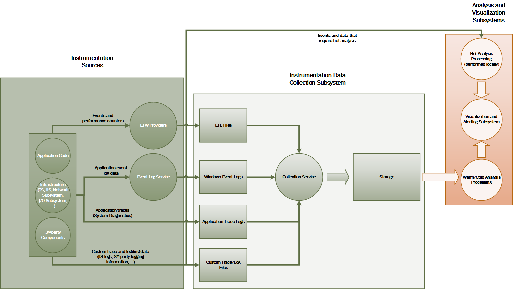
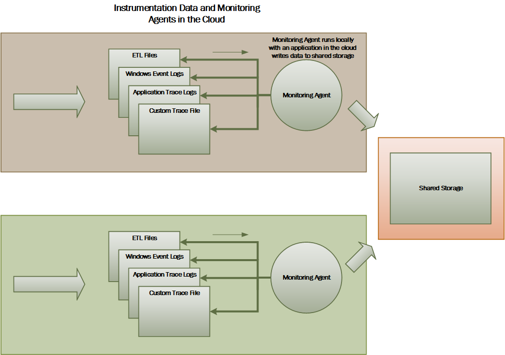
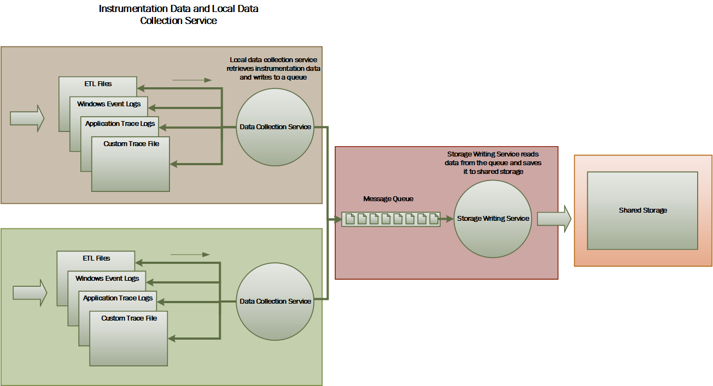
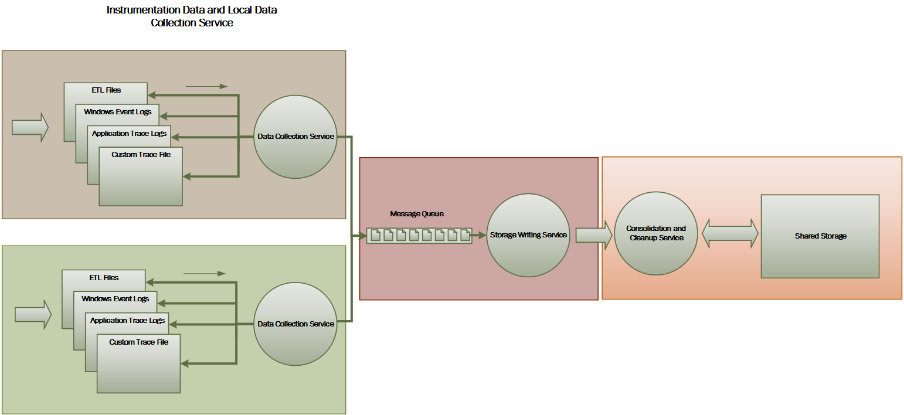

<properties
   pageTitle="Hinweise zur Überwachung und Diagnose | Microsoft Azure"
   description="Bewährte Methoden für die Überwachung verteilt Applications in der Cloud."
   services=""
   documentationCenter="na"
   authors="dragon119"
   manager="christb"
   editor=""
   tags=""/>

<tags
   ms.service="best-practice"
   ms.devlang="na"
   ms.topic="article"
   ms.tgt_pltfrm="na"
   ms.workload="na"
   ms.date="07/13/2016"
   ms.author="masashin"/>

# <a name="monitoring-and-diagnostics-guidance"></a>Hinweise zur Überwachung und Diagnose

[AZURE.INCLUDE [pnp-header](../includes/guidance-pnp-header-include.md)]

## <a name="overview"></a>(Übersicht)
Verteilte Anwendungen und Dienste, die in der Cloud ausgeführt sind, deren Natur komplexe Teile der Software, die viele gleitenden Teile umfassen. In einer Umgebung Herstellung ist es wichtig, in der Lage, wie nachzuverfolgen, in dem Benutzer nutzen, Ihre System "," Spur Ressource Auslastung können, und Überwachen von Zustand und Leistung von Ihrem System in der Regel. Können diese Informationen Diagnosezwecken erkennen und Beheben von Problemen, und auch so helfen potenzielle Probleme und verhindern, dass diese auftritt.

## <a name="monitoring-and-diagnostics-scenarios"></a>Überwachung und Diagnose Szenarien
Sie können die Überwachung Einblick einer wie ein System ordnungsgemäß ausgeführt werden. Überwachung ist wichtiger Bestandteil der Quality of Service Ziele verwalten. Häufige Szenarien zum Sammeln von Daten Überwachung umfassen:

- Um sicherzustellen, dass das System fehlerfrei erhalten bleibt.
- Verfolgen die Verfügbarkeit des Systems und seiner Komponente Elemente.
- Verwalten von Leistung, um sicherzustellen, dass der Durchsatz des Systems unerwartet nicht als die Lautstärke des Arbeit erhöht beeinträchtigt.
- Gewährleistung, dass das System alle Service Level Agreements (SLAs) mit Kunden hergestellt erfüllt.
- Sicherheit und das System, Benutzer und ihre Daten zu schützen.
- Nachverfolgen von den Vorgängen, die für die Überwachung oder behördliche Zwecke ausgeführt werden.
- Überwachung der täglichen Verwendung des Systems und Saisonverkäufen Trends, die möglicherweise zu Problemen führen, wenn sie nicht adressiert sind.
- Nachverfolgen von Problemen, die aus der anfänglichen Bericht durch Analyse der möglichen Ursachen, Berichtigung, infolge Softwareupdates und Bereitstellung auftreten.
- Spur Vorgänge und für das Debuggen Software-Versionen.

> [AZURE.NOTE] Diese Liste ist nicht umfassend sein soll. Dieses Dokument befasst sich diese Szenarios, wie häufig auftretenden Situationen zur Durchführung Überwachung. Möglicherweise gibt es andere Personen, die weniger verbreitet werden oder für Ihre Umgebung spezifisch sind.

In den folgenden Abschnitten werden diese Szenarien ausführlicher beschrieben. Die Informationen für jedes Szenario wird in folgendem Format behandelt:

1. Eine kurze Übersicht über das Szenario
2. Dieses Szenario den normalen Anforderungen
3. Die unformatierten Instrumentationsdaten, die zur Unterstützung der Szenario und mögliche Quellen dieser Informationen erforderlich ist
4. Wie diese unformatierten Daten analysiert und zum Generieren von aussagekräftigen Diagnoseinformationen kombiniert werden kann

## <a name="health-monitoring"></a>Überwachen des Systemzustands
Ein System ist fehlerfrei, wenn es ausgeführt wird und in der Verarbeitung von Besprechungsanfragen ist. Der Zweck des Systemzustands Überwachung ist eine Übersicht über den aktuellen Zustand des Systems generieren, damit Sie überprüfen können, dass alle Komponenten des Systems wie erwartet funktionieren.

### <a name="requirements-for-health-monitoring"></a>Anforderungen für die Überwachung des Systemzustands
Ein Operator sollte schnell (in wenigen Sekunden) gewarnt werden, wenn einen beliebigen Teil des Systems als fehlerhaft ist. Der Operator sollten festzustellen, welche Teile des Systems normal funktionieren und welche Teile Probleme auftreten können. Ein beliebiges Windows-System kann Systemzustand hervorgehoben werden:

- Rote für fehlerhafte (das System wurde beendet)
- Gelbe für teilweise fehlerfrei (System mit eingeschränkter Funktionalität ausgeführt wird)
- Grün: völlig fehlerfrei

Eine umfassende Systemüberwachungssystem ermöglicht einen Operator in Drilldown durch das System, um den Status des Teilsystemen und Komponenten anzeigen. Angenommen, wenn im gesamte System als teilweise fehlerfrei dargestellt ist, sollte der Operator möglicherweise zu vergrößern und zu bestimmen, welche Funktionalität momentan nicht verfügbar ist.

### <a name="data-sources-instrumentation-and-data-collection-requirements"></a>Datenquellen, Instrumentation und Datensammlung Anforderungen
Die unformatierten Daten, die zur Überwachung des Systemzustands Unterstützung erforderlich ist, können als Ergebnis des generiert werden:

- Spur Ausführung von Benutzeranfragen an. Diese Informationen kann verwendet werden, um zu bestimmen, welche Anfragen wurde erfolgreich abgeschlossen haben, die fehlgeschlagen sind und wie lange jeder Anforderung akzeptiert.
- Synthetische Benutzer zu überwachen. Dieser Vorgang simuliert die Schritte, die von einem Benutzer ausgeführt und eine vordefinierte Reihe von Schritten folgt. Die Ergebnisse der einzelnen Schritte sollten erfasst werden.
- Protokollieren von Ausnahmen, Fehlern und Warnungen. Diese Informationen kann als Ergebnis Spur Anweisungen in der Anwendungscode eingebettet sowie Abrufen von Informationen aus den Ereignisprotokollen beliebiger Dienste, die das System verweist erfasst werden.
- Überwachen die Integrität des Drittanbieter-Dienste, die das System verwendet. Diese Überwachung erfordern möglicherweise abrufen und Analysieren von Gesundheitsdaten, die diese Dienste bereitstellen. Diese Informationen kann eine Vielzahl von Formaten in Anspruch nehmen.
- Endpunkt zu überwachen. Dieses Verfahren ist im Abschnitt "Verfügbarkeit überwachen" ausführlicher beschrieben.
- Sammeln umgebende Leistungsinformationen, wie z. B. Hintergrund CPU-Auslastung oder (einschließlich Netzwerk) e/a-Aktivität.

### <a name="analyzing-health-data"></a>Analysieren von Daten Dienststatus
Überwachen des Systemzustands im Vordergrund steht ist, um schnell darauf hinzuweisen, ob das System ausgeführt wird. Wichtiges Analyse der sofortigen Daten kann eine Warnung ausgelöst, wenn eine wichtige Komponente als fehlerhaft erkannt wird. (Es kann beispielsweise aufeinanderfolgende Pings, beantworten.) Der Operator kann dann die entsprechende Maßnahme dauern.

Ein erweiterte System enthalten möglicherweise ein Element Vorhersage, die eine kalte Analyse über aktuelle und aktuelle Auslastung ausführt. Eine kalte Analyse können Sie erkennen von Trends und feststellen, ob das System wahrscheinlich fehlerfrei bleibt oder gibt an, ob das System zusätzliche Ressourcen benötigt werden. Dieses Element Vorhersage sollte wie auf kritische Performance-Werte basieren:

- Rate der Anfragen richtet sich an einzelnen Dienste oder Subsystem.
- Die Reaktionszeiten der diese anfordert.
- Die Lautstärke der Daten in die und aus jedem Dienst entdeckt.

Wenn der Wert von einer Metrik einen definierten Schwellenwert überschreitet, kann das System eine Benachrichtigung, um einen Operator oder eine automatische Skalierung (falls vorhanden) aktivieren aus, um die vorbeugende Aktionen für das Verwalten des Systemzustands erforderlich auslösen. Diese Aktionen möglicherweise umfassen Hinzufügen von Ressourcen, die eine oder mehrere Dienste, die weiß nicht, oder auf Anfragen mit niedriger Priorität anwenden begrenzungsebene neu starten.

## <a name="availability-monitoring"></a>Überwachung der Verfügbarkeit
Eine wirklich fehlerfrei System erfordert, dass die Komponenten und Teilsystemen, die das System verfassen verfügbar sind. Überwachung der Verfügbarkeit ist zu überwachen des Systemzustands eng miteinander verbunden. Aber die Überwachung des Systemzustands umgehend einen Überblick über den aktuellen Zustand des Systems sieht, Überwachung der Verfügbarkeit mit Überwachung der Verfügbarkeit des Systems und seine Komponenten zum Generieren von Statistiken über die Verfügbarkeit des Systems befasst.

In vielen Systemen sind einige Komponenten (beispielsweise eine Datenbank) mit integrierten redundant schnelles Failover im Fall einer schwerwiegenden Fehler oder Verlust der Konnektivität zulassen konfiguriert. Idealerweise sollten Benutzer nicht bekannt sein, dass solche ein Fehler aufgetreten ist. Jedoch aus einer Verfügbarkeit Perspektive Überwachung, ist es erforderlich, so viele Informationen wie möglich über solche Fehler an, die Ursache, und führen Maßnahmen bis zu der sie eine Wiederholung verhindern sammeln.

Die Daten, die zum Nachverfolgen von Verfügbarkeit erforderlich hat möglicherweise eine Reihe von Low-Level-Faktoren abhängig sind. Viele dieser Faktoren möglicherweise speziell für die Anwendung, System und Umgebung. Ein effektives Überwachung System erfasst werden, die von Verfügbarkeitsdaten, die diese Low-Level Faktoren entspricht, und klicken Sie dann fasst zusammen, um einen Überblick über das System gewähren. Beispielsweise ein e-Commerce-System abhängen die Funktionalität für das Unternehmen, die einen Kunden zum Bestellen ermöglicht, Repository Bestelldetails gespeichert werden und die Zahlungssystem, das die monetären Transaktionen für die Zahlung für diese Bestellungen behandelt. Die Verfügbarkeit des Webparts Reihenfolge-Platzierung des Systems ist daher eine Funktion der Verfügbarkeit von Repository und Teilsystems Zahlung.

### <a name="requirements-for-availability-monitoring"></a>Anforderungen für die Überwachung der Verfügbarkeit
Ein Operator sollte auch die zurückliegende Verfügbarkeit der einzelnen System und Subsystem anzeigen und Erkennen von Trends, die eine oder mehrere Teilsystemen regelmäßig treten verursachen kann mithilfe dieser Informationen möglich sein. (Führen Sie Dienste anfangen zu einem bestimmten Zeitpunkt des Tages fehlschlägt, der Höchstwert Verarbeitung Stunden entspricht?)

Eine Lösung Überwachung sollte eine sofortige und zurückliegende Überblick über die Verfügbarkeit oder darauf, dass für jedes Subsystem bereitstellen. Sie sollten auch in der Warnung schnell eines Operators aus, wenn ein oder mehrere Fail services oder Benutzer mit Webdiensten herstellen können nicht. Dies ist eine Frage der nicht nur für die Überwachung jedem Dienst, sondern auch Untersuchen der Aktionen, die jeder Benutzer ausführt, wenn diese Aktionen fehl, wenn sie versuchen, mit einem Dienst kommunizieren. Zu einem gewissen Grad ein Maß Verbindungsproblemen ist normal und möglicherweise aufgrund einer vorübergehenden Fehler. Aber es möglicherweise hilfreich sein, damit das System, um eine Benachrichtigung für die Anzahl von Konnektivitätsfehlern zu einem angegebenen Subsystems auszulösen, die während eines bestimmten Zeitraums auftreten.

### <a name="data-sources-instrumentation-and-data-collection-requirements"></a>Datenquellen, Instrumentation und Datensammlung Anforderungen
Wie bei der Überwachung des Systemzustands, können die unformatierten Daten, die zur Überwachung der Verfügbarkeit Unterstützung erforderlich ist generiert werden, weil synthetische Benutzer für die Überwachung und Protokollierung alle Ausnahmen, Fehlern und Warnungen, die auftreten können. Darüber hinaus können Verfügbarkeitsdaten abgerufen werden, aus der Durchführung Endpunkt Überwachung. Die Anwendung kann verfügbar machen, einem oder mehreren Gesundheit Endpunkten, jede testen Zugriff auf ein funktionsübergreifendes Bereich innerhalb des Systems. Das System der Überwachung können Sie jeden Endpunkt pingen, indem Sie nach einem festgelegten Zeitplan und die Ergebnisse (Erfolg oder Fail) sammeln.

Alle Zeitlimit, Fehlern der Netzwerkkonnektivität und Verbindung Wiederholungsversuche aufgezeichnet werden. Alle Daten sollten Zeitstempel.

<a name="analyzing-availability-data"></a>
### <a name="analyzing-availability-data"></a>Analysieren von Verfügbarkeitsdaten
Die Instrumentationsdaten müssen zusammengefasster und unterstützt die folgenden Arten von Analyse in Beziehung gesetzt werden:

- Die sofortige Verfügbarkeit des Systems und Teilsystemen.
- Die Verfügbarkeit der Fehler Einheitensätze des Systems und Teilsystemen. Idealerweise sollten ein Operator können Fehler mit bestimmten Aktivitäten zu koordinieren: Was passiert wurde, wenn das System fehlgeschlagen ist?
- Eine zurückliegende Ansicht periodisch Fehler des Systems oder einer beliebigen Teilsystemen über eine angegeben Zeitraum, und das Laden System (Anzahl der Benutzeranfragen, beispielsweise) Wenn ein Fehler aufgetreten ist.
- Gründe für Ausfall des Systems oder einer beliebigen Teilsystemen. Angenommen, die aus den folgenden Gründen möglicherweise Dienst wird nicht ausgeführt, Konnektivität verloren gegangen sind, aber Timeout und verbundenen aber Rückgabe Fehler verbunden.

Sie können die Prozentsatz der Verfügbarkeit eines Diensts über einen Zeitraum berechnen, indem Sie die folgende Formel:

```
%Availability =  ((Total Time – Total Downtime) / Total Time ) * 100
```

Dies ist für die Vereinbarung zum SERVICELEVEL. (Die[Überwachung Vereinbarung zum SERVICELEVEL](#SLA-monitoring) wird später in diesem Handbuch ausführlicher beschrieben.) Die Definition _Ausfall_ abhängig vom Dienst. Visual Studio Team Services Build Service definiert z. B. Ausfallzeiten als Periode (Gesamtzahl der kumulierten Minuten) während, die Build-Dienst nicht verfügbar ist. Eine Minute um gilt als nicht verfügbar, wenn alle fortlaufende auf HTTP-Anfragen Build-Dienst zum Ausführen von Vorgängen in der gesamten die Minute Kunden initiiert entweder dazu führen, ein Fehlercode dass oder eine Antwort keine zurück.

## <a name="performance-monitoring"></a>Überwachen der Leistung
Wie das System mehr Belastung (durch erhöhen die Lautstärke der Benutzer) platziert wurde, werden die Größe der Datensätze, die diesen Benutzern den Zugriff wächst und die Möglichkeit, bei der eine oder mehrere Komponenten sehr viel eher bereit. Fehler bei der Komponente ist häufig, einer Verschlechterung der Leistung vorangestellt. Fortgeschrittener können erkennen solche eine Abnahme, Sie können treffen, das Problem zu lösen.

Systemleistung hängt von einer Reihe von Faktoren ab. Jeder Faktor wird in der Regel durch Key Performance Indicators (KPIs), gemessen, wie die Anzahl der Datenbanktransaktionen pro Sekunde oder Netzwerk-Abfragen, die in einem bestimmten Zeitraum erfolgreich bearbeitet werden. Einige der diese KPIs möglicherweise als spezifische Performance Measures, verfügbar, während andere Personen aus einer Kombination von Kennzahlen abgeleitet werden können.

> [AZURE.NOTE] Bestimmen beeinträchtigt oder gute Leistung müssen Sie die Ebene der Leistung kennen, das System der Ausführung werden sollte. Setzt das System beobachten, während sie eine normale Auslastung fungiert, und erfassen die Daten für jeden KPI über einen Zeitraum. Dies kann das System eines simulierten Auslastung in einer testumgebung ausgeführt, und tragen die entsprechenden Daten vor der Bereitstellung des Systems in einer Umgebung für die Herstellung umfassen.

> Sie sollten auch sicherstellen, dass für die Überwachung zur Optimierung der Systemleistung keine Belastung für das System werden. Sie können möglicherweise dynamisch passen Sie die Detailebene für die Daten, die die Prozess zum Überwachen der Leistung sammelt.

### <a name="requirements-for-performance-monitoring"></a>Kriterien für die Überwachung der Leistung
Zum Untersuchen der Systemleistung muss ein Operator normalerweise Informationen anzuzeigen, enthält:

- Die Antwort der Einheitensätze für benutzeranforderungen.
- Die Anzahl der gleichzeitigen Benutzer Serviceanfragen.
- Die Lautstärke der Netzwerkdatenverkehr.
- Die Sätze, bei denen, die Geschäftsdokumente Transaktionen abgeschlossen werden.
- Die durchschnittliche Verarbeitungszeit für Besprechungsanfragen.

Es kann auch hilfreich sein, Tools bereitstellen, mit die ein Operators Korrelationen, wie helfen können:

- Die Anzahl der gleichzeitigen Benutzer im Vergleich zu Anforderung Wartezeit Zeiten (wie lange starten Verarbeitung einer Anforderung dauert, nachdem es der Benutzer gesendet hat).
- Die Anzahl der gleichzeitigen Benutzer im Vergleich zu den Mittelwert Antwortzeit (wie lange dauert die Anforderung durchführen, nachdem es gestartet wurde processing).
- Der Lautstärke im Vergleich zur Anzahl von Verarbeitungsfehlern bei der von Besprechungsanfragen.

Zusammen mit dieser Informationen auf hoher Ebene funktionsübergreifendes sollte ein Operator eine Detailansicht der Leistung für jede Komponente im System übernehmen kann. Diese Daten werden in der Regel über Low-Level-Datenquellen bereitgestellt, die Informationen nachverfolgen:

- Arbeitsspeichernutzung.
- Anzahl der Threads.
- CPU-Verarbeitungszeit.
- Anfordern der Länge der Warteschlange.
- Festplatte oder im Netzwerk e/a-Sätze und Fehlern.
- Die Anzahl von Bytes, die geschrieben oder gelesen.
- Middleware Indikatoren, z. B. Warteschlangenlänge.

Alle Visualisierungen sollten Operators, um den Zeitraum anzugeben zulassen. Die angezeigten Daten möglicherweise eine Momentaufnahme der aktuellen Situation und/oder eine zurückliegenden Ansicht die Leistung.

Ein Operator sollte eine Benachrichtigung basierend auf jede Maßnahme Leistung für alle angegebenen Wert während alle angegebenen Zeitintervalls auslösen können.

### <a name="data-sources-instrumentation-and-data-collection-requirements"></a>Datenquellen, Instrumentation und Datensammlung Anforderungen
Sie können auf hoher Ebene Leistungsdaten (Durchsatz, Anzahl der gleichzeitigen Benutzer, die Anzahl der geschäftliche Transaktionen, Sätzen Fehler usw.) durch Überwachen des Abfragen von Benutzern, wie sie eintreffen und pass-through System sammeln. Dies umfasst Tracing Anweisungen bei der wichtigsten Punkte in der Anwendungscode, zusammen mit Informationen zur Anzeigedauer einbinden. Alle Fehlern, Ausnahmen und Warnungen sollte mit ausreichend Daten für das sie mit der Besprechungsanfragen, die sie verursacht abgleichen erfasst werden. Das Protokoll Internet Information Services (IIS) ist eine andere nützliche Quelle.

Falls möglich, sollten Sie Performance-Daten für alle externe Systeme erfassen, die die Anwendung verwendet. Diese externe Systeme möglicherweise eigene Leistungsindikatoren oder anderen Features zum Anfordern der Leistungsdaten bieten. Wenn dies nicht möglich, Datensatz Informationen, wie etwa die Start- und Endzeit der einzelnen Anforderung an einem externen System, zusammen mit dem Status des Vorgangs (Erfolg, Fail oder Warnung) ist. Beispielsweise können eine Stoppuhr und systematisch zu Zeit Besprechungsanfragen: eine Zeitmessung starten, wenn die Anforderung gestartet wird, und halten Sie den Zeitgeber an, wenn die Anforderung endet.

Niedriger Leistungsdaten für einzelne Komponenten in einem System möglicherweise über die Features und Dienste wie Windows-Datenquellen und Azure-Diagnose verfügbar.

### <a name="analyzing-performance-data"></a>Analysieren von Leistungsdaten
Ein großer Teil der Arbeit Analysis besteht aus Aggregieren von Leistungsdaten durch Anforderung Benutzertyp und/oder den Subsystem oder den Dienst, der jede Anforderung gesendet wird. Ein Beispiel für eine Besprechungsanfrage Benutzer Hinzufügen eines Elements zu einem Einkaufswagen oder Durchführung des Auscheckvorgangs in einem e-Commerce-System.

Eine andere allgemeine Anforderung ist Performance-Daten in der ausgewählten Quantile zwischen zusammenfassen. Beispielsweise möglicherweise ein Operator die Reaktionszeiten für 99 Prozent der Anfragen, 95 Prozent Anfragen und 70 % der Anfragen ermitteln. Möglicherweise Vereinbarung zum SERVICELEVEL Ziele oder andere Ziele für jede Quantil festlegen. Die laufenden Ergebnisse sollten nahezu in Echtzeit helfen sofortige Probleme erkennen gemeldet werden. Die Ergebnisse sollten auch über die längere Zeit für statistische Zwecke aggregiert sein.

Wenn die Leistung beeinträchtigen Wartezeitprobleme sollten ein Operator können die Ursache des Engpasses schnell zu erkennen, indem Sie die Wartezeit der einzelnen Schritte, die jeder Anforderung ausführt. Die Leistungsdaten müssen daher ein Verfahren zum Abgleichen von Leistung Measures für die einzelnen Schritte, um diese zu einer bestimmten Besprechungsanfrage verbinden bereitstellen.

Je nach den Anforderungen Visualisierung ist es möglicherweise sinnvoll generieren und speichern einen Datencube, der Ansichten der unformatierten Daten enthält. Diese Datencube kann komplexe ad-hoc-Abfragen und Analyse der Leistungsinformationen zulassen.

## <a name="security-monitoring"></a>Überwachen der Sicherheit
Alle kommerzielle Systeme, die vertrauliche Daten enthalten, müssen eine Sicherheitsstruktur implementieren. Die Komplexität des Verfahrens Sicherheit ist in der Regel eine Funktion die Vertraulichkeit von Daten. Systeme, die Benutzer authentifiziert werden müssen, sollten Sie aufzeichnen:

- Alle Anmeldung Versuche, gibt an, ob sie ein Fehler auftreten, oder ein Fehler aufgetreten.
- Alle Vorgänge durch – und die Details aller Ressourcen Zugriffe von – einem authentifizierten Benutzer.
- Wenn ein Benutzer eine Sitzung endet und bei abgemeldet.

Überwachung möglicherweise Angriffen System erkennen können. Beispielsweise möglicherweise eine große Anzahl von fehlgeschlagene Versuche einer Bruteforce-Angriffen anzugeben. Ein unerwarteter Onlinediebstahl Anfragen möglicherweise das Ergebnis von verteilten DOS Angriffen (DDoS). Sie müssen Sie vorbereiten alle Anfragen auf alle Ressourcen unabhängig von der Quelle der diese Anfragen zu überwachen. Ein System, eine Anmeldung Sicherheitsrisiko sind, möglicherweise versehentlich Ressourcen nach außen verfügbar machen, ohne dass der Benutzer tatsächlich anmelden.

### <a name="requirements-for-security-monitoring"></a>Kriterien für die Überwachung der Sicherheit
Die wichtigsten Aspekte der Sicherheit Überwachung sollte Operators, um schnell aktivieren:

- Erkennen Sie versuchte Angriffen, indem Sie eine nicht authentifizierte Entität.
- Identifizieren Sie auch von Personen zum Ausführen von Vorgängen auf Daten, für die sie nicht Zugriff gewährt wurde.
- Bestimmen Sie, ob das System oder ein Teil des Systems, klicken Sie unter Angriffen von außerhalb oder innerhalb ist. (Z. B. möglicherweise ein bösartiger authentifizierter Benutzer versuchen, das System nach unten zu bringen.)

Um diese Anforderungen unterstützen, sollte ein Operator benachrichtigt werden:

- Wenn Sie ein Konto wiederholten macht Fehler bei Anmeldung Versuche innerhalb eines bestimmten Zeitraums
- Wenn Sie einem authentifiziertes Konto wiederholt versucht, eine Ressource unzulässige während eines bestimmten Zeitraums zugreifen.
- Wenn eine große Anzahl von nicht authentifizierte oder nicht autorisierte Anfragen während eines bestimmten Zeitraums auftreten.

Die Informationen, die einem Operator bereitgestellt wird, sollte den Hostadresse der Quelle für jede Anforderung enthalten. Wenn Sicherheitsverstöße regelmäßig aus einem bestimmten Bereich von Adressen ergeben, können diese Hosts blockiert werden.

Eine wichtige Rolle bei Beibehaltung der Sicherheits eines Systems wird schnell erkennen von Aktionen, die von dem üblichen Muster abweichen. Informationen wie die Anzahl der Fehler beim und/oder erfolgreich anmeldeanforderungen kann visuell angezeigt werden, wenn Sie feststellen, ob es eine Sammlung in Aktivität gleichzeitig eine ungewöhnliche ist. (Ein Beispiel für diese Aktivität ist ein Benutzer melden Sie sich bei 3:00 Uhr und eine große Anzahl von Vorgängen ausführen, wenn ihre Tag um 9:00 Uhr beginnt). Diese Informationen kann auch verwendet werden, helfen zeitbasierte automatische Skalierung konfigurieren. Beispielsweise, wenn in ein Operator verwendet wird, dass eine große Anzahl von Benutzern regelmäßig melden Sie sich zu einem bestimmten Zeitpunkt des Tages, der Operator kann anordnen, um zusätzliche Authentifizierungsdienste zum Behandeln der Lautstärke der Arbeit, und klicken Sie dann diese zusätzlichen Dienste herunter, wenn der Höchstwert überschritten hat zu starten.

### <a name="data-sources-instrumentation-and-data-collection-requirements"></a>Datenquellen, Instrumentation und Datensammlung Anforderungen
Sicherheit ist ein Aspekt umfassenden am häufigsten verteilte Systeme. Die relevanten Daten ist zu rechnen an mehreren Punkten im gesamten System generiert werden soll. Sie sollten einen Ansatz Informationen zu Sicherheit und Ereignis Management (SIEM), um die Sicherheits-Informationen zu erfassen, die aus den von der Anwendung, Netzwerkgeräte, Server, Firewalls, Antivirensoftware und andere Elemente Intrusionsprävention ausgelöste Ereignisse ergibt eingeführt.

Überwachung der Sicherheit kann Daten aus Tools einbinden, die nicht Teil Ihrer Anwendung sind. Diese Tools können Dienstprogramme umfassen, die identifizieren Scannen von Ports Aktivitäten nach externer Stellen oder Netzwerkfilter, die auch nicht authentifizierte Zugriff auf Ihre Anwendung und Daten zu erkennen.

In allen Fällen müssen die erfassten Daten ein Administrator bestimmen Sie die Art von einem beliebigen Angriffen und machen Sie die entsprechenden Gegenmaßnahmen aktivieren.

### <a name="analyzing-security-data"></a>Analysieren von Sicherheitsdaten
Ein Feature der Sicherheit Überwachung ist die verschiedenen Quellen, aus denen die Daten entsteht. Die verschiedenen Formate und Detailebene erfordern häufig komplexe Analyse erfassten Daten es gemeinsam in einem zusammenhängendes Thread der Informationen einbinden. Abgesehen von den einfachsten Fällen (z. B. Erkennen von einer großen Anzahl Fehler beim Anmelden-ins oder wiederholte Versuche, nicht autorisierten Zugriff auf wichtige Ressourcen) möglicherweise es nicht möglich, die komplexe automatisierte Verarbeitung von Sicherheitsdaten auszuführen. Stattdessen kann es zum Schreiben dieser Daten, aber in ihrer ursprünglichen Form, um ein sicheres Repository für Experten manuelle Analyse dürfen andernfalls Zeitstempel empfehlenswert sein.

<a name="SLA-monitoring"></a>

## <a name="sla-monitoring"></a>Überwachen der Vereinbarung zum SERVICELEVEL
Viele kommerzielle Systeme, die zahlende Kunden unterstützen, stellen Garantien über die Leistung des Systems in Form von SLAs. Im Wesentlichen besagen SLAs eines definierten Lautstärke Arbeit innerhalb eines Zeitrahmens vereinbarten und ohne wichtigen Informationen verloren gehen das System verarbeitet werden kann. Überwachen der Vereinbarung zum SERVICELEVEL kümmern um sicherzustellen, dass das System messbare SLAs erfüllen kann.

> [AZURE.NOTE] Überwachen der Vereinbarung zum SERVICELEVEL wird zum Überwachen der Leistung eng miteinander verbunden. Aber Leistung Überwachung betreffenden mit sicherstellen, dass das System Funktionen _optimal_, Vereinbarung zum SERVICELEVEL Überwachung unterliegt einer Vertragspflicht, die definiert, welche _optimal_ tatsächlich bedeutet.

SLAs werden häufig hinsichtlich der definiert:

- Verfügbarkeit. Eine Organisation möglicherweise beispielsweise sichergestellt ist, dass das System für 99,9 Prozent der Zeit zur Verfügung steht. Dies entspricht nicht mehr als 9 Stunden Ausfall pro Jahr oder ungefähr 10 Minuten pro Woche.
- Betrieb Durchsatz. Dieser Aspekt wird häufig als eine oder mehrere – Hochwassermarken, wie sichergestellt wird, dass das System kann bis zu 100.000 gleichzeitige benutzeranforderungen unterstützen oder 10.000 gleichzeitige geschäftliche Transaktionen behandeln.
- Reaktionszeiten. Das System möglicherweise auch Garantien für die Rate Stellen zur Verarbeitung von Besprechungsanfragen. Ein Beispiel ist, dass 99 Prozent aller geschäftliche Transaktionen innerhalb von 2 Sekunden beenden werden und keine einzelnen Transaktion länger als 10 Sekunden dauert.

> [AZURE.NOTE] Einige Verträge für kommerzielle Systeme enthalten möglicherweise auch SLAs für den Kundensupport. Ein Beispiel ist, dass alle Helpdesk-Anfragen eine Antwort innerhalb von 5 Minuten auslösen werden und 99 Prozent aller Probleme vollständig in 1 Tag gesendet wird. Effektive [problemverfolgung](#issue-tracking) (weiter unten in diesem Abschnitt beschriebenen) kann wesentlich SLAs wie diese Besprechung.

### <a name="requirements-for-sla-monitoring"></a>Kriterien für die Überwachung der Vereinbarung zum SERVICELEVEL
Auf der höchsten Ebene sollten ein Operator auf einen Blick feststellen, ob das System die vereinbarten SLAs Besprechung ist. Und wenn nicht, der Operator Ausführen von Drilldowns oder kann soll nach unten, und überprüfen Sie die zugrunde liegenden Faktoren Ermittlung Gründen nicht dem Standard entsprechenden Leistung.

Typische auf hoher Ebene Indikatoren, die visuell dargestellt werden können umfassen:

- Der Prozentsatz der Dienst Verfügbarkeit.
- Die Anwendungsdurchsatz (gemessen in Bezug auf die erfolgreiche Transaktionen und/oder Vorgänge pro Sekunde).
- Die Anzahl der erfolgreichen/fehlerhafte Anwendung Anfragen.
- Die Anzahl der Anwendung und System Fehler, Warnungen und Ausnahmen.

Alle der folgenden Indikatoren sollten, nach einem bestimmten Zeitraum der gefiltert werden kann.

Eine Reihe von Teilsystemen und Komponenten umfassen eine Cloud-Anwendung wahrscheinlich. Ein Operator sollte Lage, wählen Sie einen auf hoher Ebene Indikator und sehen, wie es in die Integrität des zugrunde liegenden Elemente zusammengestellt wurde. Beispielsweise fällt die Verfügbarkeit des gesamten Systems unter ein zulässiger Wert, sollten ein Operator vergrößern und zu bestimmen, welche Elemente zu diesem Fehler beitragen können.

> [AZURE.NOTE] Verfügbarkeit von System muss sorgfältig definiert werden. In einem System, die Redundanz verwendet, um eine maximalen Verfügbarkeit sicherzustellen, einzelne Instanzen von Elementen können ein Fehler auftreten, aber das System kann bleiben funktionsfähig. System Verfügbarkeit durch Überwachen des Systemzustands vorgestellten sollte angeben, die aggregate Verfügbarkeit der einzelnen Elemente und nicht unbedingt, ob das System tatsächlich angehalten wurde. Darüber hinaus möglicherweise Fehlern isoliert werden. Auch wenn ein bestimmtes System nicht verfügbar ist, der Rest des Systems verfügbar zwar mit bei verringertem Funktionen bleiben erhalten möglicherweise. (In einer e-Commerce-System, ein Fehler im System möglicherweise verhindern, dass ein Kunde Bestellungen platzieren, aber der Kunden möglicherweise noch Produktkatalog durchsuchen.)

Eine Warnung Zwecke, sollte das System möglicherweise ein Ereignis ausgelöst, wenn eine der Indikatoren auf hoher Ebene einen angegebenen Schwellenwert überschreitet. Die Low-Level-Details der verschiedenen Faktoren, die den auf hoher Ebene Indikator verfassen sollte als kontextbezogene Daten der Warnsystem verfügbar sein.

### <a name="data-sources-instrumentation-and-data-collection-requirements"></a>Datenquellen, Instrumentation und Datensammlung Anforderungen
Die unformatierten Daten, die erforderlich ist, um Unterstützung für die Überwachung Vereinbarung zum SERVICELEVEL ähnelt die unformatierten Daten, die für die Leistung Überwachung, zusammen mit einige Aspekte des Gesundheit und Überwachung der Verfügbarkeit erforderlich ist. (Siehe die Abschnitte für weitere Details.) Sie können diese Daten durch erfassen:

- Durchführung Endpunkt zu überwachen.
- Protokollieren von Ausnahmen, Fehlern und Warnungen.
- Verfolgen der Ausführung von Benutzeranfragen an.
- Überwachen der Verfügbarkeit von einem beliebigen Drittanbieter-Diensten, die das System verwendet.
- Verwenden von Leistungswerte und Indikatoren.

Alle Daten müssen zeitlich und Zeitstempel.

### <a name="analyzing-sla-data"></a>Analysieren von Daten Vereinbarung zum SERVICELEVEL
Die Instrumentationsdaten müssen aggregiert sein, um einen Überblick über die allgemeine Leistung des Systems zu generieren. Aggregierte Daten müssen ebenfalls Drilldown zum Aktivieren der Prüfung der Leistung der zugrunde liegenden Teilsystemen unterstützen. Angenommen, sollten Sie können:

- Berechnen Sie die Gesamtzahl der benutzeranforderungen während eines bestimmten Zeitraums und ermitteln Sie den Erfolg und Fehler Zinsfuß dieser Anfragen.
- Kombinieren Sie die Reaktionszeiten der Benutzeranfragen einen allgemeinen Überblick über Reaktionszeiten generieren.
- Analysieren Sie den Fortschritt der Benutzeranfragen der gesamten derart einer Anforderung in die Reaktionszeiten der einzelnen Arbeitselemente in dieser Anforderung aufgehoben werden muss.  
- Ermitteln Sie die allgemeine Verfügbarkeit des Systems als Prozentsatz der Verfügbarkeit für eine bestimmte Periode zurück.
- Analysieren Sie die Prozentsatz der Zeit Verfügbarkeit der einzelnen Komponenten und Dienste im System. Dies möglicherweise umfassen, analysieren Protokolle, die Dienste von Drittanbietern erstellt wurden.

Viele kommerzielle Systeme sind erforderlich, real Leistungswerte gegen vereinbarten SLAs für eine bestimmte Periode zurück, die in der Regel einen Monat zu melden. Diese Informationen kann verwendet werden, zum Berechnen von Gutschriften oder anderer Formen der Tilgungsmodalitäten für Kunden, wenn die SLAs innerhalb dieses Zeitraums nicht erfüllt ist. Sie können die Verfügbarkeit für einen Dienst berechnen, mithilfe der Methode im Abschnitt [Verfügbarkeit Analysieren von Daten](#analyzing-availability-data)beschrieben.

Für interne Zwecke möglicherweise auch eine Organisation nachverfolgen, die Anzahl und die Art der Fälle, die zum Fehlschlagen Services verursacht. Lernen, wie Sie diese Probleme schnell zu lösen oder vollständig, zu unterdrücken hilft Ausfallzeiten reduzieren und SLAs erfüllen.

## <a name="auditing"></a>Überwachung
Je nach Art der Anwendung möglicherweise gesetzlichen oder eine andere gesetzliche Vorschriften, die Anforderungen für Benutzer Vorgänge Überwachung und Aufzeichnung des Zugriffs auf alle Daten angeben. Überwachung kann die Kunden Links zu bestimmten Besprechungsanfragen Beweisen. Die Nachweisbarkeit ist, dass ein wichtiger Faktor in vielen e-Business-Systemen helfen Trust beibehalten werden, zwischen einem Kunden und der Organisation, die für die Anwendung oder den Dienst zuständig ist.

### <a name="requirements-for-auditing"></a>Anforderungen für die Überwachung
Analysten muss möglicherweise die Abfolge von Geschäftsabläufen verfolgen, denen Benutzer ausgeführt werden, damit Sie Aktionen der Benutzer rekonstruieren können. Dies möglicherweise erforderlich einfach als eine Frage der Eintrag oder als Teil eines gerichtliche Untersuchung sein.

Audit Informationen sind sehr vertraulich. Es wird wahrscheinlich Daten enthalten, die die Benutzer des Systems, zusammen mit den Aufgaben bezeichnet, die sie gerade durchführen. Aus diesem Grund Audit Informationen dauert der Formulars von Berichten, die nur vertrauenswürdigen Analysten zur Verfügung stehen in den meisten Fällen statt als interaktive getestet, Drilldown grafisch Vorgänge unterstützt. Analysten sollte einen Bereich von Berichten generieren können. Beispielsweise möglicherweise Berichte Liste alle Benutzer Aktivitäten, die während eines bestimmten Zeitraums auftreten, die Informationen für einen einzelnen Benutzer Tätigkeit Einzelheitenarten oder Liste die Abfolge von Vorgängen anhand einer oder mehreren Ressourcen ausgeführt.

### <a name="data-sources-instrumentation-and-data-collection-requirements"></a>Datenquellen, Instrumentation und Datensammlung Anforderungen
Die primären Quellen von Informationen für die Überwachung können einbeziehen:

- Das Sicherheitssystem,, das Benutzerauthentifizierung verwaltet werden.
- Verfolgen von Protokollen, die Benutzeraktivitäten aufzeichnen.
- Sicherheitsprotokolle, die alle identifiable und nicht identifizierbares Netzwerkanfragen zu verfolgen.

Das Format der Daten im Überwachungsbericht und die Möglichkeit, in der sie gespeichert ist, möglicherweise von gesetzlich gesteuert werden. Angenommen, es nicht möglich, die Daten in keiner Weise zu bereinigen möglicherweise. (Es muss in ihrem Originalformat aufgezeichnet.) Zugriff auf das Repository, in denen es gespeichert ist, muss geschützt werden, um zu verhindern, dass manipuliert werden.

### <a name="analyzing-audit-data"></a>Analysieren von Daten im Überwachungsbericht
Analysten muss die unformatierten Daten in ihrer ursprünglichen Form komplett zugreifen können. Abgesehen davon, dass die Anforderung, allgemeine Auditberichte zu erstellen werden die Tools zum Analysieren dieser Daten wahrscheinlich spezialisierte und externen System beibehalten werden.

## <a name="usage-monitoring"></a>Überwachen der Verwendung
Verwendung Überwachung verfolgt, wie die Features und Komponenten einer Anwendung verwendet werden. Ein Operator kann die erfassten Daten zu verwenden:

- Feststellen Sie welche Features sind ausgelastet und alle möglichen Hotspots im System. Elemente mit hohem Datenverkehr möglicherweise von funktionsübergreifendes Partitionierung oder sogar Replikation die laden gleichmäßiger zu profitieren. Einen Operator kann diese Informationen auch verwenden, um festzustellen, welche Features sind selten verwendet und möglichen Kandidaten Rente oder Ersatz in zukünftigen Versionen des Systems sind.
- Informationen zu den Ereignissen Betrieb des Systems bei normaler Verwendung zu erhalten. In einer e-Commerce-Website, können Sie beispielsweise die statistische Informationen über die Anzahl der Transaktionen und die Lautstärke der Kunden, die sie verantwortlich sind aufzeichnen. Diese Informationen kann verwendet werden, für die Planung Kapazität, wenn die Anzahl der Kunden wächst.
- Erkennen Sie (möglicherweise indirekt) Benutzer zufrieden mit der Leistung oder Funktionalität des Systems. Beispielsweise, wenn eine große Anzahl von Kunden in einem e-Commerce-System regelmäßig ihren Einkaufswagen aufgeben, wird möglicherweise ein Problem mit den Funktionen Auschecken Ursachen möglich.
- Generieren Sie Abrechnungsinformationen an. Einen professionellen Anwendung oder mandantenfähigen Dienst möglicherweise Kunden für die Ressourcen entstehen, die sie verwenden.
- Erzwingen von Kontingenten an. Wenn ein Benutzer in einem mandantenfähigen System deren kostenpflichtiges Kontingent für die Verarbeitung von Zeit oder Ressource: Einsatz während eines bestimmten Zeitraums überschreitet, deren Zugriff kann begrenzt werden oder Verarbeitung gedrosselt werden kann.

### <a name="requirements-for-usage-monitoring"></a>Kriterien für die Überwachung Verwendung
Zum Untersuchen der Verwendung des Systems muss ein Operator normalerweise Informationen anzuzeigen, enthält:

- Die Anzahl der Anfragen, die jedes Subsystem verarbeiteten und jeder Ressource gerichtet sind.
- Die Arbeit, die jeder Benutzer durchführt.
- Die Lautstärke der Datenspeicher, der jedem Benutzer einnimmt.
- Die Ressourcen, die jeder Benutzer zugreifen wird.

Ein Operator sollte auch Diagramme generieren können. Beispielsweise ein Diagramm möglicherweise die am häufigsten Ressource Suche nach Anerkennung Benutzer anzeigen oder die am häufigsten zugegriffen wird, Ressourcen oder Systemfeatures.

### <a name="data-sources-instrumentation-and-data-collection-requirements"></a>Datenquellen, Instrumentation und Datensammlung Anforderungen
Verwendung der Überwachung kann auf relativ hoher Ebene durchgeführt werden. Sie können die Start- und Endzeiten jeder Anforderung und die Art der Anfrage (Lesen, schreiben usw., je nach die betreffende Ressource) beachten. Sie können diese Informationen durch zu erhalten:

- Verfolgen von Benutzeraktivitäten.
- Erfassen von Datenquellen, die die Auslastung für jede Ressource messen.
- Überwachung des Ressourcenverbrauchs durch jeden Benutzer.

Für die Erfassung Zwecke, müssen Sie auch in der Lage zu identifizieren, welche Benutzer zur Durchführung, welche Vorgänge und Ressourcen, die diese Vorgänge nutzen verantwortlich sind. Die erfassten Informationen werden sollte detailliert genug genau Abrechnung aktivieren.

<a name="issue-tracking"></a>
## <a name="issue-tracking"></a>Problemverfolgung
Kunden und anderen Benutzern möglicherweise Probleme informieren, wenn das System unerwartete Ereignisse oder Verhalten auftritt. Problemnachverfolgung mit verwalten diese Probleme zu beheben alle zugrunde liegenden Probleme im System zuordnen und darüber informiert Kunden von Lösungsmöglichkeiten befasst.

### <a name="requirements-for-issue-tracking"></a>Anforderungen für problemnachverfolgung
Operatoren führen häufig problemnachverfolgung mit einem separaten System, mit deren die Details zu Problemen Eintrag und Berichte kann diesen Bericht Benutzer. Diese Details können die Aufgaben enthalten, die der Benutzer versucht hat, mit der Durchführung Symptome für das Problem, die Abfolge von Ereignissen, und alle Fehler oder Warnung-Nachrichten, die ausgestellt wurden.

### <a name="data-sources-instrumentation-and-data-collection-requirements"></a>Datenquellen, Instrumentation und Datensammlung Anforderungen
Die ursprüngliche Datenquelle für Problem Nachverfolgen von Daten ist der Benutzer, der im ersten Schritt das Problem gemeldet. Der Benutzer möglicherweise zu weitere Daten bereitzustellen, z. B.:

- Ein Absturzabbild (wenn die Anwendung eine Komponente, die auf dem Desktop des Benutzers umfasst).
- Eine Momentaufnahme Bildschirm.
- Datum und Uhrzeit, wann der Fehler aufgetreten, zusammen mit allen anderen Umgebung Informationen wie Standort des Benutzers ist.

Diese Informationen kann verwendet werden, um Hilfe der Debuggen Leistung und erstellen einen Rückstand für zukünftige Versionen der Software-Hilfe.

### <a name="analyzing-issue-tracking-data"></a>Analysieren von Problem Nachverfolgen von Daten
Andere Benutzer möglicherweise das gleiche Problem melden. Das Nachverfolgen von Problem System sollte Allgemeine Berichte zuordnen.

Der Fortschritt der Debuggen leistungsgesteuert sollten für jeden Problembericht erfasst werden. Wenn das Problem gelöst ist, kann der Kunden die Lösung mitzuteilen.

Wenn ein Benutzer ein Problem gemeldet wird, das eine bekannte Lösung in das Nachverfolgen von Problem System aufweist, sollte den Benutzer der Lösung sofort informiert der Operator können.

## <a name="tracing-operations-and-debugging-software-releases"></a>Spur Vorgänge und für das Debuggen Software-Versionen
Wenn ein Benutzer ein Problem meldet, ist der Benutzer häufig nur bekannt sofortige Auswirkung auf die, die es Clientvorgänge definiert wurde. Der Benutzer kann nur die Ergebnisse ihrer eigenen Erfahrung wieder an einen Operator Berichte für die Wartung des Systems zuständig ist. Dies sind in der Regel nur ein sichtbar auftretendes Problem eine oder mehrere grundlegende Probleme. In vielen Fällen müssen Analysten einsteigen durch die Informationen für die zugrunde liegenden Vorgänge, die Ursache des Problems herzustellen. Dieser Vorgang wird die _zugrunde liegende Ursache Analyse_bezeichnet.

> [AZURE.NOTE] Quadratwurzel Analyse möglicherweise für eine Steigerung Effizienz in das Design einer Anwendung. In diesen Fällen ist dies möglicherweise möglich, überarbeiten Sie die betroffenen Elemente, und diese als Teil des zukünftigen Versionen bereitstellen. Dieses Verfahren erfordert sorgfältige Steuerelement, und die aktualisierten Komponenten genau überwacht werden.

### <a name="requirements-for-tracing-and-debugging"></a>Anforderungen für die Protokollierung und für das Debuggen
Spur unerwartete Ereignisse und sonstige Probleme, ist es entscheidend, dass die überwachen Daten bietet genügend Informationen zum Aktivieren von Analysten zurück zu den Ursprung von diese Probleme verfolgen und rekonstruieren die Abfolge von Ereignissen, die aufgetreten sind. Diese Informationen müssen ausreichend, um die Ursache des Probleme diagnostizieren Analysten aktivieren. Ein Entwickler kann die erforderlichen Änderungen an der sie eine Wiederholung verhindern nehmen.

### <a name="data-sources-instrumentation-and-data-collection-requirements"></a>Datenquellen, Instrumentation und Datensammlung Anforderungen
Problembehandlung bei kann Tracing einbezogen werden alle Methoden (und deren Parameter) als Teil eines Vorgangs aufgerufen, um eine Struktur zu erstellen, die den logischen Ablauf des Systems Seitenansichtsmodus, wenn ein Kunde bestimmte anfordert. Ausnahmen und Warnungen, die das System als Ergebnis dieser Fluss generiert erfasst und protokolliert werden müssen.

Unterstützung für das Debuggen, kann das System Haken bereitstellen, mit die ein Operators, um Statusinformationen an wichtigen Punkten im System erfassen können. Oder das System umgehend ausführliche schrittweise Informationen als Bearbeitung ausgewählte Vorgänge. Sammeln von Daten in dieser Detailebene können eine zusätzliche Auslastung des Systems vorgangseinschränkung und sollten eine temporäre Prozess. Einen anderen Operator verwendet dieses Verfahren aus, vor allem, wenn eine Reihe hochgradig ungewöhnliche Ereignisse tritt auf, und ist schwer zu repliziert oder eine neue Version von einem oder mehreren Elementen in ein System erfordert sorgfältige Überwachung, um sicherzustellen, dass die Elemente wie erwartet funktionieren.

## <a name="the-monitoring-and-diagnostics-pipeline"></a>Die Überwachung und Diagnose Verkaufspipeline
Überwachen von einem umfassenden verteilten System stellt eine signifikante Herausforderung. Jedes der im vorherigen Abschnitt beschriebenen Szenarien sollte nicht unbedingt isoliert betrachtet werden. Es ist wahrscheinlich eine signifikante Überlappung in die überwachen und zu Diagnosezwecken Daten, die für jeden Fall erforderlich ist zwar diese Daten müssen möglicherweise verarbeitet und auf verschiedene Weise dargestellt werden. Machen Sie diesen Gründen einen vollständiger Überblick über die Überwachung und Diagnose.

Sie können die gesamte Überwachung und Diagnose Prozess als eine Verkaufspipeline Markttendenz, die die Phasen siehe Abbildung 1 besteht aus.


_Abbildung 1. Die Phasen in der Verkaufspipeline die Überwachung und Diagnose_

Abbildung 1 hervorgehoben, wie die Daten für die Überwachung und Diagnose aus einer Vielzahl von Datenquellen stammen. Die Phasen Geräte und Websitesammlung sind mit aus, in denen die Daten erfasst werden, müssen die Ermittlung befasst bestimmen, welche Daten zu erfassen, wie es erfassen und wie diese Daten zu formatieren, damit es problemlos untersucht werden kann. Für die Analyse/Diagnose Phase dauert die unformatierten Daten und verwendet, um aussagekräftige Informationen generieren, die ein Operator verwenden können, um den Status des Systems zu ermitteln. Der Operator können Sie mithilfe dieser Informationen stellen Entscheidungen zu möglichen Aktionen ausführen und dann die Ergebnisse wieder in die Phasen Geräte und Websitesammlung feed. Die Visualisierung/warnen Phase Phase bietet eine Ansicht verwendet den Systemstatus. Sie können Informationen mithilfe einer Reihe von Dashboards nahezu in Echtzeit anzuzeigen. Und sie können Berichte, Grafiken und Diagrammen eine zurückliegende Ansicht der Daten bereitstellen, die Ihnen helfen können, Erkennen von Trends langfristiges generieren. Wenn Information gibt an, dass ein KPI wahrscheinlich zulässige Grenzen überschreiten, kann dieser Phase auch eine Benachrichtigung eines Operators auslösen. In einigen Fällen kann auch eine Benachrichtigung ein automatisiertes Prozesses ausgelöst, das Maßnahmen, wie etwa automatische Skalierung übernehmen will verwendet werden.

Beachten Sie, dass folgendermaßen einen fortlaufender Fluss Prozess bilden, in dem die Phasen parallel weiterhin sind. Alle Phasen sollte idealerweise dynamisch konfiguriert werden. Bei einige Punkte insbesondere dann, wenn ein System neu bereitgestellt wurde, oder ist bei dem Probleme auftreten, dies möglicherweise erforderlich sind, um erweiterte Daten auf Basis häufigere sammeln verwenden. In anderen Fällen sollte es möglich wiederherstellen zu erfassen ein grundlegender wichtige Informationen zu überprüfen, ob das System ordnungsgemäß funktioniert.

Darüber hinaus sollte der gesamte Überwachung Prozess eine Lösung live, laufende berücksichtigt werden, die Feinabstimmung und verbesserte als Ergebnis Feedback unterliegt. Sie möglicherweise beispielsweise beginnen mit vielen Faktoren Ermittlung des Systemzustands messen. Analyse über einen Zeitraum kann dazu führen, dass eine Verfeinerung wie Maßnahmen, die nicht sind relevant verwerfen, aktivieren Sie genauer Konzentration auf die Daten, die Sie benötigen und minimiert die Hintergrundgeräusche.

## <a name="sources-of-monitoring-and-diagnostic-data"></a>Überwachung und zu Diagnosezwecken Datenquellen
Die Informationen, die der Überwachung Prozess verwendet können aus verschiedenen Quellen stammen, wie in der Abbildung 1 dargestellt. Ebene der Anwendung stammen Informationen aus der Überwachungsprotokolle in den Code des Systems integriert. Entwickler sollten einen standard Ansatz zum Verfolgen des Ablaufs eines Steuerelements über deren Code folgen. Beispielsweise kann ein Eintrag für eine Methode eine Nachricht Spur ausgeben, die angibt, den Namen der Methode, die aktuelle Uhrzeit, den Wert für jeden Parameter, und alle anderen relevanten Informationen. Die Eingangs- und Ausgangsanimationen Zeiten Aufzeichnung kann auch als nützlich erweisen.

Sie melden Sie sich alle Ausnahmen und Warnungen, und stellen Sie sicher, dass Sie eine vollständige Spur mit einem beliebigen geschachtelte Ausnahmen und Warnungen beibehalten. Idealerweise sollten Sie Informationen erfassen, die den Benutzer identifiziert, der Code, zusammen mit Aktivität Korrelationskoeffizienten Informationen (Anfragen zu verfolgen, während sie durch das System geleitet) ausgeführt wird. Und Sie sollten nur Zugriff auf alle Ressourcen, wie etwa Nachrichten, Datenbanken, Dateien und andere abhängige Dienste Versuche aufzeichnen. Diese Informationen kann verwendet werden, für die Erfassung und Überwachung Zwecke.

Stellen Sie viele Clientanwendungen Verwendung von Bibliotheken und Framework Sie allgemeine Aufgaben wie den Zugriff auf einen Datenspeicher oder Kommunikation über ein Netzwerk ausführen. Diese Framework möglicherweise konfiguriert werden, dass Sie eigene Spur Nachrichten und unformatierten Diagnoseinformationen, z. B. Transaktion Sätzen und Datenübertragung Erfolge und Fehlern.

> [AZURE.NOTE] Viele moderne Framework veröffentlichen automatisch Leistung und Spur Ereignisse an. Erfassen diese Informationen werden lediglich zur Verfügung zu stellen eine Möglichkeit zum Abrufen und speichern sie die Stelle, an der sie verarbeitet und analysiert werden kann.

Das Betriebssystem, in dem die Anwendung ausgeführt wird, kann als Informationsquelle Low System organisationsweite, wie z. B. Datenquellen sein, die darauf e/a-Sätze, arbeitsspeichernutzung und CPU-Auslastung hinweisen. Betriebssystemfehler (beispielsweise den Fehler ordnungsgemäß öffnen eine Datei) möglicherweise auch angezeigt.

Berücksichtigen Sie auch die zugrunde liegenden Infrastruktur und Komponenten für die Ihrem System ausgeführt wird. Virtuelle Computer, virtuelle Netzwerke und Speicherservices können alle Quellen von Leistungsindikatoren für wichtige Infrastruktur Ebene und anderen diagnostic Daten sein.

Wenn die Anwendung andere externe Dienste wie Webserver oder Datenbank Management-System, verwendet möglicherweise diese Dienste eigene Spur Informationen, Protokolle und Leistungsindikatoren veröffentlichen. Beispiele für SQL Server dynamische Management Ansichten zum Nachverfolgen von Vorgängen in einer SQL Server-Datenbank ausgeführt und IIS Spur zum Aufzeichnen von Besprechungsanfragen versucht, auf einem Webserver protokolliert.

Wie die Komponenten eines Systems geändert werden und neuere Versionen bereitgestellt werden, ist es wichtig, Attribut Probleme, Ereignisse und Kriterien, die jeder Version können. Diese Informationen sollte wieder in die veröffentlichte Version Verkaufspipeline verknüpft sein, damit die Probleme mit einer bestimmten Version einer Komponente schnell erfasst und behoben werden können.

Sicherheitsprobleme können an einer beliebigen Stelle im System auftreten. Beispielsweise möglicherweise ein Benutzer versuchen, sich mit einer ungültigen Benutzer-ID oder Kennwort anmelden. Möglicherweise ein authentifizierter Benutzer versuchen, um unbefugten Zugriff auf eine Ressource zu erhalten. Oder ein Benutzer möglicherweise Geben Sie einen Schlüssel ungültigen oder veralteten verschlüsselten Informationen zugreifen. Sicherheits-Informationen für erfolgreiche und fehlgeschlagene Anfragen sollten immer angemeldet sein.

Im Abschnitt [Instrumentieren einer Anwendungs](#instrumenting-an-application) enthält weitere Hilfe bei der die Informationen, die Sie erfassen soll. Sie können jedoch über eine Vielzahl von Strategien zur Erfassung dieser Informationen:

- **Überwachen der Anwendung/System**. Diese Strategie verwendet interne Quellen innerhalb der Anwendung, Anwendungsframeworks, Betriebssystem und Infrastruktur. Der Anwendungscode kann eine eigene Daten an wichtige Punkten während des Lebenszyklus einer Anfrage für die Überwachung generieren. Die Anwendung kann Tracing Anweisungen enthalten, die Selektives aktiviert oder deaktiviert werden, wie Umständen bestimmen werden kann. Es kann auch Diagnose einfügen dynamisch mithilfe einer Diagnose Framework erreicht werden. Diese Framework bieten in der Regel-Plug-ins, die in verschiedenen Instrumentation Punkt in Ihrem Code Anfügen und Spur Daten an diesen Punkten erfassen können.

    Darüber hinaus kann Code und/oder der zugrunde liegenden Infrastruktur Ereignisse an kritischen Punkten auslösen. Überwachen von Agents, die für diese Ereignisse abhören konfiguriert sind, kann die Ereignisinformationen aufzeichnen.

- **Real Benutzer zu überwachen**. Dieser Ansatz Einträge Interaktionen zwischen einem Benutzer und der Anwendung und des Ablaufs jeder Anforderung und Antwort beobachtet. Diese Informationen kann zwei gefaltete zwecks haben: für die Verwendung Erfassung von jedem Benutzer verwendet werden, und es kann verwendet werden, um festzustellen, ob der Benutzer eine geeignete für Quality of Service (z. B. schnelle Reaktionszeiten, Niedrig Wartezeit und minimale Fehler) erhält. Die aufgezeichneten Daten können Bereiche identifizieren von Fehlern, die am häufigsten auftreten. Sie können auch die Daten verwenden, zum Identifizieren von Elementen, wo verlangsamt das System, möglicherweise aufgrund von Hotspots in der Anwendung oder eine andere Form von Engpass. Wenn Sie sorgfältig dieser Ansatz implementieren, möglicherweise Benutzer Zahlungen durch die Anwendung zum Debuggen und Testzwecken rekonstruieren möglich sein.

    > [AZURE.IMPORTANT] Sie sollten die Daten, die durch die Überwachung real Benutzer, um vertrauliche werden, da dieser vertrauliches Material enthalten möglicherweise erfasst werden. Wenn Sie die erfasste Daten zu speichern, speichern Sie es sicher. Wenn Sie die Daten für die Leistung überwachen und Debuggen verwenden möchten, müssen entfernen Sie alle personenbezogene Informationen zuerst.

- **Synthetische Benutzer zu überwachen**. Bei dieser Vorgehensweise schreiben Sie Ihren eigenen Testclient, der einen Benutzer simuliert und führt eine konfigurierbare aber typische Reihe von Vorgängen. Sie können die Leistung des Test-Clients im Zustand des Systems ermitteln verfolgen. Sie können auch mehrerer Instanzen des Test-Clients als Teil eines Vorgangs laden testen verwenden, um festzulegen, wie das System Belastung reagiert, und welche Art von Ausgabe Überwachung unter diesen Umständen generiert wird.

    > [AZURE.NOTE] Sie können das Überwachen des Real- und synthetische Benutzer einschließlich Code, die verfolgt und die Ausführung der Methode Anrufe und andere kritische Teile der Anwendung das Eineinhalbfache implementieren.

- **Ein Profil erstellen**. Dieser Ansatz hauptsächlich richtet sich an überwachen und Verbessern der Leistung der Anwendung. Anstatt auf funktionaler Ebene der Benutzer für den Real- und synthetische Überwachung betrieben, erfasst es Low-Level-Informationen, während die Anwendung ausgeführt wird. Sie können das Profil mithilfe des Staates Ausführung der Anwendung (festlegen, welche Codeabschnitt, die die Anwendung zu einem bestimmten Zeitpunkt ausgeführt wird) periodisch implementieren. Sie können auch Instrumentation verwenden, fügt Prüfpunkte in den Code am wichtige Stellen (z. B. dem Anfang und Ende eines Anrufs Methode) und welche Methoden aufgerufen wurden, zu welchem Zeitpunkt, und wie lange gedauert hat jeder Anruf Einträge. Sie können diese Daten, um zu bestimmen, welche Teile der Anwendung Leistungsprobleme verursachen möglicherweise analysieren.

- **Überwachen der Endpunkt**. Diese Methode verwendet einen oder mehrere diagnostic Endpunkte, die die Anwendung offen legt, insbesondere, um die Überwachung aktivieren. Ein Endpunkt stellt einen Weg in der Anwendungscode und kann Informationen über die Integrität des Systems zurückzukehren. Verschiedene Endpunkte können auf verschiedene Aspekte der Funktionalität konzentrieren. Sie können schreiben Ihren eigenen Diagnose-Client, der regelmäßige Abfragen an diese Endpunkte sendet und diese integrieren die Antworten. Dieser Ansatz ist auf der Microsoft-Website Weitere in [Gesundheit Endpunkt Überwachung Muster](https://msdn.microsoft.com/library/dn589789.aspx) beschrieben.

Für maximalen Schutz sollten Sie eine Kombination der folgenden Verfahren verwenden.

<a name="instrumenting-an-application"></a>
## <a name="instrumenting-an-application"></a>Instrumentieren einer Anwendungs
Instrumentation ist ein wichtiger Bestandteil der Überwachung Prozess. Sie können aussagekräftige Entscheidungen über die Leistung und den Status eines Systems vornehmen, nur, wenn Sie zuerst die Daten erfassen, die Sie dieser Entscheidungen treffen können. Die Informationen, die Sie mithilfe der Instrumentationsmethode sammeln sollten ausreichend, mit denen Sie bewerten Leistung, Probleme erkennen und entscheiden, ohne dass Sie bei einem Remoteproduktionsserver anmelden, Tracing (und für das Debuggen) ausführen manuell. Instrumentationsdaten umfasst in der Regel Metrik und Informationen, die in der Spur Protokolle geschrieben werden.

Der Inhalt des ein Protokoll Spur können das Ergebnis von Textdaten, die durch die Anwendung geschrieben ist oder binäre Daten, die als Ergebnis eines Ereignisses Spur erstellt wird (wenn die Anwendung Event Tracing for Windows – ETW verwendet) sein. Sie können auch aus Systemprotokolle generiert werden, die Ereignisse von Teile der Infrastruktur, wie etwa einen Webserver aufzeichnen. Textform Log Nachrichten eignen sich häufig lesbare sein, aber sie auch in einem Format an, die ein automatisiertes System, sie einfach zu analysieren ermöglicht geschrieben werden sollen.

Sie sollten auch Protokolle kategorisieren. Nicht alle Spur Daten in ein Protokoll schreiben, jedoch mithilfe von separate Protokolle können Sie die Ausgabe der Spur aus verschiedenen Betrieb Aspekte des Systems aufzeichnen. Sie können dann schnell Log Nachrichten filtern nach aus dem entsprechenden Protokoll lesen, anstatt eine einzelne längere Datei Verarbeitungszeit zu müssen. Nie Schreiben Informationen, die andere Sicherheitsstandards gelten (z. B. Audit Informationen und für das Debuggen Daten) auf das gleiche Protokoll hat.

> [AZURE.NOTE] Ein Protokoll als Datei im Dateisystem implementiert werden könnte, oder es möglicherweise in einem anderen Format, wie etwa einen Blob im Blob-Speicher gehalten werden. Protokollinformationen möglicherweise auch in strukturierter Datenspeicher wie Zeilen in einer Tabelle gehalten werden.

Kennzahlen in der Regel werden ein Measure oder die Anzahl der einige Aspekt oder Ressource im System zu einem bestimmten Zeitpunkt, mit einer oder mehreren zugeordneten Kategorien oder Dimensionen (auch als einer _Stichprobe_bezeichnet). Eine einzelne Instanz einer Metrik ist nicht in der Regel isoliert hilfreich. In diesem Fall müssen Kennzahlen über einen Zeitraum erfasst werden. Zentrales Thema zu berücksichtigen ist in denen erfassen Sie metrische und wie oft. Generieren von Daten für Kennzahlen zu häufig kann eine signifikante zusätzliche Auslastung des Systems, vorgangseinschränkung, während die aufgezeichneten Kennzahlen selten zu die Umständen verpasst diesen potenziellen Kunden ein wichtiges Ereignis führen möglicherweise. Die Aspekte variiert Metrisch zu Metrik. Beispielsweise CPU-Auslastung auf einem Server kann von Sekunde zweiten erheblich abweichen, aber hoher Auslastung wird ein Problem, wenn sie über eine Anzahl von Minuten langer Lebensdauer befindet.

<a name="information-for-correlating-data"></a>
### <a name="information-for-correlating-data"></a>Informationen für das Abgleichen von Daten
Sie können ganz einfach einzelne System Level Performance Indikatoren überwachen, Kennzahlen für Ressourcen erfassen und Spur Anwendungsinformationen aus verschiedenen Protokolldateien zu erhalten. Jedoch einige Arten von Überwachung erforderlich ist, für die Analyse und Diagnose Phase in der Verkaufspipeline Überwachung, um die Daten zu koordinieren, die aus verschiedenen Quellen abgerufen werden. Diese Daten möglicherweise mehrere Formen in die unformatierten Daten annehmen und der Analyseprozess muss mit ausreichend Instrumentationsdaten dieser unterschiedlichen Formen zuordnen können bereitgestellt werden. Beispielsweise möglicherweise Ebene Framework der Anwendung ein Vorgangs durch eine Thread-ID identifiziert werden Innerhalb einer Anwendung möglicherweise die gleiche Arbeit die Benutzer-ID für den Benutzer zugeordnet werden, die diesen Vorgang ausführt.

Darüber hinaus besteht wahrscheinlich keine 1:1-Zuordnung zwischen Threads und benutzeranforderungen, da asynchrone Vorgänge dieselben Threads zum Ausführen von Operationen für mehrere Benutzer wiederverwenden können. Um Belange erschweren möglicherweise weiteren, eine einzelne Anforderung von mehr als einem Thread als Ausführung Zahlungen im System behandelt werden. Falls möglich, ordnen Sie jede Anforderung eine Aktivität eindeutige ID, die als Teil der Anforderungskontext im System verteilt ist. (Die Methode zum Generieren und einschließlich der Aktivität IDs Spur Informationen je nach der Technologie, die zum Erfassen der Spur Daten verwendet wird.)

Alle Überwachung Daten sollten Zeitstempel auf die gleiche Weise. Konsistenz mithilfe von Coordinated Universal Time Einträge alle Datums- und Zeitangaben. Dies hilft einfacher Spur Sequenz von Ereignissen Ihnen.

> [AZURE.NOTE] Computer, die in unterschiedlichen Zeitzonen und Netzwerken betrieben möglicherweise nicht synchronisiert werden. Nicht, hängt davon ab, verwenden Zeitstempel alleine für das Abgleichen Instrumentationsdaten, die mehrere Computer umfasst.

### <a name="information-to-include-in-the-instrumentation-data"></a>Informationen in den Instrumentationsdaten einbezogen werden sollen
Beachten Sie die folgenden Punkte, wenn Sie welche Instrumentationsdaten entscheiden, Sie sammeln müssen:

- Stellen Sie sicher, dass durch Verfolgen von Ereignissen erfassten Informationen Computer- und visuell lesbar ist. Treffen Sie klar definierten Schemas für diese Informationen automatisierten Verarbeitung von Daten über Systeme hinweg zu vereinfachen und einheitliches Vorgänge und technische Mitarbeiter, lesen die Protokolle zu verleihen. Enthalten Sie Umgebung Informationen, wie der Bereitstellung-Umgebung des Computers, auf dem der Prozess ausgeführt wird, die Details des Prozesses sowie den Anruf Stapel.  
- Aktivieren Sie das Profil nur bei Bedarf erstellen, da ein erheblichen Aufwand System erzwingen zu können. Mithilfe der Instrumentationsmethode ein Profil erstellen Einträge ein Ereignis (beispielsweise einen Anruf Methode) jedes Mal, wenn er auftritt, während die Einträge Stichproben nur Ereignisse ausgewählt. Die Auswahl kann sein zeitbasierte (alle *n* Sekunden), oder der Häufigkeit-basierten (nachdem alle *n* anfordert). Wenn Ereignisse sehr häufig auftreten, Profil erstellen, indem Sie Instrumentation möglicherweise viel eine Belastung verursachen und selbst Einfluss auf die Gesamtsystemleistung. In diesem Fall möglicherweise der Stichprobe Ansatz empfiehlt. Jedoch ist die Häufigkeit von Ereignissen niedrig, möglicherweise werden sie verpasst haben. In diesem Fall möglicherweise Instrumentation der bessere Ansatz.
- Bereitstellen von ausreichend Kontext zum Bestimmen des Quellcodes jede Anforderung Entwickler oder Administrator aktivieren. Diese enthalten möglicherweise eine Form von Aktivität-ID, die eine bestimmte Instanz einer Anforderung bezeichnet. Es kann auch Informationen enthalten, die verwendet werden können, um diese Aktivität berechnete Arbeit ausgeführt und die verwendeten Ressourcen zuordnen. Beachten Sie, dass diese Arbeit Prozess und maschinelle Grenzen überschreiten möglicherweise. Zur Erfassung, im Kontext sollte auch enthalten (direkt oder indirekt über andere Beziehung gesetzt Informationen) einen Verweis an den Kunden, die die Anforderung erfolgen verursacht. Dieser Kontext stellt wertvollen Informationen über den Anwendungsstatus zu dem Zeitpunkt an, die die überwachen Daten erfasst wurde.
- Zeichnen Sie alle Anfragen und die Speicherorte oder Regionen aus denen diese Anfragen vorgenommen werden. Diese Informationen kann in bestimmen, ob es eine bestimmte Positionen Hotspots gibt unterstützen. Diese Informationen kann auch festzustellen, ob eine Anwendung oder die Daten, mit deren Hilfe Neupartitionierung nützlich sein.
- Aufzeichnen und die Details der Ausnahmen sorgfältig erfassen. Informationen zum kritischen Debuggen ist häufig verloren geht, Behandlung von Ausnahmen beeinträchtigt sind. Erfassen Sie die vollständigen Details von Ausnahmen, die die Anwendung auslöst, einschließlich inneren Ausnahmen und andere Kontextinformationen, ein. Wenn möglich, den Anruf Stapel einbeziehen.
- Da dies in Analysieren von Ereignissen und diese mit benutzeranforderungen abgleichen helfen kann, wird in den Daten, die die verschiedenen Elementen Ihrer Anwendung zu erfassen, konsistent sein. Erwägen Sie je nach Entwickler in der gleichen Ansatz aus, wie sie verschiedene Teile des Systems implementieren können, anstatt mithilfe eines umfassenden und konfigurierbare Protokollierung Pakets zum Sammeln von Informationen. Sammeln von Daten von Key Performance Indicators, wie etwa die Lautstärke der e/a durchgeführt werden, Netzwerkverkehr, die Anzahl der Anfragen, Arbeitsspeicher verwenden und CPU-Auslastung. Einige Infrastrukturdienste bietet möglicherweise eigene spezifische Performance Indikatoren, wie etwa die Anzahl von Verbindungen mit einer Datenbank, die Zins, Transaktionen ausgeführt werden, und die Anzahl der Transaktionen, die erfolgreich ist oder fehlschlägt. Applikationen möglicherweise auch eigene spezifische Performance Indikatoren definieren.
- Melden Sie sich alle Aufrufe an externe Dienste wie Datenbanksysteme, Web Services oder andere Dienste auf System-Ebene, die Bestandteil der Infrastruktur sind. Aufzeichnen von Informationen über die Verarbeitungszeit für jeden Anruf ausführen und Erfolg oder Fehlschlagen des Anrufs. Erfassen von Informationen zu allen Wiederholungsversuche und für alle vorübergehenden aufgetretenen Fehler, falls möglich.

### <a name="ensuring-compatibility-with-telemetry-systems"></a>Sorgt für Kompatibilität mit werden Systeme
In vielen Fällen ist die Informationen, die Instrumentation erzeugt als eine Reihe von Ereignissen generiert und in einem separaten werden System für die Verarbeitung und Analyse übergeben. Ein System werden in der Regel eine bestimmte Anwendung oder Technologie unabhängig ist, aber es Informationen zu ein bestimmtes Format, das in der Regel durch ein Schema definiert ist, führen erwartet. Das Schema gibt effektiv einen Vertrag, der das von Datenfeldern und Datentypen, die das System werden Aufnahme kann definiert. Das Schema sollte GRG sein, damit die Daten aus einer Reihe von Plattformen und Geräten empfangen kann.

Felder, die alle Instrumentationsereignisse, beispielsweise den Namen des Ereignisses, die Uhrzeit des Ereignisses, die IP-Adresse des Absenders, feldbezogene sowie Details, die für das Abgleichen mit anderen Ereignissen (z. B. Benutzer-ID, Geräte-ID und eine-ID) erforderlich sind, sollte ein gemeinsames Schema enthalten. Beachten Sie, dass eine beliebige Anzahl von Geräten, damit das Schema nicht auf dem Gerät abhängen sollten Ereignisse, ausgelöst werden kann. Darüber hinaus können verschiedene Geräte Ereignisse für dieselbe Anwendung auslösen. die Anwendung möglicherweise roaming oder ein anderer Formular Verteilung zwischen Geräten unterstützt.

Das Schema enthalten möglicherweise auch Domäne Felder, die für ein bestimmtes Szenario relevant sind für die verschiedenen Komponenten. Informationen zu Ausnahmen, Anwendung starten und Ereignisse zu beenden, und Erfolg und/oder Fehlschlagen des Web Service-API-Aufrufe möglicherweise. Alle Programme, die denselben Satz von Domäne Felder verwenden sollten demselben Satz von Ereignissen, aktivieren eine Reihe von allgemeinen Berichte und Analytics zu erstellende ausgeben.

Schließlich möglicherweise ein Schema für die Details der anwendungsspezifische Ereignisse erfassen benutzerdefinierte Felder enthalten.

### <a name="best-practices-for-instrumenting-applications"></a>Bewährte Methoden für Applikationen Instrumentieren
Die folgende Liste enthält eine Übersicht über bewährte Methoden zum Instrumentieren einer verteilten Anwendungs, die in der Cloud ausgeführt.

- Stellen Sie Protokolle einfach zu lesen und einfach zu analysieren. Verwenden Sie die Protokollierung mögliche strukturierte. Werden Sie präzise und beschreibenden in Nachrichten protokollieren.
- Identifizieren Sie in allen Protokollen die Quelle und Bereitstellen Sie Kontext bereitstellen und Anzeigedauer Informationen, wenn jeden Datensatz Protokolldateien geschrieben werden.
- Verwenden Sie den gleichen Zeitzone und das Format für alle Zeitstempel. Dadurch wird das um Ereignisse für Vorgänge zu koordinieren, die Hardware und in verschiedenen geographischen Regionen ausgeführten Dienste erstrecken.
- Kategorisieren von Protokollen und Nachrichten in die entsprechende Protokolldatei schreiben.
- Gehen Sie wie folgt nicht vertrauliche Informationen über das System oder persönliche Informationen über Websitebenutzer anzugeben. Diese Informationen zu bereinigen, bevor sie abgemeldet wird, aber stellen Sie sicher, dass die relevanten Details beibehalten werden. Beispielsweise entfernen Sie die ID und das Kennwort in jede beliebige Verbindungszeichenfolge Datenbank, aber schreiben Sie die restliche Daten in das Protokoll, sodass Analysten ermittelt wird, dass das System die richtige Datenbank zugreifen wird. Melden Sie sich alle wichtige Ausnahmen, aber den Administrator Protokollierung aktiviert und deaktiviert für niedrigere Ebenen Ausnahmen und Warnungen aktivieren aktivieren. Darüber hinaus erfassen, und melden Sie sich alle "Wiederholen" Logik Informationen. Diese Daten können in den vorübergehenden Zustand des Systems überwachen hilfreich sein.
- Verfolgen von Prozess-Aufrufe, z. B. Anfragen an externe Webdienste oder Datenbanken.
- Log-Nachrichten nicht mit anderen sicherheitsgrupe Anforderungen in derselben Protokolldatei kombiniert werden. Beispielsweise nicht schreiben Debuggen und Überwachen von Informationen in das gleiche Protokoll.
- Mit Ausnahme von Überwachung Ereignisse sicherzustellen Sie, dass alle Protokollierung Anrufe auslösen und vergessen Operationen sind, die nicht den Fortschritt des Betriebs blockiert werden. Ü Ereignisse sind außergewöhnlichen, da es entscheidend, Unternehmen sind und als Teil des Betriebs grundlegende klassifiziert werden können.
- Stellen Sie sicher, dass die Protokollierung ist erweiterbar und verfügt nicht über direkten Abhängigkeiten für ein Beton Ziel. Angenommen, anstatt _System.Diagnostics.Trace_verwenden, um Informationen zu schreiben, definieren eine abstrakte Schnittstelle (z. B. _ILogger_), die Protokollierungsmethoden zur Verfügung stellt, und, die eine entsprechende Weise implementiert werden.
- Stellen Sie sicher, dass alle Protokollierung Fail und nie cascading Fehler ausgelöst. Protokollierung darf keine Ausnahmen auslösen.
- Behandeln von Instrumentation iterative fortlaufend aus, und überprüfen Sie die Protokolle regelmäßig, nicht nur, wenn ein Problem vorliegt.

## <a name="collecting-and-storing-data"></a>Erfassen und Speichern von Daten
Mit Abrufen der Informationen, die Instrumentation diese Daten generiert, um sich für die Analyse/Diagnose Phase zu nutzen, speichern und umgewandelten Daten in einer zuverlässigen Speicher erleichtern Formatierung, für die Websitesammlung Phase des Prozesses Überwachung befasst. Die Instrumentationsdaten, die Sie aus verschiedenen Teilen eines verteilten Systems sammeln können in einer Vielzahl von Speicherorten und mit unterschiedlichen Formaten gehalten werden. Beispielsweise möglicherweise Ihrer Anwendungscode generieren Spur Protokolldateien und Anwendung Ereignisprotokolldaten generieren, während die Leistungsindikatoren, die wichtigsten Aspekte der Infrastruktur überwachen die Anwendung verwendeten durch andere Technologien erfasst werden können. Alle Drittanbieter-Komponenten und Dienste Ihrer Anwendung verwendeten Instrumentation Informationen in verschiedenen Formaten mithilfe einer separaten Spur Dateien bereitstellen möglicherweise BLOB-Speicher oder sogar auf einem benutzerdefinierten Datenspeicher.

Datensammlung wird oft über eine Websitesammlung Dienst ausgeführt werden, die unabhängig von der Anwendung ausführen können, die Instrumentationsdaten generiert. Abbildung 2 zeigt ein Beispiel für diese Architektur, Teilsystems Datensammlung Instrumentation hervorheben.



_Abbildung 2. Erfassen von Instrumentationsdaten_

Beachten Sie, dass dies eine vereinfachte Ansicht ist. Der Websitesammlung-Dienst ist nicht unbedingt einen einzelnen Prozess und möglicherweise viele Bestandteile auf unterschiedlichen Computern ausgeführte umfassen, wie in den folgenden Abschnitten beschrieben. Darüber hinaus, wenn die Analyse einiger Daten werden schnell ausgeführt werden muss (Tastaturkürzel Analyse, wie im Abschnitt [unterstützende laufenden Betrieb, warm ist, und Kalt Analyse](#supporting-hot-warm-and-cold-analysis) weiter unten in diesem Dokument beschrieben), lokale Komponenten, die außerhalb der Websitesammlung Dienst ausgeführt werden möglicherweise sofort die Analyseaufgaben ausführen. Abbildung 2 zeigt diese Situation für ausgewählte Ereignisse an. Nach der analytischen Verarbeitung können die Ergebnisse direkt an die Visualisierung und Warnfunktion Subsystem gesendet werden. Daten, die oder Analyse ausgesetzt ist ist im Speicher gehalten, während sie Verarbeitung wartet auf.

Für Azure-Anwendungen und Dienste bietet Azure-Diagnose einer mögliche Lösung zum Erfassen von Daten. Azure Diagnose sammelt Daten aus den folgenden Quellen für die einzelnen Knoten berechnen, es aggregiert, und lädt diese dann in Azure-Speicher:

- IIS-Protokolle
- IIS Fehler beim Anfordern von Protokollen
- Windows-Ereignisprotokollen
- -Datenquellen
- Speichert abstürzen
- Azure Diagnose Infrastrukturprotokolle  
- Benutzerdefinierte Fehlerprotokolle
- .NET Quelle
- Manifestbasierte ETW

Weitere Informationen finden Sie im Artikel [Azure: werden Grundlagen und Problembehandlung](http://social.technet.microsoft.com/wiki/contents/articles/18146.windows-azure-telemetry-basics-and-troubleshooting.aspx).

### <a name="strategies-for-collecting-instrumentation-data"></a>Strategien zum Erfassen von Instrumentationsdaten
In Anbetracht der flexible Art der Cloud, und die Notwendigkeit manuell zum Abrufen von Daten werden von jeder Knoten im System zu vermeiden sollte für die Daten in einem zentralen Speicherort übertragen werden anordnen und konsolidierte. Systeme, die mehrere Rechenzentren umfasst, ist dies möglicherweise sinnvoll, zuerst sammeln, konsolidieren, und speichern Sie Daten auf einer Region nach Region Basis und dann die regionalen Daten in einem einzigen zentralen System aggregieren.

Um die Verwendung der Bandbreite zu optimieren, können Sie einstellen weniger dringende Daten in Blöcken, als Blattnamen übertragen. Jedoch müssen die Daten nicht endlos, verzögert werden, insbesondere dann, wenn sie Zeit vertrauliche Informationen enthält.

#### <a name="pulling-and-pushing-instrumentation-data"></a>_Herausziehen und Senden der Instrumentationsdaten_
Teilsystems Datensammlung Instrumentation abrufen kann aktiv Instrumentationsdaten aus den verschiedenen Protokollen und anderen Quellen für jede Instanz der Anwendung (das _Modell Abruf_). Oder es als eine passive Empfänger, der für die Daten aus den Komponenten gesendet werden, die jeder Instanz der Anwendung (das _Modell Pushbenachrichtigungen_) bilden wartet verwendet werden kann.

Ein Ansatz zum Implementieren des Abruf Modells besteht darin, Überwachung Agents verwenden, die lokal für jede Instanz der Anwendung ausgeführt werden. Ein Überwachung Agent einen separaten Prozess, den abgerufen (zieht) werden Daten in regelmäßigen Abständen auf dem lokalen Knoten erfasst ist und schreibt diese Informationen direkt an zentraler Speicher, das alle Instanzen der Anwendung freigeben. Dies ist das Verfahren, das implementiert Azure-Diagnose. Diagnostic erfassen und andere Spur Informationen, die lokal gespeichert ist, kann jede Instanz der Azure Web oder Worker-Rolle konfiguriert werden. Überwacht der Agent, der neben jeder Instanz ausgeführt wird kopiert die angegebenen Daten in Azure-Speicher. Im Artikel [UFI-Diagnose in Azure-Cloud-Diensten und virtuellen Computern](./cloud-services/cloud-services-dotnet-diagnostics.md) enthält weitere Informationen zu diesem Vorgang an. Einige Elemente, wie z. B. IIS, Absturz speichert, und benutzerdefinierte Fehlerprotokolle, werden auf BLOB-Speicher geschrieben. Daten aus der Windows-Ereignisprotokolls, ETW Events und Leistung Zähler werden in Tabellenspeicher aufgezeichnet. Abbildung 3 zeigt dieses Verfahren.



_Abbildung 3. Verwenden eines überwachen Agents zum Extrahieren von Informationen und freigegebenen Speicher schreiben_

> [AZURE.NOTE] Verwenden eines überwachen Agents ist ideal zum Erfassen von Instrumentationsdaten, die die aus einer Datenquelle abgerufen wird. Ein Beispiel ist die Informationen aus SQL Server dynamische Management Ansichten oder die Länge einer Azure-Dienstbus Warteschlange.


Es ist möglich, die nur zum Speichern von werden Daten für eine kleine Anwendung ausgeführt wird, klicken Sie auf eine eingeschränkte Anzahl von Knoten in einem einzigen Speicherort beschriebene Vorgehensweise anzuwenden. Eine komplexe, hoch skalierbare, globale Cloudanwendung könnte jedoch große Datenmengen aus mehreren hundert Web- und Worker Rollen, Datenbank mehrere Shards hinweg und andere Dienste generieren. Diese überfluten Daten kann einfach die e Bandbreite mit einem einzelnen, zentralen Speicherort verfügbar überlastet. Daher muss Ihre Lösung werden sein, um zu verhindern, dass Sie als Engpassressource fungiert, wie das System erweitert skalierbare. Ihre Lösung sollte idealerweise ein Maß redundant Reduzieren von Risiken wichtigen überwachen Informationen (z. B. ü oder Abrechnung Daten) verloren gehen, wenn der Teil des Systems fehlschlägt einbinden.

Um dieses Problem zu beheben, können Sie implementieren queuing, wie in Abbildung 4 dargestellt. In dieser Architektur, der lokalen Überwachung Agent (sofern sie ordnungsgemäß konfiguriert werden kann) oder benutzerdefinierte Datensammlung Service (Wenn dies nicht) Beiträge Daten an eine Warteschlange. Ein separaten Prozess asynchrone Ausführung (die Speicherung schreiben Dienst in Abbildung 4), die Daten aus dieser Warteschlange und in freigegebenen Speicher geschrieben. Eine Warteschlange eignet sich für dieses Szenario, da es "mindestens einmal" Semantik bereitstellt, die Ihnen helfen, stellen Sie sicher, dass die Daten in der Warteschlange nicht verloren, nachdem sie gebucht wurde. Sie können die Speicherung schreiben Dienst mithilfe einer separaten Arbeiter Rolle implementieren.



_Abbildung 4. Mithilfe einer Warteschlange zu Instrumentationsdaten Puffer_

Lokale Datensammlung Dienst kann sofort nach Empfang Daten an eine Warteschlange hinzufügen. Die Warteschlange fungiert als Puffer, und die Speicherung schreiben Dienst abrufen und die Daten in einem eigenen Tempo schreiben kann. Standardmäßig wirkt sich eine Warteschlange auf einer ersten-in/First. Aber Sie können priorisieren Sie Nachrichten, die sie durch die Warteschlange beschleunigen, wenn sie Daten enthalten, die schneller behandelt werden muss. Weitere Informationen finden Sie unter der [Warteschlange Priorität](https://msdn.microsoft.com/library/dn589794.aspx) Muster. Alternativ können Sie verschiedene Kanäle (z. B. Dienstbus Themen) verwenden, um Daten zu verschiedenen Zielen je nach Form von analytischen Verarbeitung zu leiten, die erforderlich ist.

Für Skalierbarkeit können Sie mehrere Instanzen der Speicher schreiben Dienst ausführen. Ist eine hohe Anzahl von Ereignissen, können Sie einen Ereignis Hub um zu sendende Daten unterschiedlichen berechnen Ressourcen für die Verarbeitung und Speicherung verwenden.

<a name="consolidating-instrumentation-data"></a>
#### <a name="consolidating-instrumentation-data"></a>_Konsolidieren von Instrumentationsdaten_
Die Instrumentationsdaten, die der Dienst Sammlung von Daten aus einer einzelnen Instanz der Anwendung abruft bietet eine lokalisierte Ansicht die Integrität und Leistung, wie diese Instanz. Um den allgemeinen Zustand des Systems bewerten, ist es erforderlich, einige Aspekte der Daten in der lokalen Ansichten konsolidieren. Sie können dies ausführen, nachdem die Daten gespeichert hat, aber in einigen Fällen auch erzielen sie, wie die Daten erfasst werden. Anstatt direkt auf den freigegebenen Speicher geschrieben werden, können die Instrumentationsdaten einen separaten Konsolidierung Datendienst passieren, die kombiniert und fungiert als Filter und Aufräumen Prozess. Beispielsweise können Instrumentationsdaten, die die gleichen Korrelationskoeffizienten Informationen wie Personalnummer Aktivität enthält zusammengelegt werden. (Es ist möglich, dass ein Benutzer eine Business Operation mit einem Knoten startet und dann ruft übertragen auf einen anderen Knoten Knoten Ausfall oder je nachdem wie Lastenausgleich konfiguriert ist.) Dieses Verfahren können Sie auch erkennen und Entfernen von doppelten Daten (immer eine Möglichkeit wenn Dienst werden Meldungswarteschlangen und Pushbenachrichtigungen Instrumentationsdaten heraus zu Speicher verwendet). Abbildung 5 zeigt ein Beispiel für diese Struktur.



_Abbildung 5. Mithilfe einen separaten Service konsolidieren und Instrumentationsdaten Aufräumen_

### <a name="storing-instrumentation-data"></a>Speichern von Instrumentationsdaten
Vorherigen Diskussionen haben eine relativ Ansicht die Art und Weise dargestellt, in denen Instrumentationsdaten gespeichert ist. Tatsächlich kann es sinnvoll, speichern die verschiedenen Typen von Informationen, indem Sie Technologien, die am besten geeigneten Weise sind, in denen jedes Typs zu verwendende wahrscheinlich ist.

Angenommen, Azure Blob und Tabellenspeicher verfügen über einige gemeinsamkeiten auf die Weise, in dem sie zugegriffen werden. Aber sie Einschränkungen in die Vorgänge, die Sie ausführen können haben, indem Sie diese, und die Genauigkeit der Daten, die sie enthalten sich deutlich unterscheidet. Wenn Sie weitere analytical Operationen oder erfordern voll-Textsuche-Funktionen, die auf der Registerkarte Daten müssen, ist dies möglicherweise besser geeignet, Datenspeicher zu verwenden, die Funktionen, die optimiert sind für bestimmte Typen von Abfragen und Daten-Access bietet. Beispiel:

- Leistung Zähler Daten können in einer ad-hoc-Analyse aktivieren SQL-Datenbank gespeichert werden.
- Überwachungsprotokolle möglicherweise besser in Azure DocumentDB gespeichert werden.
- Informationen zur Sicherheit kann HDFS geschrieben werden können.
- Informationen, die voll-Textsuche erfordert kann durch Elasticsearch, gespeichert werden (auch Suchvorgänge beschleunigen können mithilfe von Rich-Indizierung).

Sie können einen zusätzlichen Dienst implementieren, der die Daten in regelmäßigen Abständen aus freigegebenen Speicher, Partitionen und Filtern der Daten entsprechend ihren Zweck abgerufen und schreibt es dann in einen entsprechenden Satz von Datenspeicher wie in Abbildung 6 dargestellt. Eine weitere Möglichkeit besteht darin dieses Feature in der Konsolidierung und Aufräumen Prozess, und die Daten direkt in diese Speicher schreiben, wie es hat abgerufen statt speichern in eine mittlere freigegebenen Speicherbereich. Jeder Ansatz hat vor- und Nachteile auf. Implementierung eines separaten vorherigen Diensts verringert die Belastung der Konsolidierung und Aufräumen-Dienst, und ermöglicht es mindestens ein Teil der partitionierten Daten generiert werden, falls erforderlich (abhängig davon, wie viele Daten im freigegebenen Speicher beibehalten werden). Es verbraucht jedoch zusätzliche Ressourcen. Darüber hinaus gibt es möglicherweise eine Verzögerung zwischen den Eingang von Instrumentationsdaten von jeder Anwendungsinstanz und die Konvertierung dieser Daten in einige Informationen.


_Abbildung 6. Vorherigen Daten entsprechend der analytischen und Speicher Anforderungen_

Die gleichen Instrumentationsdaten möglicherweise für mehr als einen bestimmten Zweck erforderlich. Beispielsweise können-Datenquellen verwendet werden, eine zurückliegende Ansicht der Systemleistung über einen Zeitraum bereitstellen. Diese Informationen möglicherweise mit anderen Verwendungsdaten Abrechnungsinformationen für Kunden generieren kombiniert werden. In diesen Fällen möglicherweise dieselben Daten an mehr als einem Ziel, z. B. eine Datenbank Dokument gesendet werden, die als ein langfristiges Speicher für Abrechnungsinformationen gedrückt, und ein multidimensionaler Speicher für den Umgang mit komplexen Leistung Analytics dienen kann.

Sie sollten auch berücksichtigen, wie dringend die Daten erforderlich ist. Daten, die eine Warnung Informationen bereitstellen müssen schnell zugegriffen werden, sodass es sollte werden, die im schnellen Datenspeicher frei und indiziert oder strukturiert, um die Abfragen optimieren, die die Warnsystem ausführt. In einigen Fällen kann es für den Dienst werden erforderlich sein, die die Daten auf den einzelnen Knoten zu formatieren und die Daten lokal speichern, damit eine lokale Instanz von der Warnsystem rasch über Probleme informiert zu erfassen. Dieselben Daten können verteilt werden, um die Speicherung schreiben Dienst in den vorherigen Diagrammen aufgeführt und zentral gespeichert, wenn sie auch für andere Zwecke erforderlich ist.

Informationen, die nach weiteren verwendet wird betrachtet Analysis, Berichte und Zugangsversuche zurückliegenden Trends ist weniger dringend und in einer Weise, die unterstützt Datamining und ad-hoc-Abfragen gespeichert werden kann. Weitere Informationen finden Sie im Abschnitt [unterstützen angesagt, warm ist, und Kalt Analyse](#supporting-hot-warm-and-cold-analysis) weiter unten in diesem Dokument.

#### <a name="log-rotation-and-data-retention"></a>_Log Drehung und Beibehaltung von Daten_
Instrumentation kann dazu Datenmengen generieren. Diese Daten an mehreren Stellen, beginnend mit der unformatierten Protokolldateien Spur Dateien aufnehmen können und andere Informationen an jedem Knoten auf den konsolidierten erfasst bereinigt und Anzeigen dieser Daten frei, die in einem freigegebenen Speicher aufgeteilt. In einigen Fällen nachdem die Daten verarbeitet und übertragen wurde, können die ursprünglichen unformatierten Quelldaten von jedem Knoten entfernt werden. In anderen Fällen kann es erforderlich oder einfach speichern umgewandelten nützlich sein. Beispielsweise Daten, die für das Debuggen generiert werden möglicherweise werden am besten nach links in seiner nicht formatierten Form zur Verfügung, aber können dann werden verworfen schnell nach Fehler behoben haben.

Leistungsdaten hat eine längere Lebensdauer häufig, damit sie Saisonverkäufen Leistungstrends und für die Planung der Kapazität verwendet werden kann. Die konsolidierte Ansicht für diese Daten für einen begrenzten Zeitraum zum schnellen Zugriff aktivieren online geführt. Anschließend können sie archiviert oder verworfen werden. Gesammelte Daten für die Erfassung und Abrechnung Kunden endlos gespeichert werden müssen. Darüber hinaus möglicherweise gesetzlich bestimmen, dass die Überwachung und Sicherheit Zwecken erfassten Informationen werden auch archiviert und gespeichert werden muss. Diese Daten ist auch vertraulich und verschlüsseln oder anderweitig geschützt werden, um zu verhindern, dass manipuliert werden müssen. Sie sollten nie aufzeichnen Benutzerkennwörter oder andere Informationen, die möglicherweise verwendet werden, um Identitätsdiebstahl abzuschließen. Solche Details sollte aus den Daten bereinigt sein, bevor sie gespeichert wird.

#### <a name="down-sampling"></a>_Unten – werden_
Es ist sinnvoll, zurückliegende Daten zu speichern, damit Sie langfristig Trends erkennen können. Anstatt alte Daten vollständig zu speichern, ist dies möglicherweise möglich, unten Stichproben die Daten, um deren Auflösung zu verringern, und speichern die Kosten für die Speicherung. Beispielsweise können sondern speichern Minute aktuellsten Performance Indicators, Sie Daten konsolidieren, die mehr als ein bilden eine Stunde nach Stunden Ansicht alten Monat ist.

### <a name="best-practices-for-collecting-and-storing-logging-information"></a>Bewährte Methoden zum Erfassen und Speichern von Protokollierungsinformationen
Die folgende Liste enthält eine Übersicht über bewährte Methoden zum Erfassen und Speichern von Protokollierungsinformationen:

- Die Überwachung Agent oder einen bestimmten Dienst Datensammlung sollte als Out-of-Process-Dienst ausgeführt und sollten Einsteiger-bis zum Bereitstellen.
- Alle Ausgabe von überwacht der Agent oder Datensammlung Dienst sollten eine unabhängig Format, unabhängig von den Computer, Betriebssystem oder Netzwerkprotokoll ist. Geben Sie beispielsweise Informationen in einem Format sich selbst beschreiben, z. B. JSON, MessagePack, oder Protobuf anstelle von ETL/ETW aus. Verwenden ein Standardformat ermöglicht das System Verarbeitungspipelines erstellt; Komponenten lesen, transformieren, und Senden von Daten in das Format vereinbarten können leicht integriert werden.
- Der Überwachung und Datensammlung Prozess muss Fail und muss keine cascading erfassten auslösen.
- Bei einem vorübergehenden Ausfall Senden von Informationen zu einem Empfänger Daten sollte die Überwachung Agent oder einen bestimmten Dienst Datensammlung vorbereitet werden, werden Daten neu anordnen, damit die neueste Informationen zuerst gesendet werden. (Der überwachenden Agent/Datensammlung Dienst möglicherweise gebührenpflichtige legen Sie die älteren Daten, oder es lokal speichern und sie später nach oben, nach einem eigenen Maßgabe abzufangen.)

## <a name="analyzing-data-and-diagnosing-issues"></a>Analysieren von Daten und Diagnose von Problemen
Ein wichtiger Teil des Prozesses für die Überwachung und Diagnose wird die erfassten Daten, wenn Sie ein Bild einen allgemeinen guten Zustand des Systems analysieren. Sie sollten Ihre eigenen KPIs und Leistungswerte definiert haben, und es ist wichtig zu verstehen, wie Sie die Daten, die an Ihre Erfordernisse Analyse an gesammelt wurden weist strukturieren können. Es ist es wichtig, zu verstehen, wie die Daten, die in den verschiedenen Metrik und Log-Dateien aufgezeichnet werden Beziehung gesetzt werden können, da diese Informationen werden Schlüssel für die Überwachung einer Abfolge von Ereignissen und Hilfe bei der diagnose von Problemen, die auftreten kann.

Wie im Abschnitt [Konsolidierung Instrumentationsdaten](#consolidating-instrumentation-data)beschrieben, die Daten für jeden Teil des Systems werden in der Regel aufgezeichnet lokal, aber es im Allgemeinen mit Daten auf anderen Websites, für die Teilnahme an das System generiert kombiniert werden muss. Diese Informationen erfordert sorgfältige Korrelationskoeffizienten, um sicherzustellen, dass die Daten genau kombiniert werden. Beispielsweise möglicherweise die Verwendungsdaten für einen Vorgang einen Knoten, der eine Website hostet, zu der ein Benutzer eine Verbindung herstellt, einen Knoten umfassen, die einen separaten Dienst zugegriffen als Teil dieses Vorgangs und Datenspeicher frei, die auf einem anderen Knoten ausgeführt wird. Diese Informationen verknüpft sein muss zusammen, um einen allgemeinen Überblick über die Verwendung von Ressourcen und Verarbeitung für den Vorgang bereitzustellen. Teilweise vorab verarbeiten und Filtern von Daten können auf dem Knoten, an dem die Daten erfasst werden, auftreten, während die Aggregation und die Formatierung eher an einem zentralen Knoten ausgeführt werden.

<a name="supporting-hot-warm-and-cold-analysis"></a>
### <a name="supporting-hot-warm-and-cold-analysis"></a>Unterstützung von angesagt, warme und Kalt Analyse
Analysieren und Formatieren von Daten für Visualisierung, Berichterstattung und Warnung Zwecke ein komplexer Prozess möglich, der einen eigenen Satz von Ressourcen. Einige Arten von Überwachung sind zeitlich bedingte und erfordern sofortige Analyse von Daten wirksam werden. Dies wird als _wichtiges Analyse_bezeichnet. Beispiele für die Analysen, die zur Warnung und einige Aspekte der Sicherheit (wie etwa das Erkennen von einer Angriffen System aus) Überwachung erforderlich sind. Daten, die für folgende Zwecke erforderlich ist, müssen schnell verfügbar und für effizientere Verarbeitung von strukturierten sein. In einigen Fällen ist es möglicherweise erforderlich sein, verschieben die Analyse Verarbeitung zu den einzelnen Knoten, in denen die Daten gespeichert ist.

Andere Arten von Analysen sind weniger zeitkritischen und möglicherweise einige Berechnung und Aggregation erforderlich werden, nachdem die unformatierten Daten eingegangen ist. Dies wird _betriebsbereiten Analyse_bezeichnet. Leistungsanalyse lässt sich häufig in dieser Kategorie. In diesem Fall ist ein Ereignis isoliert, einzelne Leistung wahrscheinlich nicht statistisch signifikant. (Es möglicherweise durch eine plötzlich Sammlung oder Fehler verursacht werden.) Die Daten aus einer Reihe von Ereignissen sollten mehr zuverlässig Bild Systemleistung bereitstellen.

Warm Analyse kann auch Integrität Probleme beim Diagnostizieren verwendet werden. Ein Ereignis Integrität ist in der Regel durch wichtiges Analyse verarbeitet und kann sofort eine Benachrichtigung auslösen. Ein Operator sollte in die Gründe für das Ereignis Gesundheit Ausführen von Drilldowns oder indem Sie die Daten aus dem warm Pfad können. Diese Daten sollten Informationen Ereignisse erstellt, mit dem das Ereignis Gesundheit verursachende Problem enthalten.

Einige Arten von Überwachung generieren mehr langfristige Daten. Diese Analyse kann zu einem späteren Zeitpunkt, oftmals nach einem vordefinierten Zeitplan durchgeführt werden. In einigen Fällen müssen die Analyse ausführen komplexer Filtern von große Datenmengen, die über einen Zeitraum erfasst. Dies wird _Kalt Analyse_bezeichnet. Die wichtige Voraussetzung ist, dass die Daten sicher gespeichert sind, nachdem sie erfasst wurden. Beispielsweise Verwendung Überwachung erfordern einen genauen Überblick über den Status des Systems an reguläre Punkten Zeitpunkt, aber diese Statusinformationen muss nicht zur Verfügung, für die Verarbeitung von sofort nach es dem sammeln.

Ein Operator kann auch kalt Analyse verwenden, um die Daten für die Analyse Vorhersage Gesundheit bereitzustellen. Der Operator kann Verlaufsinformationen in einem festgelegten Zeitraum sammeln und verwenden es in Verbindung mit den aktuellen Dienststatus Daten (die aus der langsamste Pfad abgerufen werden), um erkennen von Trends, die bald Integrität Probleme verursachen können. In diesen Fällen ist es möglicherweise erforderlich sind, um eine Benachrichtigung auszulösen, sodass Maßnahme ergriffen werden kann.

### <a name="correlating-data"></a>Abgleichen von Daten
Die Daten, die Instrumentation erfasst werden können eine Momentaufnahme des Systemstatus bereitstellen, doch der Zweck der Analyse einige nehmen Sie diese Daten ist. Beispiel:

- Was einer besonders e/a Ebene der System zu einem bestimmten Zeitpunkt geladen verursacht hat?
- Ist es das Ergebnis einer großen Anzahl von Datenbankvorgängen?
- Ist dies in der Datenbank Antwort Zeiten, die Anzahl der Transaktionen pro Sekunde widergespiegelt und Reaktionszeiten an der gleichen Verbindungsstelle zwischen Anwendung?

In diesem Fall kann eine Abhilfemaßnahmen, die die Last verringern möglicherweise zu Shard Daten über mehr Server befinden. Darüber hinaus können Ausnahmen als Ergebnis einen Fehler in einer beliebigen Ebene des Systems auftreten. Oft eine Ausnahme in eine Ebene wird auf der Ebene über einen weiteren Fehler ausgelöst.

Müssen Sie diesen Gründen zu koordinieren die verschiedenen Typen von Überwachung Daten jede Ebene erzeugt einen Überblick über den Status des Systems und die Programme, die darauf ausgeführt werden kann. Sie können mithilfe dieser Informationen entscheiden, ob das System annehmbar oder nicht funktioniert und bestimmen, welche ausgeführt werden können, um die Qualität des Systems zu verbessern.

Wie im Abschnitt [Informationen für die entsprechende Daten](#information-for-correlating-data)beschrieben, müssen Sie sicherstellen, dass die unformatierten Instrumentationsdaten genügend Kontext bereitstellen und Aktivität ID Informationen, um die erforderlichen Aggregationen Unterstützung für das Abgleichen Ereignisse enthält. Darüber hinaus können diese Daten in verschiedenen Formaten gehalten werden, und es möglicherweise notwendig, diese Informationen, um es in einem standardisierten Format für die Analyse konvertieren zu analysieren.

### <a name="troubleshooting-and-diagnosing-issues"></a>Problembehandlung und Diagnose von Problemen
Diagnose erfordert die Möglichkeit, die Ursache des Fehler oder unerwartetes Verhalten, einschließlich der Durchführung Stamm Analyse. Die Informationen, die in der Regel erforderlichen Eintrags umfasst:

- Ausführliche Informationen aus Ereignisprotokollen und Spuren, für das gesamte System oder für einen angegebenen Subsystems während einer angegebenen Zeitfensters.
- Führen Sie die Stapel Spuren infolge Ausnahmen und Fehlern alle angegebenen Ebene, die in das System oder einer angegebenen Subsystems während eines bestimmten Zeitraums auftreten.
- Absturz bildet für alle Fehler beim Prozesse an einer beliebigen Stelle im System oder für einen angegebenen Subsystems während einer angegebenen Zeitfensters ab.
- Aktivitäten protokolliert Aufzeichnung der Vorgänge, die von allen Benutzern oder für ausgewählte Benutzer während eines bestimmten Zeitraums ausgeführt werden.

Analysieren von Daten für die Problembehandlung häufig erfordert eine tief greifende technische Verständnis der Systemarchitektur und der verschiedenen Komponenten, die die Lösung verfassen. Daher ist ein großes Maß manueller Eingriff Interpretation der Daten, die Ursache von Problemen herzustellen und empfiehlt sich eine geeignete Strategie zur Behebung häufig erforderlich. Es möglicherweise einfach, speichern eine Kopie der diese Informationen in ihrem Originalformat und für kalt Analyse nach einem Experten zur Verfügung stellen.

## <a name="visualizing-data-and-raising-alerts"></a>Visualisieren von Daten und Auslösen von Benachrichtigungen
Ein wichtiger Aspekt von einem beliebigen Überwachung System ist die Möglichkeit, die Daten in einer Weise zu präsentieren, dass ein Operator schnell alle Trends oder Probleme erkennen kann. Ferner ist es wichtig, dass die Möglichkeit, einen Operator schnell zu informieren, ob ein wichtiges Ereignis, die aufgetreten ist möglicherweise beachtet werden müssen.

Datenpräsentation kann mehrere Formen, einschließlich der Visualisierung mithilfe von Dashboards, annehmen warnen und Bericht.

### <a name="visualization-by-using-dashboards"></a>Visualisierung mithilfe von dashboards
Die am häufigsten verwendete Methode zum Visualisieren von Daten ist die Verwendung von Dashboards, die als eine Reihe von Diagrammen, Diagrammen oder einige andere Illustration Informationen angezeigt werden können. Diese Elemente können parametrisierte werden, und Analysten sollten in der Lage, die wichtige Parameter (beispielsweise den Zeitraum) für eine bestimmte Situation auszuwählen.

Dashboards können hierarchisch aufgebaut werden. Dashboards auf oberster Ebene können Geben Sie einen Überblick über jeden Aspekt des Systems jedoch einen Operator Drilldown die Details zu aktivieren. Beispielsweise ein Dashboards, das den gesamten Datenträger e/a für das System Seitenansichtsmodus sollten Analysten zum Anzeigen der e/a-Sätzen für jedes einzelne Laufwerk, um festzustellen, ob eine zulassen oder spezifischere Geräte für einen einem Datenträger Datenverkehrstypen zu berücksichtigen. Idealerweise sollte das Dashboard auch zusammenhängende Informationen, wie die Quelle der jeweiligen Anforderung (dem Benutzer oder der Aktivität) angezeigt werden, die diese e/a generiert. Diese Informationen kann dann verwendet werden, um festzustellen, ob (und wie) zu Geräten, die laden gleichmäßiger verteilen und gibt an, ob das System besser ausführen möchten, wenn mehrere Geräte hinzugefügt wurden.

Ein Dashboard möglicherweise auch farbcodieren oder einige andere visuelle Hinweise, Werte, die abweichenden angezeigt oder, die sich außerhalb eines bestimmten, anzugeben. Verwenden im vorherige Beispiel:

- Einen Datenträger mit einer e/a-Rate, mit der die maximale Kapazität über längere ansteht (ein wichtiges Datenträger) rot hervorgehoben werden kann.
- Einen Datenträger mit einer e/a-Rate, die bei deren Obergrenze während kurzer Zeiträume regelmäßig ausgeführt wird (warmer Datenträger) gelb hervorgehoben werden kann.
- Ein Datenträger, der normalen Verwendung aufweist, kann in grün angezeigt werden.

Beachten Sie, dass ein Dashboard Systems effektiv funktioniert, müssen sie die unformatierten Daten für die Arbeit mit. Wenn Sie beim Erstellen Ihrer eigenen Dashboard-Systems oder mit einem Dashboard von einer anderen Organisation entwickelt wurden, müssen Sie wissen, welche Instrumentationsdaten sammeln auf welche Ebenen Genauigkeit und wie es für das Dashboard zu nutzen formatiert werden sollen, müssen Sie.

Ein guter Dashboard zeigt nicht nur Informationen, können sie auch Analysten ad-hoc-Fragen zu dieser Informationen entstehen. Einige Systeme bieten Tools zum Projektmanagement, die ein Operator verwenden können, führen Sie diese Aufgaben und untersuchen die zugrunde liegenden Daten. Sie können auch möglicherweise je nach Repository, das verwendet wird, um diese Informationen zu halten, es möglich, diese Daten direkt Abfragen oder Tools wie Microsoft Excel für weitere Analyse und-Berichte importieren.

> [AZURE.NOTE] Sie sollten Zugriff auf Dashboards autorisierte Mitarbeiter einschränken, da diese Informationen im Handel vertrauliche möglicherweise. Sie sollten auch die zugrunde liegenden Daten für Dashboards, um zu verhindern, dass Benutzer ändern schützen.

### <a name="raising-alerts"></a>Auslösen von Benachrichtigungen
Warnung wird die Vorgehensweise zum Analysieren von Daten für die Überwachung und Instrumentation und Generieren einer Benachrichtigung, wenn ein wichtiges Ereignis erkannt wird.

Warnung trägt dazu bei, dass das System fehlerfrei, reagiert und sichere erhalten bleibt. Es ist ein wichtiger alle Systeme, die Leistung, Verfügbarkeit und Schutz Garantien für den Benutzer macht, in dem die Daten müssen sofort auf verarbeitet werden. Möglicherweise müssen Sie ein Operator des Ereignisses benachrichtigt zu werden, die die Benachrichtigung ausgelöst wurde. Warnung kann auch verwendet werden, um Systemfunktionen, wie etwa automatische Skalierung aufzurufen.

Normalerweise warnen, hängt von den folgenden Instrumentationsdaten:

- Sicherheitsereignisse. Wenn die Ereignisprotokollen angeben, die wiederholt Authentifizierung und/oder Autorisierungsfehler auftreten, das System möglicherweise Angriffen und ein Operator sollte informiert werden.
- Performance-Werte. Das System muss schnell reagieren, wenn eine bestimmte Leistungsmetrik einen bestimmten Schwellenwert überschreitet.
- Informationen zur Verfügbarkeit. Wenn ein Fehler gefunden wird, ist es möglicherweise erforderlich sind, um schnell eine oder mehrere Teilsystemen starten oder nicht über eine Sicherung Ressource. Wiederholte Fehler in eine möglicherweise mehr schwerwiegende Bedenken anzugeben.

Operatoren möglicherweise benachrichtigen Informationen mithilfe von vielen Übermittlungskanäle wie e-Mail, ein Gerät Pager oder SMS-Textnachricht erhalten. Eine Warnung enthalten möglicherweise auch Angabe der wie wichtig eine Situation ist. Viele Warnfunktion Betriebssysteme unterstützen Abonnenten Gruppen, und alle Operatoren, die Mitglieder dieser Gruppe können demselben Satz von Benachrichtigungen erhalten.

Ein Warnsystem sollten anpassbare, und die entsprechenden Werte aus der zugrunde liegenden Instrumentationsdaten als Parameter bereitgestellt werden können. Dieser Ansatz ermöglicht einen Operator zum Filtern von Daten und den Fokus auf diese Schwellenwerte oder Kombinationen von Werten, die von Interesse sind. Beachten Sie, dass in einigen Fällen die unformatierten Instrumentationsdaten die Warnsystem bereitgestellt werden können. In anderen Situationen kann es besser geeignet, aggregierte Daten enthalten sein. (Beispielsweise kann eine Warnung ausgelöst, wenn die CPU-Auslastung für einen Knoten 90 % in den letzten 10 Minuten überschritten hat). Die Angaben zu den Warnsystem sollte auch alle entsprechenden Zusammenfassung und den Kontext Informationen enthalten. Diese Daten helfen zu vermeiden, dass falsch-positiv-Ereignisse eine Warnung auslöst werden.

### <a name="reporting"></a>Reporting
Reporting wird verwendet, um einen allgemeinen Überblick über das System zu generieren. Es möglicherweise zurückliegende Daten sowie aktuelle Informationen zu integrieren. Reporting Anforderungen selbst wesentlichen in zwei Kategorien fallen: Betrieb Berichterstattung und reporting Sicherheit.

Betrieb reporting umfasst normalerweise folgende Aspekte:

- Aggregieren von Statistiken, mit denen Sie Ressourcen Auslastung des gesamten Systems oder angegebenen Teilsystemen während einer angegebenen Zeitfensters verstehen
- Erkennen von Trends in Ressource: Einsatz für den gesamten System oder angegebenen Teilsystemen während eines bestimmten Zeitraums
- Überwachung der Ausnahmen, die im gesamten System aufgetreten sind oder im angegebenen Teilsystemen während eines bestimmten Zeitraums
- Ermitteln die Effizienz der Anwendung im Hinblick auf die bereitgestellten Ressourcen und zu wissen, ob die Lautstärke von Ressourcen (und deren zugeordneten Kosten) reduziert werden können, ohne Performance unnötigerweise

Sicherheit reporting kümmern Kunden verwenden des Systems nachverfolgen. Sie können Folgendes enthalten:

- Überwachung Benutzeraktionen an. Setzt Aufzeichnung einzelnen Anforderungen, die jeder Benutzer, zusammen mit Datums- und Zeitangaben ausführt. Die Daten sollten strukturiert sein, um einen Administrator voraus, schnell die Reihenfolge der Operationen rekonstruieren, die ein Benutzer in einem festgelegten Zeitraum führt zu aktivieren.
- Verlauf Ressource von Benutzer verwendet wird. Wie jede anfordern für einen Benutzer greift auf die verschiedenen Ressourcen, die das System verfassen, und wie lange Aufzeichnung setzt. Ein Administrator muss diese Daten verwenden, um einen Bericht Nutzung von Benutzer in einem festgelegten Zeitraum, oftmals Abrechnung Zwecken generieren können.

In vielen Fällen können Stapelverarbeitungsprozesse Berichte nach einem bestimmten Zeitplan generieren. (Wartezeit kein normalerweise ein Problem.) Zwar jedoch sollten auch verfügbar für Generation auf einer ad-hoc-Basis, falls erforderlich. Als Beispiel wenn Sie Daten in einer relationalen Datenbank wie SQL Azure-Datenbank gespeichert sind können Sie ein Tool wie SQL Server Reporting Services extrahiert und Formatieren von Daten und diese als eine Reihe von Berichten darstellen.

## <a name="related-patterns-and-guidance"></a>Verwandte Muster und Anleitungen
- [Automatische Skalierung Anleitung](best-practices-auto-scaling.md) beschreibt das Management Aufwand verringern, indem Sie die Notwendigkeit eines Operators ständig Überwachen der Leistung eines Systems und treffen von Entscheidungen zum Hinzufügen oder Entfernen von Ressourcen an.
- [Gesundheit Endpunkt Überwachung Muster](https://msdn.microsoft.com/library/dn589789.aspx) beschrieben, wie funktionsübergreifendes Prüfungen innerhalb einer Anwendung implementiert wird, die externe Tools in regelmäßigen Abständen über verfügbar gemachten Endpunkte zugreifen können.
- [Priorität Warteschlange Muster](https://msdn.microsoft.com/library/dn589794.aspx) wird gezeigt, wie Nachrichten in der Warteschlange Prioritäten versehen, damit die dringende Anfragen empfangen werden und vor weniger dringenden Nachrichten verarbeitet werden können.

## <a name="more-information"></a>Weitere Informationen
- [Überwachen, diagnose und Problembehandlung bei Microsoft Azure-Speicher](./storage/storage-monitoring-diagnosing-troubleshooting.md)
- [Azure: Werden Grundlagen und Problembehandlung](http://social.technet.microsoft.com/wiki/contents/articles/18146.windows-azure-telemetry-basics-and-troubleshooting.aspx)
- [Aktivieren der Diagnose in Azure-Cloud-Diensten und virtuellen Computern](./cloud-services/cloud-services-dotnet-diagnostics.md)
- [Azure Redis Cache](https://azure.microsoft.com/services/cache/), [Azure DocumentDB](https://azure.microsoft.com/services/documentdb/)und [HDInsight](https://azure.microsoft.com/services/hdinsight/)
- [So verwenden Sie Servicebuswarteschlangen](./service-bus-messaging/service-bus-dotnet-get-started-with-queues.md)
- [SQL Server Business Intelligence in Azure virtuellen Computern](./virtual-machines/virtual-machines-windows-classic-ps-sql-bi.md)
- [Lassen Sie sich benachrichtigen](./monitoring-and-diagnostics/insights-receive-alert-notifications.md) und [Nachverfolgen Dienststatus](./monitoring-and-diagnostics/insights-service-health.md)
- [Anwendung Einsichten](./application-insights/app-insights-overview.md)
