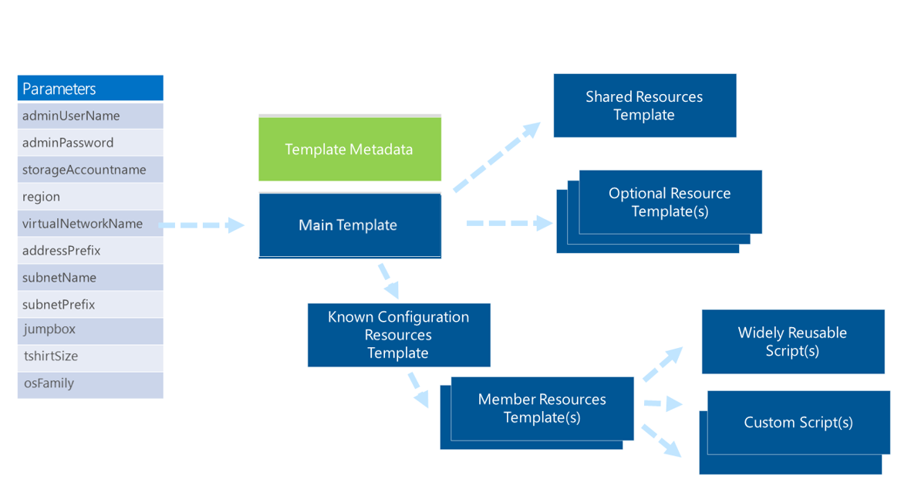
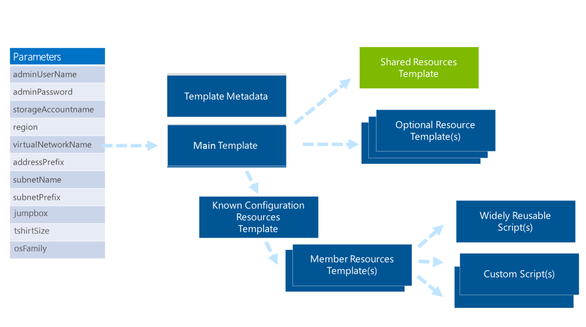
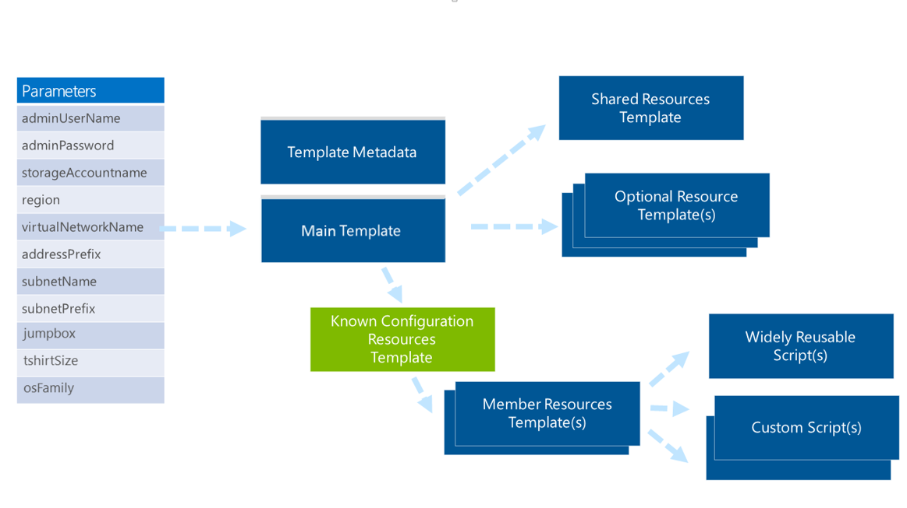
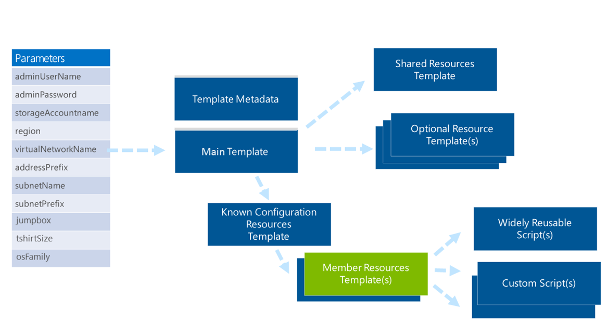
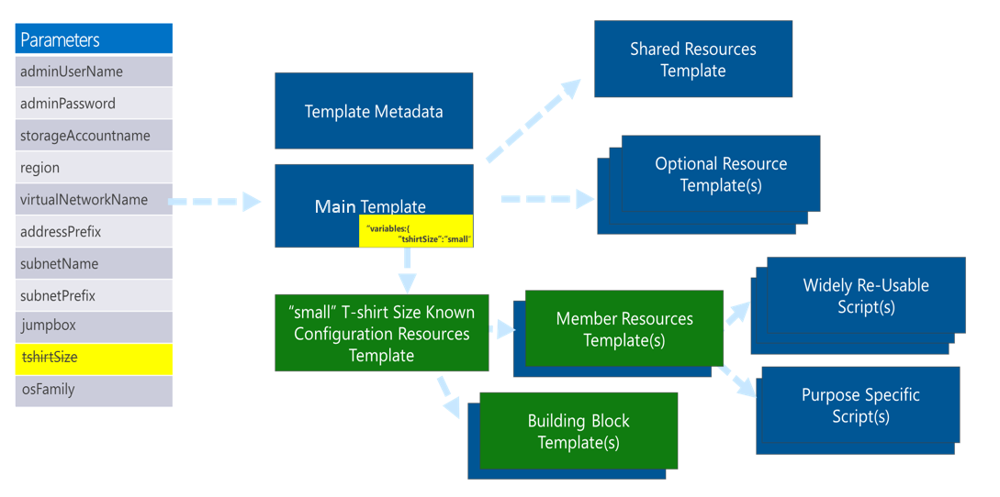

<properties
    pageTitle="Muster für Ressourcenmanager Vorlagen | Microsoft Azure"
    description="Anzeigen von entwurfmustern für Ressourcenmanager Azure-Vorlagen"
    services="azure-resource-manager"
    documentationCenter=""
    authors="tfitzmac"
    manager="timlt"
    editor="tysonn"/>

<tags
    ms.service="azure-resource-manager"
    ms.workload="multiple"
    ms.tgt_pltfrm="na"
    ms.devlang="na"
    ms.topic="article"
    ms.date="09/12/2016"
    ms.author="tomfitz"/>

# Muster für das Entwerfen Ressourcenmanager Azure-Vorlagen

Unsere Arbeit mit Unternehmen, Systemintegrator (SIs), Cloud-Service-Anbieter (CSVs) und open-Source-Software (OSS) Projektteams ist es oft erforderlich sind, um schnell bereitstellen Auslastung, bei der Arbeit oder Einheiten skalieren. Diese Bereitstellungen müssen unterstützt werden müssen, führen Sie die bewährte Methoden, und entsprechen identifizierten Richtlinien. Verwenden einen flexiblen Ansatz basierend auf Azure Ressourcenmanager Vorlagen, können Sie komplexe Topologien schnell und einheitlich bereitstellen. Sie können diese Bereitstellungen problemlos anpassen, Weiterentwicklung von zentralen Angebote oder Varianten für Ausreißer Szenarien oder Kunden gerecht werden kann.

Dieses Thema ist Teil einer größeren Whitepaper. Um die vollständige Papier zu lesen, herunterladen Sie [World Class Azure Ressource Manager Vorlagen Aspekte und bewährte Methoden](http://download.microsoft.com/download/8/E/1/8E1DBEFA-CECE-4DC9-A813-93520A5D7CFE/World Class ARM Templates - Considerations and Proven Practices.pdf).

Vorlagen kombinieren Sie die Vorteile der zugrunde liegenden Azure Ressourcenmanager mit der Flexibilität und der Lesbarkeit von JavaScript Object Notation (JSON). Mit Vorlagen können Sie die folgenden Schritte ausführen:

- Bereitstellen von konsistenten Topologien und deren Auslastung.
- Verwalten Sie alle Ihre Ressourcen in einer Anwendung, die mit Ressourcengruppen.
- Anwenden von Access rollenbasierte Steuerelement (RBAC) den entsprechenden Zugriff für Benutzer, Gruppen und Dienste gewähren.
- Mithilfe von communitytags Zuordnungen um Aufgaben wie Rollups Abrechnung zu optimieren.

Dieser Artikel enthält Details zu Verbrauch Szenarien, Architektur und Implementierungsmuster identifiziert während unserer Entwurf Sitzungen und praktisches Vorlage Implementierungen mit Kunden Azure Ihren Kunden-Team (AzureCAT). Alles andere als Academic, folgenden Verfahren sind bewährte Methoden informiert werden, indem Sie die Entwicklung von Vorlagen für 12 des oberen Linux-basierten OSS-Technologien wie: Apache Kafka, Apache Spark, Cloudera, Couchbase, Hortonworks HDP, DataStax Enterprise betrieben Apache Cassandra, Elasticsearch, Jenkins, MongoDB, Nagios, PostgreSQL, Redis und Nagios. Die meisten diese Vorlagen wurden mit einem bekannten Hersteller einer angegebenen Verteilung entwickelt und durch den Anforderungen der Microsoft Enterprise und SI Kunden während der zuletzt verwendete Projekte beeinflusst.

In diesem Artikel teilt diese bewährte Methoden, damit Sie World Class Azure Ressourcenmanager Vorlagen entwerfen können.  

In unsere Arbeit mit Kunden haben wir mehrere Ressourcenmanager Vorlage Verbrauch Erfahrung über Unternehmen, System Integratoren (SI) s und CSVs identifiziert. Die folgenden Abschnitte enthalten einen detaillierten Überblick allgemeine Szenarien und Muster für Kunden verschiedene Typen.

## Unternehmen und Systemintegratoren

In großen Unternehmen, sehen wir häufig zwei Nutzer von Ressourcenmanager Vorlagen: internen Software Development Teams und corporate IT. Wir haben erkannt, dass die Szenarien für die Karte SIs für die Szenarien für Unternehmen, damit dasselbe gilt.

### Interne Software Development teams

Wenn Ihr Team Software zur Unterstützung Ihres Unternehmens entwickelt, bieten Vorlagen eine einfache Möglichkeit, schnell Technologien für die Verwendung in Business-spezifischen Lösungen bereitstellen. Vorlagen können schnell Schulung Umgebungen erstellen, mit denen Teammitglieder benötigten Kompetenzen zu erhalten.

Können als Vorlagen-ist oder erweitern oder Verfassen Sie sie, um Ihre Bedürfnisse anzupassen. Kategorisieren von innerhalb von Vorlagen verwenden, können Sie eine Zusammenfassung der Abrechnung mit verschiedenen Ansichten wie Teamwebsites, Project, Einzelperson und Education bereitstellen.

Unternehmen möchten häufig Software Development Teams zum Erstellen einer Vorlage für konsistente Bereitstellung einer Lösung und bietet Einschränkungen, damit eine bestimmte Elemente innerhalb der Umgebung feste bleiben und nicht überschrieben werden. Eine Bank möglicherweise beispielsweise eine Vorlage RBAC aufnehmen möchten, damit ein Programmierer keine Bank-Lösung zum Senden von Daten mit einem Speicherkonto persönliche überarbeiten erforderlich.

### Corporate IT

Corporate IT-Organisationen verwenden in der Regel Vorlagen Zielcomputern Cloud Kapazität und Cloud gehosteten angezeigt wird.

#### Cloud-Kapazität

Ein gängiges Verfahren für corporate IT-Gruppen, um die Cloud Kapazität für Teams bereitstellen ist mit "T-shirt Maßen", die Standardansicht Geschenk Größen wie klein, Mittel und groß sind. Die Größe T-shirt Angebote können unterschiedliche Ressourcentypen mischen und Mengen, während Sie ein Maß ein, die es ermöglicht, Vorlagen verwenden. Die Vorlagen vorführen Kapazität in ein konsistentes, die erzwingt Unternehmensrichtlinien und Chargeback für die Nutzung von Organisationen bieten verwendet kategorisieren.

Möglicherweise müssen Sie beispielsweise Development, Test oder Herstellung Umgebungen bereitstellen, in denen die Software Development Teams die dazugehörigen Lösungen bereitstellen können. Die Umgebung verfügt über eine vordefinierte Netzwerk und Elemente, die die Software Development Teams geändert werden kann, z. B. Regeln, die Zugriff auf das Internet und Paket jedermann. Sie müssen möglicherweise auch organisationsspezifische Rollen für diese Umgebungen mit unterschiedlichen Zugriffsrechten für die Umgebung.

#### Cloud gehosteten-Funktionen

Vorlagen können zur Unterstützung von Cloud gehosteten-Funktionen, einschließlich einzelne Softwarepaketen oder zusammengesetzte Angebote, mit die internen Zeilen Business angeboten werden. Ein Beispiel für ein Angebot zusammengesetzte wäre Analytics als Dienst – Analytics, Visualisierung und andere Technologien – in eine optimierte, verbundenen-Konfiguration auf einer vordefinierten Netzwerk Suchtopologie übermittelt.

Cloud gehosteten-Funktionen werden durch die Sicherheit und Rolle Aspekte, die durch die Cloud Kapazität Angebot, auf dem sie erstellt haben, wie zuvor beschrieben, eingesetzten beeinflusst. Diese Funktionen werden oder als verwalteter Dienst angeboten. Für die Rollen letzteren, Zugriff eingeschränkt werden zum Aktivieren des Zugriffs in der Umgebung für die Verwaltung erforderlich.

## Cloud-Dienst Lieferanten

Nachdem Sie ein Gespräch mit vielen CSVs, identifiziert wir mehrere Ansätze, die Sie, zum Bereitstellen von Services für Ihre Kunden und die zugehörigen Anforderungen ergreifen können.

### CSV gehostete Angebot

Wenn Sie Ihr Angebot in Ihrem eigenen Azure-Abonnement hosten, sind zwei Hostinganbieter Ansätze allgemeine: Bereitstellen einer distinct bereitstellungs für jeden Kunden oder Bereitstellen von Mengen Einheiten, die eine gemeinsame Infrastruktur für alle Kunden verwendete zugrundeliegt.

- **DISTINCT-Bereitstellungen für jeden Kunden.** DISTINCT-Bereitstellungen pro Kunde erfordern feste Topologien verschiedener bekannten Konfigurationen. Diese Bereitstellungen möglicherweise Größen anderen virtuellen Computern (virtueller Computer), wechselnder Knoten und unterschiedliche Beträge zugeordneten Speicher. Kategorisieren von Bereitstellungen wird für Rollup-Abrechnung der einzelnen Kunden verwendet. RBAC möglicherweise aktiviert sein, um Kunden auf Aspekte ihrer Umgebung Cloud zugreifen dürfen.
- **Maßeinheiten in freigegebenen mit mehreren Mandanten Umgebungen.** Eine Vorlage kann eine Einheit für mehrere Mandanten Umgebungen darstellen. In diesem Fall wird die gleiche Infrastruktur zur Unterstützung von allen Kunden verwendet. Die Bereitstellungen steht für eine Gruppe von Ressourcen, die eine Ebene Kapazität für die gehosteten Bereitstellung, beispielsweise die Anzahl der Benutzer und die Anzahl der Transaktionen vorführen. Diese Mengen Einheiten werden vergrößert oder verkleinert, wie bei Bedarf erfordert.

### CSV-Angebot an den Kundenabonnement eingefügt

Sie möchten die Software in Abonnements Besitz Ende Kunden bereitstellen. Vorlagen können Sie distinct Bereitstellungen in einer Azure Kundenkontos bereitstellen.

Diese Bereitstellungen verwenden RBAC, damit Sie aktualisieren und die Bereitstellung innerhalb der vom Kunden Konto verwalten können.

### Azure Marketplace

Bekanntgabe und verkaufen Ihre Angebote über eine Marketplace, wie z. B. Azure Marketplace, können Sie Vorlagen für unterschiedliche Arten von Bereitstellungen vorführen, die in einer Azure Kundenkontos ausgeführt werden entwickeln. Diese distinct Bereitstellungen können in der Regel als T-shirt-Größe (klein, Mittel, groß), Produkt/Zielgruppe Typ (Community, Entwickler, Enterprise) oder Featuretyp (grundlegende, hohen Verfügbarkeit) beschrieben werden.  In einigen Fällen können mit diesen Abfragearten bestimmte Attribute der Bereitstellung, z. B. virtueller Computer Typ oder Anzahl der Datenträger angeben.

## OSS Projekte

In open Source-Projekten aktivieren Ressourcenmanager Vorlagen eine Community zum Bereitstellen einer Lösung schnell bewährte Methoden verwenden. Sie können Vorlagen in einem Repository GitHub speichern, so dass die Community über einen Zeitraum überarbeitet werden kann. Benutzer bereitstellen dieser Vorlagen in eigene Azure-Abonnements.

In den folgenden Abschnitten identifizieren Maßnahmen, die Sie berücksichtigen, bevor Sie Ihre Lösung entwerfen müssen.

## Identifizieren, welche außerhalb und innerhalb eines virtuellen Computers.

Wie Sie Ihre Vorlage entwerfen, ist es hilfreich, schauen Sie sich die Anforderungen im Hinblick auf was außerhalb und innerhalb der virtuellen Computern (virtuellen Computern) ist:

- Außerhalb bedeutet die virtuellen Computern und anderen Ressourcen der Bereitstellung, wie das Netzwerk Suchtopologie, kategorisieren, Zertifikate/Schlüssel und Steuerung des Benutzerzugriffs rollenbasierte verweist auf. Alle diese Ressourcen sind Teil Ihrer Vorlage.
- Innen bedeutet, dass die installierte Software und generelle gewünschten Status Konfiguration. Andere Verfahren, wie z. B. virtueller Computer Erweiterungen oder Skripts, werden ganz oder teilweise verwendet. Diese Verfahren möglicherweise identifiziert und ausgeführt, indem Sie die Vorlage, aber nicht darin sind.

Allgemeine Beispiele für Aktivitäten, die Sie, "in das Feld ausführen würden" sind-  

- Installieren oder Entfernen von Serverrollen und features
- Installieren und Konfigurieren von Software auf der Ebene Knoten oder cluster
- Bereitstellen von Websites auf einem Webserver
- Bereitstellen der mithilfe von Datenbankschemas
- Verwalten der Registrierung oder andere Arten von Konfigurations-Einstellungen
- Verwalten von Dateien und Verzeichnissen
- Starten, beenden und Verwalten von Prozessen und Diensten
- Verwalten von lokalen Gruppen und Benutzerkonten
- Installieren und Verwalten von Paketen (MSI-, .exe, Yum, usw.).
- Verwalten von Umgebungsvariablen
- Führen Sie systemeigener Skripts (Windows PowerShell Bash usw.. aus)

### Konfiguration der gewünschten Status (DSC)

Denken den internen Zustand Ihrer virtuellen Computer nach der Bereitstellung aus, soll um sicherzustellen, dass diese Bereitstellung "wandert nicht" aus der Konfiguration, die Sie definiert und aktiviert in Datenquellen-Steuerelements. Dieser Ansatz stellt sicher, Ihre Entwickler oder Mitarbeiter keine Ad-hoc-Änderungen vornehmen, in einer Umgebung, die nicht überprüft, getestet oder im Datenquellen-Steuerelement aufgezeichnet. Dieses Steuerelement ist wichtig, da die manuellen Änderungen nicht im Datenquellen-Steuerelement befinden, sie auch nicht Teil der standard-Bereitstellung und wirkt sich zukünftige automatisierte Bereitstellungen der Software.

Über Ihre internen Mitarbeiter ist die Konfiguration des gewünschten auch wichtig aus Gründen der Sicherheit. Hacker versuchen regelmäßig manipulieren und Ausnutzen der Softwaresysteme. Bei einem erfolgreichen ist es, Dateien installieren und der Status der eine beschädigte System gemeinsam. Konfiguration gewünschte Status können Sie Deltawerte zwischen den gewünschten und den tatsächlichen Status zu identifizieren und eine bekannte Konfiguration wiederherstellen.

Es gibt Ressource Erweiterungen bei der am häufigsten verwendeten Methoden zur DSC - PowerShell DSC, Verwaltungsangestellte und Marionette aus. Jeder der folgenden Erweiterungen kann den ursprünglichen Status des Ihrer virtuellen Computer bereitstellen und auch verwendet werden, um sicherzustellen, dass der gewünschte Status verwaltet wird.

## Allgemeine Vorlage Bereiche

Unserer Erfahrung haben wir die drei wichtigsten Lösung Vorlagen Bereiche emerge gesehen. In den folgenden Abschnitten werden diese drei Bereiche – Kapazität, Funktionalität und End-to-End-Lösung – beschrieben.

### Kapazität Umfang

Ein Bereich Kapazität bietet eine Reihe von Ressourcen in einer Standardansicht Suchtopologie, die vorkonfiguriertes unter Einhaltung von Vorschriften und Richtlinien werden ist. Das am häufigsten verwendete Beispiel ist eine standard Entwicklungsumgebung in einem Szenario Enterprise IT oder SI bereitstellen.

### Videofunktionen Umfang

Ein Bereich Videofunktionen konzentriert bereitstellen und Konfigurieren einer Suchtopologie für eine angegebene Technologie. Häufige Szenarien einschließlich Technologien wie SQL Server, Cassandra, Hadoop.

### End-to-End-Lösung Umfang

Eine End-to-End-Lösung Umfang ist hinter einem einzelnen entfernten ausgerichtet und stattdessen den Schwerpunkt auf eine Lösung und Ende zum besteht aus mehreren Funktionen.  

Lösung ausgelegte Vorlage Bereich Manifeste selbst als eine Reihe von mindestens Videofunktionen ausgelegte Vorlagen mit Lösung-spezifischen Ressourcen, Logik und gewünschten Status. Ein Beispiel für eine Lösung ausgelegte Vorlage ist eine durchgehende Daten Verkaufspipeline Lösung Vorlage. Die Vorlage möglicherweise Lösung-spezifische Suchtopologie und Bundesstaat mit mehreren Videofunktionen ausgelegte Lösungsvorlagen wie Kafka, Storm und Hadoop mischen.

## Im Vergleich zu bekannten Konfigurationen Freiform auswählen

Sie glauben zunächst eine Vorlage sollte Nutzer höchste Flexibilität verleihen, aber viele Aspekte Einfluss auf die Auswahl, ob Freiform-Konfigurationen im Vergleich zu bekannten Konfigurationen verwendet. In diesem Abschnitt werden die wichtigsten Kunden Anforderungen und technische Aspekte, die den in diesem Dokument freigegeben Ansatz Legende geformt.

### Freiform-Konfigurationen

Klicken Sie auf den ersten Blick Klingeltöne Freiform-Konfigurationen eignet. Diese ermöglichen es Ihnen, wählen einen Typ virtueller Computer, und geben eine beliebige Anzahl von Knoten und Laufwerke für diejenigen Knoten angefügt – und tun Sie dies als Parameter zu einer Vorlage. Dieser Ansatz ist jedoch nicht für einige Szenarien eignet.

In [Größen für virtuellen Computern](./virtual-machines/virtual-machines-windows-sizes.md), die verschiedene Typen von virtuellen Computer und die verfügbaren Größen gekennzeichnet werden, und die Anzahl der permanente jede Laufwerken (2, 4, 8, 16 oder 32), auf denen angefügt werden kann. Jeder angeschlossenen Datenträger bietet 500 IOPS und ein Vielfaches von diese Datenträger für ein Multiplikator von dieser Anzahl von IOPS gepoolte werden können. Beispielsweise können 16 Festplatten gepoolte sein, um 8.000 IOPS bereitzustellen. Verbindungspooling erfolgt über die Konfiguration des Betriebssystems, verwenden Microsoft Windows-Speicher Leerzeichen oder redundant Array Festplatten (RAID) in Linux.

Eine Freiform-Konfiguration ermöglicht die Markierung einer Anzahl von Instanzen virtueller Computer, eine Reihe von virtuellen Computer Arten und Größen für diese Instanzen, eine Anzahl der Datenträger, die unterschiedlich sein kann, basierend auf dem virtuellen Computer und ein oder mehrere Skripts so konfigurieren Sie den Inhalt des virtuellen Computer an.

Es ist üblich, dass eine Bereitstellung möglicherweise mehrere Typen von Knoten, z. B. Master und Datenknoten, sodass diese Flexibilität oft für jeden Knoten zur Verfügung gestellt wird.

Wenn Sie des angegebenen Schritts auf alle Cluster bereitstellen einführen, beginnen Sie mit Vielfachen all dieser arbeiten. Wenn Sie einen Cluster Hadoop bereitstellen wurden, beispielsweise müssten mit 8 master-Knoten und Datenknoten 200 und der gepoolten 4 angefügten Datenträger auf master-Knoten und der gepoolten 16 angefügten Festplatten pro Datenknoten, Sie 208 virtuellen Computern und 3,232 Datenträger verwalten.

Speicher-Konto wird oben Anfragen einschränken, die deren identifizierten 20.000 Speicher Konto Partitionierung prüfen und Verwenden von Berechnungen bestimmt die richtige Anzahl von Speicherkonten zu diesem Suchtopologie zu berücksichtigen sollten Transaktionen/Sekunde beschränken. Angegebenen Vielzahl von Kombinationen von der Freiform-Ansatz unterstützt werden, sind dynamische Berechnungen erforderlich, um zu bestimmen die entsprechenden Partitionierung. Azure Ressourcenmanager Template Language bereitstellen nicht gegenwärtig mathematische Funktionen, damit Sie diese Berechnungen in Code generieren eindeutige, hartcodierte Vorlage mit den entsprechenden Details ausführen müssen.

Enterprise IT und SI Szenarien muss einer Person die Vorlagen verwalten und bieten Unterstützung für die bereitgestellten Topologien für eine oder mehrere Organisationen. Diese zusätzlichen Aufwand – verschiedene Konfigurationen und Vorlagen für jeden Kunden – alles andere als wünschenswert ist.

Sie können diese Vorlagen verwenden, um die Umgebungen in Azure Abonnements Ihres Kunden bereitstellen, aber corporate IT-Teams und CSVs sowohl in der Regel bereitstellen können in ihren eigenen Abonnements, mit einer Chargeback-Funktion, deren Kunden in Rechnung gestellt. In diesen Fällen das Ziel ist Kapazität für mehrere Kunden über einen Pool von Abonnements bereitstellen und stets Bereitstellungen dicht aufgefüllt in die Abonnements zu minimieren Abonnement-Anzahl – d. h., mehrere Abonnements zu verwalten. Mit wirklich dynamische Bereitstellung Auswahl an Papiergrößen erfordert diese Art von Dichtefunktion erreichen sorgfältige Planung und zusätzliche Entwicklung für Gerüstbau Arbeit für die Organisation.

Darüber hinaus kann nicht erstellt werden Abonnements über einen Videoanruf API jedoch müssen manuell vornehmen, über das Portal. Zunehmender die Anzahl von Abonnements erfordert eine resultierende Abonnement-Anzahl personenbezogenen Eingriff – sie können nicht automatisch ausgeführt werden. Mit soviel Streuung die Größen der Bereitstellungen müssen Sie vor dem Bereitstellen einer Anzahl von Abonnements manuell fest, um sicherzustellen, dass Abonnements zur Verfügung stehen.

In Anbetracht dieser Faktoren ist eine wirklich Freiform-Konfiguration weniger als auf den ersten Blick ansprechende.

### Bekannte Konfigurationen – das T-shirt Ziehpunkts Ansatz

Lieber als Vorlage zu bieten, die gesamte Flexibilität und viele Variationen bereitstellt, unserer Erfahrung ein gemeinsames Muster befindet, um die Möglichkeit bieten, wählen Sie die bekannte Konfigurationen – standard T-shirt, Größen, z. B. Sandkastenmodus, klein, Mittel und groß. Weitere Beispiele für T-shirt-Größen sind Produktangebote, wie z. B. Community Edition oder Enterprise Edition.  In anderen Fällen es möglicherweise Arbeitsbelastung-spezifische Konfigurationen einer Technologie – wie Karte verringern oder keine Sql.

Viele Enterprise IT Organisationen, OSS Lieferanten und SIs ihre Angebote zur Verfügung stellen heute auf diese Weise in lokal virtualisierten Umgebung (Unternehmen) oder als Software als Service (SaaS) Angebote (CSVs und OSVs).

Dieser Ansatz bietet gute, bekannte Konfigurationen mit unterschiedlichen Größen, die vorkonfiguriert sind für Kunden. Ohne bekannten Konfigurationen müssen Ende Kunden Cluster Ziehpunkt auf eigene ermitteln, Faktor in Plattform Ressource Einschränkungen und führen Sie mathematische zum Identifizieren der resultierende Aufteilen von Speicherkonten und anderen Ressourcen (aufgrund Cluster Größe und Ressourcen Einschränkungen). Bekannte Konfigurationen aktivieren Kunden einfach die richtige T-shirt Größe zu markieren – d. h., eine gegebene Bereitstellung. Eine kleine Anzahl von bekannten Konfigurationen ist einfacher, nicht nur optimal für den Kunden, hilft Ihnen der Dichtefunktion eine höhere Ebene vorführen und unterstützt wird.

Möglicherweise müssen Sie ein bekannten Konfigurationsansatz T-shirt-Größen dienten auch unterschiedliche Anzahl von Knoten innerhalb einer Größe. Beispielsweise möglicherweise eine kleine T-shirt Größe zwischen 3 und 10 Knoten.  Die Größe der T-shirt würde aufnehmen zu können bis zu 10 Knoten und dem Verbraucher die Möglichkeit bieten, freie Form Auswahl auf die maximale Größe identifiziert getroffen entworfen werden.  

Eine T-shirt Größe basierend auf der Art der Auslastung, möglicherweise weitere freie Form Natur im Hinblick auf die Anzahl der Knoten, die bereitgestellt werden kann, klicken Sie auf den Knoten Arbeitsbelastung distinct Knotengröße und Konfiguration der Software müssen.

T-Shirt-Größen anhand von Produktangebote, Community oder Enterprise, möglicherweise müssen Sie distinct Ressourcentypen und die maximale Anzahl von Knoten, die bereitgestellt werden können, wie verknüpft normalerweise zur Lizenzierung Aspekte oder Verfügbarkeit von Features über die verschiedenen Angebote.

Sie können auch Kunden mit eindeutigen Varianten mithilfe der JSON-basierten Vorlagen angeordnet werden. Beim Umgang mit Ausreißern können Sie den entsprechenden Planung und Überlegungen für die Entwicklung, Support und Kostenrechnung integrieren.

Basierend auf den Kunden Vorlage Verbrauch Szenarien Anforderungen am Anfang unserer praktischen Erfahrung Vielzahl von Vorlagen erstellen und dieses Dokument identifiziert identifiziert wir ein Muster für die Vorlage Gliederung.

## Kapazität und Videofunktionen ausgelegte Lösungsvorlagen

Gliederung enthält einem modularen Ansatz für die Vorlage Entwicklung, dass unterstützt wiederverwenden, Erweiterbarkeit, testen und Tools. Dieser Abschnitt enthält Informationen über die wie ein Gliederung Ansatz auf Vorlagen mit einem Bereich Kapazität oder Funktionen angewendet werden kann.

Bei dieser Vorgehensweise Hauptfenster Vorlage Parameterwerte aus einer Vorlage Consumer empfängt, und klicken Sie dann links auf verschiedene Arten von Vorlagen und Skripts unterhalb wie unten dargestellt. Parameter, statische Variablen und generierte Variablen verwendeten Werte ein-und verknüpften Vorlagen bereitgestellt.

**Parameter werden in eine Vorlage Hauptfenster, klicken Sie dann auf Verknüpfte Vorlagen übergeben.**

In den folgenden Abschnitten Konzentration auf die Arten von Vorlagen und Skripts, denen in eine einzelne Vorlage aufgeteilt wird. In den Abschnitten werden die Vorgehensweisen für die Übergabe Statusinformationen zwischen den Vorlagen. Jede Vorlage und welche Skript im Bild werden und Beispiele für die beschrieben. Kontextbezogene beispielsweise finden Sie unter "Letzte Schritte: ein Beispiel für die Implementierung" weiter unten in diesem Dokument.

### Vorlagenmetadaten

Die Metadaten für die Vorlage (die metadata.json-Datei) enthält Schlüssel/Wert-Paare, in denen eine Vorlage in JSON, beschrieben, die von Menschen und Softwaresystemen gelesen werden kann.

**Vorlagenmetadaten wird in der Datei metadata.json beschrieben.**

Software-Agents können rufen Sie die Datei metadata.json und die Informationen und einen Link zu der Vorlage in eine Webseite oder ein Verzeichnis zu veröffentlichen. Elementen gehören *ItemDisplayName*, *Beschreibung*, *Zusammenfassung*, *GithubUsername*und *DateUpdated*.

Eine Beispieldatei wird unter vollständig angezeigt.

    {
        "itemDisplayName": "PostgreSQL 9.3 on Ubuntu VMs",
        "description": "This template creates a PostgreSQL streaming-replication between a master and one or more slave servers each with 2 striped data disks. The database servers are deployed into a private-only subnet with one publicly accessible jumpbox VM in a DMZ subnet with public IP.",
        "summary": "PostgreSQL stream-replication with multiple slave servers and a publicly accessible jumpbox VM",
        "githubUsername": "arsenvlad",
        "dateUpdated": "2015-04-24"
    }

### Hauptfenster Vorlage

Die Hauptfenster Vorlage empfängt Parameter eines Benutzers, anhand dieser Informationen wird komplexe Object-Variablen gefüllt wird, und führt die verknüpften Vorlagen.

**Die wichtigste Vorlage empfängt Parameter eines Benutzers**

Einen Parameter, die bereitgestellt wird ist ein bekannten Konfiguration auch bekannt als T-shirt Size-Parameter aufgrund seiner standardisierten Werte wie klein, Mittel oder groß. In der Praxis können Sie diesen Parameter auf mehrere Arten verwenden. Weitere Informationen finden Sie unter "Bekannte Konfiguration Ressourcenvorlage" weiter unten in diesem Dokument.

Unabhängig von der bekannten Konfiguration angegebenen durch einen Benutzerparameter werden einige Ressourcen bereitgestellt. Diese Ressourcen werden nach der Bereitstellung mithilfe einer Vorlage für die einzelnen gemeinsam verwendeten Ressourcen und durch andere Vorlagen, freigegeben werden, damit die Vorlage gemeinsam verwendeten Ressourcen zuerst ausgeführt wird.

Einige Ressourcen werden unabhängig von der angegebenen bekannten Konfiguration optional bereitgestellt.

### Vorlage für freigegebene Ressourcen

Diese Vorlage bietet Ressourcen, die für alle bekannten Konfigurationen sind. Es enthält das virtuelle Netzwerk, Verfügbarkeit Sets und weitere Ressourcen, die unabhängig von der Vorlage bekannten Konfiguration erforderlich sind, die bereitgestellt wird.

**Vorlage für freigegebene Ressourcen**

Ressourcennamen, wie z. B. den Namen des virtuellen Netzwerks basieren auf das Hauptfenster Vorlage. Sie können diese als Variable innerhalb dieser Vorlage angeben oder erhalten sie als Parameter aus der Benutzer, je nach Bedarf von Ihrer Organisation.

### Optional Ressourcenvorlage

Die Ressourcenvorlage optional enthält Ressourcen, die programmgesteuert bereitgestellt werden, basierend auf dem Wert eines Parameters oder Variable.

**Optional Ressourcenvorlage**

Eine optionale Ressourcenvorlage können Sie beispielsweise eine Jumpbox konfigurieren, die indirekten Zugriff auf eine bereitgestellte Umgebung vom öffentlichen Internet ermöglicht. Verwenden Sie Parameter oder Variable, um festzustellen, ob die Jumpbox aktiviert werden soll, und die Funktion *Verketten* , um die Zielnamen für die Vorlage, wie etwa *jumpbox_enabled.json*zu erstellen. Vorlage verknüpfen möchten die resultierende Variable verwenden, um die Jumpbox zu installieren.

Sie können die Ressourcenvorlage optional von mehreren Orten verknüpfen:

-   Bei jeder Bereitstellung anwendbar, erstellen Sie einen Link Parameter leistungsgesteuert aus der Ressourcenvorlage freigegebenen aus.
-   Wenn anwendbar bekannte Konfigurationen wählen – beispielsweise nur in großen Bereitstellungen installieren – erstellen ein Parameters leistungsgesteuert oder Variable leistungsgesteuert links aus der Vorlage bekannten Konfiguration.

Gibt an, ob eine bestimmte Ressource optional ist möglicherweise nicht vom Consumer Vorlage aber stattdessen vom Vorlagenanbieter gesteuert werden. Angenommen, möglicherweise müssen Sie ein bestimmtes Produkt Anforderung oder ein Produkt Add-on (Allgemein für CSVs) erfüllen oder Richtlinien zu erzwingen (Allgemeine für SIs und Enterprise IT Gruppen). In diesen Fällen können Sie eine Variable verwenden, um festzustellen, ob die Ressource bereitgestellt werden sollen.

### Bekannte Konfiguration Ressourcenvorlage

In der Vorlage Hauptfenster kann Parameter verfügbar gemacht werden, um die Vorlage Consumer gewünschte bekannte Konfiguration bereitstellen angeben ermöglichen. Häufig verwendet diese bekannten Konfiguration einen T-shirt Größe Ansatz mit einer Reihe von vorkonfiguriertes Größen wie Sandkasten-, klein, Mittel und groß.

**Bekannte Konfiguration Ressourcenvorlage**

Der T-shirt Größe Ansatz wird häufig verwendet, jedoch die Parameter können eine Reihe von bekannten Konfigurationen darstellen. Beispielsweise können Sie eine Reihe von Umgebungen für eine Enterprise-Anwendung, wie z. B. Entwicklung, testen und Produkt angeben. Oder Sie könnten sie für einen Clouddienst verwenden, zum Darstellen der verschiedenen Maßeinheiten, Produktversionen oder Produktkonfigurationen wie z. B. Community, Developer oder Enterprise.

Wie bei der Vorlage gemeinsam verwendeten Ressourcen werden Variablen entweder auf die Vorlage bekannten Konfigurationen übergeben:

-   Endbenutzer – d. h., die Parameter, die an das Hauptfenster Vorlage gesendet werden.
-   Organisation – d. h., die Variablen in der Vorlage Hauptfenster, die internen Anforderungen oder Richtlinien darstellen.

### Mitglied Ressourcenvorlage

Innerhalb einer bekannten Konfiguration ist häufig eine oder mehrere Typen von Element-Knoten enthalten. Angenommen, Sie verfügen über mit Hadoop master und Datenknoten. Bei der Installation MongoDB, müssen Sie Datenknoten und einem Arbiterserver. Wenn Sie DataStax bereitstellen, müssen Sie Datenknoten und eines virtuellen Computers mit OpsCenter installiert.

**Mitglied Ressourcenvorlage**

Jeder Typ von Knoten kann verschiedene Größen von virtuellen Computern, die Zahlen der angefügten Datenträger, Skripts zu installieren und Einrichten von den Knoten, Konfigurationen für die virtuellen Computern, die Anzahl der Instanzen und andere Details verfügen. Damit jeder Knotentyp einen eigenen Mitglied erhält eine Ressource detaillierte enthält Informationen bereitstellen und Konfigurieren einer Infrastruktur sowie Skripts zum Bereitstellen und Konfigurieren der Software in den virtuellen Computer ausführen.

Für virtuelle Computer in der Regel werden zwei Arten von Skripts verwendeten, stark wieder verwendbare und benutzerdefinierte Skripts.

### Stark wieder verwendbaren Skripts

Stark wieder verwendbaren Skripts können über mehrere Arten von Vorlagen verwendet werden. Eine bessere Beispielen dieser stark wieder verwendbaren Skripts richtet RAID auf Linux pool Datenträger und eine größere Anzahl von IOPS zu erhalten. Unabhängig von der Software auf dem virtuellen Computer installiert wird bietet dieses Skript Wiederverwendung bewährte Methoden für häufige Szenarien an.

**Mitglied Ressourcen Vorlagen können stark wieder verwendbaren Skripts aufrufen.**

### Benutzerdefinierte Skripts

Vorlagen rufen Sie häufig ein oder mehrere Skripts, die installieren und Konfigurieren der Software in virtuellen Computern. Ein gemeinsames Muster wird mit großen Topologien angezeigt, in dem mehrere Instanzen von Typen von mindestens ein Element bereitgestellt werden. Eine Installationsskript wird für jedes virtuellen Computer, die parallel ausgeführt werden kann initiiert gefolgt von einer Setup-Skript, die aufgerufen wird, nachdem alle virtuellen Computern (oder alle virtuellen Computern eines bestimmten Elements Typs) bereitgestellt werden.

**Mitglied Ressourcen Vorlagen können Skripts für einen bestimmten Zweck, z. B. Konfiguration virtueller Computer anrufen.**

## Lösung Videofunktionen ausgelegte Vorlage Beispiel - Redis

Um anzuzeigen, wie eine Implementierung funktionieren möglicherweise, sehen wir uns ein praktisches Beispiel für das Erstellen einer Vorlage, die die Bereitstellung und Konfiguration von Redis in standard T-shirt Größen erleichtert.  

Für die Bereitstellung gibt es eine Reihe von freigegebenen Ressourcen (virtuelle Netzwerk, Speicher-Konto, Verfügbarkeit Sätze) und eine optionale Ressource (Jumpbox). Es gibt mehrere bekannte Konfigurationen Jahreszahlen T-shirt-Größen (klein, Mittel, groß) Geben Sie jeder mit einem einzelnen Knoten. Es gibt auch zwei Zweck-spezifische Skripts (Installation, Konfiguration).

### Erstellen der Vorlagendateien

Sie möchten eine Main-Vorlage mit dem Namen azuredeploy.json erstellen.

Erstellen von freigegebenen Ressourcen Vorlagenname freigegeben resources.json

Sie erstellen eine optionale Ressourcenvorlage, um die Bereitstellung von einer Jumpbox, mit dem Namen jumpbox_enabled.json zu aktivieren.

Redis verwendet nur einen einzelnen Knotentyp, damit Sie eine einzelne Mitglied Ressource-Vorlage mit dem Namen Knoten-resources.json erstellen.

Redis möchten Sie jeden einzelnen Knoten installieren und dann auf den Cluster einrichten.  Stehen Ihnen die Installation aufzunehmen und Einrichten von Skripts, Redis-Cluster-install.sh und Redis-Cluster-setup.sh.

### Verknüpfen von Vorlagen

Verwenden die Vorlage verknüpfen, die Links Hauptfenster Vorlage, in die Ressourcenvorlage freigegebenen, die das virtuelle Netzwerk stellt her.

Logik wird hinzugefügt, in die wichtigsten Vorlage zu aktivieren Nutzer der Vorlage, um anzugeben, ob ein Jumpbox bereitgestellt werden sollen. Wert einer *aktiviert* den Parameter *EnableJumpbox* gibt an, dass der Kunde eine Jumpbox bereitstellen will. Wenn dieser Wert angegeben wird, verkettet die Vorlage *_enabled* als ein Suffix an einen Basis Vorlagennamen für die Funktion Jumpbox aus.

Die wichtigste Vorlage ein Basis Vorlagenname für T-shirt-Größen den *großen* Parameterwert als Suffix gilt, und verwendet dann diesen Wert in einem Link Vorlage, um *technology_on_os_large.json*.

Der Suchtopologie möchten diese Abbildung ähneln.

**Vorlagenstruktur für eine Redis-Vorlage**

### Konfigurieren von Zustand

Für die Knoten im Cluster es gibt zwei Schritte zum Konfigurieren des Zustands, beide durch bestimmte Skripts Zweck dargestellt werden.  "Redis Cluster install.sh" Installationen Redis und "Redis Cluster setup.sh" richtet Cluster.

### Unterstützung von verschiedenen Größe Bereitstellungen

T-shirt Größe Vorlage innerhalb der Variablen gibt an, dass die Anzahl der Knoten jedes Typs für die angegebene Größe (*Groß*) bereitstellen. Es bereitstellt klicken Sie dann die Anzahl der virtuellen Computer Instanzen mit Ressourcen Schleifen, eindeutige Namen für die Ressourcen durch einen Knotennamen mit einer numerischen Sequenz Anzahl von *copyIndex()*Anhängen bereitstellen. Bedeutet diese Schritte für wichtiges und aussichtsreich Zone virtuellen Computern, wie in der Vorlage T-shirt Namen definiert

## Gliederung und End-to-End-Lösung ausgelegte Vorlagen

Eine Lösung-Vorlage mit einer End-to-End-Lösung Bereich den Schwerpunkt auf eine End-to-End-Lösung.  Dieser Ansatz ist in der Regel eine Kombination aus mehreren Videofunktionen ausgelegte Vorlagen mit zusätzlichen Ressourcen, Logik und Zustand.

Wie in der nachstehenden Abbildung hervorgehoben wird das gleiche Modell für Videofunktionen ausgelegte Vorlagen verwendet für Vorlagen mit einer End-to-End-Lösung Bereich erweitert.

Eine Vorlage auf freigegebene Ressourcen und Optional Ressourcen Vorlagen dienen die gleiche Funktion wie die Kapazität und Videofunktionen ausgelegte Vorlage Ansätze, aber für die Lösung durchgehende ausgelegte sind.

Als durchgehende Lösung ausgelegte Vorlagen können auch in der Regel T-shirt-Größen haben, die Vorlage bekannte Konfigurationsressourcen widerspiegelt, was für eine bestimmte bekannte Konfiguration der Lösung erforderlich ist.

Die Vorlage für Ressourcen bekannt-Links, um eine oder mehrere Videofunktionen ausgelegte Lösungsvorlagen, die für die Lösung durchgehende relevant sind und das Mitglied Ressourcenvorlagen, die für die Lösung durchgehende erforderlich sind.

Als das T-shirt kann die Größe der Lösung sich unterscheiden, dass der einzelnen Videofunktionen Suchbegriffs Vorlage, Variablen innerhalb der Vorlage bekannte Konfiguration Ressourcen verwendet werden, um die entsprechenden Werte für untergeordneten Videofunktionen ausgelegte Lösungsvorlagen für die Bereitstellung der entsprechenden T-shirt-Größe bereitstellen.

**Das Modell verwendet für Kapazität oder Funktionen Suchbegriffs Lösungsvorlagen für die Vorlage Bereiche End-to-End-Lösung ohne weiteres erweitert werden kann**

## Vorbereiten von Vorlagen für die Marketplace

Der vorherige Ansatz ausgelegt ist leicht Szenarien Unternehmen, SIs und CSVs möchten Sie entweder Bereitstellen von Vorlagen für sich selbst oder ihre Kunden zum Bereitstellen auf eigene aktivieren.

Ein anderes gewünscht, Szenario eine Vorlage über die Marketplace bereit.  Dieser Ansatz Gliederung funktioniert für Marketplace auch mit einigen geringfügigen Änderungen.

Wie zuvor schon erwähnt, können Vorlagen, distinct Bereitstellungsarten zum Verkauf auf dem Markt anzubieten verwendet werden. DISTINCT-Bereitstellungstypen möglicherweise T-shirt-Größen (klein, Mittel, groß), Produkt/Zielgruppe (Community, Entwickler, Enterprise) oder Featuretyp (grundlegende, hohen Verfügbarkeit).

Wie unten dargestellt, können das vorhandene durchgehende Lösung oder Videofunktionen ausgelegte Vorlagen leicht genutzt werden, um die verschiedenen bekannten Konfigurationen auf der Marketplace-Liste.

Parameter das Hauptfenster Vorlage werden zuerst ändern, um den eingehenden Parameter mit dem Namen TshirtSize zu entfernen.

Während die von unterschiedlichen Bereitstellungstypen der Vorlage bekannte Konfiguration Ressourcen zuordnen möchten, benötigen sie auch das gemeinsame Ressourcen und Konfiguration, die in der Vorlage für freigegebene Ressourcen und potenziell diejenigen in Optional Ressourcenvorlagen gefunden.

Wenn Sie Ihre Vorlage zum Marketplace veröffentlichen möchten, legen Sie einfach distinct Kopien der Vorlage Primär, die den zuvor verfügbaren eingehenden Parameter der TshirtSize einer Variablen eingebettete innerhalb der Vorlage ersetzt.

**Vorlage für Marketplace zur Anpassung einer Lösung ausgelegte**

## Nächste Schritte

- Empfehlungen zur Behandlung von Sicherheit in Azure Ressourcenmanager finden Sie unter [Sicherheitsaspekte für Azure Ressourcenmanager](best-practices-resource-manager-security.md)
- Weitere Informationen zur Freigabe von Status in die und aus Vorlagen, finden Sie unter [Freigabe-Zustand in Azure Ressourcenmanager Vorlagen](best-practices-resource-manager-state.md).
