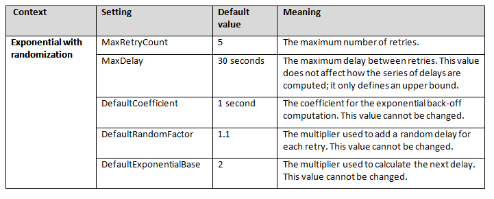
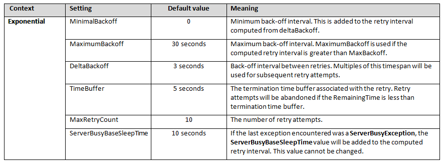
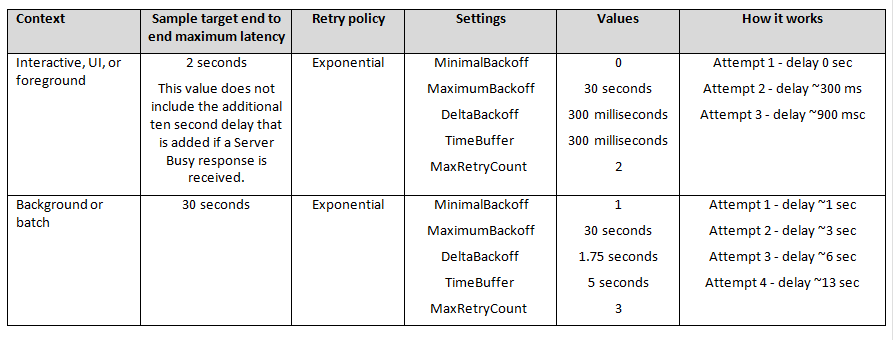

<properties
   pageTitle="Hinweise zu bestimmten Diensten wiederholen | Microsoft Azure"
   description="Dienst spezifische Leitfäden zum Einrichten des Verfahren "Wiederholen"."
   services=""
   documentationCenter="na"
   authors="dragon119"
   manager="christb"
   editor=""
   tags=""/>

<tags
   ms.service="best-practice"
   ms.devlang="na"
   ms.topic="article"
   ms.tgt_pltfrm="na"
   ms.workload="na"
   ms.date="07/13/2016"
   ms.author="masashin"/>

# <a name="retry-service-specific-guidance"></a>Hinweise zu bestimmten Diensten wiederholen

[AZURE.INCLUDE [pnp-header](../includes/guidance-pnp-header-include.md)]

## <a name="overview"></a>(Übersicht)

Am häufigsten Azure Services und Client SDKs enthalten ein Verfahren "Wiederholen". Diese unterscheiden sich jedoch jeden Dienst unterschiedlichen Merkmalen und Anforderungen hat, und so, dass jede Wiederholung Verfahren für einen bestimmten Dienst eingestellt ist. Dieses Handbuch enthält eine Übersicht über die Features "Wiederholen" Verfahren für die meisten Azure Services und Informationen dazu verwenden, anpassen oder erweitern das "Wiederholen" Verfahren für diesen Dienst enthält.

Faustregel für den Umgang mit vorübergehenden Fehler sowie Wiederholung Verbindungen und Operationen, die auf Dienste und Ressourcen finden Sie unter [Anleitungen zu wiederholen](best-practices-retry-general.md).

In der folgenden Tabelle werden die Features "Wiederholen" für die Azure Dienste beschrieben, die in diesem Handbuch zusammengefasst.

| **Dienst**                           | **Wiederholen Sie die Funktionen**                  | **Richtlinienkonfiguration**     | **Bereich**                                        | **Werden features** |
|---------------------------------------|-----------------------------------------|------------------------------|--------------------------------------------------|------------------------
| **[Azure-Speicher](#azure-storage-retry-guidelines)**                      | Systemeigene im client                        | Programmgesteuerten                 | Client und einzelne Vorgänge                 | TraceSource            |
| **[SQL­Datenbank mit Entität Framework](#sql-database-using-entity-framework-6-retry-guidelines)** | Systemeigene im client                        | Programmgesteuerten                 | Globale pro AppDomain                             | Keine                   |
| **[SQL­Datenbank mit ADO.NET](#sql-database-using-ado-net-retry-guidelines)**         | Topasgrau *                                  | Deklarativen und programmgesteuerten | Einzelne Anweisungen oder Blöcke von code              | Benutzerdefinierte                 |
| **[Dienstbus](#service-bus-retry-guidelines)**                       | Systemeigene im client                        | Programmgesteuerten                 | Namespace-Manager, Messaging Factory und Client | ETW                    |
| **[Azure Redis Cache](#azure-redis-cache-retry-guidelines)**                             | Systemeigene im client                        | Programmgesteuerten                 | Client                                           | TextWriter             |
| **[DocumentDB](#documentdb-retry-guidelines)**                        | Systemeigene in Dienst                       | Nicht konfiguriert             | Globale                                           | TraceSource            |
| **[Azure suchen](#search-retry-guidelines)**                            | Systemeigene im client | Programmgesteuerten | Client                                  | ETW oder Benutzerdefiniert                 |
| **[Active Directory](#azure-active-directory-retry-guidelines)**                  | Topasgrau * (mit benutzerdefinierten Erkennung Strategie) | Deklarativen und programmgesteuerten | Blöcke von code                                   | Benutzerdefinierte                 |

* Topasgrau in den Anzeigenamen für die vorübergehende Fehlerstrukturanalyse Handling Application Block, der in [die Bibliothek 6.0 Enterprise]enthalten ist[entlib]. Sie können eine benutzerdefinierte Erkennung Strategie mit Topasgrau für die meisten Dienste verwenden, wie in diesem Handbuch beschrieben. Standard-Strategien für Topasgrau werden im Abschnitt [Strategien vorübergehende Fehlerstrukturanalyse Handling Application Block (Topasgrau)](#transient-fault-handling-application-block-topaz-strategies) am Ende dieses Leitfadens angezeigt. Beachten Sie, dass des Zeitraums jetzt ein Framework intern öffnen ist und nicht direkt von Microsoft unterstützt.

> [AZURE.NOTE] Wiederholen für die meisten der integrierten Azure Verfahren, es gibt es zurzeit keine Möglichkeit Anwenden einer anderen "Wiederholen" Richtlinie für verschiedene Typen von Fehler oder Ausnahme über die Funktionen hinausgehen enthalten, in der Richtlinie "Wiederholen". Daher ist die beste Anleitung zum Zeitpunkt der Writing verfügbar konfigurieren eine Richtlinie, die die optimale Mittelwert Leistung und Verfügbarkeit bereitstellt. Eine Möglichkeit zum Optimieren der Richtlinie ist Protokolldateien bestimmen Sie den Typ des vorübergehenden Fehler, die auftreten, analysieren. Angenommen, wenn die meisten Fehler mit Netzwerkkonnektivitätsprobleme vor verknüpft sind, Sie möglicherweise eine sofortige versuchen Sie es erneut versuchen anstatt warten sehr lange für die ersten "Wiederholen".

## <a name="azure-storage-retry-guidelines"></a>Azure Speicher "Wiederholen" Richtlinien

Azure-Speicherdienste gehören Tabellen- und Blob-Speicher, Dateien und Speicher Warteschlangen.

### <a name="retry-mechanism"></a>Wiederholen Sie Verfahren

Wiederholungsversuche Ebene der einzelnen REST Vorgang auftreten und sind ein Bestandteil der Implementierung Client-API. Die Speicherung Client SDK verwendet, die [IExtendedRetryPolicy Schnittstelle](http://msdn.microsoft.com/library/microsoft.windowsazure.storage.retrypolicies.iextendedretrypolicy.aspx)implementieren.

Es gibt verschiedene Implementierungen der Schnittstelle aus. Speicher-Clients können auf Richtlinien, die speziell für den Zugriff auf Tabellen, Blobs und Warteschlangen auswählen. Jede Implementierung verwendet eine andere "Wiederholen", die im Wesentlichen des Wiederholungsintervalls und andere Details definiert.

Die integrierten Klassen bieten Unterstützung für lineare (Konstante Verzögerung) und mit "Wiederholen" Zufallsintervalle exponentiellen. Es gibt auch eine Richtlinie keine "Wiederholen" für die Verwendung bei der Behandlung von einem anderen Prozess-Wiederholungsversuche auf einer höheren Ebene ist. Sie können jedoch eigene Klassen "Wiederholen" implementieren, wenn Sie bestimmte Anforderungen, die nicht von der integrierten Klassen bereitgestellt haben.

Alternative Wiederholungsversuche Wechseln zwischen primären und sekundären Dienstspeicherort, wenn Sie Lesezugriff Geo redundante Speicher (RAS-GRS) verwenden und das Ergebnis der Anfrage eine Aufforderung zum Wiederholen zurück wird. Weitere Informationen finden Sie unter [Speicheroptionen für Redundanz Azure](http://msdn.microsoft.com/library/azure/dn727290.aspx) .

### <a name="policy-configuration"></a>Richtlinienkonfiguration

Wiederholen Sie den Vorgang Richtlinien werden programmgesteuert konfiguriert. Eine typische Prozedur ist zu erstellen und füllen eine Instanz **TableRequestOptions**, **BlobRequestOptions**, **FileRequestOptions**oder **QueueRequestOptions** .

```csharp
TableRequestOptions interactiveRequestOption = new TableRequestOptions()
{
  RetryPolicy = new LinearRetry(TimeSpan.FromMilliseconds(500), 3),
  // For Read-access geo-redundant storage, use PrimaryThenSecondary.
  // Otherwise set this to PrimaryOnly.
  LocationMode = LocationMode.PrimaryThenSecondary,
  // Maximum execution time based on the business use case. Maximum value up to 10 seconds.
  MaximumExecutionTime = TimeSpan.FromSeconds(2)
};
```

Die Anforderung Optionen Instanz festgelegt werden, auf dem Client, und alle Vorgänge mit dem Client werden die Optionen für die angegebene Anforderung verwenden.

```csharp
client.DefaultRequestOptions = interactiveRequestOption;
var stats = await client.GetServiceStatsAsync();
```

Sie können die Client-Anforderung Optionen außer Kraft setzen, indem Sie eine gefüllte Instanz der Anfrage Optionen-Klasse als Parameter an Methoden übergeben.

```csharp
var stats = await client.GetServiceStatsAsync(interactiveRequestOption, operationContext: null);
```

Verwenden Sie eine **OperationContext** Instanz, um anzugeben, des Codes zum Ausführen und wenn eine Wiederholung tritt auf, wenn ein Vorgang abgeschlossen ist. In diesem Code kann Informationen zum Vorgang zur Verwendung in Protokolle und telemetrieprotokoll sammeln.

    // Set up notifications for an operation
    var context = new OperationContext();
    context.ClientRequestID = "some request id";
    context.Retrying += (sender, args) =>
    {
      /* Collect retry information */
    };
    context.RequestCompleted += (sender, args) =>
    {
      /* Collect operation completion information */
    };
    var stats = await client.GetServiceStatsAsync(null, context);

Neben dem, die angibt, ob ein Fehler für "Wiederholen" geeignet ist, zurückgeben die erweiterten "Wiederholen" Richtlinien eine **RetryContext** -Objekt, das die Anzahl der Versuche, die Ergebnisse der letzten Anforderung aus und gibt an, ob die nächste Wiederholung in die primäre oder sekundäre Position ausgeführt werden (Details der folgenden Tabelle finden Sie unter). Die Eigenschaften des Objekts **RetryContext** können verwendet werden, zu entscheiden, ob und wann eine Wiederholung versucht. Weitere Informationen hierzu finden Sie unter [IExtendedRetryPolicy.Evaluate-Methode](http://msdn.microsoft.com/library/microsoft.windowsazure.storage.retrypolicies.iextendedretrypolicy.evaluate.aspx).

Die folgende Tabelle zeigt, dass die Standardeinstellungen für die integrierten Richtlinien wiederholen.

| **Kontextmenü**              | **Einstellung**                                                 | **Standardwert**                  | **Bedeutung**                                                                                                                                                                                                                                                                                                                                                                                                                                                                                                                                                                                                                                                                                                                               |
|--------------------------|-------------------------------------------------------------|------------------------------------|-------------------------------------------------------------------------------------------------------------------------------------------------------------------------------------------------------------------------------------------------------------------------------------------------------------------------------------------------------------------------------------------------------------------------------------------------------------------------------------------------------------------------------------------------------------------------------------------------------------------------------------------------------------------------------------------------------------------------------------------|
| Tabelle / BLOB- / Datei<br />QueueRequestOptions | MaximumExecutionTime<br /><br />ServerTimeout<br /><br /><br /><br /><br />LocationMode<br /><br /><br /><br /><br /><br /><br />RetryPolicy | 120 Sekunden<br /><br />Keine<br /><br /><br /><br /><br /><br /><br /><br /><br /><br /><br /><br />ExponentialPolicy | Maximale Ausführung Zeit für die Anforderung, einschließlich aller potenziellen Wiederholungsversuche.<br />Server-Timeout-Intervall für die Anforderung (Wert ist in Sekunden gerundet). Wenn nicht angegeben, wird den Standardwert für alle Anfragen an den Server verwendet. Normalerweise ist die beste Option zu dieser Einstellung nicht angeben, dass die Standardeinstellung für den Server verwendet wird.<br />Wenn das Speicherkonto mit den Lesezugriff Geo redundante Speicher (RAS-GRS) Replikationsoption erstellt wurde, können Sie den Speicherort-Modus verwenden, um anzugeben, welche Position die Anforderung erhalten soll. Angenommen, wenn **PrimaryThenSecondary** angegeben ist, werden Anfragen immer an den primären Ort zuerst gesendet. Wenn eine Anforderung fehlschlägt, wird er auf den zweiten Standort gesendet.<br />Details zu jeder Option finden Sie unter. |
| Exponentielle Richtlinie                      | maxAttempt<br />deltaBackoff<br /><br /><br />MinBackoff<br /><br />MaxBackoff               | 3<br />4 Sekunden<br /><br /><br />3 Sekunden<br /><br />30 Sekunden   | Anzahl der Wiederholungsversuche.<br />Back-off Intervall zwischen Wiederholungsversuche. Vielfache von diesem Timespan, einschließlich eine zufällige Element, werden für weitere Versuche verwendet werden.<br />Hinzugefügt, um alle "Wiederholen" Intervalle aus DeltaBackoff berechnet wird. Dieser Wert kann nicht geändert werden.<br />MaxBackoff wird verwendet, wenn die berechnete Wiederholungsintervalls MaxBackoff größer ist. Dieser Wert kann nicht geändert werden.                                                                                                                                                                                                                                                                                                                                                                       |
| Lineare Richtlinie                           | maxAttempt<br />deltaBackoff                                     | 3<br />30 Sekunden                                 | Anzahl der Wiederholungsversuche.<br />Back-off Intervall zwischen Wiederholungsversuche.                                                                                                                                                                                                                                                                                                                                                                                                                                                                                                                                                                                                                                                                              |

### <a name="retry-usage-guidance"></a>Wiederholen Sie Anleitungen Verwendung
Beachten Sie beim Azure-Speicherservices Speicher-Client-API mit Zugriff auf die folgenden Richtlinien:

* Verwenden Sie die Richtlinien integrierten "Wiederholen" aus dem Namespace Microsoft.WindowsAzure.Storage.RetryPolicies wo befinden sich diese je nach Ihren Anforderungen. In den meisten Fällen werden diese Richtlinien ausreichend sein.
* Verwenden Sie die Richtlinie **ExponentialRetry** in Stapel Vorgänge, Hintergrundaufgaben oder nicht interaktiven Szenarios an. In diesen Szenarien können in der Regel mehr Zeit für den Dienst wiederherzustellende zulassen – daher höhere Möglichkeit des Vorgangs später nachfolgende gibt.
* Erwägen Sie die Eigenschaft **MaximumExecutionTime** den **RequestOptions** -Parameter, um die Ausführung Gesamtzeit zu beschränken, jedoch berücksichtigt Typ und Größe des Vorgangs beim Auswählen eines Timeoutwertes angeben.
* Wenn Sie eine benutzerdefinierte Wiederholung implementieren müssen, vermeiden Sie Wrapper für Speicher-Client-Klassen erstellen. Verwenden Sie stattdessen die Funktionen, um die vorhandenen Richtlinien über die Schnittstelle **IExtendedRetryPolicy** zu erweitern.
* Wenn Sie Lesezugriff Geo redundante Speicher (RAS-GRS) verwenden Sie die **LocationMode** verwenden können, um anzugeben, dass keine Wiederholungsversuche der primäre Zugriff ein Fehler auftreten, sollte die sekundäre schreibgeschützte Kopie des Speichers zugreifen. Allerdings müssen bei Verwendung dieser Option Sie sicherstellen, dass die Anwendung erfolgreich mit Daten arbeiten kann, die möglicherweise veraltet, wenn sich die Replikation vom primären Datenspeicher noch nicht abgeschlossen wurde.

Erwägen Sie die folgenden Einstellungen für die Vorgänge Wiederholung angefangen. Hierbei handelt es sich um allgemeine Einstellungen, und Sie sollten die Vorgänge überwachen und Optimieren Sie die Werte entsprechend Ihrer eigenen Szenario.  

| **Kontextmenü**          | **Beispiel Ziel E2E<br />maximale Wartezeit** | **Wiederholen Sie die Richtlinie** | **Einstellungen**            | **Werte**  | **So funktioniert es**                                                            |
|----------------------|-----------------------------------|------------------|-------------------------|-------------|-----------------------------------------------------------------------------|
| Interaktive, UI,<br />oder Vordergrund | 2 Sekunden                         | Lineare           | maxAttempt<br />deltaBackoff | 3<br />500 ms    | Versuchen Sie 1 – 500 ms verzögern<br />Versuchen Sie 2 – 500 ms verzögern<br />Versuchen Sie 3 – 500 ms verzögern  |
| Hintergrund<br />oder ein Blatt            | 30 Sekunden                        | Exponentielle      | maxAttempt<br />deltaBackoff | 5<br />4 Sekunden | Versuchen Sie 1 – 3 ~ sec verzögern<br />Versuchen Sie 2 – verzögern ~ 7 sec<br />Versuchen Sie 3 – verzögern ~ 15 Sekunden |

### <a name="telemetry"></a>Werden

Wiederholungsversuche werden in einem **TraceSource**protokolliert. Sie müssen einen **TraceListener** , um die Ereignisse zu erfassen und diese in ein Zielprotokoll geeignete schreiben konfigurieren. Der **TextWriterTraceListener** oder **XmlWriterTraceListener** können zum Schreiben von Daten in eine Protokolldatei, die **EventLogTraceListener** sowie das Schreiben in das Windows-Ereignisprotokoll oder die **EventProviderTraceListener** Spur Daten in das ETW-Subsystem geschrieben. Sie können auch konfigurieren Auto-Puffer geleert und den Ausführlichkeitsgrad der Ereignisse (z. B. Fehler, Warnung, Information und ausführlich) protokolliert werden sollen. Weitere Informationen finden Sie unter [clientseitige Protokollierung mit der .NET Speicher-Client-Bibliothek](http://msdn.microsoft.com/library/azure/dn782839.aspx).

Vorgänge können eine Instanz **OperationContext** erhalten, die ein Ereignis **erneuter** verfügbar macht, die zum Anfügen von benutzerdefinierten werden Logik verwendet werden können. Weitere Informationen finden Sie unter [OperationContext.Retrying Ereignis](http://msdn.microsoft.com/library/microsoft.windowsazure.storage.operationcontext.retrying.aspx).

### <a name="examples"></a>Beispiele 

Im folgenden Code wird gezeigt, wie zwei Instanzen von **TableRequestOptions** mit anderen "Wiederholen" Einstellungen erstellen; eine für die interaktive Besprechungsanfragen und eine für den Hintergrund Serviceanfragen. Anschließend wird diese zwei Richtlinien auf dem Client wiederholen, damit diese gelten für alle Anfragen und stellt auch die interaktive Strategie auf eine bestimmte Anforderung, dass sie die Standardeinstellungen auf den Client angewendet überschreibt Sätze.

```csharp
using System;
using System.Threading.Tasks;
using Microsoft.WindowsAzure.Storage;
using Microsoft.WindowsAzure.Storage.RetryPolicies;
using Microsoft.WindowsAzure.Storage.Table;

namespace RetryCodeSamples
{
    class AzureStorageCodeSamples
    {
        private const string connectionString = "UseDevelopmentStorage=true";

        public async static Task Samples()
        {
            var storageAccount = CloudStorageAccount.Parse(connectionString);

            TableRequestOptions interactiveRequestOption = new TableRequestOptions()
            {
                RetryPolicy = new LinearRetry(TimeSpan.FromMilliseconds(500), 3),
                // For Read-access geo-redundant storage, use PrimaryThenSecondary.
                // Otherwise set this to PrimaryOnly.
                LocationMode = LocationMode.PrimaryThenSecondary,
                // Maximum execution time based on the business use case. Maximum value up to 10 seconds.
                MaximumExecutionTime = TimeSpan.FromSeconds(2)
            };

            TableRequestOptions backgroundRequestOption = new TableRequestOptions()
            {
                // Client has a default exponential retry policy with 4 sec delay and 3 retry attempts
                // Retry delays will be approximately 3 sec, 7 sec, and 15 sec
                MaximumExecutionTime = TimeSpan.FromSeconds(30),
                // PrimaryThenSecondary in case of Read-access geo-redundant storage, else set this to PrimaryOnly
                LocationMode = LocationMode.PrimaryThenSecondary
            };

            var client = storageAccount.CreateCloudTableClient();
            // Client has a default exponential retry policy with 4 sec delay and 3 retry attempts
            // Retry delays will be approximately 3 sec, 7 sec, and 15 sec
            // ServerTimeout and MaximumExecutionTime are not set

            {
                // Set properties for the client (used on all requests unless overridden)
                // Different exponential policy parameters for background scenarios
                client.DefaultRequestOptions = backgroundRequestOption;
                // Linear policy for interactive scenarios
                client.DefaultRequestOptions = interactiveRequestOption;
            }

            {
                // set properties for a specific request
                var stats = await client.GetServiceStatsAsync(interactiveRequestOption, operationContext: null);
            }

            {
                // Set up notifications for an operation
                var context = new OperationContext();
                context.ClientRequestID = "some request id";
                context.Retrying += (sender, args) =>
                {
                    /* Collect retry information */
                };
                context.RequestCompleted += (sender, args) =>
                {
                    /* Collect operation completion information */
                };
                var stats = await client.GetServiceStatsAsync(null, context);
            }
        }
    }
}
```

### <a name="more-information"></a>Weitere Informationen

- [Azure-Speicher Client Bibliothek "Wiederholen" Richtlinie Empfehlungen](https://azure.microsoft.com/blog/2014/05/22/azure-storage-client-library-retry-policy-recommendations/)
- [Speicher-Client-Bibliothek 2.0 – implementieren "Wiederholen" Richtlinien](http://gauravmantri.com/2012/12/30/storage-client-library-2-0-implementing-retry-policies/)

## <a name="sql-database-using-entity-framework-6-retry-guidelines"></a>SQL-Datenbank mit Entität Framework 6 "Wiederholen" Richtlinien

SQL-Datenbank ist eine gehostete SQL­Datenbank, die in einem Bereich, die Größen und als Standard (freigegeben) und (nicht freigegebene) Premium-Service zur Verfügung. Entität Framework handelt es sich um ein Objekt relationale Mapper, die .NET Entwickler für die Arbeit mit relationaler Daten mit Domäne-Objekten ermöglicht. Er überflüssig für die meisten der Daten-Access-Code, den Entwickler in der Regel schreiben müssen.

### <a name="retry-mechanism"></a>Wiederholen Sie Verfahren

"Wiederholen" wird unterstützt den Zugriff auf SQL-Datenbank mit Entität Framework 6.0 und höher, bis ein Verfahren aufgerufen [Stabilität Verbindung / wiederholen Logik](http://msdn.microsoft.com/data/dn456835.aspx). Eine vollständige Spezifikation ist im [.NET Entität Framework Wiki](https://entityframework.codeplex.com/wikipage?title=Connection%20Resiliency%20Spec) auf Codeplex verfügbar. Die wichtigsten Features von der Wiederholungsmechanismus sind:

* Die primäre Abstraktion ist die Benutzeroberfläche **IDbExecutionStrategy** . Diese Schnittstelle:
  * Synchrones und asynchrones **Ausführen**definiert * Methoden.
  * Definiert Klassen, die können direkt verwendet werden oder können werden so konfiguriert, dass eine Datenbankkontext als Standardstrategie, zugeordneten Anbieternamen oder einen Anbieternamen und den Servernamen zugeordnet. Wenn auf einem Kontext konfiguriert, Wiederholungsversuche auftreten, auf der Ebene der einzelne Datenbankvorgänge, mit denen es möglicherweise mehrere für einen bestimmten Kontext-Vorgang.
  * Legt fest, wann eine fehlgeschlagene Verbindungsversuch und wie.
* Er enthält mehrere integrierte Implementierungen der **IDbExecutionStrategy** Schnittstelle:
  * Standard - keine wiederholen.
  * Standard für SQL-Datenbank (automatische) – ohne Wiederholung, aber Ausnahmen untersucht und in der SQL-Datenbank Strategie Vorschlag eingebunden.
  * Standard für SQL-Datenbank - exponentiellen (Basis Klasse geerbt) plus SQL-Datenbank Erkennungslogik.
* Es implementiert eine exponentielle Back-off Strategie, die zufällige Anordnung enthält.
* Die integrierten "Wiederholen" Klassen sind dynamische und nicht Thread-Sicherheit. Sie können jedoch wiederverwendet werden, nachdem Sie der aktuelle Vorgang abgeschlossen ist.
* Wenn die Anzahl der angegebenen "Wiederholen" überschritten wird, werden die Ergebnisse in eine neue Ausnahme eingeschlossen. Es nicht von der aktuellen Ausnahme weitergeleitet.

### <a name="policy-configuration"></a>Richtlinienkonfiguration 

Wiederholen Sie den Vorgang wird unterstützt werden, den Zugriff auf Entität Framework 6.0 oder höher mit SQL-Datenbank. Wiederholen Sie den Vorgang Richtlinien werden programmgesteuert konfiguriert. Die Konfiguration kann auf Basis pro Vorgang geändert werden.

Wenn Sie eine Strategie auf dem Kontext als Standard konfigurieren möchten, geben Sie eine Funktion, die eine neue Strategie bei Bedarf erstellt. Der folgende Code zeigt an, wie Sie eine "Wiederholen" Konfigurationsklasse erstellen können, die die base **DbConfiguration** -Klasse erweitert.

```csharp
public class BloggingContextConfiguration : DbConfiguration
{
  public BlogConfiguration()
  {
    // Set up the execution strategy for SQL Database (exponential) with 5 retries and 4 sec delay
    this.SetExecutionStrategy(
         "System.Data.SqlClient", () => new SqlAzureExecutionStrategy(5, TimeSpan.FromSeconds(4)));
  }
}
```

Sie können dann dies angeben als das standardmäßige "Wiederholen" Strategie für alle Vorgänge, die die **SetConfiguration** -Methode der Instanz **DbConfiguration** verwenden, wenn die Anwendung gestartet wird. Standardmäßig wird EF automatisch ermitteln und verwenden Sie die Konfigurationsklasse.

    DbConfiguration.SetConfiguration(new BloggingContextConfiguration());

Sie können die Klasse "Wiederholen" Konfiguration für einen Kontext angeben, indem Sie die Kontextklasse mit einer **DbConfigurationType** Attribut Stapels. Jedoch wenn Sie nur eine Konfigurationsklasse haben, wird EF es ohne müssen verwenden, um den Kontext kommentieren.

    [DbConfigurationType(typeof(BloggingContextConfiguration))]
    public class BloggingContext : DbContext
    { ...

Wenn Sie müssen verschiedene "Wiederholen" Strategien für bestimmte Vorgänge oder für bestimmte Vorgänge Wiederholungsversuche deaktivieren, können Sie eine Konfigurationsklasse erstellen, die es ermöglicht unterbrechen oder Strategien austauschen, indem Sie eine Kennzeichnung in **CallContext**festlegen. Die Konfigurationsklasse mit dieser Kennzeichnung können Sie um Strategien zu wechseln, oder deaktivieren, die Sie bereitstellen und verwenden Sie eine Standardstrategie-Strategie. Weitere Informationen finden Sie unter [Datenausführungsverhinderung Strategie aussetzen](http://msdn.microsoft.com/dn307226#transactions_workarounds) der Seite Einschränkungen mit Wiederholung Ausführungsstrategien (EF6 oder höher).

Ein anderes Verfahren für die Verwendung von bestimmten "Wiederholen" Strategien für einzelne Vorgänge ist, erstellen Sie eine Instanz der Strategieklasse erforderlichen, und geben Sie die gewünschten Einstellungen mithilfe von Parametern. Rufen Sie anschließend die Methode **ExecuteAsync** .

    var executionStrategy = new SqlAzureExecutionStrategy(5, TimeSpan.FromSeconds(4));
    var blogs = await executionStrategy.ExecuteAsync(
        async () =>
        {
            using (var db = new BloggingContext("Blogs"))
            {
                // Acquire some values asynchronously and return them
            }
        },
        new CancellationToken()
    );

Die einfachste Möglichkeit, eine **DbConfiguration** verwendet wird, in der gleichen Assembly wie die Klasse **DbContext** gesucht werden soll. Dies ist jedoch nicht geeigneten bei Bedarf im gleiche Kontext in anderen Szenarien wie andere interaktive und Hintergrund "Wiederholen" Strategien. Wenn die verschiedenen Kontexten in separaten AppDomains ausführen, können Sie verwenden des integrierten Support für die Angabe von Konfigurationsklassen in der Konfigurationsdatei oder explizit mit Code festlegen. Wenn die verschiedenen Kontexten in derselben Anwendungsdomäne ausgeführt werden müssen, wird eine benutzerdefinierte Lösung erforderlich sein.

Weitere Informationen finden Sie unter [Code basierenden Konfiguration (EF6 oder höher)](http://msdn.microsoft.com/data/jj680699.aspx).

Die folgende Tabelle zeigt, dass die Standardeinstellungen für die integrierte Richtlinie wiederholen, wenn EF6 verwenden.



### <a name="retry-usage-guidance"></a>Wiederholen Sie Anleitungen Verwendung

Beachten Sie die folgenden Richtlinien, den Zugriff auf SQL-Datenbank mit EF6:

* Wählen Sie die Option entsprechenden Service (freigegebenen oder Premium) aus. Eine Instanz des freigegebene beeinträchtigt mehr als Deutsch Verbindung verzögert und Drosselung aufgrund der Verwendung von anderen Mandanten des freigegebenen Servers. Wenn vorhersehbar Leistung und zuverlässigen niedriger Wartezeit Vorgänge erforderlich sind, können Sie mit der Option Premium.
* Eine Strategie festen Intervall empfiehlt sich nicht für die Verwendung mit Azure SQL-Datenbank. Verwenden Sie stattdessen eine exponentielle Back-off Strategie auf, da der Dienst möglicherweise überlastet werden und mehr verzögert mehr Zeit dafür zum Wiederherstellen zulassen.
* Wählen Sie einen geeigneten Wert für die Verbindung und Befehl Zeitlimit aus, wenn Sie Verbindungen zu definieren. Basis das Timeout in Ihrem Unternehmen Logik Design und über testen. Möglicherweise müssen Sie diesen Wert als die Datenmengen Zeitverlauf ändern oder die Geschäftsprozesse ändern. Zu kurzer ein Timeout möglicherweise zu Verfrühtes Fehlern bei der Verbindungen, wenn die Datenbank ausgelastet ist. Zu langer ein Timeout möglicherweise zu verhindern, dass die Logik Wiederholungsversuche ordnungsgemäß arbeitet, indem Sie warten, bevor Sie eine fehlgeschlagene Verbindung erkennen zu lang. Der Wert von der Timeout ist eine Komponente von der Wartezeit End-to-End-, zwar leicht ermittelt werden kann, wie viele Befehle ausgeführt werden, wenn im Kontext zu speichern. Sie können das standardmäßige Timeout mithilfe der Eigenschaft **CommandTimeout** der **DbContext** Instanz ändern.
* Wiederholen Sie Entität Framework unterstützt Konfigurationen im Konfigurationsdateien definiert. Jedoch für maximale Flexibilität auf Azure sollten Sie die Konfiguration programmgesteuert innerhalb der Anwendung zu erstellen. Bestimmte Parameter für die Richtlinien "Wiederholen", beispielsweise die Anzahl der Wiederholungsversuche und der Intervalle "Wiederholen" können in der Konfiguration Dienstdatei gespeichert werden und zur Laufzeit verwendet, um die entsprechenden Richtlinien zu erstellen. Dadurch wird die Einstellungen in, dass die Anwendung neu gestartet werden geändert werden soll.

Erwägen Sie die folgenden Einstellungen für die Vorgänge Wiederholung angefangen. Sie können keine die Verzögerung zwischen Wiederholungsversuche angeben (ist feste und als eine exponentielle Sequenz generiert). Sie können nur die maximale Werte angeben, wie hier dargestellt. es sei denn, Sie eine benutzerdefinierte "Wiederholen" Strategie erstellen. Hierbei handelt es sich um allgemeine Einstellungen, und Sie sollten die Vorgänge überwachen und Optimieren Sie die Werte entsprechend Ihrer eigenen Szenario.

| **Kontextmenü**          | **Beispiel Ziel E2E<br />maximale Wartezeit** | **Wiederholen Sie die Richtlinie** | **Einstellungen**           | **Werte**   | **So funktioniert es**                                                                                                            |
|----------------------|-----------------------------------|--------------------|------------------------|--------------|-----------------------------------------------------------------------------------------------------------------------------|
| Interaktive, UI,<br />oder Vordergrund | 2 Sekunden                         | Exponentielle        | MaxRetryCount<br />MaxDelay | 3<br />750 ms     | Versuchen Sie 1 – 0 Sekunden verzögern<br />Versuchen Sie 2 – 750 ms verzögern<br />Versuchen Sie 3 – 750 ms verzögern                                                   |
| Hintergrund<br /> oder ein Blatt            | 30 Sekunden                        | Exponentielle        | MaxRetryCount<br />MaxDelay | 5<br />12 Sekunden | Versuchen Sie 1 – 0 Sekunden verzögern<br />Versuchen Sie 2 – verzögern ~ 1 sec<br />Versuchen Sie 3 – ~ 3 Sekunden verzögern<br />Versuchen Sie 4: ~ 7 sec verzögern<br />Versuchen Sie 5 – 12 sec verzögern |

> [AZURE.NOTE] Die End-to-End-Wartezeit Ziele nehmen Sie das standardmäßige Timeout für Verbindungen mit dem Dienst an. Wenn Sie mehr Verbindung Zeitlimit angeben, wird die End-to-End-Wartezeit von zusätzlichen diesmal für jeden Versuch "Wiederholen" erweitert werden.

### <a name="examples"></a>Beispiele 

Im folgenden Code wird definiert eine einfache Daten-Access-Lösung, die Entität Framework verwendet. Es legt eine Strategie für bestimmte "Wiederholen" durch eine Instanz der Klasse **BlogConfiguration** , die erweitert **DbConfiguration**definieren.

```csharp
using System;
using System.Collections.Generic;
using System.Data.Entity;
using System.Data.Entity.SqlServer;
using System.Threading.Tasks;

namespace RetryCodeSamples
{
    public class BlogConfiguration : DbConfiguration
    {
        public BlogConfiguration()
        {
            // Set up the execution strategy for SQL Database (exponential) with 5 retries and 12 sec delay.
            // These values could be loaded from configuration rather than being hard-coded.
            this.SetExecutionStrategy(
                    "System.Data.SqlClient", () => new SqlAzureExecutionStrategy(5, TimeSpan.FromSeconds(12)));
        }
    }

    // Specify the configuration type if more than one has been defined.
    // [DbConfigurationType(typeof(BlogConfiguration))]
    public class BloggingContext : DbContext
    {
        // Definition of content goes here.
    }

    class EF6CodeSamples
    {
        public async static Task Samples()
        {
            // Execution strategy configured by DbConfiguration subclass, discovered automatically or
            // or explicitly indicated through configuration or with an attribute. Default is no retries.
            using (var db = new BloggingContext("Blogs"))
            {
                // Add, edit, delete blog items here, then:
                await db.SaveChangesAsync();
            }
        }
    }
}
```

Weitere Beispiele für die Verwendung der Entität Framework "Wiederholen" Verfahren finden Sie unter [Stabilität Verbindung / wiederholen Logik](http://msdn.microsoft.com/data/dn456835.aspx).

### <a name="more-information"></a>Weitere Informationen

* [SQL Azure-Datenbank-Performance und Elastizität Führungslinien](http://social.technet.microsoft.com/wiki/contents/articles/3507.windows-azure-sql-database-performance-and-elasticity-guide.aspx)

## <a name="sql-database-using-adonet-retry-guidelines"></a>SQL-Datenbank mit ADO.NET "Wiederholen" Richtlinien

SQL-Datenbank ist eine gehostete SQL­Datenbank, die in einem Bereich, die Größen und als Standard (freigegeben) und (nicht freigegebene) Premium-Service zur Verfügung.

### <a name="retry-mechanism"></a>Wiederholen Sie Verfahren

SQL-Datenbank hat keine integrierten Unterstützung für Wiederholungsversuche beim Zugriff auf ADO.NET verwenden. Die zurückgegebene Codes aus Anfragen können jedoch verwendet werden, feststellen, warum eine Anforderung fehlgeschlagen ist. Die Seite [Azure SQL-Datenbank Begrenzungsebene](http://msdn.microsoft.com/library/dn338079.aspx) wird erläutert, wie Verbindungen, die Absenderadresse Codes für bestimmte Situationen begrenzungsebene verhindern kann und wie Sie diese behandeln und Vorgänge wiederholen können.

Die vorübergehende Fehlerstrukturanalyse Handling Application Block (Topasgrau) können mit dem Nuget-Paket EnterpriseLibrary.TransientFaultHandling.Data (Klasse **SqlAzureTransientErrorDetectionStrategy**) Sie um ein "Wiederholen" Verfahren für SQL-Datenbank zu implementieren.

Der Block stellt auch die **ReliableSqlConnection** -Klasse, die die alte ADO.NET 1.0-API (**IDbConnection** anstelle von **DbConnection**) implementiert und führt Wiederholungsversuche und Verbindung Management intern. Während der benutzerfreundlichen, dazu müssen Sie einen anderen Satz von Methoden zum Aufrufen von Vorgängen mit Wiederholungsversuche verwenden, und daher ist kein direkter einfacher Ersatz. Asynchrone Ausführung, werden was empfohlen wird beim Implementieren und Azure Services verwenden nicht unterstützt. Darüber hinaus, da diese Klasse ADO.NET 1.0 verwendet, es ist nicht profitieren von der jüngsten Verbesserungen und Updates zu ADO.NET.

### <a name="policy-configuration-sql-database-using-adonet"></a>Konfiguration von Richtlinien (SQL-Datenbank mit ADO.NET)

Die vorübergehende Fehlerstrukturanalyse Handling Application Block unterstützt Datei-basierte und programmgesteuerten Konfiguration. Sie sollten im Allgemeinen programmgesteuerten Konfiguration für maximale Flexibilität verwenden (die Notizen, die folgenden Abschnitte enthalten weitere Informationen finden Sie unter). Der folgende Code, der beim Start der Anwendung einmal ausgeführt werden, erstellt und füllt ein **RetryManager** mit einer Liste von vier "Wiederholen" Strategien geeignet für die Verwendung mit Azure SQL-Datenbank. Außerdem wird die Standard-Strategien für das **RetryManager**festgelegt. Hierbei handelt es sich um die Strategien, die für Verbindungen und Befehle verwendet wird, wenn eine Alternative beim Erstellen einer Verbindung oder den Befehl nicht angegeben ist.

```csharp
RetryManager.SetDefault(new RetryManager(
    new List<RetryStrategy> { new ExponentialBackoff(name: "default", retryCount: 3,
                                                    minBackoff:     TimeSpan.FromMilliseconds(100),
                                                    maxBackoff:     TimeSpan.FromSeconds(30),
                                                    deltaBackoff:   TimeSpan.FromSeconds(1),
                                                    firstFastRetry: true),
                            new ExponentialBackoff(name: "default sql connection", retryCount: 3,
                                                    minBackoff:     TimeSpan.FromMilliseconds(100),
                                                    maxBackoff:     TimeSpan.FromSeconds(30),
                                                    deltaBackoff:   TimeSpan.FromSeconds(1),
                                                    firstFastRetry: true),
                            new ExponentialBackoff(name: "default sql command", retryCount: 3,
                                                    minBackoff:     TimeSpan.FromMilliseconds(100),
                                                    maxBackoff:     TimeSpan.FromSeconds(30),
                                                    deltaBackoff:   TimeSpan.FromSeconds(1),
                                                    firstFastRetry: true),
                            new ExponentialBackoff(name: "alt sql", retryCount: 5,
                                                    minBackoff:     TimeSpan.FromMilliseconds(100),
                                                    maxBackoff:     TimeSpan.FromSeconds(30),
                                                    deltaBackoff:   TimeSpan.FromSeconds(1),
                                                    firstFastRetry: true), },
    "default",
    new Dictionary<string, string> {
        {
        RetryManagerSqlExtensions.DefaultStrategyConnectionTechnologyName, "default sql connection"
        },
        {
        RetryManagerSqlExtensions.DefaultStrategyCommandTechnologyName, "default sql command"}
        }));
```

Informationen zur Verwendung die "Wiederholen" Richtlinien, die Sie beim Zugriff auf SQL Azure-Datenbank, konfiguriert haben finden Sie unter Abschnitt [Beispiele](#examples-sql-database-using-ado-net-) .

Standard-Strategien für die vorübergehende Fehlerstrukturanalyse Handling Application Block werden im Abschnitt [Strategien vorübergehende Fehlerstrukturanalyse Handling Application Block (Topasgrau)](#transient-fault-handling-application-block-topaz-strategies) am Ende dieses Leitfadens angezeigt.

### <a name="retry-usage-guidance"></a>Wiederholen Sie Anleitungen Verwendung

Beachten Sie die folgenden Richtlinien, wenn Sie den Zugriff auf SQL-Datenbank mit ADO.NET:

* Wählen Sie die Option entsprechenden Service (freigegebenen oder Premium) aus. Eine Instanz des freigegebene beeinträchtigt mehr als Deutsch Verbindung verzögert und Drosselung aufgrund der Verwendung von anderen Mandanten des freigegebenen Servers. Wenn Sie weitere vorhersehbar Leistung und zuverlässigen niedriger Wartezeit Vorgänge erforderlich sind, sollten Sie auswählen die Option Premium.
* Stellen Sie sicher, dass Sie Wiederholungsversuche an den geeigneten Pegel oder Umfang zur Vermeidung von demselben Vorgänge, die bewirken, dass Inkonsistenzen in den Daten durchführen. Alle Vorgänge sollten idealerweise Idempotent sein, damit er wiederholt werden können, ohne dass Inkonsistenzen. Soweit dies nicht der Fall ist, sollte der "Wiederholen" auf eine Ebene oder einen Bereich, die ermöglicht, dass alle zugehörigen Änderungen, um nicht rückgängig gemacht werden, wenn ein Vorgang fehlschlägt durchgeführt werden. beispielsweise von innerhalb eines Bereichs Transaktionen. Weitere Informationen finden Sie unter [Cloud Service Grundlagen Data Access Layer – vorübergehende Fehlerstrukturanalyse behandeln](http://social.technet.microsoft.com/wiki/contents/articles/18665.cloud-service-fundamentals-data-access-layer-transient-fault-handling.aspx#Idempotent_Guarantee).
* Eine Strategie festen Intervall ist für die Verwendung mit Azure SQL-Datenbank mit Ausnahme der interaktiven Szenarien nicht empfohlen, in der in sehr kurzen Intervallen nur ein paar Wiederholungsversuche befinden. Stattdessen Sie verwenden Sie eine exponentielle Back-off Strategie für die meisten Szenarios.
* Wählen Sie einen geeigneten Wert für die Verbindung und Befehl Zeitlimit aus, wenn Sie Verbindungen zu definieren. Zu kurzer ein Timeout möglicherweise zu Verfrühtes Fehlern bei der Verbindungen, wenn die Datenbank ausgelastet ist. Zu langer ein Timeout möglicherweise zu verhindern, dass die Logik Wiederholungsversuche ordnungsgemäß arbeitet, indem Sie warten, bevor Sie eine fehlgeschlagene Verbindung erkennen zu lang. Der Wert von der Timeout ist eine Komponente von der Wartezeit End-to-End; Es wird die Verzögerung in der Richtlinie "Wiederholen" für jeden Versuch "Wiederholen" angegebenen effektiv hinzugefügt.
* Schließen Sie die Verbindung nach einer bestimmten Anzahl von Wiederholungsversuche, selbst wenn Sie Wiederholen von Logik und wiederholen Sie den Vorgang, klicken Sie auf eine neue Verbindung mit einer exponentiellen wieder deaktivieren. Wiederholen die gleiche Operation mehrmals in derselben Verbindung kann ein Faktor sein, der zu Verbindungsproblemen beiträgt. Ein Beispiel für dieses Verfahren finden Sie unter [Cloud Service Grundlagen Data Access Layer – vorübergehende Fehlerstrukturanalyse behandeln](http://social.technet.microsoft.com/wiki/contents/articles/18665.cloud-service-fundamentals-data-access-layer-transient-fault-handling.aspx).
* Wenn Verbindungspooling verwendet wird (die Standardeinstellung), besteht die Möglichkeit, die dieselbe Verbindung aus dem Pool, auch nach dem Schließen und erneuten Öffnen einer Verbindungs ausgewählt werden kann. Wenn dies der Fall ist, wird ein Verfahren zur Lösung **ClearPool** -Methode der Klasse **SqlConnection** , die Verbindung als nicht wieder verwendbare markieren aufzurufen. Jedoch sollten Sie dies tun, erst mehrere Verbindung ebenfalls fehlgeschlagen sind, und nur, wenn Sie die spezifische Klasse des vorübergehende Fehler wie SQL-Zeitlimit (Fehlercode-2) im Zusammenhang mit fehlerhaften Verbindungen auftritt.
* Wenn die Daten-Access-Code als **TransactionScope** Instanzen initiierte Transaktionen verwendet, sollte die Logik "Wiederholen" erneut eine Verbindung herstellen und einen neuen Transaktionsbereich einleiten. Daher sollten der Aufforderung zum Wiederholen Codeblock im gesamten Gültigkeitsbereich der Transaktion umfassen.
* Die vorübergehende Fehlerstrukturanalyse Handling Application Block unterstützt "Wiederholen" Konfigurationen Konfigurationsdateien vollständig definiert sein. Jedoch für maximale Flexibilität auf Azure sollten Sie die Konfiguration programmgesteuert innerhalb der Anwendung zu erstellen. Bestimmte Parameter für die Richtlinien "Wiederholen", beispielsweise die Anzahl der Wiederholungsversuche und der Intervalle "Wiederholen" können in der Konfiguration Dienstdatei gespeichert werden und zur Laufzeit verwendet, um die entsprechenden Richtlinien zu erstellen. Dadurch wird die Einstellungen in, dass die Anwendung neu gestartet werden geändert werden soll.

Erwägen Sie die folgenden Einstellungen für die Vorgänge Wiederholung angefangen. Hierbei handelt es sich um allgemeine Einstellungen, und Sie sollten die Vorgänge überwachen und Optimieren Sie die Werte entsprechend Ihrer eigenen Szenario.

| **Kontextmenü**          | **Beispiel Ziel E2E<br />maximale Wartezeit** | **Wiederholen Sie Strategie** | **Einstellungen**                                                          | **Werte**                 | **So funktioniert es**                                                                                                              |
|----------------------|-----------------------------------|--------------------|-----------------------------------------------------------------------|----------------------------|-------------------------------------------------------------------------------------------------------------------------------|
| Interaktive, UI,<br />oder Vordergrund | 2 s                             | FixedInterval      | Anzahl der Wiederholungsversuche<br />Intervall wiederholen<br />Erste schnelle "Wiederholen"                           | 3<br />500 ms<br />WAHR              | Versuchen Sie 1 – 0 Sekunden verzögern<br />Versuchen Sie 2 – 500 ms verzögern<br />Versuchen Sie 3 – 500 ms verzögern                                                     |
| Hintergrund<br />oder ein Blatt            | 30 Sekunden                            | ExponentialBackoff | Anzahl der Wiederholungsversuche<br />Min-Back-deaktivieren<br />Max-Back-deaktivieren<br />Delta Back-deaktivieren<br />Erste schnelle "Wiederholen" | 5<br />0 Sekunden<br />60 sec<br />2 s<br />falsch | Versuchen Sie 1 – 0 Sekunden verzögern<br />Versuchen Sie 2 – verzögern ~ 2 sec<br />Versuchen Sie 3 – verzögern ~ 6 sec<br />Versuchen Sie 4: ~ 14 sec verzögern<br />Versuchen Sie 5 – 30 ~ sec verzögern |

> [AZURE.NOTE] Die End-to-End-Wartezeit Ziele nehmen Sie das standardmäßige Timeout für Verbindungen mit dem Dienst an. Wenn Sie mehr Verbindung Zeitlimit angeben, wird die End-to-End-Wartezeit von zusätzlichen diesmal für jeden Versuch "Wiederholen" erweitert werden.

### <a name="examples"></a>Beispiele 

In diesem Abschnitt beschreibt, wie Sie die vorübergehende Fehlerstrukturanalyse Handling Application Block auf zugreifen Azure SQL-Datenbank mithilfe eines Satzes von "Wiederholen" Richtlinien, die Sie in der **RetryManager** konfiguriert haben (wie im vorherigen Abschnitt [Richtlinienkonfiguration](#policy-configuration-sql-database-using-ado-net-)dargestellt. Die einfachste Möglichkeit zum Verwenden des Zeitraums ist, über die **ReliableSqlConnection** Klasse oder die Erweiterungsmethoden, wie etwa **OpenWithRetry** eine Verbindung aufrufen (Weitere Informationen finden Sie unter [Der vorübergehenden Fehlerstrukturanalyse Handling Application Block](http://msdn.microsoft.com/library/hh680934.aspx) ).

Jedoch in der aktuellen Version der vorübergehenden Fehlerstrukturanalyse Handling Application Block unterstützen folgenden Verfahren indigenously asynchrone Vorgänge für SQL-Datenbank keine. Empfiehlt sich das setzt voraus, dass Sie nur asynchrone Verfahren einsetzen, um Azure Diensten wie SQL-Datenbank zuzugreifen, und daher sollten Sie die folgenden Verfahren der vorübergehenden Fehlerstrukturanalyse Handling Application Block mit SQL-Datenbank zu verwenden.

Die vereinfachte asynchrone Unterstützung können in c#-Version 5 Sie um asynchrone Versionen von des Zeitraums bereitgestellten Methoden zu erstellen. Zum Beispiel zeigt der folgende Code die Erstellung einer asynchronen Version der Erweiterungsmethode **ExecuteReaderWithRetry** . Die Änderungen und Ergänzungen auf den ursprünglichen Code werden hervorgehoben. Beispiel-Quellcode für Topasgrau steht auf Codeplex am [Vorübergehende Fehlerstrukturanalyse Handling Application Block ("Topasgrau")](http://topaz.codeplex.com/SourceControl/latest).

```csharp
public async static Task<SqlDataReader> ExecuteReaderWithRetryAsync(this SqlCommand command, RetryPolicy cmdRetryPolicy,
RetryPolicy conRetryPolicy)
{
    GuardConnectionIsNotNull(command);

    // Check if retry policy was specified, if not, use the default retry policy.
    return await (cmdRetryPolicy ?? RetryPolicy.NoRetry).ExecuteAsync(async () =>
    {
        var hasOpenConnection = await EnsureValidConnectionAsync(command, conRetryPolicy).ConfigureAwait(false);

        try
        {
            return await command.ExecuteReaderAsync().ConfigureAwait(false);
        }
        catch (Exception)
        {
            if (hasOpenConnection && command.Connection != null && command.Connection.State == ConnectionState.Open)
            {
                command.Connection.Close();
            }

            throw;
        }
    }).ConfigureAwait(false);
}
```

Diese neue asynchrone Erweiterungsmethode kann auf die gleiche Weise wie die im Lieferumfang des Zeitraums synchronen-Versionen verwendet werden.

```csharp
var sqlCommand = sqlConnection.CreateCommand();
sqlCommand.CommandText = "[some query]";

var retryPolicy =
    RetryManager.Instance.GetRetryPolicy<SqlDatabaseTransientErrorDetectionStrategy>("alt sql");
using (var reader = await sqlCommand.ExecuteReaderWithRetryAsync(retryPolicy))
{
    // Do something with the values
}
```

Dieser Ansatz jedoch befasst sich, nur für einzelne Vorgänge oder Befehle, und nicht mit Textblöcke, wobei es ordnungsgemäß werden können, Anweisungen Transaktionen Grenzen definiert. Darüber hinaus ist es nicht die Angelegenheit fehlerhafte Verbindungen aus dem Verbindungspool zu entfernen, damit sie nicht für nachfolgende Versuche aktiviert sind. Ein synchroner Beispiel für diesen Problemen finden Sie im [Cloud Service Grundlagen Data Access Layer – vorübergehende Fehlerstrukturanalyse behandeln](http://social.technet.microsoft.com/wiki/contents/articles/18665.cloud-service-fundamentals-data-access-layer-transient-fault-handling.aspx#Timeouts_amp_Connection_Management). Zusätzlich zu wiederholen beliebige Folgen von Datenbank Anweisungen, es löscht die Verbindung Ressourcenpool um ungültige Verbindungen zu entfernen und instrumentiert den gesamten Prozess. Während des Codes erzielt werden in diesem Beispiel synchron ist, ist es relativ einfach in asynchronen Code zu konvertieren.

### <a name="more-information"></a>Weitere Informationen

Ausführliche Informationen zur Verwendung von der vorübergehenden Fehlerstrukturanalyse Handling Application Block finden Sie unter:

* [Verwenden die vorübergehende Fehlerbehandlung Application Block mit SQL Azure](http://msdn.microsoft.com/library/hh680899.aspx)
* [Perseverance, der alle Triumphs geheim: Verwenden des vorübergehenden Fehlerbehandlung Application Blocks](http://msdn.microsoft.com/library/dn440719.aspx)
* [Cloud-Dienst Grundlagen Data Access Layer – vorübergehende Fehlerbehandlung](http://social.technet.microsoft.com/wiki/contents/articles/18665.cloud-service-fundamentals-data-access-layer-transient-fault-handling.aspx)

Die Faustregel für die optimale Nutzung SQL-Datenbank finden Sie unter:

* [SQL Azure-Datenbank-Performance und Elastizität Führungslinien](http://social.technet.microsoft.com/wiki/contents/articles/3507.windows-azure-sql-database-performance-and-elasticity-guide.aspx)
* [Fehler bei der Verbindung Ressourcenpool in SQL Azure minimieren](http://blogs.msdn.com/b/adonet/archive/2011/11/05/minimizing-connection-pool-errors-in-sql-azure.aspx)

## <a name="service-bus-retry-guidelines"></a>Richtlinien für Dienstbus "Wiederholen"

Dienstbus ist eine messaging Cloud-Plattform, die grob verknüpften Nachricht Exchange mit verbesserter Skalierung und Stabilität für die Komponenten einer Anwendung, bereitstellt, ob in der Cloud oder lokal gehostet.

### <a name="retry-mechanism"></a>Wiederholen Sie Verfahren

Dienstbus implementiert Wiederholungsversuche Implementierungen der Basis Klasse [RetryPolicy](http://msdn.microsoft.com/library/microsoft.servicebus.retrypolicy.aspx) verwenden. Alle Dienstbus-Clients verfügbar machen, eine **RetryPolicy** -Eigenschaft, die eine Implementierung der Klasse **RetryPolicy** Basis festgelegt werden kann. Die integrierten Implementierungen sind:

* Der [RetryExponential Class](http://msdn.microsoft.com/library/microsoft.servicebus.retryexponential.aspx). Dies stellt Eigenschaften dieses Intervall Steuerelement im Hintergrund deaktiviert, die Anzahl der "Wiederholen" und die **TerminationTimeBuffer** -Eigenschaft, die verwendet wird, um die Gesamtzeit für nach Abschluss des Vorgangs zu beschränken.
* Der [NoRetry Class](http://msdn.microsoft.com/library/microsoft.servicebus.noretry.aspx). Hiermit wird beim Wiederholungsversuche Ebene der Dienst Bus-API sind nicht erforderlich, beispielsweise wenn Wiederholungsversuche als Teil eines Stapels oder mehrere Schrittvorgang von einem anderen Prozess verwaltet werden.

Dienstbus Aktionen können einen Bereich zurück, Ausnahmen aufgeführt in [Anhang: Ausnahmen Messaging](http://msdn.microsoft.com/library/hh418082.aspx). Die Liste enthält, dass Informationen darüber, welche Wenn folgenden um anzugeben, dass den Vorgang wiederholen geeignet ist. Beispielsweise gibt eine [ServerBusyException](http://msdn.microsoft.com/library/microsoft.servicebus.messaging.serverbusyexception.aspx) an, dass der Client warten auf einen Zeitraum, und wiederholen Sie den Vorgang. Das Eintreten des ein **ServerBusyException** bewirkt, dass auch Dienstbus So wechseln Sie zu einem anderen Modus, in dem die verspätungen berechnete "Wiederholen" eine zusätzliche 10 Sekunden Verzögerung hinzugefügt wird. In diesem Modus wird nach kurzer zurückgesetzt.

Die zurückgegebenen aus Dienstbus Ausnahmen verfügbar machen die **IsTransient** -Eigenschaft, die zeigt an, ob der Client sollte den Vorgang zu wiederholen. Die integrierte **RetryExponential** Richtlinie beruht auf die **IsTransient** -Eigenschaft in der Klasse **MessagingException** , die die Basis Klasse für alle Dienstbus Ausnahmen ist. Wenn Sie benutzerdefinierte Implementierungen der Basis **RetryPolicy** -Klasse erstellen Sie können eine Kombination der Typ der Ausnahme, und eine genauere Kontrolle über bereitzustellenden **IsTransient** Eigenschaft wiederholen Sie Aktionen. Beispielsweise könnten Sie einer **QuotaExceededException** erkennen und ergreifen, um die Warteschlange zu leeren, bevor Sie eine Nachricht senden, damit wiederholen.

### <a name="policy-configuration"></a>Richtlinienkonfiguration

"Wiederholen" Richtlinien werden programmgesteuert festgelegt, und kann werden festlegen als Standardrichtlinie für eine **NamespaceManager** und für eine **MessagingFactory**oder einzeln für jede messaging Client. Um die Standardrichtlinie "Wiederholen" für messaging-Sitzung einrichten legen Sie die **RetryPolicy** der **NamespaceManager**ein.

    namespaceManager.Settings.RetryPolicy = new RetryExponential(minBackoff: TimeSpan.FromSeconds(0.1),
                                                                 maxBackoff: TimeSpan.FromSeconds(30),
                                                                 maxRetryCount: 3);

Notiz, die diesem Code verwendet benannte Parameter aus Gründen der Übersichtlichkeit. Alternativ können Sie die Namen weglassen, da keiner der Parameter optional ist.

    namespaceManager.Settings.RetryPolicy = new RetryExponential(TimeSpan.FromSeconds(0.1),
                     TimeSpan.FromSeconds(30), TimeSpan.FromSeconds(2), TimeSpan.FromSeconds(5), 3);

Um müssen die Standardrichtlinie "Wiederholen" für alle Clients, die eine messaging Factory Dokumentvorlagen festzulegen, Sie die **RetryPolicy** von der **MessagingFactory**.

    messagingFactory.RetryPolicy = new RetryExponential(minBackoff: TimeSpan.FromSeconds(0.1),
                                                        maxBackoff: TimeSpan.FromSeconds(30),
                                                        maxRetryCount: 3);

Legen Sie die Richtlinie "Wiederholen" für einen messaging-Client, oder seine Standardrichtlinie außer Kraft setzen, setzen Sie die **RetryPolicy** -Eigenschaft, die eine Instanz der Richtlinienklasse erforderlichen verwenden:

```csharp
client.RetryPolicy = new RetryExponential(minBackoff: TimeSpan.FromSeconds(0.1),
                                            maxBackoff: TimeSpan.FromSeconds(30),
                                            maxRetryCount: 3);
```

Die Richtlinie "Wiederholen" kann nicht auf der Ebene einzelner Vorgang festgelegt werden. Es gilt für alle Vorgänge für messaging-Client.
Die folgende Tabelle zeigt, dass die Standardeinstellungen für die integrierte Richtlinie wiederholen.



### <a name="retry-usage-guidance"></a>Wiederholen Sie Anleitungen Verwendung

Beachten Sie die folgenden Richtlinien, wenn Sie Dienstbus verwenden:

* Bei Verwendung die integrierte **RetryExponential** Implementierung implementieren Sie als die Richtlinie auf Server beschäftigt Ausnahmen reagiert und automatisch in einen entsprechenden "Wiederholen"-Modus wechselt keinen fallbackabfragen Vorgang.
* Dienstbus unterstützt ein Feature namens gepaart Namespaces, die Automatisches Failover zu einer Sicherung Warteschlange in einem separaten Namespace implementiert, wenn die Warteschlange in der primäre Namespace fehlschlägt. Nachrichten aus der sekundäre Warteschlange können wieder in die primäre Warteschlange gesendet werden, wenn es stellt wieder her. Dieses Feature hindert Adresse vorübergehende Fehler. Weitere Informationen finden Sie unter [asynchrone Messaging Muster und hohe Verfügbarkeit](http://msdn.microsoft.com/library/azure/dn292562.aspx).

Erwägen Sie die folgenden Einstellungen für die Vorgänge Wiederholung angefangen. Hierbei handelt es sich um allgemeine Einstellungen, und Sie sollten die Vorgänge überwachen und Optimieren Sie die Werte entsprechend Ihrer eigenen Szenario.




### <a name="telemetry"></a>Werden

Dienstbus meldet Wiederholungsversuche als ETW-Ereignisse mit einer **Quelle**. Sie müssen Anfügen einer **EventListener** und-Quelle Ereignisse zu erfassen und in der Leistung-Viewer anzeigen können, oder mit einem geeigneten Zielprotokoll zu schreiben. Sie könnten den [Semantische Logging Application Block](http://msdn.microsoft.com/library/dn775006.aspx) dazu verwenden. Wiederholen Sie den Vorgang Ereignisse sind im folgenden Format:

```text
Microsoft-ServiceBus-Client/RetryPolicyIteration
ThreadID="14,500"
FormattedMessage="[TrackingId:] RetryExponential: Operation Get:https://retry-guidance-tests.servicebus.windows.net/TestQueue/?api-version=2014-05 at iteration 0 is retrying after 00:00:00.1000000 sleep because of Microsoft.ServiceBus.Messaging.MessagingCommunicationException: The remote name could not be resolved: 'retry-guidance-tests.servicebus.windows.net'.TrackingId:6a26f99c-dc6d-422e-8565-f89fdd0d4fe3, TimeStamp:9/5/2014 10:00:13 PM."
trackingId=""
policyType="RetryExponential"
operation="Get:https://retry-guidance-tests.servicebus.windows.net/TestQueue/?api-version=2014-05"
iteration="0"
iterationSleep="00:00:00.1000000"
lastExceptionType="Microsoft.ServiceBus.Messaging.MessagingCommunicationException"
exceptionMessage="The remote name could not be resolved: 'retry-guidance-tests.servicebus.windows.net'.TrackingId:6a26f99c-dc6d-422e-8565-f89fdd0d4fe3,TimeStamp:9/5/2014 10:00:13 PM"
```

### <a name="examples"></a>Beispiele

Im folgenden Code wird gezeigt, wie die "Wiederholen" Richtlinien für festlegen:

* Ein Namespace-Manager. Die Richtlinie gilt für alle Vorgänge an, die diesem Vorgesetzten und nicht für einzelne Vorgänge überschrieben werden.
* Eine per Factory. Die Richtlinie gilt für alle Clients, die von dieser Factory erstellt und kann nicht überschrieben werden, wenn einzelne Clients erstellen.
* Ein einzelner messaging-Client. Nachdem ein Client erstellt wurde, können Sie die Richtlinie "Wiederholen" für diesen Client festlegen. Die Richtlinie gilt für alle Vorgänge auf diesem Client.

```csharp
using System;
using System.Threading.Tasks;
using Microsoft.ServiceBus;
using Microsoft.ServiceBus.Messaging;

namespace RetryCodeSamples
{
    class ServiceBusCodeSamples
    {
        private const string connectionString =
            @"Endpoint=sb://[my-namespace].servicebus.windows.net/;
                SharedAccessKeyName=RootManageSharedAccessKey;
                SharedAccessKey=C99..........Mk=";

        public async static Task Samples()
        {
            const string QueueName = "TestQueue";

            ServiceBusEnvironment.SystemConnectivity.Mode = ConnectivityMode.Http;

            var namespaceManager = NamespaceManager.CreateFromConnectionString(connectionString);

            // The namespace manager will have a default exponential policy with 10 retry attempts
            // and a 3 second delay delta.
            // Retry delays will be approximately 0 sec, 3 sec, 9 sec, 25 sec and the fixed 30 sec,
            // with an extra 10 sec added when receiving a ServiceBusyException.

            {
                // Set different values for the retry policy, used for all operations on the namespace manager.
                namespaceManager.Settings.RetryPolicy =
                    new RetryExponential(
                        minBackoff: TimeSpan.FromSeconds(0),
                        maxBackoff: TimeSpan.FromSeconds(30),
                        maxRetryCount: 3);

                // Policies cannot be specified on a per-operation basis.
                if (!await namespaceManager.QueueExistsAsync(QueueName))
                {
                    await namespaceManager.CreateQueueAsync(QueueName);
                }
            }


            var messagingFactory = MessagingFactory.Create(
                namespaceManager.Address, namespaceManager.Settings.TokenProvider);
            // The messaging factory will have a default exponential policy with 10 retry attempts
            // and a 3 second delay delta.
            // Retry delays will be approximately 0 sec, 3 sec, 9 sec, 25 sec and the fixed 30 sec,
            // with an extra 10 sec added when receiving a ServiceBusyException.

            {
                // Set different values for the retry policy, used for clients created from it.
                messagingFactory.RetryPolicy =
                    new RetryExponential(
                        minBackoff: TimeSpan.FromSeconds(1),
                        maxBackoff: TimeSpan.FromSeconds(30),
                        maxRetryCount: 3);


                // Policies cannot be specified on a per-operation basis.
                var session = await messagingFactory.AcceptMessageSessionAsync();
            }


            {
                var client = messagingFactory.CreateQueueClient(QueueName);
                // The client inherits the policy from the factory that created it.


                // Set different values for the retry policy on the client.
                client.RetryPolicy =
                    new RetryExponential(
                        minBackoff: TimeSpan.FromSeconds(0.1),
                        maxBackoff: TimeSpan.FromSeconds(30),
                        maxRetryCount: 3);


                // Policies cannot be specified on a per-operation basis.
                var session = await client.AcceptMessageSessionAsync();
            }
        }
    }
}
```

### <a name="more-information"></a>Weitere Informationen

* [Asynchrone Messaging Muster und hohe Verfügbarkeit](http://msdn.microsoft.com/library/azure/dn292562.aspx)

## <a name="azure-redis-cache-retry-guidelines"></a>Azure Redis Cache "Wiederholen" Richtlinien

Azure Redis Cache ist eine schnelle Daten-Access und niedrige Wartezeit cachediensts basierend auf dem beliebte geöffneten Datenquelle Redis Cache. Es ist sicher sind, von Microsoft, verwaltet und verfügbare Azure zu einer Anwendung.

Die Anleitung in diesem Abschnitt basiert zum Verwenden des StackExchange.Redis-Clients auf den Cache zugreifen. Eine Liste der anderen geeigneten Clients finden Sie auf der [Website Redis](http://redis.io/clients), und diese möglicherweise müssen Sie verschiedene "Wiederholen" Verfahren.

Beachten Sie, dass der StackExchange.Redis Client verwendet multiplexing über eine einzige Verbindung. Empfohlene Verwendung ist, erstellen Sie eine Instanz des Clients beim Start der Anwendung, und verwenden diese Instanz für alle Vorgänge anhand der Cache. Aus diesem Grund die Verbindung zu den Cache nur einmal durchgeführt wird, und daher müssen alle die Anleitung in diesem Abschnitt bezieht sich auf die Richtlinie "Wiederholen" für diese ursprüngliche Verbindung – und nicht für jeden Vorgang, der den Cache greift auf.

### <a name="retry-mechanism"></a>Wiederholen Sie Verfahren

Der StackExchange.Redis-Client verwendet eine Verbindung-Manager-Klasse, die über eine Reihe von Optionen konfiguriert ist. Diese Optionen umfassen eine **ConnectRetry** -Eigenschaft, die angibt, wie oft, eine fehlgeschlagene Verbindung zum Cache wiederholt werden soll. Mit der Richtlinie unter "Wiederholen" verwendet jedoch nur für die Initiale verbinden Aktion, und es nicht zwischen Wiederholungsversuche wartet.

### <a name="policy-configuration"></a>Richtlinienkonfiguration 

"Wiederholen" Richtlinien werden durch Festlegen der Optionen für den Client vor dem Herstellen einer Verbindung mit dem Cache programmgesteuert konfiguriert. Dies kann durch Erstellen einer Instanz der Klasse **ConfigurationOptions** , dessen Eigenschaften ausfüllen und Übergabe an die Methode **Verbinden** erfolgen.

```csharp
var options = new ConfigurationOptions { EndPoints = { "localhost" },
                                            ConnectRetry = 3,
                                            ConnectTimeout = 2000 };
ConnectionMultiplexer redis = ConnectionMultiplexer.Connect(options, writer);
```

Beachten Sie, dass die Eigenschaft **ConnectTimeout** die maximale Wartezeit in Millisekunden angibt) und nicht die Verzögerung zwischen Wiederholungsversuche.

Alternativ können Sie legen Sie die Optionen als Zeichenfolge und übergeben diese an die Methode **Verbinden** .

```csharp
    var options = "localhost,connectRetry=3,connectTimeout=2000";
    ConnectionMultiplexer redis = ConnectionMultiplexer.Connect(options, writer);
```

Es kann auch direkt in den Cache für die Verbindung anzugeben.

```csharp
var conn = ConnectionMultiplexer.Connect("redis0:6380,redis1:6380,connectRetry=3");
```

Die folgende Tabelle zeigt, dass die Standardeinstellungen für die integrierte Richtlinie wiederholen.

| **Kontextmenü**          | **Einstellung**                             | **Standardwert**<br />(V 1.0.331)           | **Bedeutung**                                                                                                                                                                                                   |
|----------------------|-----------------------------------------|-----------------------------------------|---------------------------------------------------------------------------------------------------------------------------------------------------------------------------------------------------------------|
| ConfigurationOptions | ConnectRetry<br /><br />ConnectTimeout<br /><br />SyncTimeout | 3<br /><br />Maximale 5000 ms plus SyncTimeout<br />1000 | Wie oft wiederholen verbinden Versuche während des Importvorgangs ursprüngliche Verbindung herzustellen.<br />Timeout (ms) für verbinden Vorgänge an. Keine Verzögerung zwischen Wiederholungsversuche.<br />Zeit (ms) auf synchroner Vorgänge zulässig ist. |

> [AZURE.NOTE] SyncTimeout beiträgt, um die End-to-End-Wartezeit eines Vorgangs. Jedoch im Allgemeinen, wird synchroner Vorgänge mit nicht empfohlen. Weitere Informationen finden Sie unter [Pipelines und Multiplexers](http://github.com/StackExchange/StackExchange.Redis/blob/master/Docs/PipelinesMultiplexers.md).

### <a name="retry-usage-guidance"></a>Wiederholen Sie Anleitungen Verwendung

Beachten Sie die folgenden Richtlinien, wenn Sie Azure Redis Cache verwenden:

* Der Client StackExchange Redis verwaltet einen eigenen Wiederholungsversuche, sondern nur beim Herstellen einer Verbindung mit dem Cache beim ersten der Anwendung Start. Sie können das Verbindungstimeout konfigurieren und die Anzahl der "Wiederholen" versucht, diese Verbindung herzustellen, aber die Richtlinie "Wiederholen" gilt nicht für Vorgänge anhand der Cache.
* Das Verfahren "Wiederholen" weist keine Verzögerung zwischen Wiederholungsversuche. Einfach wird eine fehlgeschlagene Verbindung versucht, nachdem das angegebene Verbindungstimeout läuft ab, und für die angegebene Anzahl von Zeiten.
* Erwägen Sie anstelle von einer großen Anzahl der Wiederholungsversuche, fallen zurück, indem Sie den Zugriff auf die ursprüngliche Datenquelle stattdessen ein.

### <a name="telemetry"></a>Werden

Sie können Informationen zu Verbindungen (aber nicht mit anderen Vorgängen) mit einem **TextWriter**sammeln.

```csharp
var writer = new StringWriter();
...
ConnectionMultiplexer redis = ConnectionMultiplexer.Connect(options, writer);
```

Nachfolgend finden Sie ein Beispiel für die Ausgabe, die diese generiert.

```text
localhost:6379,connectTimeout=2000,connectRetry=3
1 unique nodes specified
Requesting tie-break from localhost:6379 > __Booksleeve_TieBreak...
Allowing endpoints 00:00:02 to respond...
localhost:6379 faulted: SocketFailure on PING
localhost:6379 failed to nominate (Faulted)
> UnableToResolvePhysicalConnection on GET
No masters detected
localhost:6379: Standalone v2.0.0, master; keep-alive: 00:01:00; int: Connecting; sub: Connecting; not in use: DidNotRespond
localhost:6379: int ops=0, qu=0, qs=0, qc=1, wr=0, sync=1, socks=2; sub ops=0, qu=0, qs=0, qc=0, wr=0, socks=2
Circular op-count snapshot; int: 0 (0.00 ops/s; spans 10s); sub: 0 (0.00 ops/s; spans 10s)
Sync timeouts: 0; fire and forget: 0; last heartbeat: -1s ago
resetting failing connections to retry...
retrying; attempts left: 2...
...
```

### <a name="examples"></a>Beispiele 

Im folgenden Code wird gezeigt, wie Sie die Verbindung Timeout-Einstellung und die Anzahl der Wiederholungsversuche konfigurieren können bei der Initialisierung des StackExchange.Redis Clients Azure Redis Cache beim Start der Anwendung Zugriff auf. Beachten Sie, dass Connection Timeout den Zeitraum, die Sie für die Verbindung mit dem Cache warten möchten; Es ist nicht die Verzögerung zwischen Wiederholungsversuche.

Dieses Beispiel zeigt, wie Sie die Konfiguration mithilfe einer Instanz von der **ConfigurationOptions**festlegen.

```csharp
using System;
using System.Collections.Generic;
using System.IO;
using System.Linq;
using System.Text;
using System.Threading.Tasks;
using StackExchange.Redis;

namespace RetryCodeSamples
{
    class CacheRedisCodeSamples
    {
        public async static Task Samples()
        {
            var writer = new StringWriter();

            {
                try
                {
                    // Using object-based configuration.
                    var options = new ConfigurationOptions
                                        {
                                            EndPoints = { "localhost" },
                                            ConnectRetry = 3,
                                            ConnectTimeout = 2000  // The maximum waiting time (ms), not the delay for retries.
                                        };
                    ConnectionMultiplexer redis = ConnectionMultiplexer.Connect(options, writer);

                    // Store a reference to the multiplexer for use in the application.
                }
                catch
                {
                    Console.WriteLine(writer.ToString());
                    throw;
                }
            }
        }
    }
}
```

In diesem Beispiel wird gezeigt, wie die Konfiguration festlegen, indem Sie die Optionen als Zeichenfolge angeben.

```csharp
using System.Collections.Generic;
using System.IO;
using System.Linq;
using System.Text;
using System.Threading.Tasks;
using StackExchange.Redis;

namespace RetryCodeSamples
{
    class CacheRedisCodeSamples
    {
        public async static Task Samples()
        {
            var writer = new StringWriter();

            {
                try
                {
                    // Using string-based configuration.
                    var options = "localhost,connectRetry=3,connectTimeout=2000";
                    ConnectionMultiplexer redis = ConnectionMultiplexer.Connect(options, writer);

                    // Store a reference to the multiplexer for use in the application.
                }
                catch
                {
                    Console.WriteLine(writer.ToString());
                    throw;
                }
            }
        }
    }
}
```

Wenn Sie weitere Beispiele finden Sie unter [Konfiguration](http://github.com/StackExchange/StackExchange.Redis/blob/master/Docs/Configuration.md#configuration) auf der Project-Website.

### <a name="more-information"></a>Weitere Informationen

* [Redis website](http://redis.io/)

## <a name="documentdb-retry-guidelines"></a>Richtlinien für DocumentDB "Wiederholen"

DocumentDB ist eine vollständig verwaltete Dokument Datenbank-als-Service mit Rich-Abfrage und Indizierung-Funktionen, die über ein Schema frei JSON-Datenmodell. Sie bietet eine konfigurierbare und zuverlässigen Leistung systemeigenen JavaScript Transaktionen Verarbeitung und für die Cloud flexible Maßstab erstellt wird.

### <a name="retry-mechanism"></a>Wiederholen Sie Verfahren

Die `DocumentClient` Klasse automatisch wiederholt fehlgeschlagene Versuche. Konfigurieren Sie zum Festlegen der Anzahl der Wiederholungsversuche und die maximale Wartezeit [ConnectionPolicy.RetryOptions]ein. Ausnahmen, die der Client auslöst befinden sich über die Richtlinie "Wiederholen" oder sind nicht vorübergehende Fehler. 
 
DocumentDB den Client Steuerung, liefert einen Fehler 429 HTTP. Überprüfen Sie den Statuscode die `DocumentClientException`. 


### <a name="policy-configuration"></a>Richtlinienkonfiguration 

Die folgende Tabelle zeigt die Standardeinstellungen für die `RetryOptions` Class.

| Einstellung                             | Standardwert | Beschreibung |
|-------------------------------------|---------------|-------------|
| MaxRetryAttemptsOnThrottledRequests | 9             | Die maximale Anzahl der Wiederholungsversuche, wenn die Anforderung fehlschlägt, da DocumentDB angewendet Zins auf dem Client zu beschränken.           |
| MaxRetryWaitTimeInSeconds           | 30            | Wiederholen Sie die maximale Zeit in Sekunden ein. |


### <a name="example"></a>Beispiel

```csharp
DocumentClient client = new DocumentClient(new Uri(endpoint), authKey); ;
var options = client.ConnectionPolicy.RetryOptions;
options.MaxRetryAttemptsOnThrottledRequests = 5;
options.MaxRetryWaitTimeInSeconds = 15;
```

### <a name="telemetry"></a>Werden

Wiederholungsversuche werden als unstrukturierte Spur Nachrichten über eine .NET **TraceSource**protokolliert. Sie müssen einen **TraceListener** , um die Ereignisse zu erfassen und diese in ein Zielprotokoll geeignete schreiben konfigurieren.

Beispielsweise wenn Sie Ihre App folgenden hinzugefügt haben, auf in eine Textdatei an derselben Stelle wie die ausführbare Datei generiert:

```
<configuration>
  <system.diagnostics>
    <switches>
      <add name="SourceSwitch" value="Verbose"/>
    </switches>
    <sources>
      <source name="DocDBTrace" switchName="SourceSwitch" switchType="System.Diagnostics.SourceSwitch" >
        <listeners>
          <add name="MyTextListener" type="System.Diagnostics.TextWriterTraceListener" traceOutputOptions="DateTime,ProcessId,ThreadId" initializeData="DocumentDBTrace.txt"></add>
        </listeners>
      </source>
    </sources>
  </system.diagnostics>
</configuration>
```


## <a name="azure-search-retry-guidelines"></a>Azure suchen "Wiederholen" Richtlinien

Azure suchen kann, schnelles hinzufügen leistungsfähige und anspruchsvolle Suchfunktionen zu einer Website oder einer Anwendung, und einfach Optimieren von Suchergebnissen und Erstellen von umfangreichen und optimiert Rangfolge Modelle verwendet werden.

### <a name="retry-mechanism"></a>Wiederholen Sie Verfahren

"Wiederholen" Verhalten im Suchfeld Azure SDK wird gesteuert, indem Sie die `SetRetryPolicy` Methode für die Klassen [SearchServiceClient] und [SearchIndexClient] . Die standardmäßige Richtlinie Wiederholungsversuche mit exponentiellen Backoff Wenn Azure Suchen eines 5xx oder 408 (Timeout anfordern) Antwort zurückgibt.

### <a name="telemetry"></a>Werden

Spur mit ETW oder indem Sie einen benutzerdefinierten Spur Anbieter registrieren. Weitere Informationen finden Sie unter [Tracing] [ autorest-tracing] in der Dokumentation AutoRest.

### <a name="more-information"></a>Weitere Informationen

* [Automatische Wiederholungsversuche] [ autorest-retry] in der Dokumentation AutoRest 

## <a name="azure-active-directory-retry-guidelines"></a>Azure Active Directory "Wiederholen" Richtlinien

Azure Active Directory (AD) ist eine umfassende Identität und Access Management Cloud Lösung, Core Services Directory, erweiterte Identität Governance, Sicherheit und Access anwendungsverwaltung kombiniert. Azure AD bietet Entwicklern auch bei eine Identität Management-Plattform zum Übermitteln von Access-Steuerelements an ihre Applikationen, basierend auf zentrales Richtlinien und Regeln.

### <a name="retry-mechanism"></a>Wiederholen Sie Verfahren

Es gibt keine integrierten Wiederholungsmechanismus für Azure Active Directory in Active Directory Authentifizierung-Bibliothek (ADAL). Die vorübergehende Fehlerstrukturanalyse Handling Application Block können eine Strategie "Wiederholen" implementiert wird, die benutzerdefinierte Erkennung dafür, die von Active Directory zurückgegebenen Ausnahmen enthält.

### <a name="policy-configuration-azure-active-directory"></a>Konfiguration von Richtlinien (Azure Active Directory)

Bei Verwendung von der vorübergehenden Fehlerstrukturanalyse Handling Application Block mit Azure Active Directory erstellen Sie eine **RetryPolicy** Instanz basierend auf einer Klasse, die die Erkennung Strategie definiert werden, die Sie verwenden möchten.

```csharp
var policy = new RetryPolicy<AdalDetectionStrategy>(new ExponentialBackoff(retryCount: 5,
                                                                     minBackoff: TimeSpan.FromSeconds(0),
                                                                     maxBackoff: TimeSpan.FromSeconds(60),
                                                                     deltaBackoff: TimeSpan.FromSeconds(2)));
```

Anschließend rufen Sie die **ExecuteAction** oder **ExecuteAsync** Methode der Richtlinie "Wiederholen", Übergabe der Vorgang, den Sie ausführen möchten.

```csharp
var result = await policy.ExecuteAsync(() => authContext.AcquireTokenAsync(resourceId, clientId, uc));
```

Die Erkennung Strategie-Klasse erhält Ausnahmen aus, wenn ein Fehler auftritt, und erkennen muss, ob dies eine vorübergehende Fehlerstrukturanalyse oder eine weitere ständiger Fehler werden soll. Normalerweise ist dies der Fall indem Sie die Art und Status Ausnahme-Code. Beispielsweise gibt Reaktionen Dienst nicht verfügbar, dass ein "Wiederholen" Versuch gestartet werden soll. Die vorübergehende Fehlerstrukturanalyse Handling Application Block nicht enthält eine Erkennung Strategie-Klasse, für die Verwendung mit dem ADAL Client geeignet ist, aber ein Beispiel einer benutzerdefinierten Erkennung Strategie finden Sie im Abschnitt [Beispiele](#examples-azure-active-directory-) . Verwenden einer benutzerdefinierten Erkennung Strategie unterscheidet sich nicht von mithilfe einer im Lieferumfang des Zeitraums.

Standard-Strategien für die vorübergehende Fehlerstrukturanalyse Handling Application Block werden im Abschnitt [Strategien vorübergehende Fehlerstrukturanalyse Handling Application Block (Topasgrau)](#transient-fault-handling-application-block-topaz-strategies) am Ende dieses Leitfadens angezeigt.

### <a name="retry-usage-guidance"></a>Wiederholen Sie Anleitungen Verwendung

Beachten Sie die folgenden Richtlinien, wenn Azure Active Directory verwenden:

* Wenn Sie die REST-API für Azure Active Directory verwenden, sollten Sie den Vorgang wiederholen, nur, wenn das Ergebnis ein Fehler im Bereich 5xx (z. B. 500 Interner Serverfehler, 502 Ungültiger Gateway, 503 Dienst nicht verfügbar und 504 Gateway-Timeout) ist. Andere Fehler nicht erneut.
* Wenn Sie die Active Directory Authentifizierung Bibliothek (ADAL) verwenden, sind die HTTP-Codes nicht einfach zugänglich. Sie müssen eine benutzerdefinierte Erkennung Strategie zu erstellen, die Logik zum Überprüfen der Eigenschaften der ADAL-spezifische Ausnahmen enthält. Siehe Abschnitt [Beispiele](#examples-azure-active-directory-) .
* Eine exponentielle Back-off Richtlinie empfiehlt sich für die Verwendung in Stapel Szenarien mit Azure Active Directory.

Erwägen Sie die folgenden Einstellungen für die Vorgänge Wiederholung angefangen. Hierbei handelt es sich um allgemeine Einstellungen, und Sie sollten die Vorgänge überwachen und Optimieren Sie die Werte entsprechend Ihrer eigenen Szenario.


| **Kontextmenü**          | **Beispiel Ziel E2E<br />maximale Wartezeit** | **Wiederholen Sie Strategie** | **Einstellungen**                                                          | **Werte**                 | **So funktioniert es**                                                                                                              |
|----------------------|----------------------------------------------|--------------------|-----------------------------------------------------------------------|----------------------------|-------------------------------------------------------------------------------------------------------------------------------|
| Interaktive, UI,<br />oder Vordergrund | 2 s                                        | FixedInterval      | Anzahl der Wiederholungsversuche<br />Intervall wiederholen<br />Erste schnelle "Wiederholen"                           | 3<br />500 ms<br />WAHR              | Versuchen Sie 1 – 0 Sekunden verzögern<br />Versuchen Sie 2 – 500 ms verzögern<br />Versuchen Sie 3 – 500 ms verzögern                                                     |
| Hintergrund oder<br />Stapelverarbeitung            | 60 sec                                       | ExponentialBackoff | Anzahl der Wiederholungsversuche<br />Min-Back-deaktivieren<br />Max-Back-deaktivieren<br />Delta Back-deaktivieren<br />Erste schnelle "Wiederholen" | 5<br />0 Sekunden<br />60 sec<br />2 s<br />falsch | Versuchen Sie 1 – 0 Sekunden verzögern<br />Versuchen Sie 2 – verzögern ~ 2 sec<br />Versuchen Sie 3 – verzögern ~ 6 sec<br />Versuchen Sie 4: ~ 14 sec verzögern<br />Versuchen Sie 5 – 30 ~ sec verzögern |

### <a name="examples"></a>Beispiele 

Im folgenden Code wird zeigt an, wie Sie die vorübergehende Fehlerstrukturanalyse Handling Application Block (Topasgrau) zum Definieren einer benutzerdefinierten vorübergehenden Fehler Erkennung Strategie geeignet für die Verwendung mit dem ADAL Client verwenden können. Der Code erstellt eine neue **RetryPolicy** Instanz auf der Grundlage einer benutzerdefinierten Erkennung Strategie vom Typ **AdalDetectionStrategy**, aus, wie in den entsprechenden Code unter definiert. Benutzerdefinierte Erkennung Strategien für Topasgrau Implementieren der **ITransientErrorDetectionStrategy** Schnittstelle und gibt true zurück, wenn Wiederholung des Vorgangs sein sollten, oder **falsch,** Wenn Sie der Fehler dauerhaftes und eine Wiederholung zu sein scheint nicht versucht werden sollte.

    using System;
    using System.Linq;
    using System.Net;
    using System.Threading.Tasks;
    using Microsoft.Practices.TransientFaultHandling;
    using Microsoft.IdentityModel.Clients.ActiveDirectory;

    namespace RetryCodeSamples
    {
        class ActiveDirectoryCodeSamples
        {
            public async static Task Samples()
            {
                var authority = "[some authority]";
                var resourceId = “[some resource id]”;
                var clientId = “[some client id]”;

                var authContext = new AuthenticationContext(authority);

                var uc = new UserCredential(“[user]", "[password]");

                // Use Topaz with a custom detection strategy to manage retries.
                var policy =
                    new RetryPolicy<AdalDetectionStrategy>(
                        new ExponentialBackoff(
                            retryCount: 5,
                            minBackoff: TimeSpan.FromSeconds(0),
                            maxBackoff: TimeSpan.FromSeconds(60),
                            deltaBackoff: TimeSpan.FromSeconds(2)));

                var result = await policy.ExecuteAsync(() => authContext.AcquireTokenAsync(resourceId, clientId, uc));

                // Get the access token
                var accessToken = result.AccessToken;

                // Use the result, probably to authorize an API call.
            }
        }

        // TODO: This is sample code that needs validation from the WAAD team!
        // based on existing detection strategies
        public class AdalDetectionStrategy : ITransientErrorDetectionStrategy
        {
            private static readonly WebExceptionStatus[] webExceptionStatus =
                new[]
                {
                    WebExceptionStatus.ConnectionClosed,
                    WebExceptionStatus.Timeout,
                    WebExceptionStatus.RequestCanceled
                };

            private static readonly HttpStatusCode[] httpStatusCodes =
                new[]
                {
                    HttpStatusCode.InternalServerError,
                    HttpStatusCode.GatewayTimeout,
                    HttpStatusCode.ServiceUnavailable,
                    HttpStatusCode.RequestTimeout
                };

            public bool IsTransient(Exception ex)
            {
                var adalException = ex as AdalException;
                if (adalException == null)
                {
                    return false;
                }

                if (adalException.ErrorCode == AdalError.ServiceUnavailable)
                {
                    return true;
                }

                var innerWebException = adalException.InnerException as WebException;
                if (innerWebException != null)
                {
                    if (webExceptionStatus.Contains(innerWebException.Status))
                    {
                        return true;
                    }

                    if (innerWebException.Status == WebExceptionStatus.ProtocolError)
                    {
                        var response = innerWebException.Response as HttpWebResponse;
                        return response != null && httpStatusCodes.Contains(response.StatusCode);
                    }
                }

                return false;
            }
        }
    }

Informationen zum Wiederholen von Active Directory-Diagramm-API Vorgänge und der Fehler finden Sie unter Codes zurückgegeben:

* [Beispiel: Wiederholen Sie Logik](http://msdn.microsoft.com/library/azure/dn448547.aspx)
* [Fehlercodes Azure AD-Diagramm](http://msdn.microsoft.com/library/azure/hh974480.aspx)

### <a name="more-information"></a>Weitere Informationen

* [Implementierung einer benutzerdefinierten Erkennung Strategie](http://msdn.microsoft.com/library/hh680940.aspx) (Topasgrau)
* [Implementieren ein benutzerdefinierten Strategie wiederholen](http://msdn.microsoft.com/library/hh680943.aspx) (Topasgrau)
* [Token Emission und Richtlinien "Wiederholen"](http://msdn.microsoft.com/library/azure/dn168916.aspx)

## <a name="general-rest-and-retry-guidelines"></a>Allgemeine Richtlinien für Ruhe und "Wiederholen"

Berücksichtigen Sie bei Azure oder Drittanbieter-Dienste zugreifen:

* Gehen Sie systematisch vor, Wiederholungsversuche, vielleicht als wieder verwendbaren Code zu verwalten, damit Sie eine konsistente Methode für alle Clients und alle Lösungen anwenden können.
* Erwägen Sie einen Rahmen "Wiederholen", wie etwa die vorübergehende Fehlerstrukturanalyse Handling Application Block Wiederholungsversuche verwaltet werden, wenn die Zieldienst oder Client keine integrierten Wiederholungsmechanismus weist. So können Sie ein einheitliches "Wiederholen" Verhalten implementieren, und sie können eine geeignete Standard "Wiederholen" Strategie für den Zieldienst vorsehen. Möglicherweise jedoch zum Erstellen von benutzerdefinierten "Wiederholen" Code für Dienste, die nicht standardmäßigen Verhalten aufweisen, die nicht auf Ausnahmen vorübergehende Fehler kennzeichnen, um abhängig sind, müssen oder wenn Sie eine Antwort **"Wiederholen"-Antwort** mit dem verwalten möchten, wiederholen Sie Verhalten.
* Die vorübergehende Erkennungslogik ist die ist-Client-API abhängig, die Sie verwenden, um die restlichen Anrufe aufzurufen. Einige Clients, z. B. das neuere **HttpClient** -Klasse werden keine Ausnahmen für abgeschlossene Anfragen mit einem nicht erfolgreiche HTTP-Statuscode auslösen. Dies verbessert die Leistung, jedoch wird verhindert, dass die Verwendung von der vorübergehenden Fehlerstrukturanalyse Handling Application Block. In diesem Fall könnten Sie den Anruf an die REST-API mit Code umbrechen, die Ausnahmen für nicht erfolgreiche HTTP Statuscodes, erzeugt, die dann vom des Zeitraums verarbeitet werden können. Alternativ können Sie eine andere Methode zum Steuern der Wiederholungsversuche aus.
* Der HTTP-Code, der vom Dienst zurückgegebenen kann dazu beitragen anzugeben, ob der Fehler vorübergehende ist. Möglicherweise müssen Sie die generierten durch einen Client oder Rahmen "Wiederholen" Zugriff auf den Statuscode oder den Typ der entsprechende Ausnahme anhand Ausnahmen zu untersuchen. Die folgenden HTTP zeigen an, in der Regel, dass eine Wiederholung geeignet ist:
  * 408 Request Timeout
  * 500 Interner Serverfehler
  * 502 Ungültiger Gateway
  * 503 Dienst nicht verfügbar
  * 504 Gateway-Timeout
* Wenn Sie Ihre Logik Wiederholungsversuche auf Ausnahmen basieren soll, geben Sie die folgenden in der Regel einen vorübergehenden Fehler, in dem keine Verbindung hergestellt werden kann:
  * WebExceptionStatus.ConnectionClosed
  * WebExceptionStatus.ConnectFailure
  * WebExceptionStatus.Timeout
  * WebExceptionStatus.RequestCanceled
* Bei einer nicht verfügbar Dienststatus möglicherweise den Dienst die entsprechende Verzögerung angeben, bevor erneut der **"Wiederholen" nach** Antwort Kopf- oder eine andere benutzerdefinierte Kopfzeile (wie in den Dienst DocumentDB). Services zusätzliche Informationen möglicherweise auch als benutzerdefinierte Header senden oder in den Inhalt der Antwort eingebettet. Die vorübergehende Fehlerstrukturanalyse Handling Application Block verwenden keine die Standard oder alle benutzerdefinierten Header "" Wiederholen "nach".
* Keine Wiederholung für Statuscodes, die Clientfehler (Fehler im Bereich 4xx) eine Ausnahme bilden jedoch eine 408 Request Timeout.
* Erwägen Sie Ihre "Wiederholen" Strategien und Verfahren unter einen Bereich von Bedingungen, wie verschiedene Netzwerkstatus und mit wechselnder System Loadings.

### <a name="retry-strategies"></a>Strategien wiederholen

Die folgenden Kontexttypen übliche Wiederholung Strategie Intervallen:

* **Exponential**: eine "Wiederholen"-Richtlinie, die eine angegebene Anzahl von Wiederholungsversuche, verwenden eine zufällige exponentiellen Back deaktivieren Ansatz anhand der Zeitraum zwischen Wiederholungsversuche ausführt. Beispiel:

        var random = new Random();

        var delta = (int)((Math.Pow(2.0, currentRetryCount) - 1.0) *
                    random.Next((int)(this.deltaBackoff.TotalMilliseconds * 0.8),
                    (int)(this.deltaBackoff.TotalMilliseconds * 1.2)));
        var interval = (int)Math.Min(checked(this.minBackoff.TotalMilliseconds + delta),
                       this.maxBackoff.TotalMilliseconds);
        retryInterval = TimeSpan.FromMilliseconds(interval);

* **Inkrementell**: eine Strategie "Wiederholen" für eine angegebene Anzahl von Wiederholungsversuche und eine inkrementell Zeitraum zwischen Wiederholungsversuche. Beispiel:

        retryInterval = TimeSpan.FromMilliseconds(this.initialInterval.TotalMilliseconds +
                       (this.increment.TotalMilliseconds * currentRetryCount));

* **LinearRetry**: eine "Wiederholen"-Richtlinie, die eine angegebene Anzahl von Wiederholungsversuche, mit einer angegebenen festen Zeitintervall zwischen Wiederholungsversuche ausführt. Beispiel:

        retryInterval = this.deltaBackoff;

### <a name="more-information"></a>Weitere Informationen

* [Strategien Schutzschalter](http://msdn.microsoft.com/library/dn589784.aspx)

## <a name="transient-fault-handling-application-block-topaz-strategies"></a>Strategien für vorübergehende Fehlerstrukturanalyse Handling Application Block (Topasgrau)

Die vorübergehende Fehlerstrukturanalyse Handling Application Block weist die folgenden standardmäßigen Strategien.

| **Strategie**            | **Einstellung**                                         | **Standardwert**           | **Bedeutung**                                                                                                                                                                                                                                                                                 |
|-------------------------|-----------------------------------------------------|-----------------------------|---------------------------------------------------------------------------------------------------------------------------------------------------------------------------------------------------------------------------------------------------------------------------------------------|
| **Exponentielle**         | retryCount<br />minBackoff<br /><br />maxBackoff<br /><br />deltaBackoff<br /><br />fastFirstRetry   | 10<br />1 Sekunde<br /><br />30 Sekunden<br /><br />10 Sekunden<br /><br />WAHR | Die Anzahl der Wiederholungsversuche.<br />Die minimale Back-off Zeit. Der höhere dieser Wert oder die berechnete Back-off werden als die Verzögerung verwendet.<br />Die minimale Back-off Zeit. Je niedriger dieser Wert oder die berechnete Back-off wird als die Verzögerung verwendet werden.<br />Der Wert verwendet, um eine zufällige Delta für die exponentiellen Verzögerung zwischen Wiederholungsversuche zu berechnen.<br />Sofort werden, ob die erste Wiederholung versuchen vorgenommen werden. |
| **Inkrementell**         | retryCount<br />initialInterval<br />Schrittweite<br /><br />fastFirstRetry<br />| 10<br />1 Sekunde<br />1 Sekunde<br /><br />WAHR   | Die Anzahl der Wiederholungsversuche.<br />Das ursprüngliche Intervall, das angewendet wird für den ersten "Wiederholen".<br />Zeitwert, der verwendet wird, um die schrittweisen Verzögerung zwischen Wiederholungsversuche zu berechnen.<br />Sofort werden, ob die erste Wiederholung versuchen vorgenommen werden.                                          |
| **Linear (feste Intervall)** | retryCount<br />retryInterval<br />fastFirstRetry<br />             | 10<br />1 Sekunde<br />WAHR            | Die Anzahl der Wiederholungsversuche.<br />Die Verzögerung zwischen Wiederholungsversuche.<br />Gibt an, ob ersten "Wiederholen" sofort versucht wird.                                                                                                                                                                              |
Beispiele für die Verwendung der vorübergehenden Fehlerstrukturanalyse Handling Application Block finden Sie in den Beispielabschnitten weiter oben in diesem Handbuch für Azure SQL-Datenbank mit ADO.NET und Azure Active Directory.


<!-- links -->

[autorest-retry]: https://github.com/Azure/autorest/blob/master/Documentation/clients-retry.md
[autorest-tracing]: https://github.com/Azure/autorest/blob/master/Documentation/clients-tracing.md
[ConnectionPolicy.RetryOptions]: https://msdn.microsoft.com/library/azure/microsoft.azure.documents.client.connectionpolicy.retryoptions.aspx
[entlib]: http://msdn.microsoft.com/library/dn440719.aspx
[SearchIndexClient]: https://msdn.microsoft.com/library/azure/microsoft.azure.search.searchindexclient.aspx
[SearchServiceClient]: https://msdn.microsoft.com/library/microsoft.azure.search.searchserviceclient.aspx