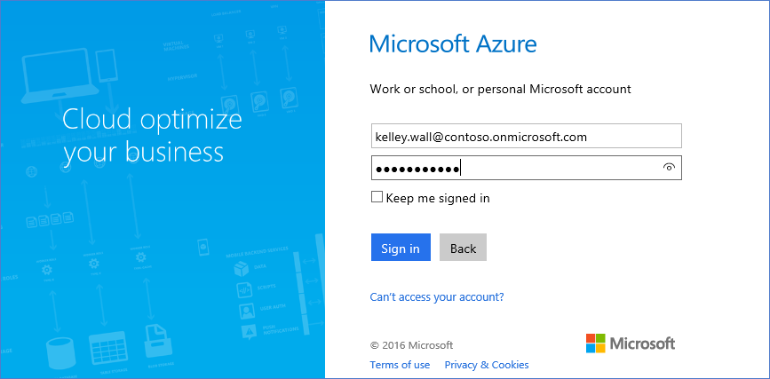
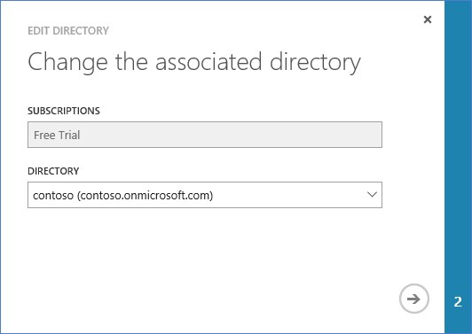

<properties
    pageTitle="Verwenden einer Office 365-Mandanten mit einem Azure-Abonnement | Microsoft Azure"
    description="Erfahren Sie, wie ein Office 365-Verzeichnis (Mandant) hinzufügen zu einem Abonnement Azure, um die Zuordnung zu erstellen."
    services=""
    documentationCenter=""
    authors="JiangChen79"
    manager="mbaldwin"
    editor=""
    tags="billing,top-support-issue"/>

<tags
    ms.service="billing"
    ms.workload="na"
    ms.tgt_pltfrm="ibiza"
    ms.devlang="na"
    ms.topic="article"
    ms.date="09/16/2016"
    ms.author="cjiang"/>

# Zuordnen einer Office 365-Mandanten mit einem Azure-Abonnement
Wenn Sie Azure sowohl in Office 365-Abonnements separat in der Vergangenheit erworben haben und nun auf den Office 365-Mandanten aus dem Azure Abonnement zugreifen können möchten, ist es einfach vergeblich. Dieser Artikel beschreibt, wie aus.

> [AZURE.NOTE] In diesem Artikel gilt nicht für Kunden Enterprise Agreement (EA).

## Schnell
Um Ihr Abonnement Azure Ihrem Office 365-Mandanten zuzuordnen, verwenden Sie Ihrer Azure-Konto zum Hinzufügen von Ihrem Office 365-Mandanten, und klicken Sie dann ordnen Sie Ihr Abonnement Azure mit Office 365-Mandanten zu.

## Ausführliche Schritte
In diesem Szenario Kelley Wall ist ein Benutzer mit einem Azure-Abonnement unter dem Konto kelley.wall@outlook.com. Kelley verfügt auch über ein Office 365-Abonnement unter dem Konto kelley.wall@contoso.onmicrosoft.com. Kelley möchte nun den Office 365-Mandanten mit Azure-Abonnement zugreifen.

### Erforderliche Komponenten
Für die Zuordnung ordnungsgemäß funktioniert sind folgende Vorkenntnisse erforderlich:

- Sie benötigen die Anmeldeinformationen Dienstadministrator des Azure-Abonnements. Eine Teilmenge der Schritte können nicht Co-Administratoren ausgeführt werden.
- Sie benötigen die Anmeldeinformationen des ein globaler Administrator von Office 365-Mandanten.
- Die e-Mail-Adresse der Dienstadministrator muss nicht in der Office 365-Mandanten enthalten sein.
- Die e-Mail-Adresse Dienstadministrator muss nicht mit der jeder globalen Administrator den Office 365-Mandanten übereinstimmen.
- Wenn Sie aktuell eine e-Mail-Adresse, die einem Microsoft-Konto und ein Organisations-Konto befindet verwenden, ändern Sie vorübergehend Dienstadministrator Ihres Abonnements Azure um ein anderes Microsoft-Konto verwenden. Sie können ein neues Microsoft-Konto auf der [Anmeldeseite von Microsoft-Konto](https://signup.live.com/)erstellen.

Gehen Sie folgendermaßen vor, um den Dienstadministrator zu ändern:

1. Melden Sie sich mit dem [Konto Verwaltungsportal](https://account.windowsazure.com/subscriptions).
2. Wählen Sie das Abonnement, das Sie ändern möchten.
3. Wählen Sie die **Abonnementdetails bearbeiten**aus.

    

4. Geben Sie im Feld **DIENSTADMINISTRATOR** neue Dienstadministrator die e-Mail-Adresse ein.

    

### Ordnen Sie den Office 365-Mandanten mit Azure-Abonnement zu
Gehen Sie folgendermaßen vor, um die Office 365-Mandanten Azure-Abonnement zuzuordnen:

1.  Melden Sie sich mit dem [Konto Verwaltungsportal](https://account.windowsazure.com/subscriptions) mit den Dienst Administrator-Anmeldeinformationen.
2.  Wählen Sie im linken Bereich aus **ACTIVE DIRECTORY**.

    

    > [AZURE.NOTE] Den Office 365-Mandanten sollte nicht angezeigt werden. Wenn es angezeigt wird, fahren Sie im nächsten Schritt fort.

    

3. Hinzufügen von Office 365-Mandanten zum Azure Abonnement.

    ein. Wählen Sie **neu** > **Verzeichnis** > **benutzerdefinierten erstellen**.

    

    b. Wählen Sie auf der Seite **Verzeichnis hinzufügen** , wählen Sie unter **Verzeichnis**aus **vorhandenen Verzeichnis verwenden**. Wählen Sie **ich möchte jetzt nicht angemeldet sind**, und wählen Sie **vollständig** .

    

    c. Nachdem Sie sich angemeldet sind, melden Sie sich mit dem globalen Administrator Anmeldeinformationen von Ihrem Office 365-Mandanten.

    

    d. Wählen Sie **Weiter**aus.

    

    e. Wählen Sie **jetzt abmelden**aus.

    

    f. Melden Sie sich mit dem [Konto Verwaltungsportal](https://account.windowsazure.com/subscriptions) mit den Dienst Administrator-Anmeldeinformationen.

    

    g. Sie sollten Ihre Office 365-Mandanten im Dashboard angezeigt werden.

    

4. Wechseln Sie mit der Azure-Abonnement verknüpft ist.

    ein. Wählen Sie **Einstellungen**aus.

    

    b. Wählen Sie Ihr Abonnement Azure aus, und wählen Sie dann **Verzeichnis bearbeiten**.
    

    c. Wählen Sie **Weiter** aus .

    

    > [AZURE.WARNING] Sie erhalten eine Warnung, dass alle CO-Administratoren entfernt werden.

    

    >[AZURE.WARNING] Darüber hinaus werden alle [rollenbasierte Access Control (RBAC)](./active-directory/role-based-access-control-configure.md) Benutzer mit Zugriff zugewiesen, in den vorhandenen Ressourcengruppen auch entfernt. Die Warnung, die Sie empfangen wird jedoch nur das Entfernen von Co-Administratoren erwähnt.

    

    d. Wählen Sie **vollständig** .

5. Jetzt können Sie Ihre Office 365-organisationskonto als Co-Administratoren zu den Mandanten Azure Active Directory hinzufügen.

    ein. Wählen Sie die Registerkarte **Administratoren** aus, und wählen Sie dann auf **Hinzufügen**.

    

    b. Geben Sie ein Organisations-Konto mit Ihrem Office 365-Mandanten, wählen Sie das Abonnement Azure aus, und wählen Sie **abgeschlossen** .

    

    c. Wechseln Sie zurück zur Registerkarte **Administratoren** . Finden Sie das Organisations-Konto als Administrator gemeinsame angezeigt.

    

6. Als Nächstes können Sie Access mit der gemeinsamen Administrator testen.

    ein. Melden Sie bei der Konto Verwaltungsportal ab.

    b. Öffnen Sie das [Konto Verwaltungsportal](https://account.windowsazure.com/subscriptions) oder der [Azure-Portal](https://portal.azure.com/)an.

    c. Wenn die Azure-Anmeldeseite einen Link **Melden Sie sich mit Ihrem Konto Organisation**verfügt, wählen Sie den Link aus. Andernfalls überspringen Sie diesen Schritt.

    

    d. Geben Sie die Anmeldeinformationen des Administrators gemeinsame, und wählen Sie dann auf **Anmelden**.

    

## Nächste Schritte
Verwandte Szenarien umfassen:

- Sie bereits über ein Office 365-Abonnement verfügen und für ein Abonnement Azure bereit sind, aber die vorhandenen Office 365 Benutzerkonten für Ihr Abonnement Azure verwenden möchten.
- Sie sind ein Azure-Abonnent und ein Office 365-Abonnement für die Benutzer in Ihrer vorhandenen Azure Active Directory-Instanz erhalten möchten.

Um Informationen, wie diese Aufgaben ausführen, finden Sie unter [Verwendung Ihrer vorhandenen Office 365-Konto mit Ihrem Abonnement Azure oder umgekehrt](billing-use-existing-office-365-account-azure-subscription.md).
