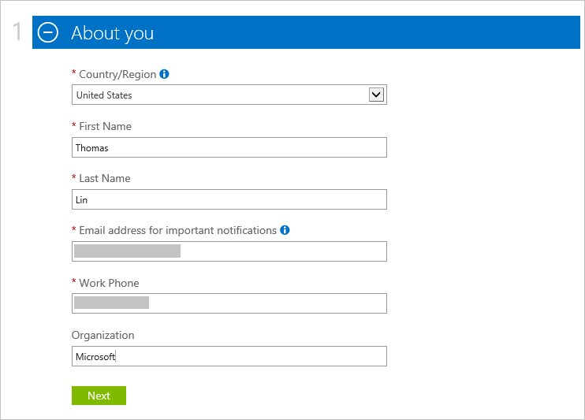
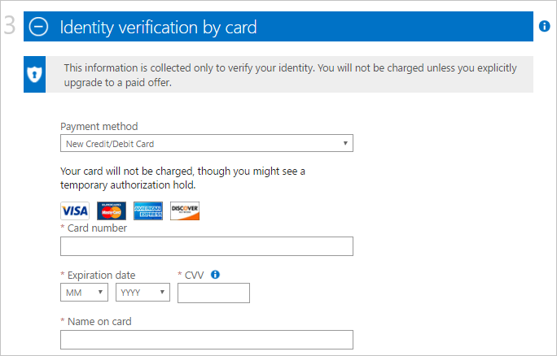

<properties
    pageTitle="Wie melden Sie sich für, kaufen, aktualisieren oder aktivieren ein Abonnement Azure | Microsoft Azure"
    description="Beschreibt, wie Sie kaufen, oder melden Sie sich bei einem Azure-Abonnement"
    services=""
    documentationCenter=""
    authors="genlin"
    manager="mbaldwin"
    editor=""
    tags="billing,top-support-issue"
    />

<tags
    ms.service="billing"
    ms.workload="na"
    ms.tgt_pltfrm="na"
    ms.devlang="na"
    ms.topic="article"
    ms.date="09/23/2016"
    ms.author="genli"/>

# So registrieren, kaufen, aktualisieren oder Azure aktivieren

> [AZURE.NOTE] Wenn Sie an einer beliebigen Stelle in diesem Artikel weitere Hilfe benötigen, wenden Sie sich bitte [an den Support](https://portal.azure.com/?#blade/Microsoft_Azure_Support/HelpAndSupportBlade) , um das Problem erhalten schnell gelöst.

Azure bietet verschiedene Kaufangebote entsprechend Ihren geschäftlichen Anforderungen und erste Schritte mit Azure. Besuchen Sie [Azure bietet](https://azure.microsoft.com/support/legal/offer-details/) eine vollständige Liste aller aktiven Angebote mit Details auf jedes Angebot zu was man Deckblatt, Vorteile und Verfügbarkeit nach Ländern/Regionen.

## Azure bietet - Vorteile und Grenzwerte

Die folgende Tabelle enthält Details zum gemeinsame Angebote:

| Angebot                                                                              | Details |
|--------------------------------------------------------------------------------------|---------|
| Kostenlose Testversion                                                                           |• [Anmeldung und der Schritt-für-Schritt-Leitfaden](billing-buy-sign-up-azure-subscription.md#SignupFreeTrial) • [Vorteile](https://azure.microsoft.com/pricing/free-trial/) • [Häufig gestellte Fragen](https://azure.microsoft.com/pricing/free-trial-faq/) • [Kostenlose Testversion zu nutzungsbasierte aktualisieren](billing-buy-sign-up-azure-subscription.md#UpgradeFreeToPYG)     |
| Nutzungsbasierte                                                                        | • [Anmeldung](https://azure.microsoft.com/pricing/purchase-options/) • [Preise](https://azure.microsoft.com/pricing/)   |
| MPN (Microsoft Partner Network -) empfangen Mitglieder monatliche Azure Gutschriften kostenlos | • [Azure Vorteile für Partner](https://azure.microsoft.com/offers/ms-azr-0025p/) • [Registrieren als Partner](http://go.microsoft.com/fwlink/?linkid=309258&clcid=0x409) oder [Abonnieren Microsoft Action pack](http://go.microsoft.com/fwlink/?linkid=525768&clcid=0x409) • Gutschriften Azure verwenden – Zugriff auf das [Portal MPN](https://partner.microsoft.com) und Status Ihres Berechtigung zu überprüfen und führen Sie die Schritte unter Software Tasten und Vorteile. Wenn Sie Ihre Berechtigung überprüfen können, wenden Sie sich an [MPN unterstützen](https://partner.microsoft.com/Support/).   |
| MSDN & Visual Studio Abonnenten                                                      |• [MSDN-Vorteile für Test-/](https://azure.microsoft.com/offers/ms-azr-0023p/) • [Vorteile für visual Studio Abonnenten](https://azure.microsoft.com/pricing/member-offers/msdn-benefits-details/) • [Visual Studio aktivieren Abonnenten Azure Kreditkarte](https://azure.microsoft.com/pricing/member-offers/msdn-benefits-details/) • [Aktivieren MSDN Azure Vorteile in drei einfachen Schritten](https://www.youtube.com/watch?v=SN2CA71uOEI&feature=youtu.be):  Anmeldung bei [MSDN Kontoseite](https://msdn.microsoft.com/subscriptions/manage/default.aspx) und überprüfen Sie die Berechtigung, klicken Sie auf 'Vorteile Azure aktivieren'. Wenn Sie Ihre Berechtigung überprüfen können, wenden Sie sich an den [MSDN-Abonnements Customer Service-Center](https://msdn.microsoft.com/subscriptions/contactus.aspx).|
| BizSpark                                                                             | • [Vorteile BizSpark](https://www.microsoft.com/bizspark/default.aspx#start-two). Weitere Informationen hierzu finden Sie unter [monatliche Azure Kreditkarte für Visual Studio Enterprise](https://azure.microsoft.com/offers/ms-azr-0064p/) • [BizSpark teilnehmen](https://www.microsoft.com/bizspark/signup/default.aspx). Wenn Probleme auftreten, wenden Sie sich an das [BizSpark Team](mailto:bizspark@microsoft.com?subject=BizSpark%20Support&body=Thank%20you%20for%20contacting%20BizSpark.%20Please%20provide%20as%20much%20of%20the%20following%20information%20as%20possible,%20as%20it%20will%20help%20expedite%20our%20response%20to%20you.%0aContact%20name:%0aStartup%20name:%0aMicrosoft%20Account/Live%20ID:%0aSpecific%20description%20of%20issue%20experienced%20or%20question:%0a%0aThank%20you,%0a%0aThe%20BizSpark%20Team).      |
| BizSpark Pluszeichen                                                                        |• [Erfahren Sie mehr über BizSpark Pluszeichen](https://www.microsoft.com/bizspark/plus/default.aspx). Weitere Informationen hierzu finden Sie unter [BizSpark Plus Vorteile](https://azure.microsoft.com/offers/ms-azr-0149p/) • [BizSpark teilnehmen](https://www.microsoft.com/bizspark/signup/default.aspx) und dann arbeiten mit Ihrem Partner wenden Sie sich an, um auf BizSpark Plus zu aktualisieren. Wenn Probleme auftreten, wenden Sie sich an das [BizSpark Team](mailto:bizspark@microsoft.com?subject=BizSpark%20Support&body=Thank%20you%20for%20contacting%20BizSpark.%20Please%20provide%20as%20much%20of%20the%20following%20information%20as%20possible,%20as%20it%20will%20help%20expedite%20our%20response%20to%20you.%0aContact%20name:%0aStartup%20name:%0aMicrosoft%20Account/Live%20ID:%0aSpecific%20description%20of%20issue%20experienced%20or%20question:%0a%0aThank%20you,%0a%0aThe%20BizSpark%20Team).     |
| Wiederverkäufer (Open Volumenlizenz Programme)                                             |• [Aktivieren Onlinedienst Key - Leitfaden](billing-buy-sign-up-azure-subscription.md#activateKey) • [Kaufen, Vorteile aktivieren](https://azure.microsoft.com/offers/ms-azr-0111p/)        |
| EA (Enterprise Agreement)                                                            |• [Azure für die Enterprise-Lizenzierung](https://azure.microsoft.com/pricing/enterprise-agreement/) • Aktivieren, wenden Sie sich an Ihren Microsoft Account Manager oder den Händler, heute Schritte     |

## Registrieren Sie sich für eine kostenlose Testversion von Azure-Abonnement

Um eine kostenlose Testversion von Azure-Abonnement registrieren, müssen Sie eine Telefonnummer, eine Kreditkarte und eine Microsoft Account bereitstellen. Ihr Microsoft-Konto ist die e-Mail-Adresse, mit denen Sie, die zusammen mit dem Kennwort, Anmeldung bei einem beliebigen Programm Windows Live oder den Dienst, wie Outlook, Hotmail oder OneDrive. Sie können ein Microsoft-Konto mit einem beliebigen e-Mail-Adresse, einschließlich Ihrer e-Mail Unternehmen angehören einrichten. Weitere Informationen hierzu finden Sie unter [häufig gestellte Fragen zu Microsoft-Konto](https://www.microsoft.com/account/faq.aspx) .

Wenn Probleme auftreten, finden Sie unter [Behandeln von Problemen mit Azure Anmeldung Probleme](billing-troubleshoot-azure-sign-up-issues.md) .

>[AZURE.NOTE] Ihr Telefon Zahl und Kreditkarte Details dienen nur für Ihre Identität zu überprüfen. Zwar wird nicht Ihre Kreditkarte in Rechnung gestellt, wird Microsoft platzieren ein Archivs Autorisierung daran für eine minimale Betrag, stellen Sie sicher, dass die Kreditkarte gültig ist. Die Sperre wird innerhalb von 3 bis 5 Arbeitstagen, je nach den Richtlinien Ihrer Bank veröffentlicht werden.

1. Öffnen Sie die [Azure kostenlose Testversion Seite](https://azure.microsoft.com/pricing/free-trial/), und wählen Sie dann auf **jetzt beginnen**.

2. Melden Sie sich mit Ihrem Microsoft-Konto oder organisationskonto an.

3. Geben Sie im Abschnitt **über Sie** Ihre persönlichen Informationen aus. [Weitere](billing-troubleshoot-azure-sign-up-issues.md#i-am-getting-an-error-when-entering-my-information-to-sign-up) Informationen zum Eingeben von genau Ihre persönlichen Informationen.

    

    >[AZURE.NOTE] Die e-Mail-Adresse und Ihr Land Informationen, die Sie bereitstellen, bei der Anmeldung für ein Abonnement Azure wird immer mit dem Abonnement verknüpft sein, und nicht später geändert werden.

4. Im Abschnitt **Überprüfung per Telefon** müssen Sie eine Telefonnummer ein, um einen Überprüfungscode erhalten, den Sie angeben können, um die Überprüfung abzuschließen bereitstellen.

    Sie können auch den Überprüfungscode als Textnachricht oder über VoIP-Anruf empfangen. Treffen Sie eine Auswahl, indem Sie entweder **Textnachricht senden** oder **Anrufen**auswählen. Wählen Sie im ersten Feld der internationalen Vorwahl für Ihr Land aus, und geben Sie Ihre Telefonnummer im zweiten Feld ein. Nachdem Sie den Überprüfungscode erhalten haben, geben Sie es im dritten Feld ein, und wählen Sie dann auf die Schaltfläche **Code überprüfen** . [In diesem Artikel Weitere Informationen hierzu finden Sie unter](billing-troubleshoot-azure-sign-up-issues.md#i-am-not-getting-text-messages-or-calls-during-account-verification-when-i-try-to-sign-up).

    >[AZURE.NOTE] Sie können keine Telefonnummer für VOIP für die Überprüfung Telefon verwenden.

    

    Wenn eine Textnachricht oder einen Anruf nicht angezeigt wird, versuchen Sie eine andere Rufnummer oder Hilfe kontaktieren Sie [Azure-Support](https://portal.azure.com/#blade/Microsoft_Azure_Support/HelpAndSupportBlade) .

5. Geben Sie im Abschnitt **Überprüfung von Karte** die Details einer gültigen Kreditkarte aus. Diese Informationen gesammelt nur, um Ihre Identität zu überprüfen.

    Wenn Sie eine Fehlermeldung erhalten, nachdem Sie Ihre Kreditkarteninformationen abgesendet, finden Sie unter [Meine Kreditkarte nicht aufzurufen, wenn ich versuche, die für Azure registrieren](billing-credit-card-fails-during-azure-sign-up.md).

    

6. Aktivieren Sie das Kontrollkästchen im Abschnitt **Vertrag** stimmen Sie der Abonnement-Vertrag, die Angebotdetails und die datenschutzerklärung anzuzeigen. Wählen Sie dann **auf Anmelden**. Das Formular Vertrag kann nach Land variieren.

    

    Es kann einige Minuten zum Einrichten Ihres Abonnements dauern. Wenn das Abonnement Setup in 15 Minuten nicht abgeschlossen wird, wenden Sie sich an den [Azure-Support](https://portal.azure.com/#blade/Microsoft_Azure_Support/HelpAndSupportBlade) um Unterstützung.

    > [AZURE.NOTE] Wenn Sie eine Fehlermeldung erhalten, führen Sie die Schritte in der Nachricht, um das Problem zu beheben. Eine typische Fehlermeldung angezeigt wird:

    > **Leider konnten wir der Vorgang nicht abgeschlossen. Versuchen Sie es später erneut oder Neuladen Sie der Webseite**

    > In diesem Fall versuchen Sie, einen anderen Browser verwenden, um die Anmeldung abzuschließen. Wenn das Problem weiterhin besteht, wenden Sie sich an den [Azure-Unterstützung](https://portal.azure.com/#blade/Microsoft_Azure_Support/HelpAndSupportBlade) für Hilfe.

7. Wenn das Abonnement fertig ist, wählen Sie **Verwalten von meinem Dienst starten** beginnen soll.

    

### Zusätzliche Ressourcen

- [Eine kostenlose Testversion von Azure kann nicht aktiviert werden.](billing-troubleshoot-azure-sign-up-issues.md#i-cant-activate-an-azure-free-trial)
- [Azure kostenlose Testversion häufig gestellte Fragen](https://azure.microsoft.com/pricing/free-trial-faq/).

## Aktualisieren von Azure kostenlose Testversion auf nutzungsbasierte

1. Melden Sie sich bei der [Azure-Konto-Portal](https://account.windowsazure.com/subscriptions) mit dem Microsoft-Konto oder dem organisationskonto an, die Sie zum Registrieren für die kostenlose Testversion verwendet.

2. Wählen Sie das Abonnement aus, und wählen Sie dann auf **Aktualisieren**

    

3. Wählen Sie **Ja**aus, und wählen Sie dann auf **Jetzt aktualisieren**.

    

Bei der Aktualisierung von einem kostenlosen Testabonnement in ein Abonnement nutzungsbasierte alle Vorteile von Ihre kostenlose Testversion wie die Beschränkung 30 Tage übrig oder $200 Kredits für auf Azure Services verwenden weiterhin bis einer von ihnen, erreicht ist. Das Abonnement Upgrade tritt danach.

## Aktivieren Sie das Verwenden eines Online-Dienst Aktivierung Schlüssels

Gehen folgendermaßen Sie vor, um Ihr Abonnement zu aktivieren, wenn Sie Gutschriften **Azure öffnen** von einem Händler erworben haben Sie einen Aktivierungsschlüssel (5 x 5 Tasten):

1. Wechseln Sie zu der [Seite "Zusammenfassung" Abonnement](https://account.windowsazure.com/subscriptions).

2. Wählen Sie **Azure öffnen**aus. Wählen Sie auf der Seite [Azure offene Lizenz Schlüssel](https://azure.microsoft.com/offers/ms-azr-0111p/) **aktivieren ein neues Abonnement oder vorhandenen Abonnement**aus.

3. Geben Sie den Product Key ein, und aktivieren Sie dann die Option Vertrag.

> [AZURE.NOTE] Wenn Sie noch weitere Fragen haben, wenden Sie sich bitte [an den Support](https://portal.azure.com/?#blade/Microsoft_Azure_Support/HelpAndSupportBlade) , um das Problem erhalten schnell gelöst.
