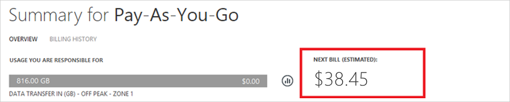

<properties
    pageTitle="So laden Sie Ihre Rechnung und täglich Verwendungsdaten Abrechnung Azure | Microsoft Azure"
    description="Beschreibt, wie Sie Ihre Azure Abrechnung Rechnung und tägliche Verwendungsdaten herunterladen"
    services=""
    documentationCenter=""
    authors="genlin"
    manager="mbaldwin"
    editor=""
    tags="billing"
    />

<tags
    ms.service="billing"
    ms.workload="na"
    ms.tgt_pltfrm="na"
    ms.devlang="na"
    ms.topic="article"
    ms.date="10/10/2016"
    ms.author="genli"/>

# So laden Sie Ihre Rechnung und täglich Verwendungsdaten Abrechnung Azure

> [AZURE.NOTE] Wenn Sie an einer beliebigen Stelle in diesem Artikel weitere Hilfe benötigen, wenden Sie sich bitte [an den Support](https://portal.azure.com/?#blade/Microsoft_Azure_Support/HelpAndSupportBlade) , um das Problem erhalten schnell gelöst.

Als Kontoadministrator Azure-können Sie die Rechnung Abrechnung und die tägliche Nutzungsdaten bei der [Azure-Portal](https://portal.azure.com) oder im [Azure Account Center](https://account.windowsazure.com/subscriptions)anzeigen. So sieht wie:

## Azure-portal

1. Melden Sie sich bei der [Azure-Portal](https://portal.azure.com) als Konto-Administrator.

    >[AZURE.NOTE] Nur Konto-Administrator verfügt über die Berechtigung zum Zugriff auf die Abrechnung Daten Weitere Informationen dazu, wie Sie herausfinden, wer das Kontoadministrator des Abonnements ist finden Sie unter den [häufig gestellte Fragen](billing-subscription-transfer.md#faq).

2. Wählen Sie im Menü Hub **Abrechnung**ein. Klicken Sie auf das Blade **Abrechnung** finden Sie einige nützliche Informationen, wie z. B. nächsten Abrechnungsdatum.

    
3. Wählen Sie im Abschnitt **Abonnement Kosten** das Abonnement, das Sie anzeigen möchten.

    
4. Klicken Sie auf **Abrechnung und Verwendung**.

    

5. Klicken Sie auf das Blade **Abrechnung Verlauf** auf **Rechnung herunterladen** , um eine Kopie Ihrer Rechnung anzeigen. Klicken Sie auf einen Abrechnungszeitraum aus, um die tägliche Verwendungsdaten anzeigen.

    

## Center für Azure-Konto

1. Melden Sie sich in der [Mitte der Azure-Konto](https://account.windowsazure.com/subscriptions) als Kontoadministrator an.
2. Wählen Sie das Abonnement für das Sie die Rechnung und die Verwendung der Informationen möchten.
3. Wählen Sie auf **Verlauf Abrechnung**.  
4. Sie können Ihre Anweisungen für den letzten sechs Abrechnung Perioden und dem aktuellen nicht fakturierte vertraglich Zeitraum anzeigen.   
5. Wählen Sie **Aktuelle Ansicht-Anweisung** , um eine Schätzung Ihrer Gebühren gleichzeitig anzuzeigen, die der geschätzten generiert wurde. Diese Informationen nur täglich aktualisiert und alle Ihre Verwendung möglicherweise nicht enthalten. Ihre monatliche Rechnung kann diese Schätzung variieren.   
6. Wählen Sie **Rechnung herunterladen** , um eine Kopie Ihrer letzten Rechnung anzuzeigen.  
7. Wählen Sie **Herunterladen Verwendung** die tägliche Verwendungsdaten als eine CSV-Datei herunterladen. 

> [AZURE.NOTE] Wenn Sie noch weitere Fragen haben, wenden Sie sich bitte [an den Support](https://portal.azure.com/?#blade/Microsoft_Azure_Support/HelpAndSupportBlade) , um das Problem erhalten schnell gelöst.
