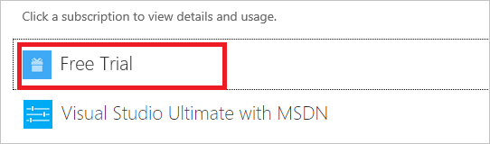
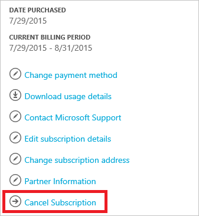

<properties
    pageTitle="Kündigen Ihres Abonnements Azure | Microsoft Azure"
    description="Beschreibt, wie Sie Ihr Azure-Abonnement, wie das kostenlose Testversion Abonnement kündigen"
    services=""
    documentationCenter=""
    authors="genlin"
    manager="mbaldwin"
    editor=""
    tags="billing"
    />

<tags
    ms.service="billing"
    ms.workload="na"
    ms.tgt_pltfrm="na"
    ms.devlang="na"
    ms.topic="article"
    ms.date="09/26/2016"
    ms.author="genli"/>

# Kündigen Sie Ihres Abonnements Azure

Kündigen Sie Ihr Abonnement Azure, aus dem [Azure Account Center](https://account.windowsazure.com/subscriptions) Nachdem Sie das Abonnement kündigen, beenden Ihren Zugriff auf Azure Dienste und Ressourcen.

Bevor Sie Ihr Abonnement kündigen:

- Sichern Sie Ihre Daten aus. Angenommen, wenn die Daten in SQL Azure-Speicher oder in gespeichert sind, herunterladen Sie eine Kopie. Wenn Sie einen virtuellen Computern haben, speichern Sie ein Bild davon lokal.

- Beenden der Dienste. Wechseln Sie zu der [Seite im Verwaltungsportal Ressourcen](https://ms.portal.azure.com/?flight=1#blade/HubsExtension/Resources/resourceType/Microsoft.Resources%2Fresources)und **Beenden** , alle ausgeführten virtuellen Computern, Applikationen oder andere Dienste.

Wenn Sie ein kostenpflichtiges [Azure-Support-Plan](https://azure.microsoft.com/support/plans/)Abbrechen, erhalten Sie weiterhin für die restlichen den Ausdruck 6 Monaten monatliche Abrechnung werden.

## Kündigen des Abonnements

1. Melden Sie sich an der [Mitte der Azure-Konto](https://account.windowsazure.com/subscriptions) als Konto-Administrator.

2. Wählen Sie unter **Klicken Sie auf ein Abonnement zum Anzeigen von Details und die Verwendung**des Abonnements, die Sie stornieren möchten. 

    

3. Wählen Sie auf der rechten Seite der Seite **Kündigen**aus.
    
    

4. Wählen Sie **Ja, kündigen eines Abonnements**.
    
    

5. Klicken Sie auf  Schließen Sie das Dialogfeld Fenster, und kehren Sie zu der Abonnementseite zurück.

Nachdem Sie Ihr Abonnement kündigen, warten wir 90 Tagen ab, bevor die Daten endgültig gelöscht werden, für den Fall, dass Sie darauf zugreifen oder Ihre Meinung ändern müssen. Weitere Informationen finden Sie unter [Microsoft Trust Center – wie wir Verwalten Ihrer Daten](https://go.microsoft.com/fwLink/p/?LinkID=822930&clcid=0x409).

## Reaktivieren des Abonnements

Wenn Sie Ihr Abonnement je nach Bedarf berechnet versehentlich abgebrochen, können Sie [es in der Mitte Konten reaktivieren](billing-subscription-become-disable.md#how-to-re-enable-non-pay-as-you-go-subscriptions).

## Benötigen Sie Hilfe? Wenden Sie sich an Support.

Wenn Sie noch weitere Fragen haben, wenden Sie sich bitte [an den Support](https://portal.azure.com/?#blade/Microsoft_Azure_Support/HelpAndSupportBlade) , um das Problem erhalten schnell gelöst.
