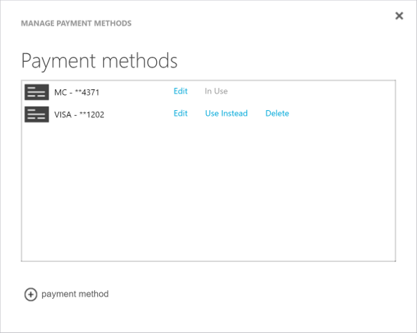

<properties
    pageTitle="So ändern Sie die Kreditkarte verwendet, um ein Abonnement Azure bezahlen | Microsoft Azure"
    description="Beschreibt, wie Sie zum Ändern der Kreditkarte verwendet, um ein Abonnement Azure bezahlen"
    services=""
    documentationCenter=""
    authors="genlin"
    manager="mbaldwin"
    editor=""
    tags="billing"
    />

<tags
    ms.service="billing"
    ms.workload="na"
    ms.tgt_pltfrm="na"
    ms.devlang="na"
    ms.topic="article"
    ms.date="08/24/2016"
    ms.author="genli"/>

# So ändern Sie die Kreditkarte verwendet, um ein Abonnement Azure bezahlen

Manchmal müssen Sie möglicherweise Details der Kreditkarte in Ihre Kontoinformationen zu aktualisieren, oder ändern die Karte zu Ihrer Rechnung bezahlen verwendet.

Wenn Ihre Kreditkarte automatisch erneuert wird, und die Zahl unverändert bleibt, können Sie einfach die Details der vorhandenen Kreditkarte, wie z. B. Ablaufdatum aktualisieren.

Wenn sich Ihre Kreditkartennummer ändern aufgrund verloren gehen, müssen gestohlen oder abgelaufen sind, Sie die neue Kreditkarte bei Ihrem Konto hinzufügen. Dies liegt daran der Sicherheitscode CVV-auf der Karte geändert wird, wenn die Kreditkartennummer geändert wird.

> [AZURE.NOTE] Wenn Sie an einer beliebigen Stelle in diesem Artikel weitere Hilfe benötigen, wenden Sie sich bitte [an den Support](https://portal.azure.com/?#blade/Microsoft_Azure_Support/HelpAndSupportBlade) , um das Problem erhalten schnell gelöst.

## Bearbeiten von Zahlungsinformationen für eine vorhandene Kreditkarte
1. Melden Sie sich als Kontoadministrator [Azure Account Center](https://account.windowsazure.com/Subscriptions) an. Im [Portal Azure](https://portal.azure.com)können Sie das Konto Center zugreifen, indem Sie **Abonnement**auswählen>*dem Namen des Abonnements*>**Verwalten**.

    > [AZURE.NOTE] Nur Konto-Administrator verfügt über die Berechtigung zum Zugreifen auf das Konto Center. Weitere Informationen zu Konto manuell konfigurieren finden Sie unter [Hinzufügen oder Ändern von Azure Administratorrollen](billing-add-change-azure-subscription-administrator.md).

2. Wählen Sie unter **Klicken Sie auf ein Abonnement zum Anzeigen von Details und die Verwendung**des Abonnements, die mit der Kreditkarte verknüpft ist.  
3. Wählen Sie auf der rechten Seite der Seite **Zahlungsmethoden verwalten**aus.  
4. Wählen Sie auf der Seite **Zahlungsmethoden verwalten** neben der Kreditkartennummer **Bearbeiten** .  
5. Stellen Sie sicher, dass Sie die richtige Art und Karte Kreditkartennummer ausgewählt haben, klicken Sie auf der Seite **Bearbeiten** .
6. Nehmen Sie die Änderungen, die Sie, um die Kartendetails benötigen, und wählen Sie dann **Weiter** zu der Seite **Zahlungsmethode auswählen** .

## Fügen Sie eine neue Kreditkarte als Zahlungsmethode hinzu.
1. Melden Sie sich an der [Mitte der Azure-Konto](https://account.windowsazure.com/Subscriptions) als Konto-Administrator.
2. Wählen Sie unter **Klicken Sie auf ein Abonnement zum Anzeigen von Details und die Verwendung**des Abonnements, für die Sie eine neue Zahlungsmethode hinzufügen möchten.
3. Wählen Sie auf der rechten Seite der Seite **Zahlungsmethoden verwalten**aus.
4. Klicken Sie auf der Seite **Zahlungsmethoden verwalten** , select "+" zum Hinzufügen einer neuen Kreditkarte.
5. Wählen Sie einen Typ Kreditkarte aus, und geben Sie dann auf alle erforderlichen Informationen.
6. Wählen Sie **Weiter** , um zur Seite **Zahlungsmethoden verwalten** zurückzukehren. Wenn die hinzugefügte Karte gültig ist, wird es der Liste der verfügbaren Zahlungsmethoden hinzugefügt werden.

## Ändern Sie die Kreditkarte, die Sie verwenden, um eine Azure Rechnung bezahlen
1. Melden Sie sich an der [Mitte der Azure-Konto](https://account.windowsazure.com/Subscriptions) als Konto-Administrator.
2. Wählen Sie unter **Klicken Sie auf ein Abonnement zum Anzeigen von Details und die Verwendung**des Abonnements, für die Sie die Zahlungsmethode aktualisieren möchten.
3. Wählen Sie auf der rechten Seite der Seite **Zahlungsmethoden verwalten**aus.
4. Klicken Sie auf der Seite **Zahlungsmethoden verwalten** auf **Stattdessen verwenden,** um die Kreditkarte auszuwählen, die Sie verwenden möchten.

## Entfernen einer Kreditkarte des Kontos
1. Melden Sie sich an der [Mitte der Azure-Konto](https://account.windowsazure.com/Subscriptions) als Konto-Administrator.
2. Wählen Sie unter **Klicken Sie auf ein Abonnement zum Anzeigen von Details und die Verwendung**des Abonnements, für die Sie die Zahlungsmethode aktualisieren möchten.
3. Wählen Sie auf der rechten Seite der Seite **Zahlungsmethoden verwalten**aus.
4. Klicken Sie auf **Löschen** , um die Kreditkarte auszuwählen, die Sie löschen möchten, klicken Sie auf der Seite **Zahlungsmethoden verwalten** .

    > [AZURE.NOTE] Sie werden nicht in der Lage, eine Kreditkarte zu löschen, wenn sie andere aktive Microsoft-Abonnements zugeordnet ist. Wenn Sie eine Fehlermeldung, die die Karte verwendet wird erhalten, stellen Sie sicher, dass es alle aktiven Abonnements getrennt wird, die mit Microsoft sind.

> [AZURE.NOTE] Wenn Sie noch weitere Fragen haben, wenden Sie sich bitte [an den Support](https://portal.azure.com/?#blade/Microsoft_Azure_Support/HelpAndSupportBlade) , um das Problem erhalten schnell gelöst.
