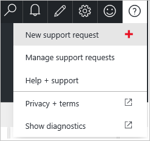

<properties
    pageTitle="So erstellen Sie ein Ticket Support für Azure Abrechnungs- und Abonnementproblemen | Microsoft Azure"
    description="Beschreibt, wie Sie ein Ticket Support für Azure Abrechnungs- und Abonnementproblemen zu erstellen."
    services=""
    documentationCenter=""
    authors="genlin"
    manager="mbaldwin"
    editor=""
    tags="billing"
    />

<tags
    ms.service="billing"
    ms.workload="na"
    ms.tgt_pltfrm="na"
    ms.devlang="na"
    ms.topic="article"
    ms.date="08/24/2016"
    ms.author="genli"/>

# So erstellen Sie ein Ticket Support für Azure abrechnungs- und Abonnementprobleme
Dieser Artikel enthält die Informationen, die Sie benötigen, um ein Ticket mit Azure-Unterstützung zu öffnen.

1. Melden Sie sich bei der [Azure-Portal](https://portal.azure.com/)werden soll. Wählen Sie **Hilfe + Support**>**neu support-Anfragen**.

    
2. Wählen Sie die **Grundlagen** Blade aus den Plan Problem, Typ, Abonnement und Support.
3. Geben Sie in das **Problem** Blade die folgenden Informationen ein:

 * **Schwere**. Wählen Sie eine Option aus, die die Schwere der Anforderung darstellt. Weitere Informationen zu den Arten schwere finden Sie unter der [Microsoft Azure Vorfall schwere Tabelle](http://support.microsoft.com/gp/AzureSevDetails).
 * **Problemtyp**. Wählen Sie einen Problemtyp aus.
 * **Details**. Geben Sie einen Vorfall Titel für Ihre Anfrage und verwenden Sie dann den Text Textfelder zur Verfügung stellen die erforderlichen Informationen und zusätzliche Informationen zur Anforderung aufnehmen möchten.
 * **Zeitrahmens** (optional). Geben Sie, falls möglich Datum, Uhrzeit und Zeitzone Informationen für das letzte Vorkommen Ihres Problems ein.
 * Verwenden Sie das Tool **Datei hochladen** , können Sie Ihre Anfrage zugehörigen Dokumentationsdateien zuordnen.
4. Überprüfen Sie in den **Kontaktinformationen** Blade Ihre Kontaktinformationen und bevorzugte Kontakt für, und klicken Sie dann auf **Erstellen**.

Sie werden durch eine Azure Supportmitarbeiter gemäß der Vertragsbedingungen kontaktiert.

Sie können auch eine Supportanfrage aus der Azure-Support-Website oder aus der Mitte der Azure-Konten senden:

 * Klicken Sie auf **Unterstützung**, um ein Ticket Support der [Website Azure Unterstützung](https://azure.microsoft.com/support/options/)zu übermitteln.
 * Um eine Support-Ticket aus dem [Azure Account Center](https://account.windowsazure.com/Subscriptions)zu senden, wählen Sie ein Abonnement aus, und klicken Sie dann auf **Kontakt mit Microsoft Support**.

 >[AZURE.NOTE]Nur der Azure-Kontoadministrator verfügt über die Berechtigung zum Zugreifen auf das Konto Center. Weitere Informationen dazu, wie Sie herausfinden, wer das Kontoadministrator des Abonnements ist finden Sie unter den [häufig gestellte Fragen](billing-subscription-transfer.md#faq).
