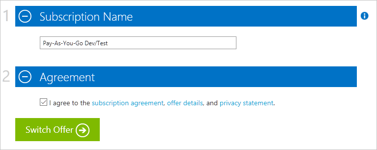

<properties
    pageTitle="Wechseln Sie zu einem anderen Angebot Ihr Abonnement Azure | Microsoft Azure"
    description="Informationen Sie zum Ändern Ihres Abonnements Azure, und wechseln Sie in ein anderes Angebot Verwaltungsportal Abonnement verwenden"
    services=""
    documentationCenter=""
    authors="genlin"
    manager="mbaldwin"
    editor=""
    tags="billing,top-support-issue"/>

<tags
    ms.service="billing"
    ms.workload="na"
    ms.tgt_pltfrm="na"
    ms.devlang="na"
    ms.topic="article"
    ms.date="09/30/2016"
    ms.author="genli"/>

# Wechseln Sie zu einem anderen Angebot Ihr Abonnement Azure

Als Kunde [nutzungsbasierte](https://azure.microsoft.com/offers/ms-azr-0003p/) möglicherweise Sie Ihr Abonnement Azure zu einem anderen Angebot im [Account Center](https://account.windowsazure.com/Subscriptions)wechseln können. Dieses Feature können Sie beispielsweise die [monatliche Gutschriften für Visual Studio-Abonnenten](https://azure.microsoft.com/pricing/member-offers/msdn-benefits-details/)nutzen. Wenn Sie [Kostenlose Testversion](https://azure.microsoft.com/free/)angezeigt wird, erfahren Sie, wie Sie [ein upgrade auf nutzungsbasierte](billing-upgrade-azure-subscription.md).

#### Was wird unterstützt:

| Von                                                              | An                                                                                      |
|-------------------------------------------------------------------|-----------------------------------------------------------------------------------------|
| [Nutzungsbasierte](https://azure.microsoft.com/offers/ms-azr-0003p/) | [Nutzungsbasierte Test-/](https://azure.microsoft.com/offers/ms-azr-0023p/)              |
| [Nutzungsbasierte](https://azure.microsoft.com/offers/ms-azr-0003p/) | [Visual Studio Professional](https://azure.microsoft.com/offers/ms-azr-0059p/)          |
| [Nutzungsbasierte](https://azure.microsoft.com/offers/ms-azr-0003p/) | [Visual Studio Test Professional](https://azure.microsoft.com/offers/ms-azr-0060p/)     |
| [Nutzungsbasierte](https://azure.microsoft.com/offers/ms-azr-0003p/) | [MSDN Plattformen](https://azure.microsoft.com/offers/ms-azr-0062p/)                      |
| [Nutzungsbasierte](https://azure.microsoft.com/offers/ms-azr-0003p/) | [Visual Studio Enterprise](https://azure.microsoft.com/offers/ms-azr-0063p/)            |
| [Nutzungsbasierte](https://azure.microsoft.com/offers/ms-azr-0003p/) | [Visual Studio Enterprise (Bizspark)](https://azure.microsoft.com/offers/ms-azr-0064p/) |

> [AZURE.NOTE] Bieten Sie für weitere Änderungen [an den Support](https://portal.azure.com/?#blade/Microsoft_Azure_Support/HelpAndSupportBlade).
    
## Switch-Abonnement Angebot

> [AZURE.VIDEO switch-to-a-different-azure-offer]

1.  Melden Sie sich bei [Azure Account Center](https://account.windowsazure.com/Subscriptions).

2.  Wählen Sie Ihr Abonnement je nach Bedarf berechnet.

3.  Klicken Sie auf **Wechseln zu einem anderen Angebot**. Die Schaltfläche ist nur verfügbar, wenn nutzungsbasierte angezeigt wird und mit der ersten Abrechnungszeitraum fertig.

    
    
4.  **Wählen Sie das gewünschte Angebot aus** , aus der Liste der Angebote, der zu Ihrem Abonnement wechseln kann. Diese Liste richtet sich nach der Mitgliedschaften, denen mit Ihrem Konto verbunden ist. Wenn nichts verfügbar ist, überprüfen Sie die [Liste der verfügbaren Angebote, die, denen Sie zur wechseln können](#whats-supported) , und stellen Sie sicher, dass Sie die richtigen Mitgliedschaften haben. 

    

5.  Je nach dem Angebot, die, dem Sie zu wechseln, wird möglicherweise eine Notiz den Einfluss der Wechsel angezeigt. Navigieren Sie in dieser Liste sorgfältig, und führen Sie die Schritte aus, bevor Sie fortfahren.

    

6.  Sie können Ihr Abonnement umbenennen. Standardmäßig setzen wir sie auf den Namen der neuen Angebot an. Klicken Sie auf **Wechseln zu bieten** , um den Vorgang abzuschließen.

    

7.  Erfolg! Ihr Abonnement ist nun auf dem neuen Angebot gewechselt werden.

## Wechseln ich kann nicht warum Angebote?

**Wechseln zu einem anderen Angebot** möglicherweise nicht Wenn angezeigt:

- Sie befinden sich nicht an [nutzungsbasierte](https://azure.microsoft.com/offers/ms-azr-0003p/)aus. Zurzeit können nur nutzungsbasierte Abonnements zu einem anderen Angebot gewechselt werden.

    - Wenn Sie [Kostenlose Testversion](https://azure.microsoft.com/free/)angezeigt wird, erfahren Sie, wie Sie [ein upgrade auf nutzungsbasierte](billing-upgrade-azure-subscription.md).

    - Angebot aus einem anderen Abonnement, [wenden Sie sich an Support](https://portal.azure.com/?#blade/Microsoft_Azure_Support/HelpAndSupportBlade)zu wechseln.

- Sie sind, klicken Sie auf der ersten Abrechnungszeitraum; Sie müssen warten, bis der ersten Abrechnungszeitraum zu beenden, bevor Sie Angebote wechseln können.

Möglicherweise **sind keine Angebote in Ihrer Region oder Land zu diesem Zeitpunkt verfügbar** ist angezeigt:

- Sie sind nicht berechtigt für alle Schalter Angebot. Überprüfen Sie die [Liste der verfügbaren Angebote, die, denen Sie zur wechseln können](#whats-supported).

## Was bedeutet Azure Angebote führen in meinem Dienst wechseln und Abrechnung?

Hier sind die Einzelheiten der was passiert, wenn Sie Azure wechseln Pläne in der Mitte des Kontos.

### Zugriff auf Dienste

Es gibt keine Dienstausfälle für alle Benutzer mit dem Abonnement verknüpft ist. Wechseln Sie zu Ihr Angebot haben jedoch Einschränkungen. Beispielsweise verbieten einige Angebote Herstellung verwenden, daher Sie Herstellung Ressourcen zu einem anderen Abonnement zu verschieben müssen.

### Abrechnung

Klicken Sie auf den Tag, die, den Sie wechseln, wird eine Rechnung für alle ausstehenden Gebühren generiert. Klicken Sie dann ist Ihr Abonnement pro das neue Angebot Preisgestaltung Ausdrücke in Rechnung gestellt. Ihr Abonnement Abrechnung Jahrestag ändert sich in das Datum, an dem Sie Angebote geändert. Verwendung und Abrechnung Daten vor die Änderung Angebot nicht beibehalten wird, so empfiehlt es sich, dass Sie vor dem Wechsel eine Kopie herunterladen.

> [AZURE.NOTE] Aufgrund von Abrechnung Zusammenhang Einschränkungen sind Schalter Angebot nicht möglich in der ersten Abrechnungszyklus nach dem Erstellen eines Abonnements.

## Kann ich in die [Cloud Solution Provider](https://partner.microsoft.com/Solutions/cloud-reseller-overview) (CSP) oder [Enterprise Agreement](https://azure.microsoft.com/pricing/enterprise-agreement/) (EA) von nutzungsbasierte migrieren?

Zurzeit unterstützt nicht in der Mitte Konten Angebot wechseln CSP oder EA. Wenn Ihres aktuellen Abonnements in EA verschieben möchten, müssen Sie den Registrierungs-Administrator, die Ihr Konto in EA hinzuzufügen. Klicken Sie dann erhalten Sie eine e-Mail-Einladung Nachricht. Wenn Sie die Anweisungen, um die Einladung anzunehmen folgen, werden Ihre Abonnements automatisch unter der Enterprise Agreement verschoben. Zum Migrieren von in CSP finden Sie unter [Azure Abonnement Migration zu CSP](https://blogs.technet.microsoft.com/hybridcloudbp/2016/08/26/azure-subscription-migration-to-csp/).

## Nächste Schritte

- Informationen zum [Verwalten von Administratorrollen](billing-add-change-azure-subscription-administrator.md) für Ihr Abonnement

- Nachverfolgen Sie Ihrer Verwendung von [Verwendungsdaten und Rechnung herunterladen](billing-download-azure-invoice-daily-usage-date.md)

## Benötigen Sie Hilfe? Wenden Sie sich an Support.

Wenn Sie noch weitere Fragen haben, wenden Sie sich bitte [an den Support](https://portal.azure.com/?#blade/Microsoft_Azure_Support/HelpAndSupportBlade) , um das Problem erhalten schnell gelöst.
