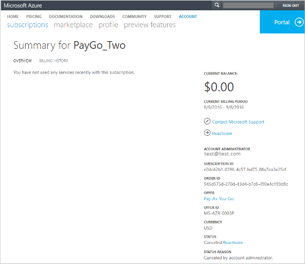

<properties
    pageTitle="Reaktivieren deaktiviert Azure-Abonnement | Microsoft Azure"
    description="Beschreibt, wenn Sie gegebenenfalls ein Azure-Abonnement deaktiviert haben und wie Sie ihn erneut aktivieren."
    keywords="Azure-Abonnement deaktiviert"
    services=""
    documentationCenter=""
    authors="genlin"
    manager="mbaldwin"
    editor=""
    tags="billing"
    />

<tags
    ms.service="billing"
    ms.workload="na"
    ms.tgt_pltfrm="na"
    ms.devlang="na"
    ms.topic="article"
    ms.date="10/04/2016"
    ms.author="genli"/>

# Warum wird mein Abonnement Azure deaktiviert, und wie reaktivieren kann ich Sie?

Sie möglicherweise Ihr Azure Abonnement deaktiviert, weil Sie die maximale Anzahl Ausgaben erreicht haben, haben Sie eine überfällige Rechnung, hat Ihre Kreditkarte Limit erreicht, oder weil das Abonnement vom Kontoadministrator abgebrochen wurde. Finden Sie unter welche Problem gilt für Sie, und führen Sie die Schritte in diesem Artikel können Sie Ihr Abonnement erneut aktiviert zu gelangen. 

## Ihre Ausgaben erreicht

Wenn Ihre Verwendung die monatlichen Beträge in Ihrem Abonnement enthalten verbraucht, deaktivieren wir des Diensts für den Rest dieses Monats Abrechnung. Der Dienst ist deaktiviert, um zu verhindern, dass Sie versehentlich dabei Gebühren für die Verwendung über den Betrag, der mit Ihrem Abonnement enthalten. Sie können die Ausgaben Grenzwert und [Abrechnung Benachrichtigungen für Ihre Microsoft Azure-Abonnements einrichten](billing-set-up-alerts.md) , mit deren Hilfe Sie überwachen und Verwalten der Abrechnung Aktivität für Ihre Azure-Konten entfernen.

So entfernen Sie die maximale Anzahl Ausgaben,

1. Melden Sie sich der [Mitte der Azure-Konto](https://account.windowsazure.com/Home/Index).

2. Klicken Sie auf **Abonnements**.

3. Wählen Sie ein Abonnement aus.

4. Klicken Sie auf **Abonnement der Ausgaben erreicht und um zu verhindern, dass Gebühren deaktiviert wurde**.

    Wenn diese Option nicht angezeigt wird, klicken Sie im **Statusbereich** -Abonnement auf **Ausgaben Grenzwert entfernen** .

5. Wählen Sie eine der folgenden Optionen aus:

|Option|Effekt|
|------|------|
|Ausgaben Grenzwert endlos entfernen|Entfernt die Ausgaben Beschränkung, bis Sie ihn wieder aktivieren.|
|Entfernen von Ausgaben Grenzwert für den aktuellen Abrechnungszeitraum|Entfernt die Ausgaben bestehen jedoch die Ausgaben Beschränkung neu gestartet wurde, für den nächsten Abrechnungszeitraum.|

Wenn Sie eine kostenlose Testabonnement und entfernen Sie die Ausgaben Grenzwerte, wandelt Ihr Abonnement in nutzungsbasierte am Ende der kostenlose Testversion aus.

## Ihre Rechnung ist überfällig

Achten Sie Ihre ausstehenden Saldo vollständig aus. Finden Sie im Artikel [Warum haben Sie erhalten eine Benachrichtigung, dass Ihr Abonnement Azure ein Vergangenheit weist Saldo fällig?](billing-azure-subscription-past-due-balance.md#what-can-you-do-to-resolve-the-issue)

## Die Rechnung die größeneinschränkung Ihrer Kreditkarte.

Zur Behebung des Problems, [Wechseln Sie zu einer anderen Kreditkarte](billing-how-to-change-credit-card.md). Oder wenn Sie eine Business darstellt sind, können Sie [wechseln, um per Rechnung bezahlen](https://azure.microsoft.com/pricing/invoicing/).

## Das Abonnement wurde durch den Konto-Administrator abgebrochen.

Wenn Sie das Konto-Administrator sind, reaktivieren Sie Ihr Abonnement je nach Bedarf berechnet, indem Sie mithilfe der folgenden Schritte: 

1. Melden Sie sich der [Mitte der Azure-Konto](https://account.windowsazure.com/Home/Index).
2. Wählen Sie das Abonnement unterbrochen.
3. Klicken Sie auf **erneut aktivieren**.

Für andere Typen Abonnement [an den Support](https://portal.azure.com/?#blade/Microsoft_Azure_Support/HelpAndSupportBlade) , um Ihr Abonnement erneut aktiviert haben.

## Benötigen Sie Hilfe? Wenden Sie sich an Support.
Wenn Sie Hilfe benötigen, [kontaktieren Sie den Support](https://portal.azure.com/?#blade/Microsoft_Azure_Support/HelpAndSupportBlade) , um Ihr Problem gelöst wurde schnell noch benötigen. 

