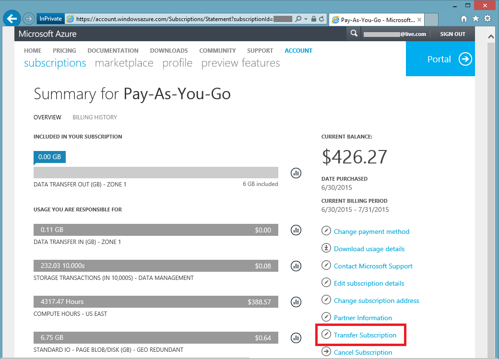
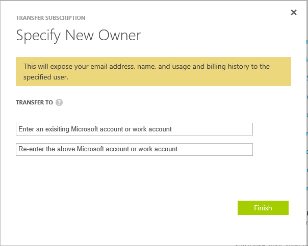

<properties
   pageTitle="Übertragen der Besitzrechte für ein Abonnement Azure | Microsoft Azure"
   description="So übertragen Sie ein Azure-Abonnement zu einem anderen Benutzer und einige häufig gestellte Fragen (FAQ) zu den Prozess"
   services=""
   documentationCenter=""
   authors="genlin"
   manager="stevenpo"
   editor=""
   tags="billing,top-support-issue"/>

<tags
   ms.service="billing"
   ms.workload="na"
   ms.tgt_pltfrm="na"
   ms.devlang="na"
   ms.topic="article"
   ms.date="10/10/2016"
   ms.author="genli"/>

# Übertragen von Besitz eines Azure-Abonnements

Gehen Sie vor:

- Hand, die über Abrechnung Besitz Ihres Azure Abonnements an eine andere Person müssen?
- Möchten Sie das zur Anmeldung bei Azure verwendete Konto ändern? Möglicherweise verwendet Ihr Microsoft-Account aber auffällt verwenden Ihrer Arbeit oder Schule stattdessen Konto?
- Möchten Sie Ihr Abonnement Azure aus einem Verzeichnis in einen anderen wechseln?
- Haben Sie in anderen Mandanten Azure und Office 365 und konsolidieren möchten?

Sie können jetzt ganz einfach in der Microsoft Azure-Konto Center – für nutzungsbasierte, MSDN, Action Pack oder BizSpark Abonnements ausführen.  Wir haben die Möglichkeit, Ihr Abonnement zu einem anderen Benutzer übertragen hinzugefügt. Kurzum, können Sie nun das Konto Administrator für alle nutzungsbasierte, MSDN, BizSpark oder Action Pack-Abonnement, die Sie besitzen, ändern unabhängig davon, welche, denen Land in arbeiten. Wir unterstützen nun die Übertragung von Azure Marketplace Einkäufe für diese Typen von Abonnements ebenfalls an.

> [AZURE.NOTE] Um Ihr Abonnement in ein anderes Angebot ändern zu können, finden Sie unter [Wechseln zu einem anderen Angebot Ihr Azure Abonnement](billing-how-to-switch-azure-offer.md) für Weitere Informationen. Wenn Sie an einer beliebigen Stelle in diesem Artikel weitere Hilfe benötigen, wenden Sie sich bitte [an den Support](https://portal.azure.com/?#blade/Microsoft_Azure_Support/HelpAndSupportBlade) , um das Problem erhalten schnell gelöst.

## So übertragen Sie Besitz eines Azure-Abonnements

> [AZURE.VIDEO transfer-an-azure-subscription]

1.  Melden Sie sich unter <https://account.windowsazure.com/Subscriptions>. Sie müssen der Kontoadministrator zum Ausführen einer Besitz übertragen werden. Weitere Informationen dazu, wie Sie herausfinden, wer das Kontoadministrator des Abonnements ist finden Sie unter den [häufig gestellte Fragen](#faq).

2.  Wählen Sie das Abonnement zu übertragen.

3.  Klicken Sie auf die Option **Abonnement übertragen** .

    

4.  Führen Sie die Anweisungen, um den Empfänger anzugeben.

    

5.  Der Empfänger erhalten eine e-Mail mit einem Link Annahme automatisch.

    

6.  Der Empfänger auf den Link klickt und folgt die Anweisungen, einschließlich ihre Zahlungsinformationen eingeben.

    

    

7. Erfolg! Das Abonnement wird jetzt übertragen.

## Häufig gestellte Fragen (FAQ)

-   **Wie kann ich wissen, wer der Kontoadministrator des Abonnements ist?**

    Sie können bestätigen, wer das Kontoadministrator des Abonnements ist, wie folgt:

    1. Melden Sie sich mit dem [Azure-Portal](https://portal.azure.com)aus.
    2. Wählen Sie im Menü Hub **Abonnement**aus.
    3. Wählen Sie das Abonnement, das Sie prüfen möchten, und wählen Sie dann auf **Einstellungen**.
    4. Wählen Sie **Eigenschaften**aus. Konto-Administrator des Abonnements wird im Feld **Konto Administrator** angezeigt.  

-   **Führt eine Übertragung des Abonnements zu einem beliebigen Dienstausfälle?**

    Es gibt keine Auswirkung auf den Dienst aus. Dies effektiv hebt das Abonnement das aktuelle Konto Administrator und eine neue Sitzung unter dem Konto des Empfängers, aber das neue Abonnement ordnet die zugrunde liegenden Azure-Dienste. Die Abonnement-ID bleibt unverändert.

-   **Wie verwende ich dieses Verfahren, um das Verzeichnis für Abonnement ändern?**-   
    Ein Azure-Abonnement wird im Verzeichnis erstellt, die der Administrator Konto gehört. Ja, um das Verzeichnis zu ändern, nur übertragen Sie das Abonnement zu einem Benutzerkonto im Zielverzeichnis. Wenn der Benutzer die Schritte zur Übertragung annehmen abschließt, wird das Abonnement automatisch in das Zielverzeichnis verschoben.

-   **Wenn ich den Besitz eines Abonnements aus einer anderen Organisation übernehmen, werden sie weiterhin auf Meine Ressourcen zugreifen?**

    Wenn das Abonnement zu einem anderen Mandanten übertragen wurde, wird der Benutzer, der den vorherigen Mandanten zugeordnet Zugriff auf das Abonnement gesperrt. Auch wenn ein Benutzer kein Dienst oder Co-Administrator mehr ist, möglicherweise noch Zugriff auf das Abonnement durch andere Sicherheitsmechanismen besteht. Hierzu gehören:
    - Projektmanagement-Zertifikate, mit die der Benutzer Administratorrechte zu Abonnement Ressourcen gewähren. Weitere Informationen finden Sie unter [Erstellen und ein Zertifikat Management für Azure hochladen](https://msdn.microsoft.com/library/azure/gg551722.aspx)
    -   Tastenkombinationen für Dienste wie Speicher. Weitere Informationen finden Sie unter [anzeigen "," Kopieren "und" erstellen, jeweils Speicher-Tastenkombinationen](storage-create-storage-account.md#view-copy-and-regenerate-storage-access-keys)
    -   Remote Access Anmeldeinformationen für Dienste wie Azure-virtuellen Computern

    Dies ist keine vollständige Liste. Der Empfänger, sollten auch dem Dienst zugeordneten sind, ob sie zum Einschränken des Zugriffs auf ihre Ressourcen müssen vertrauliche Daten aktualisieren. Die meisten Ressourcen können wie folgt aktualisiert werden:

    1.   Wechseln Sie zu der Azure-Portal: [ *https://portal.azure.com*](https://portal.azure.com)

    2.    Klicken Sie auf Durchsuchen, alle -&gt; alle Ressourcen

    3.    Wählen Sie die Ressource ein. Dadurch wird das Blade Ressource geöffnet.

    4.    Klicken Sie in das Blade Ressourcen auf **Einstellungen**. Sie können hier anzeigen und aktualisieren Sie vorhandene Kennwörter.

-   **Wenn ich das Abonnement in der Mitte der Abrechnungszyklus übertragen, Durchlaufen der Empfänger Bezahlung für die gesamte Abrechnung?**

    Der Absender ist zuständig für Zahlung für eine Verwendung, die bis zu dem Zeitpunkt gemeldet wurde, dass die Übertragung abgeschlossen ist. Der Empfänger ist für Verwendung gemeldet ab dem Zeitpunkt der Übertragung oder höher ist. Möglicherweise gibt es einige Verwendung, die vor der Übertragung stattgefunden aber später gemeldet wurde. Dies wird in Rechnung des Empfängers enthalten sein.

-   **Kann der Empfänger auf Verwendung und Abrechnungsverlauf zugreifen?**

    Zu diesem Zeitpunkt sind nur Informationen für den Empfänger offen gelegt der Betrag der letzten Zahlung (oder den aktuellen Saldo, wenn das Abonnement übertragen wurde, bevor Sie die erste Rechnung generiert wurde). Der Rest der Verwendung und Abrechnungsverlauf übertragen mit dem Abonnement nicht.

-   **Kann das Angebot während der Übertragung werden geändert?**

    Das Angebot muss unverändert bleiben. Wenn Sie Ihr Angebot ändern möchten, müssen Sie sich [an den Support](http://go.microsoft.com/fwlink/?LinkID=619338).

-   **Kann ich ein Abonnement zu einem Benutzerkonto in ein anderes Land übertragen?**

    Nein, wird zu diesem Zeitpunkt dies nicht unterstützt. Benutzerkonto des Empfängers muss sich in demselben Land.

-   **Kann der Empfänger anderen Prepaid werden verwendet?**

    Ja. Es gibt hier Einschränkungen: jetzt das Abonnement Verlauf Abrechnung über zwei Konten hinweg geteilt ist. Der Vorteil ist jedoch, dass Sie dies tun können, ohne dass [Support wenden Sie sich an](http://go.microsoft.com/fwlink/?LinkID=619338).

-   **Sind die Zahlungsmethode betroffen, nachdem ich ein Azure-Abonnement übertragen?**

    Um die Übertragung des Abonnements annehmen möchten, muss eine Kreditkarte oder ähnliche Zahlungsmethode bereitgestellt werden, für das Abonnement bezahlen. Zum Beispiel muss Wenn Bob ein Abonnement zu Frauke weiterleitet und Frauke die Übertragung akzeptiert, Frauke auch eine Zahlungsmethode bereitstellen, mit denen sie für das Abonnement bezahlen. Nachdem die Übertragung abgeschlossen ist, wird Bob nicht mehr für das Abonnement in Rechnung gestellt, die er in Frauke übertragen.

## Nächste Schritte nach akzeptiert Besitzrechte für ein Abonnement

1. Sie können jetzt das Konto manuell konfigurieren. Überprüfen Sie und aktualisieren Sie die Dienstadministrator und Co-Administratoren. Verwalten von Administratoren im [Azure klassischen Portal](https://manage.windowsazure.com) auf Einstellungen. [Erfahren Sie mehr](http://go.microsoft.com/fwlink/?LinkID=533293).
2. Sie können auch rollenbasierte Access-Steuerelements (RBAC) für Ihr Abonnement und Dienste verwenden. Besuchen Sie die [Azure-Portal](https://portal.azure.com) [erfahren Sie mehr über RBAC](http://go.microsoft.com/fwlink/?LinkID=544802)
3. Aktualisieren des Abonnements Services zugeordneten Anmeldeinformationen an. Hierzu gehören:
    - Projektmanagement-Zertifikate, mit die der Benutzer Administratorrechte zu Abonnement Ressourcen gewähren. Weitere Informationen finden Sie unter [Erstellen und Hochladen einer Management Zertifikat ist für Azure](https://msdn.microsoft.com/library/azure/gg551722.aspx)
    -   Tastenkombinationen für Dienste wie Speicher. Weitere Informationen finden Sie unter [anzeigen "," Kopieren "und" erstellen, jeweils Speicher-Tastenkombinationen](storage-create-storage-account.md#view-copy-and-regenerate-storage-access-keys)
    -   Remote Access Anmeldeinformationen für Dienste wie Azure-virtuellen Computern
4. Aktualisieren des Benachrichtigungen für dieses Abonnement,[erfahren Sie mehr](http://go.microsoft.com/fwlink/?LinkID=533292) zu [Azure Account Center](https://account.windowsazure.com/Subscriptions)  
5.  Wenn Sie mit einem Partner arbeiten, sollten Sie die Partner-ID für dieses Abonnement aktualisieren. Sie führen Sie in der [Mitte der Azure-Konto](https://account.windowsazure.com/Subscriptions).

> [AZURE.NOTE] Wenn Sie noch weitere Fragen haben, wenden Sie sich bitte [an den Support](https://portal.azure.com/?#blade/Microsoft_Azure_Support/HelpAndSupportBlade) , um das Problem erhalten schnell gelöst.
