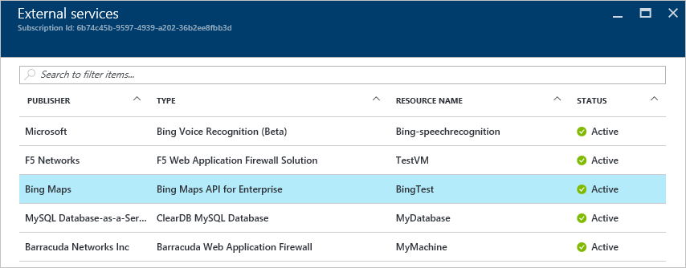
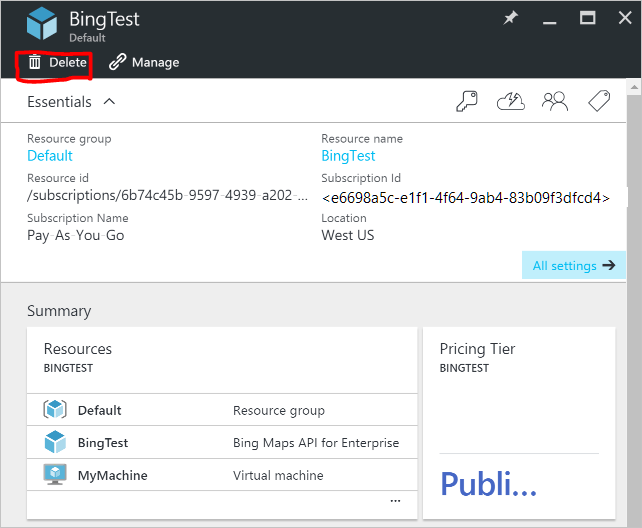

<properties
    pageTitle="Grundlegendes zu Ihrer Azure externen Dienst Gebühren | Microsoft Azure"
    description="Informationen Sie zur Abrechnung von externen Diensten, früher bekannt als Marketplace, Gebühren in Azure."
    services=""
    documentationCenter=""
    authors="adpick"
    manager="felixwu"
    editor=""
    tags="billing"
    />

<tags
    ms.service="billing"
    ms.workload="na"
    ms.tgt_pltfrm="na"
    ms.devlang="na"
    ms.topic="article"
    ms.date="10/12/2016"
    ms.author="adpick"/>

# Grundlegendes zu Ihrer Azure externen Dienst Gebühren

In diesem Artikel wird erläutert, die Abrechnung von externen Diensten in Azure. Externe Dienste verwendet, um Marketplace Bestellungen aufgerufen werden. Externe Dienste, die von unabhängigen Dienst Lieferanten bereitgestellt werden, aber vollständig innerhalb der Azure-Netz integriert werden. Erfahren Sie, wie Sie:

- Identifizieren von externen Diensten
- Verstehen Sie, wie der Abrechnung von anderen Azure Ressourcen unterscheidet sich
- Zeigen Sie an und verfolgen Sie alle Kosten, die Sie fällig, die aus der Verwendung von externen Diensten
- Verwalten von externen Dienst Bestellungen und wie Sie diese bezahlen

## Was sind externe Azure-Dienste?

Externe Dienste verwendet, um Azure Marketplace aufgerufen werden. Im Allgemeinen, sind diese Dienste von Drittanbietern zur Verfügung für Azure veröffentlicht. Beispielsweise sind ClearDB und SendGrid externen Diensten, die Sie in Azure kaufen können, aber nicht von Microsoft veröffentlicht werden.

### Identifizieren von externen Diensten

Wenn Sie einen neuen externen Dienst oder eine Ressource bereitstellen, wird eine Warnung angezeigt:

>[AZURE.NOTE] Externe Dienste von Unternehmen, die nicht Microsoft sind veröffentlicht werden, doch manchmal Microsoft-Produkte auch als externe Dienste eingestuft werden.

### Externe Dienste werden separat berechnet.

Externe Dienste werden als einzelne Bestellungen innerhalb Ihres Abonnements Azure behandelt. Der Abrechnungszeitraum für jeden Dienst wird festgelegt, wenn Sie den Dienst erwerben. Nicht mit den Abrechnungszeitraum des Abonnements verwechselt werden, unter dem Sie erworben haben. Sie auch separaten Rechnung erhalten und Ihre Kreditkarte separat belastet wird.

### Jede externer Dienst wurde ein anderes Abrechnung Modell

Einige Dienste werden je nach Bedarf berechnet Weise berechnet, während andere ein monatliche Zahlung basierend Modell verwenden. Sie benötigen eine Kreditkarte für Azure externen Diensten, können Sie keinen externe Diensten mit Rechnung bezahlen kaufen.

### Monatliche kostenlose Gutschriften kann nicht für externe Dienste verwendet werden.

Wenn Sie ein Abonnement Azure, die [kostenlose Gutschriften](https://azure.microsoft.com/pricing/spending-limits/)enthält verwenden, können er auf externen Dienst Rechnung angewendet werden. Verwenden Sie eine Kreditkarte, um externe Dienste kaufen.

## Ausgaben anzeigen externer Dienst und Verlauf

Sie können eine Liste mit den externen Diensten anzeigen, die für jedes Abonnement innerhalb des [Azure-Portal](https://portal.azure.com/)sind: 

1. Melden Sie sich bei der [Azure-Portal](https://portal.azure.com/) , und [Navigieren Sie zu der **Abrechnung** Blade](https://portal.azure.com/?flight=1#blade/Microsoft_Azure_Billing/BillingBlade).

     
  
2. Wählen Sie im Abschnitt **Abonnement Kosten** das Abonnement, das Sie anzeigen möchten. 
   
    

3. Klicken Sie auf **externe Dienste**.

    

4. Es sollte jede Ihre externen Dienst-Bestellungen, Name des Herausgebers, Service-Ebene, die Sie erworben haben, Namen, der der Ressource und der Status des aktuellen zugewiesen angezeigt. Wählen Sie einen externen Dienst ältere Rechnung angezeigt.

    

5. Von hier aus können Sie ältere Rechnung Datenmengen, einschließlich der Mehrwertsteuer Projektstrukturplan-Codes anzeigen.

    

## Für externe Dienst-Bestellungen Zahlungsmethoden verwalten

Aktualisieren Sie Ihre Zahlungsmethoden für externe Dienst-Bestellungen aus dem [Konto Center](https://account.windowsazure.com/).

> [AZURE.NOTE] Wenn Sie Ihr Abonnement mit einem Konto Arbeit oder Schule gekauft haben sollten Sie [an den Support](https://portal.azure.com/?#blade/Microsoft_Azure_Support/HelpAndSupportBlade) , um Ihre Zahlungsmethode zu ändern.

1. Melden Sie sich bei der [Account Center](https://account.windowsazure.com/) , und [Navigieren Sie zur Registerkarte **marketplace** ](https://account.windowsazure.com/Store)

    

2. Wählen Sie den externen Dienst, die, den Sie verwalten möchten

    

3. Klicken Sie auf der rechten Seite der Seite auf **Zahlungsmethode ändern** . Dieser Link gelangen Sie zu einem anderen Portal zum Verwalten Ihrer Zahlungsmethode aus.
    
    

4. Klicken Sie auf **Bearbeiten Sie die Informationen** und Anweisungen Sie, um Ihre Zahlungsinformationen zu aktualisieren.

    
    
## Abbrechen von externen Dienst Ordnung

Wenn Sie Ihre Bestellung externen Dienst abbrechen möchten, müssen Sie die Ressource im [Azure-Portal](https://portal.azure.com)zu löschen.

## Benötigen Sie Hilfe? Wenden Sie sich an Support.

Wenn Sie noch weitere Fragen haben, wenden Sie sich bitte [an den Support](https://portal.azure.com/?#blade/Microsoft_Azure_Support/HelpAndSupportBlade) , um das Problem erhalten schnell gelöst.
