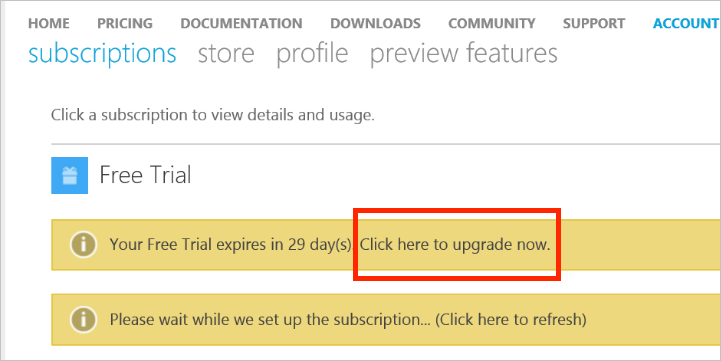

<properties
   pageTitle="Aktualisieren Sie Ihr kostenlose Azure-Abonnement auf nutzungsbasierte | Microsoft Azure"
   description="Beschreibt die Verfahren zum und Anforderungen für ein kostenloses Abonnement zu nutzungsbasierte aktualisieren"
   services=""
   documentationCenter=""
   authors="jlian"
   manager="mbaldwin"
   editor=""
   tags="billing"
   />

<tags
   ms.service="billing"
   ms.devlang="na"
   ms.topic="article"
   ms.tgt_pltfrm="na"
   ms.workload="na"
   ms.date="10/26/2016"
   ms.author="jlian"/>

# Aktualisieren Sie Ihr kostenlose Azure-Abonnement auf nutzungsbasierte

Sie können Ihr Abonnement [Kostenlose Testversion](https://azure.microsoft.com/free/) oder [Microsoft Imagine](https://azure.microsoft.com/offers/ms-azr-0144p/) auf [nutzungsbasierte](https://azure.microsoft.com/offers/ms-azr-0003p/) vom Portal Azure-Konto aktualisieren. 

1. Melden Sie sich mit dem [Portal für Azure-Konto](https://account.windowsazure.com/subscriptions) aus, und navigieren Sie zu der Registerkarte **Abonnements** .

2. Wählen Sie im Abschnitt Status Abonnement im Banner **Jetzt aktualisieren** aus.

    

3. Bestätigen Sie Ihr Upgrade an.

    

Wenn Sie kostenlose Testversion nutzungsbasierte aktualisieren, würde alle Vorteile von Ihre kostenlose Testversion wie 30 Tage Grenzwert oder $200 Kredits übrig fortsetzen, bis eine von ihnen, erreicht ist. Das Abonnement Upgrade passiert danach.
