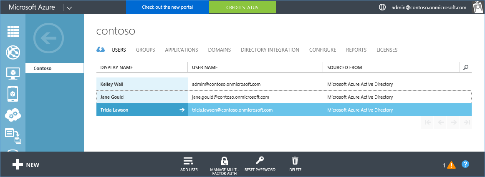
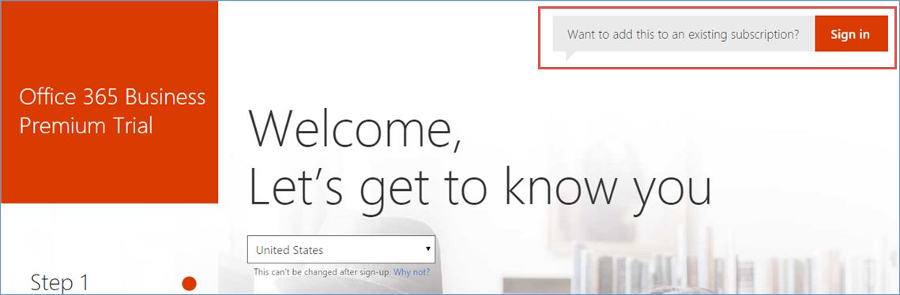
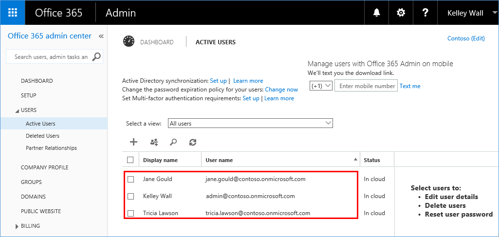
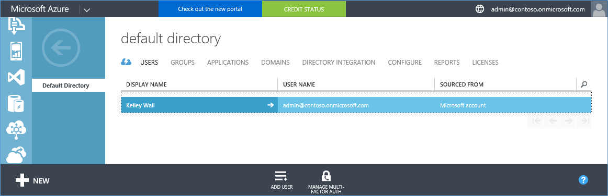
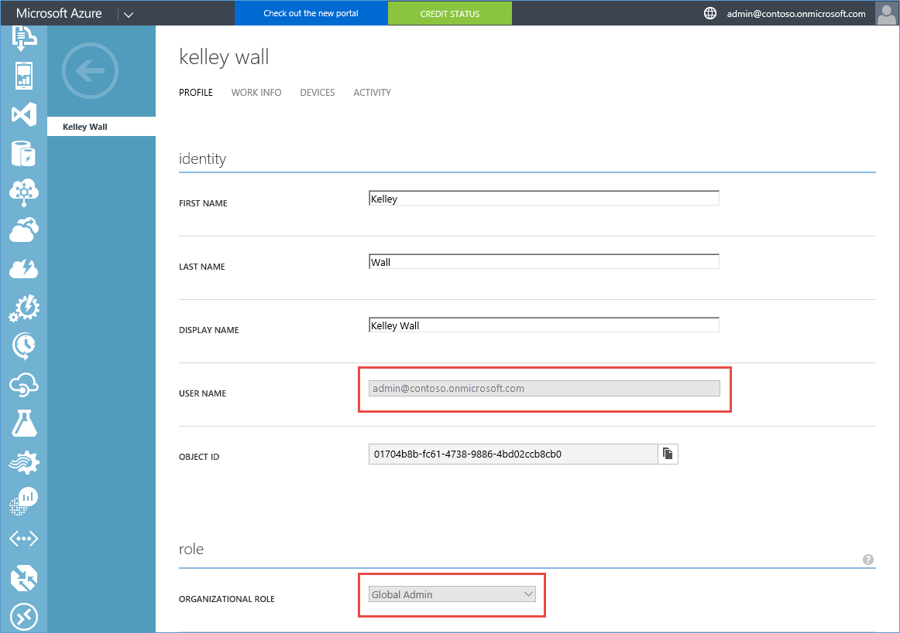

<properties
    pageTitle="Freigeben eine einzelnen Azure AD-Mandanten über Office 365 und Azure-Abonnements | Microsoft Azure"
    description="Erfahren Sie, wie Sie Ihre Office 365 Azure AD-Mandanten und seinen Benutzern mit Ihrem Azure-Abonnement freigeben oder umgekehrt"
    services=""
    documentationCenter=""
    authors="JiangChen79"
    manager="mbaldwin"
    editor=""
    tags="billing,top-support-issue"/>

<tags
    ms.service="billing"
    ms.workload="na"
    ms.tgt_pltfrm="ibiza"
    ms.devlang="na"
    ms.topic="article"
    ms.date="08/17/2016"
    ms.author="cjiang"/>

# Verwenden eines vorhandenen Office 365-Kontos mit Ihrem Abonnement Azure oder umgekehrt
Szenario: Sie bereits über ein Office 365-Abonnement verfügen und für ein Abonnement Azure bereit sind, aber die vorhandenen Office 365 Benutzerkonten für Ihr Abonnement Azure verwenden möchten. Alternativ ein Azure-Abonnent sind und ein Office 365-Abonnement für die Benutzer in Ihrem vorhandenen Azure Active Directory erhalten möchten. In diesem Artikel wird gezeigt, wie einfach es ist beides erreichen.

> [AZURE.NOTE] In diesem Artikel gilt nicht für Kunden Enterprise Agreement (EA). Wenn Sie weitere Hilfe bei einer beliebigen Stelle in diesem Artikel [an den Support](https://portal.azure.com/?#blade/Microsoft_Azure_Support/HelpAndSupportBlade) benötigen, können Sie das Problem gelöst schnell zu gelangen.

## Schnell

- Wenn Sie bereits über ein Office 365-Abonnement verfügen und für Azure anmelden möchten, verwenden Sie die Option **Melden Sie sich mit dem organisationskonto an** . Fahren Sie den Azure Anmeldevorgang mit Ihrem Office 365-Konto an. Finden Sie unter [detaillierten Schritte in diesem Artikel](#s1).

- Wenn Sie bereits über ein Azure-Abonnement verfügen und Office 365-Abonnement erhalten möchten, melden Sie sich bei Office 365 mit Ihrem Azure-Konto. Fahren Sie mit den Schritten Anmeldung. Nach Abschluss der Anmeldung wird das Office 365-Abonnement auf die gleiche Azure Active Directory-Instanz hinzugefügt, die Ihr Abonnement Azure gehört. Weitere Informationen finden Sie im Abschnitt [detaillierten Schritte in diesem Artikel](#s2).

>[AZURE.NOTE] Office 365-Abonnement, das Konto Sie verwenden, um für Anmeldung muss ein Mitglied der Rolle globaler Administrator oder Administrator Abrechnung Verzeichnis in Ihrem Mandanten Azure Active Directory. Sie [erfahren, wie die Rolle in Azure Active Directory zu bestimmen](#how-to-know-your-role-in-your-azure-active-directory).

Um zu verstehen, was passiert, wenn Sie ein Abonnement für ein Konto hinzufügen, finden Sie unter [Hintergrundinformationen später in diesem Artikel](#background-information).

## Ausführliche Schritte

### Szenario 1: Azure kaufen von Office 365-Benutzer, die zu planen.
In diesem Szenario wird davon ausgegangen, dass Kelley Wall eines Benutzers ist, die ein Office 365-Abonnement, und Abonnieren von Azure plant. Es gibt zwei zusätzliche aktive Benutzer Andrea und Katrin an. Kelleys Konto ist admin@contoso.onmicrosoft.com.

Um Azure registrieren, gehen Sie folgendermaßen vor:

1. Registrieren Sie sich für Azure am [Azure.com](https://azure.microsoft.com/)an. Klicken Sie auf **Testen Sie kostenlos**. Klicken Sie auf der nächsten Seite auf **jetzt beginnen**.

    

2. Klicken Sie auf **Melden Sie sich mit dem organisationskonto an**.

    

3. Melden Sie sich mit Ihrem Office 365-Konto an. In diesem Fall ist es Kelleys Office 365-Konto an.

    

4. Füllen Sie die Informationen und abzuschließen Sie den Anmeldevorgang.

    

    

Jetzt sind Sie schon. Im Portal Azure sollte angezeigte dieselben Benutzer angezeigt werden. Gehen Sie folgendermaßen vor, um dies zu überprüfen:

1. Klicken Sie auf **Start, Verwaltung von meinem Dienst** , klicken Sie im Bildschirm zuvor angezeigt.
2. Klicken Sie auf **Durchsuchen**, und klicken Sie dann auf **Active Directory**.

    

3. Klicken Sie auf **Benutzer**.

    

4. Wie erwartet, werden alle Benutzer, einschließlich Kelley, aufgeführt.

    

### Szenario 2: Azure Benutzer, die zum Kauf von Office 365

In diesem Szenario Kelley Wall ist ein Benutzer mit einem Azure-Abonnement unter dem Konto admin@contoso.onmicrosoft.com. Abonnieren Sie Office 365 und verwenden Sie das gleiche Verzeichnis, die, das Sie bereits mit Azure hat, möchte Kelley.

>[AZURE.NOTE] Um ein Office 365-Abonnement zu erhalten, muss das Konto ein, das Sie für die Anmeldung verwenden ein Mitglied der Rolle globaler Administrator oder Administrator Abrechnung Verzeichnis in Ihrem Mandanten Azure Active Directory. [Erfahren Sie, wie die Rolle in Azure Active Directory-Informationen](#how-to-know-your-role-in-your-azure-active-directory).

Informationen zum Office 365 abonnieren möchten, gehen Sie folgendermaßen vor:

1. Wechseln Sie zur [Seite Office 365-Produkt](https://products.office.com/business), und wählen Sie dann einen Plan, der für Sie geeignet ist.
2. Nachdem Sie den Plan auswählen, wird die folgende Seite angezeigt. Fügen Sie nicht in das Formular. Klicken Sie auf der oberen rechten Ecke der Seite auf **Anmelden** .

    

3. Melden Sie sich mit Ihrem Kontoanmeldeinformationen an. In diesem Beispiel ist es Kelleys Konto ein.

    

4. Klicken Sie auf, **versuchen Sie es jetzt**.

    

5. Klicken Sie auf der Seite Bestätigung auf **Continue**.

    

Jetzt sind Sie schon. Finden Sie in der Office 365-Verwaltungskonsole Benutzer aus der Contoso-Verzeichnis als aktive Benutzer angezeigt. Gehen Sie folgendermaßen vor, um dies zu überprüfen:

1. Öffnen Sie das Office 365 Administrationscenter.
2. Erweitern Sie **Benutzer**aus, und klicken Sie dann auf **Aktive Benutzer**.

    

### Wie Ihre Rolle in Ihrem Azure-Active Directory-Informationen

1. Melden Sie sich mit dem [Azure-Portal](https://portal.azure.com/)aus.
2. Klicken Sie auf **Durchsuchen**, und klicken Sie dann auf **Active Directory**.

    

3. Klicken Sie auf **Benutzer**.

    

4. Klicken Sie auf den Benutzer. In diesem Beispiel wird der Benutzer Kelley Wall.

    Beachten Sie das Feld **ORGANISATIONSINTERNE**Rolle.

    

## Hintergrundinformationen zum Azure und Office 365-Abonnements
Office 365 und Azure verwenden zum Verwalten von Benutzern und Abonnements Azure-Active Directory-Dienst. Erwägen Sie ein Azure-Verzeichnis als eines Containers, in dem Sie Benutzer und Abonnements gruppieren können. Wenn Sie dasselbe Benutzerkonto für Ihre Azure und Office 365-Abonnements verwenden zu können, müssen Sie sicherstellen, dass die Abonnements im selben Verzeichnis erstellt werden. Berücksichtigen Sie die folgenden Punkte:

- Klicken Sie unter ein Verzeichnis nicht umgekehrt Ruft ein Abonnement erstellt.
- Benutzer gehören Verzeichnisse durchsuchen, nicht umgekehrt.
- Ein Abonnement kommt im Verzeichnis des Benutzers, der das Abonnement erstellt. Daher ist Ihre Office 365-Abonnement mit dem Konto Ihres Abonnements Azure verknüpft, wenn Sie dieses Konto verwenden, um die Office 365-Abonnement zu erstellen.

Weitere Informationen finden Sie unter [wie Azure-Abonnements Azure Active Directory zugeordnet sind](./active-directory/active-directory-how-subscriptions-associated-directory.md).

>[AZURE.NOTE] Azure-Abonnements sind im Besitz einzelner Benutzer im Verzeichnis.

>[AZURE.NOTE] Office 365-Abonnements gehören das Verzeichnis selbst. Wenn der Benutzer im Verzeichnis die erforderlichen Berechtigungen verfügen, können sie diese Abonnements ausgeführt werden.

## Nächste Schritte
Wenn Sie Ihre Azure und die Office 365-Abonnements separat in der Vergangenheit, und das Abonnement Azure den Office 365-Mandanten zugreifen können soll, finden Sie in [einem Office 365-Mandanten mit einem Azure-Abonnement zuordnen](billing-add-office-365-tenant-to-azure-subscription.md).

> [AZURE.NOTE] Wenn Sie noch Fragen haben, [wenden Sie sich an Support](https://portal.azure.com/?#blade/Microsoft_Azure_Support/HelpAndSupportBlade) haben, können Sie das Problem gelöst schnell zu gelangen.
