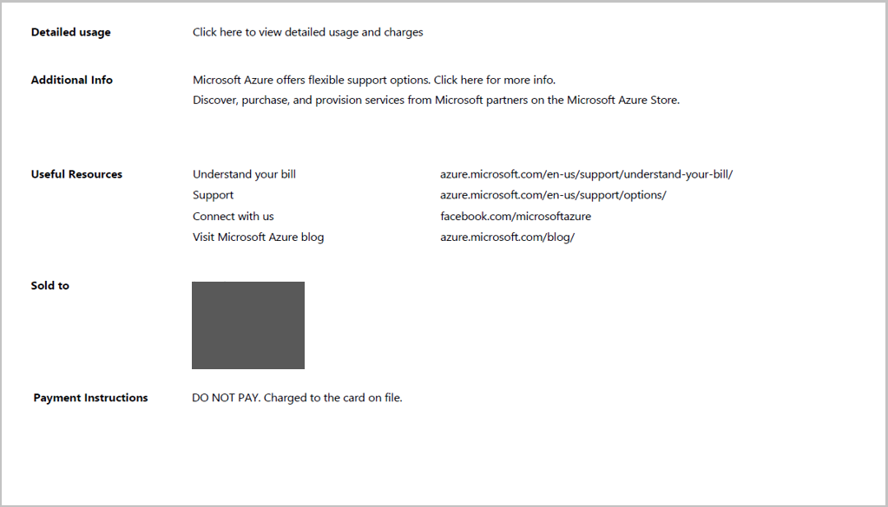
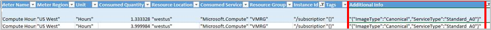

<properties
   pageTitle="Grundlegendes zu Ihrer Rechnung | Microsoft Azure"
   description="Informationen Sie zum gelesen und verstehen die Verwendung und Rechnung für Ihr Abonnement Azure"
   services=""
   documentationCenter=""
   authors="genlin"
   manager="stevenpo"
   editor=""
   tags="billing"/>

<tags
   ms.service="billing"
   ms.devlang="na"
   ms.topic="article"
   ms.tgt_pltfrm="na"
   ms.workload="na"
   ms.date="10/31/2016"
   ms.author="erihur;genli"/>

# Grundlegende Informationen zu Ihrer Rechnung für Microsoft Azure

> [AZURE.NOTE] Wenn Sie an einer beliebigen Stelle in diesem Artikel weitere Hilfe benötigen, wenden Sie sich bitte [an den Support](https://portal.azure.com/?#blade/Microsoft_Azure_Support/HelpAndSupportBlade) , um das Problem erhalten schnell gelöst.

Die Gebühren für Microsoft Azure-Abonnements variieren je nach Zins planen. Einige Pläne Zins, wie etwa die Abonnenten Visual Studio Enterprise (MPN) gehören monatliche Gutschriften, die Sie auf eine beliebige Azure Service entsprechend Ihren Anforderungen verwenden können.

Beachten Sie, dass von 24 Stunden der latente Verwendung aus der vorherigen Abrechnungszeitraum in Ihrer aktuellen Abrechnungszeitraum gemeldet werden können.

Weitere Informationen zum Verbrauch und Zins Pläne finden Sie unter der [Optionsseite von Microsoft Azure erwerben](https://azure.microsoft.com/pricing/purchase-options/).

<!-- The below links cover a complete list of all Microsoft Azure services.

<!-- - [Service Details list (csv1)](https://azurepricing.blob.core.windows.net/supplemental/MOSPServices_csv1.xlsx)
<!-- - [Service Details list (csv2)](https://azurepricing.blob.core.windows.net/supplemental/MOSPServices_csv2.xlsx)

<!-- *NOTE: The **csv1** link refers to the column header names for csv version 1 and **csv2** link refers to the new column header names for csv version 2.  These files are updated monthly.*-->

### Anzeigen oder Herunterladen einer Rechnung für Microsoft Azure:

1. Melden Sie sich bei der [Account Center](https://account.windowsazure.com/subscriptions) mit Ihrem Microsoft-Account oder Organisationseinheit-ID an.

2. Klicken Sie auf das Abonnement, in dem Sie die Details und die Verwendung finden Sie unter möchten.

3. Klicken Sie auf **Verlauf Abrechnung**

    

4. Im Abschnitt des **Verlaufs der Rechnungstellung** verzeichnet die Anweisungen für vorhergehenden Abrechnung Perioden sowie die aktuelle nicht fakturierte vertraglich Periode. Die für den aktuellen Zeitraum-Anweisung ist eine Schätzung Ihrer Gebühren zum Zeitpunkt der Erstellung, die der geschätzten generiert wurde. Diese Informationen nur täglich aktualisiert und alle angefallenen Verwendung möglicherweise nicht enthalten. Ihre monatliche Rechnung kann diese Schätzung variieren.  

    

5. Klicken Sie auf **Aktuelle Ansicht-Anweisung** , um eine Schätzung Ihrer Gebühren zum Zeitpunkt der Erstellung anzuzeigen, die der geschätzten generiert wurde. Diese Informationen nur täglich aktualisiert und alle angefallenen Verwendung möglicherweise nicht enthalten. Ihre monatliche Rechnung kann diese Schätzung variieren.

    

    

6. Klicken Sie auf **Rechnung herunterladen** , um eine Kopie Ihrer vorherigen Rechnung anzeigen.

    

> [AZURE.NOTE] Gebühren auf Abrechnung Anweisungen für internationale Kunden aufgeführt sind zur Schätzung nur als Banken unterschiedliche Kosten für die Konvertierung Sätzen verwenden.

Es folgen einige Beispiel-Anweisungen für zwei verschiedene Angebote auf Microsoft Azure zur Verfügung.

 Typ des Angebots | Beschreibung | Herunterladen |
 :--------- |:-------- | :-------|
Nutzungsbasierte | Überfällige monatlich bezahlen | [Beispiel für eine Datei](https://azurepricing.blob.core.windows.net/sampleinvoices/Microsoft_Azure_ccinvoice_Sample.pdf)
Zusicherung Angebot | Verbringen Sie abgezogene aus Ihrer prepaid Zusicherung | [Beispiel für eine Datei](https://azurepricing.blob.core.windows.net/sampleinvoices/Microsoft_Azure_invoice_Sample.pdf)

## Kontoinformationen

Der Abschnitt Firmeninformationen identifiziert relevanten Informationen zur Verwendung und in Ihrem Profil.

| Ausdruck                | Beschreibung                                                                                         |
|---------------------|-----------------------------------------------------------------------------------------------------|
| Rechnungsnr.         | Eine eindeutige Rechnung Bezeichner zum Nachverfolgen von Zwecke                                                   |
| Abrechnung Kreis       | Den Zeitrahmen, in dem Verwendung stattgefunden hat                                                       |
| Rechnungsdatum        | Datum, an dem die Rechnung erstellt wurde                                                                 |
| Zahlungsmethode      | Art der Zahlung verwendet wird, klicken Sie auf das Konto (Rechnung oder Kreditkarte)                                   |
| Rechnungsadresse             | Microsoft Azure Zahlungen Adresse                                                                    |
| Abonnement Angebot  | Typ des Abonnements anbieten, die erworben wurde (nutzungsbasierte, BizSpark Pluszeichen, Azure Pass, usw.). |
| Konto Besitzer-e-Mail | Die e-Mail-Adresse des Kontos, der unter Microsoft Azure-Konto registriert ist                      |

## Grundlegendes zu Zusammenfassung Rechnung

Der Abschnitt **Rechnung Zusammenfassung** der Rechnung sind Transaktionen seit der letzten Rechnung und Ihre aktuelle Verwendung Gebühren zusammengefasst.

Der vorherigen, Zahlungen und ausstehenden Saldo Abschnitt der Rechnung enthält eine Übersicht über Transaktionen seit der letzten Rechnung.

| Ausdruck                                              | Beschreibung                                                                              |
|---------------------------------------------------|------------------------------------------------------------------------------------------|
| Vorheriger Saldo                                  | Der fällige Gesamtbetrag aus Ihrer letzten Rechnung                                                 |
| Zahlungen                                          | Total Zahlungen Ihrer letzten Rechnung angewendet                                                 |
| Ausstehende Saldo (aus dem vorherigen Abrechnungszyklus) | Rechnung Anpassungen vor (Gutschriften oder Salden) angewendet, die mit Ihrem Konto seit der letzten Rechnung  |

## Grundlegendes zu den aktuellen Gebühren
Der aktuelle Gebühren Abschnitt der Rechnung enthält Details zu Ihrer monatlichen Gebühren. In den folgenden Abschnitten werden die Links angezeigt.

| Ausdruck          | Beschreibung                                                                                                                                                                                                                                                                                                                                                                                                                                            |
|---------------|--------------------------------------------------------------------------------------------------------------------------------------------------------------------------------------------------------------------------------------------------------------------------------------------------------------------------------------------------------------------------------------------------------------------------------------------------------|
| Verwendung Gebühren | Verwendung Gebühren werden Gebühren für insgesamt monatliche auf ein Abonnement. Sie sind für die Verwendung der letzten Monats überfälligen Abrechnung.                                                                                                                                                                                                                                                                                                                                       |
| Rechnungsrabatte     | Dienst senken Ihrer aktuellen Rechnung angewendet würde in diesem Artikel erkennbar.                                                                                                                                                                                                                                                                                                                                              |
| Anpassungen   | Verschiedene Anpassungen sind verschiedene Gutschriften oder ausstehenden Gebühren Ihrer aktuellen Rechnung angewendet. Wenn Sie den Visual Studio Enterprise mit MSDN Angebot haben, möchten Sie eine monatliche Gutschrift in diesem Artikel sehen. Wenn Sie Ihr Abonnement kündigen, möchten Sie finden Sie unter Gebühren für monatliche Verwendung mehr als die monatliche Gutschrift in Ihr Angebot ab dem Anfang der aktuellen Abrechnungszeitraum zu Ihrem Abonnement Absage Datum enthalten.|

## Fußzeileninformationen

## Grundlegendes zu den zusätzlichen Informationen
Die Seite zusätzliche Informationen bietet Ihnen die Bezüge auf andere Ressourcen zu verstehen, Ihre Rechnung und Links zu Ihrer Verwendung und weitere relevante Informationen für Ihre Rechnung anzeigen.

### Ausführliche Verwendung
Ein Link in der Beschreibung unter **Detaillierte Verwendung** weist Sie das Konto Center, wo Sie Ihre detaillierte Verwendung für dieses Abonnement anzeigen können.  Es gibt nun zwei Versionen zum Herunterladen zur Verfügung: **CSV-Version 1** enthält die alte Benennungskonvention und die Verwendung von Feldern und **CSV-Version 2** enthält Kunden Anzeigenamen für jede der Kategorien sowie zusätzliche Felder, mit deren Hilfe Sie verstehen, welche Dienste auf Microsoft Azure verwenden. Beachten Sie, dass in der CSV-Version 1, in dem es keine Azure Ressourcenmanager Details sind aus. Azure Ressourcenmanager Informationen finden Sie in der CSV-Version 2.

### Weitere Informationen und nützlichen Ressourcen
Dieser Abschnitt enthält Links zu einfachen Fragen zu berechnen Instanzengrößen, SQL-DB Gebühren und nützliche Links zu weiteren Fragen beantworten.

| Ausdruck                 | Beschreibung                                                                                                                            |
|----------------------|----------------------------------------------------------------------------------------------------------------------------------------|
| An verkauft              | Dies ist bereits mit der Adresse des Kontos Profil ausgefüllt                                                                           |
| Zahlungsanweisungen | In diesem Abschnitt ist die Zahlungsanweisungen, wo Sie überprüft, über das Netzwerk übertragen oder über Nacht Prüfungen zu senden, ist die Zahlungsmethode für Rechnung |

## Grundlagen der Verwendung detaillierte Gebühren

Als Teil unserer bleibenden Verpflichtung für Kunden ihre Azure Verwendung einfach verwalten können haben wir die Datei herunterladen Verwendung erweiterte, die für Ihre Verwendung Azure Services und Kosten meldet.  Der Downloadlink enthält zwei Versionen der Datei Verwendung:

- **Version 1** verwendet, das bereits vorhandene format

- **Version 2** enthält weitere Informationen und Spaltennamen im Abschnitt tägliche Verwendung aktualisiert.  

Verwendung Gebühren sind total **monatlichen** Gebühren für ein Abonnement weniger eine Kreditkarte oder eines Rabatts. Sie sind für die Verwendung der letzten Monats überfälligen Abrechnung.  Im oberen Bereich der Datei werden die Details auf die Dienste, die Sie während des vorherigen Monats Abrechnungszyklus in Rechnung gestellt werden sind.  Die obigen Tabelle listet die Namen der Spalten für jede der Version CSV-Dateien.

Version 1 |  Version 2  |  Beschreibung|
:---------------| :---------------- | --------|
Abrechnung Periode zurück | Abrechnung Periode zurück | Der Abrechnungszeitraum, wann die Ressource verbraucht wurde.
Namen | Meter Kategorie | Identifiziert den Diensten auf höchster Ebene für den diese Verwendung gehört.
Typ | Meter Unterkategorie | Azure Service möglicherweise weiter nach Typ in dieser Spalte, definiert werden, die die Rate beeinflussen kann.
Ressource | Meter Namen | Gibt die Maßeinheit für die Ressource verarbeitet werden.
Region | Meter Region | Gibt die Position des Datencenters für bestimmte Dienste, die Preise sind je nach Standort Datacenter.
SKU | SKU | Gibt die eindeutige System-ID für jede Azure Ressource.
Einheit | Einheit | Kennzeichnet die Einheiten, die in der Dienst belastet wird. GB, Stunden, 10,000s.
Verbraucht | Menge verbraucht | Enthält die Menge der Ressource, die der im Abrechnungszeitraum verbraucht wurde.
Im Lieferumfang von | Darin enthaltenen Menge | Enthält die Menge der Ressource, die in der aktuellen Abrechnungszeitraum kostenlos enthalten ist.
Berechenbare | Veralteten Menge | Wenn die Menge verbraucht den darin enthaltenen Betrag übersteigen, zeigt diese Spalte die Differenz an. Sie sind für diesen Betrag in Rechnung gestellt. Für nutzungsbasierte Angebote mit kein Betrag mit dem Angebot enthalten werden diese Summe die Menge verbraucht identisch sein.
Innerhalb der Zusicherung | Innerhalb der Zusicherung | Enthält die Ressource Gebühren, die verringert aus der Zusicherung Betrag Ihr 6 oder 12-Monats-Angebot zugeordnet sind. Die Gebühren für die Ressource sind chronologisch aus der Zusicherung Betrag verringert.
Währung | Währung | Kennzeichnet die Währung in Ihrer aktuellen Abrechnungszeitraum wiedergegeben.
Überschuss | Überschuss | Enthält die Ressource Gebühren, die Ihre Ihr 6 oder 12-Monats-Angebot zugeordnet Zusicherung übersteigen.
Zusicherung Zins | Zusicherung Zins | Enthält die Zusicherung Rate basierend auf Ihrer Zusicherung total Amount Ihr 6 oder 12-Monats-Angebot zugeordnet.
Zins | Zins | Zins zeigt die Rate, die Ihnen pro Einheit berechenbaren berechnet werden.
Wert | Wert | Zeigt das Ergebnis der Multiplikation der berechenbaren Zins spaltenweise. Wenn die Menge verbraucht nicht die darin enthaltenen Menge überschreitet, wird in dieser Spalte kostenlos sein.

## Analysieren von Verwendungsdaten für tägliche
Je nach Ihrer Verwendung kann Tausende von Datenzeilen tägliche Verwendung sein. Wenn Sie diese Daten analysieren möchten, klicken Sie auf **Verwendung herunterladen** , und wählen Sie eine Version Variable Datei durch Trennzeichen getrennt (CSV), um Ihre täglichen Verwendungsdaten für den entsprechenden Abrechnungszeitraum anzuzeigen.  Für den Verweis verwenden können Sie für jede unten Version eine Stichprobe CSV-Datei herunterladen.

 Namen | Herunterladen |
 :----------:| :-------: |
  Ausführliche Verwendung CSV-Version 1|  [Beispiel für eine Datei](https://azurepricing.blob.core.windows.net/supplemental/MOSPServices_csv1.xlsx)
  Ausführliche Verwendung CSV-Version 2 | [Beispiel für eine Datei](https://azurepricing.blob.core.windows.net/supplemental/MOSPServices_csv2.xlsx)

In der CSV-Datei werden die Elemente aufgeschlüsselt, zum Anzeigen einer Liste der verbleibenden jeder Ressource innerhalb der aktuellen Abrechnungszeitraum verbraucht wurde.

Die folgenden Spalten anzeigen von Details, die die Sätze am Anfang des Abrechnungszeitraums beeinflussen:

Version 1 |   Version 2   |  Beschreibung |
:---------------| :----------------| -----|
Verwendung Datum | Verwendung Datum | Das Datum, wann die Ressource ausgegeben wurde.
Namen | Meter Kategorie | Identifiziert den Diensten auf höchster Ebene für den diese Verwendung gehört.
GUID der Ressource | Meter-ID | Der Bezeichner abgebucht Meter.  Dies ist als der Bezeichner zur Verwendung des Preises verwendet.
Typ | Meter Unterkategorie | Azure Service möglicherweise weiter nach Typ in dieser Spalte, definiert werden, die die Rate beeinflussen kann.
Ressource | Meter Namen | Gibt die Maßeinheit für die Ressource verarbeitet werden.
Region | Meter Region | Gibt die Position des Datencenters für bestimmte Dienste, die Preise sind je nach Standort Datacenter.
Einheit | Einheit | Kennzeichnet die Einheiten, die in der Dienst belastet wird. GB, Stunden, 10,000s.
Verbraucht | Menge verbraucht | Enthält die Menge der Ressource, die für diesen Tag verbraucht wurde.
Sub-Region | Speicherort der Ressource | Gibt das Rechenzentrum, in dem die Ressource ausgeführt wird.
Dienst | Verbraucht Service | In dieser Spalte wird verwendet, um den Dienst einzelne Azure-Plattform zu verfolgen, der nicht in der Spalte Name identifiziert werden kann. Dieser Dienst, in die Spalte gibt an, welche spezifischen service die Verwendung, bezieht.
N/V | Ressourcengruppe | _**Neue Spalte hinzufügen.**_ Die Ressourcengruppe, in der bereitgestellte Ressource ausgeführt wird. Verweisen Sie auf [Azure Ressourcenmanager (Übersicht)](../azure-resource-manager/resource-group-overview.md)
Komponente | Instanz-ID | Der Bezeichner für die Ressource ausgeführt werden soll. Der Bezeichner enthält den Namen, die, den Sie für die Ressource angeben, wenn er erstellt wurde.
N/V | Kategorien | _**Neue Spalte hinzufügen.**_ Neuer Ressourcentypen in Azure können Sie auf die Kategorie Ressourcen. Zum [Organisieren Ihrer Azure Ressourcen mit Kategorien](http://azure.microsoft.com/updates/organize-your-azure-resources-with-tags/) verweisen
Weitere Informationen | Weitere Informationen | Zusätzliche Metadaten, die im Zusammenhang mit dem Dienst.
Dienstinformationen 1 | Dienstinformationen 1 | Diese Spalte enthält den Namen des Projekts, zu der der Dienst gehört für Ihr Abonnement.
Dienstinformationen 2 | Dienstinformationen 2 | Dies ist ein älteres Feld, das optionale Service-spezifische Metadaten erfasst werden.

Zusätzlich zu einigen neuen Felder und Namensänderungen CSV-Version 2, es wird werden standardisiert Formatierung für die Daten in die Felder unten:

- **Instanz-ID**: die Instanz-ID-Feld entspricht der benutzerdefinierte Bezeichner für den Dienst nach der Bereitstellung. Zurzeit stehen zwei Formate, in dem die Instanz-ID dargestellt wird: Es ist entweder den Namen der Ressource oder die vollständig qualifizierte Ressourcen-ID. Microsoft Azure Services zum Darstellen der Instanz-ID in einem standardisierten vollständig qualifizierte Ressourcen-ID-Format Wechsel _**(/subscriptions/<subscription id>/resourcegroups/<resourcegroupname>/providers/<providername>/<resourcename>)**_. Wie der Übergang in das neue Format services, sehen Sie das Instanz-ID Datenfeld Ändern von nur den Namen der Ressource zu Ressource-ID an. Die Ressourcen-ID wird das Format von der [Azure Ressourcenmanager API](https://msdn.microsoft.com/library/azure/dn790567.aspx) verwendet, um Ressourcen in einem Abonnement zu identifizieren.

- **Weitere Informationen**: das zusätzlichen Informationen Spalte in die Verwendung CSV gibt Service-spezifische Metadaten. Beispielsweise einen Bildtyp für einen virtuellen Computer. Derzeit gibt ein Dienst Service-spezifische Metadaten in mehreren Spalten aus: zusätzliche Informationen und Dienst Info1 Service Informationen 2 Felder. Microsoft Azure Services werden Ausgeben von Service-spezifische Metadaten in der Spalte von zusätzlichen Informationen nur Standardisierung werden.  Finden Sie unter der unter Momentaufnahme der standardisierten Format:

- **Tags**: in dieser Spalte enthält den angegebene Benutzer Ressource Kategorien. Die Tags können Abrechnung Datensätze gruppieren verwendet werden. Kategorien können Sie beispielsweise nach Abteilung mithilfe des Diensts Kosten verteilen. Weitere Informationen zum [Verwenden von Kategorien zum Organisieren von Azure Ressourcen](../resource-group-using-tags.md). Dienste, die Ausgeben von Tags unterstützen sind:  

    - Virtuellen Computern

    - Speicherung und

    - Nach der Bereitstellung mithilfe der [Azure Ressourcenmanager API](https://msdn.microsoft.com/library/azure/dn790567.aspx) Netzwerkdienste

## Nächste Schritte

- [Einrichten von Benachrichtigungen Abrechnung](../billing-set-up-alerts.md)

- [Ihre Zahlungsmethoden verwalten](../billing-how-to-change-credit-card.md)

- [Grundlegendes zu Ihrer Gebühren Azure Marketplace](../billing-understand-your-azure-marketplace-charges.md)

- [Häufig gestellte Fragen zur Azure Abrechnungs- und Abonnementsupport](../billing-subscription-faq.md)

> [AZURE.NOTE] Wenn Sie noch weitere Fragen haben, wenden Sie sich bitte [an den Support](https://portal.azure.com/?#blade/Microsoft_Azure_Support/HelpAndSupportBlade) , um das Problem erhalten schnell gelöst.

<!--
OLD MSDN Articles
- [What do I do if my Azure subscription become disabled?](https://msdn.microsoft.com/library/azure/dn736049.aspx)
- [Edit payment information for an existing credit card](https://msdn.microsoft.com/library/azure/dn736053.aspx)
- [Add a new credit card to use as a payment method](https://msdn.microsoft.com/library/azure/dn736057.aspx)
- [Change the credit card on your Microsoft Azure account](https://msdn.microsoft.com/library/azure/dn736050.aspx)
- [Manage your payment method](https://msdn.microsoft.com/library/azure/dn736054.aspx)
-->

<!--Image references-->
