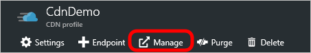

<properties
    pageTitle="Azure CDN erweiterte HTTP-Berichte | Microsoft Azure"
    description="Erweiterte HTTP-Berichte in Microsoft Azure CDN. Diese Berichte enthalten ausführlichen Informationen zum CDN Aktivität."
    services="cdn"
    documentationCenter=""
    authors="camsoper"
    manager="erikre"
    editor=""/>

<tags
    ms.service="cdn"
    ms.workload="tbd"
    ms.tgt_pltfrm="na"
    ms.devlang="na"
    ms.topic="article"
    ms.date="07/28/2016"
    ms.author="casoper"/>

# Erweiterte HTTP-Berichte in Microsoft Azure CDN

## (Übersicht)

Dieses Dokument erläutert erweiterte HTTP-Berichte in Microsoft Azure CDN. Diese Berichte enthalten ausführlichen Informationen zum CDN Aktivität.

[AZURE.INCLUDE [cdn-premium-feature](../../includes/cdn-premium-feature.md)]

## Zugreifen auf erweiterte HTTP-Berichte

1. Klicken Sie aus dem CDN Profil Blade auf die Schaltfläche **Verwalten** .

    

    Verwaltungsportal CDN wird geöffnet.

2. Zeigen Sie auf der Registerkarte **Analytics** , und zeigen Sie auf die Flyout **Erweiterte HTTP-Berichte** .  Klicken Sie auf die **große HTTP-Plattform**.

    

    Berichtsoptionen werden angezeigt.

## Geography-Berichte (kartenbasierten)

Es gibt fünf Berichte, die Vorteile von einer Karte, um die Regionen anzugeben, aus denen Ihre Inhalte angefordert wird. Diese Berichte sind World Map Karte Vereinigten Staaten, Kanada Karte, Europakarte und asiatisch-pazifischen Raum-Karte.

Jeder Bericht kartenbasierten Ränge geografischen Personen (d. h., Länder, Staaten und Bundesländer) entsprechend den Prozentsatz der Treffer, die von diesem Bereich stammen. Darüber hinaus wird ein Schema bereitgestellt, mit deren Hilfe Sie die jeweiligen Speicherorten Visualisieren von denen von Inhalten angeforderten. Es kann jeder Region nach Bedarf in diesem Bereich erfahrene Betrag farbcodieren vorgehen. Heller schattierte Bereiche anzugeben unteren Demand für den Inhalt, während der dunkleren höhere Demand für den Inhalt anzugeben.

Detaillierte Informationen den Datenverkehr und die Bandbreite für jede Region wird direkt unterhalb der Karte bereitgestellt. Hier können Sie die Gesamtzahl der Treffer, den Prozentsatz der Treffer, die Gesamtmenge Daten anzeigen (in Gigabyte) übertragen und der Prozentsatz der Daten für die einzelnen Regionen übertragen. Zeigt eine Beschreibung für jeden der folgenden Kriterien. Schließlich, wenn Sie auf einen Bereich (d. h., Land, Bundesland oder Kanton) zeigen, werden den Namen und den Prozentsatz der Treffer, die in der Region aufgetreten sind als QuickInfo angezeigt.

Eine kurze Beschreibung für jede kartenbasierten Geography Berichtstyp unten.

Berichtsname | Beschreibung
------------|------------
World Map | Mit diesem Bericht können Sie die weltweiten Demand für den Inhalt CDN anzeigen. Jedes Land ist farbcodiert, klicken Sie auf der Karte weltweit zu den Prozentsatz der Treffer angeben, die von diesem Bereich stammen.
Vereinigte Staaten Karte | Mit diesem Bericht können Sie den Bedarf für den CDN Inhalt in den Vereinigten Staaten anzeigen. Jeder Zustand ist farbcodiert auf diese Karte, um den Prozentsatz der Treffer angeben, die von diesem Bereich stammen.
Kanada Karte | Mit diesem Bericht können Sie den Bedarf für den Inhalt CDN in Kanada anzeigen. Jeder Kanton ist farbcodiert auf diese Karte, um den Prozentsatz der Treffer angeben, die von diesem Bereich stammen.
Europakarte | Mit diesem Bericht können Sie den Bedarf für den Inhalt CDN in Europa anzeigen. Jedes Land ist farbcodiert auf diese Karte, um den Prozentsatz der Treffer angeben, die von diesem Bereich stammen.
Asien – amerikanische Karte | Mit diesem Bericht können Sie den Bedarf für den Inhalt CDN in Asien anzeigen. Jedes Land ist farbcodiert auf diese Karte, um den Prozentsatz der Treffer angeben, die von diesem Bereich stammen.

## Geography-Berichte (Balkendiagramme)

Es gibt zwei weitere Berichte mit statistischen Daten nach Region die oberen Orten und oberen Länder sind. Diese Berichte Rangfolge Orten und Ländern, Hilfethemas entsprechend die Anzahl der Treffer, die von diesen Regionen stammen. In dieser Art von Bericht generieren von wird ein Balkendiagramm darauf hinzuweisen, die obersten 10 Orten oder Ländern, die Inhalte auf einer bestimmten Plattform angefordert. Dieses Balkendiagramm können Sie schnell die Regionen bewerten, die die höchste Anzahl von Besprechungsanfragen für den Inhalt zu generieren.

Die linke Seite des Diagramms (y-Achse) gibt an, wie viele Treffer in der angegebenen Region aufgetreten ist. Direkt unterhalb des Graphen (x-Achse) finden Sie eine Beschriftung für den Top 10-Regionen.

### Verwenden die Balkendiagramme

* Wenn Sie auf einen Balken zeigen, werden der Name und die Gesamtzahl der Treffer, die in der Region aufgetreten sind als QuickInfo angezeigt.
* Die QuickInfo für den Bericht Top Orte identifiziert ein Orts anhand des Namens, Bundesland/Kanton, und Land Abkürzung an.
* Wenn das Ort oder die Region (d. h., Bundesland/Kanton), von denen eine Anforderung stammt, nicht ermittelt werden kann, wird er darauf hinzuweisen, dass sie nicht bekannt sind. Wenn das Land unbekannt, und klicken Sie dann auf zwei Fragezeichen (d. h.)?? ist, wird angezeigt.
* Ein Bericht möglicherweise Kennzahlen für "Europa" oder "Asiatisch-pazifischen." enthalten. Diese Elemente sind nicht alle IP-Adressen in diesen Regionen statistische Informationen zur auffällt. Lieber, gelten sie nur für Besprechungsanfragen, die von IP-Adressen stammen, die auf Europa oder Afrika statt zu einer bestimmten Stadt oder Land verteilt sind.

Die Daten, die zum Generieren des Balkendiagramms verwendet wurde, können darunter angezeigt werden. Dort finden Sie die Gesamtzahl der Treffer, den Prozentsatz der Treffer, die Datenmenge übertragen (in Gigabyte) und der Prozentsatz der Daten für die Regionen oben 250 übertragen. Zeigt eine Beschreibung für jeden der folgenden Kriterien.

Eine kurze Beschreibung wird für beide Typen von Berichte unten bereitgestellt.

Berichtsname | Beschreibung
------------|------------
Top-Orte | Dieser Bericht bestimmt den Rang Orte entsprechend die Anzahl der Treffer, die stammt aus dieser Region.
Wichtigsten Länder | Dieser Bericht bestimmt den Rang Länder entsprechend die Anzahl der Treffer, die stammt aus dieser Region.

## Tägliche Zusammenfassung

Tägliche Zusammenfassung Bericht können Sie die Gesamtzahl der Zugriffe und über eine bestimmte Plattform täglich übertragene Daten anzeigen. Diese Informationen kann dazu verwendet werden, die CDN Aktivität Mustern schnell zu erkennen. Beispielsweise können Sie erkennen, welche Tage erfahrene höhere oder niedrigere als erwarteten Datenverkehr Bericht hilft.

Auf diese Art von Bericht generieren von wird ein Balkendiagramm einen visuellen Hinweis unter ', um die Menge des Plattform-spezifische Demand erfahrene täglich über den Zeitraum, die Werte im Bericht zur Verfügung. Dies wird durch einen Balken anzeigen, für jeden Tag im Bericht erfolgen. Beispielsweise den Zeitraum auswählen "Letzte Woche" aufgerufen wird ein Balkendiagramm mit sieben Balken generieren. Jeder Balken wird die Gesamtanzahl der Treffer an diesem Tag erfahrene anzugeben.

Die linke Seite des Diagramms (y-Achse) gibt an, wie viele Zugriffe auf das angegebene Datum aufgetreten ist. Direkt unterhalb des Graphen (x-Achse) finden Sie eine Beschriftung, der das Datum angibt (Format: JJJJ / MM / TT) für jeden Tag in den Bericht aufgenommen.

> [AZURE.TIP] Wenn Sie auf einen Balken zeigen, wird die Gesamtanzahl der Treffer, die zu diesem Zeitpunkt aufgetreten sind als QuickInfo angezeigt.

Die Daten, die zum Generieren des Balkendiagramms verwendet wurde, können darunter angezeigt werden. Es finden Sie die Gesamtzahl der Treffer und der Datenmenge (in GB) für jeden Tag Werte im Bericht.

## Pro Stunde

Der Bericht nach Stunde können Sie die Gesamtzahl der Zugriffe und über eine bestimmte Plattform stündlich übertragene Daten anzeigen. Diese Informationen kann dazu verwendet werden, die CDN Aktivität Mustern schnell zu erkennen. Beispielsweise kann Bericht hilft Ihnen die Zeiträume während des Tages erkennen, die höher oder niedriger als erwartet den Datenverkehr auf.

In dieser Art von Bericht generieren von wird ein Balkendiagramm einen visuellen Hinweis unter ', um die Menge des Plattform-spezifische Demand erfahrener stündlich über den Zeitraum, die Werte im Bericht enthalten. Dies wird durch einen Balken für jede Stunde, die Werte im Bericht anzeigen erfolgen. Angenommen, auswählen von 24 Stunden Zeitraum ein Balkendiagramm mit Balken 24 generiert. Jeder Balken wird die Gesamtanzahl der Treffer in dieser Stunde erfahrene anzugeben.

Die linke Seite des Diagramms (y-Achse) gibt an, wie viele Treffer für die angegebene Stunde aufgetreten ist. Direkt unterhalb des Graphen (x-Achse) finden Sie eine Beschriftung, der die Uhrzeit angibt (Format: JJJJ / MM / TT HH: mm) für jede Stunde in den Bericht aufgenommen. Zeit gemeldet mit 24-Stunden-Format, und es wird angegeben, mit der UTC/UTC-Zeitzone.

> [AZURE.TIP] Wenn Sie auf einen Balken zeigen, wird die Gesamtanzahl der Treffer, die in dieser Stunde aufgetreten sind als QuickInfo angezeigt.

Die Daten, die zum Generieren des Balkendiagramms verwendet wurde, können darunter angezeigt werden. Es finden Sie die Gesamtzahl der Treffer und der Datenmenge (in GB) für jede Stunde, die Werte im Bericht.

## Nach der Datei

Der Bericht nach Datei können Sie die Menge des Demand und den Datenverkehr über eine bestimmte Plattform für die am häufigsten angeforderten Anlagen tatsächlich anzeigen. In dieser Art von Bericht generieren von wird ein Balkendiagramm über den angegebenen Zeitraum auf die obersten 10 am häufigsten angeforderten Ressourcen generiert.

> [AZURE.NOTE] Im Sinne dieses Berichts werden Kante CNAME-URLs auf ihre entspricht CDN URLs konvertiert. Dadurch wird eine genaue Ergebnisses für die Gesamtzahl der Treffer im Zusammenhang mit einer Anlage unabhängig von der CDN oder Kante CNAME-URL verwendet, um es anfordern.

Die linke Seite des Diagramms (y-Achse) gibt die Anzahl der Anfragen für jedes Objekt über den angegebenen Zeitraum an. Direkt unterhalb des Diagramms (x-Achse) finden Sie folgende Angaben eine Beschriftung, die den Dateinamen für die für die obersten 10 angeforderten Ressourcen angibt.

Die Daten, die zum Generieren des Balkendiagramms verwendet wurde, können darunter angezeigt werden. Dort finden Sie die folgende Informationen für jede der obersten 250 angeforderten Anlagen: relativen Pfad, die Gesamtzahl der Treffer, den Prozentsatz der Treffer, die Datenmenge übertragen (in Gigabyte) und der Prozentsatz der Daten zu übertragen.

## Nach Datei Detail

Die von Datei-Detailbericht können Sie die Menge des Demand und den Datenverkehr über eine bestimmte Plattform für eine bestimmte Anlage tatsächlich anzeigen. Ganz oben Berichtsschema wird über die Option Datei Details für. Diese Option bietet eine Liste der am häufigsten angeforderten Datenbestände auf die ausgewählte Plattform. Um einen Bericht nach Datei Details zu erstellen, müssen Sie wählen Sie die Option Datei Details für das gewünschte Objekt. Nach dem ein Balkendiagramms wird die Menge des täglichen Bedarf, die sie über den angegebenen Zeitraum generiert anzugeben.

Die linke Seite des Diagramms (y-Achse) zeigt die Gesamtzahl der Besprechungsanfragen, dass eine Anlage an einem bestimmten Tag erfahrener an. Direkt unterhalb des Graphen (x-Achse) finden Sie eine Beschriftung, der das Datum angibt (Format: JJJJ / MM / TT) für welche CDN Demand für die Anlage gemeldet wurde.

Die Daten, die zum Generieren des Balkendiagramms verwendet wurde, können darunter angezeigt werden. Es finden Sie die Gesamtzahl der Treffer und der Datenmenge (in GB) für jeden Tag Werte im Bericht.

## Nach Dateityp

Der Bericht nach Dateityp können Sie die Menge des Demand und den Datenverkehr nach Dateityp tatsächlich anzeigen. Bei dieser Art von Bericht generieren von wird Ringdiagramm den Prozentsatz, der von den Top 10-Dateitypen generierte Treffer anzugeben.

> [AZURE.TIP] Wenn Sie auf ein Segment des Diagramms Ring-zeigen, geben Sie im Internetmedien von die Dateityp als QuickInfo angezeigt wird.

Die Daten, die zum Generieren des Diagramms Ring-verwendet wurde, können darunter angezeigt werden. Es findet den Dateityp Namen Erweiterung/Internet Medien, die Gesamtzahl der Treffer, den Prozentsatz der Treffer, die Datenmenge übertragen (in Gigabyte) und der Prozentsatz der Daten für jede der oben 250 Dateitypen übertragen.

## Vom Verzeichnis

Der Bericht nach Verzeichnis können Sie die Menge des Demand und den Datenverkehr über eine bestimmte Plattform für Inhalte von einem bestimmten Verzeichnis tatsächlich anzeigen. In dieser Art von Bericht generieren von wird ein Balkendiagramm die Gesamtzahl der Treffer von Inhalt in den Top 10 Verzeichnissen generiert anzugeben.

### Verwenden Sie im Balkendiagramm

* Zeigen Sie auf einen Balken den relativen Pfad zu dem entsprechenden Verzeichnis anzeigen.
* Inhalt in einem Unterordner eines Verzeichnisses gespeichert werden nicht gezählt werden, bei der Berechnung bei Bedarf vom Verzeichnis. Diese Berechnung basiert ausschließlich auf die Anzahl der Anfragen generiert für Inhalte, die im aktuellen Verzeichnis gespeichert.
* Im Sinne dieses Berichts werden Kante CNAME-URLs auf ihre entspricht CDN URLs konvertiert. Dadurch wird eine genaue Übereinstimmung für alle Statistiken im Zusammenhang mit einer Anlage unabhängig von der CDN oder Kante CNAME-URL verwendet, um es anfordern.

Die linke Seite des Diagramms (y-Achse) zeigt an, die Gesamtzahl der Anfragen für den Inhalt in den Top 10-Verzeichnissen gespeichert. Jeder Balken im Diagramm steht für ein Verzeichnis. Color-coding Schema, um einen Balken in ein Verzeichnis im Abschnitt oben 250 vollständige Verzeichnisse aufgeführt abzugleichen verwendet.

Die Daten, die zum Generieren des Balkendiagramms verwendet wurde, können darunter angezeigt werden. Dort finden Sie die folgende Informationen für jede der oben 250 Verzeichnisse: relativen Pfad, die Gesamtzahl der Treffer, den Prozentsatz der Treffer, die Datenmenge übertragen (in Gigabyte) und der Prozentsatz der Daten zu übertragen.

## Vom Browser

Der Bericht nach Browser können Sie anzeigen, welche Browser zum Anfordern Inhalts verwendet wurden. In dieser Art von Bericht generieren von wird ein Kreisdiagramm der Prozentwert der Anfragen behandelt, indem die obersten 10 Browser anzugeben.

### Verwenden das Kreisdiagramm

* Zeigen Sie auf ein Segment in das Kreisdiagramm Name und Version des Browsers anzeigen.
* Im Sinne dieses Berichts wird jede eindeutige Browserversion Kombination ein anderen Browsers angesehen.
* Das Segment namens "Andere" zeigt an, der Prozentwert der Anfragen von anderen Browser und Versionen bearbeitet werden.

Die Daten, die zum Generieren des Kreisdiagramms verwendet wurde, können darunter angezeigt werden. Es finden Sie im Browser Typ/Versionsnummer, die Gesamtzahl der Treffer und den Prozentsatz der Treffer für jede der oben 250 Browser.

## Durch Referenz

Der Bericht nach Referenz können Sie die häufigste Verweise auf Inhalte auf die ausgewählte Plattform aufgerufen. Eine Referenz gibt an, der Hostname aus der eine Anforderung generiert wurde. Bei dieser Art von Bericht generieren von wird ein Balkendiagramm der Demand (d. h., Treffer), die auf der obersten 10 Verweise hinweisen.

Die linke Seite des Diagramms (y-Achse) zeigt die Gesamtzahl der Besprechungsanfragen, ein Wirtschaftsguts für jede Referenz Erfahrener an. Jeder Balken im Diagramm steht für eine Referenz. Verwenden der color-coding des Farbschemas Zuordnen einer Leiste, um eine Referenz im Abschnitt oben 250 Referenz aufgeführt.

Die Daten, die zum Generieren des Balkendiagramms verwendet wurde, können darunter angezeigt werden. Dort finden Sie die URL, die Gesamtzahl der Treffer und den Prozentsatz der Treffer aus den einzelnen die häufigste 250 Verweise generiert.

## Zum Download

Herunterladen von diesem Bericht können Sie zum Download Muster für den am häufigsten angeforderten Inhalt zu analysieren. Den Anfang des Berichts enthält ein Balkendiagramm, vergleicht Downloads mit abgeschlossenen Downloads für die obersten 10 angeforderten Anlagen übermitteln. Jeder Balken ist farbcodiert nach, ob es sich um eine versuchten Download (Blau) oder einer abgeschlossenen Downloads (Grün) handelt.

> [AZURE.NOTE] Im Sinne dieses Berichts werden Kante CNAME-URLs auf ihre entspricht CDN URLs konvertiert. Dadurch wird eine genaue Übereinstimmung für alle Statistiken im Zusammenhang mit einer Anlage unabhängig von der CDN oder Kante CNAME-URL verwendet, um es anfordern.

Die linke Seite des Diagramms (y-Achse) zeigt den Dateinamen für jede der obersten 10 angeforderten Anlagen an. Direkt unterhalb des Graphen (x-Achse) finden Sie Etiketten, die die Gesamtzahl der Downloads versucht/abgeschlossen angeben.

Direkt unterhalb der Balkendiagramm, die folgende Informationen wird aufgeführt für die obersten 250 angeforderten Anlagen: relative Pfad (einschließlich Dateiname), die Anzahl der Fälle, in denen sie vollständig heruntergeladen wurde, wie oft die Anforderung wurde und den Prozentsatz der Besprechungsanfragen, die ein Download abgeschlossen geführt haben.

> [AZURE.TIP] Unsere CDN nicht von einem HTTP-Client (d. h. Browser) informiert Wenn eine Anlage vollständig heruntergeladen wurde. Daher müssen wir berechnen, ob eine Anlage nach Statuscodes und Byte-Bereich vollständig heruntergeladen wurde Serviceanfragen. Erstes wir bei der Berechnung ist, ob die Anforderung einer 200 OK Statuscode ergibt. In diesem Fall suchen wir bei Anfragen Byte-Bereich, um sicherzustellen, dass sie die gesamte Anlage bedecken. Schließlich Vergleichen wir die Menge der Daten auf die Größe der angeforderten Anlage übertragen. Wenn die übertragene Daten gleich oder größer als die Dateigröße ist, und die Byte-Bereich Anfragen eignen sich für die Anlage, wird als abgeschlossen Download der Treffer gezählt.
>
>Aufgrund der interpretive Natur dieses Berichts sollten Sie beachten Sie die folgenden Punkte behalten, die die Konsistenz und Genauigkeit Berichtsschema ändern können.
>
>* Muster im Datenverkehr können nicht präzise regressionsgleichung werden, wenn Benutzer-Agents anders verhalten. Dies kann abgeschlossenen Download-Ergebnissen führen, die größer als 100 sind %.
>* Anlagen, bei die HTTP schrittweisen herunterladen nutzen möglicherweise nicht präzise durch diesen Bericht dargestellt werden. Dies ist aufgrund von Benutzern auf eine andere Position in einem Video suchen.

## Durch 404-Fehlern

Der Bericht nach 404 Fehler können Sie den Typ des Inhalts zu identifizieren, die die meisten der 404 nicht gefunden Statuscodes generiert. Den Anfang des Berichts enthält ein Balkendiagramm für den Top 10-Anlagen für die 404 nicht gefunden Statuscode zurückgegeben wurde. Dieses Balkendiagramm vergleicht die Gesamtzahl der Besprechungsanfragen mit Anforderungen, die einen 404 nicht gefunden Statuscode für diese Vermögenswerte geführt haben. Jeder Balken ist farbcodiert. Eine gelbe Leiste wird verwendet, um anzugeben, dass die Anforderung einer 404 nicht gefunden Statuscode geführt haben. Ein roter Balken wird verwendet, um die Gesamtzahl der Besprechungsanfragen für die Anlage anzugeben.

> [AZURE.NOTE] Im Sinne dieses Berichts Beachten Sie Folgendes ein:
>
>* Ein Treffer stellt eine Anforderung für eine Anlage unabhängig von den Statuscode dar.
>* Kante CNAME-URLs werden in deren entspricht CDN URLs konvertiert. Dadurch wird eine genaue Übereinstimmung für alle Statistiken im Zusammenhang mit einer Anlage unabhängig von der CDN oder Kante CNAME-URL verwendet, um es anfordern.

Die linke Seite des Diagramms (y-Achse) zeigt den Dateinamen für die für die obersten 10 angeforderten Ressourcen, die einen 404 nicht gefunden Statuscode geführt haben an. Direkt unterhalb des Graphen (x-Achse) finden Sie Etiketten, die darauf hinweisen, die Gesamtzahl der Besprechungsanfragen und die Anzahl der Anfragen, die einen 404 nicht gefunden Statuscode geführt haben.

Direkt unterhalb der Balkendiagramm, die folgende Informationen wird aufgeführt für die obersten 250 angeforderten Anlagen: relative Pfad (einschließlich Dateiname), die Anzahl der Anfragen, die einen 404 nicht gefunden Statuscode geführt haben, die Gesamtzahl der Fälle, in denen die Anlage angefordert wurde und den Prozentsatz der Besprechungsanfragen, die einen 404 nicht gefunden Statuscode geführt haben.

## Siehe auch
* [Azure CDN (Übersicht)](cdn-overview.md)
* [In Echtzeit Stats in Microsoft Azure CDN](cdn-real-time-stats.md)
* [Verwendung der Regeln-Engine HTTP-Standardverhalten überschreiben](cdn-rules-engine.md)
* [Kante Leistungsanalyse](cdn-edge-performance.md)
