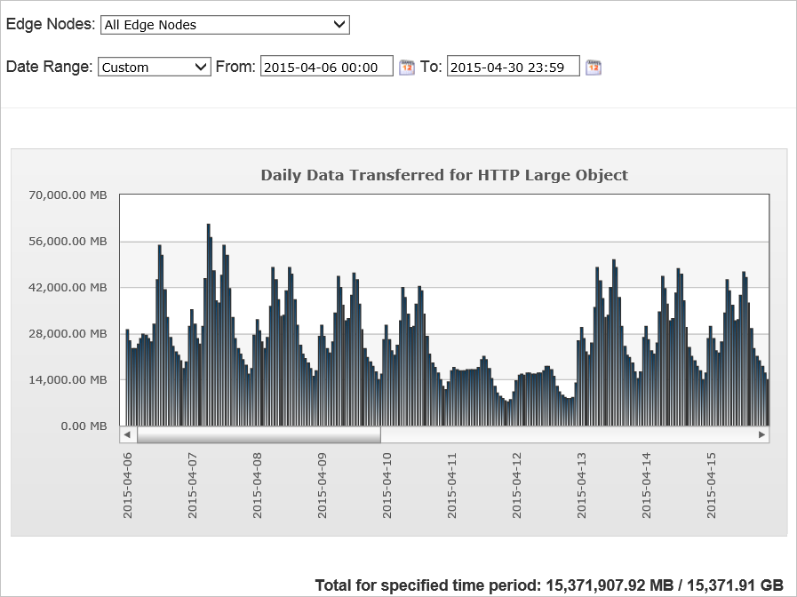
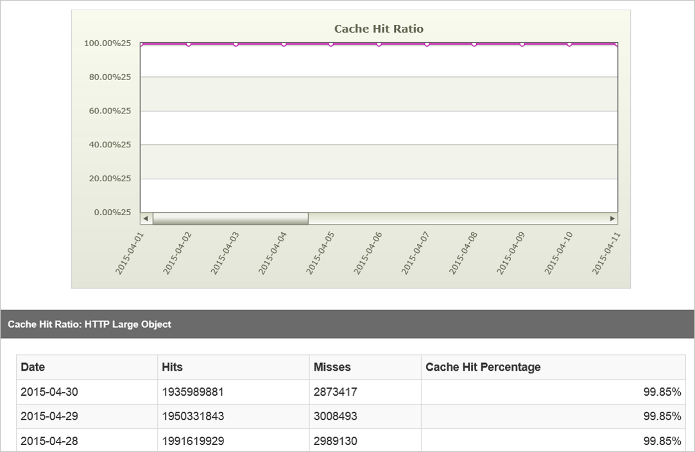

<properties
    pageTitle="Analysieren von Azure CDN Verwendungsmustern | Microsoft Azure"
    description="Sie können die Verwendungsmuster für Ihre CDN mithilfe der folgenden Berichte anzeigen: Bandbreite, Daten zu übertragen, Treffer, Cache Status, Cachetrefferquote, IPV4/IPV6 Daten übertragen."
    services="cdn"
    documentationCenter=""
    authors="camsoper"
    manager="erikre"
    editor=""/>

<tags
    ms.service="cdn"
    ms.workload="tbd"
    ms.tgt_pltfrm="na"
    ms.devlang="na"
    ms.topic="article"
    ms.date="07/28/2016"
    ms.author="casoper"/>

# Analysieren von Azure CDN Verwendungsmustern

[AZURE.INCLUDE [cdn-verizon-only](../../includes/cdn-verizon-only.md)]

Sie können Verwendungsmuster für Ihre CDN mithilfe der folgenden Berichte anzuzeigen:

- Bandbreite
- Übertragene Daten
- Treffer
- Cache Status
- Cache Treffer (Quote)
- Übertragene IPv4/IPv6-Daten

## Zugreifen auf erweiterte HTTP-Berichte

1. Klicken Sie aus dem CDN Profil Blade auf die Schaltfläche **Verwalten** .

    

    Verwaltungsportal CDN wird geöffnet.

2. Zeigen Sie auf der Registerkarte **Analytics** , und zeigen Sie auf die Flyout **Core Berichte** .  Klicken Sie auf den gewünschten Bericht im Menü.

    

## Bandbreite

Der Bericht Bandbreite besteht aus einer Tabelle Diagramm und die Daten, die die Verwendung der Bandbreite für HTTP und HTTPS über einen bestimmten Zeitraum angibt. Sie können die Bandbreite Verwendung über alle CDN anzeigen oder einen bestimmten POP anzeigen. So können Sie den Datenverkehr Spitzen und die Verteilung über CDN anzeigen, die Sie in der/s anzeigen.

- Wählt alle Kante Knoten finden Sie unter Verkehr aus allen Knoten, oder wählen Sie einen bestimmten Bereich/Knoten in der Dropdownliste aus.
- Wählen Sie Datumsbereich zum Anzeigen von Daten für heute/diese Woche/in diesem Monat usw. oder geben Sie benutzerdefinierte Daten, und klicken Sie auf "go", um sicherzustellen, dass Ihre Auswahl aktualisiert wird.
- Exportieren und Laden Sie die Daten durch Klicken auf das Excel-Arbeitsblatt-Symbol neben den Schaltflächen "Gehe zu".

Der Bericht wird alle 5 Minuten aktualisiert.

## Übertragene Daten

Dieser Bericht besteht aus einer Tabelle Diagramm und die Daten, die die Datenverkehrsverwendung für HTTP und HTTPS über einen bestimmten Zeitraum angibt. Sie können die Datenverkehrsverwendung über alle CDN anzeigen oder einen bestimmten POP anzeigen. So können Sie den Datenverkehr Spitzen und die Verteilung über CDN anzeigen, die Sie in GB anzeigen.

- Wählt alle Kante Knoten finden Sie unter Verkehr über alle Notizen ein, oder wählen Sie einen bestimmten Bereich/Knoten in der Dropdownliste aus.
- Wählen Sie Datumsbereich zum Anzeigen von Daten für heute/diese Woche/in diesem Monat usw. oder geben Sie benutzerdefinierte Daten, und klicken Sie auf "go", um sicherzustellen, dass Ihre Auswahl aktualisiert wird.
- Exportieren und Laden Sie die Daten durch Klicken auf das Excel-Arbeitsblatt-Symbol neben den Schaltflächen "Gehe zu".

Der Bericht wird alle 5 Minuten aktualisiert.

## Treffer (Statuscodes)

Dieser Bericht zeigt die Verteilung der Anfrage Statuscodes für den Inhalt. Jeder Anforderung nach Inhalten wird einen HTTP-Statuscode generieren. Der Statuscode beschreibt, wie Rand wird die Anforderung behandelt. Beispielsweise hinweisen 2xx Statuscodes an, dass die Anforderung erfolgreich an einen Client gesendet wurde, während ein 4xx-Code, der angibt, dass ein Fehler ist aufgetreten. Weitere Informationen zu HTTP-Statuscode finden Sie unter [Statuscodes](https://en.wikipedia.org/wiki/List_of_HTTP_status_codes).

- Wählen Sie Datumsbereich zum Anzeigen von Daten für heute/diese Woche/in diesem Monat usw. oder geben Sie benutzerdefinierte Daten, und klicken Sie auf "go", um sicherzustellen, dass Ihre Auswahl aktualisiert wird.
- Exportieren und Laden Sie die Daten durch Klicken auf das Excel-Blatt neben den Schaltflächen "OK".

## Cache Status

Dieser Bericht zeigt die Verteilung der Cachetreffer und für Clientanforderung-Cache-Fehler. Da-Cache-Treffer die schnellste Leistung kommen, können Sie Daten für die Übermittlung Geschwindigkeiten durch Minimieren-Cache-Fehler und abgelaufenen Cachetreffer optimieren. Cachefehler können durch Konfigurieren der Ausgangsserver zur Vermeidung von "No-Cache" Antwort-Header zuweisen, durch die Vermeidung Abfragezeichenfolge außer zwischenspeichern, wobei unbedingt erforderlich und durch die nicht zwischengespeichert werden Antwortcodes Vermeidung reduziert werden. Abgelaufene Cache, die Treffer vermieden werden können, indem Sie eine Anlage ist Max-Alter so lange wie möglich, um die Anzahl der Anfragen zu dem Ausgangsserver zu minimieren.

### Hauptfenster Cache Statuswerte:

- TCP_HIT: Served aus Rand. Das Objekt im Cache wurde und deren Max-Alter hatte nicht überschritten.
- TCP_MISS: Served aus Origin. Das Objekt wurde nicht im Cache und die Antwort zurück zur Origin wurde.
- TCP_EXPIRED _MISS: Served aus Origin nach dem erneuten mit Origin. Das Objekt im Cache wurde aber hatte seine Max-Alter überschritten. Eine erneute Validierung mit Origin geführt im Cache Objekt besetzt werden, indem Sie eine neue Antwort aus Origin.
- TCP_EXPIRED _HIT: Served aus Rand nach dem erneuten mit Origin. Das Objekt im Cache wurde aber hatte seine Max-Alter überschritten. Eine erneute Validierung mit dem Ausgangsserver geführt haben, in dem Cache-Objekt nicht geändert werden.

- Wählen Sie Datumsbereich zum Anzeigen von Daten für heute/diese Woche/in diesem Monat usw. oder geben Sie benutzerdefinierte Daten, und klicken Sie auf "go", um sicherzustellen, dass Ihre Auswahl aktualisiert wird.
- Exportieren und Laden Sie die Daten durch Klicken auf das Excel-Arbeitsblatt-Symbol neben den Schaltflächen "Gehe zu".

### Vollständige Liste der Cache Status

- TCP_HIT – dieser Status wird gemeldet, wenn eine Anforderung an den Client direkt von der POP bereitgestellt wird. Eine Anlage wird sofort aus einem POP-, wenn es auf der nächsten Desktopclient POP zwischengespeichert wird und verfügt über eine gültige Time to live oder TTL beantwortet. TTL wird durch die folgende Antwort Kopfzeilen bestimmt:

    - Cache-Control: s-maxage
    - Cache-Control: Max-ALTER
    - Läuft ab

- TCP_MISS - gibt diesen Status an, dass eine zwischengespeicherte Version der angeforderten Anlage klicken Sie auf der nächsten Desktopclient POP nicht gefunden wurde. Die Anlage wird bei entweder eine Ausgangsserver oder ein Schild Ausgangsserver anzufordern. Dem Ausgangsserver oder dem Schild Ausgangsserver ein Wirtschaftsguts zurück, wird er an den Kunden served und auf die Client- und die Kante zwischengespeichert. Andernfalls einen Statuscode nicht 200 (z. B. 403 Verboten, 404 nicht gefunden, usw.) zurückgegeben wird.

- TCP_EXPIRED _HIT – dieser Status wird gemeldet, wenn eine Anforderung, die an eine Anlage mit einer abgelaufenen TTL, z. B., wenn der Anlage Max-Alter abgelaufen ist, an den Client direkt von der POP bereitgestellt wurde.

    Eine Anforderung abgelaufene führt in der Regel eine erneute Validierung Anforderung auf dem Ausgangsserver. Damit ein TCP_EXPIRED _HIT ausgeführt werden kann muss der Ausgangsserver darauf hinzuweisen, dass eine neuere Version der Anlage nicht vorhanden ist. Diese Art von Situation wird in der Regel die Anlage Cache-Control und läuft ab Kopfzeilen aktualisiert.

- TCP_EXPIRED _MISS – dieser Status wird gemeldet, wenn eine neuere Version einer abgelaufenen Cache Anlage von dem POP an den Client bereitgestellt wird. Dies geschieht, wenn die Gültigkeitsdauer für eine Anlage Cache abgelaufen ist (z. B. Max-Alter abgelaufen) und dem Ausgangsserver gibt eine neuere Version diese Ressource. Diese neue Version der Anlage wird an den Client statt der Version aus dem Cache bereitgestellt werden. Darüber hinaus werden auf dem Server Kante und dem Client zwischengespeichert werden.

- CONFIG_NOCACHE - gibt diesen Status an, dass eine Kunden-spezifische-Konfiguration auf unsere Kante POP verhindert, dass die Anlage zwischengespeichert werden.

- KEINE - gibt diesen Status an, dass ein Cache Aktualität des Inhalts verbessert Häkchen nicht durchgeführt wurde.

- TCP_ CLIENT_REFRESH _MISS – dieser Status wird gemeldet, wenn ein HTTP-Client (z. B. Browser) eine Kante POP zum Abrufen von einer neuen Version einer veralteten Wirtschaftsguts aus dem Ausgangsserver erzwingt.

    Standardmäßig verhindern, dass unsere Server einen HTTP-Client erzwingen unsere Kante Server eine neue Version der Anlage aus dem Ausgangsserver abrufen.

- TCP_ PARTIAL_HIT – dieser Status wird gemeldet, wenn es sich bei der Anforderung einer Byte-Bereich ein Treffer für eine Anlage teilweise zwischengespeicherte ergibt. Der angeforderten Byte-Bereich wird sofort an den Kunden aus dem POP beantwortet.

- UNCACHEABLE - dieser Status gemeldet wird, wenn eine Anlage des Cache-Control und läuft ab Kopfzeilen darauf hinzuweisen, dass es nicht auf einen POP oder indem Sie den HTTP-Client zwischengespeichert werden soll. Diese Typen von Besprechungsanfragen werden aus dem Ausgangsserver bereitgestellt.

## Cache Treffer (Quote)

Dieser Bericht gibt an, der Prozentwert der Cache Anfragen, die direkt aus dem Cache bereitgestellt wurden.

Der Bericht umfasst die folgenden Details:

- Der angeforderte Inhalt wurde auf dem POP, enthaltenen am nächsten ist zwischengespeichert.
- Die Anforderung wurde direkt aus Rand unsere Netzwerks bereitgestellt.
- Die Anforderung war nicht mit dem Ausgangsserver erneuten erforderlich.

Der Bericht enthalten nicht:

- Besprechungsanfragen, die aufgrund von Filteroptionen Land verweigert werden.
- Anforderung von Anlagen, deren Kopfzeilen anzugeben, dass nicht zwischengespeichert werden soll. Beispielsweise Cache-Control: Private, Cache-Control: keine-Cache oder Pragma: keine-Cache-Header werden verhindert, dass eine Anlage zwischengespeichert.
- Byte Bereich fordert teilweise zwischengespeicherte Inhalt.

Die Formel lautet: (TCP_ TREFFER / (TCP_ TREFFER + TCP_MISS)) * 100

- Wählen Sie Datumsbereich zum Anzeigen von Daten für heute/diese Woche/in diesem Monat usw. oder geben Sie benutzerdefinierte Daten, und klicken Sie auf "go", um sicherzustellen, dass Ihre Auswahl aktualisiert wird.
- Exportieren und Laden Sie die Daten durch Klicken auf das Excel-Arbeitsblatt-Symbol neben den Schaltflächen "Gehe zu".

## Übertragen IPv4/IPv6-Daten

Dieser Bericht zeigt die Verteilung der Datenverkehr Verwendung in IPV4 im Vergleich mit einer IPV6.

- Wählen Sie zum Anzeigen von Daten für heute/diese Woche/in diesem Monat usw., oder geben Sie benutzerdefinierte Datumsangaben Datumsbereich ein.
- Klicken Sie dann auf "go", um sicherzustellen, dass Ihre Auswahl aktualisiert wird.

## Aspekte

Berichte können nur innerhalb der letzten 18 Monate generiert werden.
