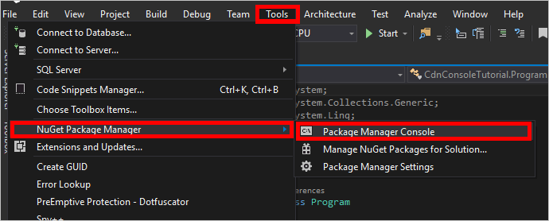

<properties
    pageTitle="Erste Schritte mit der Bibliothek Azure CDN für .NET | Microsoft Azure"
    description="Informationen Sie zum Verwalten von Azure CDN mit Visual Studio schreiben."
    services="cdn"
    documentationCenter=".net"
    authors="camsoper"
    manager="erikre"
    editor=""/>

<tags
    ms.service="cdn"
    ms.workload="tbd"
    ms.tgt_pltfrm="na"
    ms.devlang="na"
    ms.topic="article"
    ms.date="09/15/2016"
    ms.author="casoper"/>

# <a name="get-started-with-azure-cdn-development"></a>Erste Schritte mit Azure CDN Entwicklung

> [AZURE.SELECTOR]
- [Node.js](cdn-app-dev-node.md)
- [.NET](cdn-app-dev-net.md)

[Azure CDN Bibliothek für .NET](https://msdn.microsoft.com/library/mt657769.aspx) können Sie das Erstellen und Verwalten von Benutzerprofilen CDN und Endpunkten automatisieren.  Dieses Lernprogramm führt durch die Erstellung einer einfachen .NET Console-Anwendung, die unterschiedliche verfügbare Vorgänge veranschaulicht.  In diesem Lernprogramm kann nicht alle Aspekte der Bibliothek CDN Azure für .NET ausführlich zu beschreiben.

Sie benötigen Visual Studio 2015 zum Bearbeiten dieses Lernprogramms.  [Visual Studio Community 2015](https://www.visualstudio.com/products/visual-studio-community-vs.aspx) ist frei zum Download zur Verfügung.

> [AZURE.TIP] Das [Projekt aus diesem Lernprogramm abgeschlossen](https://code.msdn.microsoft.com/Azure-CDN-Management-1f2fba2c) ist zum Download auf MSDN zur Verfügung.

[AZURE.INCLUDE [cdn-app-dev-prep](../../includes/cdn-app-dev-prep.md)]

## <a name="create-your-project-and-add-nuget-packages"></a>Das Projekt erstellen und Hinzufügen von Nuget-Paketen

Jetzt, da wir eine Ressourcengruppe für unsere CDN Profile erstellt und unsere Azure AD-Anwendung über die Berechtigung zum Verwalten von Benutzerprofilen CDN und Endpunkte innerhalb dieser Gruppe angegeben haben, können wir beginnen, unsere Anwendung erstellen.

Klicken Sie in Visual Studio 2015, auf **Datei**, **neu**, **Projekt...** , um das Dialogfeld "Neues Projekt" zu öffnen.  Erweitern Sie **Visual c#**, und wählen Sie dann **Windows** im Bereich auf der linken Seite.  Klicken Sie im mittleren Bereich auf **Console-Anwendung** .  Benennen Sie Ihr Projekt, und klicken Sie auf **OK**.  


Unser Projekt soll einige Azure Bibliotheken in Nuget-Paketen enthaltene verwenden.  Fügen Sie Personen zum Projekt aus.

1. Klicken Sie auf die im Menü **Extras** , **Nuget-Paket-Manager**und dann auf **Paket-Manager-Konsole**.

    

2. Führen Sie in der Paket-Manager-Konsole zum Installieren der **Active Directory Authentifizierung Bibliothek (ADAL)**den folgenden Befehl aus:

    `Install-Package Microsoft.IdentityModel.Clients.ActiveDirectory`

3. Führen Sie vor, um die **Azure CDN Management-Bibliothek**zu installieren:

    `Install-Package Microsoft.Azure.Management.Cdn`

## <a name="directives-constants-main-method-and-helper-methods"></a>Richtlinien, Konstanten, main-Methode und Helper Methoden

Erfahren Sie die grundlegende Struktur des unserem Programm geschrieben.

1. Ersetzen Sie in der Registerkarte Program.cs wieder die `using` am Anfang der Seite mit den folgenden Richtlinien:

    ```csharp
    using System;
    using System.Collections.Generic;
    using Microsoft.Azure.Management.Cdn;
    using Microsoft.Azure.Management.Cdn.Models;
    using Microsoft.Azure.Management.Resources;
    using Microsoft.Azure.Management.Resources.Models;
    using Microsoft.IdentityModel.Clients.ActiveDirectory;
    using Microsoft.Rest;
    ```

2. Müssen wir einige Konstanten definieren unserer Methoden verwendeten.  In der `Program` Klasse, aber vor der `Main` Methode, fügen Sie den folgenden.  Achten Sie darauf, ersetzen Sie den Platzhalter, einschließlich der ** &lt;spitzen Klammern&gt;**, mit Ihren eigenen Werten nach Bedarf.

    ```csharp
    //Tenant app constants
    private const string clientID = "<YOUR CLIENT ID>";
    private const string clientSecret = "<YOUR CLIENT AUTHENTICATION KEY>"; //Only for service principals
    private const string authority = "https://login.microsoftonline.com/<YOUR TENANT ID>/<YOUR TENANT DOMAIN NAME>";

    //Application constants
    private const string subscriptionId = "<YOUR SUBSCRIPTION ID>";
    private const string profileName = "CdnConsoleApp";
    private const string endpointName = "<A UNIQUE NAME FOR YOUR CDN ENDPOINT>";
    private const string resourceGroupName = "CdnConsoleTutorial";
    private const string resourceLocation = "<YOUR PREFERRED AZURE LOCATION, SUCH AS Central US>";
    ```

3. Definieren Sie auch auf Klassen-, diese zwei Variablen ein.  Wir verwenden diese später, um festzustellen, ob unser Profil- und Endpunkt bereits vorhanden sein.

    ```csharp
    static bool profileAlreadyExists = false;
    static bool endpointAlreadyExists = false;
    ```

4.  Ersetzen der `Main` Methode wie folgt:

    ```csharp
    static void Main(string[] args)
    {
        //Get a token
        AuthenticationResult authResult = GetAccessToken();

        // Create CDN client
        CdnManagementClient cdn = new CdnManagementClient(new TokenCredentials(authResult.AccessToken))
            { SubscriptionId = subscriptionId };

        ListProfilesAndEndpoints(cdn);

        // Create CDN Profile
        CreateCdnProfile(cdn);

        // Create CDN Endpoint
        CreateCdnEndpoint(cdn);
        
        Console.WriteLine();

        // Purge CDN Endpoint
        PromptPurgeCdnEndpoint(cdn);

        // Delete CDN Endpoint
        PromptDeleteCdnEndpoint(cdn);

        // Delete CDN Profile
        PromptDeleteCdnProfile(cdn);

        Console.WriteLine("Press Enter to end program.");
        Console.ReadLine();
    }
    ```

5. Einige der anderen unserer Methoden werden jetzt auffordern, den Benutzer mit "Ja/Nein" Fragen.  Fügen Sie die folgende Methode, um die etwas erleichtern hinzu:

    ```csharp
    private static bool PromptUser(string Question)
    {
        Console.Write(Question + " (Y/N): ");
        var response = Console.ReadKey();
        Console.WriteLine();
        if (response.Key == ConsoleKey.Y)
        {
            return true;
        }
        else if (response.Key == ConsoleKey.N)
        {
            return false;
        }
        else
        {
            // They pressed something other than Y or N.  Let's ask them again.
            return PromptUser(Question);
        }
    }
    ```

Nachdem Sie nun die grundlegende Struktur des unserem Programm geschrieben ist, erstellen wir sollte die Methoden, indem Sie die `Main` Methode.

## <a name="authentication"></a>Authentifizierung

Bevor wir Azure CDN Management Bibliothek verwenden können, müssen wir unseren Dienst Tilgungsanteile authentifizieren und eine Authentifizierungstoken abrufen.  Diese Methode verwendet ADAL, um das Token abzurufen.

```csharp
private static AuthenticationResult GetAccessToken()
{
    AuthenticationContext authContext = new AuthenticationContext(authority); 
    ClientCredential credential = new ClientCredential(clientID, clientSecret);
    AuthenticationResult authResult = 
        authContext.AcquireTokenAsync("https://management.core.windows.net/", credential).Result;

    return authResult;
}
```

Wenn Sie einzelne Benutzerauthentifizierung, verwenden den `GetAccessToken` Methode wird etwas anders.

>[AZURE.IMPORTANT] Verwenden Sie in diesem Codebeispiel nur, wenn Sie kein Hauptbenutzer Dienst einzelne Benutzerauthentifizierung haben.

```csharp
private static AuthenticationResult GetAccessToken()
{
    AuthenticationContext authContext = new AuthenticationContext(authority);
    AuthenticationResult authResult = authContext.AcquireTokenAsync("https://management.core.windows.net/",
        clientID, new Uri("http://<redirect URI>"), new PlatformParameters(PromptBehavior.RefreshSession)).Result;

    return authResult;
}
```

Ersetzen Sie unbedingt `<redirect URI>` für die Umleitung URI, die Sie eingegeben haben, wenn Sie die Anwendung in Azure AD registriert.

## <a name="list-cdn-profiles-and-endpoints"></a>Liste CDN Profile und Endpunkte

Nun können wir CDN Vorgänge ausführen.  Erstes bedeutet unsere Methode ist der Liste alle Profile und Endpunkte in unseren Ressourcengruppe und findet keine Übereinstimmung für die Profil- und Endpunkt Namen, die in unseren Konstanten, angegeben macht notieren, die zur späteren, damit wir versuchen nicht, Duplikate zu erstellen.

```csharp
private static void ListProfilesAndEndpoints(CdnManagementClient cdn)
{
    // List all the CDN profiles in this resource group
    var profileList = cdn.Profiles.ListByResourceGroup(resourceGroupName);
    foreach (Profile p in profileList)
    {
        Console.WriteLine("CDN profile {0}", p.Name);
        if (p.Name.Equals(profileName, StringComparison.OrdinalIgnoreCase))
        {
            // Hey, that's the name of the CDN profile we want to create!
            profileAlreadyExists = true;
        }

        //List all the CDN endpoints on this CDN profile
        Console.WriteLine("Endpoints:");
        var endpointList = cdn.Endpoints.ListByProfile(p.Name, resourceGroupName);
        foreach (Endpoint e in endpointList)
        {
            Console.WriteLine("-{0} ({1})", e.Name, e.HostName);
            if (e.Name.Equals(endpointName, StringComparison.OrdinalIgnoreCase))
            {
                // The unique endpoint name already exists.
                endpointAlreadyExists = true;
            }
        }
        Console.WriteLine();
    }
}
```

## <a name="create-cdn-profiles-and-endpoints"></a>Erstellen von Profilen CDN und Endpunkte

Erstellen Sie dann ein Profil.

```csharp
private static void CreateCdnProfile(CdnManagementClient cdn)
{
    if (profileAlreadyExists)
    {
        Console.WriteLine("Profile {0} already exists.", profileName);
    }
    else
    {
        Console.WriteLine("Creating profile {0}.", profileName);
        ProfileCreateParameters profileParms =
            new ProfileCreateParameters() { Location = resourceLocation, Sku = new Sku(SkuName.StandardVerizon) };
        cdn.Profiles.Create(profileName, profileParms, resourceGroupName);
    }
}
```

Nachdem das Profil erstellt wurde, erstellen wir einen Endpunkt.

```csharp
private static void CreateCdnEndpoint(CdnManagementClient cdn)
{
    if (endpointAlreadyExists)
    {
        Console.WriteLine("Profile {0} already exists.", profileName);
    }
    else
    {
        Console.WriteLine("Creating endpoint {0} on profile {1}.", endpointName, profileName);
        EndpointCreateParameters endpointParms =
            new EndpointCreateParameters()
            {
                Origins = new List<DeepCreatedOrigin>() { new DeepCreatedOrigin("Contoso", "www.contoso.com") },
                IsHttpAllowed = true,
                IsHttpsAllowed = true,
                Location = resourceLocation
            };
        cdn.Endpoints.Create(endpointName, endpointParms, profileName, resourceGroupName);
    }
}
```

>[AZURE.NOTE] Im oben genannten Beispiel dem Endpunkt weist einen Ursprung mit dem Namen *' Contoso '* mit einem Hostnamen `www.contoso.com`.  Ändern Sie diese Option, um auf Ihre eigenen Ursprung der Hostname verweisen.

## <a name="purge-an-endpoint"></a>Löschen von außen liegenden Tabellenblättern

Unter der Voraussetzung, dass der Endpunkt erstellt wurde, wird eine allgemeine Aufgabe, die wir in unserem Programm ausführen möglicherweise den Inhalt in unseren Endpunkt aufräumen.

```csharp
private static void PromptPurgeCdnEndpoint(CdnManagementClient cdn)
{
    if (PromptUser(String.Format("Purge CDN endpoint {0}?", endpointName)))
    {
        Console.WriteLine("Purging endpoint. Please wait...");
        cdn.Endpoints.PurgeContent(endpointName, profileName, resourceGroupName, new List<string>() { "/*" });
        Console.WriteLine("Done.");
        Console.WriteLine();
    }
}
```

>[AZURE.NOTE] Im Beispiel oben, die Zeichenfolge `/*` gibt an, dass ich alles im Stammverzeichnis der den Endpunkt Pfad löschen möchten.  Dies entspricht dem Überprüfen der Azure-Portal "löschen" im Dialogfeld **Alle löschen** . In der `CreateCdnProfile` Methode erstellt unsere Profil als **Azure CDN von Verizon** Profil mithilfe des Codes `Sku = new Sku(SkuName.StandardVerizon)`, sodass diese hergestellt werden kann.  **Azure CDN von Akamai** Profile nicht unterstützen jedoch **Alle bereinigen**, wenn ich ein Profil Akamai in diesem Lernprogramm verwendet wurde, ich mich einschließen bestimmter Pfade zu löschen muss würde.

## <a name="delete-cdn-profiles-and-endpoints"></a>Löschen von Profilen CDN und Endpunkte

Die letzten Methoden werden unsere Endpunkt und Profil gelöscht.

```csharp
private static void PromptDeleteCdnEndpoint(CdnManagementClient cdn)
{
    if(PromptUser(String.Format("Delete CDN endpoint {0} on profile {1}?", endpointName, profileName)))
    {
        Console.WriteLine("Deleting endpoint. Please wait...");
        cdn.Endpoints.DeleteIfExists(endpointName, profileName, resourceGroupName);
        Console.WriteLine("Done.");
        Console.WriteLine();
    }
}

private static void PromptDeleteCdnProfile(CdnManagementClient cdn)
{
    if(PromptUser(String.Format("Delete CDN profile {0}?", profileName)))
    {
        Console.WriteLine("Deleting profile. Please wait...");
        cdn.Profiles.DeleteIfExists(profileName, resourceGroupName);
        Console.WriteLine("Done.");
        Console.WriteLine();
    }
}
```

## <a name="running-the-program"></a>Ausführen des Programms

Wir können jetzt kompilieren und führen Sie das Programm, indem Sie auf die Schaltfläche **Start** , klicken Sie in Visual Studio.


Wenn das Programm die oben genannten Aufforderung erreicht, sollten Sie möglicherweise, kehren Sie zu Ihrem Ressourcengruppe Azure-Portal zurück, und sehen, dass das Profil erstellt wurde.


Wir können dann die Anweisungen, führen Sie die restlichen das Programm bestätigen.


## <a name="next-steps"></a>Nächste Schritte

Das fertige Projekt aus dieser Anleitung erfahren Sie, [Laden Sie das Beispiel](https://code.msdn.microsoft.com/Azure-CDN-Management-1f2fba2c)sehen zu können.

Zeigen Sie zusätzliche Dokumentation für die Bibliothek Azure CDN Management für .NET finden Sie die [Referenz auf MSDN](https://msdn.microsoft.com/library/mt657769.aspx).

Verwalten von Ressourcen mit [PowerShell](./cdn-manage-powershell.md)CDN.


