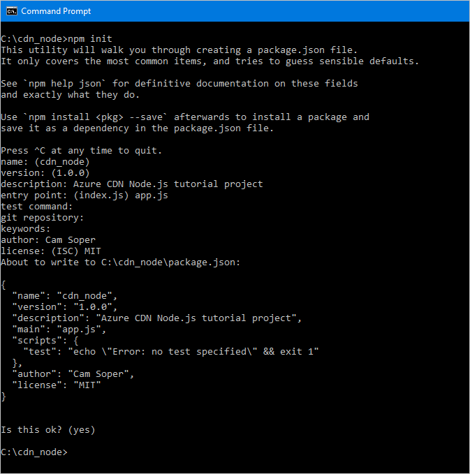
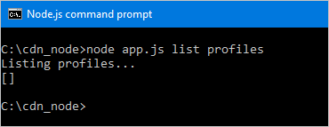

<properties
    pageTitle="Erste Schritte mit der Azure CDN SDK für Node.js | Microsoft Azure"
    description="Informationen Sie zum Schreiben von Node.js Applikationen Azure CDN verwalten."
    services="cdn"
    documentationCenter="nodejs"
    authors="camsoper"
    manager="erikre"
    editor=""/>

<tags
    ms.service="cdn"
    ms.workload="tbd"
    ms.tgt_pltfrm="na"
    ms.devlang="na"
    ms.topic="article"
    ms.date="09/15/2016"
    ms.author="casoper"/>

# <a name="get-started-with-azure-cdn-development"></a>Erste Schritte mit Azure CDN Entwicklung

> [AZURE.SELECTOR]
- [Node.js](cdn-app-dev-node.md)
- [.NET](cdn-app-dev-net.md)

Das [Azure CDN SDK für Node.js](https://www.npmjs.com/package/azure-arm-cdn) können Sie das Erstellen und Verwalten von Benutzerprofilen CDN und Endpunkten automatisieren.  Dieses Lernprogramm führt durch die Erstellung einer einfachen Node.js Console-Anwendung, die unterschiedliche verfügbare Vorgänge veranschaulicht.  In diesem Lernprogramm kann nicht alle Aspekte des Azure CDN SDK für Node.js ausführlich zu beschreiben.

Damit dieses Lernprogramm abgeschlossen, sollten Sie bereits [Node.js](http://www.nodejs.org) **4.x.x** oder höher installiert und konfiguriert haben.  Sie können einen beliebigen Texteditor für eine Anwendung Node.js erstellen möchten.  Um dieses Lernprogramm zu schreiben, verwendet habe ich [Visual Studio-Code](https://code.visualstudio.com).  

> [AZURE.TIP] Das [Projekt aus diesem Lernprogramm abgeschlossen](https://code.msdn.microsoft.com/Azure-CDN-SDK-for-Nodejs-c712bc74) ist zum Download auf MSDN zur Verfügung.

[AZURE.INCLUDE [cdn-app-dev-prep](../../includes/cdn-app-dev-prep.md)]

## <a name="create-your-project-and-add-npm-dependencies"></a>Erstellen Sie Ihr Projekt und fügen NPM Abhängigkeiten hinzu

Jetzt, da wir eine Ressourcengruppe für unsere CDN Profile erstellt und unsere Azure AD-Anwendung über die Berechtigung zum Verwalten von Benutzerprofilen CDN und Endpunkte innerhalb dieser Gruppe angegeben haben, können wir beginnen, unsere Anwendung erstellen.

Erstellen Sie einen Ordner zum Speichern Ihrer Anwendungs.  Eine Konsole mit den Tools Node.js in Ihrem aktuellen Pfad legen Sie Ihren aktuellen Standort in diesen neuen Ordner, und Initialisierung Ihres Projekts durch ausführen:
    
    npm init
    
Es wird dann eine Reihe von Fragen Initialisierung Ihres Projekts angezeigt.  Für den **Eintrag zeigen**wird in diesem Lernprogramm *app.js*verwendet.  Sie können meinen anderen Optionen im folgenden Beispiel sehen.



Unser Projekt ist nun mit einer Datei *packages.json* Initialisierung.  Unser Projekt soll einige Azure Bibliotheken in NPM Paketen enthaltene verwenden.  Wir verwenden die Azure Client Runtime für Node.js (ms Rest Azure) und der Bibliothek Azure CDN Client für Node.js (Azure-Cloud-cd).  Fügen Sie diese zum Projekt uns als Abhängigkeiten hinzu.
 
    npm install --save ms-rest-azure
    npm install --save azure-arm-cdn

Nachdem die Pakete fertig sind sollte eine Installation, die *package.json* Datei Aussehen ähnlich wie in diesem Beispiel (Version Zahlen unterscheiden sich möglicherweise):

``` json
{
  "name": "cdn_node",
  "version": "1.0.0",
  "description": "Azure CDN Node.js tutorial project",
  "main": "app.js",
  "scripts": {
    "test": "echo \"Error: no test specified\" && exit 1"
  },
  "author": "Cam Soper",
  "license": "MIT",
  "dependencies": {
    "azure-arm-cdn": "^0.2.1",
    "ms-rest-azure": "^1.14.4"
  }
}
```

Schließlich mithilfe des Text-Editors, eine leere Textdatei erstellen und speichern im Stammordner unserer Projekt als *app.js*.  Wir nun können zum Schreiben von Code zu beginnen.

## <a name="requires-constants-authentication-and-structure"></a>Erfordert, Konstanten, Authentifizierung und Struktur

Bei Sie unseren-Editor öffnen die aus *app.js* erhalten wir die grundlegende Struktur des unserem Programm geschrieben haben.

1. Fügen Sie die "erfordert" für unsere NPM-Paketen oben mit folgenden hinzu:

    ``` javascript
    var msRestAzure = require('ms-rest-azure');
    var cdnManagementClient = require('azure-arm-cdn');
    ```

2. Müssen wir einige Konstanten definieren unserer Methoden verwendeten.  Fügen Sie Folgendes hinzu.  Achten Sie darauf, ersetzen Sie den Platzhalter, einschließlich der ** &lt;spitzen Klammern&gt;**, mit Ihren eigenen Werten nach Bedarf.

    ``` javascript
    //Tenant app constants
    const clientId = "<YOUR CLIENT ID>";
    const clientSecret = "<YOUR CLIENT AUTHENTICATION KEY>"; //Only for service principals
    const tenantId = "<YOUR TENANT ID>";

    //Application constants
    const subscriptionId = "<YOUR SUBSCRIPTION ID>";
    const resourceGroupName = "CdnConsoleTutorial";
    const resourceLocation = "<YOUR PREFERRED AZURE LOCATION, SUCH AS Central US>";
    ```

3. Als Nächstes wir instanziieren den CDN Management-Client und probieren Sie es mit unseren Anmeldeinformationen.

    ``` javascript
    var credentials = new msRestAzure.ApplicationTokenCredentials(clientId, tenantId, clientSecret);
    var cdnClient = new cdnManagementClient(credentials, subscriptionId);
    ```
    
    Wenn Sie einzelne Benutzerauthentifizierung verwenden, werden diese beiden Zeilen etwas anders aussehen.

    >[AZURE.IMPORTANT] Verwenden Sie in diesem Codebeispiel nur, wenn Sie kein Hauptbenutzer Dienst einzelne Benutzerauthentifizierung haben.  Achten Sie darauf, dass Ihre Anmeldeinformationen für einzelne Benutzer schützen und geheim halten.

    ``` javascript
    var credentials = new msRestAzure.UserTokenCredentials(clientId, 
        tenantId, '<username>', '<password>', '<redirect URI>');
    var cdnClient = new cdnManagementClient(credentials, subscriptionId);
    ```

    Achten Sie darauf, ersetzen Sie die Elemente in der ** &lt;spitzen Klammern&gt; ** mit den richtigen Informationen.  Für `<redirect URI>`, verwenden Sie die Umleitung URI, die Sie eingegeben haben, wenn Sie die Anwendung in Azure AD registriert.
    

4.  Unsere Node.js Console-Anwendung wird jetzt einige Befehlszeilenparameter durchgeführt.  Lassen Sie uns überprüfen, dass mindestens ein Parameter übergeben wurde.

    ```javascript
    //Collect command-line parameters
    var parms = process.argv.slice(2);

    //Do we have parameters?
    if(parms == null || parms.length == 0)
    {
        console.log("Not enough parameters!");
        console.log("Valid commands are list, delete, create, and purge.");
        process.exit(1);
    }
    ```

5. Die gelangen Sie zum Hauptteil unserem Programm, wo wir Verzweigung zu anderen Funktionen basierend auf welche Parameter übergeben wurden.

    ```javascript
    switch(parms[0].toLowerCase())
    {
        case "list":
            cdnList();
            break;

        case "create":
            cdnCreate();
            break;
        
        case "delete":
            cdnDelete();
            break;

        case "purge":
            cdnPurge();
            break;

        default:
            console.log("Valid commands are list, delete, create, and purge.");
            process.exit(1);
    }
    ```

6.  An mehreren Stellen in unserem Programm müssen wir stellen Sie sicher, die richtige Anzahl von Parametern übergeben wurden, und einige Hilfe anzeigen, wenn er nicht richtig aussehen.  Erstellen Sie uns Funktionen zum erledigen.

    ```javascript
    function requireParms(parmCount) {
        if(parms.length < parmCount) {
            usageHelp(parms[0].toLowerCase());
            process.exit(1);
        }
    }

    function usageHelp(cmd) {
        console.log("Usage for " + cmd + ":");
        switch(cmd)
        {
            case "list":
                console.log("list profiles");
                console.log("list endpoints <profile name>");
                break;

            case "create":
                console.log("create profile <profile name>");
                console.log("create endpoint <profile name> <endpoint name> <origin hostname>");
                break;
            
            case "delete":
                console.log("delete profile <profile name>");
                console.log("delete endpoint <profile name> <endpoint name>");
                break;

            case "purge":
                console.log("purge <profile name> <endpoint name> <path>");
                break;

            default:
                console.log("Invalid command.");
        }
    }
    ```

7. Schließlich sind die Funktionen, die wir auf dem CDN Management Client verwenden möchten asynchrone, benötigen Sie eine Methode zum zurückzurufen, wenn sie fertig sind.  Erstellen Sie einfach eine, die die Ausgabe der CDN Management-Client (falls vorhanden) anzeigen können, und beenden das Programm ordnungsgemäß.

    ```javascript
    function callback(err, result, request, response) {
        if (err) {
            console.log(err);
            process.exit(1);
        } else {
            console.log((result == null) ? "Done!" : result);
            process.exit(0);
        }
    }
    ```

Nachdem Sie nun die grundlegende Struktur des unserem Programm geschrieben ist, sollten wir die Funktionen aufgerufen basierend auf unsere Parameter erstellen.

## <a name="list-cdn-profiles-and-endpoints"></a>Liste CDN Profile und Endpunkte

Beginnen wir mit Code werden unsere vorhandene Profile und Endpunkte aufgelistet.  Meine Codekommentare die erwartete Syntax bereitgestellt werden, damit wir wissen, wo jedem Parameter geht.

```javascript
// list profiles
// list endpoints <profile name>
function cdnList(){
    requireParms(2);
    switch(parms[1].toLowerCase())
    {
        case "profiles":
            console.log("Listing profiles...");
            cdnClient.profiles.listByResourceGroup(resourceGroupName, callback);
            break;

        case "endpoints":
            requireParms(3);
            console.log("Listing endpoints...");
            cdnClient.endpoints.listByProfile(parms[2], resourceGroupName, callback);
            break;

        default:
            console.log("Invalid parameter.");
            process.exit(1);
    }
}
```

## <a name="create-cdn-profiles-and-endpoints"></a>Erstellen von Profilen CDN und Endpunkte

Schreiben Sie als Nächstes die Funktionen zum Erstellen von Benutzerprofilen und Endpunkte.

```javascript
function cdnCreate() {
    requireParms(2);
    switch(parms[1].toLowerCase())
    {
        case "profile":
            cdnCreateProfile();
            break;

        case "endpoint":
            cdnCreateEndpoint();
            break;

        default:
            console.log("Invalid parameter.");
            process.exit(1);
    }
}

// create profile <profile name>
function cdnCreateProfile() {
    requireParms(3);
    console.log("Creating profile...");
    var standardCreateParameters = {
        location: resourceLocation,
        sku: {
            name: 'Standard_Verizon'
        }
    };

    cdnClient.profiles.create(parms[2], standardCreateParameters, resourceGroupName, callback);
}

// create endpoint <profile name> <endpoint name> <origin hostname>        
function cdnCreateEndpoint() {
    requireParms(5);
    console.log("Creating endpoint...");
    var endpointProperties = {
        location: resourceLocation,
        origins: [{
            name: parms[4],
            hostName: parms[4]
        }]
    };

    cdnClient.endpoints.create(parms[3], endpointProperties, parms[2], resourceGroupName, callback);
}
```

## <a name="purge-an-endpoint"></a>Löschen von außen liegenden Tabellenblättern

Unter der Voraussetzung, dass der Endpunkt erstellt wurde, wird eine allgemeine Aufgabe, die wir in unserem Programm ausführen möglicherweise Inhalte in unseren Endpunkt aufräumen.

```javascript
// purge <profile name> <endpoint name> <path>
function cdnPurge() {
    requireParms(4);
    console.log("Purging endpoint...");
    var purgeContentPaths = [ parms[3] ];
    cdnClient.endpoints.purgeContent(parms[2], parms[1], resourceGroupName, purgeContentPaths, callback);
}
```

## <a name="delete-cdn-profiles-and-endpoints"></a>Löschen von Profilen CDN und Endpunkte

Die letzte Funktion, die wir enthalten sein sollen, löscht Endpunkte und Profile.

```javascript
function cdnDelete() {
    requireParms(2);
    switch(parms[1].toLowerCase())
    {
        // delete profile <profile name>
        case "profile":
            requireParms(3);
            console.log("Deleting profile...");
            cdnClient.profiles.deleteIfExists(parms[2], resourceGroupName, callback);
            break;

        // delete endpoint <profile name> <endpoint name>
        case "endpoint":
            requireParms(4);
            console.log("Deleting endpoint...");
            cdnClient.endpoints.deleteIfExists(parms[3], parms[2], resourceGroupName, callback);
            break;

        default:
            console.log("Invalid parameter.");
            process.exit(1);
    }
}
```

## <a name="running-the-program"></a>Ausführen des Programms

Wir können jetzt unsere Node.js Programm mit unserer bevorzugten Debugger ausführen oder bei der Verwaltungskonsole.

> [AZURE.TIP] Wenn Sie Visual Studio-Code als Ihren Debugger verwenden, müssen Sie Ihre Umgebung einzurichten, um die Befehlszeilenparameter zu übergeben.  Visual Studio-Code führt dies in der Datei **lanuch.json** .  Suchen Sie nach einer Eigenschaft mit dem Namen **Args** und ein Array von Zeichenfolgenwerten für Ihre Parameter, hinzufügen, damit es sieht ungefähr wie folgt aus: `"args": ["list", "profiles"]`.

Beginnen wir mit unseren Profile aufgelistet.



Wir rufen Sie ein leeres Array wieder ab.  Da wir in unseren Ressourcengruppe Profile besitzen, wird die erwartet.  Lassen Sie uns jetzt ein Profil erstellen.


Jetzt, fügen Sie einen Endpunkt wir hinzu.


Löschen Sie schließlich wir unsere Profil.


## <a name="next-steps"></a>Nächste Schritte

Das fertige Projekt aus dieser Anleitung erfahren Sie, [Laden Sie das Beispiel](https://code.msdn.microsoft.com/Azure-CDN-SDK-for-Nodejs-c712bc74)sehen zu können.

Um den Bezug für das Azure CDN SDK für Node.js angezeigt wird, zeigen Sie den [Bezug](http://azure.github.io/azure-sdk-for-node/azure-arm-cdn/latest/)aus.

Zeigen Sie um zusätzliche Dokumentation auf dem Azure SDK für Node.js finden Sie die [vollständigen Verweis](http://azure.github.io/azure-sdk-for-node/)ein.

Verwalten von Ressourcen mit [PowerShell](./cdn-manage-powershell.md)CDN.

