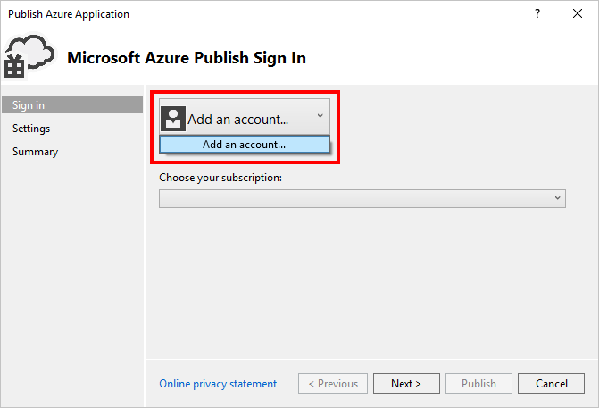
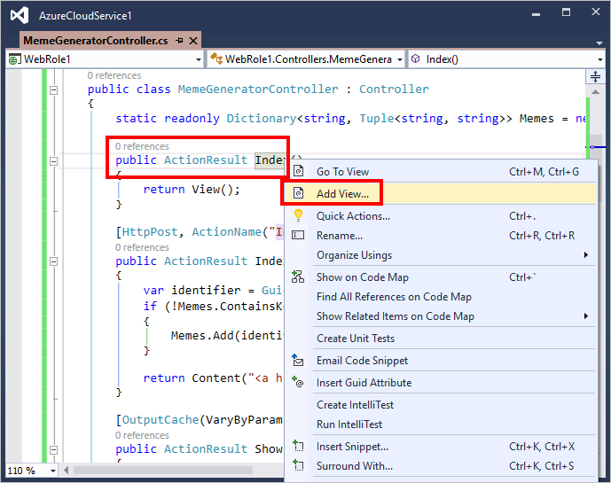

<properties
    pageTitle="Integrieren von einem Cloud-Dienst mit Azure CDN | Microsoft Azure"
    description="Ein Lernprogramm, die Sie, wie einen Clouddienst bereitgestellt, der Inhalte aus einem integrierten Azure CDN Endpunkt dient zum Erstellen"
    services="cdn, cloud-services"
    documentationCenter=".net"
    authors="camsoper"
    manager="erikre"
    editor="tysonn"/>

<tags
    ms.service="cdn"
    ms.workload="tbd"
    ms.tgt_pltfrm="na"
    ms.devlang="dotnet"
    ms.topic="article"
    ms.date="07/28/2016"
    ms.author="casoper"/>

# Integrieren von einem Cloud-Dienst mit Azure CDN

Cloud-Dienst kann mit Azure CDN, alle Inhalte aus der Cloud-Dienst Speicherort integriert werden. Dieser Ansatz gibt Ihnen die folgenden Vorteile:

- Einfache Bereitstellung und Aktualisieren von Bildern, Skripts und Stylesheets in der Cloud-Dienst Projekt Verzeichnisse durchsuchen
- Einfaches upgrade NuGet-Pakete in der Cloud-Dienst, wie z. B. jQuery oder Bootstrap Versionen
- Verwalten Sie Ihrer Web-Anwendung und Ihre CDN served Inhalt alle über die gleiche Visual Studio-Oberfläche
- Unified Bereitstellungsworkflow für die Web-Anwendung und Ihre Inhalte CDN served
- Integrieren von ASP.NET bündeln und Skriptladeprogrammen mit Azure CDN

## Erfahren Sie ##

In diesem Lernprogramm erfahren Sie, wie:

-   [Integrieren Sie einen Endpunkt Azure CDN mit der Cloud-Dienst und bedienen Sie statischen Inhalt in Ihren Webseiten aus Azure CDN](#deploy)
-   [Konfigurieren von Einstellungen des Caches für statischen Inhalt in der Cloud-Dienst](#caching)
-   [Inhalt von Controller-Aktionen über Azure CDN bedienen](#controller)
-   [Serve gebündelten und Inhalt über Azure CDN Beibehaltung des Benutzeroberfläche in Visual Studio debuggen Skripts verkleinerte](#bundling)
-   [Konfigurieren Sie Ihre Skripts und CSS Ersatz, wenn Ihre Azure CDN offline ist](#fallback)

## Was werden Sie erstellen ##

Sie werden bereitstellen eine Cloud-Dienst Webrolle mithilfe der standardmäßigen ASP.NET-MVC-Vorlage, auch Schreiben von Code zum Konfigurieren der Fallbackmechanismus für den Fall, dass das CDN offline ist served bündeln und Code hinzufügen, um den Inhalt aus einer integrierten Azure CDN, beispielsweise ein Bild, Controller Aktionsergebnisse und die standardmäßigen JavaScript und CSS-Dateien dienen.

## Sie benötigen ##

In diesem Lernprogramm weist die folgenden Komponenten:

-   Ein aktives [Microsoft Azure-Konto](/account/)
-   Visual Studio 2015 mit [Azure SDK](http://go.microsoft.com/fwlink/?linkid=518003&clcid=0x409)

> [AZURE.NOTE] Benötigen Sie ein Azure-Konto zum Bearbeiten dieses Lernprogramms:
> + Sie können [ein Azure-Konto kostenlos öffnen](/pricing/free-trial/) – Sie erhalten Gutschriften können Sie kostenpflichtiges Azure Services ausprobieren und sogar nachdem sie es gewohnt sind bis können Sie das Konto behalten und Verwendung frei Azure Dienste, wie z. B. Websites.
> + Können Sie die [Vorteile der MSDN-Abonnent aktivieren](/pricing/member-offers/msdn-benefits-details/) : Ihr MSDN-Abonnement bietet Ihnen Gutschriften jeden Monat, die Sie für kostenpflichtiges Azure-Dienste verwenden können.

## Bereitstellen eines Cloud-Diensts ##

In diesem Abschnitt werden Sie Standard ASP.NET-MVC-Anwendungsvorlage in Visual Studio 2015 zu einer Cloud-Dienst Webrolle bereitstellen, und klicken Sie dann einen neuen CDN Endpunkt integriert. Führen Sie die folgenden Schritte aus:

1. In Visual Studio 2015, erstellen Sie einen neuen Azure-Cloud-Dienst in der Menüleiste auf **Datei > Neu > Projekt > Cloud > Azure-Cloud-Dienst**. Geben sie einen Namen ein, und klicken Sie auf **OK**.

    

2. Wählen Sie **ASP.NET Webrolle** aus, und klicken Sie auf die **>** Schaltfläche. Klicken Sie auf OK.

    

3. Wählen Sie **MVC** aus, und klicken Sie auf **OK**.

    

4. Veröffentlichen Sie diese Rolle Web nun eine Azure-Cloud-Dienst. Mit der rechten Maustaste im Projekts Cloud-Dienst, und wählen Sie **Veröffentlichen**aus.

    

5. Wenn Sie noch nicht in Microsoft Azure angemeldet haben, klicken Sie auf den Dropdownpfeil **Hinzufügen eines Kontos...** , und klicken Sie auf das Menüelement **Konto hinzufügen** .

    

6. In der Anmeldeseite melden Sie sich mit dem Microsoft-Konto die verwendeten Ihr Azure-Konto aktivieren.
7. Sobald Sie angemeldet sind, klicken Sie auf **Weiter**.

    

8. Unter der Voraussetzung, dass Sie ein Cloud-Dienst oder Speicher Konto erstellt haben, hilft Ihnen Visual Studio Sie beide erstellen. Geben Sie im Dialogfeld **Cloud-Dienst erstellen und Konto** den Namen der gewünschten Dienst, und wählen Sie die gewünschte Region aus. Klicken Sie dann auf **Erstellen**.

    

9. Klicken Sie auf der Veröffentlichungsseite überprüfen Sie die Konfiguration, und klicken Sie auf **Veröffentlichen**.

    

    >[AZURE.NOTE] Veröffentlichungsprozesses für Cloud Services erfordert eine lange. Das Aktivieren der Web bereitstellen für die Option alle Rollen, wird das Debuggen der Cloud-Dienst viel schneller durch schnelle (aber temporäre) Updates, die Ihre Rollen Web bereitstellen. Weitere Informationen zu dieser Option finden Sie unter [Veröffentlichen einer mithilfe der Tools Azure-Cloud-Dienst](http://msdn.microsoft.com/library/ff683672.aspx).

    Wenn der **Microsoft Azure Aktivität Log** angezeigt wird, dass der Status Veröffentlichung **abgeschlossen**ist, erstellen Sie einen Endpunkt CDN, der in dieser Clouddienst integriert ist.

    >[AZURE.WARNING] Wenn bereitgestellten Cloud-Dienst nach dem Veröffentlichen, eine Fehlermeldung angezeigt wird, ist es wahrscheinlich, da Cloud-Dienst, den Sie bereitgestellt haben [Gast OS, die keine .NET 4.5.2 umfasst,](../cloud-services/cloud-services-guestos-update-matrix.md#news-updates)verwendet wird.  Sie können dieses Problem umgehen, durch die [Bereitstellung von .NET 4.5.2 als beim Start Aufgaben](../cloud-services/cloud-services-dotnet-install-dotnet.md).

## Erstellen eines neuen CDN-Profils

Ein Profil CDN ist eine Zusammenstellung von CDN Endpunkte.  Jedes Profil enthält einen oder mehrere CDN Endpunkte.  Möglicherweise möchten Sie mehrere Profile zum Organisieren Ihrer Endpunkte CDN von Internet-Domäne, Webanwendung oder anderen Kriterien verwenden.

> [AZURE.TIP] Wenn Sie bereits über ein Profil CDN, die Sie in diesem Lernprogramm verwenden möchten haben, fahren Sie mit [Erstellen einer neuen CDN Endpunkt](#create-a-new-cdn-endpoint).

[AZURE.INCLUDE [cdn-create-profile](../../includes/cdn-create-profile.md)]

## Erstellen Sie einen neuen CDN Endpunkt

**So erstellen einen neuen CDN Endpunkt für Ihr Speicherkonto**

1. Navigieren Sie zu Ihrem Profil CDN im [Verwaltungsportal Azure](https://portal.azure.com).  Sie können es auf dem Dashboard im vorherigen Schritt angeheftet haben.  Wenn Sie nicht, Sie finden können, indem Sie auf **Durchsuchen**, und klicken Sie dann **CDN Profile**und auf auf das Profil, das Sie zu Ihrem Endpunkt hinzufügen möchten.

    Das CDN Profil Blade wird angezeigt.

    ![CDN Profil][cdn-profile-settings]

2. Klicken Sie auf die Schaltfläche **Endpunkt hinzufügen** .

    ![Endpunkt-Schaltfläche "hinzufügen"][cdn-new-endpoint-button]

    Das **Hinzufügen von außen liegenden Tabellenblättern** Blade wird angezeigt.

    ![Hinzufügen von Endpunkt blade][cdn-add-endpoint]

3. Geben Sie einen **Namen** für diesen Endpunkt CDN.  Zugriff auf Ihre zwischengespeicherten Ressourcen in der Domäne an diesem Namen verwendet werden `<EndpointName>.azureedge.net`.

4. Wählen Sie in der Dropdownliste **Typ Origin** *Cloud-Dienst*aus.  

5. Wählen Sie in der Dropdownliste den **Ursprung Hostname** aus der Cloud-Dienst.

6. Lassen Sie die Standardeinstellungen für **Origin Pfad**, **Origin Host Kopf-**und **Protokoll/ursprünglichen Port**ein.  Sie müssen mindestens ein Protokoll (HTTP oder HTTPS) angeben.

7. Klicken Sie auf die Schaltfläche **Hinzufügen** , um den neuen Endpunkt zu erstellen.

8. Nachdem Sie der Endpunkt erstellt wurde, wird es in eine Liste von Endpunkten für das Profil angezeigt. Die Listenansicht zeigt die URL an, mit der zwischengespeicherte Inhalt als auch die Origin-Domäne zugreifen.

    ![CDN Endpunkt][cdn-endpoint-success]

    > [AZURE.NOTE] Der Endpunkt wird nicht sofort zur Verwendung verfügbar sein.  Es kann bis zu 90 Minuten für die Registrierung über das Netzwerk CDN weitergegeben dauern. Benutzer versuchen, verwenden Sie den Domänennamen CDN sofort möglicherweise Statuscode 404 erhalten, bis der Inhalt über das CDN verfügbar ist.

## Testen Sie den Endpunkt CDN

Wenn der Status für die Veröffentlichung **abgeschlossen**ist, wird ein Browserfenster zu öffnen, und navigieren Sie zu * *http://<cdnName>*.azureedge.net/Content/bootstrap.css**. In meinem einrichten wird dieser URL:

    http://camservice.azureedge.net/Content/bootstrap.css

Die folgenden Origin URL am Endpunkt CDN entspricht:

    http://camcdnservice.cloudapp.net/Content/bootstrap.css

Wenn Sie navigieren Sie zu * *http://*&lt;CdnName >*.azureedge.net/Content/bootstrap.css**, abhängig von Ihrem Browser Sie werden aufgefordert, herunterladen oder öffnen Sie die bootstrap.css, die die veröffentlichte Web app stammen.

Sie können eine öffentlich zugängliche URL am auf ähnliche Weise zugreifen * *http://*&lt;ServiceName >*.cloudapp.net/**, direkt aus Ihrem Endpunkt CDN. Beispiel:

-   JS-Datei aus dem Pfad/Script
-   Eine Inhaltsdatei aus den/Content Pfad
-   Controller/Aktion
-   Wenn die Abfragezeichenfolge an Ihre CDN Endpunkt, einen beliebigen URL mit Abfragezeichenfolgen aktiviert ist

Hosten Sie tatsächlich mit der obigen Konfiguration, den gesamte Cloud-Dienst aus * *http://*&lt;CdnName >*.azureedge.net/**. Wenn ich zu navigieren **http://camservice.azureedge.net/ **, das Aktionsergebnis von abrufen Start/Index.

Dies bedeutet nicht, allerdings, dass er immer eine gute Idee (oder in der Regel eine gute Idee) zu einen gesamten Cloud-Dienst bis Azure CDN dienen wird. Einige der Vorsichtsmaßnahmen sind:

-   Dieser Ansatz erfordert eine gesamte Website öffentlich sein, da Azure CDN privaten Inhalt zu diesem Zeitpunkt dienen kann.
-   Wenn Sie der Endpunkt CDN aus irgendeinem Grund in den Offlinemodus wechselt, gibt an, ob geplante Wartung oder Benutzer zurück, Ihre gesamte Cloud-Dienst offline geht, wenn die Kunden auf den Ursprung URL umgeleitet werden können * *http://*&lt;ServiceName >*.cloudapp.net/**.
-   Auch mit der benutzerdefinierten Cache-Control-Einstellungen (finden Sie unter [Konfigurieren von Optionen für statische Dateien in der Cloud-Dienst zum Zwischenspeichern](#caching)), ein Endpunkt CDN wird die Leistung von hochgradig dynamische Inhalte nicht verbessert. Wenn Sie versucht, der Homepage der aus Ihrer CDN Endpunkt als oben dargestellten Mitteilung zu laden, die der standardmäßigen Homepage beim ersten Laden einer Seite recht einfach also mindestens 5 Sekunden gedauert hat. Stellen Sie sich vor, was der Client-Benutzeroberfläche passiert, wenn diese Seite dynamische Inhalte enthält, die pro Minute aktualisiert werden müssen. Erstellen von dynamischen Inhalt von einem Endpunkt CDN erfordert kurze Cache Ablauf, der auf häufige Cachefehler am Endpunkt CDN übersetzt. Dies beeinträchtigt die Leistung von Ihrem Cloud-Dienst und einem CDN Seiteninstanz.

Die Alternative ist zu bestimmen, welche Inhalte, die auf Grundlage von Fall in der Cloud-Dienst aus Azure CDN dienen. Zu diesem Zweck wurde bereits einzelne Inhalt Zugriff auf Dateien aus dem CDN Endpunkt gezeigt, wie. Ich werde Ihnen zeigen, wie Sie eine bestimmten Controller Aktion durch den Endpunkt CDN in [dienen Inhalte von Controller-Aktionen über Azure CDN](#controller)dienen.

## Konfigurieren von Optionen zum Zwischenspeichern für statische Dateien in der Cloud-Dienst ##

Azure CDN-Integration in der Cloud-Dienst können Sie angeben, wie Sie statischen Inhalt in den Endpunkt CDN zwischengespeichert werden sollen. Klicken Sie hierzu *Web.config* aus dem Web Rolle Projekt (z. B. WebRole1) öffnen, und fügen Sie eine `<staticContent>` Element `<system.webServer>`. Die folgenden XML-Daten konfiguriert den Cache, um in 3 Tagen ablaufen.  

    <system.webServer>
      <staticContent>
        <clientCache cacheControlMode="UseMaxAge" cacheControlMaxAge="3.00:00:00"/>
      </staticContent>
      ...
    </system.webServer>

Sobald Sie dies tun, werden alle statische Dateien in der Cloud-Dienst die gleiche Regel in Ihren Cache CDN beobachten. Eine präzisere Steuerung der Einstellungen des Caches *Web.config* -Datei in einem anderen Ordner hinzufügen und Ihre Einstellungen es hinzufügen. Beispielsweise fügen Sie *Web.config* -Datei in den Ordner *\Content hinzu* , und Ersetzen Sie den Inhalt mit den folgenden XML-Code:

    <?xml version="1.0"?>
    <configuration>
      <system.webServer>
        <staticContent>
          <clientCache cacheControlMode="UseMaxAge" cacheControlMaxAge="15.00:00:00"/>
        </staticContent>
      </system.webServer>
    </configuration>

Diese Einstellung bewirkt, dass alle statische Dateien aus dem Ordner *\Content* 15 Tage lang zwischengespeichert werden.

Weitere Informationen zum Konfigurieren der `<clientCache>` Element, finden Sie unter [Client Cache &lt;ClientCache >](http://www.iis.net/configreference/system.webserver/staticcontent/clientcache).

In den [Inhalt von Controller-Aktionen über Azure CDN bedienen](#controller)wird auch aufgezeigt, wie die Einstellungen des Caches für Controller Aktionsergebnisse im Cache CDN konfigurieren können.

## Inhalt von Controller-Aktionen über Azure CDN bedienen ##

Wenn Sie eine Cloud-Dienst Webrolle in Azure CDN integrieren, ist es relativ einfach, Inhalte von Controller-Aktionen über die Azure CDN dienen. Als Erstellen Ihrer Cloud-Dienst direkt über Azure CDN (oben gezeigt), zeigt [Maarten Balliauw](https://twitter.com/maartenballiauw) Vorgehensweise eine witzige MemeGenerator Controller im [verkürzen Wartezeit im Web mit dem Azure CDN](http://channel9.msdn.com/events/TechDays/Techdays-2014-the-Netherlands/Reducing-latency-on-the-web-with-the-Windows-Azure-CDN). Ich werden Sie einfach hier reproduzieren.

Nehmen Sie an in der Cloud-Dienst Memes basierend auf einem jungen Chuck Norris Bild (Foto von [Dieter Light](http://www.flickr.com/photos/alan-light/218493788/)) wie folgt generiert werden sollen:

Sie haben eine einfache `Index` Aktion, die die Kunden geben Sie das Bild, die Superlativen kann generiert dann der Meme, nachdem sie mit der Aktion bereitstellen. Da es Chuck Norris ist, erwarten Sie diese Seite Global bekannter vorgesehen ist. Dies ist ein Beispiel für gute halb dynamischen Inhalt mit Azure CDN erstellen.

Führen Sie die oben beschriebenen Schritte zum Einrichten dieser Controller Aktion aus:

1. Klicken Sie im Ordner *\Controllers* Erstellen einer neuen .cs-Datei als *MemeGeneratorController.cs* bezeichnet, und Ersetzen Sie den Inhalt mit den folgenden Code. Achten Sie darauf, um den markierten Teil mit Ihrem Namen CDN ersetzen.  

        using System;
        using System.Collections.Generic;
        using System.Diagnostics;
        using System.Drawing;
        using System.IO;
        using System.Net;
        using System.Web.Hosting;
        using System.Web.Mvc;
        using System.Web.UI;

        namespace WebRole1.Controllers
        {
            public class MemeGeneratorController : Controller
            {
                static readonly Dictionary<string, Tuple<string ,string>> Memes = new Dictionary<string, Tuple<string, string>>();

                public ActionResult Index()
                {
                    return View();
                }

                [HttpPost, ActionName("Index")]
                public ActionResult Index_Post(string top, string bottom)
                {
                    var identifier = Guid.NewGuid().ToString();
                    if (!Memes.ContainsKey(identifier))
                    {
                        Memes.Add(identifier, new Tuple<string, string>(top, bottom));
                    }

                    return Content("<a href=\"" + Url.Action("Show", new {id = identifier}) + "\">here's your meme</a>");
                }

                [OutputCache(VaryByParam = "*", Duration = 1, Location = OutputCacheLocation.Downstream)]
                public ActionResult Show(string id)
                {
                    Tuple<string, string> data = null;
                    if (!Memes.TryGetValue(id, out data))
                    {
                        return new HttpStatusCodeResult(HttpStatusCode.NotFound);
                    }

                    if (Debugger.IsAttached) // Preserve the debug experience
                    {
                        return Redirect(string.Format("/MemeGenerator/Generate?top={0}&bottom={1}", data.Item1, data.Item2));
                    }
                    else // Get content from Azure CDN
                    {
                        return Redirect(string.Format("http://<yourCdnName>.azureedge.net/MemeGenerator/Generate?top={0}&bottom={1}", data.Item1, data.Item2));
                    }
                }

                [OutputCache(VaryByParam = "*", Duration = 3600, Location = OutputCacheLocation.Downstream)]
                public ActionResult Generate(string top, string bottom)
                {
                    string imageFilePath = HostingEnvironment.MapPath("~/Content/chuck.bmp");
                    Bitmap bitmap = (Bitmap)Image.FromFile(imageFilePath);

                    using (Graphics graphics = Graphics.FromImage(bitmap))
                    {
                        SizeF size = new SizeF();
                        using (Font arialFont = FindBestFitFont(bitmap, graphics, top.ToUpperInvariant(), new Font("Arial Narrow", 100), out size))
                        {
                            graphics.DrawString(top.ToUpperInvariant(), arialFont, Brushes.White, new PointF(((bitmap.Width - size.Width) / 2), 10f));
                        }
                        using (Font arialFont = FindBestFitFont(bitmap, graphics, bottom.ToUpperInvariant(), new Font("Arial Narrow", 100), out size))
                        {
                            graphics.DrawString(bottom.ToUpperInvariant(), arialFont, Brushes.White, new PointF(((bitmap.Width - size.Width) / 2), bitmap.Height - 10f - arialFont.Height));
                        }
                    }

                    MemoryStream ms = new MemoryStream();
                    bitmap.Save(ms, System.Drawing.Imaging.ImageFormat.Png);
                    return File(ms.ToArray(), "image/png");
                }

                private Font FindBestFitFont(Image i, Graphics g, String text, Font font, out SizeF size)
                {
                    // Compute actual size, shrink if needed
                    while (true)
                    {
                        size = g.MeasureString(text, font);

                        // It fits, back out
                        if (size.Height < i.Height &&
                             size.Width < i.Width) { return font; }

                        // Try a smaller font (90% of old size)
                        Font oldFont = font;
                        font = new Font(font.Name, (float)(font.Size * .9), font.Style);
                        oldFont.Dispose();
                    }
                }
            }
        }

2. Mit der rechten Maustaste in der standardmäßigen `Index()` Aktion, und wählen Sie **Ansicht hinzufügen**.

    

3.  Übernehmen Sie die folgenden Einstellungen, und klicken Sie auf **Hinzufügen**.

    

4. Öffnen Sie die neue *Views\MemeGenerator\Index.cshtml* und Ersetzen Sie den Inhalt mit den folgenden einfachen HTML-Code zum Senden der Superlativen:

        <h2>Meme Generator</h2>

        <form action="" method="post">
            <input type="text" name="top" placeholder="Enter top text here" />
             
            <input type="text" name="bottom" placeholder="Enter bottom text here" />
             
            <input class="btn" type="submit" value="Generate meme" />
        </form>

5. Cloud-Dienst erneut veröffentlichen, und navigieren Sie zu * *http://*&lt;ServiceName >*.cloudapp.net/MemeGenerator/Index** in Ihrem Browser.

Wenn Sie das Formularwerte übermitteln `/MemeGenerator/Index`, die `Index_Post` Aktionsmethode gibt einen Link zu der `Show` Aktionsmethode mit den jeweiligen Eingabewerte Bezeichner enthält. Wenn Sie den Link klicken, gelangen Sie den folgenden Code:  

    [OutputCache(VaryByParam = "*", Duration = 1, Location = OutputCacheLocation.Downstream)]
    public ActionResult Show(string id)
    {
        Tuple<string, string> data = null;
        if (!Memes.TryGetValue(id, out data))
        {
            return new HttpStatusCodeResult(HttpStatusCode.NotFound);
        }

        if (Debugger.IsAttached) // Preserve the debug experience
        {
            return Redirect(string.Format("/MemeGenerator/Generate?top={0}&bottom={1}", data.Item1, data.Item2));
        }
        else // Get content from Azure CDN
        {
            return Redirect(string.Format("http://<yourCDNName>.azureedge.net/MemeGenerator/Generate?top={0}&bottom={1}", data.Item1, data.Item2));
        }
    }

Wenn Ihre lokale Debugger verbunden ist, klicken Sie dann erhalten die reguläre Debuggen Erfahrung mit einer lokalen Umleitung Sie. Wenn sie in der Cloud-Dienst ausgeführt wird, leitet klicken Sie dann auf Weiter:

    http://<yourCDNName>.azureedge.net/MemeGenerator/Generate?top=<formInput>&bottom=<formInput>

Die folgenden Origin URL an Ihre CDN Endpunkt entspricht:

    http://<youCloudServiceName>.cloudapp.net/MemeGenerator/Generate?top=<formInput>&bottom=<formInput>

Anschließend können Sie die `OutputCacheAttribute` Attribut für die `Generate` Methode, um anzugeben, wie das Aktionsergebnis zwischengespeichert werden soll, welche Azure CDN berücksichtigt,. Geben Sie der folgenden Code ein Cache Ablauf von 1 Stunde (3.600 Sekunden) an.

    [OutputCache(VaryByParam = "*", Duration = 3600, Location = OutputCacheLocation.Downstream)]

Ebenso können Sie von Inhalten aus allen Controller Aktionen in der Cloud-Dienst durch Ihre Azure CDN, mit die gewünschte Option zum Zwischenspeichern dienen.

Im nächsten Abschnitt zeige ich Ihnen so gebündelten und verkleinerte Skripts und CSS bis Azure CDN dienen.

## Integrieren von ASP.NET bündeln und Skriptladeprogrammen mit Azure CDN ##

Skripts und CSS-Stylesheets selten ändern und sind primäre Kandidaten für den Cache Azure CDN. Erstellen die gesamte Webrolle über Ihre Azure CDN ist die einfachste Möglichkeit bündeln und Skriptladeprogrammen mit Azure CDN integriert werden soll. Jedoch beliebig nicht möglicherweise dazu, zeige ich Ihnen während die gewünschten Develper Erfahrung ASP.NET bündeln und Skriptladeprogrammen, wie archivieren Vorgehensweise:

-   Großartige Debuggen Modus-Benutzeroberfläche
-   Optimierte Bereitstellung
-   Sofortige Updates an Clients für Upgrades auf Skript/CSS-version
-   Wenn Ihre CDN Endpunkt fehlschlägt Fallbackmechanismus
-   Minimieren Code Änderung

Öffnen Sie *App_Start\BundleConfig.cs* im Projekt **WebRole1** , die Sie in der [integrieren einen Endpunkt Azure CDN mit Ihrer Azure Website und Serve statischen Inhalt in Ihren Webseiten aus Azure CDN](#deploy)erstellt haben, und sehen Sie sich die `bundles.Add()` Methode Anrufe.

    public static void RegisterBundles(BundleCollection bundles)
    {
        bundles.Add(new ScriptBundle("~/bundles/jquery").Include(
                    "~/Scripts/jquery-{version}.js"));
        ...
    }

Die erste `bundles.Add()` Anweisung fügt Skript bündeln am virtuelle Verzeichnis `~/bundles/jquery`. Öffnen Sie dann *Views\Shared ebenfalls einen\_Layout.cshtml* zu sehen, wie das Skript-Paket Tag wiedergegeben wird. Sie sollten die folgende Zeile der Razor-Code finden können:

    @Scripts.Render("~/bundles/jquery")

Wenn diese Razor-Code in die Web Azure-Rolle ausgeführt wird, wird es gerendert ein `

Jedoch beim Ausführen im Visual Studio durch Eingeben der `F5`, wird jede Skriptdatei im Paket einzeln gerendert (in der obigen Fall nur eine Skriptdatei ist im Paket):

    

So können Sie den JavaScript-Code in Ihrer Entwicklungsumgebung Debuggen, während gleichzeitige Clientverbindungen (bündeln) verringern und Verbessern der Datei Herstellung Leistung (Skriptladeprogrammen) herunterladen. Es ist ein großartiges Feature zur Azure CDN Integration verpflichtet. Darüber hinaus, da das gerenderte Paket bereits eine Versionszeichenfolge automatisch generierte besteht, soll die Funktionalität repliziert also die bei jeder Aktualisierung Workflowversion jQuery über NuGet kann aktualisiert werden auf dem Client so früh wie möglich.

Folgen Sie den Schritten unter Integration ASP.NET bündeln und Skriptladeprogrammen mit Ihrer CDN Endpunkt aus.

1. Wieder im *App_Start\BundleConfig.cs*, Ändern der `bundles.Add()` Methoden, um einen anderen [Konstruktor Paket](http://msdn.microsoft.com/library/jj646464.aspx), eine verwendet, die eine Adresse CDN angibt. Ersetzen Sie hierzu die `RegisterBundles` Methodendefinition mit den folgenden Code:  

        public static void RegisterBundles(BundleCollection bundles)
        {
            bundles.UseCdn = true;
            var version = System.Reflection.Assembly.GetAssembly(typeof(Controllers.HomeController))
                .GetName().Version.ToString();
            var cdnUrl = "http://<yourCDNName>.azureedge.net/{0}?v=" + version;

            bundles.Add(new ScriptBundle("~/bundles/jquery", string.Format(cdnUrl, "bundles/jquery")).Include(
                        "~/Scripts/jquery-{version}.js"));

            bundles.Add(new ScriptBundle("~/bundles/jqueryval", string.Format(cdnUrl, "bundles/jqueryval")).Include(
                        "~/Scripts/jquery.validate*"));

            // Use the development version of Modernizr to develop with and learn from. Then, when you're
            // ready for production, use the build tool at http://modernizr.com to pick only the tests you need.
            bundles.Add(new ScriptBundle("~/bundles/modernizr", string.Format(cdnUrl, "bundles/modernizer")).Include(
                        "~/Scripts/modernizr-*"));

            bundles.Add(new ScriptBundle("~/bundles/bootstrap", string.Format(cdnUrl, "bundles/bootstrap")).Include(
                        "~/Scripts/bootstrap.js",
                        "~/Scripts/respond.js"));

            bundles.Add(new StyleBundle("~/Content/css", string.Format(cdnUrl, "Content/css")).Include(
                        "~/Content/bootstrap.css",
                        "~/Content/site.css"));
        }

    Ersetzen Sie unbedingt `<yourCDNName>` mit dem Namen der Ihrer Azure CDN.

    In einfarbigen Wörter, legen Sie fest `bundles.UseCdn = true` und eine umsichtig formulierte CDN URL jedes hinzugefügt. Um beispielsweise den ersten Konstruktor den Code ein:

        new ScriptBundle("~/bundles/jquery", string.Format(cdnUrl, "bundles/jquery"))

    ist das gleiche wie:

        new ScriptBundle("~/bundles/jquery", string.Format(cdnUrl, "http://<yourCDNName>.azureedge.net/bundles/jquery?v=<W.X.Y.Z>"))

    Dieser Konstruktor weist ASP.NET bündeln und Skriptladeprogrammen rendern einzelne Skriptdateien beim lokal debuggen, jedoch mithilfe der angegebenen CDN-Adresse das betreffenden Skript zuzugreifen. Beachten Sie jedoch zwei wichtige Eigenschaften mit dieser umsichtig formulierte CDN-URL ein:

    -   Der Ursprung für diese CDN-URL ist `http://<yourCloudService>.cloudapp.net/bundles/jquery?v=<W.X.Y.Z>`, welche tatsächlich das virtuelle Verzeichnis der das Skript-Paket in der Cloud-Dienst ist.
    -   Da CDN Konstruktor verwendet wird, enthält das CDN Skript-Tag für das Paket nicht mehr die automatisch generierte Versionszeichenfolge in der gerenderten URL ein. Sie müssen manuell eine eindeutige Versionszeichenfolge generieren, jedes Mal, wenn das Skript-Paket geändert wird, um einen Cache entgehen bei Ihrer Azure CDN erzwingen. Zur gleichen Zeit muss diese Zeichenfolge eindeutige Version konstant bleiben das Leben der Bereitstellung-Cache-Treffer bei Ihrer Azure CDN maximieren, nachdem das Paket bereitgestellt wird.
    -   Der Abfragezeichenfolge V = < W.X.Y.Z > zieht aus *Properties\AssemblyInfo* im Projekt Rolle Web. Sie können einen Bereitstellungsworkflow haben, der die Assemblyversion erhöhen, jedes Mal, wenn Sie in Azure veröffentlichen enthält. Oder Sie können nur *Properties\AssemblyInfo* in Ihrem Projekt die Versionszeichenfolge automatisch erhöht, jedes Mal, wenn Sie mit dem Platzhalterzeichen erstellen, ändern ' *'. Beispiel:

            [assembly: AssemblyVersion("1.0.0.*")]

        Alle anderen Strategie zur Optimierung generieren eine eindeutige Zeichenfolge für die gesamte Dauer einer Bereitstellung von funktionieren hier.

3. Zentral Cloud-Dienst und Zugriff auf der Startseite.

4. Anzeigen des HTML-Codes für die Seite. Sie sollten sehen die CDN URL gerendert werden, mit einer Zeichenfolge eindeutige Version jedes Mal, wenn Sie Änderungen an den Clouddienst erneut veröffentlichen. Beispiel:  

        ...

        <link href="http://camservice.azureedge.net/Content/css?v=1.0.0.25449" rel="stylesheet"/>

        

        ...

        

        

        ...

5. In Visual Studio debuggen Cloud-Dienst in Visual Studio durch Eingeben der `F5`.,

6. Anzeigen des HTML-Codes für die Seite. Sie werden weiterhin angezeigt, dass jede Skriptdatei einzeln gerendert werden, sodass Sie eine konsistente Debuggen in Visual Studio auftreten können.  

        ...

            <link href="/Content/bootstrap.css" rel="stylesheet"/>
        <link href="/Content/site.css" rel="stylesheet"/>

            

        ...

            

            
        

        ...   

## Fallbackmechanismus für CDN-URLs ##

Wenn Ihre Azure CDN Endpunkt aus irgendeinem Grund fehlschlägt, soll Ihrer Webseite smart genug Ihrer ursprünglichen Webserver als Ersatz Option für das Laden von JavaScript oder Bootstrap Zugriff auf sein. Es ist schwerwiegende genug Bilder auf Ihrer Website aufgrund CDN nicht verfügbar sind, aber viel mehr schwerwiegende entscheidend Seite Funktionen zur Verfügung gestellt, indem Sie die Skripts und Stylesheets nicht mehr verlieren möchten.

Die [Paket](http://msdn.microsoft.com/library/system.web.optimization.bundle.aspx) -Klasse enthält eine Eigenschaft namens [CdnFallbackExpression](http://msdn.microsoft.com/library/system.web.optimization.bundle.cdnfallbackexpression.aspx) , die Sie der Fallbackmechanismus für CDN Fehler konfigurieren können. Um diese Eigenschaft verwenden zu können, führen Sie die folgenden Schritte aus:

1. Öffnen Sie im Projekt Rolle Web *App_Start\BundleConfig.cs*, wo eine CDN-URL in jedem [Paket Konstruktor](http://msdn.microsoft.com/library/jj646464.aspx)hinzugefügt, und nehmen Sie die folgenden hervorgehobenen Änderungen der standardmäßigen bündeln Fallbackmechanismus hinzuzufügende:  

        public static void RegisterBundles(BundleCollection bundles)
        {
            var version = System.Reflection.Assembly.GetAssembly(typeof(BundleConfig))
                .GetName().Version.ToString();
            var cdnUrl = "http://cdnurl.azureedge.net/.../{0}?" + version;
            bundles.UseCdn = true;

            bundles.Add(new ScriptBundle("~/bundles/jquery", string.Format(cdnUrl, "bundles/jquery"))
                        { CdnFallbackExpression = "window.jquery" }
                        .Include("~/Scripts/jquery-{version}.js"));

            bundles.Add(new ScriptBundle("~/bundles/jqueryval", string.Format(cdnUrl, "bundles/jqueryval"))
                        { CdnFallbackExpression = "$.validator" }
                        .Include("~/Scripts/jquery.validate*"));

            // Use the development version of Modernizr to develop with and learn from. Then, when you&#39;re
            // ready for production, use the build tool at http://modernizr.com to pick only the tests you need.
            bundles.Add(new ScriptBundle("~/bundles/modernizr", string.Format(cdnUrl, "bundles/modernizer"))
                        { CdnFallbackExpression = "window.Modernizr" }
                        .Include("~/Scripts/modernizr-*"));

            bundles.Add(new ScriptBundle("~/bundles/bootstrap", string.Format(cdnUrl, "bundles/bootstrap"))     
                        { CdnFallbackExpression = "$.fn.modal" }
                        .Include(
                                "~/Scripts/bootstrap.js",
                                "~/Scripts/respond.js"));

            bundles.Add(new StyleBundle("~/Content/css", string.Format(cdnUrl, "Content/css")).Include(
                        "~/Content/bootstrap.css",
                        "~/Content/site.css"));
        }

    Wenn `CdnFallbackExpression` ist nicht null Skript wird in den HTML-Code zu testen, ob das Paket erfolgreich geladen wird, und andernfalls Zugriff auf das Paket direkt aus dem Web Ausgangsserver eingefügt. Diese Eigenschaft muss einen JavaScript-Ausdruck festgelegt werden, die überprüft, ob das jeweilige CDN-Paket ordnungsgemäß geladen wird. Der Ausdruck zum Testen der einzelnen Paket erforderlich sind, die nach Maßgabe des Inhalts unterscheidet sich. Für die oben angegebenen Standard-Paketen:

    -   `window.jquery`ist in Jquery-{Version} js definiert.
    -   `$.validator`wird in jquery.validate.js definiert.
    -   `window.Modernizr`ist in Modernizer-{Version} js definiert.
    -   `$.fn.modal`wird in bootstrap.js definiert.

    Haben Sie gesehen, dass ich CdnFallbackExpression für nicht festgelegt haben die `~/Cointent/css` Paket. Dies ist, da ein [Fehler in System.Web.Optimization](https://aspnetoptimization.codeplex.com/workitem/104) , die Barcode aktuell vorhanden ist ein `

            
        

        ...

            
        

            
        

        ...

    Beachten Sie, dass eingefügtes Skript für die CSS-Paket enthält immer noch die fehlerhafte Rest aus der `CdnFallbackExpression` Eigenschaft in der Zeile:

        }())||document.write('

    Aber seit dem ersten Teil der || Ausdruck gibt immer true (in der Zeile, die direkt oberhalb) zurück, die Funktion document.write() nie ausgeführt.

## Weitere Informationen ##
- [Übersicht über die Azure Content Delivery Network (CDN)](http://msdn.microsoft.com/library/azure/ff919703.aspx)
- [Verwenden von Azure CDN](cdn-create-new-endpoint.md)
- [ASP.NET bündeln und Skriptladeprogrammen](http://www.asp.net/mvc/tutorials/mvc-4/bundling-and-minification)

[new-cdn-profile]: ./media/cdn-cloud-service-with-cdn/cdn-new-profile.png
[cdn-profile-settings]: ./media/cdn-cloud-service-with-cdn/cdn-profile-settings.png
[cdn-new-endpoint-button]: ./media/cdn-cloud-service-with-cdn/cdn-new-endpoint-button.png
[cdn-add-endpoint]: ./media/cdn-cloud-service-with-cdn/cdn-add-endpoint.png
[cdn-endpoint-success]: ./media/cdn-cloud-service-with-cdn/cdn-endpoint-success.png
