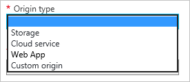

<properties
     pageTitle="Verwenden von Azure CDN | Microsoft Azure"
     description="In diesem Thema wird gezeigt, wie das Content Delivery Network (CDN) für Azure aktivieren. Das Lernprogramm führt durch die Erstellung eines neuen CDN Profil und Endpunkt."
     services="cdn"
     documentationCenter=""
     authors="camsoper"
     manager="erikre"
     editor=""/>
<tags
     ms.service="cdn"
     ms.workload="media"
     ms.tgt_pltfrm="na"
     ms.devlang="na"
     ms.topic="get-started-article"
     ms.date="07/28/2016" 
     ms.author="casoper"/>

# Verwenden von Azure CDN  

Dieses Thema führt durch Azure CDN durch Erstellen einer neuen CDN Profil und Endpunkt aktivieren.

>[AZURE.IMPORTANT] Einführung in die CDN sowie eine Liste der Features, Funktionsweise, finden Sie unter der [CDN Übersicht](./cdn-overview.md).

## Erstellen eines neuen CDN-Profils

Ein Profil CDN ist eine Zusammenstellung von CDN Endpunkte.  Jedes Profil enthält einen oder mehrere CDN Endpunkte.  Möglicherweise möchten Sie mehrere Profile zum Organisieren Ihrer Endpunkte CDN von Internet-Domäne, Webanwendung oder anderen Kriterien verwenden.

> [AZURE.NOTE] Standardmäßig ist ein einzelnes Azure-Abonnement auf acht CDN Profile beschränkt. Jedes Profil CDN beträgt zehn CDN Endpunkte.
>
> Preise CDN wird auf der Ebene der CDN Profil angewendet. Wenn Sie eine Mischung Azure CDN Preisgestaltung Ebenen verwenden möchten, benötigen Sie mehrere CDN Profile.

[AZURE.INCLUDE [cdn-create-profile](../../includes/cdn-create-profile.md)]

## Erstellen Sie einen neuen CDN Endpunkt

**So erstellen einen neuen CDN Endpunkt**

1. Navigieren Sie zu Ihrem Profil CDN im [Portal Azure](https://portal.azure.com).  Sie können es auf dem Dashboard im vorherigen Schritt angeheftet haben.  Wenn Sie nicht, Sie finden können, indem Sie auf **Durchsuchen**, und klicken Sie dann **CDN Profile**und auf auf das Profil, das Sie zu Ihrem Endpunkt hinzufügen möchten.

    Das CDN Profil Blade wird angezeigt.

    ![CDN Profil][cdn-profile-settings]

2. Klicken Sie auf die Schaltfläche **Endpunkt hinzufügen** .

    ![Endpunkt-Schaltfläche "hinzufügen"][cdn-new-endpoint-button]

    Das **Hinzufügen von außen liegenden Tabellenblättern** Blade wird angezeigt.

    ![Hinzufügen von Endpunkt blade][cdn-add-endpoint]

3. Geben Sie einen **Namen** für diesen Endpunkt CDN.  Zugriff auf Ihre zwischengespeicherten Ressourcen in der Domäne an diesem Namen verwendet werden `<endpointname>.azureedge.net`.

4. Wählen Sie in der Dropdownliste den **Ursprung Typ** Ihrer Origin.  Wählen Sie **Speicherplatz** für ein Konto Azure-Speicher, **Cloud-Dienst** für einen Azure-Cloud-Dienst, **Web App** für eine Azure Web App oder eine **benutzerdefinierte Origin** für alle anderen öffentlich zugängliche Web Server Origin (in Azure oder an anderer Stelle gehostet).

    
        
5. Wählen Sie in der Dropdownliste den **Ursprung Hostname** aus, oder geben Sie Ihre Domäne Origin.  Die Dropdownliste werden alle verfügbaren Ursprung vom Typ angegeben werden, die Sie in Schritt 4 angegeben haben.  Wenn Sie *benutzerdefinierte Origin* als Ihre **Origin geben**ausgewählt haben, geben Sie in der Domäne mit Ihrer benutzerdefinierten Origin.

6. Geben Sie in das Textfeld **Origin Pfad** den Pfad zu den Ressourcen, die Sie zwischenspeichern möchten, oder leer lassen, um den Cache für alle Ressourcen in der Domäne zulassen, die Sie in Schritt 5 angegeben haben.

7. Klicken Sie in der **Origin Host Kopfzeile**Geben Sie den Hostheader das CDN, die mit jeder Anforderung gesendet werden soll, oder behalten Sie die Standardeinstellung.

    > [AZURE.WARNING] Einigen Ursprung, z. B. Azure-Speicher und Web Apps, muss der Host Kopfzeile auf die Domäne vom Ursprung entspricht. Es sei denn, Sie einen Ursprung verfügen, der eine Host Kopfzeile von ihrer Domäne erfordert, sollten Sie den Standardwert belassen.

8. Geben Sie für das **Protokoll** und den **Port Origin**die Protokolle und Ports Zugriff auf Ihre Ressourcen am Ursprung verwendet.  Mindestens ein Protokoll (HTTP oder HTTPS) muss aktiviert sein.
    
    > [AZURE.NOTE] Den **ursprünglichen Port** betrifft nur an, was der Endpunkt verwendet zum Abrufen von Informationen aus den Ursprung port.  Der Endpunkt selbst nur Verfügung End-Clients standardmäßig HTTP und HTTPS-Ports (80 und 443), unabhängig von den **ursprünglichen Port**stehen zur.  
    >
    > Vollständigen TCP Portbereich für Ursprung zulassen **Azure CDN von Akamai** Endpunkte nicht.  Eine Liste der Origin Ports, die nicht zulässig sind, finden Sie unter [Azure CDN von Akamai zulässige Origin Ports](https://msdn.microsoft.com/library/mt757337.aspx).  
    >
    > Zugreifen auf CDN weist Inhalt mit HTTPS die folgenden Einschränkungen:
    > 
    > - Sie müssen das SSL-Zertifikat, das von der CDN bereitgestellten verwenden. Zertifikate von Drittanbietern werden nicht unterstützt.
    > - Sie müssen die Domäne CDN bereitgestellte verwenden (`<endpointname>.azureedge.net`) zu HTTPS-Inhalte zugreifen. HTTPS-Unterstützung ist nicht verfügbar für benutzerdefinierten Domänennamen (CNAMEs), da das CDN das benutzerdefinierte Zertifikate zurzeit nicht unterstützt.

9. Klicken Sie auf die Schaltfläche **Hinzufügen** , um den neuen Endpunkt zu erstellen.

10. Nachdem Sie der Endpunkt erstellt wurde, wird es in eine Liste von Endpunkten für das Profil angezeigt. Die Listenansicht zeigt die URL an, mit der zwischengespeicherte Inhalt als auch die Origin-Domäne zugreifen.

    ![CDN Endpunkt][cdn-endpoint-success]

    > [AZURE.IMPORTANT] Der Endpunkt wird sind nicht sofort einsatzbereit, wie es für die Registrierung dauert, bis das CDN verbreitet.  Für <b>Azure CDN von Akamai</b> Profile wird die Verteilung normalerweise innerhalb einer Minute abgeschlossen.  Bei <b>Azure CDN von Verizon</b> Profilen Verteilung wird in der Regel innerhalb von 90 Minuten abgeschlossen, aber in einigen Fällen kann dauert länger.
    >    
    > Benutzer, die versuchen, den Domänennamen CDN zu verwenden, bevor die Endpunktkonfiguration zu Popups übermittelt wurde, HTTP 404 Antwortcodes erhalten.  Wenn es verfügt über mehrere Stunden seit Sie Ihre Endpunkt erstellt haben und Sie haben immer noch 404-Antworten, finden Sie unter [Problembehandlung CDN Endpunkte 404 Status zurückgeben](cdn-troubleshoot-endpoint.md).

##Siehe auch
- [Verhalten des Anfragen mit Abfragezeichenfolgen Zwischenspeichern steuern](cdn-query-string.md)
- [Zum Zuordnen von CDN Inhalt zu einer benutzerdefinierten Domäne](cdn-map-content-to-custom-domain.md)
- [Anlagen für einen Endpunkt Azure CDN im Voraus zu laden](cdn-preload-endpoint.md)
- [Löschen Sie einen Endpunkt Azure CDN](cdn-purge-endpoint.md)
- [Problembehandlung bei CDN Endpunkte 404 Status zurückgeben](cdn-troubleshoot-endpoint.md)

[cdn-profile-settings]: ./media/cdn-create-new-endpoint/cdn-profile-settings.png
[cdn-new-endpoint-button]: ./media/cdn-create-new-endpoint/cdn-new-endpoint-button.png
[cdn-add-endpoint]: ./media/cdn-create-new-endpoint/cdn-add-endpoint.png
[cdn-endpoint-success]: ./media/cdn-create-new-endpoint/cdn-endpoint-success.png
