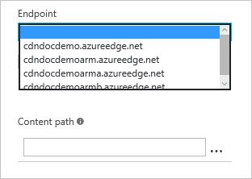

<properties
    pageTitle="Löschen Sie einen Endpunkt Azure CDN | Microsoft Azure"
    description="Erfahren Sie, wie in alle zwischengespeicherten Inhalt von einem Endpunkt CDN bereinigen."
    services="cdn"
    documentationCenter=""
    authors="camsoper"
    manager="erikre"
    editor=""/>

<tags
    ms.service="cdn"
    ms.workload="tbd"
    ms.tgt_pltfrm="na"
    ms.devlang="na"
    ms.topic="article"
    ms.date="07/28/2016"
    ms.author="casoper"/>

# Löschen Sie einen Endpunkt Azure CDN

## (Übersicht)

Azure CDN Kante Knoten werden Posten cache, bis der Anlage Time to live (TTL) abgelaufen ist.  Nachdem der Anlage TTL läuft ab, wenn ein Client das Objekt aus dem Kantenknoten anfordert, der Kantenknoten wird eine neue aktualisierte Kopie der Anlage zur Bereitstellung der Clientanfrage abrufen und Store den Cache aktualisieren.

Möglicherweise möchten manchmal zwischengespeicherten Inhalte aus allen Kante Knoten bereinigen und erzwingen, dass alle neue aktualisierte Anlagen abrufen.  Dies möglicherweise Updates an Ihrer Webanwendung oder schnell aktualisieren von Anlagen, die falsche Informationen enthalten sein.

> [AZURE.TIP] Beachten Sie, dass Aufräumen nur den zwischengespeicherten Inhalt auf den Rand-Servern CDN werden gelöscht.  Alle untergeordneten Caches, z. B. Proxy-Servern und lokalen Browser-Caches möglicherweise noch eine zwischengespeicherte Kopie der Datei bewegen.  Es ist zu beachten, wenn Sie einer Datei Time-to-live festlegen.  Sie können einen untergeordneten Client so fordern Sie die neueste Version einer Datei an, indem Sie ihm einen eindeutigen Namen jedes Mal, wenn Sie es aktualisieren oder nutzen [Abfrage Zeichenfolge Zwischenspeichern](cdn-query-string.md)erzwingen.  

In diesem Lernprogramm führt Sie durch das Löschen von Anlagen aus allen Kante Knoten von außen liegenden Tabellenblättern.

## Exemplarische Vorgehensweise

1. Im [Portal Azure](https://portal.azure.com)navigieren Sie zu dem CDN Profil mit den Endpunkt, die, den Sie löschen möchten.

2. Klicken Sie aus dem CDN Profil Blade auf die Schaltfläche löschen.

    

    Das Bereinigen Blade wird geöffnet.

    

3. Wählen Sie die Serviceadresse, die Sie aus der Dropdownliste URL entfernen möchten, auf das Blade bereinigen.

    

    > [AZURE.NOTE] Sie können auch an die Blade bereinigen abrufen, indem Sie auf die Schaltfläche **Löschen** klicken Sie auf das CDN Endpunkt Blade.  In diesem Fall werden mit der Adresse Dienst diesen bestimmten Endpunkt vorab eingetragenen das Feld **URL** ein.

4. Wählen Sie welche Posten Sie aus Rand Knoten entfernen möchten.  Wenn Sie alle Anlagen deaktivieren möchten, aktivieren Sie das Kontrollkästchen **Alle bereinigen** .  Geben Sie andernfalls den vollständigen Pfad der einzelnen Ressourcen, die Sie löschen möchten (z. B. `/pictures/kitten.png`) in das Textfeld **Pfad** ein.

    > [AZURE.TIP] Weitere **Pfad** Textfelder erscheinen, nach der Eingabe von Text, damit Sie eine Liste mit mehreren Anlagen erstellen können.  Sie können Anlagen aus der Liste löschen, indem Sie auf das Auslassungszeichen (...).
    >
    > Pfade muss eine relative URL, die den folgenden [regulären Ausdruck](https://msdn.microsoft.com/library/az24scfc.aspx)entsprechen: `^\/(?:[a-zA-Z0-9-_.\u0020]+\/)*\*$";`.  Für **Azure CDN von Verizon** (Standard- und Premium), Sternchen (\*) als Platzhalterzeichen verwendet werden kann (z. B. `/music/*`).  Platzhalter und **Alle bereinigen** sind mit **Azure CDN von Akamai**nicht zulässig.
    
5. Klicken Sie auf die Schaltfläche **Löschen** .

    

> [AZURE.IMPORTANT] Bereinigen Sie Besprechungsanfragen übernehmen etwa 2-3 Minuten zum Verarbeiten von **Azure CDN von Verizon** (Standard- und Premium) und mit **Azure CDN von Akamai**etwa 7 Minuten.  Azure CDN sind maximal 50 gleichzeitige Anfragen zu einem beliebigen Zeitpunkt zu löschen. 

## Siehe auch
- [Anlagen für einen Endpunkt Azure CDN im Voraus zu laden](cdn-preload-endpoint.md)
- [Azure CDN REST-API-Referenz - bereinigen oder vorab laden von außen liegenden Tabellenblättern](https://msdn.microsoft.com/library/mt634451.aspx)
