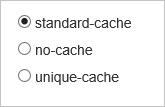

<properties
    pageTitle="Steuern der Azure CDN Premium aus Verizon Verhalten von Besprechungsanfragen mit Abfragezeichenfolgen Zwischenspeichern | Microsoft Azure"
    description="Azure CDN Abfragezeichenfolge Zwischenspeichern von Steuerelementen wie Dateien werden zwischengespeichert werden soll, wenn sie die Abfragezeichenfolgen enthalten."
    services="cdn"
    documentationCenter=""
    authors="camsoper"
    manager="erikre"
    editor=""/>

<tags
    ms.service="cdn"
    ms.workload="tbd"
    ms.tgt_pltfrm="na"
    ms.devlang="na"
    ms.topic="article"
    ms.date="07/28/2016"
    ms.author="casoper"/>

#Verhalten des CDN Anfragen mit Abfragezeichenfolgen - Premium Zwischenspeichern steuern

> [AZURE.SELECTOR]
- [Standard](cdn-query-string.md)
- [Azure CDN Premium aus Verizon](cdn-query-string-premium.md)

##(Übersicht)

Abfragezeichenfolge Zwischenspeichern von Steuerelementen wie Dateien werden zwischengespeichert werden soll, wenn sie die Abfragezeichenfolgen enthalten.

> [AZURE.IMPORTANT] Standard- und Premium CDN Produkte bieten die gleiche Abfragezeichenfolge Cache-Funktion, aber die Benutzeroberfläche unterscheidet sich.  Dieses Dokument beschreibt die Benutzeroberfläche für **Azure CDN Premium aus Verizon**.  Abfrage-Zeichenfolge mit **Azure CDN Standard von Akamai** und **Azure CDN Standard von Verizon**Cache, finden Sie unter [Steuern des Verhalten des CDN Anfragen mit Abfragezeichenfolgen beim Zwischenspeichern](cdn-query-string.md).

Drei Modi stehen zur Verfügung:

- **Standard-Cache**: Dies ist der Standardmodus.  Der CDN Kantenknoten übergibt der Abfragezeichenfolge aus das jeweilige Ursprung auf die erste Anforderung und Cache die Anlage an.  Alle nachfolgende Anforderungen für die Anlage, die von den Rand Knoten bereitgestellt werden ignoriert die Abfragezeichenfolge, bis die Cache Anlage läuft ab.
- **keine-Cache**: In diesem Modus Anfragen mit Abfragezeichenfolgen nicht am Rand Knoten CDN zwischengespeichert werden.  Der Rand Knoten Ruft die Anlage direkt vom Ursprung und übergibt diese an dem jeweilige mit jeder Anforderung.
- **eindeutige Cache**: in diesem Modus behandelt jede Anforderung mit einer Abfragezeichenfolge als eine eindeutige Anlage mit einem eigenen Cache.  Die Antwort vom Ursprung für eine Anforderung für *foo.ashx?q=bar* würde beispielsweise am Rand Knoten Cache und für nachfolgende Caches mit dem dieselbe Abfragezeichenfolge zurückgegeben.  Eine Anforderung für *foo.ashx?q=somethingelse* würde als eine separate Anlage mit einem eigenen Zeit zu live zwischengespeichert werden.

##Ändern der Einstellungen für Premium CDN Profile Zwischenspeichern Abfragezeichenfolge

1. Klicken Sie aus dem CDN Profil Blade auf die Schaltfläche **Verwalten** .

    

    Verwaltungsportal CDN wird geöffnet.

2. Zeigen Sie auf der Registerkarte **HTTP großen** und dann Hovern Sie über die **Einstellungen des Caches** Flyout.  Klicken Sie auf der **Abfragezeichenfolge Zwischenspeichern**.

    Abfragezeichenfolge Optionen zum Zwischenspeichern angezeigt werden.

    

3. Klicken Sie nachdem Sie Ihre Auswahl getroffen haben auf die Schaltfläche **Aktualisieren** .

> [AZURE.IMPORTANT] Die Änderungen Einstellungen ist möglicherweise nicht sofort angezeigt wird, wie es dauert für die Registrierung Hilfe der CDN verteilen.  Bei <b>Azure CDN von Verizon</b> Profilen Verteilung wird in der Regel innerhalb von 90 Minuten abgeschlossen, aber in einigen Fällen kann dauert länger.
