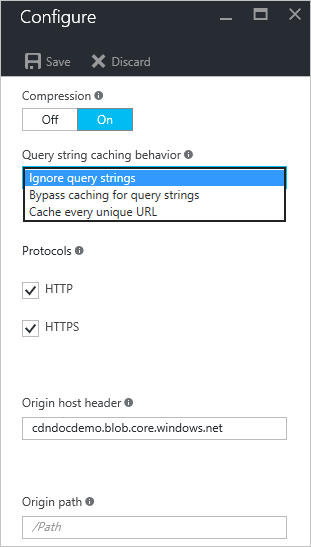

<properties
    pageTitle="Steuern der Azure CDN Verhalten von Besprechungsanfragen mit Abfragezeichenfolgen Zwischenspeichern | Microsoft Azure"
    description="Azure CDN Abfragezeichenfolge Zwischenspeichern von Steuerelementen wie Dateien werden zwischengespeichert werden soll, wenn sie die Abfragezeichenfolgen enthalten."
    services="cdn"
    documentationCenter=""
    authors="camsoper"
    manager="erikre"
    editor=""/>

<tags
    ms.service="cdn"
    ms.workload="tbd"
    ms.tgt_pltfrm="na"
    ms.devlang="na"
    ms.topic="article"
    ms.date="07/28/2016"
    ms.author="casoper"/>

#Verhalten des CDN Anfragen mit Abfragezeichenfolgen Zwischenspeichern steuern

> [AZURE.SELECTOR]
- [Standard](cdn-query-string.md)
- [Azure CDN Premium aus Verizon](cdn-query-string-premium.md)

##(Übersicht)

Abfragezeichenfolge Zwischenspeichern von Steuerelementen wie Dateien werden zwischengespeichert werden soll, wenn sie die Abfragezeichenfolgen enthalten.

> [AZURE.IMPORTANT] Standard- und Premium CDN Produkte bieten die gleiche Abfragezeichenfolge Cache-Funktion, aber die Benutzeroberfläche unterscheidet sich.  Dieses Dokument beschreibt die Benutzeroberfläche für **Azure CDN Standard von Akamai** und **Azure CDN Standard von Verizon**.  Abfrage-Zeichenfolge mit **Azure CDN Premium aus Verizon**Cache, finden Sie unter [Steuern des Verhalten des CDN Anfragen mit Abfragezeichenfolgen - Premium beim Zwischenspeichern](cdn-query-string-premium.md).

Drei Modi stehen zur Verfügung:

- **Ignorieren Abfragezeichenfolgen**: Dies ist der Standardmodus.  Der CDN Kantenknoten übergibt der Abfragezeichenfolge aus das jeweilige Ursprung auf die erste Anforderung und Cache die Anlage an.  Alle nachfolgende Anforderungen für die Anlage, die von den Rand Knoten bereitgestellt werden ignoriert die Abfragezeichenfolge, bis die Cache Anlage läuft ab.
- **Umgehen Zwischenspeichern Abfragezeichenfolgen-URL**: In diesem Modus Anfragen mit Abfragezeichenfolgen nicht am Rand Knoten CDN zwischengespeichert werden.  Der Rand Knoten Ruft die Anlage direkt vom Ursprung und übergibt diese an dem jeweilige mit jeder Anforderung.
- **Jeder eindeutigen URL Zwischenspeichern**: in diesem Modus behandelt jede Anforderung mit einer Abfragezeichenfolge als eine eindeutige Anlage mit einem eigenen Cache.  Die Antwort vom Ursprung für eine Anforderung für *foo.ashx?q=bar* würde beispielsweise am Rand Knoten Cache und für nachfolgende Caches mit dem dieselbe Abfragezeichenfolge zurückgegeben.  Eine Anforderung für *foo.ashx?q=somethingelse* würde als eine separate Anlage mit einem eigenen Zeit zu live zwischengespeichert werden.

##Ändern der Einstellungen für standard CDN Profile Zwischenspeichern Abfragezeichenfolge

1. Klicken Sie aus dem CDN Profil Blade auf den CDN-Endpunkt, die, den Sie verwalten möchten.

    

    Das CDN Endpunkt Blade wird geöffnet.

2. Klicken Sie auf die Schaltfläche **Konfigurieren** .

    

    Das Blade CDN Konfiguration wird geöffnet.

3. Wählen Sie eine Einstellung aus der Dropdownliste **Abfragezeichenfolge Verhalten Zwischenspeichern** .

    

4. Klicken Sie nachdem Sie Ihre Auswahl getroffen haben auf die Schaltfläche **Speichern** .

> [AZURE.IMPORTANT] Die Änderungen Einstellungen ist möglicherweise nicht sofort angezeigt wird, wie es dauert für die Registrierung Hilfe der CDN verteilen.  Für <b>Azure CDN von Akamai</b> Profile wird die Verteilung normalerweise innerhalb einer Minute abgeschlossen.  Bei <b>Azure CDN von Verizon</b> Profilen Verteilung wird in der Regel innerhalb von 90 Minuten abgeschlossen, aber in einigen Fällen kann dauert länger.
