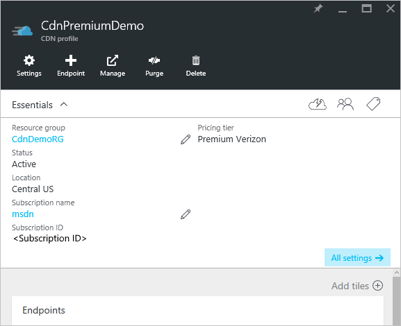

<properties
    pageTitle="Azure CDN in Echtzeit Benachrichtigungen | Microsoft Azure"
    description="Hinweise in Microsoft Azure CDN in Echtzeit. Hinweise in Echtzeit bieten Benachrichtigungen über die Leistung der Endpunkte in Ihrem Profil CDN."
    services="cdn"
    documentationCenter=""
    authors="camsoper"
    manager="erikre"
    editor=""/>

<tags
    ms.service="cdn"
    ms.workload="tbd"
    ms.tgt_pltfrm="na"
    ms.devlang="na"
    ms.topic="article"
    ms.date="07/12/2016"
    ms.author="casoper"/>

# <a name="real-time-alerts-in-microsoft-azure-cdn"></a>Hinweise in Echtzeit in Microsoft Azure CDN

[AZURE.INCLUDE [cdn-premium-feature](../../includes/cdn-premium-feature.md)]


## <a name="overview"></a>(Übersicht)

Dieses Dokument wird in Echtzeit Benachrichtigungen in Microsoft Azure CDN erläutert. Diese Funktionen werden in Echtzeit Benachrichtigungen über die Leistung der Endpunkte in Ihrem Profil CDN bereitgestellt.  Sie können e-Mail- oder basierend auf HTTP-Benachrichtigungen einrichten:

* Bandbreite
* Statuscodes
* Cache Status
* Verbindungen

## <a name="creating-a-real-time-alert"></a>Erstellen einer Benachrichtigung in Echtzeit

1. Navigieren Sie zu Ihrem Profil CDN im [Portal Azure](https://portal.azure.com).

    

2. Klicken Sie aus dem CDN Profil Blade auf die Schaltfläche **Verwalten** .

    

    Verwaltungsportal CDN wird geöffnet.

3. Zeigen Sie auf der Registerkarte **Analytics** , und zeigen Sie auf die **Real-Time Stats** Flyout.  Klicken Sie auf **in Echtzeit Benachrichtigungen**.

    

    Die Liste der vorhandenen benachrichtigen Konfigurationen (falls vorhanden) wird angezeigt.

4. Klicken Sie auf die Schaltfläche **Hinzufügen benachrichtigen** .

    

    Formular zum Erstellen einer neuen Warnung wird angezeigt.

    

5. Aktivieren Sie Sie möchten diese Warnung aktiv sein sollen, wenn Sie auf **Speichern**klicken, das Kontrollkästchen **Benachrichtigung aktiviert** .

6. Geben Sie im Feld **Name** einen beschreibenden Namen für Ihre Benachrichtigung.

7. Wählen Sie in der Dropdownliste den **Medientypen** **Großen HTTP-Objekt**aus.

    

    > [AZURE.IMPORTANT] Wählen Sie als **Medientypen** **Großen HTTP-Objekt** aus.  Die anderen Optionen werden nicht von **Azure CDN von Verizon**verwendet.  Fehler beim **Großen HTTP-Objekt** zu markieren bewirkt, dass Ihre Benachrichtigung nie ausgelöst werden.

8. Erstellen Sie einen **Ausdruck** überwachen, indem Sie eine **Metrik**, **Operator**und **Triggerwert**auswählen.

    - Wählen Sie für **Metrisch**den Typ der Bedingung, die überwacht werden sollen.  **Bandbreite/s** ist die Verwendung von Bandbreite in MB pro Sekunde.  **Total Verbindungen** ist die Anzahl der aktiven HTTP-Verbindungen zu unseren Kante-Servern.  Definitionen der verschiedenen Cache Status und Statuscodes finden Sie unter [Azure CDN Cache Status Codes](https://msdn.microsoft.com/library/mt759237.aspx) und [Azure CDN HTTP Status Codes](https://msdn.microsoft.com/library/mt759238.aspx)
    - **Handelt es den mathematischen Operator, der die Beziehung zwischen den metrische und der Triggerwert hergestellt wird.**
    - **Auslösen Wert** ist der Schwellenwert, der erfüllt sein müssen, bevor eine Benachrichtigung gesendet wird.

    In der gezeigten Beispiel zeigt der Ausdruck erstellt haben an, dass ich möchte benachrichtigt werden, wenn die Anzahl der 404 Statuscodes größer als 25 ist.

    

9. Geben Sie für das **Intervall**wie häufig den Ausdruck ausgewertet werden soll.

10. Wählen Sie in der Dropdownliste **auf benachrichtigen** Wenn Sie benachrichtigt werden, wenn der Ausdruck true ist möchten.
    
    - **Starten der Bedingung** gibt an, dass eine Benachrichtigung gesendet wird, wenn die angegebene Bedingung zuerst erkannt wird.
    - **Bedingung Ende** gibt an, dass eine Benachrichtigung gesendet wird, wenn die angegebene Bedingung nicht mehr erkannt wird. Diese Benachrichtigung kann nur ausgelöst werden, nachdem unser Netzwerk überwachen Systems festgestellt, dass die angegebene Bedingung aufgetreten ist.
    - **Fortlaufend** gibt an, dass eine Benachrichtigung jedes Mal gesendet wird, dass das Netzwerk überwachen Systems die angegebene Bedingung erkennt. Orientieren Sie, das im Netzwerk überwachen Systems pro Intervall für die angegebene Bedingung nur einmal eingecheckt wird.
    - **Bedingung Anfang und Ende** gibt an, dass eine Benachrichtigung beim ersten gesendet wird, dass die angegebene Bedingung erkannt und erneut bei die Bedingung wird nicht mehr erkannt.

11. Wenn Sie per e-Mail-Benachrichtigungen erhalten möchten, aktivieren Sie das Kontrollkästchen **per E-Mail benachrichtigen** .  

    
    
    Geben Sie im Feld **an** die e-Mail-Adresse, die Sie die Stelle, an der gewünschten Benachrichtigungen gesendet werden. **Betreff** und den **Text**möglicherweise behalten Sie die Standardeinstellung, oder Sie möglicherweise passen Sie die Nachricht, die mit der Liste der **verfügbaren Schlüsselwörter** dynamisch benachrichtigen Daten eingefügt wird, wenn die Nachricht gesendet wird.

    > [AZURE.NOTE] Sie können die e-Mail-Benachrichtigung testen, indem Sie auf die Schaltfläche **Testen der Benachrichtigung** , jedoch erst, nachdem die Konfiguration die Warnung gespeichert wurde.

12. Aktivieren Sie die Benachrichtigung auf einen Webserver bereitgestellt werden soll, das Kontrollkästchen **Benachrichtigen über HTTP Post** .

    

    Geben Sie im Feld **Url** die URL, die Sie die gewünschte Stelle, an der die HTTP-Nachricht veröffentlicht. Geben Sie in das Textfeld **Überschriften** die HTTP-Header in der Anforderung gesendet werden.  Für **Text** können Sie die Nachricht mit der Liste der **verfügbaren Schlüsselwörter** dynamisch benachrichtigen Daten eingefügt wird, wenn die Nachricht gesendet wird anpassen.  **Überschriften** und **Textkörper** standardmäßig XML-Nutzlast ähnlich wie der gezeigten Beispiel.

    ```
    <string xmlns="http://schemas.microsoft.com/2003/10/Serialization/">
        <![CDATA[Expression=Status Code : 404 per second > 25&Metric=Status Code : 404 per second&CurrentValue=[CurrentValue]&NotificationCondition=Condition Start]]>
    </string>
    ```

    > [AZURE.NOTE] Sie können die Benachrichtigung HTTP Post testen, indem Sie auf die Schaltfläche **Testen der Benachrichtigung** , jedoch erst, nachdem die Konfiguration die Warnung gespeichert wurde.

13. Klicken Sie auf die Schaltfläche **Speichern** , um die Konfiguration der Warnung zu speichern.  Wenn Sie in Schritt 5 **Warnung aktiviert** aktiviert haben, ist Ihre Benachrichtigung jetzt aktiv.

## <a name="next-steps"></a>Nächste Schritte

- Analysieren Sie [in Echtzeit Stats in Azure CDN](cdn-real-time-stats.md)
- Mit [erweiterten HTTP-Berichten](cdn-advanced-http-reports.md) tiefer gehende
- Analysieren der [von Verwendungsmustern](cdn-analyze-usage-patterns.md)

