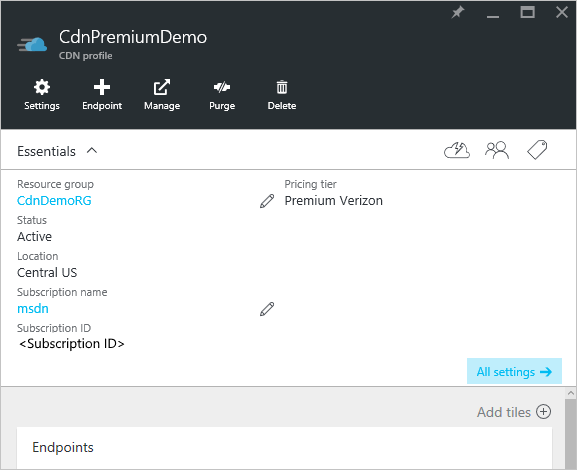
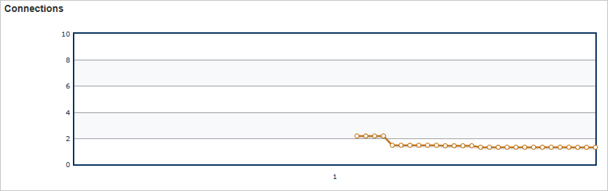

<properties
    pageTitle="Real-einmalig-Stats in Azure CDN | Microsoft Azure"
    description="In Echtzeit Statistiken bietet Echtzeitdaten über die Leistung von Azure CDN beim Übermitteln von Inhalten an Ihre Kunden."
    services="cdn"
    documentationCenter=""
    authors="camsoper"
    manager="erikre"
    editor=""/>

<tags
    ms.service="cdn"
    ms.workload="tbd"
    ms.tgt_pltfrm="na"
    ms.devlang="na"
    ms.topic="article"
    ms.date="07/28/2016"
    ms.author="casoper"/>

# In Echtzeit Stats in Microsoft Azure CDN

[AZURE.INCLUDE [cdn-premium-feature](../../includes/cdn-premium-feature.md)]

## (Übersicht)

Dieses Dokument wird in Echtzeit Stats in Microsoft Azure CDN erläutert.  Diese Funktion bietet Echtzeitdaten, Bandbreite, Cache Status und aktiven Verbindungen zu Ihrem Profil CDN beim Übermitteln von Inhalten an Ihre Kunden. Dies ermöglicht kontinuierliche Überwachung die Integrität des Diensts zu einem beliebigen Zeitpunkt, einschließlich Go live Ereignisse.

Die folgenden Diagramme sind verfügbar:

* [Bandbreite](#bandwidth)
* [Statuscodes](#status-codes)
* [Cache Status](#cache-statuses)
* [Verbindungen](#connections)

## Zugreifen auf in Echtzeit stats

1. Navigieren Sie zu Ihrem Profil CDN im [Portal Azure](https://portal.azure.com).

    

2. Klicken Sie aus dem CDN Profil Blade auf die Schaltfläche **Verwalten** .

    

    Verwaltungsportal CDN wird geöffnet.

3. Zeigen Sie auf der Registerkarte **Analytics** , und zeigen Sie auf die **Real-Time Stats** Flyout.  Klicken Sie auf **http-große Objekt**.

    

    Die Diagramme in Echtzeit Stats werden angezeigt.
    
Jeder der Diagramme in Echtzeit Statistik der ausgewählten Zeitraums, beginnend beim Laden der Seite angezeigt.  Die Diagramme werden alle paar Sekunden automatisch aktualisiert.  Die Schaltfläche **Aktualisieren Graph** wird falls vorhanden, das Diagramm, deaktivieren Sie nach dem nur die ausgewählten Daten angezeigt werden.

## Bandbreite

Das Diagramm **Bandbreite** zeigt Bandbreite über die ausgewählte Zeitspanne für die aktuelle Plattform verwendet. Die schattierten Bereich des Diagramms zeigt die Bandbreite Verwendung an. Der genaue Gesamtbetrag der aktuell verwendete Bandbreite wird direkt unter das Liniendiagramm angezeigt.

## Statuscodes

Der **Status Codes** Graph zeigt an, wie oft bestimmte HTTP-Antwort-Codes in den ausgewählten Zeitraum auftreten können.

> [AZURE.TIP]  Eine Beschreibung der einzelnen HTTP-Status Code Optionen finden Sie unter [Azure CDN HTTP Status Codes](https://msdn.microsoft.com/library/mt759238.aspx).

Eine Liste der HTTP Statuscodes direkt oberhalb des Diagramms angezeigt. Diese Liste gibt jeder Statuscode, der in das Liniendiagramm und die aktuelle Anzahl von Vorkommen pro Sekunde für diesen Statuscode enthalten sein kann. Standardmäßig wird eine Linie für jede dieser Status Codes im Diagramm angezeigt. Sie können jedoch nur die Statuscodes überwachen, die für Ihre Konfiguration CDN besonderen Bedeutung haben. Aktivieren Sie die gewünschten Statuscodes dazu, deaktivieren Sie alle anderen Optionen, und klicken Sie auf **Diagramm aktualisieren**. 

Sie können die protokollierte Daten für einen bestimmten Statuscode vorübergehend auszublenden.  Klicken Sie aus der Legende direkt unterhalb des Diagramms auf den Statuscode, die, den Sie ausblenden möchten. Der Statuscode wird sofort aus dem Diagramm ausgeblendet. Indem Sie erneut auf diesen Statuscode bewirkt, dass diese Option erneut angezeigt werden.

## Cache Status

Das Diagramm **Cache Status** zeigt an, wie oft bestimmter Typen von Cache Status in den ausgewählten Zeitraum auftreten können. 

> [AZURE.TIP]  Eine Beschreibung der einzelnen Cache Status Code Optionen finden Sie unter [Azure CDN Cache Status Codes](https://msdn.microsoft.com/library/mt759237.aspx).

Eine Liste der Cache Statuscodes direkt oberhalb des Diagramms angezeigt. Diese Liste gibt jeder Statuscode, der in das Liniendiagramm und die aktuelle Anzahl von Vorkommen pro Sekunde für diesen Statuscode enthalten sein kann. Standardmäßig wird eine Linie für jede dieser Status Codes im Diagramm angezeigt. Sie können jedoch nur die Statuscodes überwachen, die für Ihre Konfiguration CDN besonderen Bedeutung haben. Aktivieren Sie die gewünschten Statuscodes dazu, deaktivieren Sie alle anderen Optionen, und klicken Sie auf **Diagramm aktualisieren**. 

Sie können die protokollierte Daten für einen bestimmten Statuscode vorübergehend auszublenden.  Klicken Sie aus der Legende direkt unterhalb des Diagramms auf den Statuscode, die, den Sie ausblenden möchten. Der Statuscode wird sofort aus dem Diagramm ausgeblendet. Indem Sie erneut auf diesen Statuscode bewirkt, dass diese Option erneut angezeigt werden.

## Verbindungen

Dieses Diagramm zeigt an, wie viele Verbindungen auf die Kante Server eingerichtet wurden. Jede Anforderung für eine Anlage, die durch unsere CDN Ergebnisse in einer Verbindung verläuft.

## Nächste Schritte

- Erhalten einer Benachrichtigung mit [in Echtzeit Benachrichtigungen in Azure CDN](cdn-real-time-alerts.md)
- Mit [erweiterten HTTP-Berichten](cdn-advanced-http-reports.md) tiefer gehende
- Analysieren der [von Verwendungsmustern](cdn-analyze-usage-patterns.md)

