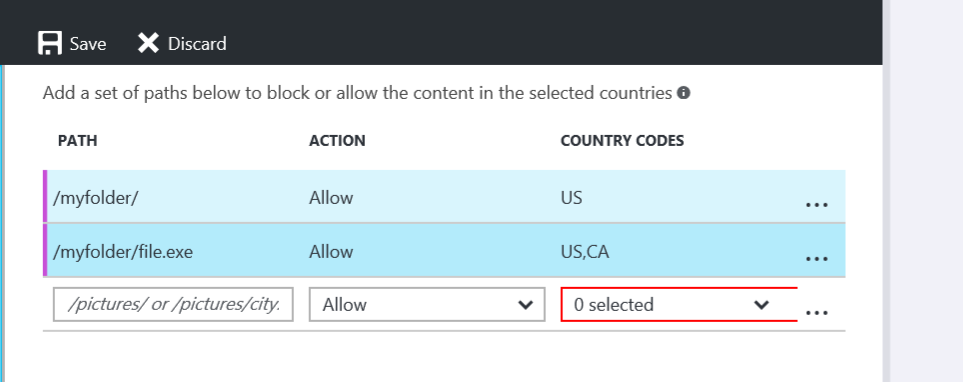

<properties
    pageTitle="Einschränken des Zugriffs auf Ihre Inhalte Azure CDN nach Land | Microsoft Azure"
    description="Informationen Sie zum Einschränken des Zugriffs auf Ihre Azure CDN Inhalt mithilfe der Funktion Geo filtern."
    services="cdn"
    documentationCenter=""
    authors="camsoper, rli"
    manager="akucer"
    editor=""/>

<tags
    ms.service="cdn"
    ms.workload="tbd"
    ms.tgt_pltfrm="na"
    ms.devlang="na"
    ms.topic="article"
    ms.date="10/14/2016"
    ms.author="Lichard"/>

#Einschränken des Zugriffs auf Ihre Inhalte nach Land - Akamai

> [AZURE.SELECTOR]
- [Verizon](cdn-restrict-access-by-country.md)
- [Akamai Standard](cdn-restrict-access-by-country-akamai.md)

##(Übersicht)

Wenn ein Benutzer den Inhalt, standardmäßig anfordert, wird der Inhalt verteilt, unabhängig davon, wo der Benutzer diese Anforderung aus vorgenommen. In einigen Fällen empfiehlt es sich zum Einschränken des Zugriffs auf Ihre Inhalte nach Ländern. In diesem Thema wird erläutert, wie Sie das Feature " **Geo Filtern** " verwenden, und konfigurieren den Dienst, zulässt oder Zugriff blockieren nach Ländern.

> [AZURE.IMPORTANT] Die Verizon und Akamai-Produkte bieten die gleiche Funktionalität Geo filtern, aber die Benutzeroberfläche unterscheidet sich. Dieses Dokument beschreibt die Benutzeroberfläche für **Azure CDN Standard von Akamai**. Geo-Filterung mit **Azure CDN Standard/Premium von Verizon**finden Sie unter [Einschränken des Zugriffs auf Ihre Inhalte nach Land - Verizon](cdn-restrict-access-by-country.md).

Informationen Aspekte, die bewirken, dass diese Art der Einschränkung, finden Sie im Abschnitt " [Hinweise](cdn-restrict-access-by-country.md#considerations) " am Ende des Themas.  

##Schritt 1: Definieren Sie den Pfad zum Verzeichnis

Wählen Sie Ihre Endpunkt innerhalb des Portals aus, und suchen Sie die Registerkarte Geo filtern, klicken Sie auf der linken Navigationsleiste auf dieses Feature nicht finden.

Beim Konfigurieren eines Filters Land, müssen Sie den relativen Pfad zu dem Speicherort angeben, zu denen Benutzer gewährt oder Zugriff verweigert. Sie können die Geo-Filter anwenden, für alle Ihre Dateien mit "/" oder Ordner durch Angeben von Verzeichnispfade "/ Bilder /" markiert. Sie können auch anwenden Geo Filtern in einer Datei, geben Sie die Datei und den Schrägstrich auslassen "/ pictures/city.png".

Beispiel für Verzeichnis Pfad filtern:

    /                                 
    /Photos/
    /Photos/Strasbourg/
    /Photos/Strasbourg/city.png

##Schritt 2: Definieren die Aktion: blockieren oder zulassen

**Blockieren:** Benutzer aus den angegebenen Ländern werden für Ressourcen, die von diesem Pfad rekursive angefordert Zugriff verweigert. Wenn keine anderen Land Filteroptionen für diesen Speicherort konfiguriert wurden, werden dann alle anderen Benutzern werden Zugriff gewährt.

**Zulassen:** Nur Benutzer aus den angegebenen Ländern werden Zugriff auf Anlagen, die von diesem Pfad rekursive angefordert zulässig sein.

##Schritt 3: Definieren von Länder

Wählen Sie die Länder, die Sie blockieren oder zulassen für den Pfad möchten. Weitere Informationen finden Sie unter [Azure CDN von Akamai Land Codes](https://msdn.microsoft.com/library/mt761717.aspx).

Beispielsweise wird die Regel für die Blockierung /Photos/Straßburg/Dateien, einschließlich filtern:

    http://<endpoint>.azureedge.net/Photos/Strasbourg/1000.jpg
    http://<endpoint>.azureedge.net/Photos/Strasbourg/Cathedral/1000.jpg

##Land-codes

Die Funktion **Geo Filterung** verwendet Land Codes Länder definieren, aus denen eine Anforderung gewährt oder gesperrte für gesicherte Verzeichnis. Die Land-Codes finden Sie in [Azure CDN von Akamai Land Codes](https://msdn.microsoft.com/library/mt761717.aspx). 

##Aspekte

- Es kann einige Minuten, damit die Änderungen an Ihrem Land Filtern Konfiguration bis zu dauern wirksam wird.
- Dieses Feature unterstützt keine Platzhalterzeichen (beispielsweise "*").
- Die Konfiguration Geo-Filterung der relative Pfad zugeordnet werden rekursiv auf, dass der Pfad angewendet wird.
- Nur eine Regel kann auf dem gleichen relativen Pfad angewendet werden (Sie können nicht mehrere Land Filter, die auf dem gleichen relativen Pfad verweisen erstellen. Jedoch möglicherweise ein Ordner mehrere Land Filter. Dies wird durch die rekursive Art der Land Filter. Kurzum, kann für ein Unterordner eines Ordners zuvor konfiguriert einen anderes Land Filter zugeordnet werden.

