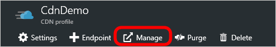

<properties
    pageTitle="Überschreiben HTTP Standardverhaltens in Azure CDN mit der Regeln-Engine | Microsoft Azure"
    description="Die Regeln-Engine ermöglicht das Anpassen, wie HTTP-Anfragen von Azure CDN, behandelt werden sollen, wie etwa Sperren der Übermittlung von bestimmter Typen von Inhalt, Definieren einer Richtlinie für Zwischenspeichern und HTTP-Header ändern."
    services="cdn"
    documentationCenter=""
    authors="camsoper"
    manager="erikre"
    editor=""/>

<tags
    ms.service="cdn"
    ms.workload="tbd"
    ms.tgt_pltfrm="na"
    ms.devlang="na"
    ms.topic="article"
    ms.date="07/28/2016"
    ms.author="casoper"/>

# Verwendung der Regeln-Engine HTTP-Standardverhalten überschreiben

[AZURE.INCLUDE [cdn-premium-feature](../../includes/cdn-premium-feature.md)]

## (Übersicht)

Die Regeln-Engine ermöglicht das Anpassen, wie etwa Sperren der Übermittlung von bestimmter Typen von Inhalt, Definieren einer Richtlinie für Zwischenspeichern und HTTP-Header ändern, wie HTTP-Anfragen verarbeitet werden.  In diesem Lernprogramm erfahren Sie, dass eine Regel erstellen, die das Verhalten des CDN Posten Zwischenspeichern ändern.  Im Abschnitt "[Siehe auch](#see-also)" ist auch Videoinhalt verfügbar.

## Lernprogramm

1. Klicken Sie aus dem CDN Profil Blade auf die Schaltfläche **Verwalten** .

    

    Verwaltungsportal CDN wird geöffnet.

2. Klicken Sie auf den **Großen HTTP-** Registerkarte gefolgt von **Regeln-Engine**.

    Optionen für eine neue Regel werden angezeigt.

    

    >[AZURE.IMPORTANT] Die Reihenfolge, in der mehrere Regeln aufgelistet werden, wirkt sich auf, wie sie verarbeitet werden. Eine Regel für nachfolgende möglicherweise von einer vorherigen Regel angegebenen Aktionen außer Kraft.
    
3. Geben Sie einen Namen in der **Name / Beschreibung** Textfeld.

4. Geben Sie das Besprechungsanfragen, die, denen die Regel angewendet wird.  Standardmäßig ist die Bedingung **immer** Übereinstimmung aktiviert.  Sie werden **immer** in diesem Lernprogramm verwenden, also lassen, ausgewählt.

    

    >[AZURE.TIP] Es gibt viele Arten von Übereinstimmung Bedingungen zur Verfügung, in der Dropdownliste aus.  Klicken auf das Symbol der blauen informativen links neben der Bedingung Übereinstimmung wird die aktuell ausgewählte Bedingung im Detail erläutert.
    >
    >Die vollständige Liste der Übereinstimmung Konditionen im Detail finden Sie unter [Regeln-Engine entsprechen Bedingung und Features Details](https://msdn.microsoft.com/library/mt757336.aspx#Anchor_0).

5.  Klicken Sie auf die **+** Schaltfläche neben **Features** , die Sie ein neues Feature hinzufügen.  Wählen Sie in der Dropdownliste auf der linken Seite **Force internen Max-Alter**ein.  Geben Sie in das Textfeld, das eingeblendet wird, **300**ein.  Lassen Sie die verbleibenden Standardwerte.

    

    >[AZURE.NOTE] Als wird mit Übereinstimmung Bedingungen, auf das Symbol links neben dem neuen Feature für Blau informativen Details dieses Feature angezeigt.  Im Falle **Force internen Max-Alter**sind wir der Anlage- **Cache-Control** und **läuft ab** Kopfzeilen zum Steuerelement überschreiben, wenn der CDN Kantenknoten die Anlage vom Ursprung aktualisieren wird.  Beispiel von 300 Sekunden bedeutet dies, dass der CDN Kantenknoten die Anlage 5 Minuten vor dem Aktualisieren der Anlage aus dem Ursprung zwischengespeichert werden.
    >
    >Die vollständige Liste der Features im Detail finden Sie unter [Regeln für Übereinstimmung Bedingung und Features Details](https://msdn.microsoft.com/library/mt757336.aspx#Anchor_1).

6.  Klicken Sie auf die Schaltfläche **Hinzufügen** , um die neue Regel zu speichern.  Die neue Regel wird jetzt zur Genehmigung erwartet. Sobald sie genehmigt wurde, ändert sich der Status aus **Steht noch aus XML-** in **Aktiven XML**.

    >[AZURE.IMPORTANT] Regeln Änderungen können über die CDN weitergegeben bis zu 90 Minuten dauern.

## Siehe auch
* [Azure freitags: Azure CDN leistungsfähige neue Premium Features](https://azure.microsoft.com/documentation/videos/azure-cdns-powerful-new-premium-features/) (Video)
* [Regeln-Engine Übereinstimmung Bedingung und Feature-Details](https://msdn.microsoft.com/library/mt757336.aspx)
