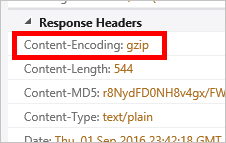

<properties
    pageTitle="Problembehandlung in Azure CDN Komprimierung | Microsoft Azure"
    description="Behandeln von Problemen mit Azure CDN Datei Komprimierung aus."
    services="cdn"
    documentationCenter=""
    authors="camsoper"
    manager="erikre"
    editor=""/>

<tags
    ms.service="cdn"
    ms.workload="tbd"
    ms.tgt_pltfrm="na"
    ms.devlang="na"
    ms.topic="article"
    ms.date="09/01/2016"
    ms.author="casoper"/>
    
# Problembehandlung bei CDN Datei Komprimierung

In diesem Artikel können Sie die Behebung von Problemen mit [CDN Datei Komprimierung](cdn-improve-performance.md).

Wenn Sie an einer beliebigen Stelle in diesem Artikel weitere Hilfe benötigen, können Sie die Azure-Experten auf [der MSDN-Azure und den Stapelüberlauf Foren](https://azure.microsoft.com/support/forums/)kontaktieren. Alternativ können Sie auch einen Supportvorfall Azure ablegen. Wechseln Sie zur [Azure-Support-Website](https://azure.microsoft.com/support/options/) , und klicken Sie auf **Anfordern von Support**.

## Problem

Komprimierung für Ihre Endpunkt aktiviert ist, aber Dateien werden nicht komprimiert zurückgegeben wird.

>[AZURE.TIP] Um zu überprüfen, ob Ihre Dateien komprimierte zurückgegeben werden, müssen Sie ein Tool wie [Fiddler](http://www.telerik.com/fiddler) oder Ihres Browsers [Entwicklertools](https://developer.microsoft.com/microsoft-edge/platform/documentation/f12-devtools-guide/)verwenden.  Überprüfen der HTTP-Antwort-Header zurückgegeben mit Ihrer zwischengespeicherten CDN Inhalt.  Es ist eine Kopfzeile mit dem Namen `Content-Encoding` mit einem Wert von **Gzip**, **bzip2**oder **Verkleinern**, die Inhalte komprimiert ist.
>
>

## Ursache

Es gibt verschiedene Ursachen, einschließlich:

- Der angeforderte Inhalt kann nicht für die Komprimierung verwendet.
- Komprimierung ist für den angeforderten Dateityp nicht aktiviert.
- Die HTTP-Anforderung haben eine Kopfzeile Anfordern einer gültigen Komprimierung Typs nicht eingeschlossen werden.

## Schritte zur Problembehandlung

> [AZURE.TIP] Wie bei der Bereitstellung von neuen Endpunkte, dauern CDN Konfiguration Änderungen Weile, bis das Netzwerk verbreitet.  Änderungen werden in der Regel innerhalb von 90 Minuten angewendet.  Wenn dies das erste Mal, die Sie für Ihre CDN-Endpunkt Komprimierung eingerichtet haben ist, sollten Sie warten 1-2 Stunden um sicherzustellen, dass die Komprimierung, die Einstellungen zu Popups weitergegeben wurden. 

### Überprüfen Sie die Anfrage

Zunächst sollten wir schnellen Überprüfung auf die Anforderung ausführen.  Sie können den Druckbefehl des Browsers [Entwicklertools](https://developer.microsoft.com/microsoft-edge/platform/documentation/f12-devtools-guide/) verwenden, um die Anfragen gestellt werden anzuzeigen.

- Überprüfen Sie die Anfrage in Ihrem Endpunkt-URL gesendet wird, `<endpointname>.azureedge.net`, und nicht Ihre Origin.
- Überprüfen Sie die Anfrage enthält eine Kopfzeile **Akzeptieren Codierung** und der Wert für die Kopfzeile **Gzip**, **Verkleinern**oder **bzip2**enthält.

> [AZURE.NOTE] **Azure CDN von Akamai** Profile unterstützt nur **Gzip** -Codierung.

### Vergewissern Sie sich komprimierungseinstellungen (Standard CDN Profil)

> [AZURE.NOTE] Dieser Schritt gilt nur ist Ihr Profil CDN eines Profils **Azure CDN Standard von Verizon** oder **Azure CDN Standard von Akamai** . 

Navigieren Sie zu Ihrem Endpunkt im [Azure-Portal](https://portal.azure.com) , und klicken Sie auf die Schaltfläche **Konfigurieren** .

- Stellen Sie sicher, dass die Komprimierung aktiviert ist.
- Stellen Sie sicher, dass der MIME-Typ für den Inhalt komprimiert werden in der Liste der komprimierten Formate enthalten ist.

### Vergewissern Sie sich komprimierungseinstellungen (Premium CDN Profil)

> [AZURE.NOTE] Dieser Schritt gilt nur ist Ihr Profil CDN eines Profils **Azure CDN Premium aus Verizon** .

Navigieren Sie zu Ihrem Endpunkt im [Azure-Portal](https://portal.azure.com) , und klicken Sie auf die Schaltfläche **Verwalten** .  Das zusätzliche Portal wird geöffnet.  Zeigen Sie auf der Registerkarte **HTTP großen** und dann Hovern Sie über die **Einstellungen des Caches** Flyout.  Klicken Sie auf **Komprimierung**. 

- Stellen Sie sicher, dass die Komprimierung aktiviert ist.
- Stellen Sie sicher, dass die Liste der **Dateitypen** eine durch Trennzeichen getrennte Liste (ohne Leerzeichen) MIME-Typen enthält.
- Stellen Sie sicher, dass der MIME-Typ für den Inhalt komprimiert werden in der Liste der komprimierten Formate enthalten ist.

### Stellen Sie sicher, dass der Inhalt zwischengespeichert wird

> [AZURE.NOTE] Dieser Schritt gilt nur ist Ihr Profil CDN eines Profils **Azure CDN von Verizon** (Standard oder Premium).

Verwenden den Druckbefehl des Browsers Entwicklertools, überprüfen Sie die Antwort Überschriften, um sicherzustellen, dass die Datei in der Region zwischengespeichert wird, wo es angefordert wird.

- Überprüfen Sie die Kopfzeile der **Server** -Antwort ein.  Die Kopfzeile sollte das Format **Plattform (POP-Server-ID)**, haben, wie im folgenden Beispiel gezeigt.
- Überprüfen Sie die Kopfzeile der **X-Cache** -Antwort ein.  Die Kopfzeile Lektüre **TREFFER**.  

### Stellen Sie sicher, dass die Datei die Größe erfüllt

> [AZURE.NOTE] Dieser Schritt gilt nur ist Ihr Profil CDN eines Profils **Azure CDN von Verizon** (Standard oder Premium).

Um für Komprimierung berechtigt sein, muss eine Datei die folgenden Größe zu erfüllen:

- Maximal 128 Byte.
- Kleiner als 1 MB.

### Überprüfen Sie die Anfrage auf dem Ausgangsserver für eine Kopfzeile **über**

Der **über** HTTP Header zeigt den Webserver, dass die Anfrage durch einen Proxyserver übergeben wird.  Microsoft IIS-Webservern standardmäßig komprimieren nicht antworten, wenn die Anforderung eine Kopfzeile **über** enthält.  Um dieses Verhalten zu überschreiben, gehen Sie wie folgt ein:

- **IIS 6**: [festlegen HcNoCompressionForProxies = "FALSE" in der IIS-Metabasiseigenschaften](https://msdn.microsoft.com/library/ms525390.aspx)
- **IIS 7 und bis**: [Legen Sie **noCompressionForHttp10** und **NoCompressionForProxies** in der Serverkonfiguration falsch bewertet.](http://www.iis.net/configreference/system.webserver/httpcompression)

