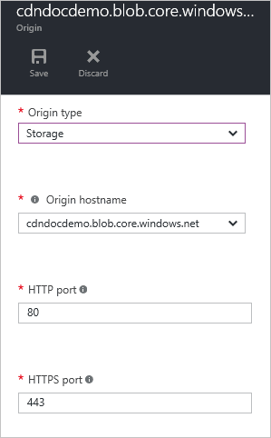
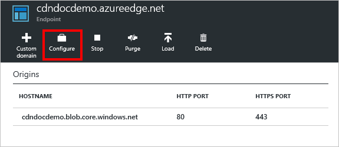
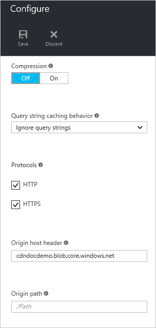

<properties
    pageTitle="Problembehandlung bei Azure CDN Endpunkte zurückgeben 404 Status | Microsoft Azure"
    description="Problembehandlung bei 404 Antwortcodes mit Azure CDN Endpunkte."
    services="cdn"
    documentationCenter=""
    authors="camsoper"
    manager="erikre"
    editor=""/>

<tags
    ms.service="cdn"
    ms.workload="tbd"
    ms.tgt_pltfrm="na"
    ms.devlang="na"
    ms.topic="article"
    ms.date="07/28/2016"
    ms.author="casoper"/>
    
# Problembehandlung bei CDN Endpunkte 404 Status zurückgeben

In diesem Artikel kann Probleme mit [CDN Endpunkte](cdn-create-new-endpoint.md) zurückgeben 404-Fehlern bei der Problembehandlung.

Wenn Sie an einer beliebigen Stelle in diesem Artikel weitere Hilfe benötigen, können Sie die Azure-Experten auf [der MSDN-Azure und den Stapelüberlauf Foren](https://azure.microsoft.com/support/forums/)kontaktieren. Alternativ können Sie auch einen Supportvorfall Azure ablegen. Wechseln Sie zur [Azure-Support-Website](https://azure.microsoft.com/support/options/) , und klicken Sie auf **Anfordern von Support**.

## Problem

Sie haben ein Profil CDN und einen Endpunkt erstellt, aber nicht der Inhalt auf das CDN verfügbar sein scheint.  Wenn Benutzer versuchen, Zugriff auf Ihre Inhalte über die URL CDN erhalten HTTP 404 Statuscodes. 

## Ursache

Es gibt verschiedene Ursachen, einschließlich:

- Ursprung der gewünschten Datei nicht angezeigt, zu dem CDN
- Der Endpunkt ist falsch konfiguriert bewirken, dass das CDN an der falschen Stelle aussehen,
- Der Host ist den Host-Header aus dem CDN ablehnen.
- Der Endpunkt noch nicht Zeit, in der gesamten das CDN verteilen hatte.

## Schritte zur Problembehandlung

> [AZURE.IMPORTANT] Nach dem Erstellen eines Endpunkts CDN, wird es sofort für verwenden, nicht verfügbar, wie es für die Registrierung dauert, bis das CDN verbreitet.  Bei <b>Azure CDN von Akamai</b> Profilen schließt Verteilung normalerweise innerhalb einer Minute ab.  Bei <b>Azure CDN von Verizon</b> Profilen Verteilung wird in der Regel innerhalb von 90 Minuten abgeschlossen, aber in einigen Fällen kann dauert länger.  Wenn Sie die Schritte in diesem Dokument ausführen und 404-Antworten weiterhin angezeigt, sollten Sie ein paar Stunden erneut vor dem Öffnen einer Support-Ticket warten.

### Überprüfen Sie die Origin-Datei

Wir sollten überprüfen Sie zunächst die, die die Datei wir Cache steht auf unserer Origin und öffentlich zugegriffen werden.  Die schnellste Möglichkeit zum erledigen ist, einen Browser in einer In Private oder Incognito Sitzung zu öffnen, und navigieren Sie direkt zu der Datei.  Nur Geben Sie oder fügen Sie die URL in das Adressfeld ein, und sehen Sie, ob, die sich ergibt in der Datei, die Sie erwarten.  In diesem Beispiel werde ich mit einer Datei, ich in einem Azure-Speicher-Konto bei barrierefreien habe `https://cdndocdemo.blob.core.windows.net/publicblob/lorem.txt`.  Wie Sie sehen können, wird den Test erfolgreich übergeben.

> [AZURE.WARNING] Dies ist, zwar die schnellste und einfachste Möglichkeit, stellen Sie sicher, dass die Datei öffentlich verfügbar ist können einige Netzwerkkonfigurationen in Ihrer Organisation Sie den Eindruck zu vermitteln, dass diese Datei öffentlich verfügbar ist, wenn es sich tatsächlich Benutzer Ihres Netzwerks nur sichtbare (auch, wenn es in Azure gehostet wird) ist.  Wenn Sie einen externen Browser verfügen, aus dem Sie, wie ein mobiles Gerät testen können, die nicht mit dem Netzwerk Ihrer Organisation oder eines virtuellen Computers in Azure verbunden ist, wäre, die beste.

### Überprüfen Sie die Ursprung-Einstellungen

Jetzt, da wir überprüft haben, dass die Datei im Internet öffentlich verfügbar ist, sollten wir unsere Origin Einstellungen überprüfen.  Im [Portal Azure](https://portal.azure.com)navigieren Sie zu Ihrem Profil CDN, und klicken Sie auf den Endpunkt, den Sie beheben sind.  Klicken Sie in das sich daraus ergebende **Endpunkt** Blade auf den Ursprung.  

Das Blade **Origin** wird angezeigt. 

#### Origin Typ und hostname

Stellen Sie sicher, dass der **Typ Origin** korrekt ist, und überprüfen Sie den **Ursprung Hostname**.  In meinem Beispiel `https://cdndocdemo.blob.core.windows.net/publicblob/lorem.txt`, ist der Hostnamenteil der URL `cdndocdemo.blob.core.windows.net`.  Wie Sie in den Screenshot sehen können, ist dies richtig.  Für Azure-Speicher, Web App und Ursprung der Cloud-Dienst ist das Feld **Origin Hostname** eine Dropdown-Liste aus, damit wir es richtig Rechtschreibung kümmern nicht.  Wenn Sie einen benutzerdefinierten Ursprung verwenden, es ist jedoch *unbedingt erforderlich* , die Ihre Hostname richtig geschrieben sind!

#### HTTP und HTTPS-ports

Note aktivieren Sie hier ist Ihre **HTTP** und **HTTPS-Ports**.  Klicken Sie in den meisten Fällen 80 und 443 korrekt sind, und Sie benötigen keine Änderungen.  Wenn der Ausgangsserver an einem anderen Anschluss abgefragt wird, müssen, die hier dargestellt werden.  Wenn Sie nicht sicher sind, prüfen Sie einfach die URL für die Datei Origin.  Als Standardprogramme Geben Sie die Angaben HTTP und HTTPS Ports 80 und 443 an. In meinem URL `https://cdndocdemo.blob.core.windows.net/publicblob/lorem.txt`, ein Port nicht angegeben ist, sodass Standard 443 davon ausgegangen, dass wird und Meine Einstellungen korrekt sind.  

Sagen Sie jedoch die URL für Ihre Origin-Datei, die Sie zuvor getestet ist `http://www.contoso.com:8080/file.txt`.  Hinweis Die `:8080` am Ende des Abschnitts Hostname.  Die zu verwendende Port Browser erfahren `8080` in Verbindung mit dem Webserver unter `www.contoso.com`, daher Sie 8080 im Feld **http-Port** eingeben müssen.  Es ist wichtig, beachten Sie, dass diese Einstellungen Port nur Einfluss auf welchen Anschluss der Endpunkt verwendet, um Informationen vom Ursprung abzurufen.

> [AZURE.NOTE] Vollständigen TCP Portbereich für Ursprung zulassen **Azure CDN von Akamai** Endpunkte nicht.  Eine Liste der Origin Ports, die nicht zulässig sind, finden Sie unter [Azure CDN von Akamai zulässige Origin Ports](https://msdn.microsoft.com/library/mt757337.aspx).  
  
### Überprüfen Sie die Einstellungen Endpunkt

Klicken Sie auf das Blade **Endpunkt** klicken Sie auf die Schaltfläche **Konfigurieren** .

Der Endpunkt des **Konfigurieren** Blade wird angezeigt.

#### Protokolle

Für **Protokolle**stellen Sie sicher, dass das von den Clients verwendete Protokoll ausgewählt ist.  Dasselbe Protokoll vom Client verwendete werden verwendet, um den Ursprung zuzugreifen, damit es wichtig ist, die Origin Ports im vorherigen Abschnitt ordnungsgemäß konfiguriert haben.  Der Endpunkt überwacht nur die standardmäßigen HTTP und HTTPS Ports (80 und 443), unabhängig von den Ursprung Ports.

Lassen Sie uns zurückkehren zur hypothetische Beispiel mit `http://www.contoso.com:8080/file.txt`.  Contoso angegeben haben, wie Sie sich erinnern können, `8080` als ihre HTTP-port, sondern auch angenommen diese angegeben `44300` als deren HTTPS-Anschluss.  Wenn sie einen Endpunkt mit dem Namen erstellt `contoso`, deren CDN Endpunkt Hostname wäre `contoso.azureedge.net`.  Eine Anforderung für `http://contoso.azureedge.net/file.txt` wird von eine HTTP-Anforderung, sodass der Endpunkt HTTP Port 8080 verwenden möchten, um ihn vom Ursprung abrufen.  Eine sichere Anforderung über HTTPS, `https://contoso.azureedge.net/file.txt`, würde den Port 44300 mit HTTPS-Endpunkt Wenn beim Abrufen der Datei aus den Ursprung.

#### Origin Host Kopfzeile

Der **Ursprung Host Kopfzeile** ist den Wert von Host Header an den Ursprung mit jeder Anforderung gesendet.  In den meisten Fällen sollte dies die **Origin Hostname** identisch sein, die wir zuvor überprüft.  Ein falscher Wert in diesem Feld wird nicht in der Regel 404 Status verursachen, aber wahrscheinlich dazu führen, dass andere 4xx Status, je nachdem, was der Ursprung erwartet.

#### Origin-Pfad

Schließlich sollten wir unsere **Origin Pfad**überprüfen.  Dies ist standardmäßig leer.  Sie sollten dieses Feld nur verwenden, wenn Sie den Ursprung gehostete Ressourcen einzugrenzen, die Sie auf das CDN zur Verfügung stellen möchten möchten.  

Beispielsweise sollte in meinem Endpunkt, alle Ressourcen auf Mein Speicherkonto verfügbar sein, damit ich **Origin Pfad** leer gelassen.  Dies bedeutet, dass eine Anforderung an `https://cdndocdemo.azureedge.net/publicblob/lorem.txt` angegeben, ergibt sich eine Verbindung von meinem Endpunkt zu `cdndocdemo.core.windows.net` anfordert, die `/publicblob/lorem.txt`.  Ebenso eine Anforderung für `https://cdndocdemo.azureedge.net/donotcache/status.png` angegeben, ergibt sich der Endpunkt anfordern `/donotcache/status.png` vom Ursprung.

Doch was passiert, wenn ich möchte nicht das CDN für jede Pfad auf Meine Origin verwenden?  Angenommen, es verfügbar machen wollten die `publicblob` Pfad.  Wenn ich auf meinem Gebiet **Origin Pfad** */publicblob* eingeben, werden, die den Endpunkt zum Einfügen von */publicblob* vor jeder Anforderung an den Ursprung verursachen.  Dies bedeutet, dass die Anfrage für `https://cdndocdemo.azureedge.net/publicblob/lorem.txt` dauert den Anforderung Teil der URL jetzt tatsächlich `/publicblob/lorem.txt`, und fügen Sie `/publicblob` an den Anfang. Das Ergebnis ist eine Anforderung für `/publicblob/publicblob/lorem.txt` vom Ursprung.  Wenn dieser Pfad auf aktuelle-Datei nicht behoben wird, gibt der Ursprung einer 404 Status zurück.  Die richtige URL zum Abrufen von lorem.txt in diesem Beispiel wäre tatsächlich `https://cdndocdemo.azureedge.net/lorem.txt`.  Beachten Sie, dass wir den Pfad */publicblob* überhaupt nicht enthalten, da der Anforderung Teil der URL ist `/lorem.txt` und addiert der Endpunkt `/publicblob`, das sich daraus ergebende in `/publicblob/lorem.txt` die Anforderung übergebene auf den Ursprung.
