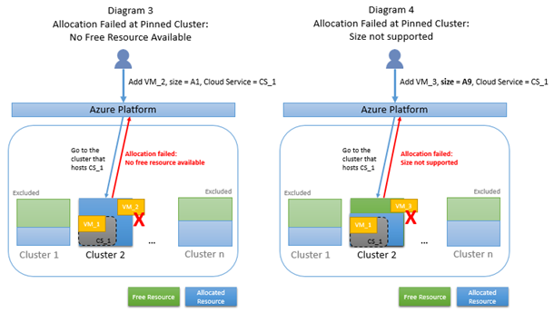

<properties
    pageTitle="Problembehandlung bei der Cloud-Dienst Zuteilung | Microsoft Azure"
    description="Problembehandlung bei der Zuteilung beim Bereitstellen von Cloud Services in Azure"
    services="azure-service-management, cloud-services"
    documentationCenter=""
    authors="simonxjx"
    manager="felixwu"
    editor=""
    tags="top-support-issue"/>

<tags
    ms.service="cloud-services"
    ms.workload="na"
    ms.tgt_pltfrm="ibiza"
    ms.devlang="na"
    ms.topic="article"
    ms.date="10/12/2016"
    ms.author="v-six"/>


# <a name="troubleshooting-allocation-failure-when-you-deploy-cloud-services-in-azure"></a>Problembehandlung bei der Zuteilung beim Bereitstellen von Cloud Services in Azure

## <a name="summary"></a>Zusammenfassung
Wenn Sie Instanzen in einen Cloud-Service bereitstellen oder neue Web oder Arbeitskollegen Rolleninstanzen hinzufügen, weist Microsoft Azure berechnen Ressourcen zu. Gelegentlich erhalten Sie Fehler beim Ausführen von diesen Vorgängen noch vor der Grenzwerte Azure-Abonnement erreichen. In diesem Artikel wird erläutert, die Ursachen für einige der häufig auftretenden Zuteilung Fehler und schlägt vor möglichen Behebung. Die Informationen können auch hilfreich sein, beim Planen der bereitstellungs Ihrer Dienste.

[AZURE.INCLUDE [support-disclaimer](../../includes/support-disclaimer.md)]

### <a name="background--how-allocation-works"></a>Hintergrund – Funktionsweise der Verteilung
Die Server in Azure Rechenzentren werden in Cluster aufgeteilt. Eine neue Serviceanfrage Zuteilung Cloud ist in mehrere Cluster übermitteln. Wenn die erste Instanz für einen Clouddienst (in entweder Staging oder Fertigung), die cloud-Dienst bereitgestellt wird, erhält an einem Cluster angeheftet. Alle weiteren Bereitstellungen für den Clouddienst tritt in demselben Cluster. In diesem Artikel werden wir auf diese verweisen, wie "an einem Cluster angeheftet". Diagramm 1 unter veranschaulicht die Groß-/Kleinschreibung von einer normalen Verteilung der versucht wird, mehrere Cluster; Diagramm 2 zeigt einen Fall einer Zuordnung, die auf Cluster 2 angehefteten hat, da dies ist, wo die vorhandenen Cloud-Dienst CS_1 gehostet wird.


### <a name="why-allocation-failure-happens"></a>Warum geschieht bei der Verteilung
Wenn eine Anforderung Zuteilung zu einem Cluster fixiert ist, besteht eine höhere Chance kostenlose Ressourcen findet, da der verfügbaren Ressourcenpool zu einem Cluster begrenzt ist. Darüber hinaus, wenn Anforderung Zuteilung zu einem Cluster fixiert ist, aber die Art der Ressource, die Sie angefordert wird durch die Cluster nicht unterstützt, Anforderung tritt auch, wenn der Cluster kostenlose hat. Diagramm 3 unter veranschaulicht der Groß-/Kleinschreibung, da nur Candidate Cluster nicht kostenlose Ressourcen verfügt, die eine fixierte Zuordnung aus. Diagramm 4 veranschaulicht den Fall, in dem eine fixierte Zuordnung schlägt fehl, da nur Candidate Cluster die angeforderten virtueller Speicher nicht unterstützt, obwohl der Cluster kostenlose Ressourcen hat.



## <a name="troubleshooting-allocation-failure-for-cloud-services"></a>Problembehandlung bei der Zuteilung für Clouddienste
### <a name="error-message"></a>Fehlermeldung
Sie wird möglicherweise die folgende Fehlermeldung angezeigt:

    "Azure operation '{operation id}' failed with code Compute.ConstrainedAllocationFailed. Details: Allocation failed; unable to satisfy constraints in request. The requested new service deployment is bound to an Affinity Group, or it targets a Virtual Network, or there is an existing deployment under this hosted service. Any of these conditions constrains the new deployment to specific Azure resources. Please retry later or try reducing the VM size or number of role instances. Alternatively, if possible, remove the aforementioned constraints or try deploying to a different region."

### <a name="common-issues"></a>Allgemeine Probleme
Hier sind die allgemeine Zuteilung Szenarien, die dazu führen, dass eine Anforderung Zuteilung zu einem einzelnen Cluster fixiert werden.

- Bereitstellen auf Staging Slot - hat ein Clouddienst eine Bereitstellung im entweder Slot, ist Klicken Sie dann der gesamte Cloud-Dienst zu einem bestimmten Cluster fixiert.  Dies bedeutet, dass wenn im Slot Herstellung eine Bereitstellung bereits vorhanden ist, klicken Sie dann eine neue staging Bereitstellung nur im selben Cluster als der Herstellung Slot zugeordnet werden kann. Wenn der Cluster Kapazität ist fast, möglicherweise die Anforderung fehl.

- Im selben Cluster muss dieselbe Skalierung – Hinzufügen von neuen Instanzen zu einem vorhandenen Clouddienst zugewiesen werden.  KKLEINSTE Skalierung Besprechungsanfragen in der Regel zugewiesen werden kann, aber nicht immer. Wenn der Cluster Kapazität ist fast, möglicherweise die Anforderung fehl.

- Zugehörigkeit Gruppe - kann der Textur in eine beliebige Cluster in diesem Bereich, indem Sie eine neue Bereitstellung in einer leeren Cloud-Service zugeordnet werden, es sei denn, der Cloud-Dienst zu einer Gruppe Zugehörigkeit fixiert ist. Bereitstellungen in derselben Gruppe Zugehörigkeit werden versucht, auf den gleichen Cluster. Wenn der Cluster Kapazität ist fast, möglicherweise die Anforderung fehl.

- Zugehörigkeit Gruppe vNet - ältere virtuelle Netzwerke Zugehörigkeit Gruppen statt Regionen verknüpft wurden, und Cloud Services in diese virtuelle Netzwerke zum Cluster Zugehörigkeit Gruppe fixiert werden möchten. Auf diese Art von virtuellen Netzwerk Bereitstellungen werden versucht, auf dem angehefteten Cluster. Wenn der Cluster Kapazität ist fast, möglicherweise die Anforderung fehl.

## <a name="solutions"></a>Lösungen

1. Erneut bereitstellen, um einen neuen Clouddienst – diese Lösung ist besonders erfolgreicher, wie dies zulässt, dass die Plattform in alle Cluster in diesem Bereich auswählen.

    - Bereitstellen von die Arbeitsbelastung für einen neuen Clouddienst  

    - Aktualisieren der CNAME-Eintrag oder einen Datensatz verknüpft den Datenverkehr auf den neuen Clouddienst

    - Nachdem NULL Datenverkehr an der alten Website geht, können Sie den alten Clouddienst löschen. Diese Lösung sollte keine Ausfallzeiten anfallen.

2. Löschen der Herstellung sowohl das staging Steckplätze – diese Lösung wird beibehalten der vorhandenen DNS-Name, jedoch werden kommt es an Ihrer Anwendung.

    - Löschen der Herstellung und staging-Felder einen vorhandenen Clouddienst, sodass die Cloud-Dienst leer ist, und klicken Sie dann

    - Erstellen Sie eine neue Bereitstellung in vorhandenen Cloud-Dienst an. Dies wird mit der Zuweisung auf alle Cluster in der Region erneut versuchen. Stellen Sie sicher, dass die Cloud-Dienst nicht mit einer Gruppe Zugehörigkeit verknüpft ist.

3. Reservierte IP - beibehalten dieser Lösung Ihre vorhandene IP-Adresse, jedoch werden kommt es an Ihrer Anwendung.  

    - Erstellen einer reservierte IP-Adressen für eine vorhandene Bereitstellung mithilfe der Powershell

    ```
    New-AzureReservedIP -ReservedIPName {new reserved IP name} -Location {location} -ServiceName {existing service name}
    ```

    - Führen Sie die #2 von oberhalb, wofür Sie die neue reservierte IP-Adressen in des Diensts CSCFG angeben.

4. Entfernen Sie Zugehörigkeit Gruppe für die Bereitstellung neuer - Gruppen die werden nicht mehr empfohlen. Führen Sie die Schritte für #1 oben aus, um einen neuen Clouddienst bereitstellen. Stellen Sie sicher, Cloud-Dienst nicht in einer Gruppe Zugehörigkeit ist.

5. Konvertieren Sie in einem regionalen virtuelle Netzwerk - finden Sie unter [Migrieren von Gruppen die zu einem regionalen virtuellen Netzwerk (VNet)](../virtual-network/virtual-networks-migrate-to-regional-vnet.md).
