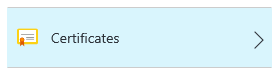
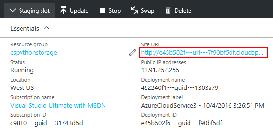
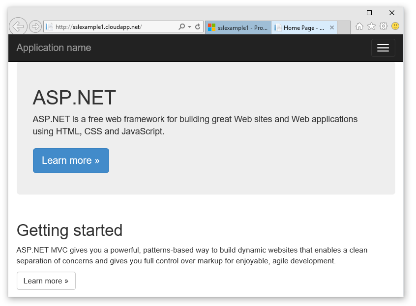

<properties 
    pageTitle="Konfigurieren von SSL für einen Clouddienst | Microsoft Azure" 
    description="Erfahren Sie, wie einen HTTPS-Endpunkt für eine Webrolle angeben und wie Sie ein SSL-Zertifikat zur Sicherung Ihrer Anwendung hochladen. In diesen Beispielen wird das Azure-Portal." 
    services="cloud-services" 
    documentationCenter=".net" 
    authors="Thraka" 
    manager="timlt" 
    editor=""/>

<tags 
    ms.service="cloud-services" 
    ms.workload="tbd" 
    ms.tgt_pltfrm="na" 
    ms.devlang="na" 
    ms.topic="article" 
    ms.date="10/04/2016"
    ms.author="adegeo"/>

# Konfigurieren von SSL für eine Anwendung in Azure

> [AZURE.SELECTOR]
- [Azure-portal](cloud-services-configure-ssl-certificate-portal.md)
- [Azure klassischen-portal](cloud-services-configure-ssl-certificate.md)

Secure Sockets Layer (SSL) Verschlüsselung ist die am häufigsten verwendete Methode zum Sichern von Daten über das Internet gesendet. Diese Aufgabe wird erläutert, wie einen HTTPS-Endpunkt für eine Webrolle angeben und wie Sie ein SSL-Zertifikat zur Sicherung Ihrer Anwendung hochladen.

> [AZURE.NOTE] Die Verfahren in dieser Aufgabe gelten für Azure Cloud Services. App-Dienste finden Sie unter [diese](../app-service-web/web-sites-configure-ssl-certificate.md).

Diese Aufgabe wird eine Herstellung Bereitstellung verwendet; Informationen zum Verwenden einer staging bereitstellungs erfolgt am Ende dieses Themas.

Lesen Sie [diese](cloud-services-how-to-create-deploy-portal.md) zuerst, wenn Sie keinen noch einen Clouddienst erstellt.

[AZURE.INCLUDE [websites-cloud-services-css-guided-walkthrough](../../includes/websites-cloud-services-css-guided-walkthrough.md)]

## Schritt 1: Abrufen eines SSL-Zertifikats

Zum Konfigurieren von SSL für eine Anwendung, müssen Sie zuerst ein SSL-Zertifikat abrufen, die von einer Zertifizierungsstelle (CA), einer vertrauenswürdigen Drittanbieter signiert wurden, die für diesen Zweck Zertifikate mit. Wenn Sie nicht bereits eine verfügen, müssen Sie eine aus einem Unternehmen zu erhalten, die SSL-Zertifikate verkauft.

Das Zertifikat muss die folgenden SSL-Zertifikate in Azure erfüllen:

-   Das Zertifikat muss einen privaten Schlüssel enthalten.
-   Das Zertifikat muss für Key Exchange, exportiert in eine Datei Personal Information Exchange (PFX-Datei) erstellt werden.
-   Der Name des Zertifikats Betreff muss die Zugriff auf die Clouddienst verwendete Domäne übereinstimmen. Sie können kein SSL-Zertifikat von einer Zertifizierungsstelle (CA) für die Domäne cloudapp.net beziehen. Müssen Sie einen benutzerdefinierten Domänennamen zu verwenden, wenn erwerben des Diensts zugreifen. Wenn Sie ein Zertifikat von einer Zertifizierungsstelle anfordern muss der Name des Zertifikats Betreff des benutzerdefinierten Domänennamens verwendet, um die Anwendung zugreifen übereinstimmen. Beispielsweise ist Ihr benutzerdefinierter Domänenname **"contoso.com"** Sie möchten ein Zertifikat anfordern von Ihrer Zertifizierungsstelle für * **. "contoso.com"** oder * *www.contoso.com**.
-   Das Zertifikat muss mindestens 2048-Bit-Verschlüsselung verwenden.

Testzwecken können Sie [Erstellen](cloud-services-certs-create.md) und verwenden Sie ein selbst signiertes Zertifikat. Ein selbst signiertes Zertifikat ist nicht durch eine Zertifizierungsstelle authentifiziert und die cloudapp.net Domäne als die Website-URL verwenden kann. Beispielsweise verwendet der folgenden Vorgang ein selbst signiertes Zertifikat, in dem der allgemeine Name (CN) im Zertifikat verwendet **sslexample.cloudapp.net**ist.

Als Nächstes müssen Sie Informationen über das Zertifikat in Ihrem Dienst und die Dateien für Dienst Konfiguration einschließen.

## Schritt 2: Ändern der Definition und Konfiguration Service-Dateien

Ihrer Anwendung muss konfiguriert werden, um das Zertifikat verwenden und ein HTTPS-Endpunkt hinzugefügt werden muss. Daher müssen den Dienst und die Dateien für Dienst Konfiguration aktualisiert werden.

1.  Öffnen Sie in Ihrer Entwicklungsumgebung der Definition Dienstdatei (CSDEF), fügen Sie einen Abschnitt **Zertifikate** innerhalb des Abschnitts **WebRole** und enthalten Sie die folgende Informationen über das Zertifikat (und mittlere Zertifikate):

        <WebRole name="CertificateTesting" vmsize="Small">
        ...
            <Certificates>
                <Certificate name="SampleCertificate" 
                             storeLocation="LocalMachine" 
                             storeName="My"
                             permissionLevel="limitedOrElevated" />
                <!-- IMPORTANT! Unless your certificate is either
                self-signed or signed directly by the CA root, you
                must include all the intermediate certificates
                here. You must list them here, even if they are
                not bound to any endpoints. Failing to list any of
                the intermediate certificates may cause hard-to-reproduce
                interoperability problems on some clients.-->
                <Certificate name="CAForSampleCertificate"
                             storeLocation="LocalMachine"
                             storeName="CA"
                             permissionLevel="limitedOrElevated" />
            </Certificates>
        ...
        </WebRole>

    Im Abschnitt **Zertifikate** definiert den Namen des unsere Zertifikat, die Position und den Namen des Speichers, in dem sie gespeichert ist.
    
    Berechtigungen (`permisionLevel` Attribut) auf eine der folgenden Optionen festgelegt werden können:

  	| Berechtigungswert  | Beschreibung |
  	| ----------------  | ----------- |
  	| limitedOrElevated | **(Standard)** Alle Rolle Prozesse können den privaten Schlüssel zuzugreifen. |
  	| erhöhten          | Nur erweiterte Prozesse können den privaten Schlüssel zuzugreifen.|

2.  Fügen Sie ein Element **InputEndpoint** innerhalb des Abschnitts **Endpunkte** HTTPS aktivieren in der Definition Ihrer Dienstdatei hinzu:

        <WebRole name="CertificateTesting" vmsize="Small">
        ...
            <Endpoints>
                <InputEndpoint name="HttpsIn" protocol="https" port="443" 
                    certificate="SampleCertificate" />
            </Endpoints>
        ...
        </WebRole>

3.  Fügen Sie ein Element **binden** innerhalb des Abschnitts **Websites** in der Definition Ihrer Dienstdatei hinzu. Dadurch wird eine HTTPS-Bindung zuordnen den Endpunkt zu Ihrer Website hinzugefügt:

        <WebRole name="CertificateTesting" vmsize="Small">
        ...
            <Sites>
                <Site name="Web">
                    <Bindings>
                        <Binding name="HttpsIn" endpointName="HttpsIn" />
                    </Bindings>
                </Site>
            </Sites>
        ...
        </WebRole>

    Alle über die erforderlichen Änderungen an der Definition Dienstdatei abgeschlossen sind, müssen Sie jedoch weiterhin Zertifikatinformationen zur Konfigurationsdatei hinzufügen.

4.  Fügen Sie einen Abschnitt **Zertifikate** innerhalb der **Rolle** im Abschnitt den Stichprobe Fingerabdruckwert, der das Zertifikat abgebildet ersetzen in Ihrem Dienstkonfigurationsdatei (CSCFG), ServiceConfiguration.Cloud.cscfg hinzu:

        <Role name="Deployment">
        ...
            <Certificates>
                <Certificate name="SampleCertificate" 
                    thumbprint="9427befa18ec6865a9ebdc79d4c38de50e6316ff" 
                    thumbprintAlgorithm="sha1" />
                <Certificate name="CAForSampleCertificate"
                    thumbprint="79d4c38de50e6316ff9427befa18ec6865a9ebdc" 
                    thumbprintAlgorithm="sha1" />
            </Certificates>
        ...
        </Role>

(Im Beispiel oben **sha1** für den Algorithmus Fingerabdruck verwendet. Geben Sie den entsprechenden Wert für Ihr Zertifikatsname Fingerabdruck Algorithmus).

Jetzt, da der Dienst und die Dateien für Dienst Konfiguration aktualisiert wurden, Verpacken der bereitstellungs für das Hochladen in Azure. Wenn Sie **Cspack**verwenden, verwenden Sie nicht die Kennzeichnung **/generateConfigurationFile** , wie die Zertifikatinformationen überschrieben werden, die Sie soeben eingefügt.

## Schritt 3: Hochladen eines Zertifikats

Verbinden mit dem Portal und...

1. Wählen Sie im Portal aus der Cloud-Dienst, wählen Sie den **Cloud-Dienst**. (Dies ist im Abschnitt **alle Ressourcen** ). 
    
    

2. Klicken Sie auf **Zertifikate**.

    

3. Geben Sie die **Datei**, **Ihr Kennwort ein**, und klicken Sie auf **Hochladen**.

## Schritt 4: Verbinden Sie mit der Rolleninstanz mithilfe von HTTPS

Nachdem Sie nun eine Bereitstellung in Azure einsatzbereit ist, können Sie damit mit HTTPS verbinden.
    
1.  Klicken Sie auf die **URL der Website** , um den Webbrowser zu öffnen.

    

2.  Ändern Sie den Link, um die Verwendung von **Https** anstelle von **http**in Ihrem Webbrowser, und gehen Sie auf der Seite.

    >[AZURE.NOTE] Wenn Sie ein selbst signiertes Zertifikat, wenn Sie einen HTTPS-Endpunkt suchen, die das selbst signierte Zertifikat zugeordnet ist verwenden Sie einen Zertifikatfehler können im Browser angezeigt. Verwenden ein Zertifikat von einer vertrauenswürdigen Zertifizierungsstelle signiert wurden, wird dieses Problem beseitigt; in der Zwischenzeit können Sie den Fehler ignorieren. (Eine weitere Möglichkeit ist so selbst signierten Zertifikats im Speicher des Benutzers vertrauenswürdigen Zertifizierungsstelle Zertifikat hinzu.)

    

    >[AZURE.TIP] Wenn Sie SSL für eine staging Bereitstellung anstelle einer Herstellung Bereitstellung verwenden möchten, müssen Sie zuerst die URL für das staging Bereitstellung verwendet zu ermitteln. Nachdem Sie Ihre Cloud-Dienst bereitgestellt wurde, wird die URL der staging-Umgebung durch die **Bereitstellung ID** GUID in diesem Format bestimmt:`https://deployment-id.cloudapp.net/`  
      
    >Erstellen Sie ein Zertifikat mit dem gemeinsamen Namen (CN) gleich der GUID-basierte URL (beispielsweise **328187776e774ceda8fc57609d404462.cloudapp.net**). Führen Sie im Portal, um das Zertifikat zu Ihrem bereitgestellte Clouddienst hinzuzufügen. Klicken Sie dann die Zertifikatinformationen auf Ihre Dateien CSDEF und CSCFG hinzufügen, Packen Sie die Anwendung neu und Aktualisieren Ihrer gestaffelten Bereitstellung, um das neue Paket verwenden.

## Nächste Schritte

* [Allgemeine Konfiguration von Ihrem Cloud-Dienst](cloud-services-how-to-configure-portal.md).
* Erfahren Sie, wie [einen Cloud-Dienst bereitgestellt](cloud-services-how-to-create-deploy-portal.md).
* Konfigurieren Sie einen [benutzerdefinierten Domänennamen](cloud-services-custom-domain-name-portal.md)ein.
* [Verwalten der Cloud-Dienst](cloud-services-how-to-manage-portal.md).
