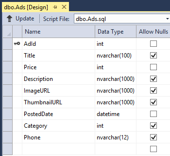
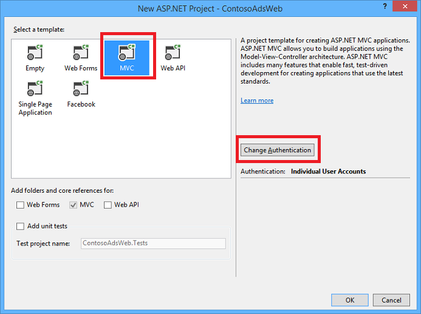
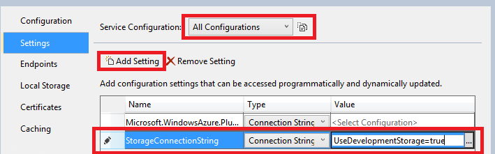

<properties
    pageTitle="Erste Schritte mit Azure Cloud Services and ASP.NET | Microsoft Azure"
    description="Informationen Sie zum Erstellen einer mit mehreren Ebenen app ASP.NET-MVC und Azure verwenden. Die app, die in einen Cloud-Dienst mit Webrolle und Worker-Rolle ausgeführt wird. Entität Framework, SQL-Datenbank und Azure-Speicher Warteschlangen und Blobs verwendet."
    services="cloud-services, storage"
    documentationCenter=".net"
    authors="Thraka"
    manager="timlt"
    editor=""/>

<tags
    ms.service="cloud-services"
    ms.workload="tbd"
    ms.tgt_pltfrm="na"
    ms.devlang="dotnet"
    ms.topic="hero-article"
    ms.date="06/10/2016"
    ms.author="adegeo"/>

# <a name="get-started-with-azure-cloud-services-and-aspnet"></a>Erste Schritte mit Azure-Cloud-Dienste und ASP.NET

> [AZURE.SELECTOR]
- [Node.js](cloud-services-nodejs-develop-deploy-app.md)
- [.NET](cloud-services-dotnet-get-started.md)

## <a name="overview"></a>(Übersicht)

In diesem Lernprogramm erfahren zum Erstellen einer .NET-Anwendungs mit mehreren Ebenen mit einer ASP.NET-MVC-Front-End- und es in eine [Azure-Cloud-Dienst](cloud-services-choose-me.md)bereitstellen. Die Anwendung verwendet [Azure SQL-Datenbank](http://msdn.microsoft.com/library/azure/ee336279), die [Azure Blob-Dienst](http://www.asp.net/aspnet/overview/developing-apps-with-windows-azure/building-real-world-cloud-apps-with-windows-azure/unstructured-blob-storage)und der [Warteschlange Azure Service](http://www.asp.net/aspnet/overview/developing-apps-with-windows-azure/building-real-world-cloud-apps-with-windows-azure/queue-centric-work-pattern). Sie können auf der MSDN Code Gallery [herunterladen das Visual Studio-Projekt](http://code.msdn.microsoft.com/Simple-Azure-Cloud-Service-e01df2e4) .

Das Lernprogramm erfahren Sie, wie das Erstellen, und führen Sie die Anwendung lokal, wie in Azure bereitzustellen, und führen Sie in der Cloud und schließlich wie sie ganz neu erstellen. Durch Erstellen von Grund auf neu beginnen können und dann führen Sie den Test und danach Schritte bereitstellen, wenn Sie es vorziehen.

## <a name="contoso-ads-application"></a>Anzeigen von Contoso-Anwendung

Die Anwendung ist ein Bulletinboard Werbung. Benutzer erstellen eine Ad durch Eingeben von Text und ein Bild hochladen. Sie können eine Liste der anzeigen mit Miniaturansichten finden Sie unter, und das Bild Vollbild angezeigt, wenn sie eine Ad die Details auswählen.


Die Anwendung mithilfe des [Warteschlange reduzierte Arbeit Muster](http://www.asp.net/aspnet/overview/developing-apps-with-windows-azure/building-real-world-cloud-apps-with-windows-azure/queue-centric-work-pattern) verteilen die Arbeit CPU-Auslastung des Erstellens Miniaturansichten an einen Back-End-Prozess.

## <a name="alternative-architecture-websites-and-webjobs"></a>Alternative Architektur: Websites und WebJobs

In diesem Lernprogramm erfahren Ausführen von Front-End- und Back-End in einer Azure-Cloud-Dienst. Eine Alternative ist, führen Sie die Front-End-in eine [Azure-Website](/services/web-sites/) , und verwenden das Feature [WebJobs](http://go.microsoft.com/fwlink/?LinkId=390226) (aktuell in der Seitenansicht) für die Back-End. Ein Lernprogramm, die WebJobs verwendet wird, finden Sie unter [Erste Schritte mit der Azure WebJobs SDK](../app-service-web/websites-dotnet-webjobs-sdk-get-started.md). Informationen dazu, wie die Dienste aus, die Ihrem Szenario am besten passt, finden Sie unter [Azure Websites, Cloud-Diensten und virtuellen Computern Vergleich](../app-service-web/choose-web-site-cloud-service-vm.md).

## <a name="what-youll-learn"></a>Sie erfahren

* Wie Sie Ihrem Computer für die Entwicklung von Azure aktivieren, indem Sie die Installation von Azure SDK.
* Informationen zum Projekt ein Visual Studio-Cloud-Dienst mit einer ASP.NET-MVC Webrolle und eine Worker-Rolle erstellen.
* Wie der Projekt für den Cloud-Dienst lokal getestet mit Azure Speicheremulator.
* Informationen zum Veröffentlichen des Projekts Cloud einer Azure-Cloud-Dienst und den Test mit einem Konto Azure-Speicher.
* Informationen zum Hochladen von Dateien und Azure BLOB-Dienst zu speichern.
* So verwenden Sie den Azure Warteschlange-Dienst für die Kommunikation zwischen Ebenen.

## <a name="prerequisites"></a>Erforderliche Komponenten

Das Lernprogramm wird davon ausgegangen, dass Sie [grundlegende Konzepte zur Azure-Cloud-Diensten](cloud-services-choose-me.md) wie *Webrolle* und *Worker-Rolle* Terminologie vertraut sein.  Außerdem wird davon ausgegangen, dass Sie wissen, wie mit [ASP.NET-MVC](http://www.asp.net/mvc/tutorials/mvc-5/introduction/getting-started) oder [Web Forms](http://www.asp.net/web-forms/tutorials/aspnet-45/getting-started-with-aspnet-45-web-forms/introduction-and-overview) Projekten in Visual Studio entwickelt. Die Anwendung Stichprobe verwendet MVC, aber die meisten des Lernprogramms gilt auch für Web Forms.

Sie können die app lokal ohne ein Azure-Abonnement ausführen, aber Sie benötigen einen zum Bereitstellen der Anwendung in der Cloud. Wenn Sie kein Konto haben, können Sie [die Vorteile Ihres MSDN-Abonnent aktivieren](/pricing/member-offers/msdn-benefits-details/?WT.mc_id=A55E3C668) , oder [Melden Sie sich für eine kostenlose Testversion](/pricing/free-trial/?WT.mc_id=A55E3C668)an.

Die zusammengehörenden Anweisungen nicht mit einer der folgenden Produkte:

* Visual Studio 2013
* Visual Studio 2015

Wenn Sie eine der folgenden besitzen, wird Visual Studio 2015 bei der Installation des SDK Azure automatisch installiert.

## <a name="application-architecture"></a>Architektur der Anwendung

Die app speichert Werbung in einer SQL-Datenbank mit Tabellen erstellen und die Daten Entität Framework Code First. Die Datenbank speichert für jede Anzeige zwei URLs, eine für die Bilder in voller Größe und eine für die Miniaturansicht.



Wenn ein Benutzer ein Bild hochgeladen wird, der Front-End-Ausführung in einer Webrolle speichert das Bild in einem [Azure BLOB-](http://www.asp.net/aspnet/overview/developing-apps-with-windows-azure/building-real-world-cloud-apps-with-windows-azure/unstructured-blob-storage), und es speichert die Ad-Informationen in der Datenbank mit einer URL, die auf die Blob verweist. Zur gleichen Zeit eine Nachricht in einem Azure Warteschlange geschrieben. Ein Back-End-Prozess regelmäßig in eine Worker-Rolle ausführen fragt die Warteschlange für neue Nachrichten. Wenn eine neue Nachricht angezeigt wird, wird Worker-Rolle für dieses Bild eine Miniaturansicht erstellt und im Miniaturansichtsbereich Datenbankfeld URL für die Anzeige aktualisiert. Das folgende Diagramm veranschaulicht, wie die Teile der Anwendung interagieren.


[AZURE.INCLUDE [install-sdk](../../includes/install-sdk-2015-2013.md)]

## <a name="download-and-run-the-completed-solution"></a>Herunterladen und Ausführen der fertigen Lösung

1. Herunter, und Entzippen Sie ihn der [Lösung abgeschlossen](http://code.msdn.microsoft.com/Simple-Azure-Cloud-Service-e01df2e4).

2. Starten Sie Visual Studio.

3. Wählen Sie über das Menü **Datei** **Project öffnen**, navigieren Sie zu der Stelle, an der Sie die Lösung heruntergeladen haben, und öffnen Sie die Lösungsdatei.

3. Drücken Sie STRG + UMSCHALT + B, um die Lösung zu erstellen.

    Standardmäßig stellt Visual Studio automatisch die NuGet einschließen von Inhalten, die nicht in der *ZIP-* Datei eingefügt wurde. Wenn die Pakete wiederherstellen nicht, installieren Sie sie manuell durch wechseln zum im Dialogfeld **NuGet-Pakete verwalten, für die Lösung** , und klicken auf die Schaltfläche **Wiederherstellen** oben rechts.

3. **Lösung-Explorer**stellen Sie sicher, dass **ContosoAdsCloudService** als die Startprojekt ausgewählt ist.

2. Wenn Sie Visual Studio 2015 verwenden, ändern Sie die SQL Server-Verbindungszeichenfolge in *der Anwendung Webkonfigurationsdatei des Projekts ContosoAdsWeb* und in der Datei *ServiceConfiguration.Local.cscfg* des Projekts ContosoAdsCloudService. Ändern Sie in jedem Fall "(Localdb) \v11.0" in "(Localdb) \MSSQLLocalDB" ein.

1. Drücken Sie STRG + F5, um die Anwendung ausführen.

    Wenn Sie ein Projekt Cloud-Dienst lokal ausführen, ruft Visual Studio automatisch die Azure *Emulator zu berechnen* und Azure *Speicheremulator*. Die Serveremulator verwendet Ressourcen auf dem Computer, um die Web-Rolle und Worker Rolle Umgebungen simulieren. Speicheremulator verwendet eine Datenbank von [SQL Server Express LocalDB](http://msdn.microsoft.com/library/hh510202.aspx) Azure-Cloud-Speicher simulieren.

    Zum ersten Mal, wenn, das Sie ein Projekt Cloud-Dienst ausführen, dauert es eine Minute um oder dies für die Emulatoren zu starten. Wenn Emulator Start abgeschlossen ist, wird der Standardbrowser zur Startseite Anwendung geöffnet.

    

2. Klicken Sie auf **eine Ad erstellen**.

2. Geben Sie einiger Testdaten und wählen Sie eine *JPG* -Bild hochladen aus, und klicken Sie dann auf **Erstellen**.

    

    Die app wechselt zur Seite Index, aber es nicht für die neue Anzeige eine Miniaturansicht angezeigt, da die Verarbeitung nicht noch nicht geschehen.

3. Warten Sie einen Moment, und aktualisieren Sie die Index-Seite, um die Miniaturansicht anzeigen möchten.

    

4. Klicken Sie auf **Details** für Ihre Anzeige um das Bild in voller Größe anzuzeigen.

    

Sie haben die Anwendung vollständig auf dem lokalen Computer, mit dem keine Verbindung mit der Cloud ausgeführt wurde. Speicheremulator speichert die Warteschlange und Blob-Daten in einer SQL Server Express LocalDB Datenbank, und die Anwendung speichert die Ad-Daten in einer anderen LocalDB Datenbank. Entität Framework Code First erstellt automatisch die Ad-Datenbank zum ersten Mal das Web-app versucht, darauf zuzugreifen.

Im folgenden Abschnitt erhalten Sie konfigurieren die Lösung um Azure-Cloud-Ressourcen für Warteschlangen, Blobs und der Anwendungsdatenbank verwenden, wenn sie in der Cloud ausgeführt wird. Wenn Sie weiterhin lokal ausgeführt werden, aber die Cloud-Speicher und Ressourcen verwenden möchten, können Sie dies tun; Es ist nur eine Frage der Einstellung Verbindungszeichenfolgen, da diese Sie Vorgehensweise sehen.

## <a name="deploy-the-application-to-azure"></a>In Azure bereitzustellen

Sie können die folgenden Schritte aus, um die Anwendung auszuführen, in der Cloud Aktionen ausführen:

* Erstellen eines Azure-Cloud-Diensts an.
* Erstellen einer SQL Azure-Datenbank.
* Erstellen Sie ein Konto Azure-Speicher.
* Konfigurieren Sie die Lösung, um die SQL Azure-Datenbank zu verwenden, wenn es in Azure ausgeführt wird.
* Konfigurieren Sie die Lösung, um Ihr Konto Azure-Speicher zu verwenden, wenn es in Azure ausgeführt wird.
* Bereitstellen des Projekts an den Azure-Cloud-Dienst an.

### <a name="create-an-azure-cloud-service"></a>Erstellen eines Azure-Cloud-Diensts

Ein Azure-Cloud-Dienst ist der Umgebung, die die Anwendung in ausgeführt wird.

1. Öffnen Sie in Ihrem Browser das [Azure klassischen Portal](http://manage.windowsazure.com)aus.

2. Klicken Sie auf **Neu > berechnen > Cloud-Dienst > Quick erstellen**.

4. Geben Sie im Eingabefeld URL ein URL-Präfix ein.

    Diese URL muss eindeutig sein.  Sie erhalten eine Fehlermeldung angezeigt, wenn das Präfix ausgewählt haben bereits von jemand anderem verwendet wird.

5. Wählen Sie den Bereich, in dem Sie die Anwendung bereitstellen möchten.

    Dieses Feld gibt an, welche Datacenter in der Cloud-Dienst gehostet wird. Für eine Anwendung Herstellung wählen Sie Ihre Region an Ihre Kunden. Wählen Sie Ihre Region, die Sie für dieses Lernprogramm aus.

6. Klicken Sie auf die **Cloud-Dienst erstellen**.

    In der folgenden Abbildung wird ein Cloud-Dienst mit der URL contosoads.cloudapp.net erstellt.

    

### <a name="create-an-azure-sql-database"></a>Erstellen einer SQL Azure-Datenbank

Wenn die app in der Cloud ausgeführt wird, wird eine Datenbank cloudbasierten verwendet.

1. Klicken Sie im [Azure klassischen Portal](http://manage.windowsazure.com)auf **Neu > Data Services > SQL-Datenbank > Symbolleiste erstellen**.

1. Geben Sie in das Feld **Datenbankname** *Contosoads*aus.

1. Wählen Sie aus der Dropdownliste **Server** **neue SQL-Datenbankserver**an.

    Alternativ weist Ihr Abonnement bereits auf einen Server, können Sie diesen Server aus der Dropdownliste auswählen.

1. Wählen Sie den gleichen **Region** , die Sie für den Clouddienst ignoriert.

    Wenn die Cloud-Dienst und die Datenbank in verschiedenen Rechenzentren sind (verschiedener Regionen) Wartezeit vergrößern wird und Sie außerhalb des Data Center Bandbreite berechnet werden. Die Bandbreite in einem Data Center ist kostenlos.

1. Geben Sie einen Administrator **Benutzernamen** und **ein Kennwort**ein.

    Wenn Sie **neue SQL-Datenbankserver** , die Sie einer vorhandenen Namen und das Kennwort hier eingeben werden nicht ausgewählt haben, sind Sie eingeben, einen neuen Namen und das Kennwort, das Sie jetzt definieren, für die spätere Verwendung beim Zugriff auf der Datenbank. Wenn Sie einen Server ausgewählt haben, den Sie zuvor erstellt haben, werden Sie für das Kennwort für das Benutzerkonto Administratorrechte aufgefordert Sie bereits erstellt haben.

1. Klicken Sie auf **SQL-Datenbank zu erstellen**.

    

1. Nachdem Azure abgeschlossen ist, die Datenbank zu erstellen, klicken Sie auf der Registerkarte **SQL-Datenbanken** im linken Bereich des Portals, und klicken Sie dann auf den Namen der neuen Datenbank.

2. Klicken Sie auf die Registerkarte **Dashboard** .

3. Klicken Sie auf **Verwalten zugelassene IP-Adressen**.

4. Ändern Sie unter **Zulässige Services** **Azure Services** auf **Ja**.

5. Klicken Sie auf **Speichern**.

### <a name="create-an-azure-storage-account"></a>Erstellen Sie ein Konto Azure-Speicher

Ein Konto Azure-Speicher stellt Ressourcen für Warteschlange und Blob-Daten in der Cloud zu speichern.

In einer realen Anwendung würden Sie normalerweise getrennte Konten für die Anwendung, dass die Daten im Vergleich zu Protokollierungsdaten und separaten ausmacht Testdaten im Vergleich zu Daten erstellen. In diesem Lernprogramm verwenden Sie nur eine Konto.

1. Klicken Sie im [Azure klassischen Portal](http://manage.windowsazure.com)auf **Neu > Data Services > Speicher > Symbolleiste erstellen**.

4. Geben Sie im Feld **URL** ein URL-Präfix ein.

    Dieses Präfix und den Text, den Sie finden Sie unter dem Feld wird der eindeutige URL mit Ihrem Speicherkonto sein. Wenn das Präfix eingegebene bereits von einer anderen Person verwendet wurde, müssen Sie ein anderes Präfix auswählen.

5. Legen Sie die Dropdownliste **Region** auf den Bereich, den Sie für die Cloud-Dienst ausgewählt haben.

    Wenn das Cloud-Dienst und Speicher Konto sind in verschiedenen Rechenzentren (verschiedener Regionen) Wartezeit vergrößern wird und Sie außerhalb des Data Center Bandbreite berechnet werden. Die Bandbreite in einem Data Center ist kostenlos.

    Gruppen die Azure bieten ein Verfahren, um den Abstand zwischen Ressourcen in einem Data Center, minimieren, wodurch Wartezeit reduziert werden können. In diesem Lernprogramm werden keine Gruppen verwendet. Weitere Informationen finden Sie unter [So erstellen Sie eine Gruppe Zugehörigkeit in Azure](http://msdn.microsoft.com/library/jj156209.aspx).

6. Legen Sie die Dropdownliste **Replikation** auf **lokal redundante**ein.

    Wenn Geo-Replikation für ein Speicherkonto aktiviert ist, wird in einem sekundären Datencenter Failover zu diesem Speicherort bei einem umfassenden Datenverlust primärer Speicherort aktivieren gespeicherten Inhalts repliziert. Geo-Replikation kann zusätzliche Kosten entstehen. Für Test- und Konten möchten Sie nicht im Allgemeinen Geo-Replikation bezahlen. Weitere Informationen finden Sie unter [erstellen, verwalten oder Löschen eines Kontos Speicher](../storage/storage-create-storage-account.md#replication-options).

5. Klicken Sie auf **Speicher-Konto erstellen**.

    

    Im Bild, ein Speicherkonto wird mit der URL erstellt `contosoads.core.windows.net`.

### <a name="configure-the-solution-to-use-your-azure-sql-database-when-it-runs-in-azure"></a>Konfigurieren Sie die Lösung, um die SQL Azure-Datenbank zu verwenden, wenn es in Azure ausgeführt wird

Die Project Web und Worker Rolle Projekt verfügt über eine eigene Datenbankverbindungszeichenfolge, und jede muss mit der SQL Azure-Datenbank verknüpft werden soll, wenn die app in Azure ausgeführt wird.

Sie erhalten eine [Web.config transformieren](http://www.asp.net/mvc/tutorials/deployment/visual-studio-web-deployment/web-config-transformations) für die Web-Rolle und eine Cloud Service-Umgebung, die Einstellung für die Worker-Rolle verwenden.

>[AZURE.NOTE] In diesem Abschnitt und im nächsten Abschnitt Anmeldeinformationen in Project-Dateien gespeichert. [Nicht sensible Daten in öffentlichen Quellcode-Repositorys zu speichern](http://www.asp.net/aspnet/overview/developing-apps-with-windows-azure/building-real-world-cloud-apps-with-windows-azure/source-control#secrets).

1. Im Projekt ContosoAdsWeb, öffnen Sie die Datei *Web.Release.config* Transformation, für die Anwendung *Web.config* -Datei, und löschen Sie den Kommentarblock mit einem `<connectionStrings>` Element, und fügen Sie die folgenden code an ihrer Stelle.

    ```xml
    <connectionStrings>
        <add name="ContosoAdsContext" connectionString="{connectionstring}"
        providerName="System.Data.SqlClient" xdt:Transform="SetAttributes" xdt:Locator="Match(name)"/>
    </connectionStrings>
    ```

    Lassen Sie die Datei zur Bearbeitung geöffnet.

2. Im [Azure klassischen Portal](http://manage.windowsazure.com)klicken Sie im linken Bereich auf **SQL-Datenbanken** , klicken Sie auf die Datenbank, die Sie in diesem Lernprogramm erstellt haben, klicken Sie auf die Registerkarte **Dashboard** , und klicken Sie dann auf **Verbindungszeichenfolgen anzeigen**.

    

    Im Portal zeigt Verbindungszeichenfolgen, mit einem Platzhalter für das Kennwort ein.

    

4. Löschen Sie die Datei *Web.Release.config* Transformation `{connectionstring}` , und fügen Sie an ihrer Stelle die Verbindungszeichenfolge ADO.NET vom klassischen Azure-Portal.

5. Ersetzen Sie in der Verbindungszeichenfolge zurück, die Sie in der Datei *Web.Release.config* Transformation eingefügt, `{your_password_here}` mit dem Kennwort, das Sie für die neue SQL-Datenbank erstellt haben.

7. Speichern Sie die Datei ein.  

6. Markieren Sie und kopieren Sie die Verbindungszeichenfolge (ohne die umgebenden Anführungszeichen) zur Verwendung in den folgenden Schritten zum Konfigurieren des Worker Rolle Projekts.

5. In der **Lösung Explorer**unter **Rollen** in der Cloud Service Project mit der rechten Maustaste **ContosoAdsWorker** , und klicken Sie dann auf **Eigenschaften**.

    

6. Klicken Sie auf der Registerkarte **Einstellungen** .

7. Ändern Sie **Dienstkonfiguration** **Cloud**.

7. Wählen Sie das Feld **Wert** für die `ContosoAdsDbConnectionString` festlegen, und fügen Sie die Verbindungszeichenfolge, die Sie aus dem vorherigen Abschnitt des Lernprogramms kopiert haben.

    

7. Die Änderungen zu speichern.  

### <a name="configure-the-solution-to-use-your-azure-storage-account-when-it-runs-in-azure"></a>Konfigurieren Sie die Lösung, um Ihr Konto Azure-Speicher zu verwenden, wenn es in Azure ausgeführt wird.

Azure-Speicher Konto Verbindungszeichenfolgen für das Web Rolle Projekt und Worker Rolle Projekt werden in umgebungseinstellungen für das Projekt für den Cloud-Dienst gespeichert. Es gibt eine separate Gruppe von Einstellungen verwendet werden, wenn die Anwendung lokal ausgeführt wird, und wenn sie in der Cloud ausgeführt wird, für jedes Projekt. Aktualisieren Sie die Cloud-Umgebung, die Einstellungen für Projekte im Web und Worker-Rolle.

1. Im- **Lösung-Explorer**mit der rechten Maustaste **ContosoAdsWeb** unter **Rollen** im Projekt **ContosoAdsCloudService** , und klicken Sie dann auf **Eigenschaften**.

    

2. Klicken Sie auf der Registerkarte **Einstellungen** . Wählen Sie im Feld Dropdown- **Dienstkonfiguration** **Cloud**aus.

    

3. Wählen Sie den Eintrag **StorageConnectionString** , und sehen Sie ein Auslassungszeichen****(...) am rechten Ende der Zeile. Klicken Sie auf die Schaltfläche mit dem Auslassungszeichen, um das Dialogfeld **Speicher Konto Verbindungszeichenfolge erstellen** zu öffnen.

    

4. Klicken Sie im Dialogfeld **Speicher Verbindungszeichenfolge erstellen** klicken Sie auf **Ihr Abonnement**, wählen Sie des Speicherkontos aus,, die Sie zuvor erstellt haben, und klicken Sie dann auf **OK**. Wenn Sie noch nicht angemeldet sind, werden Sie Ihre Azure-Konto-Anmeldeinformationen aufgefordert.

    

5. Die Änderungen zu speichern.

6. Befolgen Sie dasselbe Verfahren, die Sie für verwendet die `StorageConnectionString` Verbindungszeichenfolge zum Festlegen der `Microsoft.WindowsAzure.Plugins.Diagnostics.ConnectionString` Verbindungszeichenfolge.

    Diese Verbindungszeichenfolge ist für die Anmeldung verwendet.

7. Befolgen Sie dasselbe Verfahren, das Sie für die Rolle des **ContosoAdsWeb** verwendet, um beide Verbindungszeichenfolgen für die Rolle des **ContosoAdsWorker** festzulegen. Vergessen Sie nicht für **Cloud** **Dienstkonfiguration** festzulegen.

Die Rolle-Umgebung, die Einstellungen, die Sie mithilfe der Visual Studio-Benutzeroberfläche konfiguriert haben, werden in den folgenden Dateien im Projekt ContosoAdsCloudService gespeichert:

* *ServiceDefinition.csdef* - definiert die Einstellungsnamen.
* *ServiceConfiguration.Cloud.cscfg* - stellt Werte für das Wenn die app in der Cloud ausgeführt wird.
* *ServiceConfiguration.Local.cscfg* - Werte enthält, für die app wenn lokal ausgeführt wird.

Die ServiceDefinition.csdef enthält beispielsweise die folgenden Definitionen.

```xml
<ConfigurationSettings>
    <Setting name="StorageConnectionString" />
    <Setting name="ContosoAdsDbConnectionString" />
</ConfigurationSettings>
```

Und die Datei *ServiceConfiguration.Cloud.cscfg* enthält die Werte, die Sie für diese Einstellungen in Visual Studio eingegeben haben.

```xml
<Role name="ContosoAdsWorker">
    <Instances count="1" />
    <ConfigurationSettings>
        <Setting name="StorageConnectionString" value="{yourconnectionstring}" />
        <Setting name="ContosoAdsDbConnectionString" value="{yourconnectionstring}" />
        <!-- other settings not shown -->

    </ConfigurationSettings>
    <!-- other settings not shown -->

</Role>
```

Die `<Instances>` Einstellung gibt die Anzahl von virtuellen Computern, die Azure der Worker Rollencode ausgeführt werden soll. Der [nächsten Schritte](#next-steps) im Abschnitt enthält Links zu weiteren Informationen über die Skalierung auf eines Clouddienst,

###  <a name="deploy-the-project-to-azure"></a>Bereitstellen des Projekts zu Azure

1.  Klicken Sie im **Explorer Lösung**mit der rechten Maustaste in des Cloud-Projekts **ContosoAdsCloudService** , und wählen Sie dann auf **Veröffentlichen**.

    

2. **Melden Sie sich** Schritt des Assistenten **Azure-Anwendung veröffentlichen** klicken Sie auf **Weiter**.

    

3. Klicken Sie in den **Einstellungen** Schritt des Assistenten auf **Weiter**.

    

    Auf der Registerkarte **Erweitert** die Standardeinstellungen sind in Ordnung in diesem Lernprogramm. Informationen über die Registerkarte Erweitert finden Sie unter [Veröffentlichen Azure-Anwendung-Assistenten](http://msdn.microsoft.com/library/hh535756.aspx).

4. Klicken Sie im Schritt **Zusammenfassung** auf **Veröffentlichen**.

    

   Das Fenster **Azure Aktivität Log** in Visual Studio geöffnet.

5. Klicken Sie auf den Pfeil nach rechts, um die Bereitstellungsdetails zu erweitern.

    Die Bereitstellung kann bis zu 5 Minuten oder mehr zum Abschließen dauern.

    

6. Wenn der Bereitstellungsstatus abgeschlossen ist, klicken Sie auf die **Web app-URL** ein, um die Anwendung zu starten.

7. Als Meinten Sie die Anwendung lokal ausgeführt haben, können Sie jetzt die app durch erstellen, anzeigen und Bearbeiten von Werbung, testen.

>[AZURE.NOTE] Wenn Sie fertig sind, testen, löschen Sie oder beenden Sie den Clouddienst. Auch wenn Sie nicht den Cloud-Dienst verwenden, ist es Gebühren antizipierte, da dafür virtuellen Computerressourcen reserviert werden. Und wenn Sie es ausführen lassen, kann alle Personen, die Ihre URL findet erstellen und Anzeigen der anzeigen. Wechseln Sie zur Registerkarte **Dashboard** für Ihre Cloud-Dienst, und klicken Sie dann auf die Schaltfläche " **Löschen** " am unteren Rand der Seite, im [Azure klassischen Portal](http://manage.windowsazure.com). Wenn Sie andere deaktivieren Sie vorübergehend den Zugriff auf die Website möchten, klicken Sie stattdessen auf **Beenden** . In diesem Fall weiterhin Gebühren fällig. Sie können ein ähnliches Verfahren, um die SQL-Datenbank und Speicher-Konto zu löschen, wenn Sie nicht mehr benötigen, folgen.

## <a name="create-the-application-from-scratch"></a>Erstellen Sie die Anwendung von Grund auf

Wenn Sie [der fertigen Anwendung](http://code.msdn.microsoft.com/Simple-Azure-Cloud-Service-e01df2e4)bereits heruntergeladen nicht geschehen ist, führen Sie die jetzt. Sie können Dateien aus dem heruntergeladenen Projekt in das neue Projekt kopieren.

Erstellen der Anwendung "Contoso" Werbung umfasst die folgenden Schritte aus:

* Erstellen Sie eine Cloud-Dienst Visual Studio-Lösung.
* Aktualisieren und Hinzufügen von NuGet-Paketen.
* Verweisen auf Projekt.
* Konfigurieren der Verbindungszeichenfolgen.
* Fügen Sie Codedateien hinzu.

Nachdem die Lösung erstellt wird, prüfen Sie den Code, der in der Cloud-Dienstprojekte und Azure Blobs und Warteschlangen eindeutig ist.

### <a name="create-a-cloud-service-visual-studio-solution"></a>Erstellen einer Visual Studio-Lösung in Cloud-Dienst

1. Wählen Sie in Visual Studio im Menü **Datei** **Neues Projekt** aus.

2. Im linken Bereich des Dialogfelds **Neues Projekt** erweitern Sie **Visual c#** wählen Sie **Cloud** Vorlagen aus, und wählen Sie die Vorlage **Azure-Cloud-Dienst** aus.

3. Benennen Sie das Projekt sowie die Lösung ContosoAdsCloudService, und klicken Sie dann auf **OK**.

    

4. Fügen Sie im Dialogfeld **Neue Azure-Cloud-Dienst** eine Webrolle und eine Worker-Rolle aus. Benennen Sie die Web-Rolle ContosoAdsWeb, und nennen Sie die Worker-Rolle ContosoAdsWorker. (Verwenden Sie das Bleistiftsymbol im rechten Bereich auf die Standardnamen der Rollen ändern.)

    

5. Wenn Sie im Dialogfeld **Neues Projekt von ASP.NET** für die Web-Rolle angezeigt wird, wählen Sie die MVC-Vorlage aus, und klicken Sie dann auf **Authentifizierung ändern**.

    

7. Klicken Sie im Dialogfeld **Authentifizierung ändern** wählen Sie **Keine Authentifizierung**, und klicken Sie dann auf **OK**.

    

8. Klicken Sie im Dialogfeld **Neues Projekt von ASP.NET** klicken Sie auf **OK**.

9. **Lösung-Explorer**mit der rechten Maustaste in der Lösung (nicht eines der Projekte), und wählen Sie **Hinzufügen - neues Projekt**.

11. Wählen Sie im Dialogfeld **Neues Projekt hinzufügen** im linken Bereich **Windows** unter **Visual c#** aus, und klicken Sie dann auf die Vorlage **Class-Bibliothek** .  

10. Nennen Sie das Projekt *ContosoAdsCommon*, und klicken Sie dann auf **OK**.

    Sie müssen den Kontext Entität Framework und des Datenmodells aus Web- und Worker Rolle Projekte verweisen. Als Alternative könnten Sie definieren die EF-bezogene Klassen im Projekt Rolle Web und dieses Projekt aus dem Worker Rolle Projekt verweisen. Hat aber in anderen Vorgehensweise, Worker Rolle Projekt einen Verweis auf Web-Assemblys, die sie nicht benötigen.

### <a name="update-and-add-nuget-packages"></a>Aktualisieren und Hinzufügen von NuGet-Paketen

1. Öffnen Sie das Dialogfeld " **NuGet-Pakete verwalten** " für die Lösung.

2. Wählen Sie am oberen Rand des Fensters **Updates**aus.

3. Suchen Sie nach dem *WindowsAzure.Storage* -Paket, und ist in der Liste, wählen Sie ihn aus, und wählen Sie die Web und Worker Projekte in aktualisiert, und klicken Sie dann auf **Aktualisieren**.

    Die Speicher-Client-Bibliothek wird häufiger als Visual Studio-Projektvorlagen, aktualisiert, so oft, die die Version in eine neu erstellte geplanten muss aktualisiert werden, finden Sie.

4. Wählen Sie am oberen Rand des Fensters **Durchsuchen**.

5. Suchen nach der *EntityFramework* NuGet-Paket, und installieren Sie es in allen drei Projekten.

6. Suchen nach der *Microsoft.WindowsAzure.ConfigurationManager* NuGet-Paket, und installieren Sie es im Projekt Rolle Worker.

### <a name="set-project-references"></a>Verweisen auf Projekt

1. Legen Sie im Projekt ContosoAdsWeb einen Verweis auf die ContosoAdsCommon Projekt aus. Mit der rechten Maustaste in des Projekts ContosoAdsWeb, und klicken Sie dann auf **Verweise** - **Verweise hinzufügen**. Klicken Sie im Dialogfeld **Verweis-Manager** wählen Sie im linken Bereich **Lösung – Projekte** aus, wählen Sie **ContosoAdsCommon**aus, und klicken Sie dann auf **OK**.

2. Legen Sie im Projekt ContosoAdsWorker einen Verweis auf die ContosAdsCommon Projekt aus.

    ContosoAdsCommon wird die Entität Framework Daten Modell und den Kontext-Klasse enthalten, die sowohl die Front-End-und Back-End-verwendet wird.

3. Legen Sie im Projekt ContosoAdsWorker einen Verweis auf `System.Drawing`.

    Diese Assembly wird durch die Back-End zum Konvertieren von Bildern zu Miniaturansichten.

### <a name="configure-connection-strings"></a>Konfigurieren der Verbindungszeichenfolgen

In diesem Abschnitt Konfigurieren Sie Azure-Speicher und SQL-Verbindungszeichenfolgen für lokales testen. Die Bereitstellung Anweisungen zuvor im Lernprogramm wird erläutert, wie die Verbindungszeichenfolgen für einrichten, wenn die app in der Cloud ausgeführt wird.

1. Im Projekt ContosoAdsWeb, öffnen Sie die Anwendung Web.config-Datei, und fügen Sie den folgenden `connectionStrings` Element an, nach der `configSections` Element.

    ```xml
    <connectionStrings>
        <add name="ContosoAdsContext" connectionString="Data Source=(localdb)\v11.0; Initial Catalog=ContosoAds; Integrated Security=True; MultipleActiveResultSets=True;" providerName="System.Data.SqlClient" />
    </connectionStrings>
    ```

    Wenn Sie Visual Studio 2015 verwenden, ersetzen Sie "V11. 0" durch "MSSQLLocalDB".

2. Die Änderungen zu speichern.

3. Klicken Sie im Projekt ContosoAdsCloudService mit der rechten Maustaste unter **Rollen**ContosoAdsWeb, und klicken Sie dann auf **Eigenschaften**.

    

4. Klicken Sie auf der Registerkarte **Einstellungen** im Eigenschaftenfenster **ContosAdsWeb [Rolle]** und klicken Sie dann auf **Einstellung hinzufügen**.

    Lassen Sie **Dienstkonfiguration** auf **Alle Konfigurationen**festgelegt.

5. Fügen Sie eine neue Einstellung mit dem Namen *StorageConnectionString*hinzu. Legen Sie *ConnectionString* **Typ** aus, und legen Sie **Wert** auf *UseDevelopmentStorage = WAHR*.

    

6. Die Änderungen zu speichern.

7. Befolgen Sie dasselbe Verfahren zum Hinzufügen einer Verbindungszeichenfolge von Speicher in den ContosoAdsWorker Rolleneigenschaften an.

8. Fügen Sie dann im Eigenschaftenfenster **ContosoAdsWorker [Rolle]** eine andere Verbindungszeichenfolge aus:

    * Name: ContosoAdsDbConnectionString
    * Typ: Zeichenfolge
    * Value: Fügen Sie dieselbe Verbindungszeichenfolge, die Sie für das Web Rolle Projekt verwendet. (Im folgende Beispiel wird für Visual Studio 2013, vergessen Sie nicht, die Datenquelle zu ändern, wenn Sie in diesem Beispiel kopieren und Visual Studio 2015 verwenden.)

        ```
        Data Source=(localdb)\v11.0; Initial Catalog=ContosoAds; Integrated Security=True; MultipleActiveResultSets=True;
        ```

### <a name="add-code-files"></a>Hinzufügen von Codedateien

In diesem Abschnitt kopieren Sie den Codedateien aus der heruntergeladenen Lösung in die neue Lösung. In den folgenden Abschnitten werden anzeigen und wichtige Informationen in dieser Code erläutert.

Zum Hinzufügen von Dateien zu einem Projekt oder einem Ordner mit der rechten Maustaste im Projekt oder einen Ordner aus, und klicken Sie auf **Hinzufügen** - **Vorhandenes Element**. Wählen Sie die Dateien aus und klicken Sie dann auf **Hinzufügen**. Wenn Sie gefragt werden, ob Sie die vorhandene Dateien ersetzen möchten, klicken Sie auf **Ja**.

3. Löschen Sie im Projekt ContosoAdsCommon die Datei *Class1.cs* und an ihrer Stelle fügen Sie die Dateien *Ad.cs* und *ContosoAdscontext.cs* aus dem heruntergeladenen Projekt hinzu.

3. Fügen Sie im Projekt ContosoAdsWeb die folgenden Dateien aus dem heruntergeladenen Projekt hinzu.
    - *Global.asax.cs*.  
    - Im Ordner *Views\Shared ebenfalls einen* : * \_Layout.cshtml*.
    - Im Ordner *Views\Home den* : *Index.cshtml*.
    - In den Ordner *Controller* : *AdController.cs*.
    - In den Ordner *Views\Ad* (erstellen Sie zuerst den Ordner): fünf *cshtml* -Dateien.

3. Fügen Sie im Projekt ContosoAdsWorker *WorkerRole.cs* aus dem heruntergeladenen Projekt hinzu.

Sie können jetzt erstellen, und führen Sie die Anwendung wie zuvor im Lernprogramm angewiesen, und die app werden lokale Datenbank und Speicher Emulator Ressourcen zu verwenden.

In den folgenden Abschnitten erläutern im Zusammenhang mit der Arbeit mit Azure-Umgebung, Blobs und Warteschlangen Code. In diesem Lernprogramm wird nicht erläutert, wie MVC Controller und Ansichten mithilfe von Gerüstbau, Entität Framework Schreiben von Code, die mit SQL Server-Datenbanken oder die Grundlagen der asynchrone Programmierung in ASP.NET 4.5 funktioniert. Informationen zu diesen Themen finden Sie unter den folgenden Ressourcen:

* [Erste Schritte mit MVC 5](http://www.asp.net/mvc/tutorials/mvc-5/introduction/getting-started)
* [Erste Schritte mit EF 6 und MVC 5](http://www.asp.net/mvc/tutorials/getting-started-with-ef-using-mvc)
* [Einführung in die asynchrone Programmierung in .NET 4.5](http://www.asp.net/aspnet/overview/developing-apps-with-windows-azure/building-real-world-cloud-apps-with-windows-azure/web-development-best-practices#async).

### <a name="contosoadscommon---adcs"></a>ContosoAdsCommon - Ad.cs

Die Datei Ad.cs definiert eine Enumeration für die Ad-Kategorien und einer POCO Entitätsklasse Ad-Informationen.

```csharp
public enum Category
{
    Cars,
    [Display(Name="Real Estate")]
    RealEstate,
    [Display(Name = "Free Stuff")]
    FreeStuff
}

public class Ad
{
    public int AdId { get; set; }

    [StringLength(100)]
    public string Title { get; set; }

    public int Price { get; set; }

    [StringLength(1000)]
    [DataType(DataType.MultilineText)]
    public string Description { get; set; }

    [StringLength(1000)]
    [DisplayName("Full-size Image")]
    public string ImageURL { get; set; }

    [StringLength(1000)]
    [DisplayName("Thumbnail")]
    public string ThumbnailURL { get; set; }

    [DataType(DataType.Date)]
    [DisplayFormat(DataFormatString = "{0:yyyy-MM-dd}", ApplyFormatInEditMode = true)]
    public DateTime PostedDate { get; set; }

    public Category? Category { get; set; }
    [StringLength(12)]
    public string Phone { get; set; }
}
```

### <a name="contosoadscommon---contosoadscontextcs"></a>ContosoAdsCommon - ContosoAdsContext.cs

Die ContosoAdsContext-Klasse gibt an, dass die Ad-Klasse in einer Websitesammlung DbSet verwendet wird, die Entität Framework in einer SQL-Datenbank gespeichert wird.

```csharp
public class ContosoAdsContext : DbContext
{
    public ContosoAdsContext() : base("name=ContosoAdsContext")
    {
    }
    public ContosoAdsContext(string connString)
        : base(connString)
    {
    }
    public System.Data.Entity.DbSet<Ad> Ads { get; set; }
}
```

Die Klasse verfügt über zwei Konstruktoren. Die erste von ihnen im Web-Projekt verwendet wird, und gibt den Namen einer Verbindungszeichenfolge, die in der Datei Web.config gespeichert ist. Der zweite Konstruktor ermöglicht es Ihnen, die in der tatsächlichen Verbindungszeichenfolge übergeben. Vom Projekt Rolle Worker, die erforderlich sind, da sie eine Datei Web.config aufweist. Sie zuvor gesehen haben, wo diese Verbindungszeichenfolge gespeichert wurde, und sehen Sie später wie der Code die Verbindungszeichenfolge abruft, wenn sie die Klasse DbContext instanziiert.

### <a name="contosoadsweb---globalasaxcs"></a>ContosoAdsWeb - Global.asax.cs

Code, der aus aufgerufen wird die `Application_Start` Methode ein Blob-Container *Bilder* und eine Warteschlange *Bilder* erstellt, wenn sie nicht bereits vorhanden sind. Dadurch wird sichergestellt, dass immer, wenn Sie mit einem neuen Speicherkonto, oder starten Speicheremulator auf einem neuen Computer verwenden, die erforderlichen Blob Container und Warteschlange automatisch erstellt werden.

Der Code erhält Zugriff auf das Speicherkonto mithilfe der Speicher Verbindungszeichenfolge aus der Datei *.cscfg* .

```csharp
var storageAccount = CloudStorageAccount.Parse
    (RoleEnvironment.GetConfigurationSettingValue("StorageConnectionString"));
```

Und es wird einen Verweis auf die *Bilder* Blob-Container, den Container erstellt, wenn es nicht bereits vorhanden ist, und Zugriffsberechtigungen für den neuen Container legt. Standardmäßig können neue Container nur Clients mit Speicher Anmeldeinformationen Blobs Zugriff auf. Die Website ist die Blobs öffentlich sein, damit Bilder mit URLs, die auf das Bild Blobs verweisen angezeigt werden kann.

```csharp
var blobClient = storageAccount.CreateCloudBlobClient();
var imagesBlobContainer = blobClient.GetContainerReference("images");
if (imagesBlobContainer.CreateIfNotExists())
{
    imagesBlobContainer.SetPermissions(
        new BlobContainerPermissions
        {
            PublicAccess =BlobContainerPublicAccessType.Blob
        });
}
```

Ähnlichen Code Ruft einen Verweis auf die Warteschlange *Bilder* und erstellt eine neue Warteschlange. In diesem Fall ist keine Berechtigungen ändern erforderlich.

```csharp
CloudQueueClient queueClient = storageAccount.CreateCloudQueueClient();
var imagesQueue = queueClient.GetQueueReference("images");
imagesQueue.CreateIfNotExists();
```

### <a name="contosoadsweb---layoutcshtml"></a>ContosoAdsWeb - \_Layout.cshtml

Die Datei *_Layout.cshtml* legt den Namen der Anwendung in der Kopf- und Fußzeile, und ein "Anzeigen" im Menü-Eintrag erstellt.

### <a name="contosoadsweb---viewshomeindexcshtml"></a>ContosoAdsWeb - Views\Home\Index.cshtml

Der *Views\Home\Index.cshtml* -Datei wird Kategoriehyperlinks auf der Startseite angezeigt. Die Links übergeben den ganzzahlige Wert der `Category` Aufzählung in eine Abfragezeichenfolge Variable zur Seite Index anzeigen.

```razor
<li>@Html.ActionLink("Cars", "Index", "Ad", new { category = (int)Category.Cars }, null)</li>
<li>@Html.ActionLink("Real estate", "Index", "Ad", new { category = (int)Category.RealEstate }, null)</li>
<li>@Html.ActionLink("Free stuff", "Index", "Ad", new { category = (int)Category.FreeStuff }, null)</li>
<li>@Html.ActionLink("All", "Index", "Ad", null, null)</li>
```

### <a name="contosoadsweb---adcontrollercs"></a>ContosoAdsWeb - AdController.cs

Legen Sie in der *AdController.cs* der Konstruktoraufrufe der `InitializeStorage` Methode, um Objekte Azure-Speicher-Client-Bibliothek zu erstellen, die eine API für das Arbeiten mit Blobs und Warteschlangen bereitstellen.

Klicken Sie dann Ruft den Code einen Verweis auf die *Bilder* Blob-Container aus, wie Sie zuvor in *Global.asax.cs*gesehen haben. Während der dadurch, dass er eine Standard- [Richtlinie wiederholen legt](http://www.asp.net/aspnet/overview/developing-apps-with-windows-azure/building-real-world-cloud-apps-with-windows-azure/transient-fault-handling) geeignete für eine Web app. Die Standardrichtlinie des exponentiellen Backoff "Wiederholen" konnte die Web-app für mehr als einer Minute auf wiederholten Wiederholungsversuche für einen vorübergehenden Fehler hängen. Die hier angegebene "Wiederholen"-Richtlinie wartet 3 Sekunden nach jeder für bis zu 3 Versuche versuchen.

```csharp
var blobClient = storageAccount.CreateCloudBlobClient();
blobClient.DefaultRequestOptions.RetryPolicy = new LinearRetry(TimeSpan.FromSeconds(3), 3);
imagesBlobContainer = blobClient.GetContainerReference("images");
```

Ähnlichen Code Ruft einen Verweis auf die *Bilder* Warteschlange ab.

```csharp
CloudQueueClient queueClient = storageAccount.CreateCloudQueueClient();
queueClient.DefaultRequestOptions.RetryPolicy = new LinearRetry(TimeSpan.FromSeconds(3), 3);
imagesQueue = queueClient.GetQueueReference("images");
```

Die meisten der Controller-Code ist für das Arbeiten mit einem Entität Framework Datenmodell mithilfe einer Klasse DbContext typische. Eine Ausnahme liegt HttpPost `Create` Methode, die eine Datei hochgeladen und im Blob-Speicher gespeichert. Der Modellbinder bietet ein Objekt [HttpPostedFileBase](http://msdn.microsoft.com/library/system.web.httppostedfilebase.aspx) der Methode.

```csharp
[HttpPost]
[ValidateAntiForgeryToken]
public async Task<ActionResult> Create(
    [Bind(Include = "Title,Price,Description,Category,Phone")] Ad ad,
    HttpPostedFileBase imageFile)
```

Wenn der Benutzer eine Datei zum Hochladen ausgewählt haben, wird der Code die Datei, ein Blob werden gespeichert und aktualisiert Active Directory-Datenbank-Datensatz mit einer URL, die auf die Blob verweist.

```csharp
if (imageFile != null && imageFile.ContentLength != 0)
{
    blob = await UploadAndSaveBlobAsync(imageFile);
    ad.ImageURL = blob.Uri.ToString();
}
```

Der Code, den Upload erledigt, ist der `UploadAndSaveBlobAsync` Methode. Er erstellt einen GUID-Namen für die Blob, uploads und speichert die Datei und gibt einen Bezug auf die gespeicherte Blob.

```csharp
private async Task<CloudBlockBlob> UploadAndSaveBlobAsync(HttpPostedFileBase imageFile)
{
    string blobName = Guid.NewGuid().ToString() + Path.GetExtension(imageFile.FileName);
    CloudBlockBlob imageBlob = imagesBlobContainer.GetBlockBlobReference(blobName);
    using (var fileStream = imageFile.InputStream)
    {
        await imageBlob.UploadFromStreamAsync(fileStream);
    }
    return imageBlob;
}
```

Nach der HttpPost `Create` Methode einen Blob uploads und die Datenbank aktualisiert wird, eine Warteschlange-Nachricht an dem Back-End-Prozess darüber informieren, dass ein Bild bereit, die für die Konvertierung auf eine Miniaturansicht erstellt.

```csharp
string queueMessageString = ad.AdId.ToString();
var queueMessage = new CloudQueueMessage(queueMessageString);
await queue.AddMessageAsync(queueMessage);
```

Der Code für die HttpPost `Edit` Methode ist vergleichbar mit dem Unterschied, dass alle Blobs, die bereits vorhanden sein, wenn der Benutzer eine neue Bilddatei auswählt gelöscht werden müssen.

```csharp
if (imageFile != null && imageFile.ContentLength != 0)
{
    await DeleteAdBlobsAsync(ad);
    imageBlob = await UploadAndSaveBlobAsync(imageFile);
    ad.ImageURL = imageBlob.Uri.ToString();
}
```

Im nächste Beispiel zeigt den Code, der Blobs gelöscht werden, wenn Sie eine Ad löschen.

```csharp
private async Task DeleteAdBlobsAsync(Ad ad)
{
    if (!string.IsNullOrWhiteSpace(ad.ImageURL))
    {
        Uri blobUri = new Uri(ad.ImageURL);
        await DeleteAdBlobAsync(blobUri);
    }
    if (!string.IsNullOrWhiteSpace(ad.ThumbnailURL))
    {
        Uri blobUri = new Uri(ad.ThumbnailURL);
        await DeleteAdBlobAsync(blobUri);
    }
}
private static async Task DeleteAdBlobAsync(Uri blobUri)
{
    string blobName = blobUri.Segments[blobUri.Segments.Length - 1];
    CloudBlockBlob blobToDelete = imagesBlobContainer.GetBlockBlobReference(blobName);
    await blobToDelete.DeleteAsync();
}
```

### <a name="contosoadsweb---viewsadindexcshtml-and-detailscshtml"></a>ContosoAdsWeb - Views\Ad\Index.cshtml und Details.cshtml

Die Datei *Index.cshtml* Zeigt Miniaturansichten mit den anderen Ad-Daten.

```razor

```

Die Datei *Details.cshtml* zeigt das vergrößern.

```razor

```

### <a name="contosoadsweb---viewsadcreatecshtml-and-editcshtml"></a>ContosoAdsWeb - Views\Ad\Create.cshtml und Edit.cshtml

Die Dateien *Create.cshtml* und *Edit.cshtml* angeben Formular Codierung, die den Controller abzurufenden ermöglicht die `HttpPostedFileBase` Objekt.

```razor
@using (Html.BeginForm("Create", "Ad", FormMethod.Post, new { enctype = "multipart/form-data" }))
```

Eine `<input>` Element weist den Browser an ein Dialogfeld zur Auswahl bereitstellen.

```razor
<input type="file" name="imageFile" accept="image/*" class="form-control fileupload" />
```

### <a name="contosoadsworker---workerrolecs---onstart-method"></a>ContosoAdsWorker - WorkerRole.cs - OnStart-Methode

Azure Worker Rolle Umgebung Anrufe die `OnStart` Methode in der `WorkerRole` Klasse bei die Worker-Rolle ist, erste Schritte, und er ruft die `Run` Methode bei der `OnStart` Methode abgeschlossen ist.

Die `OnStart` Methode wird die Verbindungszeichenfolge aus der *.cscfg* -Datei, und übergibt sie an die Entität Framework DbContext Class. SQLClient-Anbieter wird standardmäßig verwendet, damit Sie der Anbieter nicht angegeben werden muss.

```csharp
var dbConnString = CloudConfigurationManager.GetSetting("ContosoAdsDbConnectionString");
db = new ContosoAdsContext(dbConnString);
```

Anschließend wird die Methode ruft einen Verweis auf das Speicherkonto und die Blob-Container und Warteschlange erstellt, wenn er nicht vorhanden ist. Ähnelt der Code für das, was Sie bereits in der Webrolle gesehen haben `Application_Start` Methode.

### <a name="contosoadsworker---workerrolecs---run-method"></a>ContosoAdsWorker - WorkerRole.cs - Run-Methode

Die `Run` Methode wird aufgerufen, wenn die `OnStart` Methode beendet seine Arbeit mit Initialisierung. Die Methode führt eine unbegrenzte Schleife, die für die neue Warteschlangennachrichten überwacht und bei Ankunft verarbeitet.

```csharp
public override void Run()
{
    CloudQueueMessage msg = null;

    while (true)
    {
        try
        {
            msg = this.imagesQueue.GetMessage();
            if (msg != null)
            {
                ProcessQueueMessage(msg);
            }
            else
            {
                System.Threading.Thread.Sleep(1000);
            }
        }
        catch (StorageException e)
        {
            if (msg != null && msg.DequeueCount > 5)
            {
                this.imagesQueue.DeleteMessage(msg);
            }
            System.Threading.Thread.Sleep(5000);
        }
    }
}
```

Nach jeder Iteration der Schleife keine Warteschlange Nachricht nicht gefunden wurde, kann das Programm eine Sekunde lang ruht werden. Dadurch wird verhindert, dass die Worker-Rolle übermäßige CPU-Zeit und Speicherplatz Transaktionskosten anfallen. Microsoft Ihren Kunden-Team befinden, die auf die Herstellung eine Erzählung erfahren, über ein Entwickler, die vergessen, aufnehmen möchten, und für Urlaub nach links. Wenn er Back eingerichtet haben, Kosten seine übersichtliche mit mehr als den Urlaub.

Manchmal führt der Inhalt einer Nachricht Warteschlange zu einem Fehler in Verarbeitung. Dies ist eine *beschädigte Nachricht*bezeichnet, und wenn Sie nur einen Fehler protokolliert und dem Neustart der Schleife, könnte endlos versuchen, die Nachricht zu verarbeiten.  Daher CatchBlock umfasst eine If-Anweisung, die überprüft werden, um anzuzeigen, wie oft die app zum Verarbeiten der aktuellen Nachricht versucht hat, und wenn sie mehr als 5 Mal wurde, wird die Nachricht aus der Warteschlange gelöscht.

`ProcessQueueMessage`wird aufgerufen, wenn eine Nachricht Warteschlange gefunden wird.

```csharp
private void ProcessQueueMessage(CloudQueueMessage msg)
{
    var adId = int.Parse(msg.AsString);
    Ad ad = db.Ads.Find(adId);
    if (ad == null)
    {
        throw new Exception(String.Format("AdId {0} not found, can't create thumbnail", adId.ToString()));
    }

    CloudBlockBlob inputBlob = this.imagesBlobContainer.GetBlockBlobReference(ad.ImageURL);

    string thumbnailName = Path.GetFileNameWithoutExtension(inputBlob.Name) + "thumb.jpg";
    CloudBlockBlob outputBlob = this.imagesBlobContainer.GetBlockBlobReference(thumbnailName);

    using (Stream input = inputBlob.OpenRead())
    using (Stream output = outputBlob.OpenWrite())
    {
        ConvertImageToThumbnailJPG(input, output);
        outputBlob.Properties.ContentType = "image/jpeg";
    }

    ad.ThumbnailURL = outputBlob.Uri.ToString();
    db.SaveChanges();

    this.imagesQueue.DeleteMessage(msg);
}
```

Dieser Code liest die Datenbank aus, um das Bild-URL zu erhalten, konvertiert das Bild auf eine Miniaturansicht, speichert Anmeldeinformationen für die Miniaturansicht einer Blob, aktualisiert die Datenbank mit den Miniaturansichten Blob-URL und löscht die Nachricht Warteschlange.

>[AZURE.NOTE] Der Code in der `ConvertImageToThumbnailJPG` Methode verwendet Klassen im System.Drawing-Namespace zur Vereinfachung. Allerdings wurden die Klassen in diesem Namespace für die Verwendung mit Windows Forms konzipiert. Sie werden zur Verwendung in einem Dienst von Windows oder ASP.NET nicht unterstützt. Weitere Informationen zu Bild Verarbeitungsoptionen finden Sie unter [Dynamische Image Generation](http://www.hanselman.com/blog/BackToBasicsDynamicImageGenerationASPNETControllersRoutingIHttpHandlersAndRunAllManagedModulesForAllRequests.aspx) und [Tiefe innerhalb der Bildgröße](http://www.hanselminutes.com/313/deep-inside-image-resizing-and-scaling-with-aspnet-and-iis-with-imageresizingnet-author-na).

## <a name="troubleshooting"></a>Behandlung von Problemen

Für den Fall, dass Sie etwas funktioniert, während Sie die Anweisungen in diesem Lernprogramm folgen, sind hier einige häufige Fehler und wie Sie sie auflösen.

### <a name="serviceruntimeroleenvironmentexception"></a>ServiceRuntime.RoleEnvironmentException

Die `RoleEnvironment` Objekt wird von Azure bereitgestellt, wenn Sie eine Anwendung in Azure ausführen oder beim Ausführen der Azure-Serveremulator lokal mit.  Wenn dieser Fehler zurückgegeben wird, wenn Sie lokal ausführen, stellen Sie sicher, dass Sie das Projekt ContosoAdsCloudService als die Startprojekt festgelegt haben. Das Projekt unter Verwendung der Azure-Serveremulator ausgeführt eingerichtet.

Eine der Maßnahmen, die, denen die Anwendung der Azure RoleEnvironment für verwendet, besteht darin die Verbindung Zeichenfolgenwerte abzurufen, die in der *.cscfg* -Dateien gespeichert werden, damit eine andere diese Ausnahme eine fehlende Verbindungszeichenfolge verursacht. Stellen Sie sicher, dass Sie die Einstellung StorageConnectionString für sowohl Cloud und lokale Konfigurationen im Projekt ContosoAdsWeb erstellt haben und Sie beide Verbindungszeichenfolgen für beide Konfigurationen im Projekt ContosoAdsWorker erstellt haben. Wenn Sie **Alle suchen** Suchvorgang für StorageConnectionString die gesamte Lösung ausführen, sollten Sie 9 Zeiten in 6 Dateien angezeigt.

### <a name="cannot-override-to-port-xxx-new-port-below-minimum-allowed-value-8080-for-protocol-http"></a>Port Funktionen Länge und LÄNGEB kann nicht überschrieben werden. Neuen Anschluss unterhalb der zulässige Minimalwert 8080 für http-Protokoll

Versuchen Sie, die Web-Projekt verwendete Port-Nummer zu ändern. Mit der rechten Maustaste in des Projekts ContosoAdsWeb, und klicken Sie dann auf **Eigenschaften**. Klicken Sie auf die Registerkarte **Web** , und ändern Sie dann die Port-Nummer in die **Project-Url** -Einstellung.

Eine andere Möglichkeit, die das Problem beheben könnten, finden Sie im folgenden Abschnitt.

### <a name="other-errors-when-running-locally"></a>Andere Fehler beim lokal ausgeführt

Nach neuen Cloud Standard anhand von Projekten Dienst Azure-Umgebung simulieren ausdrückliche Emulator Azure berechnen. Dies ist eine Basisversion von der vollständigen Serveremulator, und klicken Sie unter bestimmten Umständen der vollständige Emulator funktionieren bei die express-Version nicht der Fall ist.  

Wenn Sie das Projekt, um den vollständigen Emulator verwenden ändern möchten, mit der rechten Maustaste in des Projekts ContosoAdsCloudService, und klicken Sie dann auf **Eigenschaften**. Klicken Sie auf die Registerkarte **Web** im Fenster **Eigenschaften** , und klicken Sie dann auf das Optionsfeld **Vollständige Emulator verwenden** .

Um die Anwendung mit dem vollständigen Emulator ausführen zu können, müssen Sie Visual Studio mit Administratorrechten zu öffnen.

## <a name="next-steps"></a>Nächste Schritte

Die Anwendung Contoso Werbung weist absichtlich einfach ein erste Schritte-Lernprogramm gehalten. Beispielsweise es nicht implementieren [Abhängigkeitsinjektion](http://www.asp.net/mvc/tutorials/hands-on-labs/aspnet-mvc-4-dependency-injection) oder das [Repository und die Einheit arbeiten Mustern](http://www.asp.net/mvc/tutorials/getting-started-with-ef-using-mvc/advanced-entity-framework-scenarios-for-an-mvc-web-application#repo), nicht der Fall ist [eine Benutzeroberfläche für die Protokollierung verwenden](http://www.asp.net/aspnet/overview/developing-apps-with-windows-azure/building-real-world-cloud-apps-with-windows-azure/monitoring-and-telemetry#log), [EF Code ersten Migration](http://www.asp.net/mvc/tutorials/getting-started-with-ef-using-mvc/migrations-and-deployment-with-the-entity-framework-in-an-asp-net-mvc-application) nicht zum Verwalten von Datenmodells oder [EF Verbindung Stabilität](http://www.asp.net/mvc/tutorials/getting-started-with-ef-using-mvc/connection-resiliency-and-command-interception-with-the-entity-framework-in-an-asp-net-mvc-application) zu Netzwerkfehlern vorübergehende verwalten, usw. verwendet.

Hier sind einige Cloud Stichprobe dienstanwendungen, die mehrere Methoden zur praktisches Codierung, sortiert von weniger komplex nach komplexere veranschaulichen:

* [PhluffyFotos](http://code.msdn.microsoft.com/PhluffyFotos-Sample-7ecffd31). Ähnlich wie in Konzept zum Anzeigen von Contoso implementiert aber weitere Features und weitere praktisches Codierung Methoden.
* [Die Anwendung der Azure-Cloud-Dienst mit mehreren Ebenen mit Tabellen, Warteschlangen und Blobs](http://code.msdn.microsoft.com/windowsazure/Windows-Azure-Multi-Tier-eadceb36). Stellt die Azure-Speicher Tabellen als auch Blobs und Warteschlangen. Ausgehend von einer älteren Version des Azure SDK für .NET, benötigen Sie einigen Änderungen für die Arbeit mit der aktuellen Version.
* [Cloud Service-Grundlagen in Microsoft Azure](http://code.msdn.microsoft.com/Cloud-Service-Fundamentals-4ca72649). Eine umfassende Stichprobe Vorführen einer Vielzahl von bewährte Methoden, die von der Gruppe Microsoft Patterns and Practices erzeugt.

Allgemeine Informationen zum Entwickeln für die Cloud finden Sie unter [Gebäude praktisches Cloud-Apps mit Azure](http://www.asp.net/aspnet/overview/developing-apps-with-windows-azure/building-real-world-cloud-apps-with-windows-azure/introduction).

Ein Einführungsvideo Azure-Speicher bewährte Methoden und Mustern finden Sie unter [Microsoft Azure-Speicher – was neu, Best Practices und Muster ist](http://channel9.msdn.com/Events/Build/2014/3-628).

Weitere Informationen finden Sie unter den folgenden Ressourcen:

* [Azure Cloud Services, Teil 1: Einführung](http://justazure.com/microsoft-azure-cloud-services-part-1-introduction/)
* [Zum Verwalten der Cloud Services](cloud-services-how-to-manage.md)
* [Azure-Speicher](/documentation/services/storage/)
* [So wählen Sie einen Cloud-Dienstanbieter](https://azure.microsoft.com/overview/choosing-a-cloud-service-provider/)
