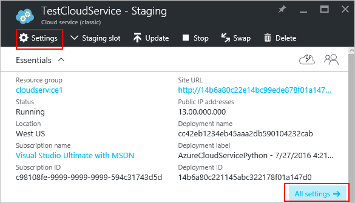
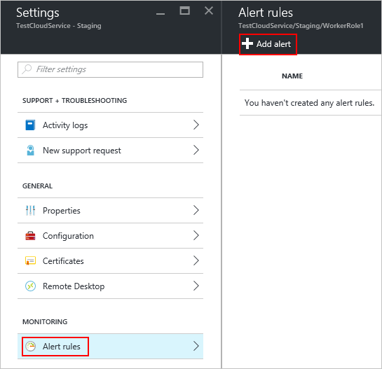
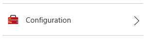

<properties 
    pageTitle="So konfigurieren Sie einen Clouddienst (Portal) | Microsoft Azure" 
    description="Informationen Sie zum Azure Cloud Services konfigurieren. Erfahren Sie, aktualisieren die Konfiguration der Cloud-Dienst und Remotezugriff auf Rolleninstanzen konfigurieren. In diesen Beispielen wird das Azure-Portal." 
    services="cloud-services" 
    documentationCenter="" 
    authors="Thraka" 
    manager="timlt" 
    editor=""/>

<tags 
    ms.service="cloud-services" 
    ms.workload="tbd" 
    ms.tgt_pltfrm="na" 
    ms.devlang="na" 
    ms.topic="article" 
    ms.date="10/11/2016"
    ms.author="adegeo"/>

# So konfigurieren Sie Cloud Services

> [AZURE.SELECTOR]
- [Azure-portal](cloud-services-how-to-configure-portal.md)
- [Azure klassischen-portal](cloud-services-how-to-configure.md)

Sie können die am häufigsten verwendeten Einstellungen für einen Clouddienst Azure-Portal konfigurieren. Oder, wenn Sie Ihre Konfigurationsdateien direkt aktualisieren möchten, laden Sie eine Konfiguration Dienstdatei zum aktualisieren möchten, und klicken Sie dann Hochladen der aktualisierten Datei und Cloud-Dienst mit den Änderungen Konfiguration aktualisieren. In beiden Fällen sind die Konfiguration Updates für alle Rolleninstanzen ab abgelegt.

Sie können auch die Instanzen der Cloud-Dienstverwaltungsrollen oder Remotedesktop in diese verwalten.

Azure kann nur 99,95 Prozent Verfügbarkeit während der Konfiguration Updates sicherstellen, wenn Sie mindestens zwei Rolleninstanzen für jede Rolle haben. Die ermöglicht eine virtuellen Computern Clientanfragen zu verarbeiten, während die anderen aktualisiert wird. Weitere Informationen finden Sie unter [Service Level Agreements](https://azure.microsoft.com/support/legal/sla/).

## Ändern eines Cloud-Diensts

Nach dem Öffnen der [Azure-Portal](https://portal.azure.com/)an, navigieren Sie zu Ihrem Cloud-Dienst. Von hier aus können Sie viele Aspekte davon verwalten. 

Wo Sie können ändern Sie die **Eigenschaften**, ändern Sie die **Konfiguration**, die **Zertifikate**, Setup **Warnungsregeln**, verwalten und Verwalten der **Benutzer** , die Zugriff auf diese Cloud-Dienst haben, wird der Links **Einstellungen** oder **Alle Einstellungen** von den **Einstellungen** Blade geöffnet.

>[AZURE.NOTE]
>Für den Clouddienst verwendete Betriebssystem kann nicht mithilfe der **Azure-Portal**geändert werden, können Sie diese Einstellung über das [Azure klassischen Portal](http://manage.windowsazure.com/)nur ändern. Dies ist detaillierte [hier](cloud-services-how-to-configure.md#update-a-cloud-service-configuration-file).

## Für die Überwachung

Sie können Benachrichtigungen zu Ihrem Clouddienst hinzufügen. Klicken Sie auf **Einstellungen** > **Warnungsregeln** > **Benachrichtigung hinzufügen**. 

Hier können Sie eine Warnung einrichten. Mit der Dropdownfeld **Mertic** können Sie eine Benachrichtigung für die folgenden Arten von Daten einrichten.

- Lesen Sie Datenträger
- Datenträger schreiben
- Im Netzwerk
- Netzwerk-ab
- Prozentsatz der CPU 

### Konfigurieren von einer Kachel metrischen Überwachung

Anstelle von **Einstellungen** > **Warnungsregeln**, klicken Sie auf eine der Kacheln metrischen im Abschnitt **Überwachung** der **Cloud-Service** -Karte vorausgesetzt.

Hier können Sie passen Sie das Diagramm mit der Kachel verwendet, oder fügen Sie eine Regel hinzu.

## Neustart, neu abbilden oder Remotedesktop

Sie können nicht zu diesem Zeitpunkt Remotedesktop mit der **Azure-Portal**konfigurieren. Allerdings können Sie es über die [Azure klassischen Portal](cloud-services-role-enable-remote-desktop.md) [PowerShell](cloud-services-role-enable-remote-desktop-powershell.md)oder [Visual Studio](../vs-azure-tools-remote-desktop-roles.md)einrichten. 

Klicken Sie zuerst auf die Cloud-Service-Instanz.

Aus dem Blade, an dem öffnet Uou kann eine Remotedesktop-Verbindung einleiten, die Instanz Remote-Neustart oder Remote ein neues Abbild (mit einer frisch Bild die Instanz beginnen).

## Konfigurieren Sie Ihre .cscfg

Möglicherweise müssen Sie Sie neu konfigurieren cloud-Dienst über die Datei [Dienstkonfiguration (Cscfg)](cloud-services-model-and-package.md#cscfg) . Zuerst müssen Sie Ihre .cscfg-Datei herunterladen, ändern Sie ihn dann hochladen.

1. Klicken Sie auf das Symbol **Einstellungen** oder den Link **Alle Einstellungen** , um das Blade **Einstellungen** zu öffnen.

    

2. Klicken Sie auf das Element **Konfiguration** .

    

3. Klicken Sie auf die Schaltfläche **herunterladen** .

    

4. Nachdem Sie die Konfiguration Dienstdatei aktualisieren, Hochladen Sie, und wenden Sie die Konfiguration Updates:

     
    
5. Wählen Sie die Datei .cscfg aus, und klicken Sie auf **OK**.

            
## Nächste Schritte

* Erfahren Sie, wie [einen Cloud-Dienst bereitgestellt](cloud-services-how-to-create-deploy-portal.md).
* Konfigurieren Sie einen [benutzerdefinierten Domänennamen](cloud-services-custom-domain-name-portal.md)ein.
* [Verwalten der Cloud-Dienst](cloud-services-how-to-manage-portal.md).
* Konfigurieren von [Ssl-Zertifikate](cloud-services-configure-ssl-certificate-portal.md).