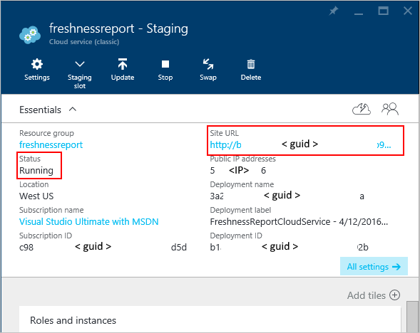

<properties
    pageTitle="So erstellen und Bereitstellen eines Cloud-Diensts | Microsoft Azure"
    description="Informationen Sie zum Erstellen und Bereitstellen eines Cloud-Diensts über das Azure-Portal."
    services="cloud-services"
    documentationCenter=""
    authors="Thraka"
    manager="timlt"
    editor=""/>

<tags
    ms.service="cloud-services"
    ms.workload="tbd"
    ms.tgt_pltfrm="na"
    ms.devlang="na"
    ms.topic="article"
    ms.date="10/11/2016"
    ms.author="adegeo"/>

# So erstellen und Bereitstellen eines Cloud-Diensts

> [AZURE.SELECTOR]
- [Azure-portal](cloud-services-how-to-create-deploy-portal.md)
- [Azure klassischen-portal](cloud-services-how-to-create-deploy.md)

Azure-Portal bietet zwei Methoden zum Erstellen und Bereitstellen eines Cloud-Diensts: *Schnellen Erstellen* und *Benutzerdefinierte erstellen*.

In diesem Artikel wird erläutert, wie mithilfe die Methode zum schnellen erstellen einen neuen Cloud-Dienst erstellen und verwenden Sie dann **Hochladen** hochladen und Bereitstellen einer Cloud-Service-Paket in Azure. Wenn Sie diese Methode verwenden, macht das Azure-Portal verfügbaren geeignete Links für alle Anforderungen durchführen, beim Durcharbeiten. Wenn Sie bereit sind in der Cloud-Dienst bereitstellen, wenn Sie sie erstellt haben, können Sie beide gleichzeitig verwenden, erstellen Sie benutzerdefinierte Aktionen ausführen.

> [AZURE.NOTE] Wenn Sie beabsichtigen, veröffentlichen Ihre Cloud-Dienst von Visual Studio Team Services (VSTS), verwenden Sie Symbolleiste erstellen und klicken Sie dann auf VSTS Veröffentlichung richten Sie ein, aus den Schnellstart Azure oder dem Dashboard. Weitere Informationen finden Sie unter [Kontinuierlichen Bereitstellung in Azure durch Verwenden von Visual Studio Team Services][TFSTutorialForCloudService], oder finden Sie unter Hilfe für die Seite **Schnellstart** .

## Konzepte
Bereitstellen eine Anwendung als Cloud-Dienst in Azure sind drei Komponenten erforderlich:

- **Dienstdefinition**  
  Die Cloud Service Formulardefinitionsdatei (.csdef) definiert des Service-Modells, einschließlich der Anzahl der Rollen.

- **Dienstkonfiguration**  
  Konfigurationsdatei der Cloud-Dienst (.cscfg) bietet Konfiguration von Einstellungen für die Cloud Service und einzelne Rollen, einschließlich der Anzahl der Rolleninstanzen.

- **Service-Paket**  
  Das Service-Paket (.cspkg) enthält die Anwendungscode und Konfigurationen und der Definition Dienstdatei.

Weitere Informationen zu diesen und zum Erstellen eines Pakets [hier](cloud-services-model-and-package.md).

## Vorbereiten der app
Bevor Sie einen Clouddienst bereitstellen können, müssen Sie das Cloud-Service-Paket (.cspkg) aus Ihrer Anwendungscode und Konfigurationsdatei einen Cloud-Dienst (.cscfg) erstellen. Das Azure-SDK enthält Tools für diese Bereitstellungsdateien erforderlich vorbereiten. Sie können das SDK von der Seite [Azure Downloads](https://azure.microsoft.com/downloads/) in der Sprache installieren Ihrer Anwendungscode entwickeln möchte, in denen Sie arbeiten.

Drei Cloud-Service-Features erfordern spezielle Konfigurationen aus, bevor Sie ein Service-Paket exportieren:

- Wenn Sie einen Clouddienst bereitstellen möchten verwendet, die für die Verschlüsselung der Daten, für SSL [Konfigurieren Ihrer Anwendung](cloud-services-configure-ssl-certificate-portal.md#modify) Secure Sockets Layer (SSL).

- Wenn Sie Remote Desktop-Verbindungen Rolle gehörendes [konfigurieren die Rollen](cloud-services-role-enable-remote-desktop.md) für Remotedesktop konfigurieren möchten. Dies kann nur in der klassischen Portal erfolgen.

- Wenn Sie konfigurieren ausführlichen Überwachung für Ihre Cloud-Dienst möchten, aktivieren Sie für den Clouddienst Azure-Diagnose. *Minimale Überwachung* (die Standardeinstellung für die Überwachung Ebene) verwendet die Host-Betriebssysteme für Rolleninstanzen (virtuelle Maschinen) gewonnenen-Datenquellen. *Überwachung ausführlich* sammelt zusätzliche Statistiken basierend auf der Leistungsdaten innerhalb der Rolleninstanzen näher Analyse von Problemen, die auftreten, während der Anwendung zu aktivieren. So aktivieren Sie Azure-Diagnose finden Sie finden Sie unter [Aktivieren der Diagnose in Azure](cloud-services-dotnet-diagnostics.md).

Um einen Clouddienst mit Bereitstellungen von Webrollen oder Worker-Rollen erstellen zu können, müssen Sie [das Service-Paket erstellen](cloud-services-model-and-package.md#servicepackagecspkg).

## Vorbemerkung

- Wenn Sie das Azure SDK installiert haben, klicken Sie auf **Azure SDK installieren** , um die [Seite Azure-Downloads](https://azure.microsoft.com/downloads/)öffnen, und Laden Sie das SDK für die Sprache, in der Sie den Code entwickeln möchte arbeiten. (Sie müssen eine Verkaufschance dazu später.)

- Wenn alle Rolleninstanzen ein Zertifikat benötigen, erstellen Sie die Zertifikate aus. Cloud-Dienste erfordern eine PFX-Datei mit einem privaten Schlüssel. Während [Sie die Zertifikate in Azure hochladen können]() erstellen und Bereitstellen von Cloud-Dienst.

- Wenn Sie eine Gruppe für die Zugehörigkeit Cloud-Dienst bereitstellen möchten, erstellen Sie die Zugehörigkeit Gruppe. Eine Gruppe für die Zugehörigkeit können Sie Ihre Cloud-Dienst und andere Dienste Azure an der gleichen Position in einem Bereich bereitstellen. Sie können die Zugehörigkeit Gruppe im Bereich **Netzwerken** des Azure klassischen Portals, klicken Sie auf der Seite **Gruppen** erstellen.

## Erstellen und bereitstellen

1. Melden Sie sich mit dem [Azure-Portal](https://portal.azure.com/)an.
2. Klicken Sie auf **Neu > virtuellen Computern**, und klicken Sie dann einen Bildlauf nach unten zu, und klicken Sie auf die **Cloud-Dienst**.

    

3. Am unteren Rand der Informationsseite, die angezeigt wird, klicken Sie auf **Erstellen**. 
4. Geben Sie in der neuen **Cloud-Service** --Karte vorausgesetzt einen Wert für den **DNS-Namen**ein.
5. Erstellen Sie einer neuen **Ressourcengruppe** oder wählen Sie ein vorhandenes Layout aus.
6. Wählen Sie einen **Speicherort**aus.
7. Klicken Sie auf **Paket**. Dadurch wird das **Hochladen eines Pakets** Blade geöffnet. Füllen Sie die erforderlichen Felder aus.  

     Wenn keines der Rollen eine einzelne Instanz enthalten, stellen Sie sicher, dass **bereitstellen, auch wenn eine oder mehrere Rollen eine einzelne Instanz enthalten** ausgewählt ist.

8. Stellen Sie sicher, dass **Start Bereitstellung** ausgewählt ist.
9. Klicken Sie auf **OK** , wodurch das **Hochladen eines Pakets** Blade geschlossen wird.
10. Wenn Sie keine hinzuzufügenden Zertifikate verfügen, klicken Sie auf **Erstellen**.

    

## Hochladen eines Zertifikats

Wenn Ihre Bereitstellungspaket [Zertifikate konfiguriert](cloud-services-configure-ssl-certificate-portal.md#modify)wurde, können Sie das Zertifikat jetzt hochladen.

1. Wählen Sie **Zertifikate**, und wählen Sie in der Blade **Zertifikate hinzufügen** , die SSL Zertifikat PFX-Datei aus, und geben Sie dann das **Kennwort** für das Zertifikat,
2. Klicken Sie auf **Anfügen Zertifikat**, und klicken Sie dann auf das Blade **Zertifikate hinzufügen** auf **OK** .
3. Klicken Sie auf die **Cloud-Service** -Karte vorausgesetzt auf **Erstellen** . Wenn die Bereitstellung den **bereit** Status erreicht hat, können Sie mit den nächsten Schritten fortfahren.

    

## Überprüfen Sie Ihre Bereitstellung wurde erfolgreich abgeschlossen

1. Klicken Sie auf die Cloud-Service-Instanz.

    Der Status sollte zeigen an, dass der Dienst **ausgeführt**wird.

2. Klicken Sie unter **Essentials**klicken Sie auf die **URL der Website** , um Ihre Cloud-Dienst in einem Webbrowser zu öffnen.

    

[TFSTutorialForCloudService]: http://go.microsoft.com/fwlink/?LinkID=251796

## Nächste Schritte

* [Allgemeine Konfiguration von Ihrem Cloud-Dienst](cloud-services-how-to-configure-portal.md).
* Konfigurieren Sie einen [benutzerdefinierten Domänennamen](cloud-services-custom-domain-name-portal.md)ein.
* [Verwalten der Cloud-Dienst](cloud-services-how-to-manage-portal.md).
* Konfigurieren von [Ssl-Zertifikate](cloud-services-configure-ssl-certificate-portal.md).