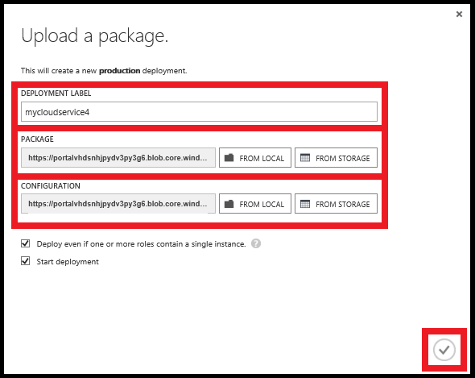

<properties
    pageTitle="So erstellen und Bereitstellen eines Cloud-Diensts | Microsoft Azure"
    description="Informationen Sie zum Erstellen und Bereitstellen eines mithilfe der Methode zum schnellen Erstellen in Azure-Cloud-Diensts."
    services="cloud-services"
    documentationCenter=""
    authors="Thraka"
    manager="timlt"
    editor=""/>

<tags
    ms.service="cloud-services"
    ms.workload="tbd"
    ms.tgt_pltfrm="na"
    ms.devlang="na"
    ms.topic="article"
    ms.date="09/06/2016"
    ms.author="adegeo"/>

# So erstellen und Bereitstellen eines Cloud-Diensts

> [AZURE.SELECTOR]
- [Azure-portal](cloud-services-how-to-create-deploy-portal.md)
- [Azure klassischen-portal](cloud-services-how-to-create-deploy.md)

Das Azure klassische Portal bietet zwei Methoden zum Erstellen und Bereitstellen eines Cloud-Diensts: **Schnellen Erstellen** und **Benutzerdefinierte erstellen**.

In diesem Thema wird erläutert, wie mithilfe die Methode zum schnellen erstellen einen neuen Cloud-Dienst erstellen und verwenden Sie dann **Hochladen** hochladen und Bereitstellen einer Cloud-Service-Paket in Azure. Wenn Sie diese Methode verwenden, wird im klassische Azure-Portal verfügbaren geeignete Links für alle Anforderungen durchführen, beim Durcharbeiten. Wenn Sie bereit sind in der Cloud-Dienst bereitstellen, wenn Sie sie erstellt haben, können Sie beide gleichzeitig verwenden, **Erstellen Sie benutzerdefinierte**Aktionen ausführen.

> [AZURE.NOTE] Wenn Sie beabsichtigen, veröffentlichen Ihre Cloud-Dienst von Visual Studio Team Services (VSTS), verwenden Sie die Symbolleiste zu erstellen, und VSTS für die Veröffentlichung von **Schnellstart** oder dem Dashboard dann einrichten. Weitere Informationen finden Sie unter [Kontinuierlichen Bereitstellung in Azure durch Verwenden von Visual Studio Team Services][TFSTutorialForCloudService], oder finden Sie unter Hilfe für die Seite **Schnellstart** .

## Konzepte
Drei Komponenten sind erforderlich, um eine Anwendung als Cloud-Dienst in Azure bereitzustellen:

- **Dienstdefinition**  
  Die Cloud Service Formulardefinitionsdatei (.csdef) definiert des Service-Modells, einschließlich der Anzahl der Rollen.

- **Dienstkonfiguration**  
  Konfigurationsdatei der Cloud-Dienst (.cscfg) bietet Konfiguration von Einstellungen für die Cloud Service und einzelne Rollen, einschließlich der Anzahl der Rolleninstanzen.

- **Service-Paket**  
  Das Service-Paket (.cspkg) enthält die Anwendungscode und Konfigurationen und der Definition Dienstdatei.
  
Weitere Informationen zu diesen und zum Erstellen eines Pakets [hier](cloud-services-model-and-package.md).

## Vorbereiten der app
Bevor Sie einen Clouddienst bereitstellen können, müssen Sie das Cloud-Service-Paket (.cspkg) aus Ihrer Anwendungscode und Konfigurationsdatei einen Cloud-Dienst (.cscfg) erstellen. Das Azure-SDK enthält Tools für diese Bereitstellungsdateien erforderlich vorbereiten. Sie können das SDK von der Seite [Azure Downloads](https://azure.microsoft.com/downloads/) in der Sprache installieren Ihrer Anwendungscode entwickeln möchte, in denen Sie arbeiten.

Drei Cloud-Service-Features erfordern spezielle Konfigurationen aus, bevor Sie ein Service-Paket exportieren:

- Wenn Sie einen Clouddienst bereitstellen möchten verwendet, die für die Verschlüsselung der Daten, für SSL [Konfigurieren Ihrer Anwendung](cloud-services-configure-ssl-certificate.md#step-2-modify-the-service-definition-and-configuration-files) Secure Sockets Layer (SSL).

- Wenn Sie Remote Desktop-Verbindungen Rolle gehörendes [konfigurieren die Rollen](cloud-services-role-enable-remote-desktop.md) für Remotedesktop konfigurieren möchten.

- Wenn Sie konfigurieren ausführlichen Überwachung für Ihre Cloud-Dienst möchten, aktivieren Sie für den Clouddienst Azure-Diagnose. *Minimale Überwachung* (die Standardeinstellung für die Überwachung Ebene) verwendet die Host-Betriebssysteme für Rolleninstanzen (virtuelle Maschinen) gewonnenen-Datenquellen. "Ausführliche Überwachung * sammelt zusätzliche Statistiken basierend auf der Leistungsdaten innerhalb der Rolleninstanzen näher Analyse von Problemen, die auftreten, während der Anwendung zu aktivieren. Ermitteln, zum Aktivieren der Azure-Diagnose finden Sie unter [Aktivieren der Diagnose in Azure](cloud-services-dotnet-diagnostics.md).

Um einen Clouddienst mit Bereitstellungen von Webrollen oder Worker-Rollen erstellen zu können, müssen Sie [das Service-Paket erstellen](cloud-services-model-and-package.md#servicepackagecspkg).

## Vorbemerkung

- Wenn Sie das Azure SDK installiert haben, klicken Sie auf **Azure SDK installieren** , um die [Seite Azure-Downloads](https://azure.microsoft.com/downloads/)öffnen, und Laden Sie das SDK für die Sprache, in der Sie den Code entwickeln möchte arbeiten. (Sie müssen eine Verkaufschance dazu später.)

- Wenn alle Rolleninstanzen ein Zertifikat benötigen, erstellen Sie die Zertifikate aus. Cloud-Dienste erfordern eine PFX-Datei mit einem privaten Schlüssel. Sie können [die Zertifikate in Azure hochladen](cloud-services-configure-ssl-certificate.md#step-3-upload-a-certificate) , erstellen und Bereitstellen von Cloud-Dienst.

- Wenn Sie eine Gruppe für die Zugehörigkeit Cloud-Dienst bereitstellen möchten, erstellen Sie die Zugehörigkeit Gruppe. Eine Gruppe für die Zugehörigkeit können Sie Ihre Cloud-Dienst und andere Dienste Azure an der gleichen Position in einem Bereich bereitstellen. Sie können die Zugehörigkeit Gruppe im Bereich **Netzwerken** des Azure klassischen Portals, klicken Sie auf der Seite **Gruppen** erstellen.

## So: erstellen einen Cloud-Dienst mit schnellen Erstellen

1. Klicken Sie im [Azure klassischen Portal](http://manage.windowsazure.com/)auf **neu**>**berechnen**>**Cloud-Dienst**>**Symbolleiste erstellen**.

    

2. **URL**Geben Sie einen Unterdomänennamen mit in der öffentlichen URL für den Zugriff auf Ihre Cloud-Dienst in der Herstellung Bereitstellungen. Das Format der URL für die Herstellung Bereitstellungen ist: http://*MyURL*. cloudapp.net.

3. Wählen Sie im **Bereich oder Zugehörigkeit Gruppe**der geografische Region oder Zugehörigkeit zu Cloud-Dienst bereitgestellt. Wählen Sie eine Gruppe für die Zugehörigkeit, wenn Sie Ihre Cloud-Dienst am selben Speicherort wie andere Azure Dienste innerhalb eines Bereichs bereitstellen möchten.

4. Klicken Sie auf die **Cloud-Dienst erstellen**.

    

    Sie können den Status des Prozesses in den Nachrichtenbereich am unteren Rand des Fensters überwachen.

    Der **Cloud Services** -Bereich wird geöffnet, mit dem neuen Clouddienst angezeigt. Wenn der Status auf erstellt wird, wurde Cloud-Dienst Erstellung erfolgreich durchgeführt.

    

## So: Hochladen ein Zertifikat für einen Clouddienst

1. Im [Azure klassischen Portal](http://manage.windowsazure.com/) **Cloud Services**klicken Sie auf, klicken Sie auf den Namen des Cloud-Dienst, und klicken Sie dann auf **Zertifikate**.

    

2. Klicken Sie auf entweder **ein Zertifikat hochladen** oder **Hochladen**.

3. Verwenden Sie in der **Datei**die **Durchsuchen** , um das Zertifikat (PFX-Datei) auszuwählen.

4. Geben Sie im Feld **Kennwort ein**den privaten Schlüssel für das Zertifikat ein.

5. Klicken Sie auf **OK** (Häkchen).

    

    Sie können den Fortschritt des Uploads in den Nachrichtenbereich abgebildet anschauen. Wenn der Upload abgeschlossen ist, wird das Zertifikat zur Tabelle hinzugefügt. Klicken Sie in den Bereich auf OK, um die Meldung zu schließen.

    

## Wie: Bereitstellen einen Cloud-Dienst

1. Im [Azure klassischen Portal](http://manage.windowsazure.com/) **Cloud Services**klicken Sie auf, klicken Sie auf den Namen des Cloud-Dienst, und klicken Sie dann auf **Dashboard**.

2. Klicken Sie auf entweder **eine neue Bereitstellung der Herstellung hochladen** oder **Hochladen**.

3. Geben Sie im Feld **Beschriftung Bereitstellung**einen Namen für die neue Bereitstellung – beispielsweise MyCloudServicev4 ein.

3. Verwenden Sie **Paket** **Durchsuchen** , wählen Sie die Paketdatei Service (.cspkg) verwenden aus.

4. Verwenden Sie in der **Konfiguration** **Durchsuchen** Dienst konfigurieren (.cscfg) zu verwendenden Datei auswählen aus.

5. Wenn der Cloud-Dienst Rollen nur eine Instanz enthalten wird, aktivieren Sie das Kontrollkästchen **bereitstellen, auch wenn eine oder mehrere Rollen eine einzelne Instanz enthalten** , aktivieren Sie die Bereitstellung, um den Vorgang fortzusetzen.

    Azure kann nur 99,95 % Zugriff auf die Cloud-Dienst während Wartung und Dienst Updates sicherstellen, wenn jeder Rolle mindestens zwei Instanzen verfügt. Bei Bedarf können Sie zusätzliche Rolleninstanzen auf der Seite **Skalieren** hinzufügen, nachdem Sie den Cloud-Dienst bereitgestellt. Weitere Informationen finden Sie unter [Service Level Agreements](https://azure.microsoft.com/support/legal/sla/).

6. Klicken Sie auf **OK** (Häkchen), um die Bereitstellung der Cloud-Dienst starten.

    

    Sie können den Status der Bereitstellung in den Nachrichtenbereich überwachen. Klicken Sie auf OK, um die Nachricht ausblenden.

    

## Überprüfen Sie Ihre Bereitstellung wurde erfolgreich abgeschlossen

1. Klicken Sie auf **Dashboard**.

    Der Status sollte zeigen an, dass der Dienst **ausgeführt**wird.

2. Klicken Sie unter **den ersten Blick**klicken Sie auf die Website-URL, um Ihre Cloud-Dienst in einem Webbrowser zu öffnen.

    

[TFSTutorialForCloudService]: cloud-services-continuous-delivery-use-vso.md
 
## Nächste Schritte

* [Allgemeine Konfiguration von Ihrem Cloud-Dienst](cloud-services-how-to-configure.md).
* Konfigurieren Sie einen [benutzerdefinierten Domänennamen](cloud-services-custom-domain-name.md)ein.
* [Verwalten der Cloud-Dienst](cloud-services-how-to-manage.md).
* Konfigurieren von [Ssl-Zertifikate](cloud-services-configure-ssl-certificate.md).