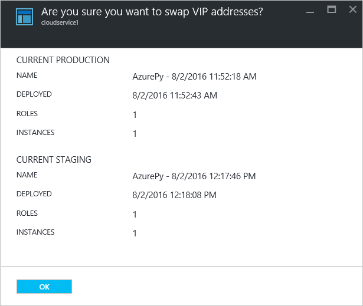

<properties 
    pageTitle="Allgemeine Aufgaben zur Cloud-Dienst Verwaltung | Microsoft Azure" 
    description="Erfahren Sie, wie Cloud Services Azure-Portal zu verwalten. In diesen Beispielen wird das Azure-Portal." 
    services="cloud-services" 
    documentationCenter="" 
    authors="Thraka" 
    manager="timlt" 
    editor=""/>

<tags 
    ms.service="cloud-services" 
    ms.workload="tbd" 
    ms.tgt_pltfrm="na" 
    ms.devlang="na" 
    ms.topic="article" 
    ms.date="08/02/2016"
    ms.author="adegeo"/>

# Zum Verwalten von Cloud-Diensten

> [AZURE.SELECTOR]
- [Azure-portal](cloud-services-how-to-manage-portal.md)
- [Azure klassischen-portal](cloud-services-how-to-manage.md)

Ihre Cloud-Dienst wird im Bereich **Cloud Services (klassische)** des Portals Azure verwaltet. In diesem Artikel werden einige allgemeinen Aktionen, die Sie beim Verwalten Ihrer Clouddienste ausführen möchten. Aktualisieren, löschen, Skalierung und Heraufstufen gestaffelten Bereitstellung zu Herstellung beinhaltet.

Weitere Informationen dazu, wie Sie Ihre Cloud-Dienst skalieren steht [hier](cloud-services-how-to-scale-portal.md).

## So: Aktualisieren einer Rolle der Cloud-Dienst oder Bereitstellung

Wenn Sie den Anwendungscode für Ihre Cloud-Dienst aktualisieren müssen, verwenden Sie **Aktualisieren** in der Cloud-Service-Karte vorausgesetzt. Sie können eine einzelne oder mehrere alle Rollen aktualisieren. Klicken Sie zum Aktualisieren können Sie eine neue Service-Paket oder Konfiguration Dienstdatei hochladen.

1. Wählen Sie im [Portal Azure][]-Cloud-Dienst, die, den Sie aktualisieren möchten. Dieser Schritt öffnet die Cloud Service-Instanz-Karte vorausgesetzt.

2. Klicken Sie in das Blade auf die Schaltfläche **Aktualisieren** .

    

3. Aktualisieren Sie die Bereitstellung mit einem neuen Paket Dienstdatei (.cspkg) und Konfiguration Dienstdatei (.cscfg).

    

4. Aktualisieren **optional** die Bezeichnung Bereitstellung und Speicher-Konto ein. 

5. Wenn alle Rollen nur eine Instanz der Rolle verfügen, wählen Sie die **bereitstellen, auch wenn eine oder mehrere Rollen eine einzelne Instanz enthalten** , aktivieren das Upgrade, um den Vorgang fortzusetzen. 

    Azure kann nur 99,95 Prozent Verfügbarkeit während ein Update des Cloud-Dienst sicherstellen, wenn jede Rolle mindestens zwei Rolleninstanzen (virtuelle Maschinen) hat. Mit zwei Rolleninstanzen wird eine virtuellen Computern Clientanfragen bearbeitet werden, während die anderen aktualisiert wird.

6. Überprüfen Sie die **Bereitstellung starten** , um das Update nach Abschluss des Uploads des Pakets angewendet haben.

7. Klicken Sie auf **OK** , um mit der Aktualisierung des Diensts beginnen.

## So: Bereitstellungen gestaffelten Bereitstellung zu Herstellung Höherstufen austauschen

Bei der Entscheidung, um eine neue Version von einen Clouddienst, Phase bereitstellen und Testen der neuen Version in der Cloud-Dienst staging-Umgebung. Verwenden Sie die URLs wechseln, bei dem zwei Bereitstellungen adressiert sind und eine neue Version zu Herstellung Höherstufen, **austauschen** . 

Sie können aus der **Cloud Services** -Seite oder dem Dashboard Bereitstellungen austauschen.

1. Wählen Sie im [Portal Azure][]-Cloud-Dienst, die, den Sie aktualisieren möchten. Dieser Schritt öffnet die Cloud Service-Instanz-Karte vorausgesetzt.

2. Klicken Sie in das Blade auf die Schaltfläche **austauschen** .

    

3. Die folgende Aufforderung zur Bestätigung wird geöffnet.

    

4. Nachdem Sie die Informationen zur Bereitstellung überprüft haben, klicken Sie auf **OK** , um die Bereitstellungen austauschen.

    Die Bereitstellung austauschen geschieht schnell, da die einzige Einstellung, die ändert sich die virtuellen IP-Adressen (VIPs) ist für die Bereitstellung.

    Zum Berechnen von Kosten zu speichern, können Sie die Bereitstellung staging löschen, vergewissern Sie sich, dass die Herstellung Bereitstellung wie erwartet funktioniert.

## So: eine Ressource mit einem Cloud-Dienst verknüpfen

Azure-Portal Ressourcen nicht miteinander verknüpfen, wie im aktuelle Azure klassische Portal werden. Stellen Sie stattdessen zusätzliche Ressourcen in derselben Ressourcengruppe von Cloud-Dienst verwendet wird.

## So: Bereitstellungen und einen Clouddienst löschen

Bevor Sie einen Clouddienst löschen können, müssen Sie jedes vorhandene Bereitstellung löschen.

Zum Berechnen von Kosten zu speichern, können Sie die Bereitstellung staging löschen, vergewissern Sie sich, dass die Herstellung Bereitstellung wie erwartet funktioniert. Sie sind für das Berechnen von Kosten für bereitgestellte Rolleninstanzen Abrechnung, die beendet werden.

Verwenden Sie das folgende Verfahren, um eine Bereitstellung oder dem Clouddienst löschen. 

1. Wählen Sie im [Portal Azure][]-Cloud-Dienst, den Sie löschen möchten. Dieser Schritt öffnet die Cloud Service-Instanz-Karte vorausgesetzt.

2. Klicken Sie in das Blade auf die Schaltfläche **Löschen** .

    

3. Können Sie den gesamte Cloud-Dienst löschen, indem Sie Auschecken **Cloud-Dienst und seine Bereitstellungen** oder wählen Sie entweder die **Herstellung Bereitstellung** oder das **Staging Bereitstellung**.

     

4. Klicken Sie auf die Schaltfläche " **Löschen** " unten.

5. Um die Cloud-Dienst zu löschen, klicken Sie auf **Delete Cloud-Dienst**. Klicken Sie dann die bestätigungsaufforderung angezeigt wird, klicken Sie auf **Ja**.

> [AZURE.NOTE]
> Wenn Sie ein Clouddienst wird gelöscht und ausführliche Überwachung konfiguriert ist, müssen Sie die Daten aus Ihrem Speicherkonto manuell löschen. Informationen darüber, wo die Kennzahlen Tabellen zu finden finden Sie [in](cloud-services-how-to-monitor.md) diesem Artikel.

[Azure-portal]: https://portal.azure.com

## Nächste Schritte

* [Allgemeine Konfiguration von Ihrem Cloud-Dienst](cloud-services-how-to-configure-portal.md).
* Erfahren Sie, wie [einen Cloud-Dienst bereitgestellt](cloud-services-how-to-create-deploy-portal.md).
* Konfigurieren Sie einen [benutzerdefinierten Domänennamen](cloud-services-custom-domain-name-portal.md)ein.
* Konfigurieren von [Ssl-Zertifikate](cloud-services-configure-ssl-certificate-portal.md).