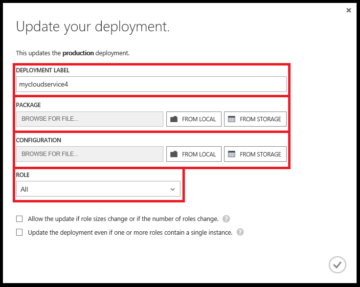
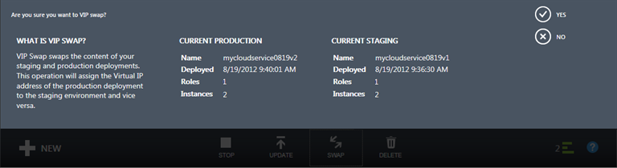
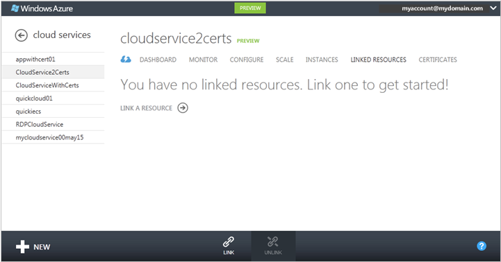

<properties 
    pageTitle="Häufige Cloud-Service-Verwaltungsaufgaben (klassisch) | Microsoft Azure" 
    description="Erfahren Sie, wie Cloud Services im klassischen Azure-Portal zu verwalten." 
    services="cloud-services" 
    documentationCenter="" 
    authors="Thraka" 
    manager="timlt" 
    editor=""/>

<tags 
    ms.service="cloud-services" 
    ms.workload="tbd" 
    ms.tgt_pltfrm="na" 
    ms.devlang="na" 
    ms.topic="article" 
    ms.date="08/10/2016"
    ms.author="adegeo"/>

# Zum Verwalten von Cloud-Diensten

> [AZURE.SELECTOR]
- [Azure-portal](cloud-services-how-to-manage-portal.md)
- [Azure klassischen-portal](cloud-services-how-to-manage.md)

Im Bereich des Portals klassischen Azure **Cloud Services** können Sie eine Rolle Dienst oder eine Bereitstellung aktualisieren, Höherstufen gestaffelten Bereitstellung zu Herstellung, Ressourcen in der Cloud-Service verknüpfen, sodass Sie können finden Sie unter der Ressource Abhängigkeiten und die Ressourcen zusammen skalieren, und Löschen einen Clouddienst oder eine Bereitstellung.

## So: Aktualisieren einer Rolle der Cloud-Dienst oder Bereitstellung

Wenn Sie den Anwendungscode für Ihre Cloud-Dienst aktualisieren müssen, verwenden Sie **Aktualisieren** auf dem Dashboard, **Cloud Services** oder **Instanzen** . Sie können eine einzelne oder mehrere alle Rollen aktualisieren. Sie müssen ein neues Servicepaket und Konfiguration Dienstdatei hochladen.

1. Im [Azure klassischen Portal](https://manage.windowsazure.com/)auf dem Dashboard, **Cloud Services** -Seite, oder die Seite **Instanzen** klicken Sie auf **Aktualisieren**.

    

2. Geben Sie im Feld **Beschriftung Bereitstellung**einen Namen für die Bereitstellung (z. B. mycloudservice4) ein. Sie finden die Bereitstellung Bezeichnung klicken Sie unter **Schnellstart** auf dem Dashboard.

3. Verwenden Sie **Paket**das Paket Dienstdatei (.cspkg) hochladen **Durchsuchen** .

4. Verwenden Sie **Konfiguration** **Navigieren Sie** zum Hochladen der Konfiguration Dienstdatei (.cscfg) aus.

5. **Rolle**wählen Sie in **Alle** Aktualisieren aller Rollen in der Cloud-Dienst werden soll. Um ein einzelnes Rolle Update durchführen zu können, wählen Sie die Rolle aus, die Sie aktualisieren möchten. Auch wenn Sie eine bestimmte Rolle aktualisieren auswählen, werden die Updates in der Konfiguration Dienstdatei auf alle Rollen angewendet.

6. Wenn die Aktualisierung der Anzahl der Rollen oder die Größe des einer bestimmten Rolle ändert, aktivieren Sie das Kontrollkästchen **zulassen zu aktualisieren, ändert sich Rolle Größe oder Anzahl der Rollen** , aktivieren Sie das Update, um den Vorgang fortzusetzen. 

    Beachten Sie, dass wenn Sie die Größe einer Rolle (d. h., die Größe eines virtuellen Computers, der eine Rolleninstanz hostet) oder die Anzahl der Rollen ändern, jede Instanz der Rolle (virtuellen Computern) erneut abgebildeten muss und lokalen Daten gehen verloren.

7. Wenn alle Dienstverwaltungsrollen nur eine Instanz der Rolle haben, aktivieren Sie die **aktualisieren, auch wenn eine oder mehrere Rolle enthalten ein Kontrollkästchen für die einzelnen Instanz** So aktivieren Sie das Upgrade, um den Vorgang fortzusetzen. 

    Azure kann nur 99,95 Prozent Verfügbarkeit während ein Update des Cloud-Dienst sicherstellen, wenn jede Rolle mindestens zwei Rolleninstanzen (virtuelle Maschinen) hat. Die ermöglicht eine virtuellen Computern Clientanfragen zu verarbeiten, während die anderen aktualisiert wird.

8. Klicken Sie auf **OK** (Häkchen), um mit der Aktualisierung des Diensts beginnen.

## So: Bereitstellungen gestaffelten Bereitstellung zu Herstellung Höherstufen austauschen

Verwenden Sie eine staging Bereitstellung von einem Cloud-Dienst in der Herstellung Höherstufen **austauschen** . Wenn Sie eine neue Version von einem Cloud-Dienst bereitstellen möchten, können Sie Phaseneigenschaften und Testen der neuen Version in der Cloud-Dienst staging-Umgebung, während Ihre Kunden in der Herstellung die aktuelle Version verwenden. Wenn Sie die neue Version zu Herstellung Höherstufen bereit sind, können Sie die **austauschen** verwenden, um die URLs zu wechseln, an dem die zwei Bereitstellungen adressiert sind. 

Sie können aus der **Cloud Services** -Seite oder dem Dashboard Bereitstellungen austauschen.

1. Klicken Sie im [Azure klassischen Portal](https://manage.windowsazure.com/)auf **Cloud Services**.

2. Klicken Sie in der Liste der Cloud Services auf Cloud-Dienst, um ihn auszuwählen.

3. Klicken Sie auf **austauschen**.

    Die folgende Aufforderung zur Bestätigung wird geöffnet.

    

4. Nachdem Sie die Informationen zur Bereitstellung überprüft haben, klicken Sie auf **Ja,** um die Bereitstellungen austauschen.

    Die Bereitstellung austauschen geschieht schnell, da die einzige Einstellung, die ändert sich die virtuellen IP-Adressen (VIPs) ist für die Bereitstellung.

    Zum Berechnen von Kosten zu speichern, können Sie die Bereitstellung in das staging-Umgebung löschen, wenn Sie wissen, dass die neue Herstellung Bereitstellung ausführt, wie erwartet.

## So: eine Ressource mit einem Cloud-Dienst verknüpfen

Um Ihre Cloud des Diensts Abhängigkeiten auf andere Ressourcen anzeigen möchten, können Sie eine Instanz Azure SQL-Datenbank oder eine Speicher-Konto in der Cloud-Service verknüpfen. Sie können verknüpfen und Aufheben der Verknüpfung mit Ressourcen auf der Seite **Verknüpfte Ressourcen** und überwachen Sie ihre Verwendung auf dem Dashboard des Cloud-Dienst. Wenn die Überwachung aktiviert über ein Speicherkonto verknüpfte verfügt, können Sie Anfragen insgesamt auf dem Dashboard des Cloud-Dienst überwachen.

**Verknüpfen** einer neuen oder vorhandenen SQL-Datenbank Instanz oder Speicher-Konto zu Ihrem Clouddienst eine Verknüpfung mit. Sie können die Datenbank zusammen mit der Rolle der Cloud-Dienst, die sie auf der Seite **Maßstab** verwendet wird, klicken Sie dann skalieren. (Ein Speicherkonto skaliert automatisch zunehmender Verwendung.) Weitere Informationen finden Sie unter [so einen Cloud-Dienst und verknüpfte Ressourcen skalieren](cloud-services-how-to-scale.md). 

Sie können auch überwachen, verwalten und die Datenbank in den Knoten **Datenbanken** des Portals Azure klassischen skalieren. 

"Verknüpfen" eine Ressource in diesem Sinne herzustellen nicht Ihre app mit der Ressource. Wenn Sie eine neue Datenbank mit **Link**erstellen, müssen Sie die Verbindungszeichenfolgen an Ihrer Anwendungscode hinzufügen und aktualisieren Sie den Cloud-Dienst. Sie müssen auch Verbindungszeichenfolgen hinzufügen, wenn Ihre app Ressourcen in einer verknüpften Speicher-Konto verwendet.

Im folgenden wird beschrieben, wie Sie eine neue SQL-Datenbank-Instanz, die auf einer neuen SQL-Datenbankserver an einen Clouddienst bereitgestellt verknüpfen.

### Zum Verknüpfen einer Instanz von SQL-Datenbank in einen Cloud-service

1. Klicken Sie im [Azure klassischen Portal](http://manage.windowsazure.com/)auf **Cloud Services**. Klicken Sie dann auf den Namen des Cloud-Dienst auf das Dashboard zu öffnen.

2. Klicken Sie auf **Verknüpfte Ressourcen**.

    Die Seite **Verknüpfte Ressourcen** wird geöffnet.

    

3. Klicken Sie auf entweder auf **Link eine Ressource** oder auf **Link**.

    Der **Link Ressource** -Assistent wird gestartet.

    

4. Klicken Sie auf **Erstellen einer neuen Ressource** oder **Verknüpfen einer vorhandenen Ressource**.

5. Wählen Sie den Typ der Ressource zu verknüpfen. Klicken Sie im [Azure klassischen Portal](http://manage.windowsazure.com/)auf **SQL-Datenbank**. (Das klassische Vorschau Azure-Portal unterstützt nicht Verknüpfen eines Kontos Speicher auf einen Clouddienst.)

6. Führen Sie zum Abschließen der Konfigurations Datenbank Anweisungen in der Hilfe für die **SQL-Datenbanken** Bereich des Portals Azure klassischen aus.

    Sie können den Fortschritt des Vorgangs in den Nachrichtenbereich verknüpfen folgen.

    

    Beim Verknüpfen abgeschlossen ist, können Sie den Status der verknüpfte Ressource auf dem Dashboard des Cloud-Dienst überwachen. Informationen zum Skalieren einer verknüpften SQL-Datenbank finden Sie unter [so einen Cloud-Dienst und verknüpfte Ressourcen skalieren](cloud-services-how-to-scale.md).

### Zum Aufheben der Verknüpfung einer verknüpften Ressource

1. Klicken Sie im [Azure klassischen Portal](http://manage.windowsazure.com/)auf **Cloud Services**. Klicken Sie dann auf den Namen des Cloud-Dienst auf das Dashboard zu öffnen.

2. Klicken Sie auf **Verknüpfte Ressourcen**, und wählen Sie die Ressource.

3. Klicken Sie auf **die Verknüpfung aufheben**. Klicken Sie dann auf **Ja** zur Bestätigung aufgefordert.

    Aufheben der Verknüpfung einer SQL-Datenbank hat keine Auswirkung auf die Datenbank oder der Anwendung Verbindungen mit der Datenbank. Sie können weiterhin die Datenbank im Bereich des Portals klassischen Azure **SQL-Datenbanken** verwalten.

## So: Bereitstellungen und einen Clouddienst löschen

Bevor Sie einen Clouddienst löschen können, müssen Sie jedes vorhandene Bereitstellung löschen.

Zum Berechnen von Kosten zu speichern, können Sie eine staging Bereitstellung löschen, vergewissern Sie sich, dass die Herstellung Bereitstellung wie erwartet funktioniert. Sie können abgebucht berechnen Kosten für Rolleninstanzen auch, wenn ein Clouddienst nicht ausgeführt wird.

Verwenden Sie das folgende Verfahren, um eine Bereitstellung oder dem Clouddienst löschen. 

1. Klicken Sie im [Azure klassischen Portal](http://manage.windowsazure.com/)auf **Cloud Services**.

2. Wählen Sie aus der Cloud-Dienst, und klicken Sie dann auf **Löschen**. (Um einen Clouddienst auswählen ohne Öffnen des Dashboards, klicken Sie auf an einer beliebigen Stelle außer den Namen in der Cloud Diensteintrag.)

    Wenn Sie eine Bereitstellung Staging oder der Herstellung haben, wird ein Menü mit Optionen ähnlich der folgenden am unteren Rand des Fensters angezeigt. Bevor Sie den Cloud-Dienst löschen können, müssen Sie alle vorhandenen Bereitstellungen löschen.

    

3. Klicken Sie zum Löschen einer bereitstellungs auf **Herstellung Bereitstellung löschen** oder **staging Bereitstellung löschen**. Klicken Sie dann die bestätigungsaufforderung angezeigt wird, klicken Sie auf **Ja**. 

4. Wenn Sie den Cloud-Dienst löschen möchten, wiederholen Sie Schritt 3, bei Bedarf die anderen Bereitstellung löschen.

5. Um die Cloud-Dienst zu löschen, klicken Sie auf **Delete Cloud-Dienst**. Klicken Sie dann die bestätigungsaufforderung angezeigt wird, klicken Sie auf **Ja**.

> [AZURE.NOTE]
> Wenn ausführliche Überwachung für Ihre Cloud-Dienst konfiguriert ist, löscht Azure die überwachen Daten nicht von Ihrem Speicherkonto an, wenn Sie den Cloud-Dienst löschen. Sie müssen die Daten manuell zu löschen. Informationen dazu, wie Sie Tabellen Kennzahlen suchen finden Sie unter "so: Access ausführlichen Überwachung Daten außerhalb des Azure klassischen Portals" unter [How to Monitor Cloud Services](cloud-services-how-to-monitor.md).

## Nächste Schritte

 * [Allgemeine Konfiguration von Ihrem Cloud-Dienst](cloud-services-how-to-configure.md).
* Erfahren Sie, wie [einen Cloud-Dienst bereitgestellt](cloud-services-how-to-create-deploy.md).
* Konfigurieren Sie einen [benutzerdefinierten Domänennamen](cloud-services-custom-domain-name.md)ein.
* Konfigurieren von [Ssl-Zertifikate](cloud-services-configure-ssl-certificate.md).
