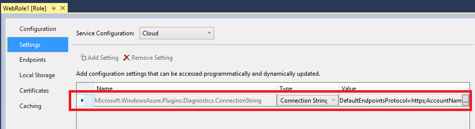
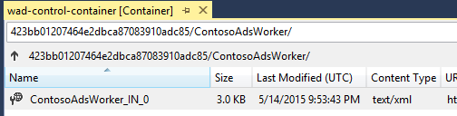

<properties 
    pageTitle="So einen Clouddienst überwachen | Microsoft Azure" 
    description="Informationen Sie zum Überwachen der Cloud Services mithilfe des klassischen Azure-Portals." 
    services="cloud-services" 
    documentationCenter="" 
    authors="rboucher" 
    manager="timlt" 
    editor=""/>

<tags 
    ms.service="cloud-services" 
    ms.workload="tbd" 
    ms.tgt_pltfrm="na" 
    ms.devlang="na" 
    ms.topic="article" 
    ms.date="08/04/2015" 
    ms.author="robb"/>


# <a name="how-to-monitor-cloud-services"></a>Zum Überwachen der Cloud Services

[AZURE.INCLUDE [disclaimer](../../includes/disclaimer.md)]

Sie können Überwachen `key` Performance-Werte für Ihre Dienstleistungen Cloud im klassischen Azure-Portal. Sie können die Ebene der minimalen und ausführliche für jede Rolle Dienst Überwachung festlegen und können die Überwachung zeigt anpassen. Ausführliche Überwachung Daten werden in einem Speicherkonto gespeichert, die Sie außerhalb des Portals zugreifen können. 

Überwachung zeigt die klassischen Azure-Portal werden hochgradig konfiguriert. Sie können auswählen, die Metrik, die Sie in der Liste Kennzahlen auf der Seite **Monitor** überwachen möchten, und Sie können auswählen, welche Metrik in Kennzahlen ' Diagramme ' auf der Seite **Überwachen** und dem Dashboard gezeichnet. 

## <a name="concepts"></a>Konzepte

Standardmäßig wird die minimale Überwachung für einen neuen Clouddienst mithilfe des Hostbetriebssystems für die Rolleninstanzen (virtuelle Maschinen) gewonnenen-Datenquellen bereitgestellt. Die minimale Metrik sind Prozentsatz der CPU-, Daten In, Daten, Datenträgerdurchsatz für Lesen und Schreiben Datenträgerdurchsatz beschränkt. Ausführliche Überwachung konfiguriert wurde, können Sie zusätzliche Statistiken basierend auf der von Leistungsdaten in den virtuellen Computern (Rolleninstanzen) erhalten. Die ausführliche Metrik aktivieren näher Analyse von Problemen, die während der Anwendungsvorgänge auftreten.

Standardmäßig ist Leistung Zähler Daten aus Rolleninstanzen Stichprobe und aus der Rolleninstanz Abständen 3 Minuten übertragen. Wenn Sie ausführliche Überwachung aktivieren, werden die unformatierten Leistungsindikatordaten für jede Instanz der Rolle und über die Rolleninstanzen für jede Rolle in Abständen von 5 Minuten, 1 Stunde und 12 Stunden aggregiert. Aggregierten Daten werden nach 10 Tagen gelöscht.

Nachdem Sie die ausführliche Überwachung aktivieren, werden die überwachen aggregierten Daten in Tabellen in Ihr Speicherkonto gespeichert. Um ausführliche Überwachung für eine Rolle zu aktivieren, müssen Sie einer Verbindungszeichenfolge Diagnose mit einer Verknüpfung mit dem Speicherkonto konfigurieren. Sie können verschiedene Speicherkonten für unterschiedliche Rollen verwenden.

Beachten Sie, dass ausführlichen Überwachung aktivieren Ihrer Speicherkosten im Zusammenhang mit Speicherung von Daten, Datenübertragung und Speichertransaktionen vergrößern. Minimale Überwachung sind keine Speicher-Konto erforderlich. Die Daten für die Metrik, die Ebene der minimalen Überwachung verfügbar gemacht werden werden nicht in Ihrem Konto Storage gespeichert, auch wenn Sie die Überwachung Ebene zu ausführlichen festlegen.


## <a name="how-to-configure-monitoring-for-cloud-services"></a>So: Konfigurieren der Überwachung für Clouddienste

Gehen Sie folgendermaßen vor, Regelname oder minimale Überwachung im klassischen Azure-Portal konfigurieren. 

### <a name="before-you-begin"></a>Vorbemerkung

- Erstellen Sie ein Speicherkonto zum Speichern der überwachen Daten ein. Sie können verschiedene Speicherkonten für unterschiedliche Rollen verwenden. Weitere Informationen finden Sie unter Hilfe für **Speicher-Konten**und Informationen [zum Erstellen eines Speicher-Kontos](/manage/services/storage/how-to-create-a-storage-account/).

- Aktivieren Sie für Ihre Cloud-Dienstverwaltungsrollen Azure-Diagnose. Finden Sie unter [Konfigurieren von Diagnose für Clouddienste](https://msdn.microsoft.com/library/azure/dn186185.aspx#BK_EnableBefore).

Stellen Sie sicher, dass die Verbindungszeichenfolge Diagnose in der Rollenkonfiguration vorhanden ist. Sie können keine ausführlichen Überwachung, bis Sie Azure-Diagnose aktivieren, und fügen eine Diagnose Verbindungszeichenfolge in die Konfiguration der aktivieren.   

> [AZURE.NOTE] Projekte für Azure SDK 2,5 haben die Verbindungszeichenfolge Diagnose nicht automatisch in die Projektvorlage eingeschlossen. Für diese Projekte müssen Sie die Konfiguration die Verbindungszeichenfolge Diagnose manuell hinzufügen.

**Manuelles Hinzufügen Diagnose Verbindungszeichenfolge zur Rollenkonfiguration**

1. Öffnen Sie das Projekt Cloud-Dienst in Visual Studio
2. Klicken Sie auf die **Rolle** den Rolle-Designer zu öffnen, und wählen Sie die Registerkarte **Einstellungen** auf Doppelklicken
3. Suchen Sie nach einer Einstellung, die mit dem Namen **Microsoft.WindowsAzure.Plugins.Diagnostics.ConnectionString**. 
4. Wenn diese Einstellung nicht vorhanden ist Klicken Sie dann auf die Schaltfläche **Einstellung hinzufügen** fügen es an der Konfiguration und ändern den Typ für die neue Einstellung in **ConnectionString**
5. Legen Sie den Wert für die Verbindungszeichenfolge der, indem Sie auf die Schaltfläche **...** . Ein Dialogfeld, dem Sie ein Speicherkonto auswählen wird geöffnet.

    

### <a name="to-change-the-monitoring-level-to-verbose-or-minimal"></a>So ändern Sie die Überwachung Ebene zu ausführlichen oder minimale

1. Öffnen Sie im [Azure klassischen Portal](https://manage.windowsazure.com/)der Seite " **Konfigurieren** " für die Bereitstellung der Cloud-Dienst aus.

2. Klicken Sie in der **Ebene** **ausführlich** oder **minimale**aus. 

3. Klicken Sie auf **Speichern**.

Nachdem Sie ausführliche Überwachung aktivieren, sollten Sie zunächst die überwachen Daten in der klassischen Azure-Portal innerhalb einer Stunde angezeigt.

Die unformatierten Leistungsindikatordaten und aggregierte Überwachung Daten werden in Tabellen, die durch die Bereitstellung-ID für die Rollen qualifiziert Speicherkonto gespeichert. 

## <a name="how-to-receive-alerts-for-cloud-service-metrics"></a>So: erhalten von Benachrichtigungen für Kriterien des Cloud-Service

Sie können Benachrichtigungen basierend auf Ihrer Überwachung Kennzahlen Cloud-Dienst erhalten. Auf der Seite des Portals Azure klassischen **Management Services** können Sie eine Regel, damit eine Benachrichtigung ausgelöst wird, wenn die Metrik, die Sie auswählen einen Wert erreicht, den Sie angeben erstellen. Sie können auch auswählen, dass e-Mails gesendet werden, wenn die Benachrichtigung ausgelöst wird. Weitere Informationen finden Sie unter [wie: benachrichtigen Benachrichtigungen erhalten und Verwalten von Warnungsregeln in Azure](http://go.microsoft.com/fwlink/?LinkId=309356).

## <a name="how-to-add-metrics-to-the-metrics-table"></a>So: Hinzufügen von Kennzahlen zur Tabelle Kennzahlen

1. Öffnen Sie im [Azure klassischen Portal](http://manage.windowsazure.com/)die **Monitor** -Seite für den Clouddienst aus.

    Standardmäßig zeigt die Tabelle Kennzahlen eine Teilmenge der die Metrik zur Verfügung. Die Abbildung zeigt die standardmäßige ausführlichen Metrik für einen Clouddienst, der in den Speicher\Verfügbare MB Leistung Zähler mit Daten zusammengefasster Ebene der Rolle beschränkt ist. Verwenden Sie **Kriterien hinzufügen** , um zusätzliche aggregieren und Rolle Ebene Statistiken zum Überwachen der klassischen Azure-Portal auszuwählen.

    
 
2. In der Tabelle Kennzahlen Kennzahlen hinzuzufügen:

    1. Klicken Sie auf **Kriterien hinzufügen** , um **Kennzahlen auswählen**, abgebildet zu öffnen.

        Die erste verfügbare Metrik wird erweitert, um die Optionen anzuzeigen, die verfügbar sind. Für jede Metrik zeigt die verwendete Option aggregierte Überwachung Daten für alle Rollen. Darüber hinaus können Sie zum Anzeigen von Daten für einzelne Rollen auswählen.

        

    2. Auswählen von Kriterien angezeigt werden

        - Klicken Sie auf den Pfeil nach unten, indem Sie die Metrik, um die überwachen Optionen zu erweitern.
        - Wählen Sie das Kontrollkästchen für die einzelnen Überwachung Optionen, die angezeigt werden soll.

        Sie können bis zu 50 Kennzahlen in der Tabelle Kennzahlen anzeigen.

        > [AZURE.TIP] In ausführlichen Überwachung kann die Liste Kennzahlen Dutzende Kennzahlen enthalten. Wenn eine Bildlaufleiste anzeigen möchten, zeigen Sie auf der rechten Seite des Dialogfelds. Um die Liste zu filtern, klicken Sie auf das Suchsymbol, und geben Sie Text in das Suchfeld ein, wie unten dargestellt.
    
        


3. Kennzahlen ausgewählt haben, klicken Sie auf OK (Häkchen).

    Die ausgewählten Kriterien werden der Tabelle Kennzahlen wie unten dargestellt hinzugefügt.

    

 
4. Zum Löschen einer Metrik aus der Tabelle Kennzahlen klicken Sie auf die Metrik, um ihn auszuwählen, und klicken Sie dann auf **Metrisch löschen**. (Nur angezeigt, **Metrisch löschen** , wenn Sie eine Metrik ausgewählt haben.)

### <a name="to-add-custom-metrics-to-the-metrics-table"></a>Hinzufügen von benutzerdefinierten Metrik zur Tabelle Kennzahlen

Die Überwachung Ebene **ausführlich** enthält eine Liste der standardmäßigen Kennzahlen, die Sie überwachen können im Portal. Zusätzlich zu diesen können Sie alle benutzerdefinierten Kennzahlen oder von der Anwendung über das Portal definierten Performance-Indikatoren überwachen.

Die folgenden Schritte setzen voraus, dass Sie **ausführlich** Ebene für die Überwachung aktiviert haben, und Konfigurieren der Anwendung zu erfassen und benutzerdefinierte-Datenquellen übertragen haben. 

Zum Anzeigen der benutzerdefinierten Leistungsindikatoren im Portal müssen Sie die Konfiguration in Wad-Steuerelement-Container zu aktualisieren:
 
1. Öffnen Sie das Wad-Steuerelement-Container Blob in Ihrem Diagnose Speicher-Konto an. Visual Studio oder andere Speicher-Explorer können Sie dies tun.

    

2. Navigieren Sie den Blob-Pfad unter Verwendung des Musters **DeploymentId/RoleName/RoleInstance** an die Konfiguration für Ihre Rolleninstanz gefunden. 

    
3. Herunterladen der Konfigurationsdatei für Ihre Rolleninstanz und aktualisieren, um alle benutzerdefinierten Leistungsindikatoren gehört. Fügen Sie beispielsweise zum Überwachen der *Bytes/s das Schreiben des Datenträgers* für das *Laufwerk C* in den folgenden unter **PerformanceCounters\Subscriptions** Knoten

    ```xml
    <PerformanceCounterConfiguration>
    <CounterSpecifier>\LogicalDisk(C:)\Disk Write Bytes/sec</CounterSpecifier>
    <SampleRateInSeconds>180</SampleRateInSeconds>
    </PerformanceCounterConfiguration>
    ```
4. Die Änderungen zu speichern und Hochladen der Konfigurationsdatei an derselben Stelle im Blob die vorhandene Datei überschreiben.
5. Wechseln Sie zur ausführlichen Modus in der Azure-Portal klassischen Konfiguration. Wenn Sie bereits im ausführlichen Modus wurden, müssen Sie minimale und zu ausführlichen ein-/ausschalten.
6. Im Dialogfeld **Kennzahlen hinzufügen** wird jetzt der benutzerdefinierte Performance-Zähler verfügbar sein. 

## <a name="how-to-customize-the-metrics-chart"></a>So: Anpassen des Diagramms Kennzahlen

1. Wählen Sie in der Tabelle Kennzahlen bis zu 6 Kennzahlen im Kennzahlen Diagramm gezeichnet. Klicken Sie zum Auswählen einer Metrik auf das Kontrollkästchen auf der linken Seite. Deaktivieren Sie das Kontrollkästchen in der Tabelle Kennzahlen zum Entfernen einer Metrik aus dem Diagramm Kennzahlen.

    Wie Sie in der Tabelle Kennzahlen Kennzahlen auswählen, werden die Metrik Kennzahlen Diagramm hinzugefügt. Klicken Sie auf eine schmale Anzeige enthält eine Dropdownliste **n weitere** Metrische Kopfzeilen, die nicht die Anzeige passt.

 
2. Wählen Sie zum Umschalten zwischen der Anzeige Verhältnis zwischen dem Wert (Endwert nur für jede Metrisch) und Absolute Werte (y-Achse angezeigt), relativen oder absoluten am oberen Rand des Diagramms ein.

    

3. Wählen Sie zum Ändern des Zeitraums Diagramm zeigt die Kennzahlen, 1 Stunde, 24 Stunden oder sieben Tage am oberen Rand des Diagramms.

    

    Klicken Sie im Dashboard Kennzahlen Diagramm unterscheidet die Methode zum Zeichnen Kennzahlen. Eine Reihe von Kennzahlen zur Verfügung steht, und Kennzahlen hinzugefügt oder entfernt werden, indem Sie die Kopfzeile metrische auswählen.

### <a name="to-customize-the-metrics-chart-on-the-dashboard"></a>Das Diagramm Kennzahlen auf dem Dashboard anpassen

1. Öffnen Sie das Dashboard für den Clouddienst an.

2. Hinzufügen oder Entfernen von Kennzahlen aus dem Diagramm:

    - Wenn Sie eine neue Metrik darstellen möchten, aktivieren Sie das Kontrollkästchen für die Metrik in den Kopfzeilen Diagramm ein. Klicken Sie auf eine schmale anzeigen klicken Sie auf den Pfeil nach unten durch ** *n*??metrics** eine Metrik gezeichnet, die im Diagramm Kopfzeilenbereich nicht unterstützt.

    - Um eine Metrik zu löschen, die auf dem Diagramm gezeichnet wird, deaktivieren Sie das Kontrollkästchen nach ihren Header ein.

3. Wechseln Sie zwischen **relativen** und **absoluten** zeigt.

4. Wählen Sie 1 Stunde, 24 Stunden oder sieben Tage der anzuzeigenden Daten aus.

## <a name="how-to-access-verbose-monitoring-data-outside-the-azure-classic-portal"></a>So: Access ausführlichen Überwachung außerhalb des Azure klassischen Portals Daten

Ausführliche Überwachung Daten werden in Tabellen in den Konten Storage gespeichert, die Sie für jede Rolle angeben. Für jede Cloudbereitstellung-Dienst werden sechs Tabellen für die Rolle erstellt. Für jede werden zwei Tabellen (5 Minuten, 1 Stunde und 12 Stunden) erstellt. Eine der folgenden Tabellen speichert Aggregationen Rolle Ebene; die anderen Tabelle speichert Aggregationen für Rolleninstanzen. 

Die Namen der Tabellen haben das folgende Format:

```
WAD*deploymentID*PT*aggregation_interval*[R|RI]Table
```

wobei Folgendes gilt:

- *DeploymentID* ist die Cloud-Service-Bereitstellung zugewiesene GUID

- *Aggregation_interval* = 5 M, 1 H oder 12 H

- Rolle Ebene Aggregationen = R

- Aggregationen für Rolleninstanzen = RI

In den folgenden Tabellen würde beispielsweise ausführliche Überwachung Daten in 1 Stunde Intervallen zusammengefasster speichern:

```
WAD8b7c4233802442b494d0cc9eb9d8dd9fPT1HRTable (hourly aggregations for the role)

WAD8b7c4233802442b494d0cc9eb9d8dd9fPT1HRITable (hourly aggregations for role instances)
```
