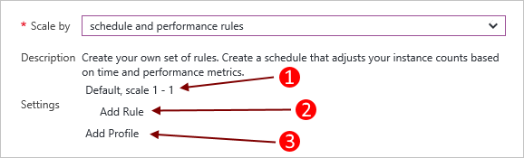
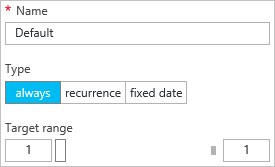
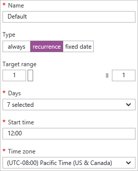

<properties
    pageTitle="Automatische Skalieren Cloud-Dienst im Portal | Microsoft Azure"
    description="Erfahren Sie, wie Sie auf das Portal verwenden, um Regeln für automatische Skalierung für einen Cloud-Dienst Webrolle oder Worker-Rolle in Azure konfigurieren."
    services="cloud-services"
    documentationCenter=""
    authors="Thraka"
    manager="timlt"
    editor=""/>

<tags
    ms.service="cloud-services"
    ms.workload="tbd"
    ms.tgt_pltfrm="na"
    ms.devlang="na"
    ms.topic="article"
    ms.date="09/06/2016"
    ms.author="adegeo"/>

# Automatisches Skalieren Cloud-Dienst

> [AZURE.SELECTOR]
- [Azure-portal](cloud-services-how-to-scale-portal.md)
- [Azure klassischen-portal](cloud-services-how-to-scale.md)

Bedingungen können für eine Cloud-Dienst Worker-Rolle, die eine Skala oder verkleinern Vorgang auslösen festgelegt werden. Die Bedingungen für die Rolle können auf die CPU, Datenträger oder Netzwerk Laden der Rolle basieren. Sie können auch eine Conditation basierend auf einer Warteschlange oder die Metrik von einer anderen Azure Ressource zugeordnet Ihres Abonnements festlegen.

>[AZURE.NOTE] Dieser Artikel befasst sich Cloud-Dienst Web- und Worker Rollen. Wenn Sie direkt einen virtuellen Computern (klassisch) erstellen, wird es in einen Cloud-Dienst gehostet werden. Skalieren ein standard virtuellen Computers durch Zuordnen einer [Verfügbarkeit festlegen](../virtual-machines/virtual-machines-windows-classic-configure-availability.md) können und manuell sie aktivieren oder deaktivieren.

## Aspekte

Bevor Sie die Skalierung für eine Anwendung konfigurieren, berücksichtigen Sie die folgende Informationen:

- Skalierung ist durch Verwendung von Core betroffen. Verwenden Sie größere Rolleninstanzen mehr Kerne aus. Sie können eine Anwendung nur im Rahmen der Kerne für Ihr Abonnement skalieren. Angenommen, wenn Ihr Abonnement maximal zwanzig Adern und Ausführen eine Anwendung mit zwei mittlerer Größe aufweist Cloud services (insgesamt vier Kerne) und Sie können nur Dezimalstellen von anderen Cloud-Service-Bereitstellungen in Ihr Abonnement von 16 Kerne. Weitere Informationen zu Größen finden Sie unter [Größe der Cloud-Dienst](cloud-services-sizes-specs.md) .

- Sie können skalieren basierend auf den Schwellenwert für eine Warteschlange Nachrichten. Weitere Informationen dazu, wie Sie Warteschlangen verwenden, finden Sie unter [Verwenden der Warteschlange Speicherdienst](../storage/storage-dotnet-how-to-use-queues.md).

- Sie können auch weitere Ressourcen, die mit Ihrem Abonnement verknüpft ist skalieren.

- Um hohe Verfügbarkeit der Anwendung zu aktivieren, sollten Sie sicherstellen, dass es mit zwei oder mehr Rolleninstanzen bereitgestellt wird. Weitere Informationen finden Sie unter [Service Level Agreements](https://azure.microsoft.com/support/legal/sla/).

## Sich Skala befindet.

Nachdem Sie Ihre Cloud-Dienst auswählen, sollten Sie die Cloud Service-Karte vorausgesetzt sichtbar verfügen.

1. Wählen Sie den Namen des Cloud-Dienst, in der Cloud Service-Karte vorausgesetzt, klicken Sie auf die Kachel **Rollen und Instanzen** .   
**Wichtig**: Vergewissern Sie sich auf die Cloud-Dienst Rolle, nicht die Instanz der Rolle klicken, die unterhalb der Rolle ist.

    

2. Wählen Sie die Kachel **Skala** aus.

    

## Automatische Skalierung

Sie können die skalierungseinstellungen für eine Rolle mit zwei Modi **Manuelle** oder **Automatische**konfigurieren. Wie erwartet auf manuell festgelegt, die absolute Anzahl der Instanzen festgelegt werden. Automatische kann aber, dass Sie zum Festlegen von Regeln, die wie und wie viel Sie Regeln skaliert werden sollen.

Legen Sie die Option **nach skalieren** auf **Zeitplan und Leistung Regeln**.

1. Ein vorhandenes Profil.
2. Fügen Sie eine Regel für das übergeordnete Profil hinzu.
3. Fügen Sie einem anderen Profil hinzu.

Wählen Sie das **Profil hinzufügen**aus. Das Profil bestimmt, welchen Modus für die Skalierung der verwenden möchten: **immer** **Serie**, **festen Termin**.

Nachdem Sie das Profil und die Regeln konfiguriert haben, wählen Sie das Symbol **Speichern** im Kopfbereich.

#### Profil

Das Profil legt Mindest- und Höchstwerten Instanzen für die Skalierung der und auch wenn Buchstabenfolge Maßstab aktiv ist.

* **Immer**

    Dieser Bereich der verfügbaren Instanzen immer beibehalten.  

    
    
* **Serie**

    Wählen Sie eine Reihe von Tage der Woche zu skalieren aus.

    
    
* **Festes Datum**

    Ein festes Datumsbereich aus, um die Rolle skalieren.

    

Nachdem Sie das Profil konfiguriert haben, wählen Sie die Schaltfläche **OK** am unteren Rand der Blade Profil.

#### Regel

Regeln sind ein Profil hinzugefügt und darstellen eine Bedingung, die die Skalierung ausgelöst werden soll. 

Die Regel auslösen basiert auf einer Metrik von Cloud-Dienst (CPU-Auslastung, Datenträgeraktivität oder Netzwerkaktivität), dem ein bedingtes Werts hinzugefügt werden können. Darüber hinaus haben Sie den Trigger ausgehend von einer Warteschlange oder die Metrik von einer anderen Azure Ressource mit Ihrem Abonnement verknüpft ist.

Nachdem Sie die Regel konfiguriert haben, wählen Sie die Schaltfläche **OK** am unteren Rand der Regel Blade.

## Zurück zur manuellen Skalierung

Navigieren Sie zu der [skalierungseinstellungen](#where-scale-is-located) , und legen Sie die Option **nach skalieren** **einer Instanz**zählen, die ich manuell eingeben.

Dies entfernt automatisierte Skalierung aus der Rolle, und klicken Sie dann lassen sich die Anzahl der Instanzen direkt. 

1. Die Skalierung (manuellen oder automatisierten) die Option.
2. Eine Rolle Instanz Ausschalter die Instanzen so zu skalieren einrichten.
3. Instanzen der Rolle skalieren.

Nachdem Sie die skalierungseinstellungen konfiguriert haben, wählen Sie das Symbol **Speichern** am Anfang.

