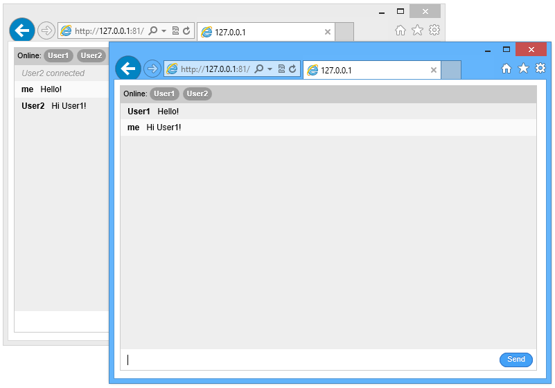

<properties 
    pageTitle="Node.js-Anwendung, die mithilfe der Socket.io | Microsoft Azure" 
    description="Erfahren Sie, wie socket.io in einer node.js-Anwendung auf Azure verwenden." 
    services="cloud-services" 
    documentationCenter="nodejs" 
    authors="rmcmurray" 
    manager="wpickett" 
    editor=""/>

<tags 
    ms.service="cloud-services" 
    ms.workload="tbd" 
    ms.tgt_pltfrm="na" 
    ms.devlang="nodejs" 
    ms.topic="article" 
    ms.date="08/11/2016" 
    ms.author="robmcm"/>

# Erstellen Sie eine Node.js Chat-Anwendung mit Socket.IO eine Azure-Cloud-Dienst

Socket.IO bietet Echtzeit Kommunikation zwischen zwischen Ihrem node.js-Server und Clients. In diesem Lernprogramm führt Sie durch das Hosten eines Sockets. EA basierend auf Azure Chat-Anwendung. Weitere Informationen zum Socket.IO finden Sie unter <http://socket.io/>.

Ein Screenshot der fertigen Anwendung lautet wie folgt:

![Ein Browserfenster mit dem Dienst auf Azure gehostet][completed-app]  

## Erforderliche Komponenten

Stellen Sie sicher, dass die folgenden Produkte und Versionen installiert sind, damit das Beispiel in diesem Artikel erfolgreich abgeschlossen:

* Installieren Sie [Visual Studio 2013](https://www.visualstudio.com/en-us/downloads/download-visual-studio-vs.aspx)
* Installieren von [Node.js](https://nodejs.org/download/)
* Installieren Sie [Python Version 2.7.10](https://www.python.org/)

## Erstellen Sie ein Projekt Cloud-Dienst

Die folgenden Schritte erstellen Projekt für den Cloud-Dienst, der die Anwendung Socket.IO gehostet wird.

1. Suchen Sie über das **Menü Start** oder **-Startbildschirm**für **Windows PowerShell**. Klicken Sie abschließend mit der rechten Maustaste in **Windows PowerShell** , und wählen Sie **Als Administrator ausführen**.

    ![Azure PowerShell-Symbol][powershell-menu]

2. Erstellen Sie ein Verzeichnis namens **c:\\Knoten**. 
 
        PS C:\> md node

3. Wechseln Sie in der **c:\\Knoten** Verzeichnis
 
        PS C:\> cd node

4. Geben Sie die folgenden Befehle, um eine neue Lösung mit dem Namen **Chatapp** und eine Worker-Rolle mit dem Namen **WorkerRole1**zu erstellen:

        PS C:\node> New-AzureServiceProject chatapp
        PS C:\Node> Add-AzureNodeWorkerRole

    Sie sehen die folgende Antwort:

    

## Laden Sie das Beispiel Chat

Für dieses Projekt verwenden wir das Beispiel Chat aus dem [Socket.IO GitHub Repository]. Führen Sie die folgenden Schritte aus, um das Beispiel herunterladen und Lizenz des Projekts, die Sie zuvor erstellt haben.

1.  Erstellen Sie eine lokale Kopie des Repositorys mithilfe der Schaltfläche **Klonen** . Sie können auch die **ZIP-** Schaltfläche, das Projekt herunterladen.

    ![Ein Browserfenster https://github.com/LearnBoost/socket.io/tree/master/examples/chat, mit der hervorgehobenen ZIP Downloadsymbol anzeigen][chat-example-view]

3.  Die Directory-Struktur der lokalen Repository navigieren, bis Sie bei Eintreffen der **Beispiele\\Chat** Directory. Kopieren Sie den Inhalt dieses Verzeichnisses den **C:\\Knoten\\Chatapp\\WorkerRole1** zuvor erstellte Verzeichnis.

    ![Anzeigen des Inhalts der Beispiele-Explorer\\Chat Verzeichnis extrahiert aus dem Archiv][chat-contents]

    Die markierten Elemente aus dem Screenshot werden die Dateien kopiert haben, aus der **Beispiele\\Chat** Verzeichnis

4.  In der **C:\\Knoten\\Chatapp\\WorkerRole1** Verzeichnis, löschen Sie die Datei **server.js** , und benennen Sie die Datei **app.js** zu **server.js**. Dies entfernt die standardmäßige **server.js** -Datei, die zuvor erstellte das Cmdlet **AzureNodeWorkerRole hinzufügen** und mit der Anwendungsdatei aus dem Beispiel Chat ersetzt.

### Ändern der Server.js und Module installieren

Vor dem Testen der Anwendung im Emulator Azure, müssen wir einige kleinere Änderungen vornehmen. Führen Sie die folgenden Schritte aus, zu der Datei server.js:

1.  Öffnen Sie die Datei **server.js** in Visual Studio oder einem beliebigen Texteditor ein.

2.  Suchen Sie den Abschnitt **Modul Abhängigkeiten** am Anfang der server.js und ändern Sie die Zeile mit **Sio = Require('.. //.. LIB//Socket.IO')** zu **Sio = require('socket.io')** wie unten dargestellt:

        var express = require('express')
        , stylus = require('stylus')
        , nib = require('nib')
        //, sio = require('..//..//lib//socket.io'); //Original
        , sio = require('socket.io');                //Updated

3.  Um sicherzustellen, dass die Anwendung den richtigen Anschluss überwacht, öffnen Sie server.js in Editor oder Ihrem bevorzugten Editor, und klicken Sie dann ändern Sie die folgende Zeile, indem Sie **3000** mit **process.env.port** ersetzen, wie unten dargestellt:

        //app.listen(3000, function () {            //Original
        app.listen(process.env.port, function () {  //Updated
          var addr = app.address();
          console.log('   app listening on http://' + addr.address + ':' + addr.port);
        });

Gehen Sie nachdem Sie die Änderungen an **server.js**gespeichert folgendermaßen vor, um erforderlichen Module zu installieren und Testen der Anwendungs im Azure Emulator:

1.  Mithilfe der **PowerShell Azure**, wechseln Sie in der **C:\\Knoten\\Chatapp\\WorkerRole1** Verzeichnis, und verwenden Sie den folgenden Befehl aus, um die von dieser Anwendung benötigte Module zu installieren:

        PS C:\node\chatapp\WorkerRole1> npm install

    Hiermit wird der in der Datei package.json aufgeführten Module installiert. Nach Abschluss des Befehls sollte ähnlich wie der folgende Ausgabe angezeigt werden:

    ![Die Ausgabe der Npm Befehl installieren.][The-output-of-the-npm-install-command]

4.  Da in diesem Beispiel ursprünglich einen Teil der Socket.IO GitHub Repository wurde und direkt auf die Bibliothek Socket.IO relativen Pfad verweist, wurde Socket.IO nicht in der Datei package.json verwiesen wird, damit wir es installieren müssen, indem Sie den folgenden Befehl aus:

        PS C:\node\chatapp\WorkerRole1> npm install socket.io --save

### Testen und bereitstellen

1.  Starten Sie den Emulator, indem Sie den folgenden Befehl aus:

        PS C:\node\chatapp\WorkerRole1> Start-AzureEmulator -Launch

2.  Öffnen Sie einen Browser, und navigieren Sie zu **http://127.0.0.1**.

3.  Wenn das Browserfenster geöffnet wird, geben Sie ein, und geben Sie dann auf Treffer.
    Dadurch werden alle Sie Nachrichten als eine bestimmte Künstlername bereitstellen. Klicken Sie zum Testen der Funktionen für mehrere Benutzer öffnen Sie zusätzliche Browserfenster mit der gleichen URL zu, und geben Sie andere Benutzernamen.

    

3.  Beenden Sie den Emulator nach dem Testen der Anwendungs, indem Sie den folgenden Befehl aus:

        PS C:\node\chatapp\WorkerRole1> Stop-AzureEmulator

4.  Um die Anwendung in Azure bereitzustellen, verwenden Sie das **Veröffentlichen-AzureServiceProject** -Cmdlet. Beispiel:

        PS C:\node\chatapp\WorkerRole1> Publish-AzureServiceProject -ServiceName mychatapp -Location "East US" -Launch

    > [AZURE.IMPORTANT] Achten Sie darauf, um einen eindeutigen Namen zu verwenden, andernfalls Veröffentlichungsprozesses schlägt fehl. Nach Abschluss die Bereitstellung wird im Browser öffnen, und navigieren Sie zu der bereitgestellte Dienst.
    > 
    > Wenn Sie eine Fehlermeldung erhalten, dass die bereitgestellten Abonnementname im Profil der importierten veröffentlichen nicht vorhanden ist, müssen Sie herunterladen und importieren das Veröffentlichung Profil für Ihr Abonnement vor der Bereitstellung in Azure. Finden Sie im Abschnitt **Bereitstellung der Anwendung in Azure** [Erstellen](https://azure.microsoft.com/develop/nodejs/tutorials/getting-started/) und Bereitstellen einer Node.js-Anwendung auf Azure-Cloud-Dienst

    ![Ein Browserfenster mit dem Dienst auf Azure gehostet][completed-app]

    > [AZURE.NOTE] Wenn Sie eine Fehlermeldung erhalten, dass die bereitgestellten Abonnementname im Profil der importierten veröffentlichen nicht vorhanden ist, müssen Sie herunterladen und importieren das Veröffentlichung Profil für Ihr Abonnement vor der Bereitstellung in Azure. Finden Sie im Abschnitt **Bereitstellung der Anwendung in Azure** [Erstellen](https://azure.microsoft.com/develop/nodejs/tutorials/getting-started/) und Bereitstellen einer Node.js-Anwendung auf Azure-Cloud-Dienst

Ihrer Anwendung wird jetzt Azure ausgeführt und kann Chatnachrichten zwischen verschiedenen Clients mit Socket.IO weiterzuleiten.

> [AZURE.NOTE] In diesem Beispiel beträgt zur Vereinfachung chatten zwischen Benutzer mit der gleichen Instanz verbunden sind. Dies bedeutet, dass, wenn zwei Instanzen von Arbeitskollegen Rolle Cloud-Dienst erstellt hat, Benutzer nur chatten mit anderen Personen mit der gleichen Instanz von Arbeitskollegen Rolle verbunden sind. Um die Anwendung für die Arbeit mit mehreren Rolleninstanzen zu skalieren, können Sie eine Technologie wie Dienstbus freigeben den Socket.IO Store Status mehrerer Instanzen erstellen. Beispiele finden Sie unter der Verwendung von Bus Servicewarteschlangen und Themen Beispielen im [Azure SDK für Node.js GitHub Repository](https://github.com/WindowsAzure/azure-sdk-for-node).

##Nächste Schritte

In diesem Lernprogramm haben Sie gelernt, wie eine einfache Chat-Anwendung, die in Azure-Cloud-Dienst gehostet wird erstellt. Wie dieser Anwendung auf einer Website Azure gehostet finden Sie unter [Erstellen einer Node.js Chat-Anwendung mit Socket.IO eine Azure-Website][chatwebsite].

Weitere Informationen finden Sie auch im [Node.js Developer Center](/develop/nodejs/).

  [chatwebsite]: /develop/nodejs/tutorials/website-using-socketio/

  [Azure SLA]: http://www.windowsazure.com/support/sla/
  [Azure SDK for Node.js GitHub repository]: https://github.com/WindowsAzure/azure-sdk-for-node
  [completed-app]: ./media/cloud-services-nodejs-chat-app-socketio/socketio-10.png
  [Azure SDK for Node.js]: https://www.windowsazure.com/develop/nodejs/
  [Node.js Web Application]: https://www.windowsazure.com/develop/nodejs/tutorials/getting-started/
  [Socket.IO GitHub repository]: https://github.com/LearnBoost/socket.io/tree/0.9.14
  [Azure Considerations]: #windowsazureconsiderations
  [Hosting the Chat Example in a Worker Role]: #hostingthechatexampleinawebrole
  [Summary and Next Steps]: #summary
  [powershell-menu]: ./media/cloud-services-nodejs-chat-app-socketio/azure-powershell-start.png

  [chat example]: https://github.com/LearnBoost/socket.io/tree/master/examples/chat
  [chat-example-view]: ./media/cloud-services-nodejs-chat-app-socketio/socketio-22.png
  
  
  [chat-contents]: ./media/cloud-services-nodejs-chat-app-socketio/socketio-5.png
  [The-output-of-the-npm-install-command]: ./media/cloud-services-nodejs-chat-app-socketio/socketio-7.png
  [The output of the Publish-AzureService command]: ./media/cloud-services-nodejs-chat-app-socketio/socketio-9.png
  
 
