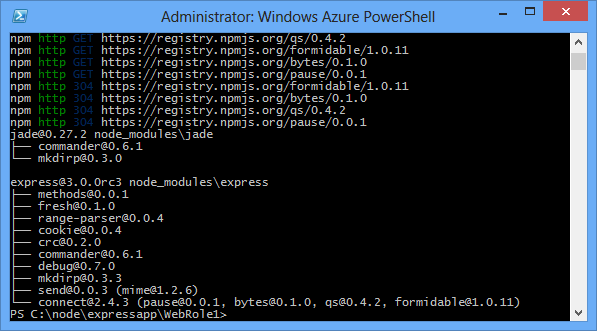
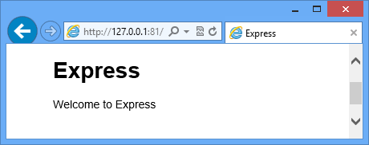

<properties 
    pageTitle="Web App mit Express (Node.js) | Microsoft Azure" 
    description="Ein Lernprogramm, die in der Cloud-Dienst Lernprogramm erstellt und veranschaulicht, wie das Modul Express verwenden." 
    services="cloud-services" 
    documentationCenter="nodejs" 
    authors="rmcmurray" 
    manager="wpickett" 
    editor=""/>

<tags 
    ms.service="cloud-services" 
    ms.workload="tbd" 
    ms.tgt_pltfrm="na" 
    ms.devlang="nodejs" 
    ms.topic="article" 
    ms.date="08/11/2016" 
    ms.author="robmcm"/>

# Erstellen einer Node.js Webanwendung mit Express auf Azure-Cloud-Dienst

Node.js enthält einen minimalen Satz von Funktionen, in die Laufzeit Core.
Entwickler werden häufig 3rd Party Module verwenden, um zusätzliche Funktionen bereitzustellen, bei der Entwicklung einer Anwendungs Node.js. In diesem Lernprogramm erstellen Sie eine neue Anwendung mit dem [Express][] -Modul, das MVC-Framework zum Erstellen von Webanwendungen Node.js bereitstellt.

Ein Screenshot der fertigen Anwendung lautet wie folgt:

##Erstellen Sie ein Projekt Cloud-Dienst

Führen Sie die folgenden Schritte aus, um ein neues Projekt Cloud-Dienst mit dem Namen 'Expressapp' zu erstellen:

1. Suchen Sie über das **Menü Start** oder **-Startbildschirm**für **Windows PowerShell**. Klicken Sie abschließend mit der rechten Maustaste in **Windows PowerShell** , und wählen Sie **Als Administrator ausführen**.

    

    [AZURE.INCLUDE [install-dev-tools](../../includes/install-dev-tools.md)]

2. Wechseln Sie in der **c:\\Knoten** Verzeichnis, und geben Sie die folgenden Befehle, um eine neue Lösung mit dem Namen **Expressapp** und einer Webrolle mit dem Namen **WebRole1**zu erstellen:

        PS C:\node> New-AzureServiceProject expressapp
        PS C:\Node\expressapp> Add-AzureNodeWebRole
        PS C:\Node\expressapp> Set-AzureServiceProjectRole WebRole1 Node 0.10.21

    > [AZURE.NOTE] Standardmäßig wird **Hinzufügen-AzureNodeWebRole** eine ältere Version von Node.js verwendet. Die oben genannten **Set-AzureServiceProjectRole** -Anweisung weist Azure v0.10.21 des Knotens verwenden.  Beachten Sie, dass die Parameter Groß-/Kleinschreibung beachtet werden.  Sie können überprüfen, dass die richtige Version von Node.js ausgewählt wurde, indem Sie die Eigenschaft **TTS** in **WebRole1\package.json**aktivieren.

##Express installieren

1. Installieren Sie Express-Generator, indem Sie den folgenden Befehl aus:

        PS C:\node\expressapp> npm install express-generator -g

    Die Ausgabe des Befehls Npm sollte das Ergebnis unten ähneln. 

    

2. Wechseln Sie in das Verzeichnis **WebRole1** und verwenden Sie express Befehl, um eine neue Anwendung generieren:

        PS C:\node\expressapp\WebRole1> express

    Sie werden aufgefordert, eine frühere Anwendung zu überschreiben. Geben Sie **y** oder auf **Ja,** um den Vorgang fortzusetzen. Express generiert die Datei app.js und eine Ordnerstruktur für die Erstellung der Anwendung.

    

5.  Um zusätzliche Abhängigkeiten in der Datei package.json definierte installiert haben, geben Sie den folgenden Befehl aus:

        PS C:\node\expressapp\WebRole1> npm install

    

6.  Verwenden Sie den folgenden Befehl aus, um die Datei **Papierkorb / "www"** zu **server.js**zu kopieren. Dies ist der Cloud-Dienst den Einstiegspunkt für diese Anwendung finden kann.

        PS C:\node\expressapp\WebRole1> copy bin/www server.js

    Nachdem Sie diesen Befehl abgeschlossen ist, sollten Sie eine Datei **server.js** im Verzeichnis WebRole1 verfügen.

7.  Ändern der **server.js** zum Entfernen eines der '.' Zeichen aus der folgenden Zeile.

        var app = require('../app');

    Nachdem Sie diese Änderung vorgenommen haben, sollte die Zeile wie folgt angezeigt werden.

        var app = require('./app');

    Diese Änderung ist erforderlich, da wir die Datei (vormals **Papierkorb/Www**,) verschoben im selben Verzeichnis wie erforderlich, dass die app-Datei. Nachdem Sie diese Änderung vorgenommen haben, speichern Sie die **server.js** -Datei ein.

8.  Verwenden Sie den folgenden Befehl zum Ausführen der Anwendung im Azure Emulator aus:

        PS C:\node\expressapp\WebRole1> Start-AzureEmulator -launch

    

## Ändern der Ansicht

Ändern Sie jetzt die Ansicht aus, um die Meldung "Willkommen zu Express in Azure" anzuzeigen.

1.  Geben Sie zum Öffnen der Datei index.jade den folgenden Befehl aus:

        PS C:\node\expressapp\WebRole1> notepad views/index.jade

    

    Jade ist der Standard-Ansicht-Engine von Applications Express verwendet. Weitere Informationen zu den Jade Ansicht-Engine finden Sie unter [http://jade-lang.com][].

2.  Ändern Sie die letzte Zeile des Texts durch **in Azure**anfügen.

    

3.  Speichern Sie die Datei, und beenden Sie Editor.

4.  Ihren Browser aktualisieren, und die Änderungen werden angezeigt.

    

Nach dem Testen der Anwendungs, verwenden Sie das Cmdlet **Beenden-AzureEmulator** Emulator beenden aus.

##Veröffentlichen Sie die Anwendung in Azure

Klicken Sie im Fenster Azure PowerShell verwenden Sie das Cmdlet **Veröffentlichen-AzureServiceProject** zum Bereitstellen der Anwendung in einen Cloud-service

    PS C:\node\expressapp\WebRole1> Publish-AzureServiceProject -ServiceName myexpressapp -Location "East US" -Launch

Nach Abschluss des Bereitstellungsvorgangs wird Ihr Browser öffnen und die Webseite anzuzeigen.

## Nächste Schritte

Weitere Informationen finden Sie unter der [Node.js Developer Center](/develop/nodejs/).

  [Node.js Web Application]: http://www.windowsazure.com/develop/nodejs/tutorials/getting-started/
  [Express]: http://expressjs.com/
  [http://Jade-lang.com]: http://jade-lang.com

 
