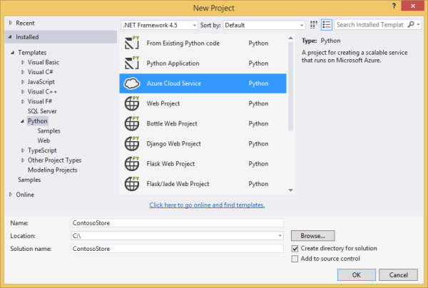

<properties
    pageTitle="Python Web- und Worker Rollen mit Visual Studio | Microsoft Azure"
    description="Übersicht über die Verwendung von Python-Tools für Visual Studio zum Erstellen von Azure-Cloud-Diensten, einschließlich Webrollen und Worker-Rollen."
    services="cloud-services"
    documentationCenter="python"
    authors="thraka"
    manager="timlt"
    editor=""/>

<tags
    ms.service="cloud-services"
    ms.workload="tbd"
    ms.tgt_pltfrm="na"
    ms.devlang="python"
    ms.topic="hero-article"
    ms.date="08/03/2016"
    ms.author="adegeo"/>


# <a name="python-web-and-worker-roles-with-python-tools-for-visual-studio"></a>Python Web- und Worker Rollen mit Python-Tools für Visual Studio

Dieser Artikel enthält eine Übersicht zur Verwendung von Python Web- und Worker Rollen [Python-Tools für Visual Studio][]verwenden. Sie erfahren, wie mit Visual Studio erstellen und Bereitstellen einer einfachen Cloud-Dienst, die Python verwendet.

## <a name="prerequisites"></a>Erforderliche Komponenten

 - Visual Studio-2013 oder 2015
 - [Python-Tools für Visual Studio][] (PTVS)
 - [Azure SDK-Tools für im Vergleich mit einer 2013][] oder [Azure SDK-Tools für im Vergleich mit einer 2015][]
 - [Python 2.7 32-Bit-][] oder [Python 3.5 32-Bit-Version][]

[AZURE.INCLUDE [create-account-and-websites-note](../../includes/create-account-and-websites-note.md)]

## <a name="what-are-python-web-and-worker-roles"></a>Was sind Python Web- und Worker Rollen?

Azure bietet drei Modelle für die Ausführung von Applications zu berechnen: [Web Apps-Features in der App-Verwaltungsdienst Azure][execution model-web sites], [Azure-virtuellen Computern][execution model-vms], und [Azure Cloud Services][execution model-cloud services]. Alle drei Modelle unterstützen Python. Clouddienste, die darunter Web- und Worker Rollen, bieten *Plattform als Service (PaaS)*. In einen Clouddienst bietet eine Webrolle einen dedizierten Host Front-End-Webanwendungen Webserver (Internetinformationsdienste) aus, während eine Worker-Rolle asynchrone langer oder ständige Aufgaben unabhängig von der Interaktion mit dem Benutzer oder Eingabe ausgeführt werden kann.

Weitere Informationen finden Sie unter [Neuigkeiten auf einen Clouddienst?].

> [AZURE.NOTE]*Nachschlagen zum Erstellen einer einfachen Websites?*
Ihr Szenario nur eine einfache Front-End-Website umfasst, sollten Sie das einfache Web Apps-Feature in Azure-App-Dienst verwenden. Sie können ganz einfach in einen Cloud-Service wie Aktualisieren Ihrer Website immer umfangreicher wird, und ändern Sie Ihren Anforderungen. Finden Sie im Artikel, die Entwicklung des Web Apps-Features in der App-Verwaltungsdienst Azure Deckblatt <a href="/develop/python/">Python Developer Center</a> .
<br />


## <a name="project-creation"></a>Erstellen eines Projekts

In Visual Studio können Sie im Dialogfeld **Neues Projekt** unter **Python** **Azure-Cloud-Dienst** auswählen.



Im Assistenten Azure-Cloud-Dienst können Sie neue Web- und Worker Rollen erstellen.


Die Vorlage Worker Rolle im Lieferumfang von häufig verwendeter Code für die Verbindung zu einem Konto Azure-Speicher oder Azure Service Bus.


Sie können einen vorhandenen Clouddienst zu einem beliebigen Zeitpunkt Web oder Arbeitskollegen Rollen hinzufügen.  Sie können vorhandene Projekte in Ihrer Lösung hinzufügen oder neue erstellen.


Ihre Cloud-Dienst kann in verschiedenen Sprachen implementiert Rollen enthalten.  Beispielsweise können Sie eine Python Webrolle mithilfe von Django, mit Python oder mit c# Worker-Rollen implementiert haben.  Sie können ganz einfach zwischen Ihrer Rollen mit Servicebuswarteschlangen oder Speicher Warteschlangen kommunizieren.

## <a name="install-python-on-the-cloud-service"></a>Installieren Sie Python Cloud-Dienst

>[AZURE.WARNING] Die Setupskripts, die mit Visual Studio (zum Zeitpunkt der letzten Aktualisierung in diesem Artikel) installiert sind, funktionieren nicht. Dieser Abschnitt beschreibt das Problem zu umgehen.

Das Hauptfenster Problem mit der Setup-Skripts sind, dass er nicht Python installieren. Definieren Sie zunächst zwei [Startaufgaben](cloud-services-startup-tasks.md) in der Datei [ServiceDefinition.csdef](cloud-services-model-and-package.md#servicedefinitioncsdef) . Die erste Aufgabe (**PrepPython.ps1**) downloads und die Python-Laufzeit installiert. Die zweite Aufgabe (**PipInstaller.ps1**) wird ausgeführt, um Abhängigkeiten zu installieren, die Sie möglicherweise Pip.

Die folgenden Skripts wurden geschrieben Python 3.5 verwendet. Wenn Sie, verwenden Sie die Version möchten 2.x Python, legen Sie die Variable **PYTHON2** -Datei auf **auf** der zwei Start Vorgänge und die Aufgabe Laufzeit: `<Variable name="PYTHON2" value="<mark>on</mark>" />`.


```xml
<Startup>

  <Task executionContext="elevated" taskType="simple" commandLine="bin\ps.cmd PrepPython.ps1">
    <Environment>
      <Variable name="EMULATED">
        <RoleInstanceValue xpath="/RoleEnvironment/Deployment/@emulated" />
      </Variable>
      <Variable name="PYTHON2" value="off" />
    </Environment>
  </Task>

  <Task executionContext="elevated" taskType="simple" commandLine="bin\ps.cmd PipInstaller.ps1">
    <Environment>
      <Variable name="EMULATED">
        <RoleInstanceValue xpath="/RoleEnvironment/Deployment/@emulated" />
      </Variable>
      <Variable name="PYTHON2" value="off" />
    </Environment>
    
  </Task>

</Startup>
```

Die Variablen **PYTHON2** und **PYPATH** muss der Worker Start Vorgang hinzugefügt werden. Die Variable **PYPATH** wird nur verwendet, wenn die Variable **PYTHON2** **auf**festgelegt ist.

```xml
<Runtime>
  <Environment>
    <Variable name="EMULATED">
      <RoleInstanceValue xpath="/RoleEnvironment/Deployment/@emulated" />
    </Variable>
    <Variable name="PYTHON2" value="off" />
    <Variable name="PYPATH" value="%SystemDrive%\Python27" />
  </Environment>
  <EntryPoint>
    <ProgramEntryPoint commandLine="bin\ps.cmd LaunchWorker.ps1" setReadyOnProcessStart="true" />
  </EntryPoint>
</Runtime>
```

#### <a name="sample-servicedefinitioncsdef"></a>Beispiel für ServiceDefinition.csdef

```xml
<?xml version="1.0" encoding="utf-8"?>
<ServiceDefinition name="AzureCloudServicePython" xmlns="http://schemas.microsoft.com/ServiceHosting/2008/10/ServiceDefinition" schemaVersion="2015-04.2.6">
  <WorkerRole name="WorkerRole1" vmsize="Small">
    <ConfigurationSettings>
      <Setting name="Microsoft.WindowsAzure.Plugins.Diagnostics.ConnectionString" />
      <Setting name="Python2" />
    </ConfigurationSettings>
    <Startup>
      <Task executionContext="elevated" taskType="simple" commandLine="bin\ps.cmd PrepPython.ps1">
        <Environment>
          <Variable name="EMULATED">
            <RoleInstanceValue xpath="/RoleEnvironment/Deployment/@emulated" />
          </Variable>
          <Variable name="PYTHON2" value="off" />
        </Environment>
      </Task>
      <Task executionContext="elevated" taskType="simple" commandLine="bin\ps.cmd PipInstaller.ps1">
        <Environment>
          <Variable name="EMULATED">
            <RoleInstanceValue xpath="/RoleEnvironment/Deployment/@emulated" />
          </Variable>
          <Variable name="PYTHON2" value="off" />
        </Environment>
      </Task>
    </Startup>
    <Runtime>
      <Environment>
        <Variable name="EMULATED">
          <RoleInstanceValue xpath="/RoleEnvironment/Deployment/@emulated" />
        </Variable>
        <Variable name="PYTHON2" value="off" />
        <Variable name="PYPATH" value="%SystemDrive%\Python27" />
      </Environment>
      <EntryPoint>
        <ProgramEntryPoint commandLine="bin\ps.cmd LaunchWorker.ps1" setReadyOnProcessStart="true" />
      </EntryPoint>
    </Runtime>
    <Imports>
      <Import moduleName="RemoteAccess" />
      <Import moduleName="RemoteForwarder" />
    </Imports>
  </WorkerRole>
</ServiceDefinition>
```


Erstellen Sie anschließend die Dateien **PrepPython.ps1** und **PipInstaller.ps1** in der **. / bin** Ordner Ihrer Rolle.

#### <a name="preppythonps1"></a>PrepPython.ps1

Mit diesem Skript werden Python installiert. Wenn die **PYTHON2** Umgebung Variable festgelegt wurde, **und klicken Sie dann Python 2.7** installiert werden, andernfalls Python 3.5 installiert werden.

```powershell
$is_emulated = $env:EMULATED -eq "true"
$is_python2 = $env:PYTHON2 -eq "on"
$nl = [Environment]::NewLine

if (-not $is_emulated){
    Write-Output "Checking if python is installed...$nl"
    if ($is_python2) {
        & "${env:SystemDrive}\Python27\python.exe"  -V | Out-Null
    }
    else {
        py -V | Out-Null
    }

    if (-not $?) {

        $url = "https://www.python.org/ftp/python/3.5.2/python-3.5.2-amd64.exe"
        $outFile = "${env:TEMP}\python-3.5.2-amd64.exe"

        if ($is_python2) {
            $url = "https://www.python.org/ftp/python/2.7.12/python-2.7.12.amd64.msi"
            $outFile = "${env:TEMP}\python-2.7.12.amd64.msi"
        }
        
        Write-Output "Not found, downloading $url to $outFile$nl"
        Invoke-WebRequest $url -OutFile $outFile
        Write-Output "Installing$nl"

        if ($is_python2) {
            Start-Process msiexec.exe -ArgumentList "/q", "/i", "$outFile", "ALLUSERS=1" -Wait
        }
        else {
            Start-Process "$outFile" -ArgumentList "/quiet", "InstallAllUsers=1" -Wait
        }

        Write-Output "Done$nl"
    }
    else {
        Write-Output "Already installed"
    }
}
```

#### <a name="pipinstallerps1"></a>PipInstaller.ps1

Dieses Skript ruft von Pip und alle die Abhängigkeiten in der Datei **requirements.txt** Installationen. Wenn die **PYTHON2** Umgebung Variable festgelegt wurde, **und klicken Sie dann Python 2.7** verwendet werden, andernfalls Python 3.5 verwendet werden.

```powershell
$is_emulated = $env:EMULATED -eq "true"
$is_python2 = $env:PYTHON2 -eq "on"
$nl = [Environment]::NewLine

if (-not $is_emulated){
    Write-Output "Checking if requirements.txt exists$nl"
    if (Test-Path ..\requirements.txt) {
        Write-Output "Found. Processing pip$nl"

        if ($is_python2) {
            & "${env:SystemDrive}\Python27\python.exe" -m pip install -r ..\requirements.txt
        }
        else {
            py -m pip install -r ..\requirements.txt
        }

        Write-Output "Done$nl"
    }
    else {
        Write-Output "Not found$nl"
    }
}
```

#### <a name="modify-launchworkerps1"></a>Ändern der LaunchWorker.ps1

>[AZURE.NOTE] Im Fall eines Projekts **Worker-Rolle** ist **LauncherWorker.ps1** Datei erforderlich, um die Startdatei ausführen. In einem Projekt **Webrolle** ist die Startdatei stattdessen in den Projekteigenschaften definiert.

Die **bin\LaunchWorker.ps1** ursprünglich erstellt wurde, um viele vorbereitende arbeiten kann jedoch wirklich funktioniert nicht. Ersetzen Sie den Inhalt in dieser Datei mit dem folgenden Skript ein.

Dieses Skript ruft die **worker.py** -Datei aus Ihrem Projekt Python. Wenn die **PYTHON2** Umgebung Variable festgelegt wurde, **und klicken Sie dann Python 2.7** verwendet werden, andernfalls Python 3.5 verwendet werden.

```powershell
$is_emulated = $env:EMULATED -eq "true"
$is_python2 = $env:PYTHON2 -eq "on"
$nl = [Environment]::NewLine

if (-not $is_emulated)
{
    Write-Output "Running worker.py$nl"

    if ($is_python2) {
        cd..
        iex "$env:PYPATH\python.exe worker.py"
    }
    else {
        cd..
        iex "py worker.py"
    }
}
else
{
    Write-Output "Running (EMULATED) worker.py$nl"

    # Customize to your local dev environment

    if ($is_python2) {
        cd..
        iex "$env:PYPATH\python.exe worker.py"
    }
    else {
        cd..
        iex "py worker.py"
    }
}
```

#### <a name="pscmd"></a>PS.cmd

Visual Studio-Vorlagen sollte haben erstellt eine **ps.cmd** -Datei in die **. / bin** Ordner. Diese Shellskript, der oben genannten PowerShell Wrapperskripts ruft sowie die Protokollierung basierend auf den Namen des Wrappers PowerShell bezeichnet. Wenn diese Datei Besprechungsnotizen, hier was es sein sollte. 

```bat
@echo off

cd /D %~dp0

if not exist "%DiagnosticStore%\LogFiles" mkdir "%DiagnosticStore%\LogFiles"
%SystemRoot%\System32\WindowsPowerShell\v1.0\powershell.exe -ExecutionPolicy Unrestricted -File %* >> "%DiagnosticStore%\LogFiles\%~n1.txt" 2>> "%DiagnosticStore%\LogFiles\%~n1.err.txt"
```


## <a name="run-locally"></a>Lokal ausführen

Wenn Sie Ihr Projekt Cloud-Dienst, wie das Startprojekt festlegen, und drücken Sie F5, im lokalen Azure Emulator Cloud-Dienst ausgeführt wird.

Ebenso im Emulator für das Debuggen (z. B. Haltepunkte) funktioniert nicht, obwohl PTVS unterstützt.

Um Ihre Rollen Web- und Worker Debuggen, können Sie als die Startprojekt für das Projekt Rolle festlegen und Debuggen, stattdessen.  Sie können auch mehrere Startprojekte festlegen.  Mit der rechten Maustaste in der Lösung, und wählen Sie **Startprojekte festlegen**.


## <a name="publish-to-azure"></a>Veröffentlichen auf Azure

Veröffentlichen, mit der rechten Maustaste in des Projekts Cloud-Dienst in die Lösung, und wählen Sie dann auf **Veröffentlichen**.


Folgen Sie den Assistenten. Wenn Sie möchten, aktivieren Sie den Remotedesktop. Remotedesktop ist hilfreich, wenn Sie etwas debuggen müssen.

Wenn Sie die Konfiguration von Einstellungen abgeschlossen haben, klicken Sie auf **Veröffentlichen**.

Einige Fortschritt im Ausgabefenster angezeigt wird, und dann wird das Fenster Microsoft Azure Aktivität Log angezeigt.


Bereitstellung dauert einige Minuten, und klicken Sie dann auf Azure Ihrer Web und/oder Worker Rollen ausgeführt!

### <a name="investigate-logs"></a>Ermitteln von Protokollen

Nachdem die Cloud-Dienst virtuellen Computern gestartet und Python Installationen, können Sie sich die Protokolle Fehlermeldungen finden ansehen. Diese Protokolle befinden sich der **C:\Resources\Directory\\{Rolle} \LogFiles** Ordner. **PrepPython.err.txt** müssen mindestens ein Fehler darin aus, wenn das Skript versucht, um festzustellen, ob Python installiert ist und **PipInstaller.err.txt** möglicherweise über eine veraltete Version von Pip melden.

## <a name="next-steps"></a>Nächste Schritte

Ausführlichere Informationen zum Arbeiten mit Web- und Worker Rollen in Python Tools für Visual Studio finden Sie in der Dokumentation PTVS:

- [Cloud Service-Projekte][]

Ausführliche Informationen zur Verwendung von Ihrem Web- und Worker Rollen, z. B. mit Azure-Speicher oder Dienstbus, Azure Services finden Sie unter den folgenden Artikeln.

- [BLOB-Dienst][]
- [Tabelle-Dienst][]
- [Warteschlangendienst][]
- [Reaktionsgruppendienst Bus Warteschlangen][]
- [Service Bus Topics][]


<!--Link references-->

[Was ist eine Cloud-Dienst?]: cloud-services-choose-me.md
[execution model-web sites]: ../app-service-web/app-service-web-overview.md
[execution model-vms]: ../virtual-machines/virtual-machines-windows-about.md
[execution model-cloud services]: cloud-services-choose-me.md
[Python Developer Center]: /develop/python/

[BLOB-Dienst]: ../storage/storage-python-how-to-use-blob-storage.md
[Warteschlangendienst]: ../storage/storage-python-how-to-use-queue-storage.md
[Tabelle-Dienst]: ../storage/storage-python-how-to-use-table-storage.md
[Reaktionsgruppendienst Bus Warteschlangen]: ../service-bus-messaging/service-bus-python-how-to-use-queues.md
[Service Bus Topics]: ../service-bus-messaging/service-bus-python-how-to-use-topics-subscriptions.md


<!--External Link references-->

[Python-Tools für Visual Studio]: http://aka.ms/ptvs
[Python Tools for Visual Studio Documentation]: http://aka.ms/ptvsdocs
[Cloud Service-Projekte]: http://go.microsoft.com/fwlink/?LinkId=624028
[Azure SDK-Tools für 2013 im Vergleich]: http://go.microsoft.com/fwlink/?LinkId=323510
[Azure SDK-Tools für im Vergleich mit einer 2015]: http://go.microsoft.com/fwlink/?LinkId=518003
[Python 2.7 32-bit]: https://www.python.org/downloads/
[Python 3.5 32-bit]: https://www.python.org/downloads/
