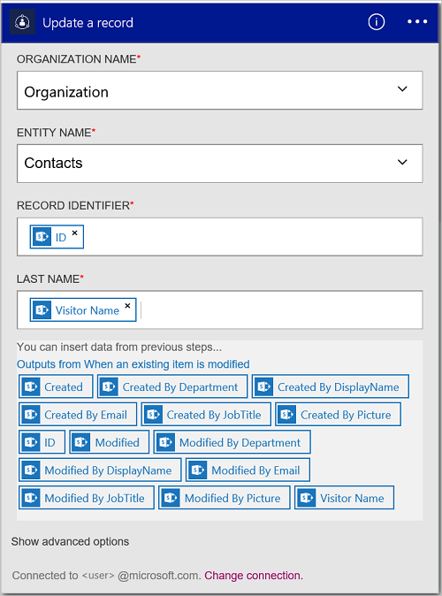

<properties
    pageTitle="Hinzufügen von der Dynamics CRM Online Verbinder zu Ihrer Apps Logik | Microsoft Azure"
    description="Erstellen Sie Logik apps mit Azure-App-Dienst an. Dynamics CRM Online Verbindung Provider bietet eine API zur Arbeit mit Personen an Dynamics CRM Online."
    services="logic-apps"    
    documentationCenter=""     
    authors="MandiOhlinger"    
    manager="erikre"    
    editor="" 
    tags="connectors" />

<tags
ms.service="logic-apps"
ms.devlang="na"
ms.topic="article"
ms.tgt_pltfrm="na"
ms.workload="integration"
ms.date="08/15/2016"
ms.author="mandia"/>

# Erste Schritte mit der Dynamics CRM Online Verbinder
Verbinden Sie mit Dynamics CRM Online zum Erstellen eines neuen Datensatzes Aktualisieren eines Elements und vieles mehr. Mit CRM Online können Sie folgende Aktionen ausführen:

- Erstellen Sie Ihr Unternehmen Fluss basierend auf den Daten, die Sie von CRM Online erhalten. 
- Verwenden von Aktionen, die einen Datensatz löschen erhalten Personen und vieles mehr. Diese Aktionen erhalten eine Antwort, und nehmen Sie die Ausgabe dann für andere Aktionen verfügbar. Wenn ein Element in CRM aktualisiert wird, können Sie beispielsweise eine e-Mail-Nachricht mit Office 365 senden.

In diesem Thema wird gezeigt, wie den Dynamics CRM Online Verbinder in einer app Logik verwenden, und auch Listet die Trigger und Aktionen.

>[AZURE.NOTE] Diese Version des Artikels gilt Logik Apps allgemeine Verfügbarkeit (GA) aus.

Weitere Informationen zu Logik Apps finden Sie unter [Was sind die Logik apps](../app-service-logic/app-service-logic-what-are-logic-apps.md) , und [Erstellen Sie eine app Logik](../app-service-logic/app-service-logic-create-a-logic-app.md).

## Verbinden mit Dynamics CRM Online

Bevor Sie Ihre app Logik Dienste zugreifen kann, erstellen Sie zuerst eine *Verbindung* mit dem Dienst an. Eine Verbindung stellt eine Verbindung zwischen einer app Logik und einem anderen Dienst. Beispielsweise benötigen zum Verbinden mit Dynamics Sie zuerst eine *Verbindung*für Dynamics CRM Online. Um eine Verbindung herzustellen, geben Sie die Anmeldeinformationen, die Sie normalerweise verwenden, den Zugriff auf Dienste, die Sie verbinden möchten. Geben Sie also mit Dynamics, die Anmeldeinformationen bei Ihrem Konto Dynamics CRM Online, um die Verbindung zu erstellen.

### Herstellen der Verbindungs

>[AZURE.INCLUDE [Steps to create a connection to Dynamics CRM Online Connection Provider](../../includes/connectors-create-api-crmonline.md)]

## Verwenden eines Triggers

Ein Trigger ist ein Ereignis, das zum Starten des Workflows in einer app Logik definiert verwendet werden kann. Trigger Umfrage"" Dienst unter zu einem Intervall und die gewünschte Häufigkeit. [Erfahren Sie mehr über Trigger](../app-service-logic/app-service-logic-what-are-logic-apps.md#logic-app-concepts).

1. Geben Sie in der app Logik "Dynamics" beim Abrufen einer Liste der Trigger:  

    

2. Wählen Sie **Dynamics CRM Online – Wenn ein Datensatz erstellt wird**. Wenn Sie bereits eine Verbindung besteht, wählen Sie dann eine Organisation und Entität in der Dropdown-Liste aus.

    

    Wenn Sie aufgefordert werden, melden Sie sich, geben Sie dann die Vorzeichen in Details, um die Verbindung zu erstellen. [Erstellen die Verbindung](connectors-create-api-crmonline.md#create-the-connection) in diesem Thema werden die Schritte aufgelistet. 

    > [AZURE.NOTE] In diesem Beispiel wird die app Logik ausgeführt, wenn ein Datensatz erstellt wird. Wenn die Ergebnisse dieser Trigger anzeigen möchten, fügen Sie eine andere Aktion, die Ihnen eine e-Mail sendet. Fügen Sie beispielsweise die Office 365 *Senden einer e-Mail* -Aktion, die Sie e-Mails, wenn Sie der neue Eintrag hinzugefügt wird. 

3. Wählen Sie die Schaltfläche **Bearbeiten** , und legen Sie die **Häufigkeit** und **Intervall** Werte. Angenommen, Sie bei Bedarf den Trigger auf Umfrage alle 15 Minuten, klicken Sie dann legen Sie die **Häufigkeit** auf **Minute**, und legen Sie das **Intervall** auf **15**. 

    

4. **Speichern** der Änderungen (oberen linken Ecke der Symbolleiste). Ihre app Logik wird gespeichert und automatisch aktiviert werden kann.

## Verwenden Sie eine Aktion

Eine Aktion ist ein Vorgang durchgeführten durch den Workflow in einer app Logik definiert. [Erfahren Sie mehr über Aktionen](../app-service-logic/app-service-logic-what-are-logic-apps.md#logic-app-concepts).

1. Wählen Sie das Pluszeichen (+) aus. Die Reihe von Optionen angezeigt: **Hinzufügen einer Aktion**, **Hinzufügen einer Bedingung**oder eine der **Weitere** Optionen.

    

2. Wählen Sie **eine Aktion hinzufügen**.

3. Geben Sie im Textfeld "Dynamics" können Sie eine Liste aller verfügbaren Aktionen zu gelangen.

    

4. Wählen Sie in diesem Beispiel **Dynamics CRM Online - einen Datensatz zu aktualisieren**. Wenn Sie bereits eine Verbindung besteht, wählen Sie dann den **Namen der Organisation**, **Entitätsnamen**und andere Eigenschaften aus:  

    

    Wenn Sie für die Verbindungsinformationen aufgefordert werden, geben Sie dann die Details, um die Verbindung zu erstellen. [Erstellen Sie die Verbindung](connectors-create-api-crmonline.md#create-the-connection) in diesem Thema werden diese Eigenschaften beschrieben. 

    > [AZURE.NOTE] In diesem Beispiel aktualisieren wir einen vorhandenen Datensatz in CRM Online. Ausgabe von einem anderen Trigger können Sie um den Datensatz zu aktualisieren. Beispielsweise Hinzufügen des Triggers SharePoint, *Wenn Sie ein vorhandenes Element geändert wird* . Fügen Sie dann die CRM Online *Aktualisieren ein Datensatzes* Aktion, die die SharePoint-Felder verwendet, um den vorhandenen Datensatz in CRM Online aktualisieren hinzu. 

5. **Speichern** der Änderungen (oberen linken Ecke der Symbolleiste). Ihre app Logik wird gespeichert und automatisch aktiviert werden kann.

## Technische Details

## Trigger

|Trigger | Beschreibung|
|--- | ---|
|[Wenn ein Datensatz erstellt wird](connectors-create-api-crmonline.md#when-a-record-is-created)|Auslösen ein Flusses Wenn ein Objekt in CRM erstellt wird.|
|[Wenn ein Datensatz aktualisiert wird](connectors-create-api-crmonline.md#when-a-record-is-updated)|Löst einen Fluss an, wenn ein Objekt in CRM geändert wird.|
|[Wenn ein Datensatz gelöscht wird](connectors-create-api-crmonline.md#when-a-record-is-deleted)|Löst einen Fluss an, wenn ein Objekt in CRM gelöscht wird.|

## Aktionen

|Aktion|Beschreibung|
|--- | ---|
|[Liste Datensätze](connectors-create-api-crmonline.md#list-records)|Mit diesem Vorgang wird die Einträge für eine Entität.|
|[Erstellen eines neuen Datensatzes](connectors-create-api-crmonline.md#create-a-new-record)|Dieser Vorgang wird einen neuen Datensatz einer Entität erstellt.|
|[Abrufen von Datensatz](connectors-create-api-crmonline.md#get-record)|Mit diesem Vorgang wird den angegebenen Datensatz für eine Entität.|
|[Löschen eines Datensatzes](connectors-create-api-crmonline.md#delete-a-record)|Dieser Vorgang löscht einen Datensatz aus einer Websitesammlung Entität.|
|[Aktualisieren eines Datensatzes](connectors-create-api-crmonline.md#update-a-record)|Dieser Vorgang aktualisiert einen vorhandenen Datensatz für eine Entität.|

### Details zu Trigger und Aktion

In diesem Abschnitt finden Sie unter die bestimmte Details zu den einzelnen Trigger und die Aktion, einschließlich alle erforderlichen oder optionalen von Eigenschaften und eine entsprechende Ausgabe der Verbinder zugeordnet.

#### Wenn ein Datensatz erstellt wird
Auslösen ein Flusses Wenn ein Objekt in CRM erstellt wird. 

|Eigenschaftsname| Anzeigename|Beschreibung|
| ---|---|---|
|DataSet *|Name der Organisation|Name der Organisation CRM wie "Contoso"|
|Tabelle *|Name der Entität|Name der Entität|
|$skip|Überspringen zählen|Anzahl von Einträgen, überspringen (Standard = 0)|
|$top|Abrufen der maximalen Anzahl|Maximale Anzahl von Einträgen, um die erste (Standard = 256)|
|$filter|Filtern der Abfrage|Die Abfrage ein ODATA Filter zum Einschränken der zurückgegebenen Einträge|
|$orderby|Sortiert nach|Eine ODATA OrderBy Abfrage zum Festlegen der Reihenfolge von Einträgen|

Ein Sternchen (*) bedeutet, dass die Eigenschaft erforderlich ist.

##### Die Ausgabedetails
ItemsList

| Eigenschaftsname | Datentyp |
|---|---|
|Wert|Matrix|

#### Wenn ein Datensatz aktualisiert wird
Löst einen Fluss an, wenn ein Objekt in CRM geändert wird. 

|Eigenschaftsname| Anzeigename|Beschreibung|
| ---|---|---|
|DataSet *|Name der Organisation|Name der Organisation CRM wie "Contoso"|
|Tabelle *|Name der Entität|Name der Entität|
|$skip|Überspringen zählen|Anzahl von Einträgen, überspringen (Standard = 0)|
|$top|Abrufen der maximalen Anzahl|Maximale Anzahl von Einträgen, um die erste (Standard = 256)|
|$filter|Filtern der Abfrage|Die Abfrage ein ODATA Filter zum Einschränken der zurückgegebenen Einträge|
|$orderby|Sortiert nach|Eine ODATA OrderBy Abfrage zum Festlegen der Reihenfolge von Einträgen|

Ein Sternchen (*) bedeutet, dass die Eigenschaft erforderlich ist.

##### Die Ausgabedetails
ItemsList

| Eigenschaftsname | Datentyp |
|---|---|
|Wert|Matrix|

#### Wenn ein Datensatz gelöscht wird
Löst einen Fluss an, wenn ein Objekt in CRM gelöscht wird. 

|Eigenschaftsname| Anzeigename|Beschreibung|
| ---|---|---|
|DataSet *|Name der Organisation|Name der Organisation CRM wie "Contoso"|
|Tabelle *|Name der Entität|Name der Entität|
|$skip|Überspringen zählen|Anzahl von Einträgen, überspringen (Standard = 0)|
|$top|Abrufen der maximalen Anzahl|Maximale Anzahl von Einträgen, um die erste (Standard = 256)|
|$filter|Filtern der Abfrage|Die Abfrage ein ODATA Filter zum Einschränken der zurückgegebenen Einträge|
|$orderby|Sortiert nach|Eine ODATA OrderBy Abfrage zum Festlegen der Reihenfolge von Einträgen|

Ein Sternchen (*) bedeutet, dass die Eigenschaft erforderlich ist.

##### Die Ausgabedetails
ItemsList

| Eigenschaftsname | Datentyp |
|---|---|
|Wert|Matrix|

#### Liste Datensätze
Mit diesem Vorgang wird die Einträge für eine Entität. 

|Eigenschaftsname| Anzeigename|Beschreibung|
| ---|---|---|
|DataSet *|Name der Organisation|Name der Organisation CRM wie "Contoso"|
|Tabelle *|Name der Entität|Name der Entität|
|$skip|Überspringen zählen|Anzahl von Einträgen, überspringen (Standard = 0)|
|$top|Abrufen der maximalen Anzahl|Maximale Anzahl von Einträgen, um die erste (Standard = 256)|
|$filter|Filtern der Abfrage|Die Abfrage ein ODATA Filter zum Einschränken der zurückgegebenen Einträge|
|$orderby|Sortiert nach|Eine ODATA OrderBy Abfrage zum Festlegen der Reihenfolge von Einträgen|

Ein Sternchen (*) bedeutet, dass die Eigenschaft erforderlich ist.

##### Die Ausgabedetails
ItemsList

| Eigenschaftsname | Datentyp |
|---|---|
|Wert|Matrix|

#### Erstellen eines neuen Datensatzes
Dieser Vorgang wird einen neuen Datensatz einer Entität erstellt. 

|Eigenschaftsname| Anzeigename|Beschreibung|
| ---|---|---|
|DataSet *|Name der Organisation|Name der Organisation CRM wie "Contoso"|
|Tabelle *|Name der Entität|Name der Entität|

Ein Sternchen (*) bedeutet, dass die Eigenschaft erforderlich ist.

##### Die Ausgabedetails
Keine.

#### Abrufen von Datensatz
Mit diesem Vorgang wird den angegebenen Datensatz für eine Entität. 

|Eigenschaftsname| Anzeigename|Beschreibung|
| ---|---|---|
|DataSet *|Name der Organisation|Name der Organisation CRM wie "Contoso"|
|Tabelle *|Name der Entität|Name der Entität|
|ID *|Elementbezeichner|Geben Sie den Bezeichner für den Eintrag|

Ein Sternchen (*) bedeutet, dass die Eigenschaft erforderlich ist.

##### Die Ausgabedetails
Keine.

#### Löschen eines Datensatzes
Dieser Vorgang löscht einen Datensatz aus einer Websitesammlung Entität. 

|Eigenschaftsname| Anzeigename|Beschreibung|
| ---|---|---|
|DataSet *|Name der Organisation|Name der Organisation CRM wie "Contoso"|
|Tabelle *|Name der Entität|Name der Entität|
|ID *|Elementbezeichner|Geben Sie den Bezeichner für den Eintrag|

Ein Sternchen (*) bedeutet, dass die Eigenschaft erforderlich ist.

#### Aktualisieren eines Datensatzes
Dieser Vorgang aktualisiert einen vorhandenen Datensatz für eine Entität. 

|Eigenschaftsname| Anzeigename|Beschreibung|
| ---|---|---|
|DataSet *|Name der Organisation|Name der Organisation CRM wie "Contoso"|
|Tabelle *|Name der Entität|Name der Entität|
|ID *|Datensatz-ID|Geben Sie den Bezeichner für den Eintrag|

Ein Sternchen (*) bedeutet, dass die Eigenschaft erforderlich ist.

##### Die Ausgabedetails
Keine.

## HTTP-Antworten

Eine oder mehrere der folgenden HTTP Statuscodes können die Aktionen und Trigger zurückgegeben werden: 

|Namen|Beschreibung|
|---|---|
|200|Okay|
|202|Akzeptiert|
|400|Ungültige Anforderung|
|401|Nicht autorisierte|
|403|Verboten|
|404|Nicht gefunden|
|500|Interner Serverfehler. Es ist ein Fehler aufgetreten.|
|Standard|Fehler bei Vorgang.|

## Nächste Schritte

[Erstellen einer app Logik](../app-service-logic/app-service-logic-create-a-logic-app.md). Untersuchen der verfügbaren Connectors in Logik Apps auf unserer [APIs Liste](apis-list.md)an.

