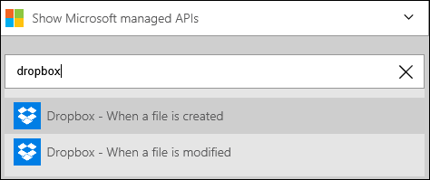
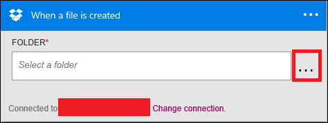
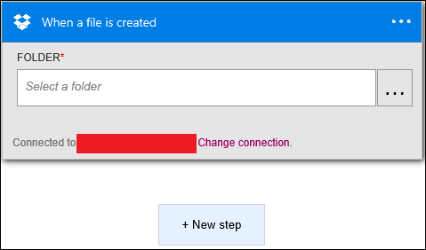
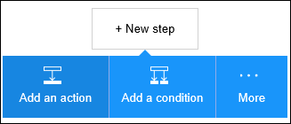
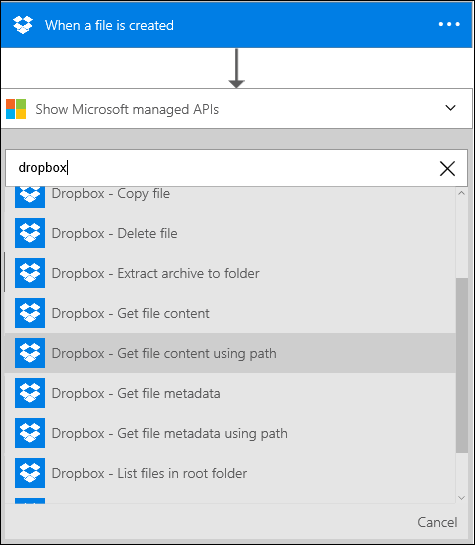
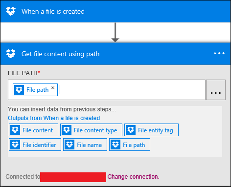

<properties
pageTitle="Dropbox | Microsoft Azure"
description="Erstellen Sie Logik apps mit Azure-App-Dienst an. Verbinden Sie mit Dropbox zum Verwalten Ihrer Dateien. Sie können verschiedene Aktionen wie z. B. Upload ausführen, aktualisieren, abrufen und Löschen von Dateien in Dropbox."
services="logic-apps"   
documentationCenter=".net,nodejs,java"  
authors="msftman"   
manager="erikre"    
editor=""
tags="connectors" />

<tags
ms.service="app-service-logic"
ms.devlang="multiple"
ms.topic="article"
ms.tgt_pltfrm="na"
ms.workload="integration"
ms.date="07/15/2016"
ms.author="deonhe"/>

# Erste Schritte mit der Dropbox Verbinder

Verbinden Sie mit Dropbox zum Verwalten Ihrer Dateien. Sie können verschiedene Aktionen wie z. B. Upload ausführen, aktualisieren, abrufen und Löschen von Dateien in Dropbox.

Um [alle Verbinder](./apis-list.md)verwenden zu können, müssen Sie zuerst eine app Logik zu erstellen. Sie können durch [Erstellen einer Logik app jetzt](../app-service-logic/app-service-logic-create-a-logic-app.md)loslegen.

## Herstellen einer Verbindung Dropbox mit

Bevor Sie Ihre app Logik Dienste zugreifen kann, müssen Sie zuerst eine *Verbindung* mit dem Dienst erstellen. Eine Verbindung stellt eine Verbindung zwischen einer app Logik und einem anderen Dienst. Beispielsweise benötigen Verbindung Dropbox Sie zuerst eine Dropbox *Verbindung*. Um eine Verbindung herzustellen, müssen Sie die Anmeldeinformationen ein, die Sie normalerweise verwenden, den Zugriff auf Dienste, die Sie verbinden möchten. Ja, im Beispiel Dropbox die Anmeldeinformationen bei Ihrem Konto Dropbox müssten Sie akzeptieren, um die Verbindung zu Dropbox erstellen. [Weitere Informationen zu Verbindungen]()

### Herstellen einer Verbindung mit Dropbox

>[AZURE.INCLUDE [Steps to create a connection to Dropbox](../../includes/connectors-create-api-dropbox.md)]

## Verwenden eines Triggers Dropbox

Ein Trigger ist ein Ereignis, das zum Starten des Workflows in einer app Logik definiert verwendet werden kann. [Erfahren Sie mehr über Trigger](../app-service-logic/app-service-logic-what-are-logic-apps.md#logic-app-concepts).

In diesem Beispiel wird den Trigger **beim Erstellen eine Datei** verwendet. Wenn dieser Trigger auftritt, ruft wir **Get-Dateiinhalt Pfad mit** Dropbox-Aktion. 

1. Geben Sie *Dropbox* in das Suchfeld ein, auf dem Logik Apps-Designer, und wählen Sie dann den Trigger **Dropbox – Wenn Sie eine Datei erstellt wird** .      
   
  
2. Wählen Sie den Ordner, in dem Sie die Erstellung der Datei nachverfolgen möchten. Wählen Sie... (in den roten Rahmen gekennzeichnet), und navigieren Sie zu dem Ordner, die Sie für der Trigger Eingabe des auswählen möchten.  
   

## Verwenden Sie eine Aktion Dropbox

Eine Aktion ist ein Vorgang durchgeführten durch den Workflow in einer app Logik definiert. [Erfahren Sie mehr über Aktionen](../app-service-logic/app-service-logic-what-are-logic-apps.md#logic-app-concepts).

Jetzt, da der Trigger hinzugefügt wurde, folgendermaßen Sie vor, um eine Aktion hinzuzufügen, die die neue Datei Inhalt erhalten.

1. Wählen Sie **+ neuen Schritt** hinzufügen die Aktion, die Sie beim Erstellen eine neue Datei ausführen möchten.  
 

2. Wählen Sie **eine Aktion hinzufügen**. Dieses wird geöffnet, die im Suchfeld, in dem Sie für jede Aktion suchen können, ausführen möchten.  
 

3. Geben Sie *Dropbox* zu suchenden Aktionen im Zusammenhang mit Dropbox aus.  

4. Wählen Sie **Dropbox - Dateiinhalt unter Verwendung der Pfad erhalten** als die Aktion, die beim Erstellen eine neue Datei in den ausgewählten Dropbox-Ordner ein. Die Aktion Steuerelement blockieren wird geöffnet. Sie werden aufgefordert, zu autorisieren Ihre app Logik zu Ihrem Konto Dropbox zugreifen, wenn Sie nicht bereits getan haben.  
   

5. Wählen Sie... (befindet sich auf der rechten Seite des Steuerelements **Dateipfad** ) und navigieren Sie zu der Dateipfad, die Sie verwenden möchten. Oder verwenden Sie das Token **Dateipfad** , um die Erstellung Ihrer Logik app zu beschleunigen.  
   

6. Speichern Sie Ihre Arbeit und Erstellen einer neuen Datei in Dropbox, den Workflow zu aktivieren.  

## Technische details

Hier sind die Details der Trigger, Aktionen und Antworten, die diese Verbindung unterstützt:

## Dropbox Trigger

Der Verbinder Dropbox besteht aus die folgenden Triggern:  

|Trigger | Beschreibung|
|--- | ---|
|[Wenn eine Datei erstellt wird](connectors-create-api-dropbox.md#when-a-file-is-created)|Dieser Vorgang löst einen Fluss aus, wenn eine neue Datei in einem Ordner erstellt wird.|
|[Wenn eine Datei geändert wird.](connectors-create-api-dropbox.md#when-a-file-is-modified)|Dieser Vorgang löst einen Fluss aus, wenn eine Datei in einem Ordner geändert wird.|

## Dropbox Aktionen

Der Verbinder Dropbox weist die folgenden Aktionen aus:

|Aktion|Beschreibung|
|--- | ---|
|[Abrufen von Dateimetadaten](connectors-create-api-dropbox.md#get-file-metadata)|Mit diesem Vorgang wird die Metadaten für eine Datei an.|
|[Update-Datei](connectors-create-api-dropbox.md#update-file)|Dieser Vorgang aktualisiert eine Datei an.|
|[Datei löschen](connectors-create-api-dropbox.md#delete-file)|Dieser Vorgang löscht eine Datei.|
|[Abrufen von Metadaten mit Pfad der Datei](connectors-create-api-dropbox.md#get-file-metadata-using-path)|Dieser Vorgang ruft die Metadaten einer Datei mit den Pfad ab.|
|[Abrufen von Dateiinhalt unter Verwendung der Pfad](connectors-create-api-dropbox.md#get-file-content-using-path)|Dieser Vorgang ruft den Inhalt einer Datei mit den Pfad ab.|
|[Abrufen der Inhalt der Datei](connectors-create-api-dropbox.md#get-file-content)|Mit diesem Vorgang wird den Inhalt einer Datei an.|
|[Datei erstellen](connectors-create-api-dropbox.md#create-file)|Dieser Vorgang erstellt eine Datei an.|
|[Kopieren einer Datei](connectors-create-api-dropbox.md#copy-file)|Dieser Vorgang kopiert eine Datei auf Dropbox.|
|[Der Listendateien im Ordner](connectors-create-api-dropbox.md#list-files-in-folder)|Mit diesem Vorgang wird die Liste der Dateien und Unterordner in einem Ordner.|
|[Der Listendateien im Stammordner](connectors-create-api-dropbox.md#list-files-in-root-folder)|Mit diesem Vorgang wird die Liste der Dateien und Unterordner im Stammordner.|
|[Extrahieren Archiv in Ordner](connectors-create-api-dropbox.md#extract-archive-to-folder)|Dieser Vorgang extrahiert eine Archivdatei in einem anderen Ordner (Beispiel: ZIP).|

### Aktionsdetails

Hier sind die Details für die Aktionen und Trigger für diesen Connector, zusammen mit ihren Antworten:

### Abrufen von Dateimetadaten
Mit diesem Vorgang wird die Metadaten für eine Datei an. 

                                                                                                                                                                                                                                                                                                                                                                                                                                                                                                 
|Eigenschaftsname| Anzeigename|Beschreibung|
| ---|---|---|
|ID *|Datei|Wählen Sie eine Datei|

Ein * zeigt an, dass eine Eigenschaft erforderlich ist

#### Die Ausgabedetails

BlobMetadata

| Eigenschaftsname | Datentyp |
|---|---|
|ID|Zeichenfolge|
|Namen|Zeichenfolge|
|DisplayName|Zeichenfolge|
|Pfad|Zeichenfolge|
|LastModified|Zeichenfolge|
|Größe|ganze Zahl|
|MediaType|Zeichenfolge|
|IsFolder|Boolesch|
|ETag|Zeichenfolge|
|FileLocator|Zeichenfolge|

### Update-Datei
Dieser Vorgang aktualisiert eine Datei an. 

|Eigenschaftsname| Anzeigename|Beschreibung|
| ---|---|---|
|ID *|Datei|Wählen Sie eine Datei|
|Textkörper *|Der Inhalt der Datei|Inhalt der Datei|

Ein * zeigt an, dass eine Eigenschaft erforderlich ist

#### Die Ausgabedetails

BlobMetadata

| Eigenschaftsname | Datentyp |
|---|---|
|ID|Zeichenfolge|
|Namen|Zeichenfolge|
|DisplayName|Zeichenfolge|
|Pfad|Zeichenfolge|
|LastModified|Zeichenfolge|
|Größe|ganze Zahl|
|MediaType|Zeichenfolge|
|IsFolder|Boolesch|
|ETag|Zeichenfolge|
|FileLocator|Zeichenfolge|

### Datei löschen
Dieser Vorgang löscht eine Datei. 

|Eigenschaftsname| Anzeigename|Beschreibung|
| ---|---|---|
|ID *|Datei|Wählen Sie eine Datei|

Ein * zeigt an, dass eine Eigenschaft erforderlich ist

### Abrufen von Metadaten mit Pfad der Datei
Dieser Vorgang ruft die Metadaten einer Datei mit den Pfad ab. 

|Eigenschaftsname| Anzeigename|Beschreibung|
| ---|---|---|
|Pfad *|Dateipfad|Wählen Sie eine Datei|

Ein * zeigt an, dass eine Eigenschaft erforderlich ist

#### Die Ausgabedetails

BlobMetadata

| Eigenschaftsname | Datentyp |
|---|---|
|ID|Zeichenfolge|
|Namen|Zeichenfolge|
|DisplayName|Zeichenfolge|
|Pfad|Zeichenfolge|
|LastModified|Zeichenfolge|
|Größe|ganze Zahl|
|MediaType|Zeichenfolge|
|IsFolder|Boolesch|
|ETag|Zeichenfolge|
|FileLocator|Zeichenfolge|

### Abrufen von Dateiinhalt unter Verwendung der Pfad
Dieser Vorgang ruft den Inhalt einer Datei mit den Pfad ab. 

|Eigenschaftsname| Anzeigename|Beschreibung|
| ---|---|---|
|Pfad *|Dateipfad|Wählen Sie eine Datei|

Ein * zeigt an, dass eine Eigenschaft erforderlich ist

### Abrufen der Inhalt der Datei
Mit diesem Vorgang wird den Inhalt einer Datei an. 

|Eigenschaftsname| Anzeigename|Beschreibung|
| ---|---|---|
|ID *|Datei|Wählen Sie eine Datei|

Ein * zeigt an, dass eine Eigenschaft erforderlich ist

### Datei erstellen
Dieser Vorgang erstellt eine Datei an. 

|Eigenschaftsname| Anzeigename|Beschreibung|
| ---|---|---|
|Ordnerpfad *|Ordnerpfad|Wählen Sie einen Ordner aus.|
|Namen *|Dateiname|Name der Datei|
|Textkörper *|Der Inhalt der Datei|Inhalt der Datei|

Ein * zeigt an, dass eine Eigenschaft erforderlich ist

#### Die Ausgabedetails

BlobMetadata

| Eigenschaftsname | Datentyp |
|---|---|
|ID|Zeichenfolge|
|Namen|Zeichenfolge|
|DisplayName|Zeichenfolge|
|Pfad|Zeichenfolge|
|LastModified|Zeichenfolge|
|Größe|ganze Zahl|
|MediaType|Zeichenfolge|
|IsFolder|Boolesch|
|ETag|Zeichenfolge|
|FileLocator|Zeichenfolge|

### Kopieren einer Datei
Dieser Vorgang kopiert eine Datei auf Dropbox. 

|Eigenschaftsname| Anzeigename|Beschreibung|
| ---|---|---|
|Quelle *|Url der Quelle|URL-Quelldatei|
|Ziel *|Zieldateipfad|Zieldateipfad, einschließlich Zieldateiname|
|Überschreiben|Überschreiben?|Überschreibt die Zieldatei aus, wenn auf "True" gesetzt|

Ein * zeigt an, dass eine Eigenschaft erforderlich ist

#### Die Ausgabedetails

BlobMetadata

| Eigenschaftsname | Datentyp |
|---|---|
|ID|Zeichenfolge|
|Namen|Zeichenfolge|
|DisplayName|Zeichenfolge|
|Pfad|Zeichenfolge|
|LastModified|Zeichenfolge|
|Größe|ganze Zahl|
|MediaType|Zeichenfolge|
|IsFolder|Boolesch|
|ETag|Zeichenfolge|
|FileLocator|Zeichenfolge|

### Wenn eine Datei erstellt wird
Dieser Vorgang löst einen Fluss aus, wenn eine neue Datei in einem Ordner erstellt wird. 

|Eigenschaftsname| Anzeigename|Beschreibung|
| ---|---|---|
|Ordner ID *|Ordner|Wählen Sie einen Ordner aus.|

Ein * zeigt an, dass eine Eigenschaft erforderlich ist

### Wenn eine Datei geändert wird.
Dieser Vorgang löst einen Fluss aus, wenn eine Datei in einem Ordner geändert wird. 

|Eigenschaftsname| Anzeigename|Beschreibung|
| ---|---|---|
|Ordner ID *|Ordner|Wählen Sie einen Ordner aus.|

Ein * zeigt an, dass eine Eigenschaft erforderlich ist

### Der Listendateien im Ordner
Mit diesem Vorgang wird die Liste der Dateien und Unterordner in einem Ordner. 

|Eigenschaftsname| Anzeigename|Beschreibung|
| ---|---|---|
|ID *|Ordner|Wählen Sie einen Ordner aus.|

Ein * zeigt an, dass eine Eigenschaft erforderlich ist

#### Die Ausgabedetails

BlobMetadata

| Eigenschaftsname | Datentyp |
|---|---|
|ID|Zeichenfolge|
|Namen|Zeichenfolge|
|DisplayName|Zeichenfolge|
|Pfad|Zeichenfolge|
|LastModified|Zeichenfolge|
|Größe|ganze Zahl|
|MediaType|Zeichenfolge|
|IsFolder|Boolesch|
|ETag|Zeichenfolge|
|FileLocator|Zeichenfolge|

### Der Listendateien im Stammordner
Mit diesem Vorgang wird die Liste der Dateien und Unterordner im Stammordner. 

Es sind keine Parameter für diesen Anruf

#### Die Ausgabedetails

BlobMetadata

| Eigenschaftsname | Datentyp |
|---|---|
|ID|Zeichenfolge|
|Namen|Zeichenfolge|
|DisplayName|Zeichenfolge|
|Pfad|Zeichenfolge|
|LastModified|Zeichenfolge|
|Größe|ganze Zahl|
|MediaType|Zeichenfolge|
|IsFolder|Boolesch|
|ETag|Zeichenfolge|
|FileLocator|Zeichenfolge|

### Extrahieren Archiv in Ordner
Dieser Vorgang extrahiert eine Archivdatei in einem anderen Ordner (Beispiel: ZIP). 

|Eigenschaftsname| Anzeigename|Beschreibung|
| ---|---|---|
|Quelle *|Der Pfad der Archivdatei Quelle|Pfad der Archivdatei|
|Ziel *|Zielordnerpfad|Pfad zum Extrahieren des Inhalts Archiv|
|Überschreiben|Überschreiben?|Überschreibt die Zieldateien, wenn auf "True" gesetzt|

Ein * zeigt an, dass eine Eigenschaft erforderlich ist

#### Die Ausgabedetails

BlobMetadata

| Eigenschaftsname | Datentyp |
|---|---|
|ID|Zeichenfolge|
|Namen|Zeichenfolge|
|DisplayName|Zeichenfolge|
|Pfad|Zeichenfolge|
|LastModified|Zeichenfolge|
|Größe|ganze Zahl|
|MediaType|Zeichenfolge|
|IsFolder|Boolesch|
|ETag|Zeichenfolge|
|FileLocator|Zeichenfolge|

## HTTP-Antworten

Eine oder mehrere der folgenden HTTP Statuscodes können die Aktionen und Trigger oben zurückgegeben werden: 

| Namen | Beschreibung |
|---|---|
|200|Okay|
|202|Akzeptiert|
|400|Ungültige Anforderung|
|401|Nicht autorisierte|
|403|Verboten|
|404|Nicht gefunden|
|500|Interner Serverfehler. Es ist ein Fehler aufgetreten.|
|Standard|Fehler bei Vorgang.|

## Nächste Schritte
[Erstellen Sie eine app Logik](../app-service-logic/app-service-logic-create-a-logic-app.md)